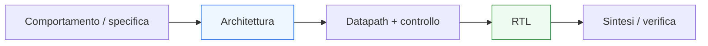

# Dal comportamento all’RTL

Dopo aver costruito i fondamenti della progettazione digitale — segnali, logica combinatoria e sequenziale, clock, registri, datapath, FSM, pipeline e interfacce — il passo successivo naturale è chiarire come questi concetti vengano trasformati in una descrizione **RTL**. In questa pagina il focus è proprio sul passaggio da:
- **idea funzionale**
- **comportamento architetturale**
- **struttura del blocco**
a
- **descrizione RTL leggibile e sintetizzabile**

Questa lezione è molto importante perché molti studenti vedono l’RTL come “codice HDL”. In realtà l’RTL è molto più di questo: è il punto in cui un comportamento viene organizzato in termini di:
- registri;
- logica combinatoria;
- segnali di controllo;
- flusso del dato;
- evoluzione temporale del sistema.

Dal punto di vista progettuale, questa pagina serve a chiarire:
- che cosa significhi davvero descrivere un blocco a livello RTL;
- come si passi da una funzione o specifica a una microarchitettura;
- come si separino datapath e controllo;
- perché alcune descrizioni siano più leggibili, sintetizzabili e verificabili di altre;
- perché l’RTL sia il ponte naturale tra architettura, sintesi, timing e verifica.

Questa pagina mantiene il taglio della sezione:
- didattico ma tecnico;
- concettuale ma vicino al progetto reale;
- orientato alla lettura dell’hardware;
- accompagnato da schemi ed esempi quando utili.

## 1. Perché serve una pagina su questo passaggio

La prima domanda utile è: perché dedicare una pagina specifica al passaggio dal comportamento all’RTL?

### 1.1 Perché il salto non è automatico
Conoscere:
- logica combinatoria;
- registri;
- FSM;
- pipeline;

non significa ancora saper costruire una descrizione RTL ordinata.

### 1.2 Perché un comportamento può essere implementato in più modi
Lo stesso requisito funzionale può essere tradotto in:
- una architettura semplice ma lenta;
- una architettura pipelined;
- una struttura con controllo esplicito;
- una soluzione più o meno leggibile o riusabile.

### 1.3 Perché è importante
L’RTL non è una semplice “trascrizione” della funzione. È una scelta architetturale e strutturale.

---

## 2. Che cos’è davvero l’RTL

RTL significa **Register Transfer Level**.

### 2.1 Significato essenziale
È il livello in cui il progetto viene descritto in termini di:
- registri che memorizzano stato o dati;
- logica combinatoria che trasforma l’informazione tra registri;
- controllo che decide il flusso del dato;
- comportamento organizzato in cicli.

### 2.2 Perché è importante
L’RTL è il punto in cui l’architettura del blocco diventa abbastanza concreta da:
- essere sintetizzata;
- essere verificata;
- essere letta in termini di timing;
- essere integrata in un sistema più grande.

### 2.3 Perché non coincide con la sola sintassi HDL
Un codice può essere scritto in un HDL e non essere comunque una buona descrizione RTL. La qualità RTL dipende da come la struttura del blocco viene organizzata.

---

## 3. Dal “che cosa fa” al “come lo fa”

Questo è il passaggio più importante.

### 3.1 Livello del comportamento
Qui si ragiona in termini di:
- quale funzione il blocco deve svolgere;
- quali ingressi riceve;
- quali uscite produce;
- in quali condizioni cambia comportamento.

### 3.2 Livello RTL
Qui si ragiona in termini di:
- quali registri servono;
- dove passa il dato;
- quali mux selezionano i percorsi;
- quali segnali di controllo servono;
- come si organizza il comportamento nel tempo.

### 3.3 Perché è importante
Il comportamento dice **che cosa deve accadere**. L’RTL dice **con quale struttura hardware accade**.

---

## 4. Dal requisito al blocco architetturale

Prima dell’RTL, conviene quasi sempre fare almeno un passaggio architetturale.

### 4.1 Che cosa ci si chiede
- serve uno stato interno?
- serve una FSM?
- quanti registri sono necessari?
- conviene pipeline il percorso dati?
- il blocco lavora in un solo ciclo o in più cicli?
- che interfaccia espone verso l’esterno?

### 4.2 Perché è importante
Questo evita di scrivere RTL “alla cieca” e aiuta a costruire un modulo coerente con i requisiti.

### 4.3 Messaggio progettuale
Un buon RTL nasce quasi sempre da una buona microarchitettura, non da improvvisazione sintattica.

---

## 5. Il ruolo della microarchitettura

La **microarchitettura** è l’organizzazione concreta del blocco in termini di componenti interni e relazioni tra essi.

### 5.1 Che cosa include
- datapath;
- control unit;
- registri;
- pipeline;
- percorsi combinatori;
- interfacce;
- segnali di stato.

### 5.2 Perché è importante
L’RTL è la forma descrittiva della microarchitettura.

### 5.3 Conseguenza progettuale
Prima di scrivere o leggere RTL, conviene spesso chiedersi:
- qual è la microarchitettura del blocco?

---

## 6. Separare datapath e controllo

Uno dei principi più utili per passare bene all’RTL è distinguere:
- **datapath**
- **control unit**

### 6.1 Datapath
Trasporta e trasforma i dati.

### 6.2 Control unit
Decide:
- quando caricare;
- quale mux selezionare;
- quando avanzare di stato;
- quando dichiarare disponibile il risultato.

### 6.3 Perché è importante
Questa separazione rende il progetto:
- più leggibile;
- più verificabile;
- più modulare;
- più vicino al modo reale in cui molti blocchi sono organizzati.

---

## 7. Il ruolo dei registri nell’RTL

Nel passaggio all’RTL, una delle prime domande da porsi è:
- **quali valori devono essere memorizzati?**

### 7.1 Esempi tipici
- stato della FSM;
- dato di ingresso catturato;
- valore intermedio del datapath;
- uscita registrata;
- contatori;
- flag.

### 7.2 Perché è importante
Ogni registro definisce:
- uno stato del sistema;
- un confine temporale;
- un punto di campionamento del dato.

### 7.3 Conseguenza progettuale
Trovare i registri giusti è una parte essenziale del passaggio dal comportamento all’RTL.

---

## 8. Il ruolo della logica combinatoria nell’RTL

Una volta identificati i registri, bisogna capire che cosa accade **tra** di essi.

### 8.1 Che cosa include la logica combinatoria
- operazioni sui dati;
- comparazioni;
- selezione mux;
- calcolo del prossimo stato;
- generazione di segnali di controllo;
- decodifica.

### 8.2 Perché è importante
L’RTL si legge molto spesso come:
- registri;
- logica combinatoria tra i registri;
- controllo dell’aggiornamento.

### 8.3 Messaggio utile
Una buona descrizione RTL rende molto chiaro che cosa è stato e che cosa è trasformazione combinatoria.

---

## 9. Il ruolo della FSM nel passaggio all’RTL

Quando il comportamento si sviluppa in più fasi, la FSM diventa spesso la struttura naturale di controllo.

### 9.1 Che cosa governa
- transizioni di stato;
- enable dei registri;
- selezioni dei mux;
- attivazione di output di controllo;
- protocolli di start/done o valid/ready.

### 9.2 Perché è importante
Molti comportamenti descritti verbalmente come sequenze:
- “prima fai questo”
- “poi aspetta”
- “poi elabora”
- “poi segnala il risultato”

si trasformano molto naturalmente in una FSM più un datapath.

### 9.3 Conseguenza progettuale
Il passaggio all’RTL coincide spesso con il riconoscimento di:
- uno stato;
- una sequenza;
- un controllo esplicito.

---

## 10. Il ruolo delle interfacce nell’RTL

L’RTL non descrive solo il comportamento interno. Deve anche tradurre in struttura:
- l’interfaccia esterna;
- i segnali di validità;
- i protocolli di trasferimento;
- il significato temporale del dato.

### 10.1 Perché è importante
Un comportamento del tipo:
- “accetta un dato quando valido”
- “mantieni l’uscita finché non viene accettata”
- “segnala completamento al termine”

deve diventare una combinazione concreta di:
- registri;
- controllo;
- segnali di protocollo.

### 10.2 Conseguenza
L’interfaccia non è un dettaglio da aggiungere dopo. Fa parte del progetto RTL fin dall’inizio.

---

## 11. Esempio concettuale: da descrizione verbale a RTL

Consideriamo questo comportamento:

- il blocco aspetta un ingresso valido;
- quando lo riceve, cattura il dato;
- applica una trasformazione semplice;
- produce il risultato due cicli dopo;
- segnala che l’uscita è valida.

### 11.1 Lettura comportamentale
Questa descrizione non dice ancora:
- quanti registri usare;
- dove collocare la trasformazione;
- se serve una FSM;
- come gestire `valid`.

### 11.2 Lettura architetturale
Una possibile microarchitettura potrebbe avere:
- un registro di ingresso;
- una logica combinatoria di trasformazione;
- un registro pipeline;
- un segnale `out_valid` ritardato in modo coerente;
- una piccola control unit.

### 11.3 Lettura RTL
A questo punto il blocco può essere descritto come:
- percorso dati registrato;
- segnali di enable;
- aggiornamento di validità;
- eventuale stato di controllo.

### 11.4 Perché è importante
Mostra che il passaggio dal comportamento all’RTL è un lavoro di organizzazione, non di sola scrittura.

---

## 12. Esempio concettuale: blocco start/done

Consideriamo ora un comportamento multi-ciclo:

- il blocco aspetta `start`;
- acquisisce il dato;
- esegue l’elaborazione;
- al termine alza `done`.

### 12.1 Che cosa suggerisce
Questa descrizione suggerisce quasi naturalmente:
- uno stato `IDLE`;
- uno stato di esecuzione;
- uno stato di completamento;
- registri per memorizzare dato e risultato;
- controllo esplicito del protocollo.

### 12.2 Perché è importante
È un esempio classico di passaggio da comportamento a:
- FSM;
- datapath;
- interfaccia.

### 12.3 Conseguenza progettuale
La descrizione verbale inizia a trasformarsi in blocchi architetturali concreti.

---

## 13. Dalla funzione alla scelta del numero di cicli

Uno degli aspetti più importanti del passaggio all’RTL è decidere:
- il blocco lavora in un solo ciclo?
- oppure in più cicli?

### 13.1 Perché è importante
Questa scelta influenza:
- numero di registri;
- necessità di una FSM;
- pipeline;
- latenza;
- interfaccia;
- complessità della verifica.

### 13.2 Caso a singolo ciclo
Può essere più semplice concettualmente, ma rischia di concentrare troppa logica combinatoria.

### 13.3 Caso multi-ciclo o pipelined
Può migliorare timing e struttura del flusso, ma richiede più controllo e più disciplina nel progetto.

---

## 14. L’RTL come compromesso architetturale

Una descrizione RTL non è mai soltanto “giusta o sbagliata”. Spesso è un compromesso.

### 14.1 Tra che cosa
Tra:
- semplicità;
- area;
- timing;
- latenza;
- throughput;
- leggibilità;
- verificabilità;
- riusabilità.

### 14.2 Perché è importante
Lo stesso comportamento può essere implementato con scelte RTL diverse, tutte corrette funzionalmente ma non equivalenti progettualmente.

### 14.3 Messaggio progettuale
L’RTL è una disciplina di progettazione, non una mera traduzione sintattica.

---

## 15. Qualità dell’RTL

Una volta compreso il passaggio dal comportamento alla struttura, bisogna chiedersi che cosa renda “buono” un RTL.

### 15.1 Proprietà desiderabili
Un buon RTL tende a essere:
- leggibile;
- ben strutturato;
- prevedibile per la sintesi;
- coerente con il timing;
- facile da verificare;
- facile da integrare.

### 15.2 Perché è importante
Molti problemi dei progetti reali non nascono da errore funzionale grezzo, ma da RTL:
- opaco;
- ambiguo;
- poco strutturato;
- difficile da mantenere.

### 15.3 Conseguenza
Imparare il passaggio dal comportamento all’RTL significa anche imparare a valutare la qualità della struttura risultante.

---

## 16. Errori comuni in questo passaggio

Ci sono alcuni errori molto frequenti quando si passa ai primi RTL.

### 16.1 Scrivere senza architettura
Si prova a “codificare subito” senza aver chiarito:
- registri;
- controllo;
- interfacce;
- numero di cicli;
- flusso del dato.

### 16.2 Mescolare troppo controllo e datapath
Il risultato diventa meno leggibile e meno verificabile.

### 16.3 Non distinguere stato e combinatoria
Questo rende più difficile leggere il modulo in termini di timing e sintesi.

### 16.4 Ignorare il protocollo esterno
Il blocco può anche funzionare internamente, ma essere difficile da integrare.

### 16.5 Pensare che la funzione basti
La funzione dice cosa fare. L’RTL deve anche dire come farlo in hardware.

---

## 17. Buone pratiche concettuali

Anche a questo livello, alcune regole mentali aiutano moltissimo.

### 17.1 Parti dal comportamento, ma non fermarti lì
Chiediti sempre:
- che struttura richiede davvero?

### 17.2 Individua per primi:
- registri;
- stato;
- percorsi dati;
- segnali di controllo;
- interfacce.

### 17.3 Separa ruoli diversi
- dato
- controllo
- stato
- protocolli

Questa separazione migliora la qualità dell’RTL.

### 17.4 Pensa già a sintesi, timing e verifica
Un buon passaggio all’RTL tiene conto fin da subito di:
- cammini combinatori;
- latenza;
- chiarezza del testbench;
- leggibilità della microarchitettura.

---

## 18. Collegamento con il resto della sezione

Questa pagina si collega direttamente alle prossime tappe del branch:
- **`synthesis-area-and-timing.md`**, perché una volta costruito l’RTL conviene leggerlo dal punto di vista di sintesi, area e percorsi temporali;
- **`common-design-pitfalls.md`**, dove molti errori verranno riletti come problemi di modellazione RTL;
- **`basic-verification-and-debug.md`**, perché un buon RTL è anche più facile da verificare e debuggare;
- **`from-block-to-system.md`**, dove l’RTL dei singoli blocchi verrà collocato in un sistema più ampio;
- **`case-study.md`**, dove il passaggio dal comportamento alla microarchitettura verrà mostrato in un esempio unitario.

---

## 19. In sintesi

Il passaggio dal comportamento all’RTL è uno dei momenti più importanti della progettazione digitale.

- Il **comportamento** dice che cosa deve fare il blocco.
- La **microarchitettura** organizza come quel comportamento verrà realizzato.
- L’**RTL** traduce quella organizzazione in termini di registri, logica combinatoria, controllo e interfacce.

Capire bene questo passaggio significa smettere di vedere l’RTL come semplice codice e iniziare a leggerlo come descrizione strutturata di hardware reale.

## Prossimo passo

Il passo successivo naturale è **`synthesis-area-and-timing.md`**, perché adesso conviene vedere come l’RTL venga valutato dal punto di vista di:
- sintesi
- area
- profondità logica
- cammino critico
- qualità architetturale del blocco
