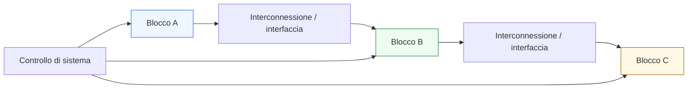
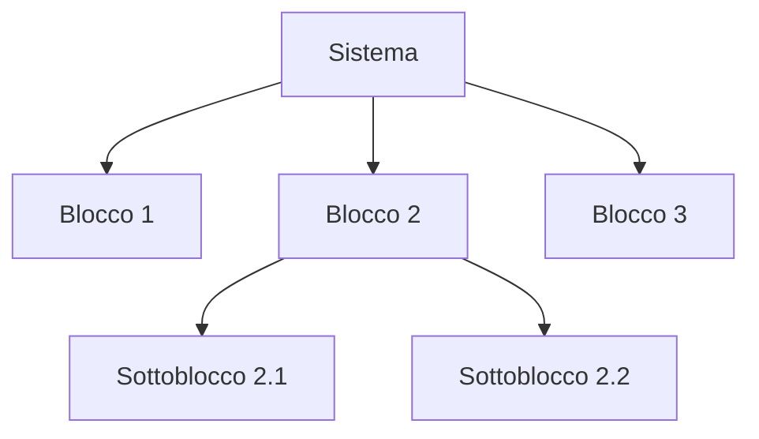
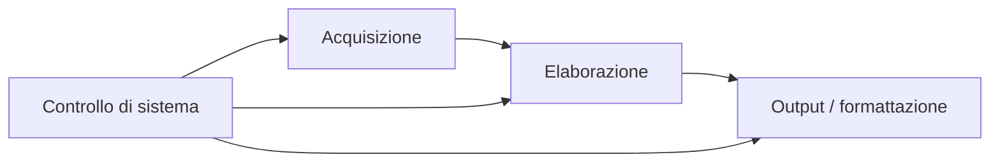

# Dal blocco al sistema

Dopo aver costruito i fondamenti della progettazione digitale e aver introdotto anche il lato della verifica, il passo successivo naturale è ampliare la prospettiva: non guardare più solo il **singolo blocco**, ma capire come quel blocco si inserisca in un **sistema** più grande. In questa pagina il focus è proprio sul passaggio da:
- **modulo isolato**
a
- **componente di una architettura più ampia**

Questa lezione è molto importante perché molti blocchi digitali, presi da soli, sono facili da capire, ma cambiano profondamente significato quando devono:
- comunicare con altri moduli;
- stare dentro una gerarchia;
- condividere clock, reset o protocolli;
- essere coordinati da una architettura di controllo più ampia;
- partecipare a un flusso dati distribuito;
- rispettare vincoli di sistema, non solo locali.

Dal punto di vista progettuale, questa pagina serve a chiarire:
- che cosa significhi passare dal blocco al sistema;
- perché la gerarchia sia fondamentale;
- come interconnessioni e interfacce cambino la lettura dei moduli;
- che ruolo abbiano integrazione, composizione e riuso;
- perché la qualità di un progetto si misuri anche nella sua capacità di vivere bene dentro un sistema più grande.

Questa pagina mantiene il taglio della sezione:
- didattico ma tecnico;
- concettuale ma vicino al progetto reale;
- orientato alla lettura architetturale;
- accompagnato da schemi ed esempi quando utili.

## 1. Perché serve questa prospettiva

La prima domanda utile è: perché non basta capire bene il singolo modulo?

### 1.1 Perché quasi nessun blocco vive isolato
Nella pratica, un modulo deve quasi sempre:
- ricevere dati da altri blocchi;
- inviare risultati a moduli successivi;
- condividere protocolli;
- essere coordinato da logiche superiori;
- inserirsi in una gerarchia più ampia.

### 1.2 Perché i problemi cambiano scala
Un blocco può essere corretto localmente, ma introdurre difficoltà quando entra in un sistema:
- interfacce ambigue;
- latenza poco chiara;
- controllo difficile da integrare;
- reset non coerente;
- timing locale buono ma difficile da sostenere a livello globale.

### 1.3 Perché è importante
Capire il passaggio dal blocco al sistema aiuta a leggere la progettazione digitale non come somma di moduli isolati, ma come costruzione di architetture cooperanti.

---

## 2. Che cos’è un sistema digitale

Un **sistema digitale** è un insieme organizzato di blocchi che cooperano per realizzare una funzione complessiva.

### 2.1 Significato essenziale
Un sistema contiene tipicamente:
- più moduli;
- interconnessioni tra i moduli;
- controllo locale e globale;
- percorsi dati distribuiti;
- interfacce e protocolli;
- gerarchie funzionali.

### 2.2 Perché è importante
Il significato di un blocco cambia quando viene visto non più come entità autonoma, ma come parte di una rete di relazioni.

### 2.3 Conseguenza progettuale
La qualità del sistema dipende non solo da quanto sono buoni i singoli blocchi, ma anche da quanto bene interagiscono tra loro.

---

## 3. Il ruolo della gerarchia

Uno dei concetti più importanti nel passaggio dal blocco al sistema è la **gerarchia**.

### 3.1 Che cos’è
La gerarchia è l’organizzazione del progetto in livelli:
- sottoblocchi;
- blocchi intermedi;
- moduli di più alto livello;
- sistema complessivo.

### 3.2 Perché serve
Serve a:
- gestire la complessità;
- riusare componenti;
- isolare funzioni;
- separare responsabilità;
- costruire sistemi leggibili.

### 3.3 Perché è importante
Senza gerarchia, la progettazione di sistemi reali diventerebbe rapidamente ingestibile.

---

## 4. Modulo e responsabilità architetturale

Quando un blocco entra in un sistema, conviene chiedersi quale sia la sua **responsabilità**.

### 4.1 Domande utili
- che ruolo ha nel sistema?
- elabora dati?
- coordina altri moduli?
- arbitra accessi?
- fa buffering?
- converte protocolli?
- gestisce il controllo?

### 4.2 Perché è importante
Un blocco ben definito è più facile da:
- progettare;
- integrare;
- verificare;
- riusare.

### 4.3 Messaggio progettuale
Il valore di un modulo non dipende solo da come funziona internamente, ma anche da quanto è chiaro il suo ruolo nella gerarchia.

---

## 5. Interconnessioni: dove i blocchi si incontrano

Nel passaggio al sistema, le **interconnessioni** diventano centrali.

### 5.1 Che cosa sono
Sono i percorsi e le relazioni attraverso cui i blocchi:
- si scambiano dati;
- si coordinano;
- condividono controllo;
- partecipano al comportamento di sistema.

### 5.2 Perché sono importanti
Molti problemi architetturali reali non stanno dentro i blocchi, ma tra i blocchi.

### 5.3 Esempi
- bus dati;
- segnali di start/done;
- valid/ready;
- linee di controllo;
- percorsi di stato o flag;
- connessioni gerarchiche.

---

## 6. Interfacce locali e interfacce di sistema

Un blocco può essere descritto bene localmente ma avere una interfaccia poco adatta al sistema.

### 6.1 Interfaccia locale
Può essere sufficiente per un testbench semplice o per una vista isolata del blocco.

### 6.2 Interfaccia di sistema
Deve essere letta anche in termini di:
- chiarezza;
- integrazione;
- compatibilità con altri moduli;
- semantica temporale;
- protocollo.

### 6.3 Perché è importante
Il passaggio al sistema spinge a valutare l’interfaccia non solo come “porta del modulo”, ma come punto di incontro con il resto dell’architettura.

---

## 7. Dato locale e flusso di sistema

Nel singolo blocco si guarda spesso il dato come entità interna. Nel sistema bisogna invece vedere il **flusso complessivo**.

### 7.1 Che cosa significa
Un dato:
- nasce in un blocco;
- attraversa uno o più moduli;
- può essere registrato più volte;
- può subire trasformazioni progressive;
- può venire filtrato o validato da protocolli intermedi.

### 7.2 Perché è importante
Questo trasforma la lettura del datapath: non più solo percorso locale, ma parte di una catena funzionale più ampia.

### 7.3 Conseguenza progettuale
Il progettista deve chiedersi non solo:
- che cosa fa il blocco al dato,
ma anche:
- come quel dato continua a vivere nel sistema.

---

## 8. Controllo locale e controllo globale

Un altro concetto importante è distinguere tra:
- **controllo locale**
- **controllo globale di sistema**

### 8.1 Controllo locale
È quello interno al blocco:
- FSM;
- enable;
- mux;
- segnali di validità.

### 8.2 Controllo globale
È quello che coordina:
- più moduli;
- più fasi operative del sistema;
- protocolli tra sottoblocchi;
- sequencing di alto livello.

### 8.3 Perché è importante
Un blocco può avere un controllo perfettamente sensato in locale, ma difficile da armonizzare con il controllo di sistema.

---

## 9. Il ruolo della composizione

Un sistema digitale cresce tramite **composizione** di blocchi.

### 9.1 Che cosa significa
Si prendono moduli con ruoli chiari e li si combina in una struttura più ampia.

### 9.2 Perché è importante
La composizione è il cuore della progettazione gerarchica:
- non si ricostruisce tutto da zero;
- si organizzano moduli con responsabilità diverse;
- si controlla la complessità tramite livelli.

### 9.3 Conseguenza progettuale
Un buon blocco è spesso un blocco che si lascia comporre facilmente.

---

## 10. Riuso e modularità

Il passaggio al sistema rende molto più evidente il valore del **riuso**.

### 10.1 Perché
Quando un modulo ha:
- ruolo chiaro;
- interfaccia leggibile;
- comportamento ben delimitato;
- protocolli comprensibili;

allora può essere riutilizzato più facilmente in altri contesti.

### 10.2 Perché è importante
Il riuso riduce:
- duplicazione del lavoro;
- rischio di errori;
- complessità di manutenzione.

### 10.3 Messaggio progettuale
Progettare bene un blocco significa spesso progettare bene anche la sua riusabilità.

---

## 11. Latenza osservata a livello di sistema

Un tema già visto localmente cambia significato quando si passa a una catena di blocchi.

### 11.1 Perché
La latenza di sistema non è solo la latenza del singolo modulo, ma la combinazione di:
- più stadi;
- più registrazioni;
- protocolli di attesa;
- eventuali code o buffering;
- coordinamento di controllo.

### 11.2 Perché è importante
Un blocco con latenza chiara localmente può comunque contribuire a una latenza complessiva non banale.

### 11.3 Conseguenza progettuale
La lettura temporale va estesa dal modulo alla catena di moduli.

---

## 12. Throughput osservato a livello di sistema

Anche il throughput va riletto a livello più ampio.

### 12.1 Perché
Il throughput complessivo del sistema può essere limitato dal blocco più lento o dal punto in cui il flusso viene strozzato.

### 12.2 Che cosa significa
Anche se un blocco locale è molto efficiente, il sistema complessivo può avere throughput minore per colpa di:
- handshake non ben bilanciati;
- blocchi non sempre pronti;
- pipeline non armonizzate;
- controllo di sistema troppo seriale.

### 12.3 Perché è importante
Questo mostra che le prestazioni reali sono proprietà della composizione, non solo dei singoli blocchi.

---

## 13. Reset di blocco e reset di sistema

Il reset assume una prospettiva più ampia quando si passa alla gerarchia.

### 13.1 Perché
Non basta che il singolo modulo parta bene. Bisogna anche capire:
- come si allineano i reset dei diversi blocchi;
- in che ordine vengono inizializzati;
- quali moduli devono essere pronti prima di altri;
- come il sistema torna a una condizione nota.

### 13.2 Perché è importante
Un reset locale corretto non garantisce automaticamente una inizializzazione coerente del sistema.

### 13.3 Conseguenza progettuale
Il reset va pensato anche come problema di coordinamento tra moduli.

---

## 14. Clock locale e coordinamento di sistema

Anche il clock cambia scala di significato.

### 14.1 Nel singolo blocco
Serve a:
- aggiornare stato;
- campionare dati;
- scandire la FSM;
- far avanzare la pipeline.

### 14.2 Nel sistema
Bisogna capire:
- quali moduli condividono lo stesso ritmo;
- come si coordinano domini diversi;
- come si allineano protocolli e latenza tra blocchi.

### 14.3 Perché è importante
Il tempo di sistema non coincide sempre con il tempo locale del singolo modulo.

---

## 15. Esempio concettuale: catena di elaborazione

Immaginiamo tre blocchi collegati:
- acquisizione dati;
- elaborazione;
- formattazione o uscita.

### 15.1 Che cosa cambia rispetto al singolo blocco
Bisogna osservare:
- chi produce;
- chi consuma;
- quando il dato passa;
- se le latenze si sommano;
- se il controllo globale coordina la sequenza;
- se i protocolli sono coerenti.

### 15.2 Perché è importante
Mostra subito che la progettazione di sistema non è solo la somma meccanica di moduli.

### 15.3 Messaggio progettuale
Un buon sistema nasce da blocchi buoni, ma anche da connessioni buone tra quei blocchi.

---

## 16. Esempio concettuale: producer, buffer, consumer

Consideriamo un producer che genera dati, un buffer intermedio e un consumer finale.

### 16.1 Che cosa bisogna valutare
- quando il producer può inviare;
- quando il buffer deve trattenere il dato;
- quando il consumer è pronto;
- se esiste backpressure;
- se la latenza resta accettabile.

### 16.2 Perché è importante
Questo esempio mostra bene come:
- interfaccia;
- pipeline;
- controllo;
- organizzazione del flusso

diventino problemi di sistema.

---

## 17. Verifica locale e verifica di integrazione

Anche la verifica cambia scala.

### 17.1 Verifica locale
Controlla il singolo modulo:
- funzione;
- stato;
- protocollo;
- latenza;
- comportamento interno.

### 17.2 Verifica di integrazione
Controlla:
- comunicazione tra moduli;
- rispetto delle interfacce;
- allineamento dei protocolli;
- comportamento del flusso complessivo;
- coordinamento tra controllo locale e controllo globale.

### 17.3 Perché è importante
Un blocco può passare tutti i test locali e fallire quando viene connesso agli altri.

---

## 18. Osservabilità e debug a livello di sistema

Anche il debug cambia natura quando si allarga la gerarchia.

### 18.1 Perché
Non basta più vedere:
- ingresso e uscita del singolo modulo.

Bisogna spesso seguire:
- il dato attraverso più blocchi;
- il protocollo di trasferimento;
- la sequenza globale degli eventi;
- le latenze accumulate;
- le interazioni tra più FSM.

### 18.2 Perché è importante
I bug di integrazione sono spesso più sottili di quelli locali.

### 18.3 Conseguenza progettuale
La chiarezza delle interfacce e dei segnali di sistema aiuta moltissimo il debug.

---

## 19. Errori comuni nel passaggio dal blocco al sistema

Ci sono alcuni errori molto frequenti quando si cambia scala di osservazione.

### 19.1 Pensare che un blocco corretto sia automaticamente integrabile
La correttezza locale non basta.

### 19.2 Trascurare interfacce e protocolli
Molti problemi di sistema nascono proprio lì.

### 19.3 Ignorare latenza e throughput complessivi
Le prestazioni locali non si sommano in modo automatico.

### 19.4 Non distinguere controllo locale e globale
Il sistema diventa più difficile da coordinare.

### 19.5 Vedere il sistema come “solo tanti blocchi”
In realtà conta anche:
- come si collegano;
- come si sincronizzano;
- come si osservano;
- come si gestiscono i flussi.

---

## 20. Buone pratiche concettuali

Anche a questo livello, alcune abitudini mentali sono molto utili.

### 20.1 Definisci bene il ruolo di ogni modulo
Un blocco è più facile da integrare se la sua responsabilità è chiara.

### 20.2 Progetta interfacce leggibili
L’interfaccia è il punto in cui il blocco entra davvero nel sistema.

### 20.3 Segui il flusso del dato a livello globale
Non limitarti al datapath interno del modulo.

### 20.4 Distingui chiaramente le scale del controllo
- controllo locale del blocco
- coordinamento globale del sistema

### 20.5 Verifica sempre anche l’integrazione
Un progetto serio non si ferma alla validazione locale.

---

## 21. Collegamento con il resto della sezione

Questa pagina si collega direttamente alle prossime tappe del branch:
- **`fpga-asic-soc-contexts.md`**, dove il passaggio al sistema verrà riletto nei principali contesti implementativi;
- **`case-study.md`**, che chiuderà la sezione ricomponendo i concetti in un esempio unitario.

Si collega anche a quasi tutte le pagine precedenti, perché:
- registri, mux e datapath diventano sottoblocchi di sistemi;
- FSM e controllo si inseriscono in gerarchie più ampie;
- pipeline, latenza e throughput assumono significato di sistema;
- interfacce e handshake diventano ancora più centrali.

---

## 22. In sintesi

Il passaggio dal blocco al sistema è il momento in cui la progettazione digitale smette di essere letta come somma di moduli isolati e diventa davvero architettura.

- La **gerarchia** aiuta a gestire la complessità.
- Le **interconnessioni** danno significato al rapporto tra i moduli.
- Le **interfacce** definiscono il contratto di integrazione.
- Latenza, throughput, controllo e verifica devono essere riletti su scala più ampia.

Capire bene questo passaggio significa prepararsi a leggere architetture digitali reali come reti organizzate di blocchi cooperanti.

## Prossimo passo

Il passo successivo naturale è **`fpga-asic-soc-contexts.md`**, perché adesso conviene vedere come tutti i fondamenti costruiti fin qui cambino sensibilità e priorità quando vengono collocati nei principali contesti reali della progettazione digitale:
- FPGA
- ASIC
- SoC
