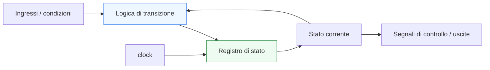
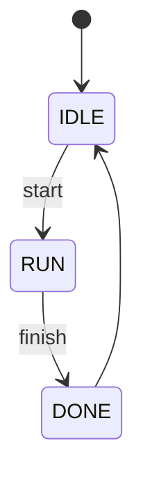
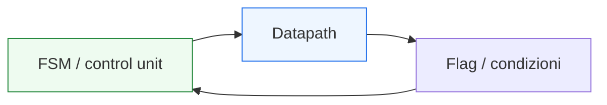

# FSM e logica di controllo

Dopo aver introdotto **registri**, **multiplexer** e **datapath elementari**, il passo successivo naturale è affrontare il blocco che governa in modo esplicito il comportamento del sistema nel tempo: la **FSM**, cioè la **Finite State Machine**, o **macchina a stati finiti**. In questa pagina il focus è sul rapporto tra:
- **stato**
- **transizioni**
- **controllo**
- **segnali di comando**

Questa lezione è molto importante perché molti sistemi digitali non si limitano a trasformare dati. Devono anche decidere:
- quando iniziare una operazione;
- quando attendere;
- quando cambiare fase di comportamento;
- quando abilitare registri e mux;
- quando segnalare completamento o disponibilità dell’uscita.

Dal punto di vista progettuale, questa pagina serve a chiarire:
- che cos’è una FSM;
- perché è il modello naturale di molti comportamenti di controllo;
- come lo stato organizzi l’evoluzione del sistema;
- come la control unit governi il datapath;
- perché FSM e controllo siano centrali in quasi ogni architettura digitale non banale.

Questa pagina mantiene il taglio della sezione:
- didattico ma tecnico;
- concettuale ma vicino al progetto reale;
- orientato alla lettura dell’hardware;
- accompagnato da schemi ed esempi quando utili.

## 1. Perché serve una logica di controllo

La prima domanda utile è: perché un sistema digitale ha bisogno di una control unit?

### 1.1 Perché il datapath da solo non basta
Un datapath può:
- memorizzare dati;
- trasformarli;
- selezionare percorsi;

ma spesso non “sa” da solo:
- quando caricare un registro;
- quale mux selezionare;
- quando attendere un ingresso valido;
- quando dichiarare l’operazione completata.

### 1.2 Perché molti comportamenti si sviluppano in più fasi
Molti blocchi lavorano come una sequenza:
- attesa;
- acquisizione;
- elaborazione;
- produzione del risultato;
- ritorno alla condizione iniziale.

### 1.3 Perché è importante
Serve quindi una struttura che organizzi questa sequenza nel tempo. Questa struttura è spesso proprio una FSM.

---

## 2. Che cos’è una FSM

Una **Finite State Machine** è un modello di comportamento in cui il sistema evolve tra un insieme finito di stati.

### 2.1 Significato essenziale
Una FSM descrive:
- in quale stato si trova il sistema;
- in quali condizioni può passare a un altro stato;
- quali uscite o comandi siano associati ai diversi stati.

### 2.2 Perché è utile
Permette di rappresentare in modo ordinato comportamenti come:
- attesa di un evento;
- sequenza di passi;
- gestione di un protocollo;
- controllo di un datapath;
- coordinamento di operazioni multi-ciclo.

### 2.3 Perché è importante
La FSM è uno dei modelli più naturali per descrivere il controllo nei sistemi digitali.

---

## 3. Perché si chiama “a stati finiti”

Il termine “a stati finiti” significa che il sistema può trovarsi solo in un numero finito di condizioni interne esplicitamente definite.

### 3.1 Che cos’è uno stato
Uno stato rappresenta una fase del comportamento del sistema.

### 3.2 Esempi intuitivi di stati
- `IDLE`
- `WAIT`
- `LOAD`
- `RUN`
- `DONE`

### 3.3 Perché è utile usare stati
Aiuta a dire in modo chiaro:
- dove si trova il sistema;
- che cosa deve fare ora;
- quali transizioni siano possibili;
- quali segnali di controllo debbano essere attivi.

---

## 4. Stato e memoria del controllo

La FSM è una forma particolare di logica sequenziale, quindi vive grazie alla memoria dello stato.

### 4.1 Che cosa significa
Lo stato corrente deve essere memorizzato tra un ciclo e il successivo.

### 4.2 Come viene memorizzato
Dal punto di vista hardware, lo stato è conservato in un registro di stato.

### 4.3 Perché è importante
Senza memoria dello stato, la macchina non potrebbe:
- sapere in quale fase del comportamento si trova;
- avanzare in modo ordinato;
- reagire in modo diverso agli stessi ingressi in momenti diversi.

---

## 5. Gli elementi fondamentali di una FSM

Una FSM ben letta può essere scomposta in tre grandi elementi.

### 5.1 Stato corrente
Indica la fase attuale del comportamento.

### 5.2 Logica di transizione
Decide quale sarà il prossimo stato in funzione:
- dello stato corrente;
- degli ingressi o delle condizioni attuali.

### 5.3 Logica di uscita o di controllo
Genera i segnali di comando associati allo stato o alla combinazione tra stato e ingressi.

### 5.4 Perché è importante
Questa scomposizione aiuta a capire la FSM come vera architettura di controllo.

---

## 6. La FSM come control unit

In moltissimi blocchi digitali, la FSM coincide di fatto con la **control unit**.

### 6.1 Che cosa significa
La macchina a stati:
- osserva ingressi e condizioni;
- decide se avanzare o attendere;
- genera enable;
- seleziona mux;
- controlla registri;
- segnala completamento.

### 6.2 Perché è importante
Mostra il rapporto diretto tra stato e comportamento del modulo.

### 6.3 Collegamento con il datapath
La FSM spesso non elabora direttamente i dati, ma governa chi li elabora.

---

## 7. Esempio intuitivo: attesa, esecuzione, completamento

Consideriamo un blocco molto semplice che:
- aspetta un comando di avvio;
- esegue una operazione;
- segnala il completamento;
- torna in attesa.

### 7.1 Stati possibili
- `IDLE`
- `RUN`
- `DONE`

### 7.2 Significato
- `IDLE`: il sistema aspetta
- `RUN`: il sistema sta lavorando
- `DONE`: il sistema segnala che ha terminato

### 7.3 Perché è un buon esempio
Mostra subito come una FSM rappresenti una sequenza ordinata di fasi.

---

## 8. Transizioni di stato

Uno degli aspetti più importanti di una FSM è il modo in cui il sistema passa da uno stato all’altro.

### 8.1 Che cosa determina una transizione
Una transizione dipende tipicamente da:
- stato corrente;
- ingressi;
- eventi;
- condizioni locali del sistema;
- eventualmente contatori o flag interni.

### 8.2 Perché è importante
La transizione è il punto in cui il controllo decide:
- restare;
- avanzare;
- cambiare direzione;
- completare una sequenza.

### 8.3 Conseguenza progettuale
Molti bug di controllo nascono proprio da transizioni di stato incomplete o mal definite.

---

## 9. FSM e segnali di comando

Il controllo non è utile solo a cambiare stato. Deve anche comandare il resto del blocco.

### 9.1 Esempi di segnali di controllo
- `load_reg`
- `sel_mux`
- `enable`
- `clear`
- `valid_out`
- `done`

### 9.2 Perché sono importanti
Questi segnali mettono in collegamento la control unit con:
- registri;
- mux;
- datapath;
- interfacce.

### 9.3 Messaggio progettuale
La FSM è davvero utile quando si traduce in comandi concreti sul comportamento dell’architettura.

---

## 10. FSM e datapath: relazione fondamentale

Una delle relazioni più importanti dell’intera progettazione digitale è quella tra:
- **datapath**
- **control unit**

### 10.1 Il datapath
Trasporta e trasforma i dati.

### 10.2 La control unit
Decide:
- quando caricare;
- quale percorso selezionare;
- quando avanzare;
- quando fermarsi;
- quando produrre segnali di validità.

### 10.3 Perché è importante
Una FSM ben progettata rende il datapath leggibile e governabile nel tempo.

---

## 11. FSM e tempo

La FSM è una struttura temporale per eccellenza.

### 11.1 Perché
Ogni stato rappresenta una fase del comportamento nel tempo.

### 11.2 Che cosa significa
Il sistema non esegue tutto “insieme”, ma attraverso:
- passi;
- cicli;
- transizioni;
- permanenze in certe condizioni.

### 11.3 Perché è importante
Questo lega in modo diretto la FSM a:
- clock;
- registri;
- latenza;
- comportamento multi-ciclo.

---

## 12. FSM e clock

La FSM è una struttura sequenziale, quindi si appoggia naturalmente al clock.

### 12.1 Che cosa significa
Il registro di stato viene tipicamente aggiornato ai fronti di clock.

### 12.2 Perché è importante
Questo rende il comportamento:
- sincronizzato;
- prevedibile;
- leggibile in termini di cicli;
- più facile da verificare.

### 12.3 Conseguenza progettuale
Le transizioni di stato si interpretano quasi sempre come avanzamenti coordinati dal clock.

---

## 13. FSM e reset

Anche il reset è particolarmente importante nelle macchine a stati.

### 13.1 Perché
La FSM deve partire da una condizione iniziale nota.

### 13.2 Esempio tipico
Lo stato iniziale è spesso:
- `IDLE`
- oppure uno stato di inizializzazione esplicito.

### 13.3 Perché è importante
Senza un reset ben definito, il comportamento iniziale della macchina può essere ambiguo o difficile da controllare.

---

## 14. FSM e uscite di controllo

Le uscite della macchina possono essere pensate come segnali che esprimono “che cosa il sistema deve fare adesso”.

### 14.1 Esempi
In uno stato la macchina può:
- alzare `load_in`
- abbassare `done`
- selezionare un certo mux
- attivare `valid_out`
- mantenere inattivi certi segnali

### 14.2 Perché è importante
Aiuta a leggere ogni stato non come etichetta astratta, ma come configurazione di comportamento del sistema.

### 14.3 Conseguenza
Uno stato non è solo “dove siamo”, ma anche “quali azioni stiamo comandando”.

---

## 15. Esempio concettuale: controllo di un piccolo datapath

Immaginiamo un blocco con:
- un registro di input;
- un registro di output;
- un mux di selezione;
- una piccola logica combinatoria.

### 15.1 Ruolo della FSM
La macchina può decidere:
- quando caricare il registro di input;
- quando propagare il dato;
- quale ramo del mux selezionare;
- quando dichiarare il risultato pronto.

### 15.2 Perché è importante
Questo mostra che la FSM è la parte che dà “regia” al datapath.

### 15.3 Messaggio progettuale
Controllo e percorso dati sono distinti, ma lavorano continuamente insieme.

---

## 16. FSM e protocollo

Le FSM sono molto utili anche per gestire interfacce e protocolli.

### 16.1 Esempi tipici
- attesa di `start`
- generazione di `valid`
- attesa di `ready`
- gestione di `done`
- request / acknowledge

### 16.2 Perché è importante
Molti protocolli non sono altro che sequenze di stati e condizioni.

### 16.3 Conseguenza
Studiare FSM e controllo prepara direttamente alle pagine su interfacce e handshake.

---

## 17. FSM come descrizione leggibile del comportamento

Uno dei grandi vantaggi delle macchine a stati è la leggibilità.

### 17.1 Perché
Una FSM ben progettata permette di vedere:
- fasi del comportamento;
- condizioni di avanzamento;
- segnali di comando associati;
- struttura temporale del blocco.

### 17.2 Perché è importante
Un controllo scritto in forma implicita o dispersa tra molte condizioni sparse è spesso molto più difficile da capire e verificare.

### 17.3 Messaggio utile
La FSM è uno dei modi più chiari per trasformare un comportamento multi-fase in una architettura leggibile.

---

## 18. Errori comuni di comprensione

Ci sono alcuni errori molto frequenti quando si introducono FSM e logica di controllo.

### 18.1 Pensare che la FSM sia “solo teoria”
In realtà è uno dei modelli più pratici e utili della progettazione digitale.

### 18.2 Confondere stato e output
Uno stato può influenzare le uscite, ma non coincide necessariamente con esse.

### 18.3 Dimenticare che il controllo deve comandare qualcosa
Una FSM senza impatto su registri, mux o segnali di protocollo è spesso solo una descrizione incompleta del comportamento.

### 18.4 Vedere il datapath senza vedere il controllo
Molti blocchi diventano davvero comprensibili solo quando si osservano insieme entrambi.

---

## 19. Buone pratiche concettuali

Anche a questo livello introduttivo, alcune abitudini sono già molto utili.

### 19.1 Chiedersi sempre quali siano gli stati reali del sistema
Non stati inventati per “comodità sintattica”, ma vere fasi del comportamento.

### 19.2 Leggere le transizioni come decisioni di progetto
Ogni transizione dovrebbe avere un significato funzionale chiaro.

### 19.3 Distinguere stato, transizione e comando
- dove siamo
- quando cambiamo
- che cosa comandiamo

sono tre domande diverse ma collegate.

### 19.4 Collegare sempre la FSM al datapath o al protocollo
La logica di controllo è utile proprio perché governa qualcosa di concreto.

---

## 20. Collegamento con il resto della sezione

Questa pagina si collega direttamente alle prossime tappe del branch:
- **`pipelining-latency-and-throughput.md`**, perché il controllo governa spesso l’avanzamento dei dati nella pipeline;
- **`interfaces-and-handshake.md`**, dove molte interfacce verranno lette come comportamenti governati da FSM;
- **`from-behavior-to-rtl.md`**, perché le macchine a stati sono uno dei modi principali di tradurre un comportamento in struttura RTL;
- **`basic-verification-and-debug.md`**, perché le transizioni di stato e i segnali di controllo sono tra gli elementi più importanti da osservare in simulazione;
- **`case-study.md`**, dove controllo e datapath verranno ricomposti in un esempio unitario.

---

## 21. In sintesi

La FSM è uno dei modelli più importanti della progettazione digitale perché permette di organizzare il comportamento del sistema in termini di:
- stati;
- transizioni;
- segnali di controllo;
- evoluzione temporale.

La logica di controllo, spesso implementata proprio con una FSM, governa:
- registri;
- mux;
- datapath;
- protocolli;
- sequenze operative.

Capire bene FSM e controllo significa fare un passo decisivo verso la lettura di architetture digitali reali come sistemi che non solo elaborano dati, ma decidono **quando** e **come** farlo.

## Prossimo passo

Il passo successivo naturale è **`pipelining-latency-and-throughput.md`**, perché adesso conviene vedere come dato, controllo e tempo si combinino in una delle strutture architetturali più importanti della progettazione digitale:
- pipeline
- latenza
- throughput
- organizzazione del flusso su più stadi
