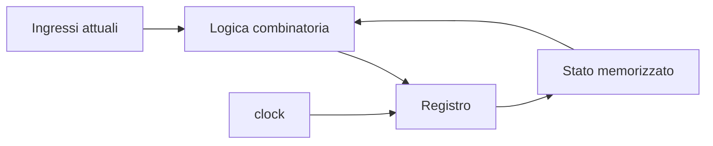

# Fondamenti di progettazione microelettronica digitale

La sezione **Fondamenti di progettazione microelettronica digitale** nasce come base trasversale per tutto il resto della documentazione. L’obiettivo è costruire un punto di partenza comune prima di entrare nei dettagli di:
- VHDL
- Verilog
- SystemVerilog
- FPGA
- ASIC
- SoC
- UVM

Questa sezione non è pensata come un corso di linguaggio, né come un tutorial tool-specific. È invece un percorso introduttivo ma serio sui concetti fondamentali della progettazione digitale, con attenzione al modo in cui i blocchi hardware:
- rappresentano l’informazione;
- elaborano dati;
- memorizzano stato;
- evolvono nel tempo;
- si integrano in strutture architetturali più ampie;
- vengono poi descritti, sintetizzati e verificati.

L’idea di fondo è semplice: prima di scrivere bene RTL, bisogna capire bene **che cosa si sta progettando**.
RTL (Register Transfer Level)= descrivere come i dati passano tra registri e come vengono elaborati tra un ciclo e il successivo.

Questa sezione è pensata per un uso:
- universitario;
- professionale introduttivo;
- propedeutico ai linguaggi HDL e ai flussi di implementazione;
- utile anche come ripasso architetturale di base.

Nel corso delle lezioni verranno introdotti:
- concetti teorici essenziali;
- esempi concettuali vicini al progetto reale;
- schemi e diagrammi per chiarire blocchi, flussi e relazioni;
- collegamenti progressivi con RTL, timing, verifica e contesti FPGA/ASIC/SoC.

## Obiettivi della sezione

Al termine di questa sezione dovresti essere in grado di:
- distinguere tra logica combinatoria e logica sequenziale;
- comprendere il ruolo di segnali, clock, reset e stato nei circuiti digitali;
- leggere registri, multiplexer, FSM e datapath come blocchi architetturali fondamentali;
- capire il significato di pipeline, latenza e throughput;
- interpretare un modulo digitale come parte di un sistema più grande;
- collegare i concetti di base a sintesi, timing, verifica e implementazione;
- arrivare alle sezioni VHDL, Verilog, SystemVerilog, FPGA e ASIC con una base più solida e meno dipendente dalla sola sintassi.

## Perché questa sezione viene prima degli HDL

Uno degli errori più comuni nello studio della progettazione digitale è partire subito dal linguaggio e solo dopo cercare di capire l’hardware. Questo approccio spesso porta a:
- imparare la sintassi senza comprenderne davvero il significato;
- confondere il codice con il circuito;
- non vedere il rapporto tra stato, timing e struttura;
- leggere i moduli come testo invece che come microarchitetture.

Questa sezione fa il percorso inverso:
- prima costruisce i concetti;
- poi permette di leggere meglio l’RTL;
- infine collega quei concetti ai linguaggi e ai flussi reali.

In questo senso, è una sezione propedeutica non perché sia “più facile”, ma perché lavora sulle idee di base che reggono tutto il resto.

## Come leggere questa sezione

La sezione è organizzata in modo progressivo.

Si parte da concetti fondamentali come:
- segnali;
- bit;
- rappresentazione dell’informazione;
- logica combinatoria;
- logica sequenziale;
- memoria;
- tempo nei circuiti digitali.

Successivamente si passa a blocchi architetturali più concreti:
- registri;
- multiplexer;
- datapath elementari;
- FSM;
- pipeline;
- interfacce e handshake.

Una volta chiariti questi elementi, la sezione apre naturalmente verso temi più vicini al progetto RTL:
- passaggio dal comportamento alla struttura;
- sintesi;
- area;
- timing;
- errori comuni di modellazione;
- verifica di base.

Infine, il percorso si collega ai contesti reali:
- dal blocco al sistema;
- differenze tra FPGA, ASIC e SoC;
- caso di studio introduttivo.

## Che cosa troverai nelle lezioni

Ogni pagina della sezione seguirà, per quanto possibile, una struttura coerente:
- introduzione del concetto;
- spiegazione del significato hardware;
- collegamento con il progetto digitale reale;
- schemi e diagrammi quando aiutano a chiarire relazioni o flussi;
- collegamento con RTL, timing, verifica o implementazione.

A differenza di una sezione centrata sugli HDL, qui il codice non sarà sempre protagonista. Quando utile, potranno comparire piccoli esempi concettuali o frammenti RTL, ma il focus principale sarà sulla comprensione:
- dell’architettura;
- del comportamento temporale;
- del significato fisico e progettuale dei blocchi.

## Esempio del taglio usato

Per esempio, quando parleremo di logica sequenziale, non diremo solo che “esistono i registri”, ma cercheremo di chiarire:
- che cosa significa memorizzare uno stato;
- perché il clock scandisce il comportamento del sistema;
- come un registro separa il tempo in intervalli;
- come questo si collega poi a timing, pipeline e RTL.

Questo tipo di diagramma è tipico del taglio della sezione: pochi elementi, ma fortemente legati al significato del progetto.

## Struttura della sezione

La sezione è articolata nei seguenti blocchi principali.

### 1. Concetti fondamentali
Qui vengono introdotti:
- segnali e informazione;
- logica combinatoria;
- logica sequenziale;
- memoria;
- clock, reset e tempo.

### 2. Blocchi architetturali di base
Qui il focus si sposta su:
- registri;
- mux;
- datapath elementari;
- FSM;
- pipeline;
- interfacce e handshake.

### 3. Progettazione RTL e qualità del progetto
Qui vengono introdotti:
- passaggio dal comportamento all’RTL;
- sintesi;
- area;
- timing;
- errori di modellazione;
- verifica e debug di base.

### 4. Integrazione nel flusso reale
Qui la sezione collega i concetti alla progettazione vera e propria:
- dal blocco al sistema;
- differenze tra contesto FPGA, ASIC e SoC.

### 5. Caso di studio
La sezione si chiude con una pagina applicativa che ricompone i concetti fondamentali in un esempio unitario.

## Perché questa sezione è utile anche a chi conosce già un HDL

Anche chi ha già scritto VHDL o Verilog spesso scopre di avere ancora qualche incertezza su:
- ruolo del clock;
- significato del reset;
- rapporto tra controllo e datapath;
- relazione tra pipeline, latenza e throughput;
- differenza tra funzione logica e struttura temporale del circuito.

Per questo questa sezione può essere utile non solo come introduzione, ma anche come:
- ripasso concettuale;
- consolidamento architetturale;
- base comune per leggere meglio il resto della documentazione.

## Relazione con le altre sezioni della documentazione

Questa sezione è pensata per collegarsi in modo naturale con:
- **VHDL**, **Verilog** e **SystemVerilog**, che trasformano questi concetti in descrizioni RTL concrete;
- **FPGA** e **ASIC**, che mostrano come quei blocchi vengano poi implementati;
- **SoC**, dove questi elementi si inseriscono in sistemi più grandi;
- **UVM**, che affronta il lato della verifica strutturata.

In questo senso, non è una sezione isolata, ma una base comune per tutta la documentazione di microelettronica digitale.

## In sintesi

La sezione **Fondamenti di progettazione microelettronica digitale** serve a costruire una comprensione solida dei concetti che stanno alla base della progettazione hardware:
- informazione;
- logica;
- stato;
- tempo;
- controllo;
- datapath;
- integrazione;
- verifica.

Il suo scopo non è sostituire le sezioni sugli HDL o sui flussi, ma renderle più leggibili, più naturali e più utili. È il luogo in cui si impara a vedere un modulo digitale non come testo o sintassi, ma come struttura progettuale reale.

## Prossimo passo

Il passo successivo naturale è **`overview.md`**, che introdurrà:
- che cos’è la progettazione microelettronica digitale
- quali livelli di astrazione coinvolge
- come si passa dall’idea funzionale al blocco RTL
- come questa sezione si inserisce nel quadro complessivo di progettazione e verifica
