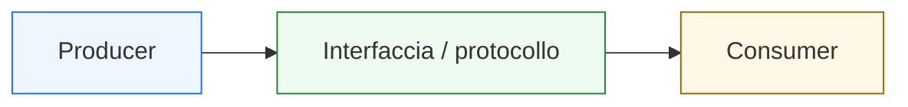
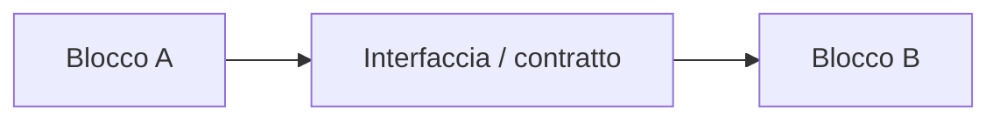
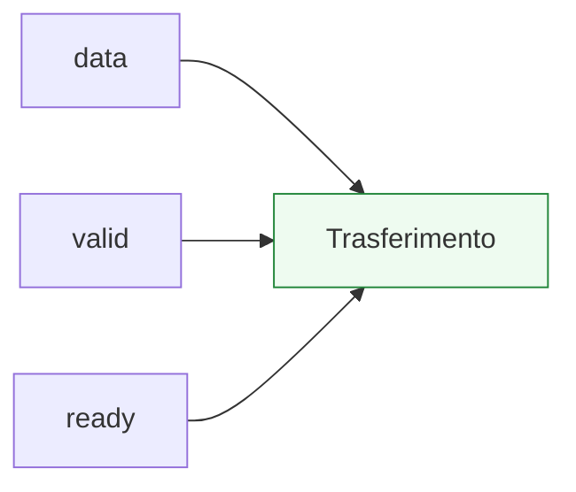

# Interfacce e handshake

Dopo aver introdotto **pipeline**, **latenza** e **throughput**, il passo successivo naturale è affrontare il problema di come i blocchi digitali comunichino tra loro in modo corretto e leggibile. In questa pagina il focus è su due concetti strettamente collegati:
- le **interfacce**
- i **protocolli di handshake**

Questa lezione è molto importante perché un blocco digitale non vive quasi mai isolato. Nella pratica, deve:
- ricevere dati da altri moduli;
- inviare risultati a un consumer;
- coordinarsi con blocchi che non sempre sono pronti nello stesso momento;
- dichiarare quando un dato è valido;
- capire quando un dato è stato accettato;
- evitare perdita, duplicazione o lettura prematura dell’informazione.

Dal punto di vista progettuale, questa pagina serve a chiarire:
- che cos’è davvero una interfaccia;
- perché una interfaccia non sia solo una lista di segnali;
- che cosa significhi handshake;
- come i protocolli di validità e accettazione organizzino il trasferimento del dato;
- perché questi temi siano fondamentali per datapath, controllo, pipeline e integrazione di sistema.

Questa pagina mantiene il taglio della sezione:
- didattico ma tecnico;
- concettuale ma vicino al progetto reale;
- orientato alla lettura dell’hardware;
- accompagnato da schemi ed esempi quando utili.

## 1. Perché servono interfacce e protocolli

La prima domanda utile è: perché non basta collegare semplicemente un bus dati tra due blocchi?

### 1.1 Perché il dato da solo non basta
Un valore presente su un bus non è automaticamente utilizzabile in ogni istante. Bisogna sapere:
- se è valido;
- se il destinatario è pronto;
- se il trasferimento è già avvenuto;
- se quel valore deve essere mantenuto stabile;
- se il blocco può accettare un nuovo dato oppure no.

### 1.2 Perché i blocchi hanno tempi e ruoli diversi
Un producer può generare dati in modo intermittente o continuo. Un consumer può:
- essere sempre pronto;
- dover attendere;
- accettare solo a certe condizioni;
- richiedere una conferma di completamento.

### 1.3 Perché è importante
Serve quindi una disciplina di comunicazione. Questa disciplina è ciò che chiamiamo interfaccia con protocollo o handshake.

---

## 2. Che cos’è una interfaccia

Una **interfaccia** è l’insieme dei segnali e delle regole con cui un blocco comunica con l’esterno.

### 2.1 Significato essenziale
Un’interfaccia non è solo:
- input;
- output;
- bus dati.

È anche:
- convenzione di uso dei segnali;
- significato temporale;
- relazione tra dato e controllo;
- regola di trasferimento dell’informazione.

### 2.2 Perché è importante
Due blocchi possono avere segnali con nomi simili ma non essere compatibili se non condividono la stessa semantica dell’interfaccia.

### 2.3 Visione intuitiva
L’interfaccia è il **contratto** tra due blocchi.

---

## 3. Interfaccia come contratto

Pensare all’interfaccia come contratto è uno dei modi più utili per capirne il significato.

### 3.1 Che cosa stabilisce il contratto
- chi produce il dato;
- chi lo consuma;
- quando il dato è valido;
- quando può essere accettato;
- se esiste una conferma del trasferimento;
- quali segnali di controllo accompagnano il dato.

### 3.2 Perché è importante
Aiuta a vedere i segnali non come fili isolati, ma come parti di una relazione coordinata.

### 3.3 Conseguenza progettuale
Una interfaccia ben progettata migliora:
- integrazione;
- leggibilità del blocco;
- verificabilità;
- robustezza del trasferimento.

---

## 4. Interfacce semplici e interfacce con protocollo

Non tutte le interfacce hanno la stessa complessità.

### 4.1 Interfacce semplici
In certi casi basta:
- un bus dati;
- eventualmente un clock comune;
- una convenzione molto semplice di utilizzo.

### 4.2 Interfacce con protocollo
In molti casi, invece, bisogna gestire:
- disponibilità del dato;
- disponibilità del consumer;
- sincronizzazione del trasferimento;
- possibili attese o backpressure;
- conferma che il trasferimento sia effettivamente avvenuto.

### 4.3 Perché è importante
Gran parte dei blocchi reali rientra nel secondo caso.

---

## 5. Che cos’è un handshake

Un **handshake** è un meccanismo con cui due blocchi coordinano il trasferimento di un’informazione.

### 5.1 Significato essenziale
Il trasferimento non si considera avvenuto solo perché il dato compare su un bus. Si considera avvenuto quando esistono le condizioni previste dal protocollo.

### 5.2 Perché serve
Serve a evitare:
- lettura prematura del dato;
- perdita di informazione;
- doppio trasferimento indesiderato;
- uso di un dato non ancora accettato;
- disallineamento tra producer e consumer.

### 5.3 Perché è importante
L’handshake è uno dei meccanismi più naturali per coordinare blocchi con ritmi diversi.

---

## 6. Producer e consumer

Per capire bene l’handshake conviene introdurre due ruoli fondamentali:
- **producer**
- **consumer**

### 6.1 Producer
È il blocco che genera o presenta il dato.

### 6.2 Consumer
È il blocco che riceve, legge o utilizza il dato.

### 6.3 Perché è utile questa distinzione
Molti protocolli diventano subito più chiari se si chiede:
- chi decide quando il dato è disponibile?
- chi decide quando può essere accettato?

### 6.4 Perché è importante
Questa distinzione aiuta a separare:
- sorgente del dato;
- responsabilità del trasferimento;
- coordinamento del protocollo.

---

## 7. Dato e segnali di controllo dell’interfaccia

Un’interfaccia con handshake contiene spesso almeno due livelli di informazione:
- il **dato**
- il **controllo del dato**

### 7.1 Il dato
È la parola o il contenuto informativo che si vuole trasferire.

### 7.2 Il controllo del dato
È l’insieme di segnali che dice:
- se il dato è valido;
- se può essere accettato;
- se il trasferimento è stato completato.

### 7.3 Perché è importante
Questo distingue chiaramente:
- contenuto;
- semantica del trasferimento.

---

## 8. Handshake `valid/ready`

Uno dei protocolli più importanti e diffusi è il modello `valid/ready`.

### 8.1 Significato del protocollo
- il producer alza `valid` quando il dato presentato è significativo;
- il consumer alza `ready` quando è in grado di accettare il dato;
- il trasferimento avviene quando le condizioni del protocollo sono soddisfatte contemporaneamente.

### 8.2 Perché è molto utile
Permette di gestire:
- producer e consumer indipendenti;
- blocchi che non hanno sempre lo stesso ritmo;
- backpressure;
- pipeline e stream di dati.

### 8.3 Schema concettuale

---

## 9. Perché `valid/ready` è così importante

Questo protocollo è molto forte perché separa due responsabilità.

### 9.1 Responsabilità del producer
Dire:
- “questo dato è disponibile”
- “questo dato è significativo”

### 9.2 Responsabilità del consumer
Dire:
- “sono pronto ad accettarlo”
- “puoi considerare il trasferimento completato”

### 9.3 Perché è importante
Questa separazione rende l’interfaccia più flessibile e più adatta a sistemi pipelined o modulari.

---

## 10. Esempio intuitivo di `valid/ready`

Immaginiamo che un producer generi dati a intervalli irregolari, mentre il consumer possa accettarli solo quando non è occupato.

### 10.1 Caso 1
`valid = 1`, `ready = 0`  
Il producer ha un dato disponibile, ma il consumer non può ancora accettarlo.

### 10.2 Caso 2
`valid = 0`, `ready = 1`  
Il consumer sarebbe pronto, ma non c’è ancora un dato utile.

### 10.3 Caso 3
`valid = 1`, `ready = 1`  
Il trasferimento può avvenire.

### 10.4 Perché è utile
Questo esempio mostra subito che il protocollo regola il trasferimento in modo esplicito e non ambiguo.

---

## 11. Handshake `request/ack`

Un altro protocollo classico è `request/acknowledge`, spesso abbreviato come `request/ack`.

### 11.1 Significato essenziale
- un blocco alza `request` per chiedere un trasferimento o una operazione;
- l’altro blocco risponde con `ack` per riconoscere o accettare la richiesta.

### 11.2 Dove è utile
È particolarmente naturale in scenari come:
- avvio di operazioni;
- conferma di ricezione;
- protocolli orientati a eventi;
- coordinamento di transazioni semplici.

### 11.3 Perché è importante
Mostra una forma più esplicita di negoziazione del trasferimento.

---

## 12. Handshake `start/done`

Un altro schema molto comune è `start/done`.

### 12.1 Significato
- `start` segnala l’avvio di una operazione;
- `done` segnala il completamento.

### 12.2 Dove compare
È tipico di:
- moduli multi-ciclo;
- acceleratori semplici;
- blocchi di controllo;
- unità che non producono un risultato a ogni ciclo.

### 12.3 Perché è importante
Questo protocollo mostra un tipo di handshake più orientato alla sequenza di elaborazione che al flusso continuo di dati.

---

## 13. Interfacce e pipeline

Dopo la pagina sulla pipeline, è naturale collegare i protocolli di interfaccia al flusso temporale del dato.

### 13.1 Perché
In una pipeline il dato può essere:
- presente in uno stadio;
- non ancora valido per l’uscita;
- pronto a uscire ma non ancora accettato;
- in attesa di avanzare.

### 13.2 Perché è importante
Interfacce e handshake servono proprio a regolare il trasferimento del dato tra:
- stadi;
- moduli;
- producer e consumer esterni.

### 13.3 Conseguenza
Il protocollo diventa parte integrante dell’architettura temporale del sistema.

---

## 14. Backpressure

Uno dei concetti più importanti associati all’handshake è il **backpressure**.

### 14.1 Che cos’è
È la situazione in cui il consumer non è in grado di accettare un nuovo dato e quindi costringe il producer a fermarsi o a mantenere stabile il trasferimento.

### 14.2 Perché è importante
In sistemi reali non tutti i blocchi possono accettare dati con la stessa cadenza.

### 14.3 Conseguenza progettuale
Il protocollo deve poter esprimere:
- dato disponibile;
- dato non ancora accettato;
- necessità di attesa.

---

## 15. Dato valido e dato stabile

Un punto molto importante nei protocolli è che il dato non deve solo “esistere”, ma deve anche essere:
- valido;
- stabile quando richiesto dal protocollo.

### 15.1 Che cosa significa
Se il producer dichiara che il dato è valido, il consumer deve poter contare su quel valore secondo le regole previste.

### 15.2 Perché è importante
Se il dato cambia troppo presto o troppo tardi, il protocollo si rompe anche se i segnali di handshake sembrano corretti.

### 15.3 Messaggio progettuale
Il protocollo regola sia il trasferimento logico sia la disciplina temporale del dato.

---

## 16. Interfacce e controllo

Le interfacce con handshake non sono solo un tema di segnali esterni. Sono anche un problema di controllo interno.

### 16.1 Perché
Il blocco deve decidere:
- quando alzare `valid`;
- quando abbassarlo;
- quando considerare il trasferimento completato;
- quando aspettare;
- quando poter accettare un nuovo dato.

### 16.2 Chi governa tutto questo
Spesso è proprio una FSM o comunque una control unit.

### 16.3 Perché è importante
Mostra il legame diretto tra:
- controllo;
- interfaccia;
- flusso del dato.

---

## 17. Interfacce e datapath

Anche il datapath è direttamente coinvolto.

### 17.1 Perché
Quando un dato viene trasferito tra blocchi:
- deve essere generato;
- selezionato;
- eventualmente registrato;
- mantenuto;
- inoltrato.

### 17.2 Perché è importante
Il protocollo di handshake influenza:
- enable dei registri;
- mux di selezione;
- percorso del dato;
- avanzamento della pipeline.

### 17.3 Conseguenza
Le interfacce non sono “decorazione esterna”, ma parte reale della microarchitettura.

---

## 18. Esempio concettuale: producer con `valid`, consumer con `ready`

Consideriamo un blocco che genera `data_out` e segnala `valid_out`. Il blocco successivo espone `ready_in`.

### 18.1 Comportamento atteso
- il producer genera il dato;
- lo dichiara valido;
- aspetta finché il consumer non lo accetta;
- poi può passare al dato successivo.

### 18.2 Che cosa mostra
- separazione delle responsabilità;
- trasferimento coordinato;
- possibilità di attesa.

### 18.3 Perché è utile
È uno dei pattern più rappresentativi della comunicazione tra moduli digitali.

---

## 19. Esempio concettuale: avvio e completamento

Consideriamo invece un blocco che riceve `start` e produce `done`.

### 19.1 Comportamento atteso
- il blocco resta inattivo finché non riceve `start`;
- esegue l’operazione;
- al termine attiva `done`;
- torna in stato di attesa.

### 19.2 Perché è importante
Mostra come l’interfaccia possa descrivere non solo un flusso di dati, ma anche una sequenza operativa nel tempo.

### 19.3 Collegamento con la FSM
Questo tipo di protocollo è spesso governato da una macchina a stati.

---

## 20. Errori comuni di comprensione

Ci sono alcuni errori molto frequenti quando si affrontano interfacce e handshake.

### 20.1 Pensare che una interfaccia sia solo una lista di porte
In realtà è anche semantica, protocollo e disciplina temporale.

### 20.2 Pensare che il dato basti da solo
Senza segnali di controllo del trasferimento, il dato può essere letto in modo ambiguo o sbagliato.

### 20.3 Ignorare il ruolo del consumer
Non basta sapere che il producer ha un dato. Bisogna anche sapere se l’altro lato può accettarlo.

### 20.4 Trascurare il tempo del protocollo
Molti bug nascono non dal valore del dato, ma dal momento in cui viene dichiarato o accettato.

---

## 21. Buone pratiche concettuali

Anche a questo livello introduttivo, alcune abitudini sono molto utili.

### 21.1 Pensare sempre all’interfaccia come contratto
Non solo come insieme di fili.

### 21.2 Separare chiaramente:
- dato;
- validità del dato;
- disponibilità del consumer.

### 21.3 Chiedersi sempre quando avviene davvero il trasferimento
Questa è una delle domande più importanti per capire un protocollo.

### 21.4 Collegare il protocollo al controllo interno
Un’interfaccia corretta nasce quasi sempre da una control unit coerente.

---

## 22. Collegamento con il resto della sezione

Questa pagina si collega direttamente alle prossime tappe del branch:
- **`from-behavior-to-rtl.md`**, perché i protocolli di interfaccia devono essere tradotti in strutture RTL chiare;
- **`synthesis-area-and-timing.md`**, perché interfacce, registri e controllo influenzano anche timing e area;
- **`basic-verification-and-debug.md`**, perché i protocolli sono tra gli aspetti più importanti da verificare in simulazione;
- **`from-block-to-system.md`**, dove i blocchi verranno letti come componenti di sistemi più ampi;
- **`fpga-asic-soc-contexts.md`**, dove il significato delle interfacce emergerà anche nel contesto implementativo e di integrazione.

---

## 23. In sintesi

Le interfacce e i protocolli di handshake sono fondamentali perché definiscono **come** i blocchi digitali si scambiano informazione.

- Una **interfaccia** è un contratto tra moduli.
- Il **dato** da solo non basta: servono regole di validità e accettazione.
- L’**handshake** coordina il trasferimento tra producer e consumer.
- Protocolli come `valid/ready`, `request/ack` e `start/done` organizzano la comunicazione nel tempo.

Capire bene interfacce e handshake significa fare un passo decisivo verso la lettura dei sistemi digitali come insiemi di blocchi cooperanti, non come moduli isolati.

## Prossimo passo

Il passo successivo naturale è **`from-behavior-to-rtl.md`**, perché adesso conviene collegare tutti i fondamenti costruiti fin qui al modo in cui un comportamento architetturale venga tradotto in una descrizione RTL ordinata e sintetizzabile:
- datapath
- controllo
- registri
- pipeline
- interfacce
