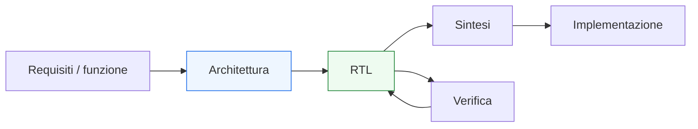
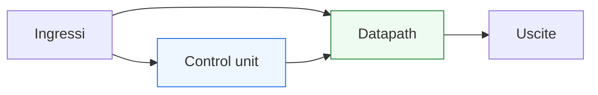

# Panoramica della progettazione digitale

Dopo l’introduzione generale della sezione, il passo successivo naturale è costruire una visione d’insieme della **progettazione microelettronica digitale**. Questa pagina ha proprio questo scopo: chiarire che cosa significhi progettare un sistema digitale, quali livelli di astrazione siano coinvolti e come si passi da una idea funzionale a una descrizione implementabile e verificabile.

Questa è una pagina molto importante perché, prima ancora di parlare di registri, FSM o HDL, è utile capire il quadro generale in cui questi elementi si inseriscono. In un progetto reale, infatti, il progettista non lavora mai soltanto su una “formula logica” o su una “porzione di codice”, ma si muove tra:
- requisiti funzionali;
- organizzazione dell’architettura;
- modellazione RTL;
- timing;
- sintesi;
- verifica;
- integrazione in un sistema più ampio.

Dal punto di vista didattico, questa pagina serve a dare un lessico comune e una struttura mentale che accompagnerà tutte le lezioni successive.

Questa pagina mantiene il taglio della sezione:
- didattico ma tecnico;
- concettuale ma concreto;
- orientato all’hardware reale;
- attento al legame tra architettura, RTL, timing e verifica.

## 1. Che cos’è la progettazione microelettronica digitale

La progettazione microelettronica digitale è il processo con cui si definisce e si realizza un sistema che elabora informazione in forma discreta, tipicamente rappresentata da bit e parole binarie.

### 1.1 Significato essenziale
Progettare un sistema digitale significa decidere:
- quali informazioni il sistema deve ricevere;
- quali trasformazioni deve eseguire;
- quali stati deve memorizzare;
- come deve evolvere nel tempo;
- come deve comunicare con altri blocchi;
- come deve essere implementato in hardware reale.

### 1.2 Perché non è solo “fare logica”
Anche nei sistemi semplici non basta definire una funzione combinatoria. Occorre spesso stabilire:
- sequenza delle operazioni;
- gestione del tempo;
- organizzazione del controllo;
- rapporto tra dato e stato;
- vincoli di timing e implementazione.

### 1.3 Perché è importante chiarirlo subito
Aiuta a vedere i moduli digitali non come formule isolate, ma come parti di una architettura più ampia.

---

## 2. Il ruolo dei livelli di astrazione

Uno dei concetti più importanti in progettazione digitale è il lavoro per **livelli di astrazione**.

### 2.1 Perché servono
Un sistema reale può essere troppo complesso per essere affrontato tutto contemporaneamente. Per questo il progettista usa livelli diversi, ciascuno con una propria funzione.

### 2.2 Esempi di livelli
Per esempio si può ragionare a livello di:
- funzione;
- architettura;
- RTL;
- logica sintetizzata;
- implementazione fisica.

### 2.3 Perché è importante
Ogni livello risponde a domande diverse:
- che cosa deve fare il sistema?
- come è organizzato?
- come si descrive in hardware?
- come si realizza fisicamente?

---

## 3. Dal requisito alla funzione

Ogni progetto parte da una esigenza o da una specifica.

### 3.1 Punto di partenza
Per esempio:
- trasformare un ingresso in una uscita;
- gestire un protocollo;
- controllare una sequenza di eventi;
- filtrare o elaborare un flusso dati;
- coordinare più sottoblocchi.

### 3.2 Che cosa si definisce qui
A questo livello interessa soprattutto:
- il comportamento atteso;
- la relazione tra ingressi e uscite;
- eventuali vincoli temporali;
- i casi d’uso principali.

### 3.3 Perché è importante
Senza una definizione chiara della funzione, tutte le scelte successive rischiano di essere poco coerenti.

---

## 4. Dalla funzione all’architettura

Una volta chiarita la funzione, bisogna decidere **come** realizzarla.

### 4.1 Che cos’è l’architettura
L’architettura è l’organizzazione del sistema in termini di:
- blocchi;
- flusso dei dati;
- controllo;
- memorie;
- registri;
- interfacce.

### 4.2 Domande tipiche a questo livello
- conviene usare una FSM?
- serve una pipeline?
- il blocco avrà registri intermedi?
- il controllo sarà centralizzato o distribuito?
- quale interfaccia esporrà verso l’esterno?

### 4.3 Perché è importante
La qualità dell’architettura influenza direttamente:
- semplicità del progetto;
- timing;
- area;
- verificabilità;
- integrazione futura.

---

## 5. Dal livello architetturale al livello RTL

Dopo aver definito l’architettura, il progettista la traduce in una descrizione più vicina all’hardware: il livello **RTL**.

### 5.1 Che cos’è l’RTL
RTL significa **Register Transfer Level**. È il livello in cui si descrivono:
- registri;
- logica combinatoria tra registri;
- trasferimento dei dati;
- controllo tramite FSM o segnali di enable e select.

### 5.2 Perché è il livello centrale della progettazione digitale
È il punto di incontro tra:
- concetto architetturale;
- linguaggi HDL;
- sintesi;
- timing;
- verifica funzionale.

### 5.3 Perché è importante per questa sezione
Anche se qui non partiamo dagli HDL, molti concetti fondamentali della sezione sono proprio quelli che poi verranno espressi in RTL.

---

## 6. Il ruolo del tempo nei circuiti digitali

Una delle grandi differenze tra sistemi digitali reali e modelli puramente logici è il ruolo del **tempo**.

### 6.1 Perché conta
Un sistema digitale non è fatto solo di valori logici, ma di:
- eventi temporali;
- campionamento a clock;
- ritardi di propagazione;
- stato che cambia nel tempo.

### 6.2 Dove si vede
Il tempo è centrale in:
- logica sequenziale;
- clock;
- reset;
- pipeline;
- latenza;
- throughput;
- handshake;
- CDC.

### 6.3 Perché è importante
Molti errori di comprensione nascono proprio dal trascurare la dimensione temporale del progetto.

---

## 7. Il ruolo del controllo e del datapath

In molti sistemi digitali è utile distinguere due grandi componenti architetturali.

### 7.1 Datapath
È la parte che:
- trasporta i dati;
- li trasforma;
- li seleziona;
- li memorizza.

### 7.2 Control unit
È la parte che:
- decide quando avviare un’operazione;
- seleziona i percorsi del dato;
- governa gli enable;
- controlla la sequenza di stati.

### 7.3 Perché è importante
Questa separazione è una delle chiavi più forti per leggere sistemi digitali in modo chiaro.

---

## 8. Combinatoria e sequenziale come base di tutto

Tutta la progettazione digitale si appoggia su due grandi famiglie di comportamento.

### 8.1 Logica combinatoria
L’uscita dipende solo dagli ingressi attuali.

### 8.2 Logica sequenziale
L’uscita o lo stato dipendono anche dal passato e dall’evoluzione temporale del circuito.

### 8.3 Perché è importante
Questa distinzione regge:
- registri;
- FSM;
- pipeline;
- controllo;
- timing.

---

## 9. Dall’RTL alla sintesi

Una volta scritto il progetto a livello RTL, il passo successivo nel flusso è la **sintesi**.

### 9.1 Che cosa fa la sintesi
Legge la descrizione RTL e inferisce:
- registri;
- mux;
- logica combinatoria;
- strutture di controllo;
- netlist hardware.

### 9.2 Perché è importante
Il codice deve quindi essere scritto non solo per “descrivere la funzione”, ma anche per essere:
- sintetizzabile;
- prevedibile;
- coerente con l’architettura desiderata.

### 9.3 Perché questa pagina lo anticipa
Perché la progettazione non si ferma al comportamento concettuale: deve arrivare a una forma implementabile.

---

## 10. Dalla sintesi al timing

Dopo la sintesi, emerge con forza la questione del **timing**.

### 10.1 Che cosa significa
Bisogna verificare che il circuito:
- possa funzionare alla frequenza richiesta;
- abbia percorsi temporali compatibili con il clock;
- non concentri troppa logica tra due registri.

### 10.2 Perché è importante
Questo influenza direttamente scelte come:
- inserimento di pipeline;
- organizzazione del datapath;
- profondità della logica;
- struttura della control unit.

### 10.3 Perché conviene capirlo presto
Perché molte decisioni architetturali sono anche decisioni di timing.

---

## 11. Il ruolo della verifica

Un progetto digitale non può essere considerato affidabile solo perché “sembra ben pensato”. Deve essere verificato.

### 11.1 Che cosa significa verificare
Vuol dire:
- applicare stimoli;
- osservare il comportamento;
- confrontarlo con l’atteso;
- individuare bug funzionali o temporali;
- correggere il progetto.

### 11.2 Perché è importante
La verifica non è una fase finale accessoria. È una parte costitutiva del flusso di progetto.

### 11.3 Perché questa sezione la anticipa
Perché anche a livello di fondamenti conviene capire subito che progettazione e verifica crescono insieme.

---

## 12. Il ruolo dell’integrazione

Molti blocchi funzionano bene da soli ma diventano problematici quando devono essere integrati.

### 12.1 Che cosa significa integrare
Significa collegare un blocco ad altri blocchi attraverso:
- interfacce;
- protocolli di controllo;
- segnali di validità;
- domini di clock;
- sistemi più grandi.

### 12.2 Perché è importante
Una buona progettazione digitale deve tenere conto non solo della correttezza locale del blocco, ma anche della sua capacità di vivere dentro un sistema.

### 12.3 Conseguenza progettuale
Interfacce, handshake e CDC diventano temi naturali già a livello di fondamenti.

---

## 13. Progettazione digitale come insieme di compromessi

Un punto molto importante da capire è che il progetto non ottimizza quasi mai una sola cosa.

### 13.1 Compromessi tipici
Il progettista deve bilanciare:
- semplicità;
- area;
- timing;
- latenza;
- throughput;
- verificabilità;
- riuso;
- costo progettuale.

### 13.2 Perché è importante
Una soluzione “elegante” funzionalmente può non essere la migliore dal punto di vista temporale o implementativo.

### 13.3 Perché questa è una lezione fondamentale
Mostra che la progettazione digitale non è mera traduzione meccanica di una funzione, ma vera attività di scelta architetturale.

---

## 14. Esempio concettuale: dallo scopo al blocco

Immaginiamo di voler progettare un piccolo blocco che:
- riceve un dato;
- lo elabora;
- produce un risultato dopo uno o più cicli;
- segnala quando il risultato è pronto.

### 14.1 Livello funzionale
Serve capire:
- che trasformazione esegue;
- quando è valida l’uscita;
- come viene avviata l’operazione.

### 14.2 Livello architetturale
Si decide:
- se usare una FSM;
- se inserire registri;
- se pipeline il percorso del dato;
- quale interfaccia adottare.

### 14.3 Livello RTL
Il blocco si traduce in:
- registri;
- combinatoria;
- segnali di controllo;
- eventuale handshake.

### 14.4 Livello di verifica
Si costruisce un testbench che:
- applica gli stimoli;
- osserva la latenza;
- controlla il risultato.

### 14.5 Perché è utile questo esempio
Mostra come i livelli della progettazione siano collegati e non separati.

---

## 15. Errori iniziali da evitare

Prima di entrare nel resto della sezione, conviene esplicitare alcuni errori di impostazione molto frequenti.

### 15.1 Pensare che progettare significhi solo “scrivere HDL”
L’HDL è solo uno dei livelli del flusso.

### 15.2 Pensare che l’architettura venga dopo
In realtà l’architettura è ciò che rende coerente la descrizione RTL.

### 15.3 Ignorare il tempo
Clock, registri, latenza e timing non sono dettagli secondari.

### 15.4 Trascurare la verifica
Un progetto non verificato è solo una ipotesi.

### 15.5 Non vedere il sistema
Un blocco digitale va progettato anche in funzione della sua integrazione con il resto del sistema.

---

## 16. Come leggere il resto della sezione

Dopo questa panoramica, conviene affrontare le lezioni successive con una struttura mentale chiara.

### 16.1 Primo livello: concetti fondamentali
- informazione
- segnali
- combinatoria
- sequenziale
- tempo

### 16.2 Secondo livello: blocchi architetturali
- registri
- mux
- datapath
- FSM
- pipeline
- handshake

### 16.3 Terzo livello: qualità del progetto
- RTL
- sintesi
- area
- timing
- verifica
- debug

### 16.4 Quarto livello: contesto reale
- blocchi integrati in sistemi
- differenze tra FPGA, ASIC e SoC

### 16.5 Perché questo aiuta
Permette di leggere ogni pagina come parte di un percorso coerente, non come concetto isolato.

---

## 17. Collegamento con il resto della documentazione

Questa pagina prepara in modo naturale il collegamento con tutte le sezioni già costruite nella documentazione.

### 17.1 Collegamento con VHDL, Verilog e SystemVerilog
Questi linguaggi esprimeranno in RTL i concetti introdotti qui a livello fondamentale.

### 17.2 Collegamento con FPGA e ASIC
Queste sezioni mostreranno come i blocchi progettati vengano poi implementati in contesti diversi.

### 17.3 Collegamento con SoC
Qui i blocchi digitali verranno letti come parti di sistemi più grandi.

### 17.4 Collegamento con UVM
La verifica strutturata si appoggia agli stessi concetti di controllo, datapath, protocollo e comportamento temporale.

---

## 18. In sintesi

La progettazione microelettronica digitale è un percorso che collega:
- funzione;
- architettura;
- RTL;
- sintesi;
- timing;
- verifica;
- implementazione;
- integrazione di sistema.

Capire bene questo quadro significa affrontare il resto della sezione con una visione più matura: non come raccolta di definizioni isolate, ma come percorso che porta da un’idea funzionale a un blocco digitale reale, verificabile e integrabile.

## Prossimo passo

Il passo successivo naturale è **`signals-and-information.md`**, perché adesso conviene partire dal livello più elementare del progetto digitale chiarendo:
- che cos’è un segnale
- come l’informazione viene rappresentata in forma binaria
- che differenza c’è tra valore logico, parola dati e significato architetturale dell’informazione
