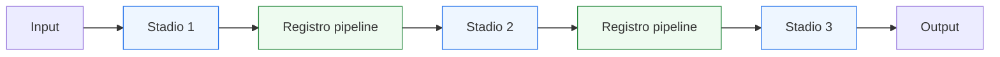
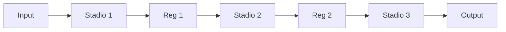
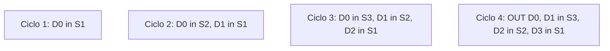
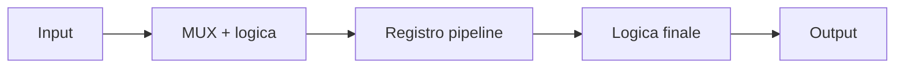

# Pipeline, latenza e throughput

Dopo aver introdotto **FSM** e **logica di controllo**, il passo successivo naturale è affrontare una delle strutture architetturali più importanti della progettazione digitale: la **pipeline**. In questa pagina il focus è sul rapporto tra:
- **pipeline**
- **latenza**
- **throughput**
- **organizzazione temporale del flusso dei dati**

Questa lezione è molto importante perché molti sistemi digitali reali non si limitano a eseguire una trasformazione “tutta in un colpo”. Spesso conviene invece suddividere l’elaborazione in più stadi, separati da registri, in modo da:
- rendere il percorso dati più leggibile;
- migliorare il timing;
- aumentare la frequenza operativa;
- sostenere un flusso continuo di dati;
- controllare in modo più preciso il rapporto tra prestazioni e complessità.

Dal punto di vista progettuale, questa pagina serve a chiarire:
- che cos’è una pipeline;
- perché si introducono registri intermedi nel datapath;
- che cosa significhino latenza e throughput;
- perché questi due concetti non coincidano;
- come controllo, tempo e percorso dati si combinino in una architettura a stadi.

Questa pagina mantiene il taglio della sezione:
- didattico ma tecnico;
- concettuale ma vicino al progetto reale;
- orientato alla lettura dell’hardware;
- accompagnato da schemi ed esempi quando utili.

## 1. Perché serve la pipeline

La prima domanda utile è: perché non lasciare tutta la logica in un unico blocco combinatorio?

### 1.1 Perché i percorsi combinatori possono diventare troppo lunghi
Se troppe trasformazioni vengono eseguite nello stesso tratto di logica, il ritardo complessivo può diventare troppo elevato.

### 1.2 Perché il sistema deve spesso sostenere un flusso continuo
Molti blocchi devono processare:
- più dati consecutivi;
- stream di campioni;
- comandi o pacchetti successivi;
- operazioni ripetute a ogni ciclo o quasi.

### 1.3 Perché è importante
La pipeline permette di usare il tempo in modo strutturato, trasformandolo in una risorsa di progetto.

---

## 2. Che cos’è una pipeline

Una **pipeline** è una organizzazione del circuito in cui l’elaborazione viene suddivisa in più **stadi**, separati da registri.

### 2.1 Significato essenziale
Invece di far attraversare al dato tutta la logica in un solo passo, si divide il percorso in più parti:
- ogni stadio esegue una porzione del lavoro;
- i registri tra gli stadi memorizzano i risultati intermedi;
- il dato avanza nel tempo da uno stadio al successivo.

### 2.2 Perché è importante
La pipeline rende possibile:
- segmentare il percorso dati;
- ridurre il carico combinatorio per stadio;
- migliorare il timing;
- aumentare il numero di dati processabili nel tempo.

### 2.3 Visione intuitiva
La pipeline è come una catena di lavorazione: ogni stadio fa una parte del lavoro e poi passa il risultato allo stadio successivo.

---

## 3. Pipeline e registri intermedi

I registri intermedi sono l’elemento che trasforma un normale datapath in una pipeline.

### 3.1 Che cosa fanno
- memorizzano il risultato parziale di uno stadio;
- separano temporalmente uno stadio dal successivo;
- delimitano i percorsi combinatori.

### 3.2 Perché sono necessari
Senza registri intermedi non esiste vera pipeline, ma solo un percorso combinatorio più lungo.

### 3.3 Perché è importante
Questo collega direttamente il tema della pipeline a quello già visto sui registri come confini temporali del sistema.

---

## 4. Pipeline e segmentazione del calcolo

Uno dei modi più utili di capire la pipeline è pensare alla **segmentazione** del calcolo.

### 4.1 Che cosa significa
Un’operazione più grande viene divisa in blocchi più piccoli:
- primo stadio;
- secondo stadio;
- terzo stadio;
- e così via.

### 4.2 Perché è utile
Ogni stadio ha:
- meno logica combinatoria;
- un ruolo più chiaro;
- una migliore collocazione temporale.

### 4.3 Perché è importante
La pipeline non è soltanto “aggiungere registri”, ma riprogettare il flusso dell’elaborazione nel tempo.

---

## 5. Che cos’è la latenza

Uno dei concetti fondamentali associati alla pipeline è la **latenza**.

### 5.1 Significato essenziale
La latenza è il tempo o il numero di cicli che intercorrono tra:
- applicazione di un ingresso;
- disponibilità del risultato corrispondente in uscita.

### 5.2 Perché è importante
Se il dato deve attraversare più stadi, non sarà disponibile subito, ma dopo un certo numero di cicli.

### 5.3 Esempio intuitivo
Se una pipeline ha tre stadi registrati, il risultato di un dato in ingresso può comparire dopo tre cicli, non immediatamente.

---

## 6. Che cos’è il throughput

Il secondo concetto fondamentale è il **throughput**.

### 6.1 Significato essenziale
Il throughput misura quanti risultati il sistema può produrre in una certa unità di tempo o, in una lettura semplificata, quanti dati può far avanzare per ciclo in condizioni regolari.

### 6.2 Perché è importante
Un blocco può avere una latenza elevata ma, una volta “riempita” la pipeline, produrre un risultato a ogni ciclo.

### 6.3 Perché questo è utile
Mostra che:
- latenza e throughput non sono la stessa cosa;
- una pipeline può aumentare la capacità complessiva del sistema anche se ogni singolo dato impiega più tempo ad arrivare in uscita.

---

## 7. Latenza e throughput non coincidono

Questo è uno dei messaggi più importanti dell’intera pagina.

### 7.1 Latenza
Dice quanto tempo impiega **un dato specifico** ad attraversare il blocco.

### 7.2 Throughput
Dice quanto frequentemente il sistema può produrre **risultati successivi**.

### 7.3 Perché è importante
È possibile avere:
- latenza alta;
- throughput alto;

oppure:
- latenza bassa;
- throughput basso;

a seconda dell’architettura scelta.

### 7.4 Conseguenza progettuale
Una buona architettura non ottimizza sempre una sola metrica: bisogna capire quale compromesso serve davvero.

---

## 8. Esempio intuitivo di pipeline a tre stadi

Supponiamo di avere tre stadi:
- elaborazione iniziale;
- trasformazione intermedia;
- formattazione finale.

### 8.1 Schema concettuale

### 8.2 Che cosa significa
Un dato entra nello stadio 1, poi:
- al ciclo successivo avanza nello stadio 2;
- poi nello stadio 3;
- poi produce l’uscita.

### 8.3 Che cosa mostra
- latenza di più cicli;
- flusso ordinato dei dati;
- segmentazione del percorso combinatorio.

---

## 9. Pipeline e sovrapposizione del lavoro

Il vero vantaggio della pipeline emerge quando più dati vengono elaborati in parallelo temporale.

### 9.1 Che cosa significa
Mentre:
- il primo dato è nello stadio 3,
- il secondo può essere nello stadio 2,
- il terzo può essere nello stadio 1.

### 9.2 Perché è importante
Il sistema non aspetta che un dato termini completamente prima di iniziare il successivo.

### 9.3 Perché questo aumenta il throughput
Dopo la fase iniziale di riempimento, la pipeline può produrre risultati con cadenza elevata.

---

## 10. Pipeline e timing

La pipeline è strettamente legata al tema del timing.

### 10.1 Perché
Inserendo registri intermedi si riduce la quantità di logica combinatoria tra due registri consecutivi.

### 10.2 Effetto
Questo può:
- ridurre il cammino critico;
- permettere frequenze di clock più alte;
- rendere il progetto più scalabile.

### 10.3 Perché è importante
La pipeline non è solo una tecnica di organizzazione funzionale, ma anche uno strumento chiave per migliorare la chiusura temporale del progetto.

---

## 11. Pipeline e costo progettuale

La pipeline non porta solo vantaggi. Introduce anche compromessi.

### 11.1 Costi principali
- maggiore latenza;
- più registri;
- maggiore complessità del controllo;
- necessità di allineare correttamente dati e segnali associati;
- verifica più articolata.

### 11.2 Perché è importante
Ogni pipeline è una scelta architetturale, non una “ottimizzazione gratuita”.

### 11.3 Conseguenza progettuale
Bisogna sempre chiedersi:
- vale la pena introdurre uno stadio in più?
- quale beneficio temporale ottengo?
- quale prezzo pago in latenza e complessità?

---

## 12. Pipeline e controllo

Quando compare una pipeline, anche la control unit può dover diventare più ricca.

### 12.1 Perché
Il sistema deve sapere:
- quando un dato entra;
- in quale stadio si trova;
- quando il risultato è valido;
- se uno stadio deve avanzare oppure aspettare.

### 12.2 Segnali tipici
- enable di stadio;
- valid di pipeline;
- segnali di completamento;
- eventuali stall o condizioni di attesa.

### 12.3 Perché è importante
Mostra che la pipeline non è solo datapath, ma anche coordinamento temporale del flusso dei dati.

---

## 13. Pipeline e validità del dato

In un sistema pipelined non basta sapere “quale valore c’è”. Bisogna sapere anche se quel valore è valido in un certo stadio o in uscita.

### 13.1 Che cosa significa
Un dato può trovarsi:
- appena entrato;
- in uno stadio intermedio;
- ancora non pronto per l’uscita;
- già valido come risultato.

### 13.2 Perché è importante
Questo collega direttamente la pipeline ai temi di:
- handshake;
- out_valid;
- controllo del flusso;
- verifica temporale del comportamento.

### 13.3 Conseguenza
La progettazione della pipeline richiede spesso un allineamento esplicito tra:
- dati;
- stato;
- segnali di validità.

---

## 14. Pipeline e datapath

Il datapath è il luogo naturale in cui compare la pipeline.

### 14.1 Perché
Il datapath contiene:
- trasformazioni sul dato;
- operatori;
- mux;
- registri;
- percorsi di elaborazione.

### 14.2 Perché è importante
La pipeline è uno dei modi più naturali di organizzare il datapath quando:
- il percorso è lungo;
- si vuole aumentare la frequenza;
- si devono processare stream di dati.

### 14.3 Collegamento con le pagine precedenti
La pipeline si può leggere come una estensione naturale di:
- registri;
- mux;
- piccoli datapath;
- controllo tramite FSM.

---

## 15. Esempio concettuale: due stadi di elaborazione

Immaginiamo un piccolo blocco che:
- nello stadio 1 esegue una selezione e una combinazione semplice;
- nello stadio 2 produce il risultato finale.

### 15.1 Schema concettuale

### 15.2 Che cosa mostra
- il lavoro è stato diviso in due passi;
- il dato viene memorizzato tra i due;
- la risposta non è immediata, ma organizzata nel tempo.

### 15.3 Perché è utile
È un esempio piccolo ma molto chiaro del significato reale della pipeline.

---

## 16. Pipeline e architettura del sistema

La pipeline non è un tema limitato ai singoli blocchi. Influenza l’intera architettura.

### 16.1 Perché
Una scelta di pipeline cambia:
- tempi di risposta;
- organizzazione del controllo;
- interfacce tra moduli;
- numero di dati in volo nel sistema;
- complessità della verifica.

### 16.2 Perché è importante
Una pipeline locale può avere effetti sull’integrazione complessiva del blocco nel sistema.

### 16.3 Messaggio progettuale
Pipelining significa progettare il tempo come parte dell’architettura, non come dettaglio finale.

---

## 17. Latenza osservabile dal punto di vista esterno

Un blocco pipelined può apparire diverso all’esterno rispetto a un blocco non pipelined.

### 17.1 Perché
L’uscita non compare più nello stesso momento in cui l’ingresso viene applicato, ma dopo un certo numero di cicli.

### 17.2 Perché è importante
Questo significa che il protocollo esterno o il testbench devono tenere conto della latenza.

### 17.3 Conseguenza progettuale
Una scelta di pipeline non è solo interna: influenza anche il modo in cui il blocco viene osservato, verificato e integrato.

---

## 18. Errori comuni di comprensione

Ci sono alcuni errori molto frequenti quando si introducono pipeline, latenza e throughput.

### 18.1 Pensare che pipeline significhi automaticamente “più veloce”
Dipende da che cosa si intende per veloce:
- tempo del singolo dato?
- frequenza massima?
- numero di risultati nel tempo?

### 18.2 Confondere latenza e throughput
Sono concetti distinti e possono muoversi in direzioni diverse.

### 18.3 Pensare che aggiungere registri sia sempre vantaggioso
Ogni stadio aggiunto introduce costi e complessità.

### 18.4 Trascurare il controllo e la validità del dato
Una pipeline senza allineamento corretto tra dati e controllo può essere funzionalmente problematica.

---

## 19. Buone pratiche concettuali

Anche a questo livello introduttivo, alcune abitudini di lettura sono molto utili.

### 19.1 Chiedersi dove siano gli stadi
Ogni registro pipeline definisce un nuovo passo temporale.

### 19.2 Distinguere bene:
- lavoro per stadio;
- latenza del dato;
- ritmo di produzione dei risultati.

### 19.3 Leggere la pipeline come scelta architetturale
Non come semplice aggiunta tecnica.

### 19.4 Pensare al dato nel tempo
Dove si trova il dato:
- al ciclo 0?
- al ciclo 1?
- al ciclo 2?

Questa è una delle chiavi più forti per capire davvero una pipeline.

---

## 20. Collegamento con il resto della sezione

Questa pagina si collega direttamente alle prossime tappe del branch:
- **`interfaces-and-handshake.md`**, perché pipeline e flusso dati si collegano naturalmente ai protocolli di validità e accettazione;
- **`from-behavior-to-rtl.md`**, perché la pipeline è una delle scelte architetturali più importanti da tradurre in RTL;
- **`synthesis-area-and-timing.md`**, dove il legame tra pipeline e timing diventerà esplicito;
- **`basic-verification-and-debug.md`**, perché latenza e allineamento temporale sono temi centrali nella simulazione e nel testbench;
- **`case-study.md`**, dove pipeline, controllo e datapath verranno ricomposti in un esempio unico.

---

## 21. In sintesi

La pipeline è una struttura architetturale in cui l’elaborazione viene suddivisa in più stadi separati da registri.

- La **latenza** indica quanto tempo impiega un dato ad attraversare il blocco.
- Il **throughput** indica quanto frequentemente il sistema può produrre risultati.
- I registri pipeline segmentano il percorso dati nel tempo.
- La pipeline migliora spesso il timing, ma introduce costi in complessità e latenza.

Capire bene pipeline, latenza e throughput significa fare un passo decisivo verso la lettura di sistemi digitali come architetture temporali organizzate.

## Prossimo passo

Il passo successivo naturale è **`interfaces-and-handshake.md`**, perché adesso conviene vedere come il flusso dei dati organizzato nel tempo si colleghi alle regole di comunicazione tra blocchi:
- interfacce
- validità del dato
- handshake
- coordinamento tra producer e consumer
