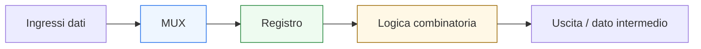
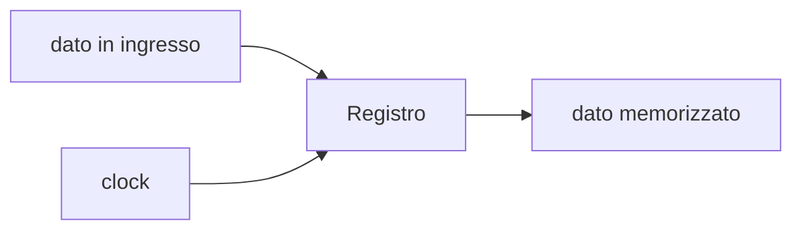
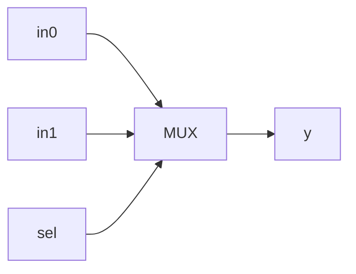
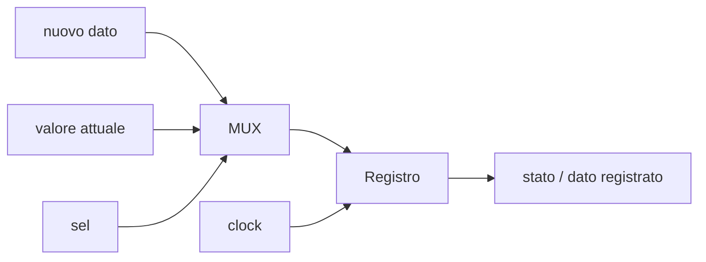
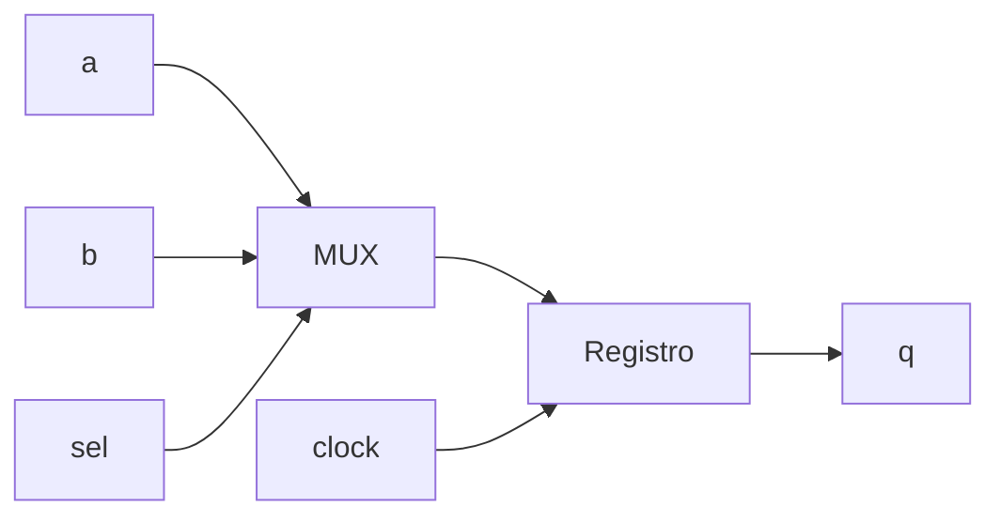
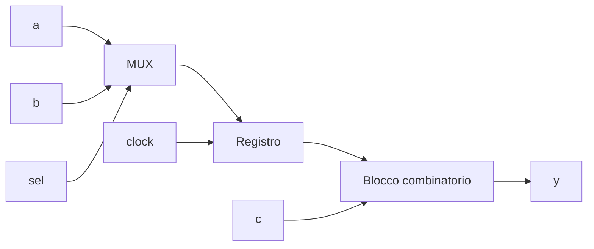

# Registri, multiplexer e datapath elementari

Dopo aver introdotto **clock**, **reset** e **tempo**, il passo successivo naturale è mostrare come questi concetti si concretizzino nei primi veri mattoni architetturali della progettazione digitale. In questa pagina il focus è su tre elementi fondamentali:
- i **registri**
- i **multiplexer**
- i **datapath elementari**

Questa lezione è molto importante perché segna il passaggio dai concetti di base — segnali, logica combinatoria, logica sequenziale, tempo — alla lettura di strutture che compaiono davvero in quasi ogni progetto digitale reale. Quando un sistema deve:
- memorizzare dati;
- selezionare tra più sorgenti;
- trasformare e trasferire informazione;
- organizzare il flusso del dato nel tempo;

allora entrano quasi sempre in gioco proprio questi tre elementi.

Dal punto di vista progettuale, questa pagina serve a chiarire:
- il ruolo del registro come elemento di stato e di sincronizzazione;
- il ruolo del mux come elemento di selezione del percorso dati;
- il significato di un datapath come organizzazione strutturata di registri, logica combinatoria e controllo;
- il motivo per cui questi blocchi siano alla base di FSM, pipeline, processori, controller e moduli RTL in generale.

Questa pagina mantiene il taglio della sezione:
- didattico ma tecnico;
- concettuale ma vicino all’architettura reale;
- orientato alla lettura dell’hardware;
- accompagnato da schemi ed esempi quando utili.

## 1. Perché questi blocchi sono così importanti

La prima domanda utile è: perché proprio registri, mux e datapath meritano una pagina specifica?

### 1.1 Perché compaiono ovunque
Questi elementi sono presenti in:
- semplici moduli RTL;
- contatori;
- FSM con output registrati;
- datapath di calcolo;
- pipeline;
- interfacce;
- controller;
- processori;
- acceleratori.

### 1.2 Perché collegano subito teoria e architettura
Con questi blocchi si vede molto chiaramente il passaggio da:
- concetto astratto di informazione;
- logica combinatoria;
- stato e tempo;

a una vera struttura hardware organizzata.

### 1.3 Perché preparano il resto della sezione
Le lezioni successive su FSM, pipeline, sintesi, timing e integrazione si appoggeranno continuamente a questi elementi.

---

## 2. Che cos’è un registro

Il **registro** è un elemento di memoria che memorizza una informazione e la aggiorna in corrispondenza degli eventi temporali previsti, tipicamente regolati dal clock.

### 2.1 Significato essenziale
Il registro:
- conserva un valore;
- lo rende disponibile come stato del sistema;
- lo aggiorna quando il circuito decide di campionare un nuovo dato.

### 2.2 Perché è importante
Il registro è uno dei blocchi più fondamentali di tutta la progettazione digitale perché permette di:
- conservare informazione nel tempo;
- separare i percorsi combinatori;
- scandire il comportamento del sistema in cicli;
- costruire pipeline;
- memorizzare stato di controllo o dati del datapath.

### 2.3 Visione intuitiva
Il registro è il punto in cui un dato “diventa stato”.

---

## 3. Registro come confine temporale

Uno degli aspetti più importanti del registro non è solo la memoria, ma anche il suo ruolo nel tempo del sistema.

### 3.1 Che cosa significa
Un registro delimita il passaggio tra:
- un tratto di logica combinatoria prima del campionamento;
- uno stato stabile dopo il campionamento.

### 3.2 Perché è importante
Questo rende il registro un elemento centrale per:
- organizzare il comportamento del sistema;
- controllare il timing;
- segmentare il calcolo in passi temporali.

### 3.3 Conseguenza progettuale
Quando il progettista inserisce un registro, non sta solo memorizzando un valore: sta anche strutturando il tempo del circuito.

---

## 4. Registro a singolo bit e registro multi-bit

Un registro può memorizzare:
- un singolo bit;
- una parola dati più ampia.

### 4.1 Registro a singolo bit
È utile per:
- flag;
- enable memorizzati;
- segnali di controllo;
- stato elementare.

### 4.2 Registro multi-bit
È utile per:
- dati di un datapath;
- contatori;
- indirizzi;
- valori intermedi;
- uscita registrata di un blocco.

### 4.3 Perché è importante
Mostra che il registro è un concetto generale: la differenza è solo nella quantità e nel significato dell’informazione memorizzata.

---

## 5. Che cos’è un multiplexer

Il **multiplexer**, spesso abbreviato in **mux**, è un blocco combinatorio che seleziona uno tra più ingressi e lo porta in uscita.

### 5.1 Significato essenziale
Il mux non crea nuova informazione e non la memorizza. Sceglie quale sorgente debba proseguire lungo un certo percorso del circuito.

### 5.2 Perché è importante
Il mux è uno dei blocchi più centrali della progettazione digitale perché viene usato per:
- scegliere tra più dati;
- selezionare il prossimo valore di un registro;
- decidere tra percorsi alternativi del datapath;
- implementare modalità operative;
- instradare segnali di controllo.

### 5.3 Visione intuitiva
Il mux è un “selettore di strada” per l’informazione.

---

## 6. Perché il mux è così centrale nel datapath

Molti blocchi che sembrano “complessi” sono in realtà combinazioni di:
- registri;
- logica combinatoria;
- mux.

### 6.1 Dove compare
Il mux è usato spesso per decidere:
- quale dato caricare in un registro;
- quale operazione selezionare;
- quale ingresso propagare in uscita;
- quale percorso attivare in base allo stato o al controllo.

### 6.2 Perché è importante
Questo rende il mux uno dei blocchi più utili per capire come il controllo influenzi il percorso dati.

### 6.3 Messaggio progettuale
Molto spesso, dietro una scelta funzionale del sistema, c’è un mux.

---

## 7. Registro + mux: un pattern fondamentale

Uno dei pattern più importanti in assoluto è la combinazione tra registro e mux.

### 7.1 Perché è fondamentale
Questa struttura permette di:
- scegliere quale valore caricare;
- memorizzarlo;
- usarlo nei cicli successivi.

### 7.2 Esempio intuitivo
Il sistema può decidere se:
- mantenere il valore attuale;
- caricare un nuovo dato;
- caricare il risultato di una operazione.

### 7.3 Schema concettuale

### 7.4 Perché è importante
Questa è la base di:
- registri con enable;
- contatori;
- accumulatori;
- FSM;
- datapath controllati.

---

## 8. Che cos’è un datapath

Il **datapath** è la parte del circuito che trasporta, seleziona, memorizza e trasforma i dati.

### 8.1 Significato essenziale
Nel datapath troviamo tipicamente:
- registri;
- mux;
- operatori logici o aritmetici;
- comparatori;
- bus;
- dati intermedi.

### 8.2 Che cosa fa
Il datapath prende informazione e la:
- sposta;
- combina;
- modifica;
- conserva;
- inoltra verso altri blocchi o stadi.

### 8.3 Perché è importante
Il datapath è la parte del sistema in cui la funzione concreta sul dato prende forma.

---

## 9. Datapath elementare: che cosa significa

Quando parliamo di **datapath elementare**, ci riferiamo a una struttura semplice ma già significativa in cui:
- esiste almeno un percorso dati;
- ci sono registri e/o logica combinatoria;
- il flusso del dato è leggibile;
- il controllo può già influenzare il comportamento.

### 9.1 Esempi semplici
- registro con enable;
- selezione tra due ingressi da caricare;
- piccolo accumulatore;
- stadio di elaborazione con uscita registrata;
- blocco con mux + operatore + registro.

### 9.2 Perché è utile studiarli
Questi casi mostrano in forma compatta ciò che poi, nei sistemi più grandi, si ripete molte volte su scala maggiore.

---

## 10. Esempio: registro con selezione di ingresso

Immaginiamo un blocco che possa caricare in un registro uno tra due ingressi:
- `a`
- `b`

in base a un segnale `sel`.

### 10.1 Schema concettuale

### 10.2 Che cosa mostra
- selezione di sorgente;
- memorizzazione del dato;
- dipendenza dal clock per l’aggiornamento.

### 10.3 Perché è importante
Questo esempio elementare è già un vero datapath:
- ha ingressi dati;
- ha un percorso selezionabile;
- ha stato;
- ha struttura temporale.

---

## 11. Esempio: accumulatore elementare

Consideriamo ora un blocco che, a ogni aggiornamento, possa:
- mantenere il valore corrente;
- oppure sommare un ingresso al valore già memorizzato.

### 11.1 Che cosa contiene
- un registro;
- un adder;
- un mux di selezione;
- eventualmente un enable.

### 11.2 Perché è un ottimo esempio
Mostra molto chiaramente come un datapath elementare possa combinare:
- informazione presente;
- stato passato;
- logica combinatoria;
- controllo.

### 11.3 Significato progettuale
Questa è una delle forme più semplici in cui si vede davvero cooperare:
- memoria;
- controllo;
- trasformazione del dato.

---

## 12. Datapath e controllo

Anche in un datapath elementare compare spesso il tema del controllo.

### 12.1 Che cosa significa
Un datapath non decide sempre da solo:
- quale ingresso usare;
- quando aggiornare il registro;
- quale operazione applicare.

### 12.2 Da dove arriva il controllo
Può arrivare da:
- un segnale esterno;
- una FSM;
- una linea di configurazione;
- una condizione locale del circuito.

### 12.3 Perché è importante
Mostra che il datapath e la control unit sono concetti distinti ma profondamente legati.

---

## 13. Datapath come flusso dell’informazione

Uno dei modi più utili di leggere un datapath è vederlo come un **flusso dell’informazione**.

### 13.1 Domande utili
Quando si osserva un datapath conviene chiedersi:
- da dove arriva il dato?
- attraverso quali blocchi passa?
- viene trasformato?
- viene memorizzato?
- dove prosegue?
- con quale controllo?

### 13.2 Perché è importante
Aiuta a vedere il modulo non come insieme di fili, ma come una architettura del trattamento del dato.

### 13.3 Collegamento con il resto della sezione
Questa lettura sarà fondamentale quando parleremo di:
- FSM e controllo;
- pipeline;
- dal comportamento all’RTL;
- sintesi e timing.

---

## 14. Registro, mux e cammino del dato

Un datapath elementare può essere letto come percorso del dato attraverso blocchi fondamentali.

### 14.1 Esempio generale
- ingresso dati
- mux di selezione
- operatore combinatorio
- registro di stato
- uscita

### 14.2 Perché è importante
Questo è già sufficiente per introdurre:
- significato architetturale;
- comportamento temporale;
- ruolo dei segnali di controllo;
- impatto sul timing.

### 14.3 Messaggio utile
Il progetto digitale inizia a diventare davvero concreto quando si impara a seguire il cammino del dato dentro il blocco.

---

## 15. Registro e validità del dato

Quando un dato viene memorizzato in un registro, il suo ruolo nel sistema cambia.

### 15.1 Perché
Prima del registro il dato può essere solo una condizione presente o una variabile di ingresso. Dopo il registro diventa uno stato stabile del sistema per quel ciclo o per i cicli successivi.

### 15.2 Perché è importante
Questo aiuta a capire:
- differenza tra dato “in transito” e dato memorizzato;
- differenza tra combinatoria e stato;
- importanza del campionamento temporale.

### 15.3 Conseguenza progettuale
Un registro non serve solo a conservare informazione, ma anche a renderla disponibile in forma temporalmente strutturata.

---

## 16. Datapath e timing

Anche in un datapath elementare compaiono già considerazioni di timing.

### 16.1 Perché
Tra due registri può esserci logica combinatoria:
- mux;
- operatori;
- comparatori;
- reti di selezione.

### 16.2 Perché è importante
La profondità di questa logica influenza:
- il ritardo del percorso;
- il cammino critico;
- la frequenza massima del sistema.

### 16.3 Conseguenza
Anche i datapath più semplici vanno letti non solo in termini funzionali, ma anche temporali.

---

## 17. Esempio concettuale completo: piccolo percorso dati

Consideriamo un piccolo blocco in cui:
- il mux sceglie tra due ingressi `a` e `b`;
- il risultato viene registrato;
- l’uscita è la combinazione tra il valore registrato e un ingresso `c`.

### 17.1 Schema concettuale

### 17.2 Che cosa mostra
- selezione;
- memorizzazione;
- trasformazione del dato;
- distinzione tra percorso combinatorio e stato.

### 17.3 Perché è importante
È già una architettura piccola ma completa, molto vicina alla struttura reale di moltissimi moduli digitali.

---

## 18. Errori comuni di comprensione

Ci sono alcuni errori molto frequenti quando si iniziano a leggere registri, mux e datapath.

### 18.1 Pensare che il mux “faccia memoria”
Il mux seleziona, ma non memorizza nulla.

### 18.2 Pensare che il registro serva solo a “tenere un valore”
In realtà il registro ha anche un ruolo fondamentale di sincronizzazione e organizzazione temporale.

### 18.3 Leggere il datapath come semplice insieme di fili
Il datapath è una struttura architetturale con significato preciso sul flusso dell’informazione.

### 18.4 Non distinguere dati e controllo
Molti errori nascono proprio dal non separare chiaramente:
- che cosa trasporta il dato;
- che cosa decide il comportamento del percorso dati.

---

## 19. Buone pratiche concettuali

Anche a questo livello introduttivo, alcune abitudini mentali sono già molto utili.

### 19.1 Seguire il percorso del dato
Quando osservi un blocco, chiediti:
- da dove entra il dato?
- dove viene selezionato?
- dove viene registrato?
- dove viene trasformato?
- dove esce?

### 19.2 Distinguere stato e combinatoria
- il registro conserva
- il mux seleziona
- la logica combinatoria trasforma

### 19.3 Identificare il controllo
Ogni mux o registro governato da enable introduce una relazione tra percorso dati e controllo.

### 19.4 Prepararsi a leggere strutture più grandi
I datapath complessi sono spesso solo versioni estese e organizzate degli stessi pattern di base.

---

## 20. Collegamento con il resto della sezione

Questa pagina si collega direttamente alle prossime tappe del branch:
- **`fsm-and-control.md`**, perché il controllo governa molto spesso registri e mux;
- **`pipelining-latency-and-throughput.md`**, perché i registri segmentano il datapath nel tempo;
- **`from-behavior-to-rtl.md`**, dove questi blocchi diventeranno i mattoni concreti della modellazione RTL;
- **`synthesis-area-and-timing.md`**, dove l’impatto di registri, mux e logica combinatoria verrà letto in termini di area e timing;
- **`basic-verification-and-debug.md`**, perché questi elementi sono anche i primi punti da osservare in simulazione e debug.

---

## 21. In sintesi

Registri, multiplexer e datapath elementari sono tra i mattoni più importanti della progettazione digitale.

- Il **registro** memorizza l’informazione e struttura il tempo del sistema.
- Il **mux** seleziona il percorso che il dato deve seguire.
- Il **datapath** organizza registri, logica combinatoria e controllo per trasformare e trasferire informazione.

Capire bene questi tre elementi significa fare un passo decisivo verso la lettura di sistemi digitali come vere architetture hardware.

## Prossimo passo

Il passo successivo naturale è **`fsm-and-control.md`**, perché adesso conviene introdurre il blocco che governa in modo esplicito il comportamento del sistema nel tempo:
- macchine a stati finiti
- logica di controllo
- rapporto tra stato, transizioni e segnali di comando
