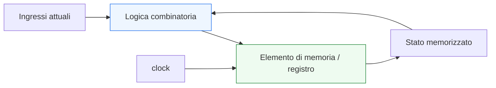
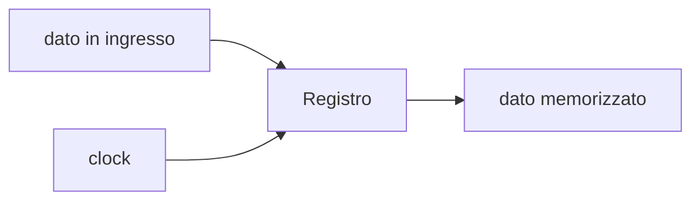
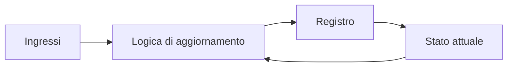

# Logica sequenziale e memoria

Dopo aver introdotto la **logica combinatoria**, il passo successivo naturale è affrontare il secondo grande modello di comportamento dei circuiti digitali: la **logica sequenziale**. In questa pagina il focus è sul legame tra:
- **memoria**
- **stato**
- **tempo**
- **comportamento del circuito**

Questa lezione è molto importante perché gran parte dei sistemi digitali reali non può essere descritta solo come funzione degli ingressi attuali. Molti blocchi devono infatti:
- ricordare informazioni del passato;
- conservare uno stato interno;
- aggiornarsi in corrispondenza di eventi temporali;
- produrre uscite che dipendono anche da ciò che è accaduto in precedenza.

Dal punto di vista progettuale, questa pagina serve a chiarire:
- perché la memoria è necessaria nei sistemi digitali;
- che cosa significhi avere stato;
- in che modo la logica sequenziale differisca dalla combinatoria;
- quale ruolo abbiano registri, clock e reset;
- perché questi concetti siano alla base di FSM, pipeline, contatori, datapath e controllo.

Questa pagina mantiene il taglio della sezione:
- didattico ma tecnico;
- concettuale ma vicino al progetto reale;
- orientato alla lettura dell’hardware;
- accompagnato da schemi ed esempi quando utili.

## 1. Perché serve la logica sequenziale

La prima domanda utile è: perché la logica combinatoria non basta?

### 1.1 Perché molti sistemi devono ricordare
Ci sono moltissimi casi in cui il comportamento corretto dipende non solo dagli ingressi presenti adesso, ma anche da:
- che cosa è successo prima;
- in quale fase del comportamento si trova il sistema;
- quale dato era stato memorizzato;
- quanti cicli sono trascorsi.

### 1.2 Esempi intuitivi
Un sistema deve usare memoria quando vuole:
- contare eventi;
- mantenere un dato;
- ricordare lo stato di una procedura;
- aspettare un segnale e poi reagire dopo un certo tempo;
- seguire una sequenza di passi.

### 1.3 Perché è importante
Senza logica sequenziale non avremmo:
- registri;
- FSM;
- contatori;
- pipeline;
- memoria di stato;
- comportamento sincronizzato complesso.

---

## 2. Che cos’è la logica sequenziale

La **logica sequenziale** è la parte di un circuito digitale in cui il comportamento dipende:
- dagli ingressi attuali;
- e anche dallo **stato interno** del sistema.

### 2.1 Significato essenziale
A differenza della logica combinatoria, qui il circuito non reagisce soltanto al presente. Tiene conto anche di informazione memorizzata dal passato.

### 2.2 Perché si chiama “sequenziale”
Perché il comportamento del circuito si sviluppa come una sequenza nel tempo:
- uno stato porta al successivo;
- un dato viene memorizzato e poi riusato;
- un evento attuale ha effetto nei cicli successivi.

### 2.3 Perché è importante
Questo è il modello che permette di costruire sistemi che evolvono nel tempo in modo controllato.

---

## 3. Che cos’è la memoria in un circuito digitale

La **memoria** è la capacità del circuito di conservare informazione oltre l’istante in cui essa è stata ricevuta o prodotta.

### 3.1 Significato essenziale
Se un blocco memorizza un valore, allora quel valore può influenzare il comportamento futuro anche quando gli ingressi sono cambiati.

### 3.2 Esempi di memoria
- contenuto di un registro;
- stato di una FSM;
- valore di un contatore;
- dato in uno stadio pipeline;
- flag interno.

### 3.3 Perché è importante
La memoria trasforma un blocco da semplice funzione logica a sistema dinamico con evoluzione temporale.

---

## 4. Che cos’è lo stato

Uno dei concetti più importanti della progettazione digitale è lo **stato**.

### 4.1 Significato essenziale
Lo stato è l’informazione interna memorizzata dal sistema che contribuisce a determinarne il comportamento futuro.

### 4.2 Perché non coincide sempre con “uscita”
Uno stato può essere:
- visibile all’esterno;
- parzialmente visibile;
- completamente interno al modulo.

### 4.3 Esempi intuitivi
Lo stato può rappresentare:
- “sto aspettando”
- “sto elaborando”
- “ho già ricevuto il primo dato”
- “il contatore vale 5”
- “questo registro contiene il valore intermedio”

### 4.4 Perché è importante
Capire lo stato significa capire perché un blocco possa reagire in modo diverso agli stessi ingressi in momenti diversi.

---

## 5. Differenza fondamentale tra combinatorio e sequenziale

Questa è una delle distinzioni più importanti di tutta la progettazione digitale.

### 5.1 Logica combinatoria
L’uscita dipende solo dagli ingressi attuali.

### 5.2 Logica sequenziale
L’uscita o il comportamento dipendono anche da informazione memorizzata in precedenza.

### 5.3 Perché è utile formularla così
Aiuta a leggere un blocco chiedendosi:
- questo circuito ricorda qualcosa?
- se gli ingressi si ripetono, l’uscita può comunque essere diversa?
- esiste uno stato interno?

### 5.4 Conseguenza progettuale
Questa distinzione è il punto di partenza per leggere:
- registri;
- FSM;
- pipeline;
- controllo del flusso;
- protocolli temporali.

---

## 6. Il ruolo del tempo nella logica sequenziale

La logica sequenziale non si capisce senza introdurre esplicitamente il **tempo**.

### 6.1 Perché
Uno stato memorizzato ha senso solo se esiste una dinamica temporale che dice:
- quando viene acquisito;
- quanto dura;
- quando viene aggiornato;
- quando influenza il comportamento.

### 6.2 Che cosa significa in pratica
Un circuito sequenziale evolve nel tempo, cioè:
- parte da una certa condizione;
- riceve eventi;
- memorizza informazioni;
- passa a nuove condizioni.

### 6.3 Perché è importante
Questo prepara direttamente ai temi di:
- clock;
- reset;
- registri;
- FSM;
- pipeline.

---

## 7. Il registro come elemento base della memoria

Uno dei blocchi fondamentali della logica sequenziale è il **registro**.

### 7.1 Che cos’è
Un registro è un elemento che memorizza un valore e lo mantiene fino a un successivo aggiornamento.

### 7.2 Perché è importante
Gran parte dello stato nei sistemi digitali reali è memorizzata proprio in registri o insiemi di flip-flop.

### 7.3 Che cosa permette di fare
- conservare dati;
- separare il tempo in intervalli;
- definire stadi di pipeline;
- memorizzare stato di controllo;
- costruire contatori e memorie di breve durata.

### 7.4 Visione intuitiva

---

## 8. Registro e aggiornamento dello stato

Un registro non cambia “in ogni momento” come una rete combinatoria. Il suo aggiornamento è regolato.

### 8.1 Che cosa significa
Il valore memorizzato viene aggiornato solo in corrispondenza di certi eventi, tipicamente legati al clock.

### 8.2 Perché è importante
Questo permette di:
- sincronizzare il comportamento del sistema;
- evitare aggiornamenti incontrollati;
- organizzare il flusso del dato nel tempo.

### 8.3 Conseguenza progettuale
Il registro è il punto in cui il sistema “prende una decisione temporale” su quando rendere stabile un nuovo valore.

---

## 9. Esempio intuitivo: contatore

Un contatore è uno degli esempi più semplici e più utili di logica sequenziale.

### 9.1 Perché è sequenziale
Per sapere quale valore produrre nel passo successivo, il blocco deve ricordare il valore precedente.

### 9.2 Che cosa mostra
Mostra in modo molto chiaro:
- memoria del passato;
- aggiornamento nel tempo;
- evoluzione dello stato;
- dipendenza da eventi successivi.

### 9.3 Perché è un buon esempio
Se gli ingressi fossero sempre uguali ma il contatore continuasse a cambiare, allora è evidente che il comportamento non dipende solo dal presente.

---

## 10. Esempio intuitivo: macchina a stati

Anche una **FSM** è un esempio fondamentale di logica sequenziale.

### 10.1 Perché
La macchina deve ricordare:
- in quale stato si trova;
- che fase del comportamento sta eseguendo;
- quale transizione è ammessa nel prossimo passo.

### 10.2 Perché è importante
Mostra che la logica sequenziale non riguarda solo numeri memorizzati, ma anche controllo e comportamento procedurale del sistema.

### 10.3 Conseguenza
Lo stato memorizzato diventa parte integrante del significato del circuito.

---

## 11. Dato presente e dato memorizzato

È utile distinguere due forme di informazione:
- informazione presente sugli ingressi;
- informazione memorizzata internamente.

### 11.1 Dato presente
È ciò che arriva ora al blocco.

### 11.2 Dato memorizzato
È ciò che il blocco ha conservato da un istante o ciclo precedente.

### 11.3 Perché è importante
Molti comportamenti sequenziali nascono proprio dalla combinazione di:
- dato attuale;
- stato precedente.

### 11.4 Esempio concettuale
Una FSM può decidere la prossima azione in base:
- al segnale `start` presente adesso;
- e allo stato `IDLE` o `RUN` memorizzato.

---

## 12. Logica sequenziale e feedback

Molti circuiti sequenziali possono essere letti come presenza di una forma di **feedback**.

### 12.1 Che cosa significa
Il valore memorizzato dal circuito può tornare a influenzare il comportamento successivo del circuito stesso.

### 12.2 Perché è importante
È proprio questa chiusura nel tempo che rende possibile lo stato.

### 12.3 Schema concettuale

### 12.4 Perché è utile
Mostra molto chiaramente che:
- il sistema usa il proprio stato precedente;
- lo aggiorna;
- lo rimette in gioco nel passo successivo.

---

## 13. Logica sequenziale e clock

Anche se il tema del clock verrà approfondito in una pagina dedicata, è utile introdurlo qui.

### 13.1 Perché compare naturalmente
Nei sistemi digitali sincronizzati, il clock scandisce il momento in cui i registri aggiornano il loro contenuto.

### 13.2 Perché è importante
Senza una base temporale condivisa, diventa molto più difficile coordinare:
- stato;
- trasferimento dei dati;
- avanzamento di FSM;
- pipeline;
- interfacce sincrone.

### 13.3 Messaggio importante
Il clock non serve alla logica combinatoria, ma è centrale per la logica sequenziale.

---

## 14. Logica sequenziale e reset

Anche il **reset** va introdotto fin da qui come parte naturale del comportamento sequenziale.

### 14.1 Perché serve
Se un circuito ha stato, bisogna poterlo portare in una condizione iniziale nota.

### 14.2 Che cosa permette
- inizializzare registri;
- partire da uno stato noto;
- riallineare il sistema;
- evitare comportamento indefinito all’avvio.

### 14.3 Perché è importante
La presenza della memoria rende necessario chiarire anche come il sistema inizi o venga riportato a una condizione controllata.

---

## 15. Logica sequenziale e pipeline

La pipeline è uno dei modi più importanti in cui la memoria viene usata nell’architettura digitale.

### 15.1 Perché
Ogni stadio di pipeline contiene registri che memorizzano risultati intermedi.

### 15.2 Che cosa mostra
Mostra che la logica sequenziale non serve solo a “ricordare”, ma anche a:
- organizzare il flusso del dato;
- suddividere il calcolo nel tempo;
- migliorare il timing;
- aumentare il throughput.

### 15.3 Perché è importante
Introduce una visione più architetturale della memoria nei sistemi digitali.

---

## 16. Logica sequenziale e latenza

Quando un circuito memorizza stato o attraversa registri intermedi, compare spesso il concetto di **latenza**.

### 16.1 Che cos’è
È il tempo o il numero di cicli che intercorrono tra:
- presentazione di un ingresso;
- disponibilità del risultato.

### 16.2 Perché è importante
La memoria introduce una struttura temporale del comportamento:
- il dato non compare “subito”;
- viene catturato, trasformato, inoltrato.

### 16.3 Perché questo conta
Aiuta a leggere i sistemi digitali come processi distribuiti nel tempo, non come sole trasformazioni istantanee.

---

## 17. Esempio concettuale: registro con enable

Immaginiamo un registro che aggiorni il proprio contenuto solo quando un segnale `enable` è attivo.

### 17.1 Che cosa mostra
Il blocco:
- conserva il valore precedente se `enable = 0`;
- acquisisce un nuovo valore se `enable = 1`.

### 17.2 Perché è utile
Mostra che la logica sequenziale non è solo “memoria cieca”, ma memoria governata da controllo.

### 17.3 Significato progettuale
Questo è un primo esempio concreto di come stato e controllo si combinino nei sistemi reali.

---

## 18. Errori comuni di comprensione

Ci sono alcuni errori molto frequenti quando si introduce la logica sequenziale.

### 18.1 Pensare che sequenziale significhi solo “più complicato”
In realtà significa soprattutto:
- presenza di memoria;
- dipendenza dal passato;
- evoluzione nel tempo.

### 18.2 Pensare che il clock sia solo un dettaglio
Il clock è invece uno dei pilastri della struttura sequenziale del sistema.

### 18.3 Confondere valore presente e stato
Non tutto ciò che esiste su un segnale è stato memorizzato; e non tutto lo stato è visibile subito in uscita.

### 18.4 Ridurre la memoria ai soli “blocchi RAM”
Anche un semplice registro o un contatore sono esempi fondamentali di memoria nel progetto digitale.

---

## 19. Buone pratiche concettuali

Anche a questo livello introduttivo, alcune abitudini mentali aiutano molto.

### 19.1 Chiedersi se il circuito deve ricordare qualcosa
Se la risposta è sì, siamo nel mondo sequenziale.

### 19.2 Distinguere sempre presente e passato
Questa è una delle chiavi più utili per leggere correttamente un blocco.

### 19.3 Leggere lo stato come informazione architetturale
Lo stato non è un dettaglio nascosto: è una parte essenziale del significato del modulo.

### 19.4 Prepararsi a leggere il comportamento nel tempo
La logica sequenziale costringe a pensare in termini di:
- eventi;
- cicli;
- stati;
- transizioni;
- latenza.

---

## 20. Collegamento con il resto della sezione

Questa pagina si collega direttamente alle prossime tappe del branch:
- **`clock-reset-and-time.md`**, che approfondirà il ruolo del tempo nei circuiti digitali;
- **`registers-mux-and-basic-datapaths.md`**, che mostrerà i registri come mattoni architetturali di base;
- **`fsm-and-control.md`**, dove lo stato verrà organizzato in macchine a stati finiti;
- **`pipelining-latency-and-throughput.md`**, dove memoria e registri verranno letti come strumenti architetturali per il flusso dati;
- **`basic-verification-and-debug.md`**, perché il comportamento sequenziale è uno dei temi più importanti anche dal lato della verifica.

---

## 21. In sintesi

La logica sequenziale è la parte della progettazione digitale in cui il comportamento dipende non solo dagli ingressi attuali, ma anche da informazione memorizzata nel passato.

- La **memoria** permette di conservare informazione.
- Lo **stato** rappresenta la condizione interna del sistema.
- I **registri** sono i mattoni fondamentali di questo comportamento.
- Il **tempo**, il **clock** e il **reset** danno forma all’evoluzione del circuito.

Capire bene la logica sequenziale significa compiere un passo decisivo verso la comprensione dei sistemi digitali reali.

## Prossimo passo

Il passo successivo naturale è **`clock-reset-and-time.md`**, perché adesso conviene approfondire in modo diretto il ruolo di:
- clock
- reset
- istanti di aggiornamento
- relazione tra tempo logico e comportamento del circuito
