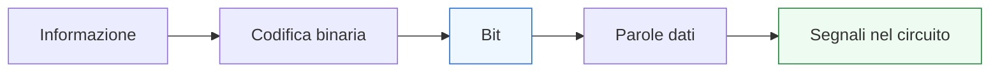
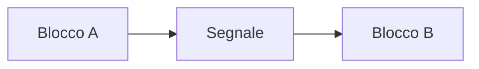
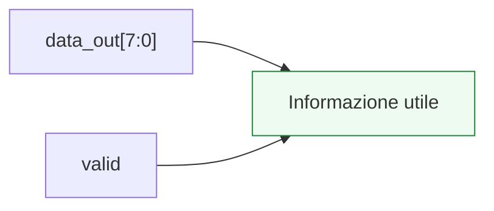

# Segnali, bit e rappresentazione dell’informazione

Dopo la panoramica generale sulla progettazione digitale, il passo successivo naturale è partire dall’elemento più fondamentale di tutto il percorso: il modo in cui l’informazione viene rappresentata e trasportata in un sistema digitale. In questa pagina il focus è su tre concetti strettamente collegati:
- i **segnali**
- i **bit**
- la **rappresentazione dell’informazione**

Questa lezione è molto importante perché tutti i blocchi che incontreremo nelle pagine successive — logica combinatoria, registri, FSM, datapath, pipeline, interfacce — lavorano sempre su informazione codificata sotto forma di valori logici e segnali. Senza una comprensione chiara di questo livello di base, il resto della progettazione digitale rischia di apparire come una sequenza di strutture prive di fondamento comune.

Dal punto di vista progettuale, questa pagina serve a chiarire:
- che cosa significhi dire che un sistema è “digitale”;
- come un segnale porti informazione nel tempo;
- che cosa sia un bit;
- come più bit si combinino in parole dati;
- perché il significato dell’informazione non dipenda solo dal valore binario, ma anche dal contesto architetturale in cui quel valore viene usato.

Questa pagina mantiene il taglio della sezione:
- didattico ma tecnico;
- concettuale ma vicino al progetto reale;
- orientato alla lettura dell’hardware;
- accompagnato da schemi e piccoli esempi quando utili.

## 1. Perché partire da segnali e informazione

La prima domanda utile è: perché una sezione sulla progettazione digitale parte proprio da qui?

### 1.1 Perché tutto il resto si appoggia a questi concetti
Quando parleremo di:
- logica combinatoria;
- registri;
- stati;
- pipeline;
- handshake;

staremo sempre, in fondo, parlando di:
- informazione che viene rappresentata;
- segnali che la trasportano;
- trasformazioni che la modificano nel tempo.

### 1.2 Perché “digitale” non significa solo “binario”
Significa anche:
- rappresentazione discreta dell’informazione;
- uso di convenzioni di codifica;
- lettura del valore in un certo contesto;
- interpretazione architetturale del dato.

### 1.3 Perché questo chiarisce meglio anche gli HDL
Quando in VHDL, Verilog o SystemVerilog vediamo un bus o un registro, non stiamo solo guardando “bit”, ma informazione con un certo ruolo nel progetto.

---

## 2. Che cos’è un segnale

Un **segnale** è una grandezza usata per rappresentare e trasportare informazione all’interno o tra i blocchi di un sistema digitale.

### 2.1 Significato essenziale
Dal punto di vista progettuale, un segnale può rappresentare:
- un ingresso;
- una uscita;
- una linea di controllo;
- un dato;
- uno stato;
- una condizione temporanea;
- una richiesta o una conferma di protocollo.

### 2.2 Perché è importante
Il segnale è il mezzo con cui i blocchi:
- ricevono informazione;
- producono risultati;
- si coordinano tra loro;
- esprimono il proprio stato nel tempo.

### 2.3 Visione intuitiva
Se il sistema digitale è un insieme di blocchi, il segnale è il modo in cui questi blocchi si parlano o si esprimono.

---

## 3. Segnale e tempo

Un punto molto importante da capire subito è che un segnale non è solo un valore astratto. È un valore che esiste **nel tempo**.

### 3.1 Che cosa significa
Un segnale può:
- restare costante per un certo intervallo;
- cambiare in un certo istante;
- essere campionato da un registro;
- indicare una condizione valida solo in certi cicli.

### 3.2 Perché è importante
Questo distingue un sistema digitale reale da una semplice tabella statica di valori.

### 3.3 Conseguenza progettuale
Quando si parla di segnali, bisogna sempre tenere presente:
- non solo il valore;
- ma anche quando quel valore è valido o significativo.

---

## 4. Che cos’è un bit

Il **bit** è l’unità elementare di informazione digitale.

### 4.1 Significato essenziale
Un bit può rappresentare due stati distinti, che in forma binaria vengono spesso indicati come:
- `0`
- `1`

### 4.2 Perché è importante
Il bit è la base su cui si costruiscono:
- segnali logici;
- decisioni di controllo;
- codifica dei dati;
- stati delle FSM;
- parole multi-bit.

### 4.3 Esempi intuitivi
Un bit può rappresentare:
- acceso / spento
- vero / falso
- attivo / inattivo
- sì / no
- disponibile / non disponibile

### 4.4 Perché questo conta
Mostra che il significato del bit non dipende solo dal valore binario, ma dalla convenzione con cui quel valore viene interpretato.

---

## 5. Il bit come valore logico e il bit come informazione

È utile distinguere due piani.

### 5.1 Bit come valore logico
A livello più elementare, il bit è una informazione binaria che può assumere due valori.

### 5.2 Bit come simbolo di progetto
Nel sistema reale, quel bit può rappresentare:
- un segnale di controllo;
- una condizione di protocollo;
- una parte di un dato;
- uno stato interno.

### 5.3 Perché è importante
Lo stesso valore `1` può voler dire cose molto diverse:
- “dati validi”
- “reset attivo”
- “bit più significativo alto”
- “modo operativo selezionato”

Questo dipende dal ruolo del segnale.

---

## 6. Da un bit a più bit: la parola dati

Molti sistemi digitali non lavorano solo su singoli bit, ma su insiemi di bit che formano una **parola dati**.

### 6.1 Che cos’è una parola dati
È un gruppo ordinato di bit trattati come una unità di informazione.

### 6.2 Esempi comuni
- 8 bit
- 16 bit
- 32 bit
- 64 bit

### 6.3 Perché è importante
Una parola può rappresentare:
- un numero;
- un carattere;
- un indirizzo;
- un insieme di flag;
- un comando;
- un dato da elaborare in un datapath.

### 6.4 Perché il gruppo conta
La parola non è solo “tanti bit messi insieme”, ma una struttura con un significato preciso nel sistema.

---

## 7. Bit, bus e segnali multi-bit

Quando più bit viaggiano insieme lungo un’interfaccia o dentro un blocco, si parla spesso di **bus** o di segnale multi-bit.

### 7.1 Che cos’è un bus
Un bus è un insieme di linee che trasporta una parola o una struttura di bit correlati.

### 7.2 Perché è importante
Molti blocchi reali lavorano su:
- bus dati;
- bus di indirizzo;
- bus di configurazione;
- bus di controllo.

### 7.3 Visione intuitiva
Un singolo segnale può essere visto come una linea. Un bus è un insieme organizzato di linee trattate come un insieme coerente.

---

## 8. Rappresentazione binaria dell’informazione

La progettazione digitale usa una rappresentazione binaria perché il sistema opera su stati discreti.

### 8.1 Che cosa significa rappresentare in binario
Significa codificare l’informazione usando combinazioni di bit.

### 8.2 Esempio semplice
Con 2 bit si possono rappresentare 4 combinazioni:
- `00`
- `01`
- `10`
- `11`

Con 3 bit si ottengono 8 combinazioni, e così via.

### 8.3 Perché è importante
Questo è il fondamento su cui si costruiscono:
- numeri;
- codici di stato;
- comandi;
- selettori di mux;
- istruzioni di controllo;
- campi di protocollo.

---

## 9. Il valore binario non basta: conta il significato

Uno dei punti più importanti di questa pagina è questo: la stessa configurazione binaria può significare cose diverse in contesti diversi.

### 9.1 Esempio concettuale
La parola `10` può rappresentare:
- il numero decimale 2;
- lo stato `RUN` di una FSM;
- una modalità operativa;
- una combinazione di due flag;
- il valore di un selettore.

### 9.2 Perché è importante
Il sistema digitale non manipola solo “bit grezzi”, ma informazione interpretata nel contesto di:
- datapath;
- controllo;
- protocollo;
- architettura.

### 9.3 Conseguenza progettuale
Quando si progetta un blocco, bisogna sempre chiedersi:
- che cosa rappresenta questo segnale?
- è un numero?
- è un codice di stato?
- è una informazione di controllo?
- è un valore valido solo in certe condizioni?

---

## 10. Segnali dati e segnali di controllo

Una distinzione molto utile, che ricomparirà spesso nella sezione, è quella tra:
- segnali dati;
- segnali di controllo.

### 10.1 Segnali dati
Trasportano l’informazione che il sistema elabora:
- valori numerici;
- parole di ingresso e uscita;
- contenuto del datapath.

### 10.2 Segnali di controllo
Indicano:
- quando caricare;
- quale percorso selezionare;
- se il dato è valido;
- se il blocco è pronto;
- in quale stato si trova il controllo.

### 10.3 Perché è importante
Aiuta a leggere il sistema non come massa indistinta di bit, ma come combinazione di:
- contenuto informativo;
- segnali che governano il comportamento.

---

## 11. Informazione e stato

Non tutta l’informazione in un sistema digitale è “in ingresso” o “in uscita”. Una parte importante vive come **stato interno**.

### 11.1 Che cos’è lo stato
È informazione memorizzata dal sistema e usata per determinare il comportamento futuro.

### 11.2 Esempi
- contenuto di un registro;
- stato di una FSM;
- contatore;
- dato pipeline intermedio;
- flag memorizzato.

### 11.3 Perché è importante
Questo mostra che l’informazione in un sistema digitale non è solo un flusso che entra e esce, ma anche qualcosa che viene conservato nel tempo.

---

## 12. Informazione e contesto temporale

Un segnale può avere un valore corretto, ma non essere comunque “significativo” nel momento sbagliato.

### 12.1 Esempio intuitivo
Un dato può essere presente su un bus, ma non essere ancora valido se il protocollo richiede un certo segnale di controllo.

### 12.2 Perché è importante
Questo prepara direttamente ai temi di:
- handshake;
- validità del dato;
- sincronizzazione col clock;
- pipeline;
- latenza.

### 12.3 Messaggio progettuale
Nel digitale non basta sapere “che valore c’è”, ma anche:
- quando conta;
- chi lo sta leggendo;
- con quale convenzione.

---

## 13. Esempio concettuale: parola dati e segnale di validità

Immaginiamo un blocco che esporta:
- `data_out[7:0]`
- `valid`

### 13.1 Che cosa significa
`data_out` rappresenta una parola di 8 bit, ma il suo contenuto è significativo solo quando `valid = 1`.

### 13.2 Perché è un esempio utile
Mostra che:
- il dato da solo non basta;
- serve il contesto del protocollo;
- l’informazione è una combinazione di contenuto e regola d’uso.

### 13.3 Perché questo tornerà utile
Questo concetto sarà fondamentale nelle pagine su interfacce, handshake e integrazione di sistema.

---

## 14. Errore comune: pensare che i bit “si spieghino da soli”

Uno degli errori più comuni all’inizio è credere che una parola binaria abbia significato intrinseco senza bisogno di contesto.

### 14.1 Perché è sbagliato
Il significato dipende da:
- convenzione;
- ruolo del segnale;
- posizione nel sistema;
- istante temporale;
- protocollo.

### 14.2 Perché questo conta
Evita di leggere i moduli digitali come semplici trasformatori di numeri. Molto spesso stanno trasformando strutture informative più ricche:
- dati;
- stati;
- comandi;
- segnali di controllo.

---

## 15. Errore comune: confondere informazione, segnale e struttura hardware

Un altro errore frequente è mescolare livelli diversi.

### 15.1 Informazione
È il contenuto che si vuole rappresentare.

### 15.2 Segnale
È il mezzo con cui quel contenuto viene trasportato o espresso nel sistema.

### 15.3 Struttura hardware
È il blocco che genera, trasforma, memorizza o consuma quella informazione.

### 15.4 Perché è importante
Questa distinzione aiuta a costruire una lettura architetturale più pulita del progetto digitale.

---

## 16. Buone pratiche concettuali

Anche a questo livello molto fondamentale, alcune abitudini mentali sono già utili.

### 16.1 Chiedersi sempre che cosa rappresenta un segnale
Non solo “quanti bit ha”, ma:
- è un dato?
- è un controllo?
- è uno stato?
- è un codice?
- è un valore valido solo in certe condizioni?

### 16.2 Distinguere contenuto e ruolo
Lo stesso pattern binario può avere significati molto diversi.

### 16.3 Leggere i segnali nel tempo
Un valore ha senso solo nel contesto temporale in cui il sistema lo usa.

### 16.4 Prepararsi a vedere il sistema come architettura
Segnali e parole dati sono i mattoni informativi dei blocchi architetturali che studieremo nelle prossime pagine.

---

## 17. Collegamento con il resto della sezione

Questa pagina si collega direttamente a tutto il seguito del branch:
- **`combinational-logic.md`**, perché la logica combinatoria trasforma informazione presente sugli ingressi;
- **`sequential-logic-and-memory.md`**, perché la memoria conserva informazione nel tempo;
- **`clock-reset-and-time.md`**, perché i segnali esistono e diventano significativi nel contesto temporale del sistema;
- **`registers-mux-and-basic-datapaths.md`**, dove bit e parole dati verranno organizzati in strutture architetturali concrete;
- **`interfaces-and-handshake.md`**, dove il significato dell’informazione dipenderà anche dal protocollo di trasferimento.

---

## 18. In sintesi

Segnali, bit e parole dati sono il livello più elementare ma anche più universale della progettazione digitale.

- Il **bit** è l’unità base di informazione.
- La **parola dati** è un insieme organizzato di bit.
- Il **segnale** è il mezzo con cui questa informazione viene trasportata, controllata o memorizzata nel tempo.

Capire bene questi concetti significa costruire la base comune su cui si appoggeranno tutte le strutture successive:
- logica;
- stato;
- controllo;
- datapath;
- interfacce;
- RTL.

## Prossimo passo

Il passo successivo naturale è **`combinational-logic.md`**, perché adesso conviene vedere come i segnali e l’informazione possano essere trasformati attraverso:
- relazioni logiche
- funzioni combinatorie
- reti senza memoria
- primi blocchi elementari della progettazione digitale
