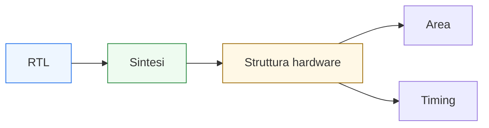

# Sintesi, area e timing

Dopo aver chiarito il passaggio **dal comportamento all’RTL**, il passo successivo naturale è vedere come quella descrizione venga letta e valutata nel flusso reale di progettazione. In questa pagina il focus è su tre temi strettamente collegati:
- la **sintesi**
- l’**area**
- il **timing**

Questa lezione è molto importante perché un blocco digitale non può essere giudicato solo dal fatto che “funziona” dal punto di vista logico o che il suo RTL appare leggibile. Una volta che il comportamento è stato tradotto in struttura, bisogna anche capire:
- quale hardware verrà inferito;
- quante risorse richiederà;
- quanto sarà complesso il percorso combinatorio;
- se riuscirà a lavorare alla frequenza desiderata;
- quali compromessi architetturali siano stati fatti tra semplicità, prestazioni e costo.

Dal punto di vista progettuale, questa pagina serve a chiarire:
- che cos’è la sintesi e perché non è una “magia del tool”;
- che cosa si intenda per area in un progetto digitale;
- perché il timing dipenda in gran parte dalla struttura RTL;
- come registri, mux, datapath, FSM e pipeline influenzino il risultato finale;
- perché queste metriche siano già parte della qualità del progetto, non un controllo da fare solo alla fine.

Questa pagina mantiene il taglio della sezione:
- didattico ma tecnico;
- concettuale ma vicino al progetto reale;
- orientato alla lettura dell’hardware;
- accompagnato da schemi ed esempi quando utili.

## 1. Perché questa pagina è importante

La prima domanda utile è: perché sintesi, area e timing meritano una trattazione congiunta?

### 1.1 Perché derivano tutti dalla stessa struttura RTL
Una volta scritto il blocco, il flusso di progetto non si limita a verificarne la correttezza funzionale. Deve anche capire:
- che struttura hardware corrisponde a quell’RTL;
- quante risorse richiede;
- quali percorsi temporali produce.

### 1.2 Perché un buon comportamento non garantisce un buon progetto
Un modulo può:
- simulare correttamente;
- essere architetturalmente sensato;
- ma risultare troppo costoso in area;
- oppure avere un cammino critico incompatibile con il clock richiesto.

### 1.3 Perché è importante
Area e timing non sono “problemi del tool”, ma il riflesso diretto delle scelte architetturali fatte nel blocco.

---

## 2. Che cos’è la sintesi

La **sintesi** è il processo con cui una descrizione RTL viene tradotta in una struttura hardware concreta.

### 2.1 Significato essenziale
Il tool di sintesi legge il progetto e cerca di inferire:
- registri;
- logica combinatoria;
- mux;
- comparatori;
- operatori;
- FSM;
- connessioni strutturali.

### 2.2 Che cosa produce
Il risultato è una rappresentazione del circuito molto più vicina all’hardware reale, tipicamente sotto forma di netlist o struttura equivalente.

### 2.3 Perché è importante
La sintesi è il punto in cui il progetto smette di essere solo comportamento descritto e diventa organizzazione concreta del circuito.

---

## 3. Perché la sintesi non è “magia”

Molti studenti tendono a immaginare la sintesi come una scatola nera che “capisce da sola”.

### 3.1 Perché è una visione sbagliata
Il tool non indovina l’intenzione del progettista. Legge pattern RTL e inferisce strutture coerenti con ciò che il codice descrive.

### 3.2 Che cosa significa in pratica
Se il progettista scrive:
- un registro chiaro,
- una logica combinatoria completa,
- una FSM leggibile,
- una pipeline ben strutturata,

il risultato sintetizzato sarà in genere più prevedibile.

### 3.3 Perché è importante
La qualità della sintesi dipende in gran parte dalla qualità dell’RTL.

---

## 4. Sintesi e livello RTL

Questa pagina parla della sintesi a partire da descrizioni **RTL**.

### 4.1 Che cosa significa
Vuol dire che il blocco viene descritto in termini di:
- registri;
- trasferimenti di dati;
- logica combinatoria tra registri;
- controllo tramite FSM o segnali di comando.

### 4.2 Perché è il livello giusto
L’RTL è il punto in cui:
- l’architettura è già concreta;
- il comportamento è ancora leggibile;
- la sintesi può inferire hardware in modo naturale.

### 4.3 Perché è importante
Questo collega direttamente le pagine già studiate sui fondamenti architetturali con il flusso reale di implementazione.

---

## 5. Esempio semplice di sintesi mentale

Immaginiamo una struttura con:
- un registro;
- un mux;
- una funzione logica;
- una uscita registrata.

### 5.1 Che cosa vede il progettista
Una microarchitettura con un percorso dati ben definito.

### 5.2 Che cosa vede il tool di sintesi
Una struttura in cui devono essere inferiti:
- registri;
- logica di selezione;
- rete combinatoria;
- connessioni tra questi elementi.

### 5.3 Perché è importante
Questo mostra che la sintesi è la rilettura della struttura già implicita nell’RTL.

---

## 6. Che cos’è l’area

L’**area** rappresenta, in senso generale, quanto “hardware” il progetto richiede.

### 6.1 Significato essenziale
Area significa chiedersi:
- quanti registri servono;
- quanta logica è necessaria;
- quanto sono grandi i blocchi combinatori;
- quante risorse vengono occupate.

### 6.2 Perché è importante
Un blocco più grande:
- può costare di più;
- può occupare più risorse;
- può consumare di più;
- può essere più difficile da integrare o da ottimizzare.

### 6.3 Perché non va letta in modo astratto
L’area non è una metrica “decorativa”. È il riflesso diretto delle scelte architetturali e della struttura del blocco.

---

## 7. Area e numero di registri

Uno dei contributi più immediati all’area è il numero di registri.

### 7.1 Perché
Ogni registro introduce memoria fisica e struttura aggiuntiva nel circuito.

### 7.2 Dove cresce il numero di registri
Per esempio in presenza di:
- pipeline più profonde;
- più stadi intermedi;
- buffer;
- duplicazione del dato;
- segnali di validità accompagnati ai dati.

### 7.3 Perché è importante
L’uso dei registri migliora spesso il timing, ma non è gratuito dal punto di vista dell’area.

---

## 8. Area e logica combinatoria

Anche la logica combinatoria contribuisce direttamente all’area.

### 8.1 Esempi
- mux;
- operatori aritmetici;
- comparatori;
- decodifiche;
- reti di selezione;
- logica di controllo.

### 8.2 Perché è importante
Una soluzione più “ricca” dal punto di vista funzionale o più generosa nella selezione dei percorsi può introdurre più logica di quella realmente necessaria.

### 8.3 Conseguenza progettuale
Ridurre duplicazioni inutili e rendere più pulito il percorso dati può aiutare anche sul piano dell’area.

---

## 9. Area e architettura

L’area dipende meno dalla sintassi e molto di più dalla microarchitettura.

### 9.1 Perché
Decisioni come:
- quanti registri usare;
- quante repliche di un blocco creare;
- quante funzioni tenere in parallelo;
- quanto pipeline introdurre;
- quanto controllo esplicito aggiungere

influenzano direttamente la struttura risultante.

### 9.2 Perché è importante
L’area non si “aggiusta” magicamente dopo. È già implicita nelle scelte di progetto.

### 9.3 Messaggio progettuale
Pensare all’area significa leggere la struttura del blocco con occhio architetturale.

---

## 10. Che cos’è il timing

Il **timing** riguarda la capacità del circuito di rispettare i vincoli temporali richiesti.

### 10.1 Significato essenziale
In un sistema sincrono, il dato deve avere il tempo necessario per:
- partire da un registro;
- attraversare la logica combinatoria;
- arrivare stabile al registro successivo.

### 10.2 Perché è importante
Se il percorso è troppo lungo rispetto al clock richiesto, il circuito non riesce a lavorare alla frequenza desiderata.

### 10.3 Perché questo conta
Il timing collega direttamente:
- struttura RTL;
- clock;
- pipeline;
- profondità della logica;
- qualità dell’architettura.

---

## 11. Cammino critico

Uno dei concetti più importanti del timing è il **cammino critico**.

### 11.1 Che cos’è
È il percorso temporale più lento tra quelli rilevanti del circuito.

### 11.2 Perché è importante
È questo percorso a limitare la frequenza massima raggiungibile dal sistema.

### 11.3 Esempio intuitivo
Un percorso del tipo:

**registro → mux → operatore → comparatore → registro**

può essere più critico di un percorso molto più breve.

### 11.4 Conseguenza progettuale
La qualità del timing si legge guardando:
- quanti blocchi combinatori ci sono tra due registri;
- quanto sono complessi;
- come è organizzato il flusso del dato.

---

## 12. Timing e logica combinatoria

Il timing dipende in gran parte dalla profondità e dalla complessità della logica combinatoria.

### 12.1 Che cosa conta
- numero di trasformazioni concatenate;
- profondità dei mux;
- operatori aritmetici;
- decodifiche e comparazioni;
- controllo combinatorio complesso.

### 12.2 Perché è importante
Un RTL che concentra troppe decisioni o troppe trasformazioni in un solo ciclo può essere difficile da chiudere temporalmente.

### 12.3 Conseguenza
Anche una descrizione formalmente corretta può essere progettualmente debole se il percorso combinatorio è troppo lungo.

---

## 13. Timing e registri

I registri sono i punti che delimitano i percorsi temporali.

### 13.1 Perché
Tra due registri si colloca la logica combinatoria che deve essere completata entro il tempo disponibile.

### 13.2 Perché è importante
Aggiungere o spostare registri cambia la struttura temporale del blocco:
- accorcia certi percorsi;
- può aumentare la frequenza massima;
- introduce latenza e area.

### 13.3 Messaggio progettuale
I registri non servono solo a memorizzare: servono anche a organizzare il timing del sistema.

---

## 14. Pipeline come strumento di timing

La pipeline è uno dei modi più importanti per migliorare il timing.

### 14.1 Perché
Inserendo registri intermedi si riduce la quantità di logica combinatoria tra due registri consecutivi.

### 14.2 Effetto
- il cammino critico può accorciarsi;
- il clock può diventare più rapido;
- la latenza aumenta;
- l’area cresce.

### 14.3 Perché è importante
Mostra molto bene il compromesso tra:
- area;
- timing;
- latenza;
- throughput.

---

## 15. Area e timing come compromesso

Uno dei messaggi più importanti di questa pagina è che area e timing sono spesso in tensione tra loro.

### 15.1 Esempio tipico
Se aggiungi pipeline:
- migliori spesso il timing;
- ma aumenti registri e area.

### 15.2 Altro esempio
Se cerchi di ridurre troppo il numero di registri:
- puoi ridurre area;
- ma allungare i percorsi combinatori;
- peggiorando il timing.

### 15.3 Perché è importante
Il progetto digitale reale non cerca quasi mai di ottimizzare una sola metrica. Deve trovare un equilibrio.

---

## 16. Sintesi, area e timing riletti sui blocchi già studiati

Tutti i concetti visti fin qui nella sezione possono essere riletti da questo punto di vista.

### 16.1 Registri
- aumentano area;
- delimitano il timing;
- introducono stato e latenza.

### 16.2 Mux
- aumentano la logica combinatoria;
- influenzano area e cammino critico;
- rendono flessibile il datapath.

### 16.3 FSM
- introducono stato e logica di transizione;
- possono avere impatto sul timing del controllo;
- richiedono strutture leggibili per sintesi prevedibile.

### 16.4 Pipeline
- aumentano area e latenza;
- migliorano spesso il timing;
- alzano il throughput potenziale.

### 16.5 Interfacce e handshake
- introducono controllo e registrazione del flusso dati;
- possono influire su area e temporizzazione del blocco.

---

## 17. Esempio concettuale: stessa funzione, RTL diversi

Immaginiamo due modi diversi di implementare lo stesso comportamento.

### 17.1 Soluzione A
- un solo ciclo;
- poca struttura di controllo;
- percorso combinatorio lungo.

### 17.2 Soluzione B
- due stadi con un registro intermedio;
- percorso combinatorio più corto per stadio;
- latenza maggiore;
- area più alta.

### 17.3 Perché è importante
Funzionalmente i due blocchi possono essere equivalenti, ma:
- non occupano le stesse risorse;
- non hanno lo stesso timing;
- non hanno lo stesso comportamento temporale osservabile.

### 17.4 Messaggio progettuale
L’RTL è sempre una scelta di compromesso architetturale.

---

## 18. Perché il timing non è “solo un problema del backend”

Molti pensano che il timing si affronti solo dopo la sintesi o solo nelle ultime fasi.

### 18.1 Perché è una visione sbagliata
Il backend e gli strumenti di implementazione possono aiutare, ma il cammino critico nasce già dalla struttura del blocco.

### 18.2 Che cosa significa
Un RTL che:
- concentra troppa logica tra registri;
- usa troppi mux annidati;
- ha controllo molto profondo;
- non segmenta il dato nel tempo

porta con sé problemi di timing già alla radice.

### 18.3 Perché è importante
Pensare al timing significa progettare bene fin dall’RTL.

---

## 19. Che cosa rende un RTL “buono” per sintesi, area e timing

Possiamo rileggere la qualità dell’RTL con tre domande chiave.

### 19.1 È sintetizzabile in modo prevedibile?
Si capisce chiaramente:
- dove sono i registri;
- quali sono i percorsi combinatori;
- quale parte fa controllo;
- quale parte fa datapath?

### 19.2 Ha una struttura ragionevole in area?
Ci sono:
- duplicazioni inutili?
- pipeline superflue?
- percorsi troppo ridondanti?
- registri introdotti senza vero motivo?

### 19.3 Ha una struttura sostenibile per il timing?
I cammini tra registri sono:
- leggibili?
- troppo lunghi?
- compatibili con la frequenza desiderata?
- migliorabili con una diversa segmentazione?

---

## 20. Errori comuni di comprensione

Ci sono alcuni errori molto frequenti quando si introducono sintesi, area e timing.

### 20.1 Pensare che la sintesi “capisca tutto”
Il tool legge il codice, non le intenzioni implicite del progettista.

### 20.2 Guardare solo la correttezza funzionale
Un blocco corretto può comunque essere una cattiva scelta di area o timing.

### 20.3 Confondere registri con costo nullo
Ogni registro è utile, ma non è gratuito.

### 20.4 Vedere il timing come problema finale
In realtà è una proprietà già implicita nell’RTL.

### 20.5 Cercare una metrica perfetta unica
Non esiste quasi mai il blocco che sia contemporaneamente:
- minimo in area;
- massimo in frequenza;
- minimo in latenza;
- massimo in semplicità.

---

## 21. Buone pratiche concettuali

Anche a questo livello introduttivo, alcune abitudini sono molto utili.

### 21.1 Leggere sempre l’RTL come struttura hardware
Non solo come comportamento.

### 21.2 Identificare chiaramente:
- registri;
- logica combinatoria;
- controllo;
- interfacce;
- stadi di pipeline.

### 21.3 Chiedersi sempre quale sia il costo architetturale
Ogni scelta ha un effetto su:
- area;
- timing;
- latenza;
- complessità.

### 21.4 Pensare già al compromesso
La progettazione reale è sempre una scelta tra obiettivi in parte concorrenti.

---

## 22. Collegamento con il resto della sezione

Questa pagina si collega direttamente alle prossime tappe del branch:
- **`common-design-pitfalls.md`**, dove molti errori verranno riletti proprio alla luce di sintesi, area e timing;
- **`basic-verification-and-debug.md`**, perché un buon progetto è anche più facile da simulare, verificare e debuggare;
- **`from-block-to-system.md`**, dove le scelte di area e timing verranno collocate in un sistema più grande;
- **`fpga-asic-soc-contexts.md`**, dove area e timing assumeranno sfumature diverse a seconda del contesto implementativo;
- **`case-study.md`**, dove queste metriche torneranno in modo applicativo su un esempio completo.

---

## 23. In sintesi

La sintesi, l’area e il timing sono tre modi complementari di leggere la qualità di un progetto digitale.

- La **sintesi** traduce l’RTL in struttura hardware concreta.
- L’**area** misura quanto hardware il progetto richiede.
- Il **timing** misura quanto bene quella struttura si adatti ai vincoli temporali del sistema.

Capire bene questi tre aspetti significa iniziare a leggere l’RTL non solo come descrizione corretta di un comportamento, ma come scelta architetturale concreta con costi e benefici reali.

## Prossimo passo

Il passo successivo naturale è **`common-design-pitfalls.md`**, perché adesso conviene raccogliere gli errori più comuni della progettazione digitale rileggendoli proprio alla luce di:
- semantica del comportamento
- qualità dell’RTL
- sintesi
- area
- timing
