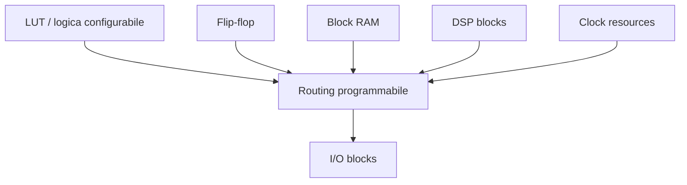
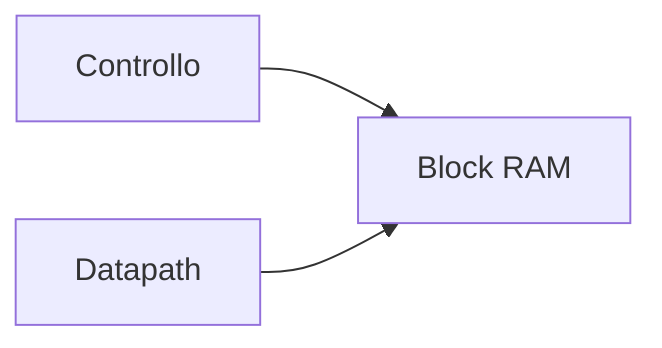
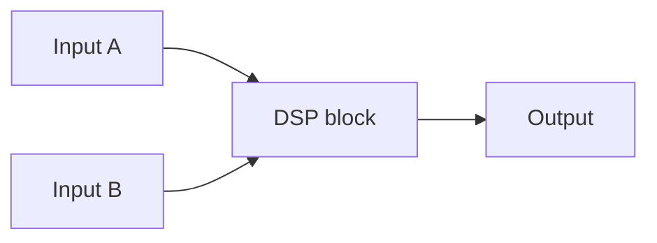

# Architettura di una FPGA

Per progettare bene su FPGA non basta scrivere una RTL corretta: occorre anche capire **su quale tipo di hardware il progetto verrà implementato**.  
Una FPGA non è un contenitore generico e astratto, ma una struttura fisica composta da risorse specifiche, ciascuna con caratteristiche precise.

Comprendere l'architettura interna della FPGA è fondamentale perché influenza direttamente:

- il modo in cui si scrive l'RTL;
- il tipo di risorse usate dal design;
- le prestazioni raggiungibili;
- il consumo;
- il timing;
- la facilità di chiusura del progetto;
- le strategie di debug e prototipazione.

In questa pagina introduciamo le principali componenti architetturali di una FPGA e il loro ruolo nel flow di progetto.

---

## 1. Visione d'insieme

Una FPGA moderna può essere vista come una matrice di risorse programmabili collegate da una rete di interconnessione configurabile.

Le componenti più importanti sono tipicamente:

- **logica configurabile**;
- **flip-flop e registri**;
- **routing programmabile**;
- **block RAM**;
- **DSP blocks**;
- **clocking resources**;
- **blocchi di I/O**;
- eventuali **hard IP** o blocchi specializzati.

Questa struttura spiega perché la progettazione FPGA richieda di ragionare non solo in termini di funzionalità, ma anche in termini di risorse fisiche disponibili.

---

## 2. Logica configurabile

Il cuore della FPGA è costituito dai **blocchi logici configurabili**.

Questi blocchi permettono di implementare:

- funzioni combinatorie;
- piccole reti di controllo;
- mux;
- logiche di selezione;
- parti del datapath;
- condizioni di abilitazione e controllo.

A livello concettuale, la risorsa base più nota è la **LUT**.

---

## 3. LUT: Look-Up Table

Le **LUT** (*Look-Up Table*) sono le unità fondamentali della logica combinatoria nelle FPGA.

## 3.1 Idea di base

Una LUT implementa una funzione logica memorizzando la corrispondenza tra ingressi e uscita.

In pratica, si può pensare a una LUT come a una piccola memoria che contiene la tabella di verità della funzione desiderata.

### Perché è utile

Questo permette di realizzare in modo flessibile molte funzioni combinatorie senza dover avere una porta dedicata per ogni caso.

## 3.2 Ruolo nel design

Le LUT vengono usate per implementare:

- logica di controllo;
- espressioni booleane;
- selettori;
- parti di decoder;
- piccole trasformazioni dati.

---

## 4. Flip-flop e logica sequenziale

Accanto alla logica combinatoria, una FPGA contiene un grande numero di **flip-flop** o registri.

Questi servono a implementare:

- stato sequenziale;
- registri di pipeline;
- macchine a stati;
- registri dati;
- buffering temporale.

## 4.1 Perché sono essenziali

Senza registri non sarebbe possibile costruire:

- circuiti sincroni;
- pipeline;
- protocolli temporizzati;
- controller complessi;
- percorsi ad alte prestazioni.

Le LUT e i flip-flop lavorano quindi insieme per costruire il circuito digitale.

---

## 5. Blocchi logici e pairing LUT-FF

In molte architetture FPGA, le LUT e i flip-flop non sono dispersi casualmente, ma organizzati in **blocchi logici** o strutture locali che li combinano.

Questo è importante perché:

- facilita il placement;
- riduce il costo di interconnessione locale;
- migliora l'efficienza nel mapping;
- rende possibile una migliore relazione tra logica combinatoria e registrazione.

Il progettista non deve sempre conoscere ogni dettaglio fisico del blocco logico del vendor, ma deve sapere che esiste una struttura organizzata, non una distribuzione uniforme astratta.

---

## 6. Routing programmabile

Uno degli elementi più distintivi di una FPGA è il **routing programmabile**.

## 6.1 Che cos'è

È la rete di interconnessione che collega:

- LUT;
- flip-flop;
- memorie;
- DSP;
- blocchi di clock;
- I/O.

## 6.2 Perché è così importante

In una FPGA, le prestazioni e la riuscita del progetto dipendono molto da come la logica viene mappata e da quanto il routing risulti:

- lungo;
- congestionato;
- ben distribuito;
- compatibile con il timing.

Il routing non è quindi un dettaglio trasparente: è una parte fondamentale dell'architettura del dispositivo.

---

## 7. Costi del routing

Rispetto a un ASIC, il routing in FPGA tende a essere più costoso in termini di:

- ritardo;
- consumo;
- prevedibilità temporale.

Questo perché la rete di interconnessione deve essere configurabile e quindi è intrinsecamente più generale.

### Conseguenze progettuali

- placement e timing closure diventano molto importanti;
- logiche fortemente accoppiate dovrebbero essere relativamente vicine;
- pipeline e struttura del datapath contano molto;
- il fanout elevato può diventare problematico.

Per questo capire il ruolo del routing è fondamentale nella cultura FPGA.

---

## 8. Block RAM

Le FPGA moderne includono blocchi di memoria dedicati, detti **Block RAM** o **BRAM**.

## 8.1 Che cosa sono

Sono memorie interne del dispositivo, più efficienti e capienti rispetto all'uso della sola logica distribuita.

## 8.2 Perché sono importanti

Permettono di implementare in modo efficiente:

- buffer;
- FIFO;
- memorie dati;
- tabelle;
- code;
- piccole memorie di programma;
- storage per sistemi embedded.

## 8.3 Perché non usare sempre LUT per la memoria

Usare LUT per implementare grandi memorie è spesso inefficiente.  
Le BRAM esistono proprio per fornire storage più adatto e meglio integrato nell'architettura del dispositivo.

---

## 9. Distributed RAM

In molte FPGA è possibile usare anche parte della logica configurabile come memoria, ottenendo una **distributed RAM**.

## 9.1 Quando è utile

È utile per:

- memorie piccole;
- tabelle locali;
- storage a bassa capacità;
- strutture vicine alla logica che le usa.

## 9.2 Differenza rispetto alla BRAM

- **distributed RAM**: più vicina alla logica, piccola, flessibile;
- **block RAM**: più dedicata, più capiente, più efficiente per buffer o memorie più grandi.

Questa distinzione è importante per scegliere correttamente la risorsa più adatta.

---

## 10. DSP blocks

Le FPGA includono spesso blocchi dedicati alle operazioni aritmetiche, noti come **DSP blocks** o **DSP slices**.

## 10.1 A cosa servono

Sono pensati per implementare in modo efficiente:

- moltiplicazioni;
- multiply-accumulate;
- somme su vettori;
- filtri;
- elaborazione numerica;
- parti di datapath ad alte prestazioni.

## 10.2 Perché sono preziosi

Usare una DSP dedicata è spesso molto più efficiente che implementare la stessa funzione con sola logica LUT+FF.

Per progettare bene su FPGA, è molto importante sapere quando una funzione può o deve essere mappata su DSP anziché su logica generica.

---

## 11. FIFO e strutture di buffering

Molte FPGA rendono semplice o efficiente implementare **FIFO** e strutture di buffering usando combinazioni di:

- BRAM;
- logica locale;
- registri;
- infrastrutture dedicate del vendor.

Le FIFO sono molto utili per:

- disaccoppiare produttore e consumatore di dati;
- gestire flussi streaming;
- collegare clock domain differenti, quando supportato correttamente;
- introdurre buffering ordinato tra sottoblocchi.

Anche se concettualmente non sempre sono una "macro" autonoma, sono una struttura molto naturale nell'uso pratico delle FPGA.

---

## 12. Clocking resources

Le FPGA includono risorse dedicate al **clocking**.

Queste possono includere, a livello concettuale:

- reti globali di clock;
- blocchi di gestione del clock;
- PLL;
- MMCM o strutture equivalenti;
- buffer dedicati al clock.

## 12.1 Perché sono speciali

Il clock non può essere trattato come una normale rete di segnale, perché deve raggiungere molti registri con:

- ritardi controllati;
- skew ridotto;
- distribuzione robusta.

## 12.2 Conseguenza pratica

Il progettista deve conoscere almeno i principi con cui il dispositivo gestisce i clock, perché essi influenzano:

- timing closure;
- reset;
- clock domain crossing;
- prestazioni generali del progetto.

---

## 13. Clock network globale

La rete di clock di una FPGA è in genere distinta dal routing normale.

Questo è importante perché:

- riduce il rischio di usare reti inadatte per il clock;
- migliora la distribuzione del segnale temporale;
- aiuta a mantenere lo skew sotto controllo;
- consente di raggiungere frequenze più elevate.

Per questo, in un progetto FPGA, il clock va trattato con molta più disciplina di un normale segnale di controllo.

---

## 14. Blocchi di I/O

Le FPGA includono **blocchi di I/O** che gestiscono la connessione tra logica interna e mondo esterno.

## 14.1 Ruolo

I blocchi I/O permettono di:

- ricevere segnali esterni;
- pilotare uscite;
- interfacciarsi con la board;
- adattare livelli e comportamenti elettrici, nei limiti del dispositivo e della configurazione.

## 14.2 Perché contano nel progetto

Le I/O influenzano:

- vincoli di pin assignment;
- timing degli ingressi e delle uscite;
- compatibilità con le periferiche esterne;
- uso della board reale.

Questo rende la progettazione FPGA fortemente collegata anche al contesto hardware esterno.

---

## 15. Hard IP e blocchi specializzati

Molte FPGA moderne includono anche blocchi **hard** o semi-hard, cioè risorse già implementate nel silicio in modo dedicato.

A seconda del dispositivo, possono esserci:

- controller memoria;
- transceiver;
- interfacce ad alta velocità;
- blocchi processor;
- sottosistemi specializzati.

Questi elementi rendono alcune FPGA particolarmente adatte a sistemi complessi e alla prototipazione di SoC.

Per una sezione introduttiva, è importante sapere che non tutte le risorse FPGA sono equivalenti o puramente "soft".

---

## 16. Tile e organizzazione fisica

Molte architetture FPGA sono organizzate in **tile** o regioni ripetute, che combinano risorse simili in una struttura regolare.

Questo approccio aiuta a:

- rendere scalabile l'architettura;
- organizzare il placement;
- fornire una certa prevedibilità locale nella disposizione delle risorse;
- distribuire in modo ordinato logica, memoria, DSP e clocking.

Il progettista non deve necessariamente conoscere la microstruttura esatta di ogni tile, ma è utile capire che la FPGA ha una geografia interna regolare e non arbitraria.

---

## 17. Relazione tra architettura e RTL

Capire l'architettura FPGA è importante perché l'RTL viene mappata su queste risorse reali.

### Esempi concreti

- una piccola funzione combinatoria → LUT;
- una pipeline → LUT + FF;
- una memoria → BRAM o distributed RAM;
- una moltiplicazione → DSP block, se inferita correttamente;
- un fanout ampio → carico sulla rete di routing e sul clocking.

Questa relazione è cruciale: un design RTL "corretto" ma inconsapevole dell'architettura può usare male il dispositivo e ottenere risultati deludenti.

---

## 18. Relazione tra architettura e timing

Anche il timing è strettamente legato all'architettura.

Dipende infatti da:

- profondità combinatoria tra registri;
- lunghezza del routing;
- uso corretto delle reti di clock;
- vicinanza fisica dei blocchi;
- mappatura su DSP o BRAM;
- gestione dei clock domain.

Questo spiega perché la conoscenza dell'architettura non sia un dettaglio teorico, ma una parte essenziale della progettazione ad alte prestazioni su FPGA.

---

## 19. Relazione tra architettura e consumo

Le risorse del dispositivo influenzano anche il consumo.

### Esempi

- molto routing attivo può aumentare il consumo;
- l'uso del clock su molti registri pesa molto;
- un DSP dedicato può essere più efficiente della logica sparsa;
- BRAM e distributed RAM hanno impatti diversi;
- la struttura fisica del design incide sull'attività e sulla distribuzione dei segnali.

Per questo la scelta della risorsa giusta è anche una scelta di efficienza.

---

## 20. Errori concettuali frequenti

Tra gli errori più comuni nello studio delle FPGA:

- pensare che tutta la logica sia equivalente e interscambiabile;
- ignorare il ruolo del routing;
- considerare BRAM e DSP come dettagli secondari;
- usare il clock come un normale segnale di routing;
- non capire che il dispositivo ha una geografia fisica reale;
- scrivere RTL senza alcuna consapevolezza del mapping sulle risorse.

Questi errori portano spesso a design:

- inefficienti;
- lenti;
- difficili da chiudere timing;
- poveri nel rapporto prestazioni/risorse.

---

## 21. Buone pratiche concettuali

Una buona lettura dell'architettura FPGA si basa su alcuni principi:

- conoscere le principali categorie di risorse;
- sapere quando usare LUT, BRAM e DSP;
- trattare clock e reset con disciplina;
- ricordare che il routing costa;
- scrivere RTL pensando al mapping reale;
- accettare che il dispositivo abbia vincoli fisici e strutturali.

---

## 22. Collegamento con ASIC

Le FPGA e gli ASIC condividono molti concetti di progettazione:

- RTL;
- timing;
- pipeline;
- clocking;
- floorplanning, in senso lato;
- verifica.

Tuttavia, la loro architettura interna è molto diversa.

In particolare:

- l'ASIC viene costruito ad hoc;
- la FPGA usa un tessuto programmabile preesistente.

Studiare l'architettura FPGA aiuta a capire anche perché una prototipazione su FPGA non sia identica a una realizzazione ASIC, pur essendone spesso un eccellente passo intermedio.

---

## 23. Collegamento con SoC

Nel contesto SoC, conoscere l'architettura FPGA è molto utile perché permette di prototipare:

- interconnect;
- memorie;
- periferiche;
- processori softcore;
- acceleratori;
- sottosistemi completi.

La sezione SoC mostra l'organizzazione del sistema; la sezione FPGA mostra il tipo di piattaforma fisica programmabile su cui quel sistema può essere sperimentato e validato.

---

## 24. Esempio concettuale

Immaginiamo di voler implementare su FPGA un piccolo acceleratore con:

- una pipeline di elaborazione;
- una moltiplicazione;
- un buffer di campioni;
- una FSM di controllo.

Una buona mappatura architetturale potrebbe usare:

- LUT per la logica di controllo;
- flip-flop per gli stadi di pipeline;
- DSP block per la moltiplicazione;
- BRAM per il buffer dati.

Questa scelta sarebbe in genere molto migliore che implementare tutto con sola logica generica.

L'esempio mostra bene che la progettazione su FPGA richiede di pensare in termini di **risorse del dispositivo**, non solo di comportamento funzionale.

---

## 25. In sintesi

L'architettura di una FPGA è costituita da un insieme di risorse programmabili e specializzate, tra cui:

- LUT;
- flip-flop;
- routing configurabile;
- block RAM;
- DSP blocks;
- clocking resources;
- blocchi di I/O;
- eventuali hard IP.

Comprendere queste risorse è essenziale per:

- scrivere RTL più efficace;
- migliorare timing e consumo;
- usare bene il dispositivo;
- fare debug e prototipazione in modo più consapevole.

In una FPGA, il design non vive in un vuoto astratto: vive dentro una struttura fisica precisa, che condiziona fortemente il risultato finale.

---

## Prossimo passo

Dopo aver visto l'architettura del dispositivo, il passo naturale successivo è approfondire il **flusso di progettazione FPGA**, cioè la sequenza di fasi che porta dalla specifica e dall'RTL fino al bitstream e al test su scheda reale.
