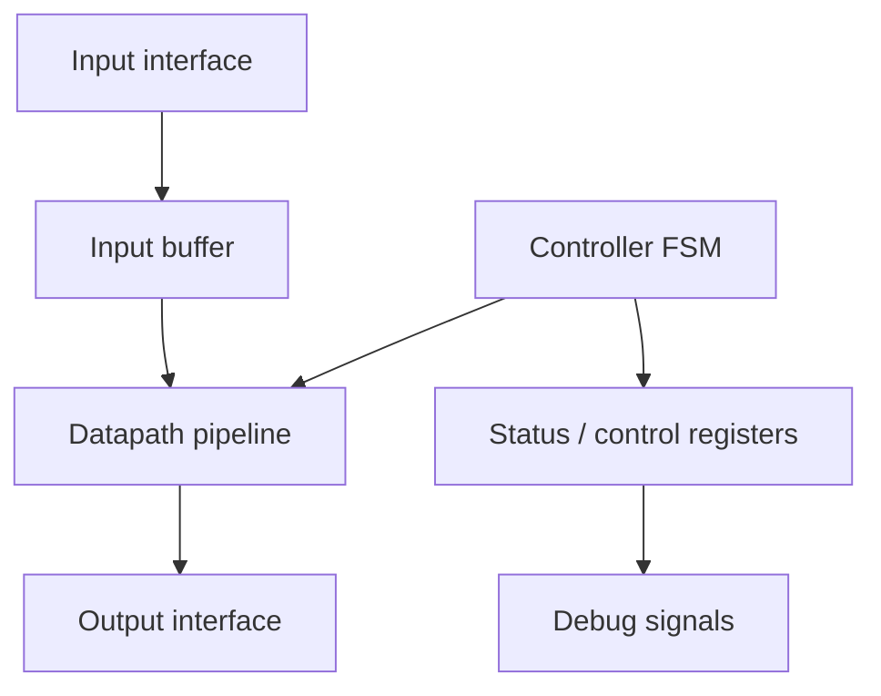
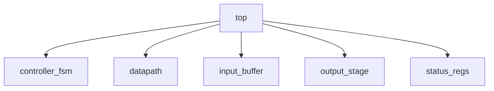
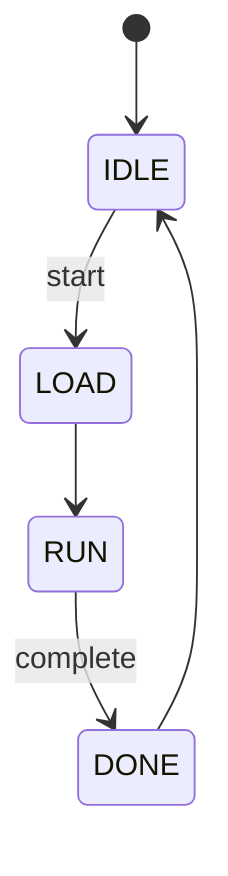
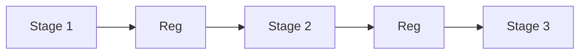

# Caso di studio: un progetto FPGA completo

Dopo aver introdotto le principali caratteristiche delle FPGA, il loro flow di progetto, le risorse dedicate, il timing, la verifica e il debug, è utile raccogliere tutti questi concetti in un **caso di studio concreto**.

L'obiettivo di questa pagina non è descrivere un sistema industriale complesso, ma costruire un esempio semplice e coerente che permetta di vedere, in un unico percorso, come si passa da:

- specifica;
- architettura;
- RTL;
- simulazione;
- vincoli;
- sintesi;
- implementazione;
- debug;
- test su board.

In altre parole, questa pagina vuole mostrare **come si progetta davvero un sistema su FPGA** quando si cerca di collegare teoria, tool e hardware reale.

---

## 1. Obiettivo del caso di studio

Il caso di studio deve permettere di vedere in modo unitario:

- come nasce la specifica di un progetto;
- come si sceglie una buona architettura per FPGA;
- come si scrive una RTL compatibile con le risorse del dispositivo;
- come si impostano verifica e vincoli;
- come si leggono sintesi e implementazione;
- come si arriva al bitstream;
- come si testa e si debugga il progetto sulla board.

Per questo scegliamo un esempio abbastanza piccolo da essere comprensibile, ma abbastanza ricco da toccare tutti i punti fondamentali.

---

## 2. Scelta del progetto

Come caso di studio consideriamo un **acceleratore streaming** semplice, implementato su FPGA, che:

- riceve una sequenza di dati;
- applica una trasformazione aritmetica elementare;
- memorizza temporaneamente alcuni campioni;
- produce un risultato in uscita;
- segnala il completamento dell'operazione;
- può essere osservato e testato su una board reale.

Questa scelta è molto efficace dal punto di vista didattico perché il progetto include:

- datapath;
- pipeline;
- FSM;
- buffering;
- interfaccia di input e output;
- segnali di controllo;
- possibilità di debug su board.

---

## 3. Specifica iniziale

La specifica del sistema può essere formulata così, in forma semplificata.

### Requisiti funzionali

Il sistema deve:

- ricevere dati in ingresso;
- acquisirli quando il segnale di validità è attivo;
- eseguire una semplice trasformazione numerica;
- produrre un risultato in uscita con segnale di validità;
- fornire un segnale `done` a fine elaborazione;
- supportare reset;
- essere eseguibile su una FPGA e osservabile su board.

### Requisiti prestazionali

Il sistema deve:

- lavorare con un clock definito;
- sostenere una frequenza ragionevole per la board;
- avere una latenza nota e prevedibile;
- chiudere timing sul dispositivo scelto.

### Requisiti di test e debug

Il sistema deve:

- essere verificabile in simulazione;
- essere osservabile con debug su board;
- permettere almeno una forma di riscontro visibile o seriale del risultato.

Questa specifica è sufficiente per avviare un percorso di progetto completo.

---

## 4. Architettura del sistema

Una possibile architettura del progetto è la seguente:

Questa architettura separa chiaramente:

- acquisizione dei dati;
- controllo;
- datapath;
- stato del sistema;
- segnali utili al debug.

### Perché è una buona architettura didattica

Permette di parlare di:

- modularità;
- pipeline;
- FSM;
- timing;
- uso delle risorse;
- segnali osservabili in debug.

---

## 5. Interfaccia del progetto

Per rendere il caso di studio concreto, definiamo un'interfaccia semplice.

### Segnali principali

- `clk`
- `rst_n`
- `start`
- `data_in`
- `data_in_valid`
- `data_out`
- `data_out_valid`
- `done`

### Comportamento atteso

1. il sistema riceve un comando di start;
2. acquisisce i dati in ingresso;
3. li elabora internamente;
4. emette il risultato;
5. segnala il completamento con `done`.

Questa struttura è semplice ma abbastanza ricca da mostrare sia il lato RTL sia il lato board-level del progetto.

---

## 6. Scelte architetturali principali

Per rendere il design compatibile con una FPGA reale, si prendono alcune decisioni importanti.

### Scelte chiave

- pipeline del datapath su più stadi;
- FSM semplice per il controllo;
- buffering locale per i dati;
- interfaccia pulita con segnali di validità;
- assenza di clock derivati artigianalmente;
- possibilità di esporre segnali di stato al debug.

### Motivazioni

- migliorare il timing;
- rendere la verifica più semplice;
- facilitare l'uso delle risorse FPGA;
- rendere il progetto debuggabile su board.

---

## 7. RTL del progetto

La fase RTL può essere organizzata in moduli come:

- `top`
- `controller_fsm`
- `datapath`
- `input_buffer`
- `output_stage`
- `status_regs`

### Aspetti da curare nella RTL

- separazione chiara tra controllo e datapath;
- pipeline esplicita;
- reset disciplinato;
- segnali di validità ben allineati;
- struttura favorevole alla sintesi su FPGA.

Questo rende il progetto leggibile e coerente con il flow.

---

## 8. FSM del controller

Il controller può essere realizzato con una FSM semplice.

### Stati possibili

- `IDLE`
- `LOAD`
- `RUN`
- `DONE`

### Sequenza generale

- in `IDLE` il sistema attende `start`;
- in `LOAD` cattura i dati;
- in `RUN` il datapath elabora;
- in `DONE` il sistema segnala il completamento e poi torna a `IDLE`.

Questa FSM è sufficientemente semplice da essere verificata facilmente ma abbastanza ricca da mostrare problemi tipici di controllo.

---

## 9. Datapath e pipeline

Il datapath viene progettato con una pipeline a più stadi.

### Esempio concettuale

- stadio 1: acquisizione/preparazione dato;
- stadio 2: operazione aritmetica principale;
- stadio 3: registrazione e uscita del risultato.

### Benefici

- timing più favorevole;
- struttura chiara;
- migliore allineamento con il flow FPGA;
- progetto più facile da portare su board.

---

## 10. Uso delle risorse FPGA nel caso di studio

Anche se il progetto resta semplice, è utile ragionare sulle risorse del dispositivo.

### Possibile mapping

- LUT per la logica di controllo;
- flip-flop per pipeline e registri di stato;
- eventuale BRAM per buffer più grandi, se si vuole estendere il progetto;
- eventuale DSP per operazioni aritmetiche più pesanti, se il datapath viene arricchito.

### Insegnamento

Anche un progetto relativamente piccolo beneficia di una visione orientata alle risorse della FPGA.

---

## 11. Simulazione e verifica

Prima della sintesi, il progetto deve essere verificato in simulazione.

### Cosa si verifica

- correttezza della FSM;
- comportamento del reset;
- acquisizione dei dati;
- latenza della pipeline;
- corretto allineamento di `data_out_valid`;
- generazione di `done`;
- casi normali e casi limite.

### Obiettivo didattico

Mostrare che il debug su board non deve sostituire la verifica RTL, ma completarla.

---

## 12. Vincoli del progetto

Per portare il progetto sulla FPGA reale servono vincoli ben definiti.

### Vincoli principali

- definizione del clock di sistema;
- assegnazione dei pin;
- standard I/O coerenti con la board;
- eventuale uso di pulsanti o UART per debug;
- relazione tra segnali esterni e interfacce del progetto.

### Obiettivo

Collegare il progetto logico al comportamento reale della scheda.

---

## 13. Sintesi del progetto

Dopo la simulazione, si esegue la sintesi.

### Cosa ci si aspetta di osservare

- uso ragionevole di LUT e flip-flop;
- mapping pulito della logica di controllo;
- assenza di inferenze anomale;
- timing preliminare plausibile;
- progetto compatibile con la FPGA target.

### Possibili problemi che emergono già qui

- troppa logica in un solo ciclo;
- fanout elevato;
- uso inatteso di risorse;
- struttura poco adatta alla frequenza target.

Questa fase fornisce il primo feedback concreto sulla qualità del design.

---

## 14. Implementazione: placement e routing

Il progetto sintetizzato viene poi implementato fisicamente sul dispositivo.

### Aspetti da osservare

- densità del design;
- qualità del placement;
- costo del routing;
- uso equilibrato delle risorse;
- timing post-route.

### Lezione principale

Anche un progetto piccolo può mostrare la differenza tra:

- correttezza logica;
- qualità dell'implementazione fisica sulla FPGA.

---

## 15. Timing closure del caso di studio

Dopo l'implementazione si controlla il timing.

### Cosa si può analizzare

- slack dei percorsi principali;
- stadi critici della pipeline;
- fanout dei segnali di controllo;
- eventuali problemi legati al reset;
- qualità del routing.

### Possibili correzioni

- aggiungere o spostare registri di pipeline;
- ridurre fanout;
- semplificare il controllo;
- migliorare la località del datapath;
- rifinire i vincoli, se necessario e corretto.

Questo passaggio insegna bene che il timing non è un dettaglio finale, ma una parte viva del progetto.

---

## 16. Generazione del bitstream

Una volta completata l'implementazione e verificata la chiusura timing, il tool genera il **bitstream**.

Questo rappresenta il punto in cui il progetto è pronto per essere caricato sulla FPGA.

### Significato didattico

Il bitstream è il collegamento concreto tra:

- progetto logico;
- implementazione fisica;
- hardware reale sulla board.

---

## 17. Test su board

Il progetto viene quindi caricato sulla scheda e testato in hardware reale.

### Tecniche possibili

- uso di LED per segnalare `done` o stati base;
- uso di UART per inviare il risultato;
- osservazione di segnali interni con logic analyzer integrato;
- test ripetuti con sequenze di input note;
- confronto con i risultati attesi della simulazione.

### Obiettivo

Verificare che il comportamento reale del sistema sia coerente con quello previsto.

---

## 18. Strategia di debug

Nel caso di studio, una buona strategia di debug potrebbe osservare almeno:

- reset;
- stato della FSM;
- validità dei dati nei diversi stadi di pipeline;
- segnali `start`, `done`, `data_out_valid`;
- valori intermedi del datapath, se utili.

### Strumenti possibili

- LED per segnali grossolani;
- UART per valori di output;
- logic analyzer interno per eventi complessi.

Questo permette di mostrare bene il legame tra verifica, implementazione e osservazione su board.

---

## 19. Estensioni del caso di studio

Il progetto può essere esteso in più direzioni per renderlo ancora più interessante.

### Estensione 1: uso di BRAM

Il buffer dati può diventare una vera memoria interna.

### Estensione 2: uso di DSP

L'operazione aritmetica può essere resa più ricca e mappata su DSP block.

### Estensione 3: interfaccia con processore

Il progetto può essere inserito in una piattaforma con softcore o memory-mapped registers.

### Estensione 4: integrazione SoC

L'acceleratore può essere trasformato in periferica o IP custom dentro un sistema più grande.

Queste estensioni mostrano bene come un esempio piccolo possa diventare un ponte verso temi più avanzati.

---

## 20. Errori tipici che il caso di studio aiuta a vedere

Questo esempio aiuta a visualizzare errori comuni del flow FPGA, ad esempio:

- reset non verificato bene;
- pipeline non allineata;
- handshake incompleto;
- timing non chiuso;
- fanout troppo alto;
- segnali osservabili troppo pochi per il debug;
- eccessivo affidamento al solo test su board;
- ipotesi di simulazione non realistiche rispetto alla scheda.

Il caso di studio vale non solo per il percorso corretto che mostra, ma anche per i problemi tipici che aiuta a riconoscere.

---

## 21. Collegamento con SoC

Questo progetto può essere visto come il nucleo di un futuro acceleratore integrabile in un sistema più grande.

Ad esempio, si può immaginare che in una fase successiva diventi:

- periferica memory-mapped;
- acceleratore comandato da un processore softcore;
- modulo inserito in una interconnect di sistema;
- IP sperimentato in una piattaforma SoC su FPGA.

Questo rende il caso di studio un ottimo ponte verso la progettazione di sistemi completi.

---

## 22. Collegamento con ASIC

Il progetto è anche un buon punto di partenza verso una possibile migrazione ad ASIC.

La prototipazione su FPGA permette infatti di:

- validare l'architettura;
- verificare il valore della pipeline;
- osservare il comportamento reale del controller;
- testare il firmware di supporto;
- ridurre il rischio prima di affrontare un flow ASIC più rigido.

In questo senso, il caso di studio mostra molto bene il ruolo della FPGA come piattaforma di apprendimento e di riduzione del rischio.

---

## 23. Perché questo caso di studio è efficace

Questo esempio funziona bene perché:

- è abbastanza piccolo da essere comprensibile;
- tocca tutte le fasi del flow FPGA;
- include datapath, controllo, timing e debug;
- si presta bene all'uso di una board reale;
- può essere esteso verso SoC o ASIC;
- mostra sia la teoria sia la pratica del progetto.

È quindi un buon esempio conclusivo per l'intera sezione FPGA.

---

## 24. In sintesi

Il caso di studio proposto mostra come un progetto FPGA relativamente semplice debba attraversare tutte le fasi fondamentali del flow:

- specifica;
- architettura;
- RTL;
- simulazione;
- vincoli;
- sintesi;
- implementazione;
- bitstream;
- test su board;
- debug.

Attraverso questo percorso diventa chiaro che progettare su FPGA non significa solo scrivere una descrizione hardware, ma trasformare un'idea funzionale in un sistema reale, osservabile, verificabile e misurabile sulla scheda.

---

## 25. Conclusione della sezione FPGA

Con questo caso di studio si chiude la panoramica introduttiva sulla progettazione FPGA.

Le pagine precedenti hanno descritto:

- l'architettura interna del dispositivo;
- il flow di progetto;
- la RTL;
- i vincoli;
- le risorse dedicate;
- il clocking;
- placement e routing;
- verifica e debug;
- il ruolo della FPGA nella prototipazione di sistemi e SoC;
- il confronto con l'ASIC.

Questo esempio finale ricompone tutti questi temi in un percorso unitario, mostrando come una FPGA diventi il luogo concreto in cui il progetto prende vita e viene sperimentato in hardware reale.

Il passo successivo, se si vuole estendere ulteriormente il materiale, può essere uno dei seguenti:

- sviluppare una versione RTL di esempio completa del caso di studio;
- aggiungere una mini-sezione sugli strumenti pratici dei principali vendor;
- costruire una pagina finale con il `mkdocs.yml` e il `nav` completo del ramo FPGA.
