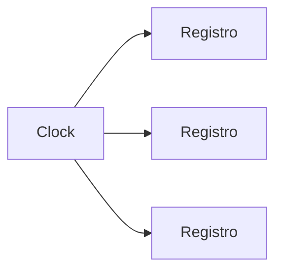
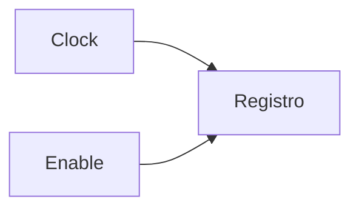
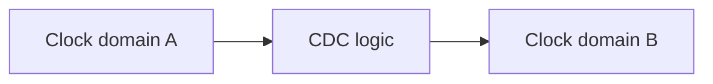

# Clocking e reset in un progetto FPGA

In una FPGA, i temi di **clock** e **reset** sono tra i più delicati dell'intero progetto.  
Molti design apparentemente corretti in simulazione falliscono o diventano instabili su hardware reale proprio a causa di problemi legati a:

- distribuzione del clock;
- uso improprio dei clock derivati;
- reset poco disciplinati;
- crossing tra clock domain;
- inizializzazione non coerente con il dispositivo reale.

Per questo, nel design FPGA, clock e reset non devono essere trattati come semplici segnali di servizio, ma come una parte centrale dell'architettura.

Comprendere questi temi è fondamentale per ottenere un progetto che sia:

- stabile;
- temporizzato correttamente;
- debuggabile;
- compatibile con la board;
- robusto su hardware reale.

---

## 1. Perché clock e reset sono così importanti

Ogni sistema sincrono dipende da una corretta gestione del tempo e dell'inizializzazione.

### Il clock

Il clock stabilisce:

- quando i registri campionano i dati;
- il ritmo del sistema;
- il riferimento per la timing analysis;
- la relazione tra pipeline, FSM e datapath.

### Il reset

Il reset definisce:

- lo stato iniziale del circuito;
- la sequenza di avvio;
- il comportamento dopo errori o riavvii;
- la coerenza iniziale di registri e controller.

Se clock o reset sono progettati male, il progetto può:

- non partire;
- funzionare solo in modo intermittente;
- fallire a una certa frequenza;
- risultare molto difficile da debuggare.

---

## 2. Clock: il riferimento temporale del progetto

Il **clock** è il segnale che sincronizza i registri del design.

In una FPGA, esso ha un ruolo ancora più importante di quanto si possa intuire da una simulazione RTL, perché la sua distribuzione fisica sul dispositivo influisce direttamente su:

- timing;
- skew;
- stabilità;
- consumo;
- qualità dell'implementazione.

Il clock non è quindi un normale segnale di controllo: è l'infrastruttura temporale del sistema.

---

## 3. Risorse di clock dedicate

Le FPGA dispongono di **risorse dedicate di clocking** che devono essere usate per distribuire il clock in modo corretto.

A livello concettuale, queste risorse possono includere:

- reti globali di clock;
- buffer dedicati al clock;
- risorse regionali;
- PLL;
- MMCM o blocchi equivalenti;
- clock managers specifici del vendor.

## 3.1 Perché sono necessarie

Il clock deve raggiungere un grande numero di registri con:

- ritardo controllato;
- skew ridotto;
- robustezza fisica;
- compatibilità con la frequenza del progetto.

Usare il routing generico al posto delle risorse dedicate di clock è quasi sempre una cattiva idea.

---

## 4. Clock globali e clock regionali

Molte FPGA distinguono tra reti di clock:

- **globali**, che raggiungono ampie regioni del dispositivo;
- **regionali** o locali, che servono zone più limitate.

## 4.1 Clock globali

Sono adatti per:

- clock principali di sistema;
- segnali che devono raggiungere gran parte del design;
- pipeline diffuse;
- sottosistemi estesi.

## 4.2 Clock regionali

Possono essere utili quando:

- il clock serve solo una parte del dispositivo;
- si vuole limitare il carico;
- si lavora con strutture localizzate.

Per una sezione introduttiva, il punto chiave è che non tutti i clock sono distribuiti nello stesso modo all'interno della FPGA.

---

## 5. Sorgenti di clock

Un clock può provenire da diverse sorgenti.

### Esempi tipici

- oscillatore esterno sulla board;
- clock fornito da un sottosistema esterno;
- uscita di un PLL;
- clock derivato da un blocco di gestione interna.

Il progettista deve sempre sapere con chiarezza:

- da dove arriva il clock;
- con quale frequenza;
- con quale stabilità;
- come entra nella FPGA;
- su quale rete viene distribuito.

Questo è uno dei punti che collegano il progetto logico al comportamento reale della scheda.

---

## 6. PLL e gestione del clock

Molte FPGA includono blocchi dedicati come **PLL** o **MMCM** per la gestione dei clock.

## 6.1 A cosa servono

Possono essere usati per:

- moltiplicare o dividere la frequenza;
- generare clock derivati;
- migliorare alcune proprietà del segnale;
- allineare o adattare il clock a esigenze del progetto;
- distribuire più domini di clock.

## 6.2 Perché sono utili

Permettono di ottenere clock più adatti al sistema rispetto al segnale grezzo proveniente dalla board.

## 6.3 Attenzione

Ogni clock derivato introduce anche:

- nuove relazioni temporali;
- complessità di vincoli;
- possibili crossing tra domini;
- maggiore complessità del progetto.

Per questo i PLL non vanno usati senza una motivazione chiara.

---

## 7. Non creare clock in logica generica

Una delle regole più importanti del design FPGA è: **evitare di costruire clock impropri usando logica generica**, ad esempio con:

- divisori artigianali non pensati come veri clock domain;
- gating manuale del clock in logica combinatoria;
- instradamento del clock come segnale normale.

## 7.1 Perché è pericoloso

Questo può causare:

- skew incontrollato;
- glitch;
- violazioni temporali;
- problemi di implementazione;
- comportamento instabile su hardware reale.

## 7.2 Cosa fare invece

Quando possibile, è meglio usare:

- risorse dedicate di clock;
- PLL o clock manager;
- clock enable per controllare l'attività dei registri.

Questa è una delle differenze pratiche più importanti tra design teorico e design FPGA reale.

---

## 8. Clock enable

Il **clock enable** è spesso la soluzione giusta quando si vuole che una parte del design non avanzi a ogni ciclo.

## 8.1 Cosa fa

Permette a un registro o a un blocco di aggiornarsi solo quando una certa condizione è vera, pur restando nello stesso clock domain.

## 8.2 Perché è preferibile a un clock derivato artigianale

- mantiene una rete di clock pulita;
- evita glitch;
- semplifica la timing analysis;
- migliora la robustezza del progetto;
- si adatta meglio all'architettura della FPGA.

Su FPGA, imparare a usare bene il clock enable è una competenza molto importante.

---

## 9. Più clock domain

Molti progetti FPGA usano più di un clock domain.

Questo può accadere, ad esempio, quando:

- esistono sottosistemi a frequenze diverse;
- la board fornisce più clock;
- si usano PLL con uscite multiple;
- si interfacciano periferiche con timing indipendente.

## 9.1 Vantaggi

- migliore adattamento al sistema;
- gestione di blocchi con esigenze diverse;
- possibilità di bilanciare prestazioni e consumo.

## 9.2 Svantaggi

- maggiore complessità di timing;
- necessità di CDC corretti;
- debug più difficile;
- rischio più alto di errori sottili.

Per questo non bisogna moltiplicare i clock domain senza una ragione reale.

---

## 10. Clock Domain Crossing (CDC)

Quando due parti del progetto lavorano in clock domain diversi, i segnali che attraversano il confine devono essere gestiti con attenzione.

## 10.1 Problemi principali

- metastabilità;
- perdita di eventi;
- incoerenza dei dati;
- campionamenti non affidabili.

## 10.2 Soluzioni tipiche

- sincronizzatori per segnali di controllo;
- handshake;
- FIFO asincrone per dati;
- protocolli robusti tra i domini.

Il CDC è una delle aree in cui i problemi appaiono spesso solo su hardware reale, quindi merita molta disciplina.

---

## 11. Metastabilità

La **metastabilità** è uno dei concetti fondamentali del CDC.

## 11.1 Significato intuitivo

Quando un segnale asincrono o proveniente da un altro dominio viene campionato nel momento sbagliato, il registro può entrare in uno stato temporaneamente instabile.

## 11.2 Perché è pericolosa

Può causare:

- errori casuali;
- comportamenti intermittenti;
- problemi difficili da riprodurre;
- bug che non si vedono in simulazione normale.

Per questo i segnali asincroni non devono essere collegati direttamente come se fossero sincroni.

---

## 12. Segnali asincroni dalla board

Molti segnali che arrivano dalla board sono di fatto **asincroni** rispetto al clock interno del progetto.

Esempi:

- pulsanti;
- ingressi esterni;
- segnali di periferiche non sincronizzate;
- eventi da sensori;
- linee di reset esterne.

Questi segnali richiedono attenzione particolare, perché non possono essere trattati come dati già allineati al clock della FPGA.

---

## 13. Reset: funzione generale

Il **reset** serve a portare il circuito in uno stato iniziale noto.

Può essere usato per:

- avvio del sistema;
- reinizializzazione dopo errore;
- gestione del bring-up;
- controllo di sottoblocchi;
- ripristino di FSM e pipeline.

## 13.1 Perché è fondamentale

Senza un reset ben progettato, il circuito può partire da stati non coerenti, rendendo il comportamento iniziale imprevedibile.

---

## 14. Reset globale e reset locali

A livello architetturale, si può distinguere tra:

- **reset globale**, che inizializza il sistema nel suo insieme;
- **reset locali**, che reinizializzano solo sottoblocchi specifici.

## 14.1 Reset globale

Utile per:

- startup;
- avvio pulito del sistema;
- bring-up iniziale.

## 14.2 Reset locali

Utili per:

- riavviare un sottoblocco;
- recuperare da un errore locale;
- controllare fasi operative.

Una buona architettura FPGA usa i reset in modo disciplinato e non eccessivamente invasivo.

---

## 15. Reset sincrono e reset asincrono

A livello concettuale esistono due grandi approcci al reset.

## 15.1 Reset sincrono

Il reset viene applicato in relazione al clock del sistema.

### Vantaggi

- comportamento più ordinato rispetto al dominio di clock;
- migliore integrazione con la logica sincrona;
- meno criticità in certi flow.

## 15.2 Reset asincrono

Il reset può agire indipendentemente dal clock.

### Vantaggi

- utilità in certe condizioni di startup;
- possibilità di inizializzare rapidamente lo stato.

### Attenzioni

- rilascio del reset più delicato;
- maggiore attenzione ai dettagli temporali;
- rischio di comportamenti incoerenti se gestito male.

Nel design FPGA reale, la scelta va fatta con consapevolezza dell'architettura e del flow.

---

## 16. Il rilascio del reset

Una delle parti più delicate del reset non è tanto l'attivazione, quanto il **rilascio**.

## 16.1 Perché è critico

Se il reset viene rilasciato in modo incoerente rispetto al clock o ai domini del sistema, si possono creare:

- stati iniziali disallineati;
- avvio non deterministico di FSM;
- problemi nella pipeline;
- bug di startup difficili da riprodurre.

Per questo, nel progetto FPGA, il reset deve essere pensato come una vera sequenza di inizializzazione, non solo come un segnale che "mette tutto a zero".

---

## 17. Reset e fanout

I reset globali possono avere fanout molto elevato.

Questo comporta:

- carico notevole sul routing;
- possibile impatto sul timing;
- maggiore complessità di distribuzione;
- difficoltà in implementazione se il reset è troppo esteso.

Per questo conviene evitare reset inutili o indiscriminati su tutto il design, soprattutto quando alcuni registri non ne hanno davvero bisogno.

---

## 18. Inizializzazione e stato iniziale

Su FPGA, oltre al reset esplicito, è importante capire il tema dello **stato iniziale** del design.

A livello progettuale, è utile chiedersi:

- quali registri devono partire in uno stato preciso?
- quali FSM devono avere uno stato iniziale definito?
- quali buffer o contatori devono essere inizializzati?
- quali parti del progetto possono partire senza reset esplicito?

Una buona risposta a queste domande rende il progetto più robusto e più facile da portare sulla board.

---

## 19. Clock, reset e timing

Clock e reset hanno un impatto diretto sul timing del design.

### Il clock influisce su

- definizione dei percorsi temporali;
- skew;
- timing closure;
- CDC;
- fanout globale.

### Il reset influisce su

- fanout;
- uso del routing;
- complessità del controllo;
- robustezza dell'avvio;
- comportamento delle FSM.

Per questo clock e reset devono essere pensati insieme al timing, non separatamente.

---

## 20. Clock, reset e debug

Molti problemi di debug su FPGA nascono da:

- clock mancanti o mal configurati;
- PLL non stabili o non usate correttamente;
- reset che non si rilasciano come previsto;
- crossing trattati male;
- segnali esterni non sincronizzati.

Per questo, quando un progetto non funziona sulla board, una delle prime domande dovrebbe essere:

- il clock è davvero presente e corretto?
- il reset viene applicato e rilasciato come mi aspetto?
- i domini di clock sono trattati correttamente?

Questa è una disciplina di debug molto importante.

---

## 21. Errori frequenti

Tra gli errori più comuni in clocking e reset:

- usare il routing generico per segnali di clock;
- costruire clock derivati in logica combinatoria;
- moltiplicare i clock domain senza necessità;
- ignorare il CDC;
- trattare segnali asincroni come sincroni;
- usare reset troppo estesi o poco disciplinati;
- non pensare al rilascio del reset;
- trascurare il comportamento reale della board.

---

## 22. Buone pratiche concettuali

Una buona strategia di clocking e reset su FPGA segue alcuni principi chiave:

- usare le risorse dedicate di clock;
- evitare clock costruiti "a mano" in logica;
- preferire clock enable quando possibile;
- limitare il numero di clock domain;
- trattare il CDC come un tema progettuale centrale;
- usare reset con disciplina;
- pensare al rilascio del reset, non solo alla sua attivazione;
- verificare sempre il comportamento di clock e reset anche su hardware reale.

---

## 23. Collegamento con ASIC

Molti concetti di clock e reset sono comuni a FPGA e ASIC:

- importanza del clock come infrastruttura temporale;
- ruolo dello skew;
- CDC;
- disciplina sul reset;
- impatto sul timing.

Tuttavia, nelle FPGA il progettista lavora dentro un'architettura di clocking già fornita dal dispositivo, e deve rispettarne le regole.

Studiare clock e reset su FPGA aiuta comunque moltissimo a sviluppare buone abitudini progettuali utili anche nel flow ASIC.

---

## 24. Collegamento con SoC

Nel contesto SoC, clock e reset sono ancora più rilevanti, perché il sistema può contenere:

- più sottosistemi;
- domini multipli;
- periferiche;
- processori;
- acceleratori;
- logiche di power management.

La FPGA è spesso la piattaforma su cui questi temi vengono sperimentati concretamente, rendendo clocking e reset un ponte naturale tra la sezione FPGA e quella SoC.

---

## 25. Esempio concettuale

Immaginiamo un progetto FPGA con:

- un clock proveniente dalla board;
- una PLL che genera un clock interno più adatto;
- una pipeline di elaborazione;
- una periferica lenta controllata tramite enable;
- un segnale `start` proveniente da un pulsante esterno.

Per progettare correttamente questo sistema occorre:

- distribuire il clock usando le risorse dedicate;
- evitare di costruire clock lenti in logica, usando invece enable;
- sincronizzare il pulsante al dominio di clock interno;
- rilasciare il reset in modo coerente;
- gestire bene eventuali domini multipli.

Questo esempio mostra bene come clock, enable, reset e CDC siano tutti parte dello stesso problema progettuale.

---

## 26. In sintesi

Clocking e reset sono una parte centrale della progettazione FPGA.

I temi principali da comprendere sono:

- risorse dedicate di clock;
- clock globali e regionali;
- PLL e clock derivati;
- clock enable;
- clock domain crossing;
- metastabilità;
- reset globale e locale;
- reset sincrono e asincrono;
- rilascio del reset;
- relazione con timing e debug.

Un progetto FPGA robusto non dipende solo da una buona RTL funzionale, ma anche da una gestione disciplinata del tempo e dell'inizializzazione del sistema.

---

## Prossimo passo

Dopo clocking e reset, il passo naturale successivo è approfondire il tema di **placement, routing e timing closure**, cioè il modo in cui il progetto viene realmente distribuito sulle risorse fisiche del dispositivo FPGA e portato a rispettare i vincoli temporali richiesti.
