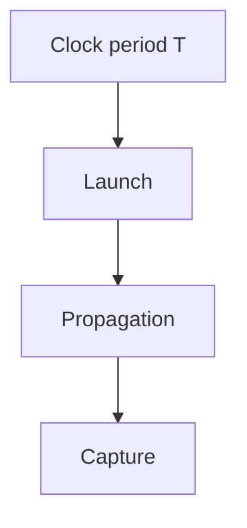
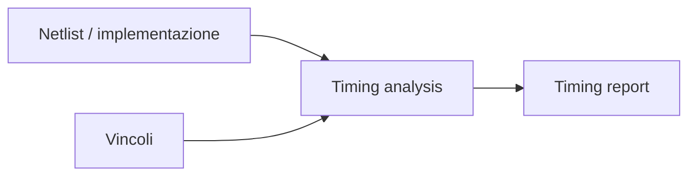
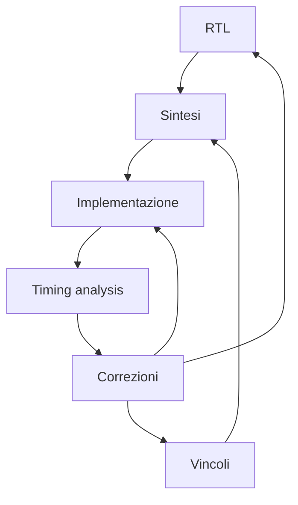

# Vincoli e timing in un progetto FPGA

In un progetto **FPGA**, la correttezza funzionale della RTL non è sufficiente a garantire che il design funzioni davvero sulla scheda reale.  
Affinché il circuito sia utilizzabile, occorre anche che:

- i clock siano definiti correttamente;
- gli ingressi e le uscite siano vincolati in modo realistico;
- i percorsi critici rispettino il periodo richiesto;
- i segnali asincroni siano trattati con attenzione;
- l'implementazione finale chiuda timing sul dispositivo scelto.

Per questo motivo, i **vincoli** e il **timing** hanno un ruolo centrale nel flow FPGA, esattamente come accade nel flow ASIC, anche se con differenze importanti legate alla natura programmabile del dispositivo.

Questa pagina introduce i concetti fondamentali che permettono di passare da un design "simulato correttamente" a un design **realmente funzionante sulla FPGA**.

---

## 1. Perché il timing è importante anche su FPGA

Uno degli errori più frequenti è pensare che su FPGA il timing sia meno importante perché il dispositivo è programmabile.  
In realtà, anche in una FPGA il circuito deve rispettare vincoli temporali ben precisi.

Se il design non chiude timing, possono verificarsi:

- campionamenti errati dei dati;
- comportamenti intermittenti;
- malfunzionamenti visibili solo in hardware reale;
- differenze tra simulazione e board;
- instabilità a una certa frequenza;
- errori difficili da diagnosticare.

Un progetto FPGA corretto deve quindi essere non solo funzionalmente valido, ma anche **temporalmente compatibile con la rete di clock e con le risorse del dispositivo**.

---

## 2. Cosa si intende per vincoli

I **vincoli** sono le informazioni che descrivono ai tool del flow il contesto reale in cui il progetto deve operare.

Nel caso FPGA, i vincoli possono riguardare:

- clock e loro frequenza;
- pin assignment;
- standard elettrici degli I/O;
- relazioni temporali tra ingressi, uscite e clock;
- eventuali eccezioni di timing;
- relazioni tra clock domain;
- vincoli specifici della board.

Senza vincoli corretti, il flow di implementazione non può sapere con precisione:

- quali percorsi devono essere rispettati;
- a quale frequenza deve lavorare il design;
- come collegare il progetto al dispositivo fisico;
- quali ritardi esterni devono essere considerati.

---

## 3. Il concetto di percorso temporale

Anche in una FPGA, il timing si analizza osservando i **percorsi** dei segnali.

Un percorso tipico è costituito da:

- un punto di partenza, ad esempio un registro;
- logica combinatoria intermedia;
- un punto di arrivo, spesso un altro registro.

Il tempo necessario al dato per attraversare questo percorso deve essere compatibile con il clock del sistema.

Questa idea è alla base di tutta l'analisi temporale anche su FPGA.

---

## 4. Percorsi tipici in un progetto FPGA

I percorsi principali che interessano il timing sono:

- **register-to-register**;
- **input-to-register**;
- **register-to-output**;
- talvolta **input-to-output**, in casi particolari.

## 4.1 Register-to-register

È il caso più comune all'interno della logica sincrona.

## 4.2 Input-to-register

Un segnale proveniente dall'esterno della FPGA deve arrivare correttamente a un registro interno.

## 4.3 Register-to-output

Un dato elaborato internamente deve essere disponibile in uscita entro tempi compatibili con il sistema esterno.

Questi percorsi sono influenzati non solo dalla logica, ma anche dalla board, dai pin e dalla rete di routing del dispositivo.

---

## 5. Clock come riferimento temporale

Il **clock** è il riferimento principale di tutta l'analisi temporale.

## 5.1 Perché il clock è fondamentale

I registri della FPGA catturano i dati in corrispondenza di eventi di clock.  
La finestra temporale disponibile per i percorsi dipende quindi dal periodo di clock.

## 5.2 Conseguenze pratiche

Definire correttamente il clock è il primo passo per:

- dare senso alla timing analysis;
- guidare la sintesi e l'implementazione;
- verificare la frequenza massima raggiungibile;
- capire se il progetto è realmente compatibile con la board.

---

## 6. Setup time

Anche su FPGA, il **setup time** è un concetto fondamentale.

## 6.1 Significato intuitivo

Per essere catturato correttamente, il dato deve arrivare al registro di destinazione ed essere stabile per un certo intervallo **prima** del fronte di clock.

## 6.2 Conseguenze di una violazione

Se il dato arriva troppo tardi:

- il registro può campionare un valore errato;
- il comportamento può diventare intermittente;
- il circuito può funzionare a frequenze basse ma non a quelle richieste.

Le violazioni di setup sono spesso legate a:

- logica combinatoria troppo lunga;
- routing eccessivo;
- pipeline insufficiente;
- clock troppo veloce;
- floorplanning implicito sfavorevole sul dispositivo.

---

## 7. Hold time

Il **hold time** è l'altro lato della finestra temporale del registro.

## 7.1 Significato intuitivo

Dopo il fronte di clock, il dato deve rimanere stabile per un breve intervallo minimo.

## 7.2 Conseguenze di una violazione

Se il dato cambia troppo presto:

- il registro può catturare un valore instabile;
- il progetto può mostrare errori difficili da riprodurre;
- il comportamento reale può discostarsi molto dalla simulazione.

Le violazioni di hold sono spesso più sottili da individuare e possono emergere chiaramente solo dopo implementazione.

---

## 8. Slack

Lo **slack** è la misura con cui si valuta se un percorso soddisfa o meno il vincolo temporale.

### Regola intuitiva

- **slack positivo** → il percorso rispetta il vincolo;
- **slack negativo** → il percorso viola il vincolo.

Lo slack è uno dei numeri principali nei report di timing del flow FPGA.

Serve a capire:

- quanto margine resta;
- quali percorsi sono critici;
- quanto il design è vicino al limite.

---

## 9. Timing analysis su FPGA

I tool FPGA eseguono una **timing analysis** sulle varie fasi del flow, in particolare dopo implementazione.

Questa analisi permette di osservare:

- i percorsi critici;
- gli slack peggiori;
- le relazioni tra clock;
- la qualità della chiusura temporale;
- la compatibilità del design con i vincoli definiti.

La timing analysis è fondamentale perché traduce il progetto in una misura concreta delle sue prestazioni temporali.

---

## 10. File di vincoli

Nel flow FPGA, i vincoli vengono tipicamente definiti in file dedicati.  
Senza entrare nei dettagli dei formati dei vari vendor, è importante capire che questi file descrivono:

- clock;
- pin assignment;
- timing degli I/O;
- eccezioni di timing;
- relazioni tra domini;
- vincoli specifici della board.

Il file di vincoli è quindi uno dei documenti tecnici più importanti del progetto FPGA, insieme alla RTL.

---

## 11. Definizione dei clock

La definizione dei clock è il primo passo di qualsiasi analisi temporale seria.

## 11.1 Cosa bisogna definire

Per ogni clock è necessario chiarire almeno:

- periodo;
- sorgente;
- eventuali clock derivati;
- relazione con altri clock.

## 11.2 Perché è essenziale

Se il clock è definito male:

- la timing analysis perde significato;
- il tool può ottimizzare nella direzione sbagliata;
- problemi reali possono essere nascosti;
- il design può sembrare corretto ma non esserlo sulla board.

Definire bene il clock significa dare al tool la vera regola temporale del sistema.

---

## 12. Clock derivati e clocking resources

Molte FPGA usano risorse dedicate di clocking, come:

- PLL;
- MMCM;
- clock manager;
- buffer globali.

Quando un clock viene generato o modificato internamente, il progetto deve descrivere correttamente la relazione tra il clock sorgente e quello derivato.

Questo è importante perché influisce su:

- timing analysis;
- distribuzione del clock;
- gestione di domini multipli;
- corretto funzionamento dell'architettura.

---

## 13. Pin assignment

Nel flow FPGA, i vincoli non riguardano solo il timing, ma anche il collegamento fisico del progetto con il dispositivo e la board.

Il **pin assignment** definisce quali segnali del design sono associati ai pin reali della FPGA.

## 13.1 Perché è importante

Una scelta errata può causare:

- incompatibilità con la scheda;
- uso di pin non adatti;
- conflitti con periferiche reali;
- errori di funzionamento esterno.

Il pin assignment è quindi una parte fondamentale del flow pratico su board.

---

## 14. Standard I/O

Oltre al pin fisico, occorre spesso definire anche lo **standard I/O**, cioè il modo in cui il segnale deve essere interpretato elettricamente.

Questo è importante per garantire compatibilità con:

- tensione dei dispositivi esterni;
- segnali della board;
- periferiche collegate;
- protocolli digitali.

Anche se spesso questi aspetti sembrano "di contorno", in realtà sono parte essenziale del passaggio dal progetto astratto all'hardware reale.

---

## 15. Input delay e output delay

Come in ASIC, anche in FPGA è importante modellare correttamente i tempi di interfaccia con il mondo esterno.

## 15.1 Input delay

Descrive quando un segnale esterno può essere considerato valido rispetto al clock di riferimento.

## 15.2 Output delay

Descrive entro quando il dato generato internamente deve essere reso disponibile verso l'esterno.

Questi vincoli sono molto importanti quando la FPGA comunica con:

- memorie esterne;
- altri chip;
- interfacce sincrone;
- periferiche temporizzate.

Senza questi vincoli, il progetto può risultare corretto internamente ma fallire nelle interazioni reali.

---

## 16. False path

Non tutti i percorsi devono essere trattati come percorsi temporali normali.

Un **false path** è un percorso che esiste logicamente ma che non rappresenta un cammino temporale significativo nel funzionamento reale del sistema.

## 16.1 Quando si usa

Solo quando esiste una forte giustificazione architetturale o funzionale.

## 16.2 Rischio

Usare false path in modo improprio è pericoloso, perché può nascondere veri problemi di timing.

Per questo le eccezioni di timing vanno introdotte con grande prudenza.

---

## 17. Multicycle path

Un **multicycle path** è un percorso che dispone, per progetto, di più cicli di clock per completare correttamente il trasferimento del dato.

## 17.1 Quando ha senso

Solo se l'architettura prevede realmente che quel trasferimento impieghi più cicli.

## 17.2 Attenzione

Un multicycle path dichiarato senza reale giustificazione può mascherare un progetto in realtà troppo lento.

Anche in FPGA, come in ASIC, queste eccezioni devono essere usate con molta disciplina.

---

## 18. Clock domain crossing

Quando il progetto usa più clock domain, il timing non può essere trattato come se tutto appartenesse allo stesso dominio.

I **clock domain crossing (CDC)** richiedono attenzione specifica.

## 18.1 Problemi tipici

- metastabilità;
- perdita di eventi;
- campionamenti incoerenti;
- dati multi-bit non allineati.

## 18.2 Soluzioni tipiche

- sincronizzatori per segnali singoli;
- FIFO asincrone per flussi di dati;
- protocolli di handshaking;
- strutture dedicate per trasferimenti controllati.

Il CDC è una delle aree in cui i problemi compaiono facilmente in hardware reale e possono essere molto difficili da diagnosticare.

---

## 19. Timing closure su FPGA

La **timing closure** è il processo con cui si porta il progetto a rispettare tutti i vincoli temporali richiesti.

Su FPGA, la timing closure dipende da più fattori:

- qualità dell'RTL;
- pipeline;
- fanout;
- uso del clock;
- placement;
- routing;
- risorse utilizzate;
- vincoli corretti.

Il processo è iterativo e molto spesso richiede aggiustamenti reali del progetto.

---

## 20. Cause tipiche di mancata chiusura del timing

Tra le cause più comuni di problemi di timing su FPGA troviamo:

- logica combinatoria troppo profonda;
- routing lungo;
- fanout elevato;
- clock poco disciplinati;
- uso improprio del reset;
- inferenza inefficiente delle risorse;
- mancanza di pipeline;
- vincoli incompleti o errati;
- crossing tra clock domain trattati male.

Questi problemi non si risolvono con un singolo comando del tool: richiedono comprensione strutturale del design.

---

## 21. Relazione tra timing e architettura FPGA

La timing closure su FPGA è fortemente influenzata dall'architettura del dispositivo.

Ad esempio:

- usare un DSP dedicato può migliorare timing rispetto a logica LUT equivalente;
- una BRAM può essere più efficiente di memoria distribuita sparsa;
- l'uso corretto delle clocking resources aiuta molto;
- il routing programmabile può diventare il vero collo di bottiglia.

Per questo il timing su FPGA non dipende solo dalla qualità della RTL, ma anche dalla qualità del mapping sulle risorse del dispositivo.

---

## 22. Timing e board-level reality

Un progetto FPGA reale non vive solo dentro il chip, ma anche dentro la board.

Questo significa che il timing può essere influenzato anche da:

- clock disponibili sulla scheda;
- segnali esterni asincroni;
- periferiche collegate;
- interfacce fisiche;
- tempi di propagazione del contesto esterno, nei casi più avanzati.

La relazione tra timing interno e mondo esterno è una parte importante della progettazione hardware reale.

---

## 23. Errori frequenti nella gestione dei vincoli

Tra gli errori più comuni:

- non definire affatto il clock;
- definire male il periodo di clock;
- ignorare pin assignment e I/O standard;
- non usare input/output delay quando servono;
- nascondere problemi reali con false path o multicycle non giustificati;
- sottovalutare il CDC;
- guardare solo la simulazione senza leggere i report di timing;
- credere che un progetto implementato sia automaticamente corretto.

---

## 24. Buone pratiche concettuali

Una buona gestione di vincoli e timing su FPGA segue alcuni principi fondamentali:

- definire sempre in modo chiaro i clock;
- rendere esplicita la relazione del progetto con la board;
- usare pin assignment e I/O standard con attenzione;
- trattare il CDC come tema progettuale centrale;
- usare eccezioni di timing solo quando davvero motivate;
- leggere con attenzione i timing report;
- considerare il timing come feedback sul progetto, non come controllo finale accessorio.

---

## 25. Collegamento con ASIC

Molti concetti di timing e vincoli sono comuni a FPGA e ASIC:

- clock;
- setup/hold;
- slack;
- false path;
- multicycle;
- timing closure.

La differenza principale è che in FPGA il progetto viene mappato su un tessuto programmabile già esistente, mentre in ASIC il layout viene costruito ad hoc.

Studiare il timing su FPGA aiuta comunque moltissimo a sviluppare disciplina progettuale utile anche nel mondo ASIC.

---

## 26. Collegamento con SoC

Nel contesto SoC, questi concetti si estendono a sistemi con:

- più clock domain;
- interfacce verso memorie;
- bus;
- periferiche;
- acceleratori;
- firmware di supporto.

La FPGA è spesso la piattaforma su cui questi aspetti vengono sperimentati concretamente, rendendo vincoli e timing ancora più importanti.

---

## 27. Esempio concettuale

Immaginiamo un piccolo acceleratore su FPGA con:

- clock a frequenza definita;
- pipeline di elaborazione;
- interfaccia streaming di input;
- uscita verso una periferica esterna.

I vincoli devono descrivere almeno:

- il clock di sistema;
- i pin degli ingressi e delle uscite;
- gli standard I/O;
- eventuali tempi di validità dell'interfaccia esterna.

Se il timing report mostra slack negativo, possibili correzioni sono:

- aggiungere pipeline;
- ridurre fanout;
- migliorare il clocking;
- correggere vincoli errati;
- ripensare il mapping del datapath.

Questo esempio mostra bene che il timing non è un dettaglio finale, ma una parte viva del progetto.

---

## 28. In sintesi

Vincoli e timing sono una parte essenziale della progettazione FPGA.  
Servono a guidare il progetto rispetto alla realtà del dispositivo e della board, e permettono di capire se il design sia davvero implementabile e funzionante.

I concetti principali da comprendere sono:

- definizione del clock;
- setup e hold;
- slack;
- timing analysis;
- pin assignment;
- input/output delay;
- false path e multicycle;
- CDC;
- timing closure.

Un progetto FPGA non è pronto quando "simula bene", ma quando rispetta in modo robusto anche i suoi vincoli temporali e fisici.

---

## Prossimo passo

Dopo aver chiarito il ruolo di vincoli e timing, il passo naturale successivo è approfondire la **sintesi logica su FPGA**, cioè il modo in cui la RTL viene trasformata in una struttura mappata sulle risorse del dispositivo programmabile.
