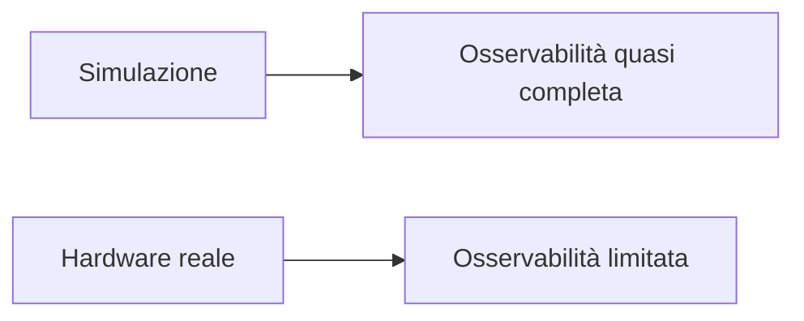
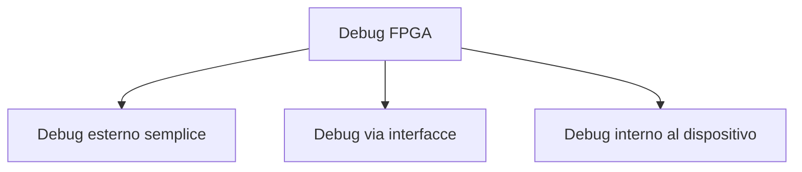

# Debug su FPGA

Il **debug** è una delle attività più importanti e caratteristiche della progettazione su FPGA.  
Anche con una buona simulazione e una verifica ben fatta, il momento in cui il progetto viene caricato sulla scheda reale può far emergere problemi che in precedenza non erano visibili oppure non erano stati interpretati correttamente.

Nel contesto FPGA, il debug ha un ruolo speciale perché il progettista ha accesso a un hardware reale ma non può osservare liberamente tutti i segnali interni come in simulazione.  
Per questo è necessario costruire una strategia di osservazione e diagnosi che permetta di:

- capire se il progetto è realmente in esecuzione;
- osservare stati e transizioni interne;
- identificare problemi di clock, reset e timing;
- verificare interfacce con la board;
- correlare comportamento simulato e comportamento reale.

Il debug su FPGA non è quindi un'attività improvvisata, ma una disciplina tecnica che richiede metodo, strumenti e una buona struttura del progetto.

---

## 1. Perché il debug su FPGA è diverso dalla simulazione

In simulazione il progettista può, in linea di principio, osservare quasi tutto:

- segnali interni;
- registri;
- stati di FSM;
- percorsi del datapath;
- eventi temporali;
- transizioni e condizioni di controllo.

Su una FPGA reale, invece, l'osservabilità è limitata.  
Non è possibile collegare direttamente ogni segnale a uno strumento esterno, e molte informazioni restano interne al dispositivo.

Per questo il debug su FPGA richiede di costruire **punti di osservazione** e **meccanismi di raccolta dei segnali**.

Questa differenza è il motivo per cui il debug su FPGA ha strumenti e tecniche così specifiche.

---

## 2. Obiettivi del debug

Il debug su FPGA può avere obiettivi diversi, a seconda della fase del progetto.

### Obiettivi tipici

- verificare che il clock sia presente;
- verificare che il reset si comporti correttamente;
- capire se il design entra negli stati attesi;
- osservare il flusso dei dati;
- identificare errori nelle interfacce;
- verificare l'allineamento di valid/data;
- diagnosticare problemi di CDC;
- distinguere tra bug di logica e problemi di board.

In pratica, il debug cerca di rispondere a una domanda fondamentale:

> Il progetto sta facendo davvero quello che penso stia facendo?

---

## 3. Le grandi famiglie di debug su FPGA

In modo concettuale, il debug su FPGA si può dividere in tre grandi famiglie:

- **debug esterno semplice**
- **debug tramite interfacce di servizio**
- **debug interno al dispositivo**

Queste tecniche spesso si usano insieme, non in alternativa.

---

## 4. Debug esterno semplice

La forma più elementare di debug consiste nel portare alcune informazioni verso segnali o dispositivi visibili dall'esterno.

### Esempi classici

- LED;
- GPIO;
- display;
- pin dedicati;
- segnali di stato su connettori della board.

## 4.1 Quando è utile

È utile per verifiche molto rapide come:

- il clock sta avanzando?
- il reset è stato rilasciato?
- la FSM è entrata in uno stato specifico?
- un errore è stato rilevato?
- è arrivato un `done`?

## 4.2 Limiti

- bassa banda informativa;
- pochi segnali osservabili;
- osservazione spesso qualitativa e non temporale;
- difficile analizzare sequenze complesse.

Per questo i LED e i GPIO sono utili, ma non sufficienti per debug non banali.

---

## 5. LED come strumento di debug

I **LED** sono una delle risorse di debug più semplici e usate.

### Cosa possono mostrare

- presenza del clock, tramite blink o divisore visibile;
- stato del reset;
- stato principale della FSM;
- flag di errore;
- segnali `busy`, `done`, `valid`.

### Vantaggi

- semplicissimi da usare;
- immediati;
- utili nelle prime fasi di bring-up.

### Limiti

- informazione molto ridotta;
- nessuna visione dettagliata nel tempo;
- difficile osservare segnali veloci.

I LED sono perfetti per capire "se il progetto è vivo", ma non bastano per diagnosticare bug complessi.

---

## 6. GPIO e pin di osservazione

Un altro approccio semplice consiste nell'esportare alcuni segnali interni su **GPIO** o pin della board.

### Quando è utile

- per misure con oscilloscopio o analizzatore logico esterno;
- per osservare handshake o clock;
- per verificare eventi o impulsi;
- per controllare segnali temporizzati.

### Vantaggi

- osservazione più flessibile dei LED;
- possibilità di usare strumenti esterni;
- utile per segnali digitali interessanti.

### Limiti

- numero di pin disponibile limitato;
- possibile impatto sul pin assignment;
- non adatto a osservare grandi quantità di segnali interni.

---

## 7. Debug via UART o interfacce simili

Una tecnica molto comune consiste nell'usare un canale seriale, ad esempio **UART**, per esportare informazioni di debug.

## 7.1 Cosa si può fare

- stampare valori di registri;
- riportare stati della FSM;
- tracciare eventi;
- inviare contatori o statistiche;
- confermare il completamento di operazioni.

## 7.2 Vantaggi

- più informazione rispetto ai LED;
- comodo su molte board;
- utile per debug testuale o numerico;
- ben adatto a stati e valori discreti.

## 7.3 Limiti

- banda limitata;
- non adatto a catturare segnali molto veloci o eventi densi;
- richiede logica di supporto;
- può alterare leggermente il design se usato in modo invasivo.

La UART è ottima per il debug "di alto livello", ma non sostituisce la visione temporale di un logic analyzer.

---

## 8. Logic analyzer interni

Uno degli strumenti più potenti del debug FPGA è il **logic analyzer interno**.

## 8.1 Che cos'è

È uno strumento integrato nel flow del vendor che permette di:

- selezionare segnali interni del design;
- campionarli nel tempo;
- impostare trigger;
- osservarli dopo l'acquisizione.

## 8.2 Perché è così utile

Permette di ottenere una visione molto più vicina alla simulazione, ma direttamente sul progetto implementato nella FPGA reale.

Per molti progetti FPGA, questo è lo strumento di debug più importante.

---

## 9. Cosa osservare con un logic analyzer interno

I segnali più utili da osservare dipendono dal progetto, ma tipicamente includono:

- stato della FSM;
- segnali `valid`, `ready`, `busy`, `done`;
- registri di pipeline;
- contatori;
- segnali di reset;
- segnali di handshake;
- segnali coinvolti in error conditions;
- flag di FIFO o buffer;
- segnali di crossing tra domini.

La scelta dei segnali è cruciale: osservare troppi segnali inutili complica il debug, mentre osservare pochi segnali sbagliati rende l'acquisizione poco utile.

---

## 10. Trigger

Un grande vantaggio del logic analyzer interno è la possibilità di usare **trigger**.

## 10.1 A cosa servono

Permettono di catturare una finestra temporale attorno a un evento interessante, ad esempio:

- ingresso in uno stato;
- comparsa di un errore;
- transizione di un segnale specifico;
- ricezione di un pacchetto o blocco dati;
- timeout o condizione anomala.

## 10.2 Perché sono fondamentali

Molti bug FPGA sono:

- sporadici;
- difficili da riprodurre;
- visibili solo in certe sequenze;
- troppo veloci per essere osservati a mano.

Il trigger permette di catturare proprio questi eventi critici.

---

## 11. Debug e profondità temporale

Nel debug temporale, è importante capire non solo **che cosa** osservare, ma anche **quanto intervallo temporale** serva.

### Esempi

- alcuni bug si vedono in pochi cicli;
- altri richiedono osservare lunghi periodi di attività;
- alcuni problemi di handshake richiedono solo pochi segnali e alta precisione;
- altri richiedono più contesto, ma meno dettaglio.

Questa scelta influenza:

- numero di segnali osservabili;
- profondità dell'acquisizione;
- qualità dell'analisi.

Il debug è quindi anche una questione di strategia, non solo di strumenti.

---

## 12. Debug di clock e reset

I primi segnali da controllare in un progetto che non funziona sulla board sono spesso:

- clock;
- reset.

## 12.1 Verifiche tipiche sul clock

- il clock è presente?
- ha la frequenza attesa?
- il PLL è lockato?
- il dominio corretto è realmente attivo?

## 12.2 Verifiche tipiche sul reset

- il reset viene assertato correttamente?
- viene rilasciato come previsto?
- tutti i sottoblocchi escono dal reset?
- ci sono stati iniziali coerenti?

Molti problemi apparentemente "misteriosi" sono in realtà problemi molto semplici di clock o reset.

---

## 13. Debug di FSM

Le FSM sono spesso uno dei primi oggetti da osservare nel debug su FPGA.

### Domande tipiche

- il controller entra negli stati attesi?
- rimane bloccato in uno stato?
- una transizione non avviene mai?
- un segnale di handshake impedisce l'avanzamento?
- il reset porta davvero allo stato iniziale corretto?

Esportare o catturare lo stato della FSM è spesso una delle tecniche più rapide per capire se il progetto stia seguendo la sequenza prevista.

---

## 14. Debug di datapath e pipeline

Nei progetti con pipeline o elaborazione numerica, è utile osservare:

- registri di pipeline;
- allineamento tra `data` e `valid`;
- contatori di avanzamento;
- segnali di stall;
- output intermedi del datapath;
- eventi di overflow o saturazione, se previsti.

I problemi tipici includono:

- disallineamento dei dati;
- perdita di validità;
- latenza errata;
- uso di dati non ancora stabilizzati;
- reset incompleto di stadi interni.

Questi bug spesso non si vedono con LED o UART e richiedono logic analyzer interni.

---

## 15. Debug di interfacce

Le interfacce sono una delle aree più sensibili di un progetto FPGA.

È importante osservare:

- segnali di handshake;
- ordine temporale tra richiesta e risposta;
- dati in ingresso e in uscita;
- eventuali segnali di errore;
- tempi di attesa o timeout;
- interazione con periferiche reali.

Questo vale sia per interfacce interne sia per interfacce verso:

- UART;
- SPI;
- I2C;
- memorie;
- sensori;
- altri chip.

---

## 16. Debug dei CDC

Quando il progetto usa più clock domain, il debug deve considerare con attenzione i **crossing**.

Segnali utili da osservare:

- output dei sincronizzatori;
- segnali di richiesta/acknowledge;
- flag di FIFO asincrone;
- errori di allineamento tra domini;
- eventi che scompaiono o si duplicano.

I bug di CDC sono tra i più difficili da diagnosticare, perché:

- possono essere intermittenti;
- possono dipendere dalla fase relativa dei clock;
- spesso non si vedono chiaramente in simulazione standard.

Per questo richiedono una strategia di debug molto ordinata.

---

## 17. Correlare simulazione e hardware reale

Un buon debug su FPGA non consiste solo nel guardare segnali a caso sulla scheda.  
Consiste nel **correlare il comportamento reale con quello atteso in simulazione**.

### Approccio utile

- identificare l'evento che in simulazione dovrebbe accadere;
- misurare o catturare lo stesso evento sulla FPGA;
- verificare se l'ordine, la latenza e le condizioni sono coerenti;
- isolare il primo punto in cui il comportamento diverge.

Questo approccio è molto più efficace del semplice "provare modifiche finché qualcosa funziona".

---

## 18. Inserire il debug già nella progettazione

Una buona pratica molto importante è **progettare pensando al debug**.

### Esempi

- dare nomi chiari ai segnali;
- mantenere una gerarchia leggibile;
- separare bene controllo e datapath;
- prevedere segnali di stato utili;
- costruire punti naturali per osservare l'avanzamento del progetto;
- non rendere il design inutilmente opaco.

Una RTL progettata bene è molto più facile da debuggare sulla board.

---

## 19. Debug e impatto sul design

Gli strumenti di debug, soprattutto interni, non sono completamente gratuiti.  
Possono usare:

- LUT;
- registri;
- memoria interna;
- routing;
- banda di clocking.

Per questo è importante:

- selezionare i segnali davvero utili;
- non esagerare con il debug instrumentation;
- capire che il design con debug inserito può differire leggermente da quello "pulito".

Questo non significa evitare il debug, ma usarlo in modo consapevole.

---

## 20. Errori frequenti nel debug FPGA

Tra gli errori più comuni:

- iniziare il debug senza una ipotesi precisa;
- osservare troppi segnali inutili;
- osservare troppo pochi segnali critici;
- non controllare subito clock e reset;
- usare solo LED per problemi complessi;
- non confrontare i risultati con la simulazione;
- fare modifiche casuali senza metodo;
- ignorare il CDC;
- non progettare la RTL pensando alla debuggabilità.

---

## 21. Buone pratiche concettuali

Una buona strategia di debug su FPGA tende a seguire questi principi:

- partire da domande precise;
- controllare prima clock e reset;
- osservare lo stato del controller;
- verificare handshake e pipeline;
- usare logic analyzer interni per eventi complessi;
- correlare sempre hardware e simulazione;
- fare modifiche mirate, non casuali;
- trattare il debug come parte naturale del flow.

---

## 22. Collegamento con ASIC

Il debug FPGA è molto importante anche in prospettiva ASIC.

Le FPGA vengono infatti spesso usate per:

- validare un blocco hardware;
- prototipare sistemi complessi;
- sviluppare firmware di supporto;
- ridurre il rischio prima di una possibile implementazione ASIC.

Per questo imparare a fare debug su FPGA significa anche imparare a osservare il comportamento reale di un sistema hardware in modo molto utile per il mondo ASIC.

---

## 23. Collegamento con SoC

Nel contesto SoC, il debug su FPGA diventa ancora più prezioso perché permette di osservare:

- interconnect;
- periferiche;
- acceleratori;
- softcore o hard processor;
- sequenze di boot;
- interazione hardware/software.

Questo rende il debug FPGA uno strumento centrale per la prototipazione di sottosistemi e sistemi completi.

---

## 24. Esempio concettuale

Immaginiamo un acceleratore su FPGA che, in simulazione, produce correttamente un `done`, ma sulla scheda reale non conclude mai l'operazione.

Una strategia di debug ragionevole potrebbe essere:

1. verificare che il clock sia presente e corretto;
2. controllare il reset e il suo rilascio;
3. osservare lo stato della FSM;
4. verificare che il segnale `start` venga davvero campionato;
5. controllare i segnali `valid` lungo la pipeline;
6. usare un logic analyzer interno per catturare l'evento di blocco.

Questo esempio mostra bene che il debug efficace è una sequenza ordinata di ipotesi e verifiche, non un insieme di tentativi casuali.

---

## 25. In sintesi

Il debug su FPGA è l'insieme delle tecniche che permettono di osservare e diagnosticare il comportamento del progetto sulla board reale.

Gli strumenti principali includono:

- LED e GPIO;
- UART o interfacce di servizio;
- logic analyzer interni;
- trigger e cattura temporale;
- osservazione di clock, reset, FSM, pipeline e interfacce.

Il debug efficace richiede:

- metodo;
- segnali scelti con criterio;
- correlazione con la simulazione;
- una RTL progettata in modo leggibile e osservabile.

In FPGA, il debug non è una fase accessoria: è una componente essenziale del percorso che porta dal progetto simulato al sistema hardware realmente funzionante.

---

## Prossimo passo

Dopo il debug, il passo naturale successivo è approfondire il tema della **prototipazione di sistemi e SoC su FPGA**, cioè il modo in cui la FPGA viene usata come piattaforma per sperimentare sottosistemi complessi, acceleratori, processori e co-design hardware/software.
