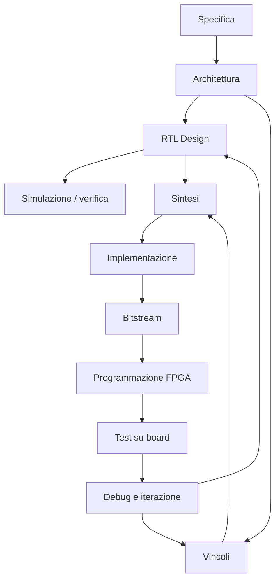
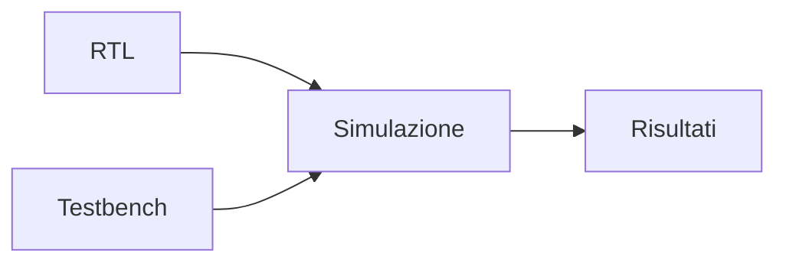
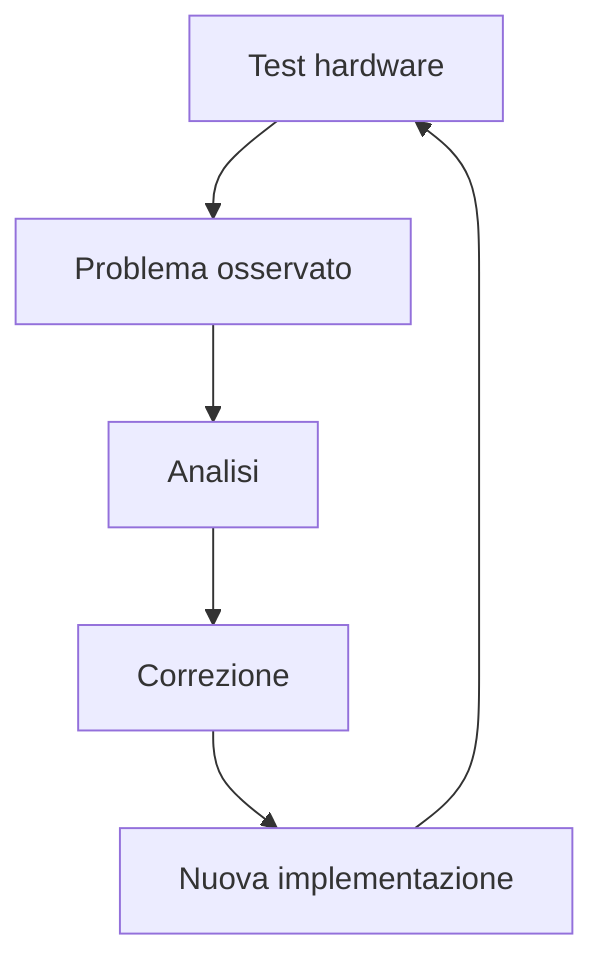

# Flusso di progettazione FPGA

La progettazione su **FPGA** non si riduce alla scrittura di una descrizione RTL.  
Per ottenere un sistema funzionante su hardware reale è necessario attraversare un insieme di fasi ben definite, ciascuna con:

- obiettivi specifici;
- input e output tecnici;
- verifiche intermedie;
- possibili iterazioni.

Il **flow FPGA** porta il progetto:

- dalla specifica funzionale;
- alla descrizione RTL;
- alla simulazione;
- alla sintesi;
- all'implementazione sul dispositivo;
- fino alla generazione del **bitstream** e al test su scheda reale.

Comprendere questo flusso è fondamentale perché spiega come un circuito descritto in HDL diventi davvero un hardware eseguibile sulla FPGA.

---

## 1. Visione generale del flow

Una vista semplificata del flusso FPGA è la seguente:

Questa rappresentazione è lineare solo in apparenza.  
Nella pratica, il flow FPGA è fortemente **iterativo**: timing, bug, problemi di mapping o di interfaccia con la board possono richiedere più passaggi di correzione.

---

## 2. Perché il flow FPGA è importante

Il flow FPGA è importante perché permette di collegare mondi diversi:

- il comportamento funzionale descritto in RTL;
- le risorse fisiche del dispositivo;
- i vincoli temporali;
- le interfacce elettriche della board;
- il comportamento del sistema reale.

Un progetto può infatti essere corretto in simulazione ma non funzionare su scheda perché:

- non chiude timing;
- usa male i clock;
- ha vincoli I/O sbagliati;
- non rispetta il pinout della board;
- dipende da reset o inizializzazioni non realistiche.

Per questo la progettazione FPGA è una disciplina completa, non solo un esercizio di descrizione hardware.

---

## 3. Fase 1: specifica

Come in ogni buon progetto hardware, il punto di partenza è la **specifica**.

Qui si definiscono:

- funzione del circuito;
- interfacce;
- frequenza target;
- requisiti di throughput e latenza;
- protocolli di comunicazione;
- condizioni di reset e startup;
- relazione con la board o con il sistema esterno.

### Input tipici

- requisiti applicativi;
- caratteristiche della board;
- obiettivi didattici o di prototipazione;
- eventuali vincoli di tempo o costo.

### Output tipici

- descrizione funzionale del sistema;
- elenco delle interfacce;
- requisiti temporali preliminari;
- prime ipotesi architetturali.

Una specifica debole rende molto più difficile tutto il resto del flow.

---

## 4. Fase 2: architettura

Dalla specifica si passa alla **definizione architetturale**.

In questa fase si decide:

- scomposizione in moduli;
- struttura del datapath;
- organizzazione del controllo;
- presenza di pipeline;
- uso di memorie;
- scelta tra LUT, BRAM, DSP, quando già intuibile;
- eventuali sottosistemi softcore o interfacce.

### Output tipici

- block diagram;
- gerarchia dei moduli;
- relazioni tra sottoblocchi;
- scelte preliminari di clocking e reset.

L'architettura è particolarmente importante in FPGA perché influenza direttamente:

- risorse usate;
- timing closure;
- mappabilità sul dispositivo.

---

## 5. Fase 3: RTL design

La fase di **RTL design** traduce l'architettura in una descrizione hardware sintetizzabile.

Qui si progettano:

- moduli;
- FSM;
- datapath;
- pipeline;
- registri;
- buffering;
- interfacce.

### Obiettivi principali

- correttezza funzionale;
- chiarezza strutturale;
- sintetizzabilità;
- buona relazione con le risorse FPGA.

### Output tipici

- file HDL;
- package o include;
- gerarchia RTL;
- documentazione tecnica minima del design.

La qualità dell'RTL condizionerà direttamente sintesi, timing e debug.

---

## 6. Fase 4: simulazione e verifica

Prima di passare all'implementazione sulla FPGA, il progetto deve essere **verificato in simulazione**.

Si controllano almeno:

- correttezza funzionale;
- protocolli;
- reset;
- casi base e casi limite;
- coerenza della pipeline;
- interfacce di input e output.

### Obiettivo

Individuare il maggior numero possibile di errori prima di arrivare alla scheda reale, dove il debug è più costoso e più lento.

---

## 7. Fase 5: vincoli

La FPGA non implementa il design in un vuoto astratto.  
Serve una descrizione dei vincoli reali del progetto.

I vincoli includono tipicamente:

- clock;
- periodi di clock;
- pin assignment;
- standard I/O;
- eventuali relazioni temporali;
- eccezioni di timing, se davvero necessarie;
- associazione tra segnali e risorse della board.

### Perché sono essenziali

Senza vincoli corretti, i tool possono:

- analizzare male il timing;
- assegnare pin sbagliati;
- implementare il progetto in modo non compatibile con la board;
- mascherare problemi reali.

---

## 8. Fase 6: sintesi

La **sintesi** traduce l'RTL in una rappresentazione logica mappata sulle risorse del dispositivo FPGA.

Il tool decide come implementare la logica usando:

- LUT;
- flip-flop;
- BRAM;
- DSP;
- altre risorse dedicate del dispositivo.

### Input tipici

- RTL;
- vincoli;
- dati del dispositivo target.

### Output tipici

- netlist logica o intermedia;
- report di utilizzo risorse;
- report di timing preliminari;
- messaggi sul mapping delle strutture.

La sintesi è il primo momento in cui il progetto viene confrontato davvero con la FPGA scelta.

---

## 9. Fase 7: implementazione

La fase di **implementazione** porta il progetto dalla netlist logica a una realizzazione fisica sul dispositivo.

A livello concettuale comprende:

- placement;
- routing;
- ottimizzazioni fisiche;
- analisi temporale più realistica.

### Obiettivi

- collocare la logica;
- usare le risorse reali del dispositivo;
- rispettare i vincoli;
- chiudere timing;
- preparare il design al bitstream finale.

Questa fase è il punto in cui il progetto incontra davvero la geografia fisica della FPGA.

---

## 10. Timing closure su FPGA

Dopo placement e routing, il progetto deve rispettare i vincoli temporali richiesti.

La **timing closure** su FPGA dipende da:

- struttura della RTL;
- uso delle pipeline;
- qualità del placement;
- lunghezza del routing;
- uso dei clock;
- risorse del dispositivo.

### Problemi tipici

- percorsi critici troppo lunghi;
- routing eccessivo;
- fanout elevato;
- clock domain crossing mal gestiti;
- reset troppo invasivi.

La timing closure è una delle aree in cui il flow FPGA assomiglia di più a quello ASIC, pur con strumenti e finalità diverse.

---

## 11. Fase 8: bitstream

Una volta completata l'implementazione, il tool genera il **bitstream**.

## 11.1 Che cos'è

È il file che configura la FPGA per implementare il progetto.

## 11.2 Perché è il punto di arrivo del flow

Il bitstream rappresenta la forma finale con cui il design viene caricato sul dispositivo.

### Differenza cruciale rispetto all'ASIC

In FPGA il punto finale non è il tape-out, ma la configurazione del dispositivo.  
Questo rende il flusso molto più rapido e iterabile.

---

## 12. Fase 9: programmazione della FPGA

Il bitstream viene poi caricato sul dispositivo FPGA tramite gli strumenti e le interfacce previste.

A questo punto il design non è più solo simulato o implementato in astratto: è presente sull'hardware reale.

### Possibili passi successivi

- osservazione delle uscite;
- verifica del clock;
- controllo del reset;
- test con periferiche reali;
- acquisizione di segnali di debug.

Questa fase segna il passaggio dalla verifica teorica all'osservazione pratica.

---

## 13. Fase 10: test su board

Una volta configurata la FPGA, si eseguono i **test su scheda**.

Questi possono includere:

- uso di LED o GPIO;
- test via UART;
- comunicazione con periferiche;
- loopback;
- test di throughput;
- osservazione di segnali interni tramite logic analyzer integrati;
- validazione di protocolli reali.

### Perché è importante

Molti problemi emergono solo su hardware reale, ad esempio:

- errori di inizializzazione;
- mismatch con la board;
- comportamento temporale non previsto;
- segnali esterni rumorosi o mal interpretati;
- assunzioni di simulazione troppo ottimistiche.

---

## 14. Debug e iterazione

Il flow FPGA è fortemente iterativo.  
Dopo il test su board, molto spesso si torna a correggere:

- RTL;
- vincoli;
- pin assignment;
- reset;
- struttura del clock;
- pipeline;
- ambiente di debug.

Questa iterazione è uno dei grandi punti di forza della FPGA: il progettista può migliorare rapidamente il design e riprovarlo su hardware reale.

---

## 15. Il ruolo della board nel flow

Nella progettazione FPGA, la **board** non è solo un supporto finale, ma parte attiva del progetto.

Aspetti rilevanti:

- clock realmente disponibili;
- reset fisici;
- pulsanti, LED, display;
- UART, SPI, I2C, GPIO;
- memorie esterne;
- collegamenti a sensori o dispositivi.

Questo significa che il flow FPGA non è solo "device-centric", ma anche **board-aware**.

---

## 16. Output principali del flow FPGA

Alla fine del flow, il progettista ottiene più deliverable utili.

### Output tecnici

- RTL verificata;
- file di vincoli;
- report di sintesi;
- report di implementazione;
- report di timing;
- bitstream;
- configurazione di debug, se presente.

### Output pratici

- progetto eseguibile su scheda;
- osservazioni sperimentali;
- dati di misura;
- eventuali problemi emersi su hardware reale.

Questo rende il flow FPGA molto ricco dal punto di vista didattico e pratico.

---

## 17. Errori frequenti nel flow FPGA

Tra gli errori più comuni:

- passare alla board senza simulazione seria;
- trattare i vincoli come dettaglio secondario;
- non considerare la board nella definizione del progetto;
- ignorare il timing;
- sottostimare il ruolo del routing e del placement;
- credere che un progetto "sintetizzato" sia automaticamente corretto;
- fare debug solo con LED senza una strategia più strutturata;
- non usare il feedback dell'hardware reale per migliorare il design.

---

## 18. Buone pratiche concettuali

Un buon flow FPGA segue alcuni principi chiari:

- partire da una specifica ordinata;
- costruire un'architettura compatibile con il dispositivo;
- verificare bene l'RTL in simulazione;
- definire vincoli realistici;
- leggere con attenzione report di sintesi e timing;
- usare il test su board come fase di apprendimento reale;
- accettare l'iterazione come parte naturale del progetto.

---

## 19. Collegamento con ASIC

Il flow FPGA condivide con il flow ASIC alcune idee forti:

- importanza dei vincoli;
- ruolo del timing;
- qualità della RTL;
- relazione tra logica e implementazione fisica;
- iterazione tra progetto e risultati dei tool.

Tuttavia, l'FPGA si distingue perché il punto finale non è la fabbricazione, ma la configurazione del dispositivo.  
Questo rende molto più rapida la sperimentazione e molto meno costosa la correzione degli errori.

Studiare il flow FPGA aiuta quindi a costruire una mentalità progettuale rigorosa, utile anche in ottica ASIC.

---

## 20. Collegamento con SoC

Nel contesto SoC, il flow FPGA è molto utile per:

- prototipare interi sottosistemi;
- sviluppare acceleratori;
- costruire piattaforme con processore e periferiche;
- validare memory map e interfacce;
- sviluppare firmware di supporto;
- testare il comportamento del sistema su hardware reale.

La sezione SoC mostra l'architettura di sistema; il flow FPGA mostra come rendere quel sistema concretamente sperimentabile.

---

## 21. Esempio concettuale

Immaginiamo un piccolo acceleratore streaming da implementare su FPGA.

Il flow potrebbe essere:

1. definizione di ingressi, uscite e throughput target;
2. scrittura della RTL con pipeline;
3. simulazione con testbench;
4. definizione del clock e dei pin della board;
5. sintesi;
6. implementazione sul dispositivo;
7. generazione del bitstream;
8. caricamento su scheda;
9. test dei risultati via UART o logic analyzer integrato.

Questo esempio mostra bene che il flow FPGA non è solo una serie di tool, ma una catena logica che collega progetto, implementazione e osservazione reale.

---

## 22. In sintesi

Il flow FPGA è la sequenza di fasi che porta da una specifica iniziale a un circuito funzionante su un dispositivo programmabile reale.

Le fasi principali sono:

- specifica;
- architettura;
- RTL;
- simulazione;
- vincoli;
- sintesi;
- implementazione;
- bitstream;
- programmazione;
- test e debug su board.

Comprendere questo flusso è essenziale perché mostra come il progetto hardware passi dalla descrizione astratta al comportamento fisico osservabile sulla scheda.

---

## Prossimo passo

Dopo aver visto il flusso generale, il passo naturale successivo è approfondire il **RTL design per FPGA**, cioè il modo in cui si scrive una descrizione hardware che sia non solo corretta, ma anche efficiente rispetto alle risorse e al comportamento del dispositivo programmabile.
