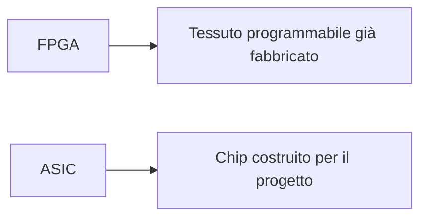

# FPGA vs ASIC

Le **FPGA** e gli **ASIC** sono due tecnologie fondamentali della progettazione digitale moderna, ma rispondono a esigenze molto diverse.  
Entrambe permettono di realizzare hardware dedicato, entrambe richiedono competenze su:

- RTL;
- timing;
- verifica;
- architettura;
- integrazione di sistema;

ma differiscono profondamente per:

- modalità di implementazione;
- costo;
- flessibilità;
- prestazioni;
- consumi;
- rischio di progetto;
- tempo necessario per arrivare a un prodotto funzionante.

Per scegliere correttamente tra FPGA e ASIC non basta dire che una è "programmabile" e l'altro è "custom".  
Occorre capire **quali compromessi** ciascuna tecnologia imponga e in quali contesti sia più adatta.

Questa pagina ha proprio l'obiettivo di mettere a confronto le due soluzioni in modo strutturato.

---

## 1. Definizione sintetica

## 1.1 FPGA

Una **FPGA** è un dispositivo programmabile dopo la fabbricazione, che permette di implementare circuiti digitali riconfigurando:

- logica;
- interconnessioni;
- memorie;
- risorse di clock;
- blocchi dedicati.

Il progetto finale viene caricato sulla FPGA tramite un **bitstream**.

## 1.2 ASIC

Un **ASIC** è un circuito integrato progettato per una funzione specifica e realizzato fisicamente tramite un flow che porta fino al **tape-out** e alla fabbricazione del chip.

L'hardware finale non è riconfigurabile nel senso tipico di una FPGA: il comportamento è incorporato nel silicio prodotto.

---

## 2. Differenza fondamentale

La differenza più importante è questa:

- con una **FPGA**, il progettista adatta il progetto a un tessuto programmabile già esistente;
- con un **ASIC**, il progettista costruisce un chip specifico per il progetto.

Da questa distinzione derivano quasi tutte le altre differenze pratiche.

---

## 3. Flessibilità

Uno dei principali vantaggi delle FPGA è la **flessibilità**.

## 3.1 FPGA

Una FPGA può essere:

- riprogrammata;
- aggiornata;
- corretta;
- riutilizzata per più versioni del progetto.

Questo è molto utile quando:

- i requisiti cambiano spesso;
- il progetto è ancora in evoluzione;
- si vuole sperimentare rapidamente;
- si deve correggere il comportamento senza cambiare hardware fisico.

## 3.2 ASIC

Un ASIC, una volta fabbricato, non può essere modificato con la stessa libertà.  
Un errore significativo può richiedere un nuovo ciclo di progettazione e fabbricazione.

### Conclusione

Dal punto di vista della flessibilità, la FPGA è generalmente superiore.

---

## 4. Prestazioni

Le prestazioni massime ottenibili possono essere molto diverse.

## 4.1 FPGA

Una FPGA può raggiungere ottime prestazioni in molti contesti, soprattutto per:

- parallelismo;
- prototipazione accelerata;
- elaborazione streaming;
- acceleratori specifici.

Tuttavia il progetto è limitato da:

- tessuto programmabile;
- routing configurabile;
- architettura del dispositivo;
- costo del clocking e delle interconnessioni.

## 4.2 ASIC

Un ASIC può essere ottimizzato direttamente per:

- frequenza;
- datapath;
- località delle connessioni;
- area;
- distribuzione fisica del clock;
- layout del chip.

### Conclusione

A parità di funzione, un ASIC tende in genere a offrire prestazioni superiori rispetto a una FPGA.

---

## 5. Consumo energetico

Anche il consumo è un criterio importante.

## 5.1 FPGA

Le FPGA tendono spesso a consumare di più, perché il tessuto programmabile introduce overhead in termini di:

- routing;
- configurabilità;
- clocking;
- capacità e carichi interni.

## 5.2 ASIC

Un ASIC può essere progettato in modo molto più efficiente dal punto di vista energetico, ottimizzando:

- logica;
- layout;
- clock tree;
- potenza dinamica e statica;
- domini di potenza;
- strutture dedicate.

### Conclusione

Dal punto di vista dell'efficienza energetica, l'ASIC tende generalmente a essere migliore.

---

## 6. Area ed efficienza hardware

Un progetto implementato su FPGA usa un'infrastruttura generale, non costruita ad hoc per quel circuito.

## 6.1 FPGA

Questo comporta:

- minore densità logica effettiva;
- uso di risorse predefinite;
- maggiore overhead di implementazione.

## 6.2 ASIC

L'ASIC può usare l'area in modo molto più mirato, implementando esattamente il circuito richiesto.

### Conclusione

In termini di efficienza dell'area e densità, l'ASIC è di solito superiore.

---

## 7. Time-to-market

Il **time-to-market** è uno dei punti più forti delle FPGA.

## 7.1 FPGA

Con una FPGA si può:

- scrivere la RTL;
- sintetizzare e implementare;
- generare il bitstream;
- testare sulla scheda;
- correggere rapidamente gli errori.

Questo permette di arrivare molto velocemente a un prototipo funzionante o anche a un prodotto reale.

## 7.2 ASIC

Il flow ASIC richiede molto più tempo perché include:

- sintesi;
- DFT;
- backend fisico;
- signoff;
- tape-out;
- fabbricazione;
- test post-silicon.

### Conclusione

Quando il tempo di sviluppo è critico, la FPGA è spesso la scelta più favorevole.

---

## 8. Costo di sviluppo

Il costo iniziale di sviluppo è molto diverso tra le due tecnologie.

## 8.1 FPGA

In molti casi il costo di ingresso è relativamente basso:

- non serve fabbricare un chip custom;
- si può partire da una board di sviluppo;
- l'iterazione è economica;
- il rischio iniziale è minore.

## 8.2 ASIC

L'ASIC richiede costi molto più elevati in termini di:

- flow di progetto;
- strumenti;
- validazione;
- fabbricazione;
- eventuali re-spin.

### Conclusione

Per costi iniziali e prototipazione, la FPGA è spesso molto più accessibile.

---

## 9. Costo per unità

Il costo per singolo pezzo cambia molto in funzione del volume.

## 9.1 FPGA

Le FPGA sono spesso vantaggiose per:

- volumi bassi o medi;
- prodotti che richiedono aggiornabilità;
- sviluppo rapido;
- piattaforme flessibili.

## 9.2 ASIC

Su volumi molto alti, l'ASIC può diventare molto competitivo, perché il costo iniziale si distribuisce su un grande numero di unità.

### Conclusione

- bassi volumi → spesso FPGA più conveniente;
- alti volumi → spesso ASIC più conveniente.

---

## 10. Rischio di progetto

Il rischio tecnico e industriale è un altro criterio decisivo.

## 10.1 FPGA

La FPGA riduce il rischio perché:

- gli errori si correggono più facilmente;
- il progetto può essere iterato rapidamente;
- il debug su hardware reale è accessibile;
- non serve rifabbricare il chip.

## 10.2 ASIC

L'ASIC aumenta il rischio perché eventuali errori critici dopo il tape-out possono causare:

- re-spin;
- ritardi;
- costi elevati;
- problemi di prodotto.

### Conclusione

Dal punto di vista del rischio, la FPGA è spesso più sicura nelle fasi iniziali o esplorative.

---

## 11. Complessità del flow

I due flussi di progetto condividono vari concetti, ma hanno complessità diverse.

## 11.1 Flow FPGA

Comprende tipicamente:

- RTL;
- simulazione;
- vincoli;
- sintesi;
- implementazione;
- bitstream;
- test su board.

## 11.2 Flow ASIC

Comprende tipicamente:

- specifica;
- architettura;
- RTL;
- verifica;
- sintesi;
- DFT;
- floorplanning;
- place and route;
- CTS;
- signoff;
- tape-out;
- fabbricazione.

### Conclusione

Il flow ASIC è in genere più lungo, più costoso e più vincolante.

---

## 12. Debug e osservabilità

## 12.1 FPGA

La FPGA consente di fare debug relativamente rapido su hardware reale usando:

- logic analyzer interni;
- LED;
- UART;
- GPIO;
- strumenti di test su board.

## 12.2 ASIC

Il debug di un ASIC dopo il silicio è molto più difficile e costoso, perché dipende fortemente da:

- DFT;
- testability;
- infrastrutture predisposte prima del tape-out;
- possibilità limitate di osservazione.

### Conclusione

La FPGA è molto più favorevole al debug iterativo durante lo sviluppo.

---

## 13. Aggiornabilità del prodotto

## 13.1 FPGA

Se il prodotto finale usa una FPGA, in molti casi il comportamento può essere aggiornato modificando il bitstream.

## 13.2 ASIC

L'ASIC non è aggiornabile nello stesso modo, salvo eventuale presenza di elementi programmabili interni progettati a monte.

### Conclusione

Per prodotti che devono evolvere nel tempo, la FPGA offre spesso un vantaggio strategico.

---

## 14. Adattabilità ai cambi di requisiti

In progetti in cui i requisiti sono instabili o si stanno ancora chiarendo:

- la FPGA è spesso ideale;
- l'ASIC è più adatto quando il progetto è già maturo e stabile.

Questa distinzione è importante perché una scelta tecnologica sbagliata può portare a costi o rigidità non sostenibili.

---

## 15. FPGA come ponte verso l'ASIC

Molti progetti usano la FPGA non come alternativa definitiva all'ASIC, ma come **passo intermedio**.

### La FPGA può servire per

- validare l'architettura;
- prototipare acceleratori;
- sviluppare firmware;
- testare interfacce;
- fare bring-up preliminare di sistema;
- ridurre il rischio prima del tape-out.

Questa è una delle strategie più comuni nei progetti complessi.

---

## 16. FPGA come prodotto finale

Non bisogna però pensare che la FPGA serva solo come prototipo.

In molti casi è una scelta finale eccellente, ad esempio quando servono:

- bassi volumi;
- aggiornabilità;
- time-to-market rapido;
- alta flessibilità;
- funzioni ancora in evoluzione;
- riconfigurabilità sul campo.

Questo vale sia in ambito industriale sia in ambito didattico e di ricerca.

---

## 17. ASIC come scelta finale ad alte prestazioni

L'ASIC è spesso la scelta naturale quando servono:

- consumi molto contenuti;
- massime prestazioni;
- alta densità;
- grande volume produttivo;
- forte ottimizzazione del prodotto finale.

Questo è particolarmente vero per:

- dispositivi consumer ad alto volume;
- sistemi embedded ottimizzati;
- acceleratori specializzati;
- chip integrati in SoC complessi.

---

## 18. Relazione con l'architettura del progetto

La tecnologia scelta influenza anche il modo in cui si pensa l'architettura.

## 18.1 Su FPGA

Conviene prestare particolare attenzione a:

- uso delle risorse dedicate;
- costo del routing;
- clocking;
- debug;
- località del design;
- board-level integration.

## 18.2 Su ASIC

Conviene prestare particolare attenzione a:

- timing closure lungo il flow;
- DFT;
- floorplanning;
- potenza;
- signoff;
- tape-out readiness.

Questo significa che FPGA e ASIC non differiscono solo nella "fase finale", ma influenzano tutto il modo di progettare.

---

## 19. Relazione con la verifica

La verifica è cruciale in entrambi i mondi, ma cambia il contesto.

## 19.1 FPGA

- simulazione RTL;
- test su board;
- debug iterativo;
- osservabilità relativamente rapida.

## 19.2 ASIC

- verifica RTL molto rigorosa;
- equivalence checking;
- DFT;
- signoff;
- test post-silicon più costoso.

### Conclusione

L'ASIC richiede una disciplina di verifica ancora più stringente, mentre la FPGA facilita l'iterazione pratica.

---

## 20. Relazione con SoC

Sia FPGA sia ASIC sono molto rilevanti per la progettazione SoC.

### FPGA

È ideale per:

- prototipazione di processori, periferiche e acceleratori;
- sviluppo firmware;
- sperimentazione di architetture di sistema.

### ASIC

È spesso la forma finale di realizzazione di un SoC quando:

- il sistema è maturo;
- i volumi lo giustificano;
- le prestazioni e i consumi sono critici.

La relazione tra le due tecnologie è quindi molto forte e spesso complementare.

---

## 21. Criteri pratici di scelta

Quando si deve scegliere tra FPGA e ASIC, alcune domande utili sono:

- i requisiti sono stabili o ancora in evoluzione?
- servono aggiornamenti sul campo?
- quanto contano consumi e prestazioni massime?
- quanti pezzi verranno prodotti?
- il tempo per arrivare a un prototipo è critico?
- il progetto è già abbastanza maturo da giustificare un tape-out?
- serve soprattutto prototipazione o un prodotto finale altamente ottimizzato?

Le risposte a queste domande aiutano molto più di un confronto puramente teorico.

---

## 22. Errori concettuali frequenti

Tra gli errori più comuni:

- pensare che la FPGA sia sempre solo un "ASIC peggiore";
- pensare che l'ASIC sia sempre la scelta migliore per ogni progetto maturo;
- ignorare il volume produttivo nella scelta;
- sottovalutare il valore della flessibilità;
- trascurare il costo del re-spin in ASIC;
- trascurare il costo energetico e di area in FPGA;
- scegliere una tecnologia solo per abitudine e non per criteri progettuali.

---

## 23. Buone pratiche concettuali

Una buona valutazione FPGA vs ASIC dovrebbe:

- partire dai requisiti del prodotto;
- considerare l'intero ciclo di vita del progetto;
- includere rischio, tempo, costo e volumi;
- distinguere prototipo da prodotto finale;
- riconoscere che le due tecnologie sono spesso complementari, non necessariamente rivali.

---

## 24. Esempio concettuale

Immaginiamo un acceleratore hardware per elaborazione dati.

### Se il progetto è ancora in evoluzione

La FPGA è molto utile per:

- modificare rapidamente l'architettura;
- testare il comportamento con software reale;
- fare debug su board;
- validare il valore effettivo dell'acceleratore.

### Se il progetto è maturo e destinato a grandi volumi

L'ASIC può diventare più interessante per:

- ridurre il consumo;
- aumentare le prestazioni;
- ridurre il costo per pezzo;
- integrare meglio l'acceleratore in un SoC finale.

Questo esempio mostra bene come la scelta dipenda dal contesto, non da una gerarchia assoluta tra le tecnologie.

---

## 25. In sintesi

FPGA e ASIC sono due tecnologie fondamentali ma con obiettivi diversi.

### La FPGA eccelle in

- flessibilità;
- time-to-market;
- prototipazione;
- debug;
- aggiornabilità;
- riduzione del rischio.

### L'ASIC eccelle in

- prestazioni;
- efficienza energetica;
- densità;
- ottimizzazione del prodotto finale;
- convenienza su grandi volumi.

La scelta corretta dipende da:

- maturità del progetto;
- volumi;
- vincoli di potenza e prestazioni;
- rischio accettabile;
- necessità di aggiornamento;
- tempo disponibile.

---

## Prossimo passo

Dopo il confronto tra FPGA e ASIC, il passo naturale successivo è chiudere la sezione con un **caso di studio FPGA**, in cui raccogliere i concetti introdotti e mostrarli in un percorso concreto dalla specifica fino al test su scheda reale.
