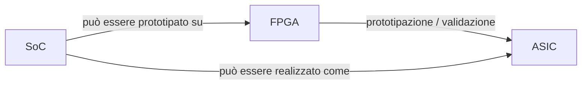
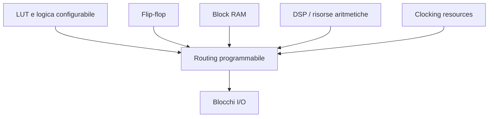
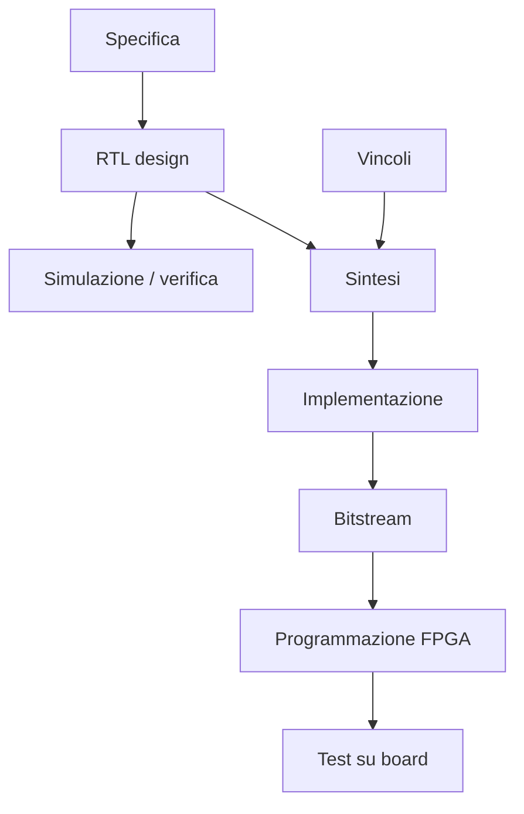

# Introduzione alle FPGA

Le **FPGA** (*Field-Programmable Gate Array*) sono dispositivi digitali programmabili che permettono di implementare circuiti hardware personalizzati **dopo la fabbricazione del chip**.  
A differenza di un ASIC, che viene realizzato fisicamente per una funzione specifica, una FPGA è una piattaforma hardware riconfigurabile che può essere configurata per realizzare:

- logica combinatoria e sequenziale;
- datapath dedicati;
- interfacce digitali;
- controller;
- acceleratori hardware;
- sistemi completi con processore, memorie e periferiche.

Questa caratteristica rende le FPGA estremamente importanti sia in ambito didattico sia industriale, perché permettono di:

- sviluppare rapidamente architetture hardware;
- validare idee e prototipi;
- implementare sistemi complessi senza ricorrere subito a un ASIC;
- fare debug su hardware reale;
- ridurre il rischio di progetto prima di un eventuale tape-out.

Le FPGA occupano quindi una posizione centrale nella progettazione moderna, come punto di incontro tra:

- progettazione logica;
- sperimentazione pratica;
- prototipazione di sistemi;
- validazione di sottosistemi e SoC;
- accelerazione hardware.

---

## 1. Che cos'è una FPGA

Una FPGA è un circuito integrato che contiene una grande quantità di risorse programmabili, configurabili dal progettista per implementare un circuito digitale.

In modo concettuale, una FPGA contiene:

- blocchi logici configurabili;
- registri;
- rete di interconnessione programmabile;
- blocchi di memoria;
- risorse aritmetiche dedicate;
- risorse di clock;
- blocchi di I/O.

Dopo la configurazione, la FPGA si comporta come un circuito hardware specifico, anche se il dispositivo fisico sottostante è generico.

---

## 2. Perché le FPGA sono importanti

Le FPGA sono importanti perché uniscono due proprietà molto preziose:

- **flessibilità**;
- **realismo hardware**.

A differenza del software, una FPGA non simula semplicemente il comportamento del circuito: realizza davvero un hardware concorrente e temporizzato.  
A differenza di un ASIC, permette di modificare il progetto senza rifabbricare il chip.

### Vantaggi principali

- iterazione rapida;
- prototipazione realistica;
- possibilità di test su hardware vero;
- riuso della stessa piattaforma per più progetti;
- riduzione del rischio prima di un eventuale ASIC;
- adatta sia a sistemi piccoli sia a piattaforme complesse.

---

## 3. Quando si usa una FPGA

Le FPGA vengono usate in molti contesti diversi.

### 3.1 Didattica e apprendimento

Sono ideali per:

- imparare il design digitale;
- verificare concretamente FSM, datapath e protocolli;
- collegare teoria e pratica;
- fare esperimenti con clock, reset, timing e I/O.

### 3.2 Prototipazione

Permettono di validare rapidamente:

- IP hardware;
- acceleratori;
- interfacce;
- sottosistemi;
- interi SoC.

### 3.3 Prodotti reali

In alcuni casi, la FPGA è la piattaforma finale del prodotto, soprattutto quando servono:

- volumi medio-bassi;
- aggiornabilità;
- time-to-market rapido;
- flessibilità futura.

### 3.4 Validazione pre-ASIC

Le FPGA sono spesso usate per:

- prototipare architetture ASIC;
- sviluppare firmware e software di bring-up;
- ridurre il rischio prima del tape-out.

---

## 4. Differenza tra FPGA, ASIC e SoC

È utile chiarire da subito la differenza tra questi concetti.

## 4.1 FPGA

È un dispositivo programmabile dopo la fabbricazione.

## 4.2 ASIC

È un chip progettato e fabbricato per una funzione specifica.

## 4.3 SoC

È un sistema integrato su chip, che può contenere:

- CPU;
- memorie;
- interconnect;
- periferiche;
- acceleratori.

Un SoC può essere prototipato su FPGA e poi realizzato come ASIC.  
Questo rende la FPGA un ponte molto naturale tra progettazione di sistema e realizzazione hardware.

---

## 5. Perché una FPGA non è solo "una soluzione temporanea"

Una visione superficiale considera la FPGA soltanto come "passo intermedio" verso un ASIC.  
In realtà, la FPGA è una tecnologia con una propria identità progettuale.

Una FPGA richiede infatti competenze specifiche su:

- architettura interna del dispositivo;
- mapping delle risorse;
- timing closure;
- clocking;
- interfacce verso la board;
- debug su hardware reale.

Per questo progettare bene su FPGA è una disciplina autonoma, non una semplice anticipazione del flow ASIC.

---

## 6. Architettura interna: visione introduttiva

Anche se i dettagli verranno approfonditi nella sezione successiva, è utile anticipare che una FPGA non è un "vuoto digitale" programmabile arbitrariamente, ma un insieme strutturato di risorse.

Una vista concettuale molto semplificata è la seguente:

Questa struttura spiega perché il progettista FPGA debba conoscere non solo l'RTL, ma anche le risorse del dispositivo su cui il progetto verrà implementato.

---

## 7. Il flow di progetto FPGA

Uno degli aspetti più importanti delle FPGA è il **flow di implementazione**, che porta da una descrizione hardware al caricamento del circuito sulla scheda.

Una visione semplificata del flow è la seguente:

Questo flow è diverso da quello ASIC perché si conclude non con il tape-out, ma con la generazione del **bitstream** e la configurazione del dispositivo.

---

## 8. Bitstream e configurazione

Una differenza cruciale rispetto agli ASIC è la presenza del **bitstream**.

## 8.1 Che cos'è

Il bitstream è il file che configura la FPGA, definendo:

- la logica implementata;
- le connessioni interne;
- l'uso delle memorie;
- la rete di clock;
- i blocchi di I/O.

## 8.2 Perché è importante

Il bitstream è il punto finale del flow FPGA, equivalente concettuale della "realizzazione finale" del progetto, ma con una differenza fondamentale: può essere rigenerato e ricaricato molto più facilmente rispetto a un ASIC.

Questo rende la FPGA ideale per iterazioni rapide e sperimentazione.

---

## 9. Timing e realtà hardware

Uno degli aspetti più formativi delle FPGA è che obbligano il progettista a confrontarsi con la realtà del timing.

Su FPGA non basta scrivere RTL corretta in simulazione: bisogna anche verificare che il design:

- chiuda timing;
- usi bene le risorse;
- abbia clocking corretto;
- gestisca reset e crossing;
- sia compatibile con la board e le periferiche reali.

Per questo le FPGA sono una scuola eccellente di progettazione hardware concreta.

---

## 10. FPGA e risorse dedicate

Le FPGA moderne non sono costituite solo da logica generica.  
Mettono a disposizione anche risorse dedicate molto importanti, ad esempio:

- block RAM;
- distributed RAM;
- DSP slice;
- FIFO;
- PLL o risorse di clocking;
- interfacce hard o blocchi speciali, in alcuni dispositivi.

Questo significa che progettare bene su FPGA richiede di sapere **quale risorsa usare per quale funzione**.

---

## 11. FPGA e board-level design

A differenza di molta teoria del digitale astratto, il lavoro su FPGA è spesso collegato a una **scheda reale**.

Questo implica considerare:

- pin assignment;
- clock disponibili sulla board;
- reset esterni;
- LED, pulsanti, UART, SPI, GPIO;
- memorie esterne;
- interfacce fisiche reali.

La progettazione FPGA ha quindi una dimensione pratica molto concreta che collega il design hardware al contesto fisico del sistema.

---

## 12. FPGA e debug

Uno dei grandi vantaggi delle FPGA è che il progetto può essere testato e osservato su hardware reale, usando tecniche di debug come:

- logic analyzer interni;
- segnali di test su pin;
- UART di debug;
- LED e display;
- trigger su segnali interni.

Questo rende la FPGA uno strumento prezioso non solo per implementare hardware, ma anche per **capire** come esso si comporti davvero.

---

## 13. FPGA e prototipazione di sistemi complessi

Le FPGA non servono solo per piccoli esercizi o moduli isolati.  
Possono essere usate per prototipare:

- acceleratori;
- sottosistemi di memoria;
- controller di comunicazione;
- sistemi con processore softcore;
- piattaforme complete con periferiche;
- prototipi di SoC.

Questa capacità le rende centrali in molti flussi moderni di co-design hardware/software.

---

## 14. Vantaggi e limiti delle FPGA

Per capire bene il loro ruolo, è utile vedere insieme vantaggi e limiti.

### Vantaggi

- programmabilità;
- prototipazione rapida;
- riuso;
- time-to-market breve;
- debug reale;
- possibilità di iterare facilmente.

### Limiti

- prestazioni in genere inferiori a un ASIC dedicato;
- consumi spesso maggiori;
- area meno efficiente dal punto di vista hardware;
- costo unitario poco conveniente su altissimi volumi;
- architettura interna vincolata dal dispositivo scelto.

Questi limiti non riducono il valore della FPGA: aiutano a capire quando usarla e come progettare in modo consapevole.

---

## 15. Errori concettuali frequenti

Quando si inizia a lavorare con le FPGA, alcuni errori di impostazione sono molto comuni.

### Pensare che basti la simulazione

La simulazione è fondamentale, ma non basta: il design deve anche usare correttamente le risorse del dispositivo e chiudere timing.

### Pensare che l'FPGA sia "quasi un ASIC"

Una FPGA e un ASIC hanno in comune molte tecniche di design, ma sono tecnologie diverse e vanno capite nelle loro specificità.

### Trascurare vincoli e clocking

Su FPGA, i problemi di clock, reset e timing sono reali e molto importanti.

### Vedere la scheda solo come supporto finale

In realtà, il comportamento della board fa parte del progetto stesso.

---

## 16. Collegamento con ASIC

Le FPGA sono spesso usate come ponte verso il mondo ASIC.

Permettono di:

- verificare architetture;
- prototipare acceleratori;
- sviluppare software di supporto;
- osservare problemi di sistema;
- ridurre il rischio prima del tape-out.

Tuttavia, una FPGA non replica perfettamente un ASIC: alcune differenze riguardano:

- architettura interna;
- potenza;
- timing;
- flessibilità;
- contesto tecnologico.

Studiare le FPGA aiuta quindi anche a capire meglio perché il flow ASIC richieda disciplina così forte.

---

## 17. Collegamento con SoC

Le FPGA sono una piattaforma eccellente per prototipare e sperimentare concetti di SoC.

Su FPGA si possono costruire sistemi che includono:

- processore;
- bus;
- memorie;
- periferiche;
- acceleratori;
- firmware di controllo.

Per questo la sezione FPGA è naturalmente complementare alla sezione SoC: mostra il lato **realizzabile e sperimentabile** dei concetti architetturali.

---

## 18. Obiettivo della sezione FPGA

L'obiettivo di questa sezione è costruire una visione chiara e progressiva di come si progetta su FPGA, affrontando in modo ordinato:

- architettura interna del dispositivo;
- flow di progetto;
- RTL design;
- vincoli e timing;
- uso delle risorse;
- implementazione fisica sul dispositivo;
- verifica e debug su hardware reale;
- collegamenti con SoC e ASIC.

La sezione non vuole essere soltanto una guida all'uso di tool, ma una base concettuale solida per comprendere la logica progettuale delle FPGA.

---

## 19. In sintesi

Le FPGA sono dispositivi programmabili che permettono di implementare circuiti hardware personalizzati dopo la fabbricazione del chip.

Il loro valore sta nella combinazione di:

- flessibilità;
- realismo hardware;
- rapidità di iterazione;
- capacità di prototipare sistemi complessi;
- possibilità di test e debug su piattaforma reale.

Studiare le FPGA significa imparare non solo a scrivere RTL, ma anche a comprendere:

- risorse hardware programmabili;
- timing;
- clocking;
- implementazione su dispositivo;
- collegamento tra simulazione e hardware reale.

---

## Prossimo passo

Dopo questa introduzione, il passo naturale successivo è approfondire l'**architettura di una FPGA**, cioè le risorse interne del dispositivo e il modo in cui esse condizionano il design e l'implementazione dei progetti hardware.
