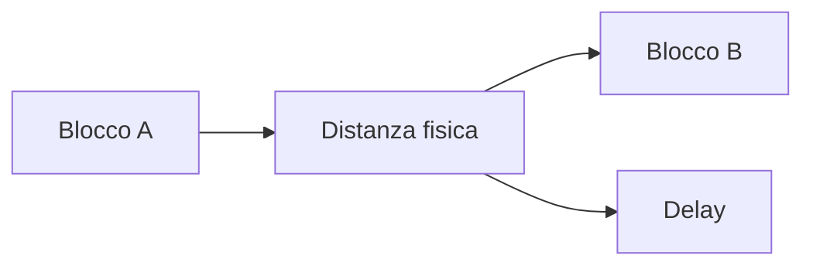
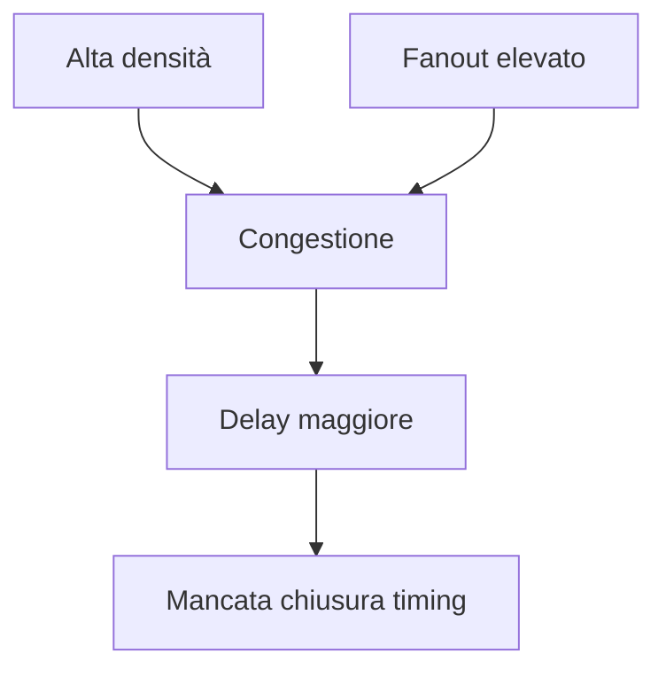
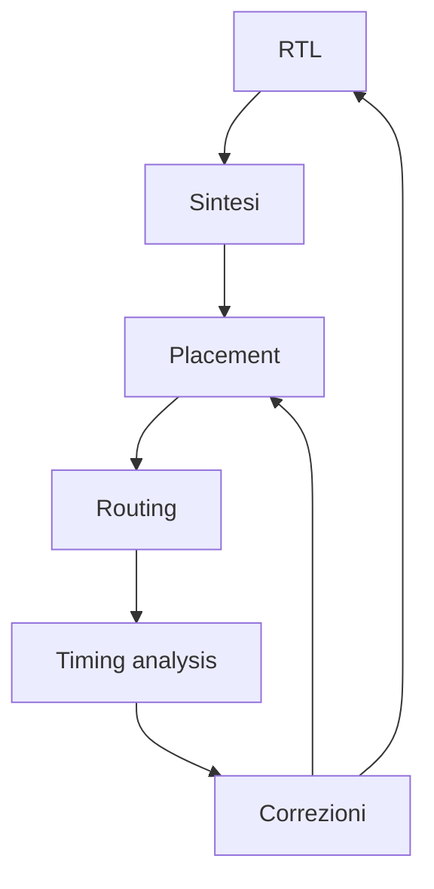

# Placement, routing e timing closure in un progetto FPGA

Dopo la sintesi, il progetto FPGA non è ancora pronto per essere caricato sulla scheda.  
La logica descritta in RTL e mappata sulle risorse del dispositivo deve ancora essere:

- collocata nelle regioni fisiche della FPGA;
- collegata attraverso la rete di routing programmabile;
- verificata rispetto ai vincoli temporali;
- ottimizzata per ridurre i percorsi critici e la congestione.

Questa fase del flow è spesso descritta come **implementation**, ma concettualmente può essere letta attraverso tre temi principali:

- **placement**;
- **routing**;
- **timing closure**.

Comprendere questa fase è fondamentale perché è qui che il progetto incontra davvero la **geografia fisica del dispositivo** e i limiti concreti della sua architettura.

---

## 1. Perché placement e routing sono così importanti

Uno degli errori più comuni è pensare che, una volta completata la sintesi, il progetto sia quasi finito.  
In realtà, su FPGA la qualità finale del design dipende moltissimo da come le risorse vengono usate nello spazio fisico del dispositivo.

Anche una RTL ben scritta può avere problemi se:

- i blocchi logicamente vicini finiscono fisicamente lontani;
- il routing diventa troppo lungo;
- la congestione cresce in aree critiche;
- il clocking non è ben distribuito;
- il timing non chiude dopo l'implementazione reale.

Per questo placement e routing non sono dettagli esecutivi, ma fasi determinanti per il successo del progetto.

---

## 2. Dalla sintesi all'implementazione fisica

La sintesi produce una rappresentazione logica del progetto che usa:

- LUT;
- flip-flop;
- BRAM;
- DSP;
- altre risorse del dispositivo.

L'implementazione deve poi stabilire:

- **dove** collocare queste risorse nella FPGA;
- **come** collegarle fisicamente;
- **quanto** questi collegamenti impattino il timing.

Questo passaggio è fondamentale perché la FPGA non è un contenitore astratto: ha colonne, regioni, reti e limiti fisici concreti.

---

## 3. Placement: che cos'è

Il **placement** è la fase in cui il tool decide dove collocare, sul dispositivo FPGA, i blocchi logici e le risorse del progetto.

## 3.1 Che cosa viene collocato

Tipicamente vengono collocati:

- LUT;
- flip-flop;
- BRAM;
- DSP;
- FIFO o strutture derivate;
- eventuali blocchi speciali;
- punti di connessione con clocking e I/O.

## 3.2 Obiettivo del placement

L'obiettivo non è solo "far stare tutto nella FPGA", ma farlo in un modo che favorisca:

- routing efficiente;
- timing closure;
- uso equilibrato delle risorse;
- minore congestione;
- buona distribuzione dei clock.

Il placement è quindi una vera attività di ottimizzazione fisica.

---

## 4. Perché il placement influisce sul timing

Su FPGA, il ritardo di un percorso non dipende solo dalla logica combinatoria, ma anche molto dal **routing**.  
E il routing dipende fortemente da dove i blocchi sono stati collocati.

Se due blocchi fortemente connessi sono fisicamente lontani:

- il routing sarà più lungo;
- il ritardo aumenterà;
- il percorso potrà diventare critico.

Per questo un buon placement tende a mantenere vicine le risorse che scambiano molto traffico o che appartengono allo stesso datapath.

---

## 5. Placement e geografia della FPGA

Una FPGA moderna non distribuisce tutte le risorse in modo uniforme.

Esistono infatti:

- regioni logiche;
- colonne di BRAM;
- colonne di DSP;
- reti di clock globali o regionali;
- I/O disposti ai bordi;
- eventuali hard IP localizzati.

Questo significa che il placement deve tenere conto anche della **geografia delle risorse**.

### Esempio intuitivo

Se un datapath usa intensamente BRAM e DSP, il risultato dipenderà anche da:

- dove sono fisicamente le BRAM;
- dove sono i DSP;
- quanto routing serve per collegarli;
- quante risorse logiche si trovano nelle regioni intermedie.

---

## 6. Placement globale e affinamento locale

Concettualmente, il placement può essere letto in due momenti.

## 6.1 Placement globale

Decide la posizione approssimativa dei blocchi e la distribuzione generale del progetto.

## 6.2 Placement locale o di affinamento

Rifinisce la collocazione per:

- migliorare il timing;
- ridurre conflitti;
- rendere legale il placement;
- ottimizzare l'uso delle risorse locali.

Questo processo è importante perché la prima posizione "ragionevole" di un blocco non è sempre quella migliore o legalmente implementabile.

---

## 7. Densità e distribuzione del design

Anche in FPGA, la **densità** con cui il progetto occupa certe regioni del dispositivo è molto importante.

## 7.1 Densità troppo alta

Può causare:

- routing congestion;
- difficoltà nel raggiungere il timing;
- maggiore uso di percorsi lunghi;
- peggioramento della qualità del placement.

## 7.2 Densità troppo bassa

Può portare a:

- design troppo disperso;
- percorsi lunghi;
- uso poco efficiente delle risorse;
- clocking meno favorevole.

Il placement cerca quindi un compromesso tra compattezza e implementabilità.

---

## 8. Routing: che cos'è

Il **routing** è la fase in cui il tool collega fisicamente i blocchi posizionati usando la rete di interconnessione programmabile della FPGA.

## 8.1 Cosa fa il routing

- realizza i collegamenti tra LUT, FF, BRAM, DSP e I/O;
- usa le risorse di routing disponibili nel dispositivo;
- costruisce i percorsi effettivi dei segnali;
- determina una parte importante del ritardo finale del progetto.

## 8.2 Perché è così importante in FPGA

Nelle FPGA, il routing ha un peso spesso molto maggiore rispetto ad altri contesti, perché la rete di interconnessione programmabile è una delle parti più costose in termini di:

- ritardo;
- consumo;
- complessità fisica.

---

## 9. Routing e percorsi critici

Molti percorsi critici in FPGA non sono critici solo per colpa della logica, ma soprattutto per il costo del routing.

### Cause tipiche

- blocchi fisicamente lontani;
- fanout elevato;
- congestione della regione;
- passaggi forzati attorno a colonne BRAM o DSP;
- segnali che attraversano grandi parti del dispositivo.

Per questo la timing closure su FPGA richiede una visione integrata tra:

- RTL;
- placement;
- routing;
- uso delle risorse.

---

## 10. Congestione

La **congestione** è uno dei problemi più rilevanti dell'implementazione FPGA.

## 10.1 Che cos'è

Si verifica quando troppe connessioni devono attraversare la stessa regione o usare risorse di routing simili.

## 10.2 Cause tipiche

- progetto troppo denso in una zona;
- uso concentrato di BRAM o DSP;
- interconnect molto centralizzate;
- fanout elevato;
- architettura poco localizzata;
- pin o I/O che attraggono troppo traffico in un'area ristretta.

## 10.3 Conseguenze

- ritardi maggiori;
- percorsi più lunghi;
- difficoltà di chiusura timing;
- aumento dell'instabilità del progetto rispetto alla frequenza target.

---

## 11. Placement e routing delle BRAM

Le **BRAM** non sono ovunque: occupano regioni fisiche dedicate del dispositivo.

Questo significa che, quando il progetto usa molte memorie, il placement e il routing devono tenere conto di:

- posizione delle colonne BRAM;
- distanza tra BRAM e logica che le usa;
- eventuale competizione tra più sottoblocchi per le stesse regioni;
- impatto sul routing circostante.

Una RTL che usa bene le BRAM dal punto di vista logico può comunque incontrare difficoltà fisiche se la struttura del design è troppo sbilanciata.

---

## 12. Placement e routing dei DSP

Lo stesso vale per i **DSP blocks**, che spesso sono fisicamente organizzati in colonne o regioni dedicate.

Se un datapath numerico usa molti DSP:

- la sua posizione fisica conta molto;
- il collegamento con registri e BRAM diventa importante;
- i percorsi verso la logica di controllo possono diventare più lunghi;
- la chiusura timing può dipendere fortemente dalla località del calcolo.

Per questo la progettazione FPGA efficace deve considerare la disposizione fisica dei DSP già a livello architetturale.

---

## 13. Floorplanning leggero su FPGA

Anche se il termine **floorplanning** è più spesso associato al mondo ASIC, esistono concetti simili anche in FPGA.

## 13.1 Che cosa significa in FPGA

A livello concettuale, significa:

- favorire la località di certi sottoblocchi;
- guidare il placement quando necessario;
- evitare dispersione eccessiva;
- rispettare la struttura fisica delle risorse del dispositivo.

## 13.2 Quando diventa importante

- design grandi;
- forte uso di BRAM e DSP;
- sottosistemi distinti;
- progetti con più domini di clock;
- prototipi SoC o acceleratori complessi.

Non sempre è necessario intervenire manualmente, ma capire la logica del floorplanning aiuta molto a leggere i risultati del tool.

---

## 14. Timing closure

La **timing closure** è il processo con cui il progetto viene portato a rispettare tutti i vincoli temporali richiesti.

Su FPGA, questo processo dipende da:

- qualità della RTL;
- pipeline;
- uso delle risorse;
- fanout;
- placement;
- routing;
- clocking;
- vincoli.

La timing closure è spesso iterativa e richiede una comprensione complessiva del progetto, non solo dei report.

---

## 15. Cause tipiche di mancata timing closure

Tra le cause più frequenti troviamo:

- logica combinatoria troppo lunga;
- routing eccessivo;
- uso inefficiente di LUT al posto di risorse dedicate;
- fanout elevato;
- clock domain gestiti male;
- reset troppo diffusi;
- design troppo denso;
- struttura del datapath poco localizzata;
- vincoli incompleti o errati.

Questi problemi non vanno trattati come "colpa del tool", ma come segnali di una struttura del progetto da migliorare.

---

## 16. Fanout e segnali globali

Alcuni segnali possono avere **fanout elevato**, cioè raggiungere un numero molto grande di destinazioni.

Esempi tipici:

- enable ampiamente distribuiti;
- reset;
- certi segnali di controllo;
- selezioni globali.

Un fanout elevato può causare:

- ritardi maggiori;
- uso pesante del routing;
- maggiore difficoltà di timing;
- instabilità del progetto a frequenze più alte.

Per questo è importante progettare con attenzione anche la distribuzione dei segnali di controllo, non solo del datapath.

---

## 17. Placement, routing e clocking

Il placement e il routing influenzano anche il **clocking**.

Se il progetto è:

- troppo disperso;
- mal suddiviso in regioni;
- congestionato;
- caratterizzato da domini multipli poco ordinati;

allora anche la distribuzione del clock e il raggiungimento del timing diventano più difficili.

Su FPGA, la qualità del clocking non è separabile dalla qualità generale dell'implementazione.

---

## 18. Timing post-route

Il momento più significativo dell'analisi temporale è quello che avviene **dopo il routing**, quando il progetto ha una realizzazione fisica molto più realistica.

Qui emergono con maggiore chiarezza:

- veri percorsi critici;
- costo delle interconnessioni;
- effetti del placement;
- problemi locali di congestione;
- percorsi che in sintesi sembravano innocui ma che in hardware diventano problematici.

Per questo il timing post-route è uno degli strumenti principali per giudicare la qualità reale del progetto su FPGA.

---

## 19. Iterazione tra implementazione e RTL

Quando il timing non chiude o il routing è troppo costoso, spesso il progettista deve tornare alla RTL.

Possibili correzioni:

- aggiunta di pipeline;
- riduzione del fanout;
- migliore località del datapath;
- uso più corretto di DSP o BRAM;
- semplificazione del controllo;
- miglior uso dei clock enable;
- riduzione di reset non necessari.

Questo dimostra che placement e routing non sono soltanto una fase automatica, ma un forte meccanismo di feedback verso la progettazione logica.

---

## 20. Debug dei problemi di implementazione

Quando un progetto non chiude timing o si comporta male in implementazione, è utile farsi alcune domande guida:

- il percorso critico è logico o dominato dal routing?
- sto usando la risorsa giusta?
- il problema nasce da una regione troppo densa?
- il fanout è eccessivo?
- il clocking è coerente?
- la board impone vincoli che sto trascurando?
- il design è troppo disperso o troppo concentrato?

Questa mentalità aiuta a trasformare i report del tool in comprensione progettuale.

---

## 21. Errori frequenti

Tra gli errori più comuni in questa fase:

- credere che il placement sia irrilevante perché gestito automaticamente;
- ignorare la congestione;
- guardare solo l'uso delle risorse e non il timing post-route;
- sottovalutare il costo del routing;
- usare male BRAM e DSP dal punto di vista fisico;
- non capire che la geografia del dispositivo conta;
- pensare che la mancata chiusura timing si risolva sempre solo con vincoli più "furbi";
- non iterare sulla RTL quando necessario.

---

## 22. Buone pratiche concettuali

Una buona gestione di placement, routing e timing closure su FPGA tende a seguire alcuni principi:

- progettare per la località dei dati;
- usare correttamente le risorse dedicate;
- leggere con attenzione i timing report post-route;
- considerare il routing come costo reale;
- non ignorare fanout e segnali globali;
- usare il floorplanning leggero quando il design lo richiede;
- accettare l'iterazione tra implementazione e RTL come parte naturale del flow.

---

## 23. Collegamento con ASIC

Molti concetti trattati qui sono molto vicini al mondo ASIC:

- placement;
- routing;
- congestione;
- timing closure;
- importanza della geografia fisica.

La differenza principale è che, su FPGA, il progettista lavora su un tessuto programmabile già esistente, con risorse fisse e distribuzione predefinita.

Studiare placement e routing su FPGA è comunque un ottimo modo per sviluppare **physical awareness**, utile anche in ottica ASIC.

---

## 24. Collegamento con SoC

Nel contesto SoC, questi concetti diventano ancora più importanti quando si prototipano su FPGA:

- sottosistemi multipli;
- memory subsystem;
- acceleratori;
- interconnect;
- CPU softcore;
- periferiche;
- più clock domain.

Capire placement e routing permette di realizzare prototipi SoC più robusti, più vicini al comportamento reale del sistema e più utili come passo verso una possibile implementazione ASIC.

---

## 25. Esempio concettuale

Immaginiamo un acceleratore FPGA che usa:

- BRAM per i buffer;
- DSP per il datapath;
- logica di controllo in LUT;
- clock a frequenza relativamente alta.

In sintesi il progetto sembra ragionevole, ma dopo implementazione emerge slack negativo.

Analizzando il risultato, il progettista scopre che:

- i DSP e le BRAM coinvolte sono fisicamente lontani;
- il routing tra buffer e calcolo è troppo lungo;
- il fanout di alcuni segnali di controllo è elevato.

Le possibili correzioni sono allora:

- aggiungere pipeline;
- localizzare meglio i blocchi;
- ridurre fanout e segnali globali;
- semplificare la logica di controllo;
- aiutare il mapping delle risorse nella RTL.

Questo esempio mostra bene come placement, routing e timing closure siano una fase di comprensione profonda del progetto, non solo di esecuzione del tool.

---

## 26. In sintesi

Placement, routing e timing closure sono il cuore dell'implementazione fisica su FPGA.

Questa fase determina:

- dove vengono collocate le risorse;
- come vengono collegate;
- quanto costano realmente i percorsi del progetto;
- se il design soddisfa davvero i vincoli temporali.

I concetti fondamentali da comprendere sono:

- placement;
- routing;
- congestione;
- località delle risorse;
- floorplanning leggero;
- timing post-route;
- iterazione tra implementazione e RTL.

Un progetto FPGA non è realmente pronto quando la sintesi va a buon fine, ma quando l'implementazione fisica sul dispositivo chiude timing in modo robusto e coerente con la board reale.

---

## Prossimo passo

Dopo placement, routing e timing closure, il passo naturale successivo è approfondire la **verifica e il test su FPGA**, cioè il modo in cui si collega la simulazione alla validazione su hardware reale e si costruisce fiducia nel comportamento del progetto sulla scheda.
