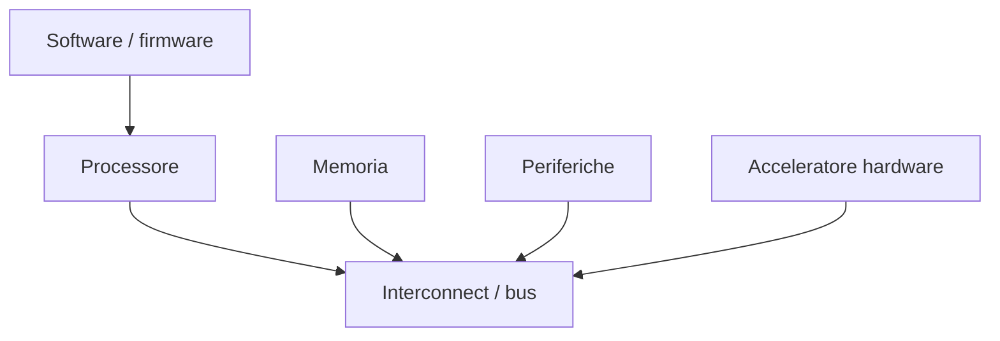
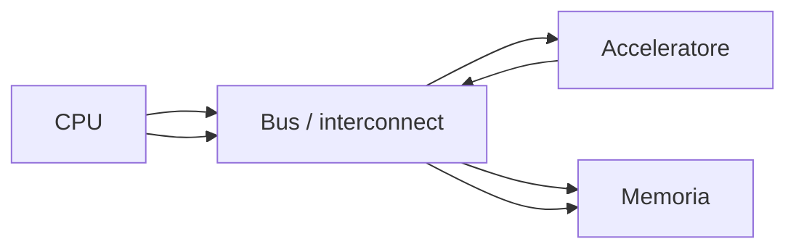

# Prototipazione di sistemi e SoC su FPGA

Una delle applicazioni più importanti delle FPGA è la **prototipazione di sistemi complessi**, inclusi sottosistemi hardware e veri e propri **SoC**.  
Se nelle sezioni precedenti abbiamo visto come progettare e implementare blocchi digitali su FPGA, qui allarghiamo la prospettiva: la FPGA non è solo una piattaforma per moduli isolati, ma può diventare una base concreta per costruire e sperimentare:

- sistemi con processore;
- interconnect e bus;
- memorie;
- periferiche;
- acceleratori hardware;
- piattaforme di co-design hardware/software.

Questo ruolo rende la FPGA uno strumento centrale sia in ambito didattico sia in ambito industriale, perché permette di validare idee di sistema prima di affrontare il costo e il rischio di una realizzazione ASIC o di una piattaforma definitiva.

---

## 1. Perché usare una FPGA per prototipare un sistema

La FPGA è particolarmente adatta alla prototipazione di sistemi perché unisce:

- flessibilità;
- rapidità di iterazione;
- realismo hardware;
- possibilità di interazione con periferiche reali;
- supporto naturale al co-design hardware/software.

Con una FPGA è possibile costruire un prototipo che non sia solo una simulazione astratta, ma un vero sistema eseguibile su scheda, con:

- clock reali;
- memorie;
- interfacce fisiche;
- software in esecuzione;
- segnali osservabili in debug.

Questo permette di verificare non solo singoli blocchi, ma il comportamento complessivo del sistema.

---

## 2. Che cosa significa prototipare un SoC su FPGA

Prototipare un **SoC** su FPGA significa realizzare su dispositivo programmabile un sistema che includa alcuni o tutti i seguenti elementi:

- processore;
- memorie locali o esterne;
- bus o interconnect;
- periferiche;
- acceleratori custom;
- logica di controllo;
- firmware o software di supporto.

L'obiettivo non è necessariamente replicare perfettamente il chip finale, ma costruire una piattaforma abbastanza realistica da validare:

- architettura;
- interazione dei blocchi;
- protocolli;
- flussi dati;
- software di controllo;
- casi d'uso reali.

---

## 3. Perché questo è importante

La prototipazione di sistemi su FPGA è preziosa per più motivi.

### 3.1 Riduzione del rischio

Permette di identificare problemi prima di una possibile implementazione ASIC o di un'integrazione più costosa.

### 3.2 Validazione dell'architettura

Aiuta a capire se l'organizzazione del sistema funziona davvero in un contesto eseguibile.

### 3.3 Sviluppo software anticipato

Il firmware e parte del software possono essere sviluppati e testati prima che esista il chip definitivo.

### 3.4 Test di integrazione

Si possono verificare insieme:

- processore;
- acceleratori;
- bus;
- periferiche;
- memorie.

Questa è una delle ragioni per cui le FPGA sono così usate nei flussi moderni di sviluppo hardware.

---

## 4. Softcore e processori su FPGA

Una delle possibilità più interessanti offerte dalle FPGA è l'uso di **softcore processor**.

## 4.1 Che cos'è un softcore

Un softcore è un processore implementato in logica programmabile all'interno della FPGA.

## 4.2 Perché è utile

Permette di costruire sistemi embedded completamente interni al dispositivo, in cui il processore può:

- eseguire firmware;
- configurare periferiche;
- controllare acceleratori;
- leggere e scrivere registri;
- orchestrare sottosistemi complessi.

## 4.3 Limiti

Un softcore usa risorse del dispositivo e in genere offre prestazioni inferiori rispetto a un processore hard dedicato, ma è estremamente flessibile e molto utile per didattica e prototipazione.

---

## 5. Hard processor su FPGA

Alcune piattaforme FPGA includono anche **hard processor**, cioè processori già implementati fisicamente nel chip.

## 5.1 Vantaggi

- migliori prestazioni;
- minore uso di logica programmabile;
- integrazione stretta con il resto del sistema;
- maggiore realismo per prototipi vicini a un SoC finale.

## 5.2 Ruolo nella prototipazione

Permettono di costruire piattaforme ibride in cui:

- il processore esegue software reale;
- la logica FPGA implementa acceleratori o periferiche custom;
- il sistema si comporta in modo molto vicino a un SoC integrato.

Per una sezione introduttiva, il punto chiave è capire che la FPGA può ospitare sia logica custom sia elementi di calcolo general-purpose.

---

## 6. Interconnect e bus

Un sistema prototipato su FPGA non è solo una raccolta di moduli isolati: serve una struttura di comunicazione.

Questa può includere:

- bus semplici;
- interconnect strutturate;
- memory-mapped I/O;
- canali streaming;
- bridge tra sottosistemi.

## 6.1 Perché conta

L'interconnect determina:

- come il processore raggiunge le periferiche;
- come gli acceleratori vengono configurati;
- come i dati fluiscono tra memoria e logica;
- quali colli di bottiglia emergono nel sistema.

Studiare questi aspetti su FPGA aiuta molto a comprendere la progettazione SoC reale.

---

## 7. Memoria nel prototipo

Un sistema su FPGA deve quasi sempre includere memoria in qualche forma.

### Possibili livelli di memoria

- registri locali;
- BRAM interne;
- FIFO;
- memorie esterne, se supportate dalla board;
- spazi per codice e dati del processore.

## 7.1 Perché è importante

La memoria influenza direttamente:

- throughput;
- latenza;
- organizzazione del software;
- comportamento degli acceleratori;
- traffico sull'interconnect.

Una prototipazione credibile non può ignorare il sottosistema di memoria.

---

## 8. Periferiche

Le FPGA permettono di prototipare e sperimentare molte **periferiche** o interfacce di sistema.

Esempi tipici:

- UART;
- GPIO;
- timer;
- SPI;
- I2C;
- controller custom;
- interfacce verso sensori o attuatori;
- periferiche memory-mapped.

Le periferiche sono importanti perché trasformano il prototipo in un sistema realmente interattivo e non solo in un blocco di logica isolato.

---

## 9. Acceleratori hardware

Uno degli usi più forti delle FPGA in prototipazione SoC è l'integrazione di **acceleratori hardware**.

## 9.1 Ruolo degli acceleratori

Gli acceleratori possono implementare:

- elaborazione numerica;
- filtri;
- operazioni vettoriali;
- compressione;
- elaborazione di immagini o segnali;
- funzioni di controllo ad alte prestazioni.

## 9.2 Perché inserirli in un sistema con processore

Il processore può:

- configurare l'acceleratore;
- avviarne l'esecuzione;
- leggere lo stato;
- raccogliere il risultato;
- coordinare i flussi di dati.

Questo crea un esempio molto realistico di co-design hardware/software.

---

## 10. Hardware/software co-design

La prototipazione SoC su FPGA è strettamente legata al **co-design hardware/software**.

## 10.1 Che cosa significa

Significa progettare insieme:

- la parte hardware;
- la parte software o firmware;
- le interfacce fra i due mondi.

## 10.2 Perché la FPGA è ideale

Perché permette di far convivere sullo stesso sistema:

- logica custom;
- processore;
- software reale;
- strumenti di debug.

In questo modo il progettista può verificare non solo che l'hardware funzioni, ma che il sistema completo hardware/software si comporti come previsto.

---

## 11. Memory-mapped design

Molti prototipi SoC su FPGA usano una struttura **memory-mapped**, in cui:

- acceleratori;
- registri di configurazione;
- periferiche;

appaiono al processore come regioni di memoria o registri indirizzabili.

## 11.1 Vantaggi

- modello semplice e molto didattico;
- facile da gestire via firmware;
- buona compatibilità con piattaforme embedded;
- naturale estensione verso SoC reali.

## 11.2 Aspetti da verificare

- correttezza degli indirizzi;
- sequenze di accesso;
- handshake;
- status e interrupt, se presenti;
- coerenza tra lato software e lato hardware.

Questo modello è uno dei ponti più naturali tra FPGA e SoC.

---

## 12. Prototipazione di acceleratori in un sistema

Un caso molto comune è il seguente:

1. un processore prepara i dati;
2. configura un acceleratore hardware;
3. avvia l'elaborazione;
4. attende o gestisce un evento di completamento;
5. legge il risultato.

Questo schema consente di validare:

- l'interfaccia dell'acceleratore;
- i registri di controllo;
- la logica di scheduling;
- il firmware di supporto;
- il valore architetturale dell'acceleratore stesso.

Per questo la prototipazione su FPGA è molto utile anche come supporto alla progettazione di IP custom.

---

## 13. Validazione dell'architettura di sistema

Una FPGA non serve soltanto a verificare che un blocco funzioni, ma anche a validare domande più sistemiche:

- il bus è adeguato?
- la memoria è sufficiente?
- il processore riesce a sostenere il carico?
- l'acceleratore è davvero utile?
- la latenza complessiva è accettabile?
- il software riesce a orchestrare bene l'hardware?

Queste domande sono fondamentali nella progettazione SoC e spesso non trovano risposta completa nella sola simulazione.

---

## 14. Sviluppo del firmware prima del chip finale

Uno dei maggiori vantaggi della prototipazione su FPGA è la possibilità di sviluppare **firmware e software** prima che esista un'implementazione definitiva del sistema.

Questo permette di:

- scrivere driver;
- testare registri e periferiche;
- validare sequenze di inizializzazione;
- costruire strumenti di test;
- anticipare il bring-up di sistema.

Questa capacità è molto importante soprattutto quando la FPGA è usata come prototipo di un sistema che in futuro potrebbe diventare ASIC o SoC finale.

---

## 15. Debug del sistema prototipato

La prototipazione su FPGA rende possibile anche il debug di sistemi più grandi, non solo di blocchi isolati.

Si possono osservare, ad esempio:

- scritture del processore verso i registri dell'acceleratore;
- risposte delle periferiche;
- flussi dati tra memoria e logica;
- sequenze di boot;
- errori di sincronizzazione tra hardware e software.

Questo rende la FPGA uno strumento potentissimo per capire il comportamento dell'intero sistema.

---

## 16. Limiti della prototipazione su FPGA

La prototipazione su FPGA è molto utile, ma non è una replica perfetta del sistema finale.

### Limiti tipici

- architettura del dispositivo diversa da un ASIC;
- prestazioni non sempre confrontabili in modo diretto;
- consumo energetico diverso;
- memoria e interconnect limitate dalla board e dalla FPGA;
- dimensioni del sistema prototipabile vincolate dalle risorse disponibili.

Per questo il prototipo va visto come una piattaforma di validazione e apprendimento, non sempre come fotografia perfetta del chip finale.

---

## 17. FPGA come ponte verso l'ASIC

Uno degli usi più strategici della prototipazione SoC su FPGA è la riduzione del rischio in vista di una possibile realizzazione ASIC.

La FPGA può essere usata per:

- validare acceleratori;
- prototipare il sottosistema di memoria;
- sviluppare firmware di inizializzazione;
- testare protocolli di integrazione;
- osservare il comportamento complessivo del sistema.

Questo permette di arrivare all'eventuale flow ASIC con una comprensione molto più concreta del progetto.

---

## 18. Softcore vs hard processor nella prototipazione

È utile confrontare i due approcci.

### Softcore

Vantaggi:

- grande flessibilità;
- forte controllo sul sistema;
- ideale per didattica e prototipi personalizzati.

Limiti:

- uso significativo di risorse FPGA;
- prestazioni in genere inferiori.

### Hard processor

Vantaggi:

- migliori prestazioni;
- minore consumo di logica programmabile;
- piattaforma più vicina a certi SoC reali.

Limiti:

- meno flessibilità architetturale;
- dipendenza più stretta dal dispositivo specifico.

La scelta dipende molto dagli obiettivi della prototipazione.

---

## 19. Errori frequenti

Tra gli errori più comuni nella prototipazione SoC su FPGA:

- concentrarsi solo sul singolo blocco e ignorare il sistema;
- sottovalutare il ruolo dell'interconnect;
- non pensare abbastanza alla memoria;
- integrare acceleratori senza una chiara interfaccia software;
- non verificare la parte firmware;
- trattare la FPGA come semplice "contenitore" e non come piattaforma sistemica;
- dimenticare che il prototipo ha limiti e differenze rispetto a un ASIC finale.

---

## 20. Buone pratiche concettuali

Una buona prototipazione di sistema su FPGA tende a seguire alcuni principi:

- definire chiaramente l'architettura del sistema;
- mantenere interfacce semplici e ben documentate;
- progettare il software insieme all'hardware;
- usare memory-mapped I/O in modo ordinato, quando appropriato;
- osservare il comportamento del sistema, non solo dei singoli moduli;
- usare il prototipo per apprendere, misurare e ridurre il rischio.

---

## 21. Collegamento con SoC

Questa pagina è uno dei punti di contatto più forti con la sezione SoC.

La progettazione SoC descrive:

- sottosistemi;
- bus;
- periferiche;
- processori;
- acceleratori;
- memory map;
- co-design hardware/software.

La prototipazione su FPGA mostra come questi concetti possano diventare:

- sistema realmente eseguibile;
- piattaforma di test;
- ambiente di sviluppo firmware;
- prototipo architetturale concreto.

In questo senso, la FPGA è una piattaforma sperimentale naturale per idee di livello SoC.

---

## 22. Collegamento con ASIC

Dal punto di vista ASIC, la prototipazione su FPGA è molto importante per:

- validare l'architettura di sistema;
- osservare il comportamento di acceleratori custom;
- sviluppare software di supporto;
- ridurre il rischio di tape-out.

La FPGA non sostituisce il flow ASIC, ma può rendere il progetto molto più maturo prima di affrontare costi e rigidità della fabbricazione.

---

## 23. Esempio concettuale

Immaginiamo una piattaforma prototipata su FPGA composta da:

- un softcore processor;
- una BRAM per programma e dati;
- una UART di debug;
- un acceleratore hardware memory-mapped;
- alcuni registri di stato e controllo.

Il software eseguito sul processore può:

- inizializzare il sistema;
- scrivere i dati nei registri dell'acceleratore;
- avviare l'elaborazione;
- attendere il segnale di completamento;
- leggere il risultato;
- inviarlo via UART per debug.

Questo esempio mostra molto bene come la FPGA permetta di studiare contemporaneamente:

- hardware;
- software;
- interfaccia tra i due;
- comportamento complessivo del sistema.

---

## 24. In sintesi

La prototipazione di sistemi e SoC su FPGA è uno degli usi più forti e formativi della tecnologia programmabile.

Permette di costruire piattaforme che includono:

- processori softcore o hard;
- interconnect;
- memorie;
- periferiche;
- acceleratori;
- firmware e software di supporto.

Questa capacità rende la FPGA uno strumento centrale per:

- validazione architetturale;
- co-design hardware/software;
- prototipazione di sottosistemi complessi;
- riduzione del rischio prima di un'eventuale implementazione ASIC.

---

## Prossimo passo

Dopo aver visto il ruolo della FPGA nella prototipazione di sistemi e SoC, il passo naturale successivo è approfondire il confronto **FPGA vs ASIC**, cioè vantaggi, limiti, costi, prestazioni e criteri di scelta tra le due tecnologie.
