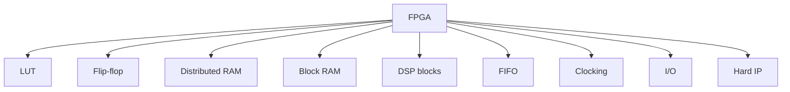
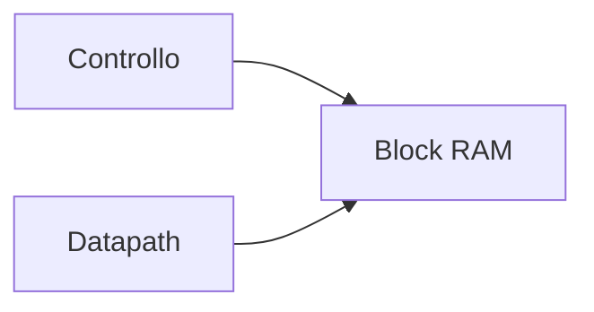
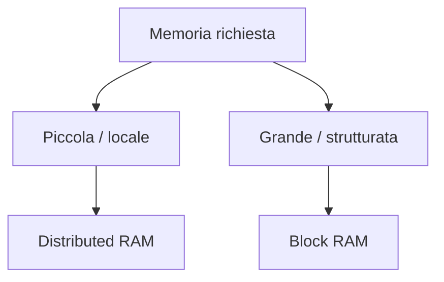
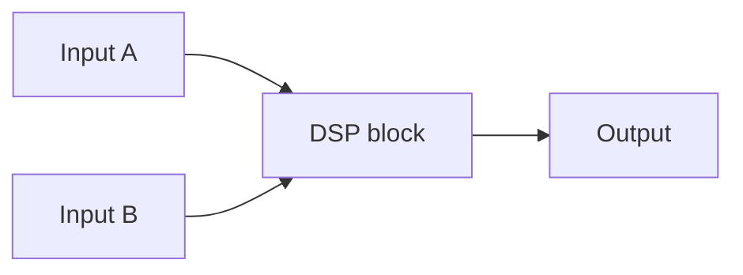

# Risorse dedicate in una FPGA

Una delle differenze più importanti tra progettare **in astratto** e progettare **su FPGA** è che il dispositivo non offre soltanto logica generica, ma un insieme di **risorse dedicate** con caratteristiche molto diverse tra loro.

Per ottenere un progetto efficiente, il progettista deve capire:

- quali risorse esistono;
- a che cosa servono;
- quando è opportuno usarle;
- quali effetti hanno su timing, area e consumo;
- come la RTL può favorirne l'inferenza corretta.

In questa pagina analizziamo le principali risorse di una FPGA e il loro ruolo pratico nella progettazione.

---

## 1. Perché le risorse dedicate sono così importanti

Una FPGA moderna contiene più tipi di risorse, ciascuna pensata per una classe di funzioni specifiche.

Se il progettista usa la risorsa giusta per il compito giusto, ottiene spesso:

- migliore timing;
- minore uso di logica generica;
- minore congestione;
- migliore efficienza energetica;
- progetto più scalabile.

Se invece usa male le risorse del dispositivo, il progetto può diventare:

- più lento;
- più grande;
- più difficile da implementare;
- meno robusto in timing;
- meno adatto alla board scelta.

Per questo, la conoscenza delle risorse dedicate è una parte centrale della cultura FPGA.

---

## 2. Le principali famiglie di risorse

Le famiglie di risorse più importanti in una FPGA sono tipicamente:

- **LUT**
- **flip-flop**
- **distributed RAM**
- **block RAM**
- **DSP blocks**
- **FIFO**
- **clocking resources**
- **I/O resources**
- eventuali **hard IP** o blocchi specializzati

Non tutte le FPGA offrono le stesse quantità o varianti di queste risorse, ma il quadro concettuale generale resta molto simile.

---

## 3. LUT

Le **LUT** (*Look-Up Table*) sono la risorsa base per implementare logica combinatoria.

## 3.1 A cosa servono

Le LUT vengono usate per:

- funzioni booleane;
- selezione;
- decoder;
- logica di controllo;
- parte del datapath;
- piccole tabelle locali.

## 3.2 Quando sono la scelta naturale

Sono ideali quando serve:

- logica combinatoria locale;
- flessibilità;
- controllo fine del comportamento;
- piccole trasformazioni logiche.

## 3.3 Limiti

Usare troppe LUT per implementare funzioni che potrebbero stare in risorse dedicate può causare:

- maggiore uso di area logica;
- peggior timing;
- routing più pesante;
- minore efficienza del design.

Le LUT sono preziose, ma non devono diventare la risposta automatica a ogni problema.

---

## 4. Flip-flop

I **flip-flop** sono la risorsa base per la logica sequenziale.

## 4.1 A cosa servono

Vengono usati per:

- registri dati;
- pipeline;
- FSM;
- sincronizzatori;
- segnali di validità;
- buffering temporale.

## 4.2 Perché sono cruciali

In FPGA il timing si migliora spesso aggiungendo registri e pipeline.  
Per questo i flip-flop sono una risorsa strategica, non solo accessoria.

## 4.3 Attenzione

Anche se spesso sono numerosi nel dispositivo, un uso eccessivo o disordinato può:

- aumentare il carico del clock;
- incrementare il consumo dinamico;
- complicare reset e controllo;
- rendere il design più difficile da leggere.

---

## 5. LUT + FF come coppia fondamentale

In molti casi, LUT e flip-flop lavorano insieme come unità naturale per costruire:

- logica combinatoria registrata;
- stadi di pipeline;
- piccoli blocchi di controllo;
- FSM.

Questa combinazione è uno dei mattoni più comuni in qualsiasi implementazione FPGA.

---

## 6. Distributed RAM

La **distributed RAM** usa parte della logica configurabile del dispositivo per implementare memorie piccole e locali.

## 6.1 Quando è utile

È utile per:

- piccole tabelle;
- buffer locali;
- code molto contenute;
- strutture che devono stare vicino alla logica che le usa;
- storage distribuito nel datapath.

## 6.2 Vantaggi

- grande flessibilità;
- vicinanza alla logica;
- utile per memorie piccole;
- può evitare l'uso di una BRAM intera per contenuti minimi.

## 6.3 Limiti

- usa LUT che potrebbero servire per altra logica;
- non scala bene per memorie grandi;
- può diventare meno efficiente di BRAM su capacità elevate.

La distributed RAM è quindi molto utile, ma soprattutto per memorie di piccola taglia.

---

## 7. Block RAM

Le **Block RAM (BRAM)** sono blocchi di memoria dedicati presenti nella FPGA.

## 7.1 A cosa servono

Sono ideali per:

- buffer dati;
- memorie locali;
- FIFO;
- tabelle più grandi;
- storage di frame o blocchi;
- piccoli spazi di programma o configurazione;
- cache o scratchpad, in sistemi più articolati.

## 7.2 Perché sono così importanti

Permettono di implementare memorie in modo molto più efficiente rispetto alla sola logica LUT+FF.

## 7.3 Quando conviene usarle

Quando serve:

- capacità significativa;
- accesso regolare;
- buffering dedicato;
- minore consumo di LUT.

## 7.4 Limiti

- numero finito nel dispositivo;
- granularità fissa o semi-fissa;
- posizione fisica dedicata nella FPGA;
- possibile impatto sul placement.

Per questo vanno usate con criterio.

---

## 8. Distributed RAM vs BRAM

Una decisione ricorrente nel design FPGA è scegliere tra **distributed RAM** e **BRAM**.

### Distributed RAM

Meglio per:

- memorie piccole;
- strutture distribuite;
- forte località con la logica.

### BRAM

Meglio per:

- memorie più grandi;
- buffer strutturati;
- uso intensivo di storage;
- design più ordinati dal punto di vista delle risorse.

La scelta giusta dipende dal progetto, ma questa distinzione è un buon punto di partenza.

---

## 9. DSP blocks

I **DSP blocks** sono risorse dedicate alle operazioni aritmetiche e numeriche.

## 9.1 A cosa servono

Sono molto adatti per:

- moltiplicazioni;
- somme accumulate;
- filtri;
- convoluzioni;
- operazioni vettoriali;
- elaborazione numerica ad alte prestazioni.

## 9.2 Perché usarli

Usare un DSP block è spesso migliore che implementare la stessa funzione con sola logica LUT, perché può offrire:

- minore uso di LUT;
- migliore timing;
- consumo più efficiente;
- percorso aritmetico più naturale.

## 9.3 Attenzione pratica

Non tutte le operazioni aritmetiche vengono automaticamente inferite nel modo desiderato.  
Per questo è importante leggere i report di sintesi e verificare l'uso effettivo dei DSP.

---

## 10. Quando usare i DSP

I DSP sono particolarmente indicati quando il progetto include:

- moltiplicazioni frequenti;
- filtri digitali;
- MAC ripetuti;
- elaborazione streaming;
- acceleratori numerici;
- trasformazioni vettoriali.

In questi casi, ignorare i DSP e usare solo LUT può produrre design:

- più lenti;
- più grandi;
- meno efficienti.

---

## 11. FIFO

Le **FIFO** sono strutture di buffering molto importanti in FPGA, spesso implementate usando:

- BRAM;
- logica di controllo;
- talvolta risorse dedicate o generatori del vendor.

## 11.1 A cosa servono

Sono molto utili per:

- disaccoppiare produttore e consumatore;
- assorbire differenze di latenza;
- gestire streaming di dati;
- organizzare il trasferimento tra sottoblocchi;
- supportare crossing tra clock domain, se progettate per questo.

## 11.2 Perché sono naturali su FPGA

Molti progetti FPGA sono fortemente orientati a flussi di dati.  
Le FIFO diventano quindi una risorsa concettuale quasi inevitabile nei design non banali.

---

## 12. Clocking resources

Le FPGA includono risorse dedicate al **clocking**, che non vanno confuse con il routing generico.

## 12.1 Risorse tipiche

A livello concettuale, possono includere:

- reti globali di clock;
- PLL;
- MMCM o strutture equivalenti;
- buffer globali di clock;
- risorse regionali di distribuzione.

## 12.2 Perché sono speciali

Il clock deve raggiungere molti registri con:

- skew controllato;
- distribuzione robusta;
- compatibilità con il timing;
- comportamento stabile.

Per questo il clock non deve essere costruito "artigianalmente" in logica generale: va appoggiato alle risorse di clocking del dispositivo.

---

## 13. Clock enable come risorsa concettuale

In FPGA, oltre al clock stesso, è spesso molto importante usare correttamente il **clock enable**.

## 13.1 Perché

Permette di:

- abilitare o fermare aggiornamenti di registri;
- ridurre attività inutile;
- evitare la creazione impropria di clock derivati in logica;
- mantenere il progetto più compatibile con l'architettura del dispositivo.

## 13.2 Quando è utile

- pipeline che avanzano solo in certe condizioni;
- sottoblocchi inattivi;
- controller con fasi ben definite;
- interfacce con eventi sporadici.

In questo senso, il clock enable è una risorsa concettuale molto importante anche se non è sempre visto come "macro" separata.

---

## 14. I/O resources

Le FPGA contengono blocchi dedicati all'interfaccia con il mondo esterno.

## 14.1 A cosa servono

Gestiscono:

- ingressi;
- uscite;
- collegamento con periferiche;
- interfacce verso la board;
- standard elettrici compatibili.

## 14.2 Perché contano

Le I/O resources influenzano direttamente:

- pin assignment;
- timing di input e output;
- compatibilità con la scheda;
- scelta degli standard I/O;
- integrazione con dispositivi esterni.

La progettazione FPGA è sempre anche, in parte, progettazione di sistema fisico e non solo di logica interna.

---

## 15. Hard IP e blocchi specializzati

Molte FPGA moderne includono blocchi **hard** o **specializzati**, ad esempio:

- controller memoria;
- transceiver;
- interfacce ad alta velocità;
- processori integrati;
- sottosistemi di comunicazione.

## 15.1 Perché sono rilevanti

Permettono di realizzare sistemi molto più complessi e prestazionali rispetto a quanto sarebbe conveniente costruire solo con logica soft.

## 15.2 Ruolo progettuale

Questi blocchi ampliano molto il ruolo della FPGA, rendendola utile non solo per logica custom ma anche per:

- prototipazione SoC;
- sistemi embedded completi;
- piattaforme ibride hardware/software.

---

## 16. Geografia fisica delle risorse

Le risorse della FPGA non sono distribuite in modo arbitrario.  
Esistono zone e colonne dedicate a:

- BRAM;
- DSP;
- logica configurabile;
- clocking;
- I/O.

Questo ha conseguenze importanti:

- il placement conta;
- il routing conta;
- la località dei dati conta;
- il mapping delle funzioni sul tipo di risorsa giusto conta.

Un progetto efficiente è quindi anche un progetto che rispetta la geografia reale del dispositivo.

---

## 17. Risorse e timing

Le scelte sulle risorse influenzano direttamente il timing.

### Esempi

- usare un DSP può migliorare un percorso aritmetico;
- una BRAM può ridurre la complessità di una memoria sparsa;
- troppa logica LUT aumenta il routing e può peggiorare i path critici;
- un uso eccessivo di flip-flop aumenta il carico del clock;
- la posizione delle risorse nel dispositivo incide sulle distanze.

Per questo l'uso corretto delle risorse è anche una forma di ottimizzazione temporale.

---

## 18. Risorse e consumo

Anche il consumo dipende fortemente dal tipo di risorsa usata.

### Esempi

- una DSP può essere più efficiente di un datapath equivalente in LUT;
- una BRAM può essere migliore di molti registri sparsi;
- tanto routing attivo può aumentare il consumo;
- l'uso del clock su molti registri ha un costo.

Questa relazione è importante soprattutto nei progetti FPGA più grandi o orientati a sistemi embedded reali.

---

## 19. Risorse e RTL

La RTL non assegna sempre in modo esplicito una risorsa, ma può favorirne l'inferenza.

Per questo il progettista deve scrivere codice che aiuti il tool a capire correttamente:

- quando serve una BRAM;
- quando serve una distributed RAM;
- quando una moltiplicazione deve andare su DSP;
- quando una struttura deve restare in LUT e FF.

Questa è una delle competenze più pratiche e importanti nel design FPGA.

---

## 20. Leggere i report per capire le risorse

Dopo la sintesi, è fondamentale controllare i report di utilizzo risorse.

Bisogna chiedersi almeno:

- quante LUT sto usando?
- quanti flip-flop?
- quante BRAM?
- quanti DSP?
- ho usato la risorsa che mi aspettavo?
- il progetto è bilanciato o sta saturando una sola categoria?

I report sono il modo più concreto per verificare se la progettazione RTL stia davvero rispettando l'architettura del dispositivo.

---

## 21. Errori frequenti nell'uso delle risorse

Tra gli errori più comuni:

- usare LUT dove servirebbe una BRAM;
- implementare moltiplicazioni in logica generica invece che in DSP;
- sprecare BRAM per memorie minime;
- ignorare il costo del clock su molti registri;
- non considerare il posizionamento fisico delle risorse;
- non verificare i report di sintesi;
- scrivere RTL senza alcuna consapevolezza del tipo di risorsa target.

---

## 22. Buone pratiche concettuali

Una buona gestione delle risorse FPGA segue alcuni principi chiave:

- conoscere le principali categorie di risorse;
- usare LUT per la logica combinatoria, non per tutto;
- usare BRAM e DSP quando il problema lo richiede;
- trattare clocking e I/O come parti fondamentali dell'architettura;
- leggere sempre i report di utilizzo;
- collegare la scrittura RTL all'effetto reale sul dispositivo.

---

## 23. Collegamento con ASIC

Nel mondo ASIC molte di queste funzioni vengono implementate tramite:

- standard cells;
- memorie dedicate;
- macro;
- blocchi custom.

Nel mondo FPGA, invece, il progettista deve appoggiarsi alle risorse già presenti nel dispositivo.

Studiare le risorse dedicate FPGA aiuta a capire una differenza fondamentale tra FPGA e ASIC:

- l'ASIC costruisce il chip per il progetto;
- la FPGA costringe il progetto ad adattarsi a un tessuto programmabile esistente.

---

## 24. Collegamento con SoC

Nel contesto SoC, le risorse dedicate FPGA sono fondamentali per prototipare:

- memorie locali;
- acceleratori numerici;
- interconnect;
- sottosistemi streaming;
- piattaforme con softcore;
- sistemi embedded completi.

Capire bene le risorse del dispositivo permette di costruire prototipi SoC più credibili e più vicini al comportamento del sistema reale.

---

## 25. Esempio concettuale

Immaginiamo un piccolo acceleratore che deve:

- memorizzare un blocco di dati;
- eseguire moltiplicazioni e accumuli;
- gestire il flusso con una FSM;
- comunicare con una periferica esterna.

Una buona scelta delle risorse potrebbe essere:

- BRAM per il buffer;
- DSP per moltiplicazioni e accumuli;
- LUT per la logica di controllo;
- flip-flop per pipeline e stato;
- FIFO se serve disaccoppiare producer e consumer.

Se invece tutto venisse implementato con sola logica generica, il progetto rischierebbe di essere:

- più grande;
- più lento;
- più difficile da chiudere timing.

Questo esempio mostra bene che la qualità del progetto FPGA dipende fortemente dalla scelta corretta delle risorse.

---

## 26. In sintesi

Le risorse dedicate di una FPGA sono uno degli elementi centrali della progettazione su dispositivo programmabile.

Le principali categorie da comprendere sono:

- LUT;
- flip-flop;
- distributed RAM;
- block RAM;
- DSP blocks;
- FIFO;
- clocking resources;
- I/O resources;
- hard IP.

Usare correttamente queste risorse significa:

- migliorare timing;
- usare meglio il dispositivo;
- ridurre lo spreco di logica;
- ottenere design più robusti e scalabili;
- rendere la RTL più coerente con l'hardware reale.

---

## Prossimo passo

Dopo aver chiarito le risorse dedicate del dispositivo, il passo naturale successivo è approfondire il tema di **clocking e reset**, cioè il modo in cui una FPGA gestisce il tempo, la sincronizzazione e l'inizializzazione del progetto in hardware reale.
