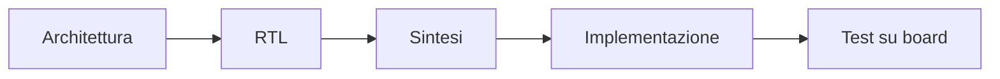
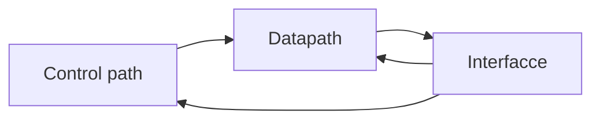
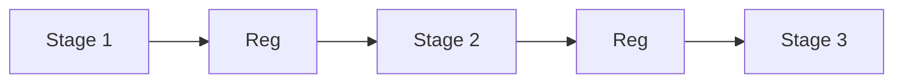

# RTL design per FPGA

La fase di **RTL design** è il momento in cui l'architettura del progetto viene tradotta in una descrizione hardware sintetizzabile adatta al dispositivo FPGA scelto.  
Nel contesto FPGA, scrivere RTL non significa soltanto descrivere un comportamento corretto in simulazione: significa anche costruire una rappresentazione che il flow di sintesi e implementazione possa mappare in modo efficace su:

- LUT;
- flip-flop;
- block RAM;
- DSP;
- clocking resources;
- rete di routing del dispositivo.

Per questo motivo, una buona RTL per FPGA deve essere progettata con attenzione a:

- correttezza funzionale;
- sintetizzabilità;
- chiarezza strutturale;
- uso efficiente delle risorse;
- timing closure;
- relazione con la board e con il contesto reale di utilizzo.

---

## 1. Il ruolo dell'RTL nel flow FPGA

Nel flow FPGA, l'RTL è il ponte tra:

- la specifica e l'architettura del progetto;
- la realizzazione concreta sul dispositivo programmabile.

Dal punto di vista del flow, la qualità della RTL influenza direttamente:

- la qualità della sintesi;
- il tipo di risorse usate;
- il timing;
- la facilità di implementazione;
- la possibilità di fare debug;
- l'efficienza complessiva del progetto.

Una RTL debole può compromettere il progetto anche quando la funzione logica, in teoria, è corretta.

---

## 2. Obiettivi della progettazione RTL su FPGA

Una buona RTL per FPGA dovrebbe soddisfare più obiettivi contemporaneamente.

## 2.1 Correttezza funzionale

Il comportamento del circuito deve essere conforme alla specifica.

## 2.2 Sintetizzabilità

Il codice deve poter essere trasformato correttamente in hardware dal tool di sintesi.

## 2.3 Mappabilità efficace

La descrizione dovrebbe favorire un buon uso delle risorse del dispositivo:

- LUT;
- flip-flop;
- BRAM;
- DSP.

## 2.4 Chiarezza

Una struttura leggibile aiuta verifica, manutenzione e debug.

## 2.5 Timing awareness

Il codice deve essere compatibile con la frequenza target e con il costo del routing nella FPGA.

## 2.6 Debuggabilità

La struttura del progetto deve favorire l'osservazione e l'analisi del comportamento sulla board.

---

## 3. Pensare in termini di hardware reale

Uno degli errori più comuni è leggere l'HDL come se fosse software.  
In realtà, una descrizione RTL rappresenta:

- logica combinatoria;
- registri;
- percorsi dati;
- stato sequenziale;
- interconnessioni.

Per questo il progettista deve sempre chiedersi:

- che hardware sto descrivendo?
- dove finiranno questi dati?
- quanti registri sto introducendo?
- questa struttura usa bene le risorse della FPGA?
- il timing sarà ragionevole?

La qualità della RTL nasce proprio da questa consapevolezza.

---

## 4. Struttura modulare

Come in ASIC, anche in FPGA la modularità è molto importante.

## 4.1 Perché modularizzare

La modularità aiuta a:

- separare responsabilità;
- migliorare leggibilità;
- facilitare simulazione e debug;
- favorire riuso;
- rendere più chiara la gerarchia del design.

## 4.2 Criteri di buona modularità

Una buona partizione dovrebbe riflettere:

- funzioni architetturali reali;
- interfacce semplici;
- complessità locale contenuta;
- relazione chiara tra sottoblocchi.

## 4.3 Errori tipici

### Moduli troppo grandi

Possono diventare:

- difficili da verificare;
- difficili da debuggare;
- poco leggibili.

### Moduli troppo frammentati

Possono generare:

- interfacce inutilmente numerose;
- maggiore complessità di integrazione;
- codice più disperso.

---

## 5. Interfacce RTL

Un modulo FPGA ben progettato deve avere interfacce chiare.

Elementi da definire bene:

- clock;
- reset;
- validità dei dati;
- handshake;
- segnali di start/stop;
- segnali di configurazione;
- segnali di stato.

### Buone pratiche

- nomi coerenti;
- distinzione tra data path e control path;
- segnali raggruppati logicamente;
- semantica chiara di ogni ingresso e uscita.

Interfacce poco chiare rendono più difficile sia la verifica sia il test su scheda.

---

## 6. Separare combinatorio e sequenziale

Una buona RTL per FPGA beneficia molto di una separazione concettuale chiara tra:

- logica combinatoria;
- logica sequenziale.

Questo aiuta a:

- capire la struttura dell'hardware;
- evitare ambiguità;
- semplificare il timing;
- rendere più leggibile il design.

In particolare, è importante evitare descrizioni poco disciplinate che portino a:

- latch involontari;
- percorsi poco trasparenti;
- dipendenze difficili da verificare.

---

## 7. Datapath e controllo

Molti progetti FPGA possono essere letti come combinazione di:

- **datapath**;
- **control path**.

## 7.1 Datapath

Contiene:

- registri dati;
- operatori;
- pipeline;
- selettori;
- buffering.

## 7.2 Control path

Contiene:

- FSM;
- enable;
- segnali di validità;
- gestione degli stati;
- orchestrazione del trasferimento dati.

Questa separazione è molto utile in FPGA perché migliora leggibilità, debug e timing analysis.

---

## 8. FSM su FPGA

Le **Finite State Machines** sono molto comuni nei progetti FPGA.

Servono per:

- controllo di protocolli;
- sequenziamento;
- gestione di periferiche;
- orchestrazione di buffer e pipeline;
- controllo di start, busy, done, error.

## 8.1 Caratteristiche desiderabili

Una FSM ben progettata dovrebbe avere:

- stati chiaramente definiti;
- transizioni leggibili;
- comportamento di reset ben chiaro;
- segnali di uscita comprensibili;
- complessità controllata.

## 8.2 Errori frequenti

- stati ambigui;
- logica di next-state troppo complicata;
- uscite dipendenti da troppe condizioni sparse;
- reset incoerente;
- scarsa leggibilità.

Le FSM sono spesso un buon indicatore della maturità della RTL del progetto.

---

## 9. Pipeline e prestazioni

Su FPGA, la **pipeline** è una delle tecniche più importanti per migliorare il timing.

## 9.1 Perché serve

Il routing programmabile e la struttura interna del dispositivo possono rendere costosi i percorsi combinatori lunghi.  
Aggiungere registri di pipeline aiuta a:

- ridurre la profondità combinatoria per ciclo;
- aumentare la frequenza raggiungibile;
- migliorare la stabilità del timing;
- distribuire meglio il lavoro del datapath.

## 9.2 Effetti collaterali

La pipeline introduce anche:

- più registri;
- maggiore latenza in cicli;
- maggiore consumo dinamico del clock;
- maggiore complessità di controllo.

Su FPGA, il compromesso tra pipeline e complessità è spesso decisivo per il successo del progetto.

---

## 10. Inferenza delle risorse

Uno degli aspetti più caratteristici del design FPGA è la necessità di **scrivere RTL che favorisca l'inferenza corretta delle risorse del dispositivo**.

## 10.1 Cosa significa inferenza

Significa permettere al tool di riconoscere, a partire dalla descrizione RTL, che una certa struttura deve essere implementata come:

- registri;
- BRAM;
- distributed RAM;
- DSP;
- FIFO;
- altre strutture dedicate, se supportate.

## 10.2 Perché è importante

Una funzione che il progettista immaginava su DSP potrebbe finire su LUT.  
Una memoria che si voleva in BRAM potrebbe essere implementata in modo inefficiente in logica distribuita.

Per questo la scrittura della RTL deve essere coerente con il tipo di risorsa desiderata.

---

## 11. RTL per memorie

Le memorie meritano un'attenzione specifica in FPGA.

La RTL dovrebbe chiarire:

- se serve una memoria piccola o grande;
- se serve accesso sincrono;
- quante porte servono;
- come avvengono letture e scritture;
- quali sono i casi di inizializzazione o reset.

### Perché conta

La struttura della descrizione RTL influisce sul fatto che il tool scelga:

- LUT come distributed RAM;
- BRAM dedicate;
- registri sparsi, nei casi peggiori.

Una buona progettazione FPGA richiede quindi molta attenzione alla forma della memoria descritta.

---

## 12. RTL per DSP e operatori aritmetici

Anche le operazioni aritmetiche devono essere pensate in relazione alle risorse del dispositivo.

### Esempi rilevanti

- moltiplicazioni;
- somme accumulate;
- filtri;
- operazioni vettoriali;
- elaborazioni streaming.

Scrivere una RTL chiara e coerente può favorire il mapping del calcolo su DSP blocks invece che su sola logica generica.

### Perché è importante

Questo può migliorare:

- prestazioni;
- uso dell'area logica;
- consumo;
- timing closure.

---

## 13. Reset su FPGA

Il reset è un tema molto importante nella progettazione RTL su FPGA.

## 13.1 Cosa definire chiaramente

- quali registri devono essere resettati;
- quali possono essere lasciati inizializzare diversamente;
- comportamento del circuito all'avvio;
- sequenza di uscita dal reset;
- relazione con i clock.

## 13.2 Perché è delicato

Un reset eccessivamente invasivo può:

- appesantire il design;
- peggiorare il timing;
- complicare il routing;
- aumentare il fanout.

Un reset poco chiaro può invece rendere il comportamento iniziale instabile o difficile da debuggare.

Su FPGA, il reset va trattato con disciplina e consapevolezza del dispositivo reale.

---

## 14. Clock e clock enable

In FPGA, il clock deve essere gestito con particolare attenzione.

## 14.1 Regola concettuale importante

Il clock non dovrebbe essere trattato come un normale segnale dati.

## 14.2 Clock enable

Molto spesso, invece di creare clock "artigianali" in logica, è preferibile usare:

- clock puliti e distribuiti correttamente;
- enable per controllare l'attività dei registri.

### Perché

Questo aiuta a:

- rispettare l'architettura della FPGA;
- ridurre problemi di timing;
- usare meglio le risorse di clocking;
- rendere il design più robusto.

La relazione tra clock, enable e reset è una delle aree più delicate della RTL FPGA.

---

## 15. Clock domain crossing

Se il progetto usa più clock domain, la RTL deve affrontare correttamente i **crossing**.

Questo richiede:

- consapevolezza dei domini presenti;
- sincronizzazione di segnali di controllo;
- uso corretto di FIFO o strutture equivalenti per dati, dove necessario;
- evitare assunzioni implicite di simultaneità tra clock diversi.

Su FPGA, ignorare il CDC porta facilmente a bug difficili da riprodurre e da capire sulla board reale.

---

## 16. Timing-aware RTL

Una buona RTL FPGA deve essere scritta con consapevolezza del timing.

### Aspetti da considerare

- profondità combinatoria;
- fanout;
- località del datapath;
- uso di pipeline;
- controllo dei path critici;
- costo del routing.

Una RTL che funziona perfettamente in simulazione ma ignora il timing può risultare inutilizzabile in implementazione reale.

---

## 17. Evitare costrutti problematici

Anche in FPGA conviene evitare costrutti RTL che possano causare:

- inferenza inattesa di latch;
- logica troppo annidata;
- percorsi lunghi e opachi;
- uso inefficiente delle risorse;
- comportamenti poco leggibili in sintesi.

La regola generale è che il codice dovrebbe descrivere in modo esplicito l'hardware desiderato, non affidarsi a interpretazioni ambigue.

---

## 18. Parametrizzazione

La parametrizzazione può essere molto utile in FPGA, soprattutto per:

- larghezza dei dati;
- numero di stadi;
- profondità di buffer;
- configurazioni di sottoblocchi;
- sperimentazione architetturale.

### Vantaggi

- riuso;
- scalabilità;
- possibilità di adattare il progetto a dispositivi diversi;
- comparazione rapida di varianti.

### Rischi

- aumento della complessità di verifica;
- configurazioni poco testate;
- minore leggibilità del codice.

La parametrizzazione va quindi usata con equilibrio.

---

## 19. RTL e debug

Una RTL progettata bene aiuta molto anche il debug su FPGA.

Elementi utili:

- gerarchia chiara;
- segnali di stato ben nominati;
- separazione tra datapath e controllo;
- interfacce leggibili;
- punti naturali in cui inserire sonde di debug o logic analyzer interni.

Una buona struttura RTL rende più semplice:

- capire i bug su board;
- tracciare gli eventi;
- costruire trigger;
- correlare comportamento simulato e comportamento reale.

---

## 20. RTL e board-level behavior

Su FPGA, il design interagisce spesso direttamente con una scheda reale.

Questo significa che la RTL deve essere progettata tenendo conto anche di aspetti come:

- latenza di interfacce esterne;
- pulsanti e ingressi meccanici;
- segnali asincroni dalla board;
- reset esterni;
- clock reali disponibili;
- segnali di debug.

Questo è uno dei punti che distingue molto la progettazione FPGA dalla progettazione puramente astratta di logica digitale.

---

## 21. Errori frequenti nella RTL FPGA

Tra gli errori più comuni:

- scrivere HDL pensando solo alla simulazione;
- ignorare il tipo di risorsa che si vuole inferire;
- fare troppo affidamento su logica combinatoria lunga;
- usare reset senza criterio;
- creare clock impropri in logica;
- trascurare il CDC;
- non pensare al comportamento reale sulla board;
- costruire moduli poco leggibili o poco debuggabili.

---

## 22. Buone pratiche concettuali

Una buona RTL per FPGA tende a seguire questi principi:

- descrivere hardware in modo chiaro;
- separare controllo e datapath;
- favorire l'inferenza corretta delle risorse;
- usare pipeline quando servono;
- trattare clock e reset con disciplina;
- scrivere codice timing-aware;
- pensare fin dall'inizio a verifica e debug;
- ricordare che il progetto finirà su hardware reale, non solo in simulazione.

---

## 23. Collegamento con ASIC

Molte buone pratiche RTL sono comuni a FPGA e ASIC:

- modularità;
- chiarezza;
- timing awareness;
- gestione di reset e clock;
- separazione tra combinatorio e sequenziale.

Tuttavia, in FPGA la RTL deve anche tener conto con particolare attenzione di:

- inferenza delle risorse del dispositivo;
- rete di routing programmabile;
- board-level integration;
- iterazione rapida su hardware reale.

Studiare la RTL FPGA aiuta quindi anche a sviluppare disciplina progettuale utile in ASIC, pur in un contesto tecnologico diverso.

---

## 24. Collegamento con SoC

Nel contesto SoC, la FPGA è spesso usata per prototipare:

- acceleratori;
- bus e interconnect;
- periferiche;
- sistemi con CPU softcore;
- co-design hardware/software.

Una buona RTL per FPGA permette quindi non solo di implementare un blocco, ma anche di costruire una piattaforma di sperimentazione per concetti di livello SoC.

---

## 25. Esempio concettuale

Immaginiamo di voler realizzare su FPGA un piccolo acceleratore che:

- riceve dati via streaming;
- esegue una moltiplicazione e una somma;
- usa un buffer locale;
- segnala `done` al termine del blocco.

Una buona RTL potrebbe usare:

- FSM per il controllo;
- pipeline per il datapath;
- DSP per la moltiplicazione;
- BRAM per il buffer;
- registri ben organizzati per lo stato.

Una cattiva RTL potrebbe invece:

- mettere troppa logica in un solo ciclo;
- usare male il reset;
- non inferire correttamente il DSP;
- rendere difficile timing e debug.

Questo esempio mostra bene il valore pratico della disciplina RTL su FPGA.

---

## 26. In sintesi

La progettazione RTL per FPGA è una fase centrale del flow, perché trasforma l'architettura in una descrizione sintetizzabile e implementabile sul dispositivo reale.

Una buona RTL FPGA dovrebbe essere:

- corretta funzionalmente;
- leggibile;
- modulare;
- timing-aware;
- coerente con reset e clock;
- adatta all'inferenza delle risorse del dispositivo;
- facile da verificare e debuggare.

In FPGA, scrivere bene la RTL significa aumentare drasticamente la probabilità che il progetto funzioni davvero su scheda reale.

---

## Prossimo passo

Dopo l'RTL design, il passo successivo naturale è approfondire il tema di **vincoli e timing**, cioè il modo in cui il progetto viene guidato rispetto ai clock, agli I/O e agli obiettivi temporali che il dispositivo FPGA dovrà soddisfare.
