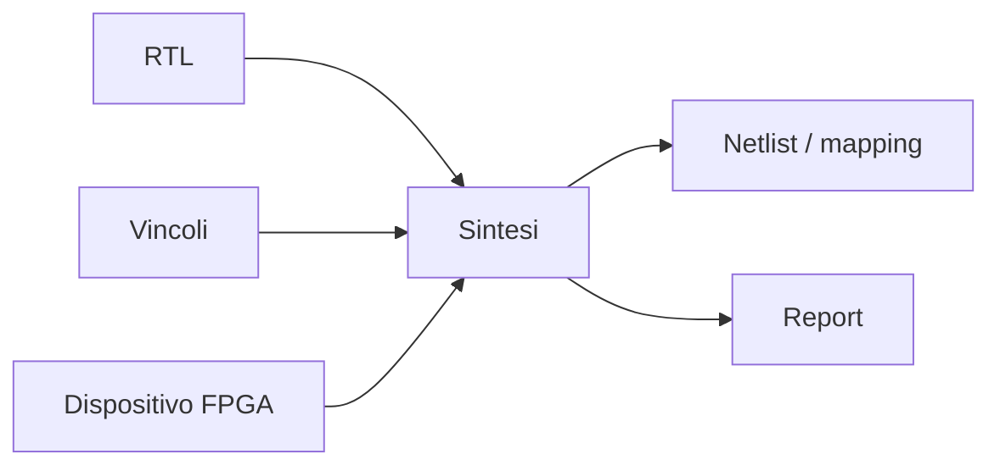
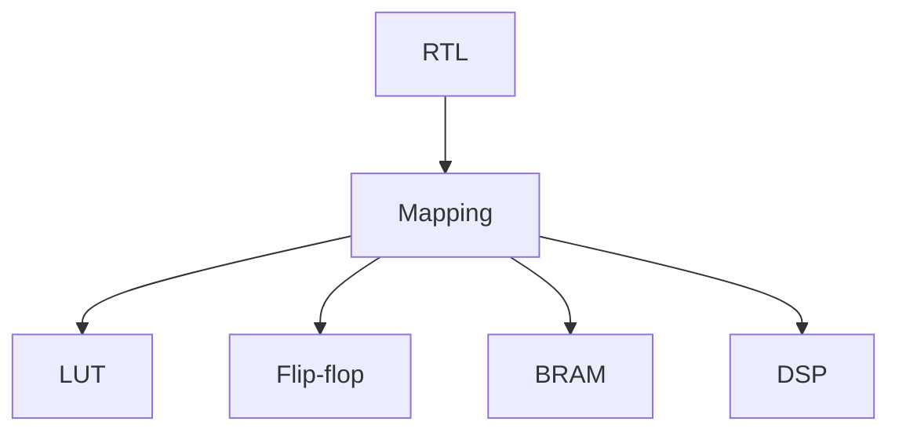
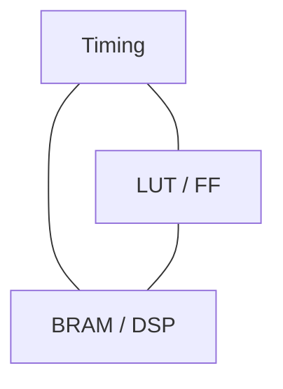

# Sintesi logica in un progetto FPGA

La **sintesi logica** è la fase del flow FPGA in cui la descrizione **RTL** del progetto viene trasformata in una rappresentazione logica mappata sulle risorse del dispositivo programmabile.  
È il momento in cui il design smette di essere solo una struttura descritta in HDL e inizia a essere interpretato in termini di:

- LUT;
- flip-flop;
- block RAM;
- distributed RAM;
- DSP blocks;
- altre risorse specifiche della FPGA.

Nel flow FPGA, la sintesi è una fase decisiva perché rende visibile:

- come il tool ha interpretato la RTL;
- quali risorse verranno usate;
- quali parti del progetto sono più costose;
- quali percorsi possono diventare critici;
- se l'architettura è coerente con il dispositivo scelto.

Per questo, la sintesi non è soltanto una compilazione del codice: è uno strumento di analisi e di feedback sul progetto.

---

## 1. Che cos'è la sintesi FPGA

La sintesi FPGA è il processo con cui un tool prende in ingresso:

- il codice RTL;
- i vincoli;
- le informazioni sul dispositivo target;

e produce in uscita una rappresentazione logica che usa le primitive e le risorse della FPGA scelta.

Il risultato non è ancora l'implementazione fisica finale sul chip, ma è già una descrizione molto più concreta e vicina all'hardware reale.

---

## 2. Perché la sintesi è importante

La sintesi è importante perché permette di rispondere a domande fondamentali:

- il tool ha capito correttamente la mia RTL?
- una memoria è stata inferita come BRAM o come logica sparsa?
- una moltiplicazione è finita in DSP o in LUT?
- quante LUT e flip-flop sto usando?
- il progetto è compatibile con la FPGA scelta?
- la struttura della RTL è coerente con la frequenza target?

In pratica, la sintesi è il primo momento in cui il progetto incontra davvero il dispositivo.

---

## 3. Input della sintesi

Per eseguire una sintesi coerente servono alcuni input fondamentali.

## 3.1 RTL

È la descrizione hardware del progetto a livello register-transfer.

## 3.2 Vincoli

I vincoli forniscono contesto, in particolare per:

- clock;
- timing;
- interpretazione delle relazioni principali del design.

Anche se molte informazioni diventeranno ancora più importanti nelle fasi successive, la sintesi ha già bisogno di una base corretta.

## 3.3 Dispositivo target

La sintesi deve sapere:

- quale FPGA si sta usando;
- quali risorse contiene;
- quali primitive e blocchi dedicati sono disponibili.

## 3.4 Opzioni del flow

Comprendono:

- strategie di ottimizzazione;
- modalità di sintesi;
- preferenze su area o timing;
- eventuali opzioni specifiche del vendor.

---

## 4. Output della sintesi

La sintesi produce diversi artefatti utili.

## 4.1 Netlist o rappresentazione logica

È la descrizione del progetto come rete di elementi mappati sul mondo logico della FPGA.

## 4.2 Report di utilizzo risorse

Indicano quante risorse del dispositivo sono state usate.

## 4.3 Report di timing preliminari

Permettono una prima analisi dei percorsi critici e dei margini.

## 4.4 Messaggi di inferenza

Aiutano a capire se strutture come:

- memorie;
- DSP;
- FIFO;
- clocking logic;

siano state riconosciute nel modo desiderato.

Questi output sono fondamentali per capire se la sintesi stia traducendo il progetto nella forma attesa.

---

## 5. Mapping sulle risorse della FPGA

Uno dei concetti centrali della sintesi FPGA è il **mapping** della RTL sulle risorse del dispositivo.

## 5.1 Esempi tipici

- logica combinatoria → LUT;
- registri → flip-flop;
- piccole memorie → distributed RAM o registri;
- memorie più grandi → BRAM;
- moltiplicazioni o MAC → DSP blocks.

## 5.2 Perché questo è così importante

La qualità del risultato dipende molto dal fatto che il tool riesca a usare la risorsa più adatta per ciascuna funzione.

Una sintesi tecnicamente valida ma che usa male le risorse della FPGA può produrre un design molto inefficiente.

---

## 6. Sintesi e LUT

Una parte importante della logica FPGA viene implementata tramite **LUT**.

## 6.1 Quando si usano

Le LUT vengono usate soprattutto per:

- logica combinatoria;
- selezione;
- decoder;
- espressioni booleane;
- piccole funzioni di controllo.

## 6.2 Perché monitorarle

Un uso eccessivo di LUT può segnalare:

- logica troppo complessa;
- mancata inferenza di risorse dedicate;
- controllo poco efficiente;
- datapath implementata in modo non ottimale.

Per questo il report sulle LUT è uno dei primi indicatori di qualità della sintesi.

---

## 7. Sintesi e flip-flop

I **flip-flop** rappresentano lo stato sequenziale del progetto.

Essi vengono usati per:

- pipeline;
- FSM;
- registri dati;
- buffering;
- sincronizzatori;
- segnali di validità e controllo.

## 7.1 Perché monitorarli

Un elevato numero di flip-flop può essere giustificato da:

- pipeline profonde;
- forte parallelismo;
- buffering ordinato.

Tuttavia può anche indicare:

- struttura troppo pesante;
- reset troppo estesi;
- logica poco efficiente;
- datapath frammentata.

Su FPGA i registri sono molto comuni e spesso abbondanti, ma vanno comunque osservati con attenzione.

---

## 8. Inferenza delle memorie

Uno dei punti più importanti della sintesi FPGA è capire **come vengano inferite le memorie**.

## 8.1 Possibili esiti

Una memoria descritta in RTL può essere implementata come:

- BRAM;
- distributed RAM;
- registro sparso, nei casi peggiori.

## 8.2 Perché è importante

Una memoria che il progettista voleva in BRAM ma che finisce in LUT e registri può causare:

- consumo eccessivo di logica;
- peggior timing;
- maggiore uso di routing;
- progetto meno scalabile.

Per questo è essenziale controllare sempre il report di sintesi e verificare l'effettiva mappatura delle memorie.

---

## 9. Inferenza dei DSP

Anche le operazioni aritmetiche devono essere controllate con attenzione.

## 9.1 Cosa si vuole spesso ottenere

- moltiplicazioni su DSP;
- MAC su DSP;
- operazioni numeriche strutturate su blocchi dedicati.

## 9.2 Problemi tipici

Una struttura che in teoria dovrebbe usare DSP può finire in logica LUT per motivi come:

- RTL poco adatta;
- larghezze dati non coerenti;
- costruzione del datapath poco favorevole;
- vincoli o opzioni non ottimali.

Questo può peggiorare drasticamente:

- uso delle risorse;
- timing;
- consumo.

---

## 10. Sintesi e timing preliminare

Anche se il timing finale dipenderà molto dall'implementazione fisica, la sintesi fornisce già informazioni molto utili.

### Cosa si può osservare

- percorsi combinatori profondi;
- stime di slack;
- aree del progetto potenzialmente critiche;
- segnali ad alto fanout;
- strutture che meritano pipeline aggiuntive.

Questa analisi è preziosa perché permette di correggere problemi strutturali prima di arrivare al place and route, dove il debug temporale può diventare più complesso.

---

## 11. Sintesi e area logica

Nel contesto FPGA, l'"area" si legge soprattutto in termini di:

- numero di LUT;
- numero di flip-flop;
- numero di BRAM;
- numero di DSP;
- eventuali altre risorse speciali.

La sintesi permette di confrontare il progetto con la capacità del dispositivo target e di capire se la scelta della FPGA sia appropriata.

### Casi tipici

- progetto che entra comodamente nel device;
- progetto troppo vicino al limite delle LUT;
- progetto limitato dal numero di BRAM;
- progetto che esaurisce i DSP disponibili.

Questo rende la sintesi uno strumento essenziale anche per la selezione del dispositivo.

---

## 12. Trade-off tra area, timing e risorse

La sintesi FPGA è una fase in cui emergono compromessi molto concreti.

### Migliorare il timing

Può richiedere:

- più pipeline;
- più registri;
- uso di DSP;
- strutture meno compatte.

### Ridurre le LUT

Può richiedere:

- maggiore uso di risorse dedicate;
- semplificazione della logica;
- minore parallelismo.

### Ridurre BRAM o DSP

Può portare a spostare strutture su LUT e FF, con possibili effetti negativi su timing e consumo.

Per questo la sintesi non si legge mai con un solo numero: va interpretata nel suo insieme.

---

## 13. Relazione con la qualità della RTL

La sintesi non è indipendente dalla qualità della RTL.

Una buona RTL tende a produrre:

- mapping più coerente;
- uso più efficiente delle risorse;
- report più leggibili;
- timing più plausibile;
- minor numero di sorprese in implementazione.

Una RTL debole può invece causare:

- inferenza sbagliata di memorie o DSP;
- uso eccessivo di LUT;
- fanout elevato;
- percorsi critici non previsti;
- implementazione difficile.

Questo rende la sintesi un ottimo strumento per valutare quanto la RTL sia davvero "adatta alla FPGA".

---

## 14. Relazione con i vincoli

La sintesi è guidata anche dai vincoli del progetto, in particolare quelli legati ai clock.

Se i vincoli sono:

- realistici → il risultato è utile;
- troppo deboli → il design può risultare troppo lento;
- errati → il tool può ottimizzare nella direzione sbagliata;
- assenti → i report perdono gran parte del loro valore progettuale.

Per questo la sintesi va sempre interpretata alla luce del contesto di timing definito.

---

## 15. Sintesi e ottimizzazione

Durante la sintesi il tool può eseguire varie ottimizzazioni, ad esempio per:

- ridurre la logica ridondante;
- migliorare la profondità dei percorsi;
- semplificare certe espressioni;
- rimappare funzioni su risorse più appropriate;
- migliorare area o timing.

Queste ottimizzazioni sono molto utili, ma non sostituiscono la qualità del progetto.

Un errore frequente è pensare che il tool "sistemerà" strutture RTL deboli: spesso il tool può solo mitigare, non risolvere completamente.

---

## 16. Sintesi come strumento di apprendimento sul design

La sintesi FPGA non è solo un passaggio tecnico, ma anche un ottimo strumento per capire il proprio progetto.

Leggendo i report, il progettista può imparare:

- dove si concentra la complessità;
- quali moduli costano di più;
- se le scelte architetturali sono sostenibili;
- se la pipeline è adeguata;
- se la memoria è stata implementata correttamente;
- se il datapath usa bene le risorse dedicate.

In questo senso, la sintesi è una fase di feedback progettuale molto preziosa.

---

## 17. Errori frequenti nell'interpretare la sintesi

Tra gli errori più comuni:

- guardare solo se il progetto "compila";
- ignorare i report di risorse;
- non controllare come sono state inferite memoria e DSP;
- fidarsi del timing preliminare senza capire la struttura del progetto;
- non confrontare il risultato con le attese architetturali;
- non collegare i problemi emersi alla RTL;
- pensare che la sintesi con esito positivo garantisca il corretto funzionamento sulla board.

La sintesi produce informazioni molto ricche: ignorarle significa perdere una parte essenziale del flow.

---

## 18. Buone pratiche concettuali

Una buona gestione della sintesi FPGA segue alcune linee guida semplici:

- leggere sempre i report di utilizzo risorse;
- verificare l'inferenza di BRAM e DSP;
- osservare i percorsi critici già in questa fase;
- confrontare il risultato con le attese architetturali;
- usare la sintesi come feedback per migliorare la RTL;
- non separare mai sintesi, timing e struttura del dispositivo.

---

## 19. Collegamento con ASIC

La sintesi FPGA e la sintesi ASIC condividono l'idea di fondo: trasformare una RTL in una rappresentazione logica più vicina all'hardware reale.

La differenza principale è che:

- in ASIC si mappa su standard cells;
- in FPGA si mappa su risorse del dispositivo programmabile.

Studiare la sintesi FPGA aiuta comunque a sviluppare competenze preziose su:

- lettura dei report;
- relazione tra RTL e hardware;
- trade-off tra area e timing;
- qualità della descrizione hardware.

---

## 20. Collegamento con SoC

Nel contesto SoC, la sintesi su FPGA è molto utile per prototipare:

- acceleratori;
- interconnect;
- periferiche;
- CPU softcore;
- sottosistemi completi.

Capire bene la sintesi permette di sapere se un certo sottosistema:

- è sostenibile sul dispositivo scelto;
- usa troppe BRAM o troppi DSP;
- richiede una ristrutturazione;
- è adatto alla prototipazione reale.

Per questo la sintesi è un punto di contatto molto forte tra cultura FPGA e cultura SoC.

---

## 21. Esempio concettuale

Immaginiamo un piccolo acceleratore che contiene:

- una moltiplicazione;
- un accumulatore;
- una piccola memoria di buffer;
- una FSM di controllo.

Dopo la sintesi, il progettista controlla che:

- la moltiplicazione sia andata su DSP;
- la memoria sia stata inferita come BRAM;
- il controllo non stia consumando troppe LUT;
- il timing preliminare sia ragionevole.

Se invece scopre che:

- la moltiplicazione è finita in LUT;
- la memoria è distribuita male;
- il fanout è troppo alto;

dovrà probabilmente tornare alla RTL e correggere il progetto.

Questo esempio mostra bene che la sintesi è una fase di diagnosi e raffinamento, non solo di traduzione automatica.

---

## 22. In sintesi

La sintesi logica in un progetto FPGA è la fase che trasforma la RTL in una struttura mappata sulle risorse del dispositivo.

Essa permette di osservare in modo concreto:

- uso di LUT e flip-flop;
- inferenza di BRAM e DSP;
- costi del design;
- primi indizi sul timing;
- coerenza tra architettura e dispositivo.

Una buona sintesi non dipende solo dal tool, ma dalla qualità congiunta di:

- architettura;
- RTL;
- vincoli;
- comprensione delle risorse della FPGA;
- capacità di leggere i report e iterare sul progetto.

---

## Prossimo passo

Dopo la sintesi, il passo naturale successivo è approfondire il tema delle **risorse dedicate della FPGA**, cioè LUT, BRAM, DSP e altre strutture che il progettista deve saper riconoscere e usare in modo consapevole.
