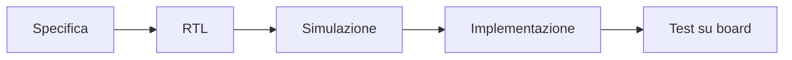
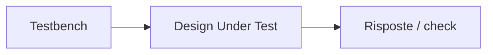
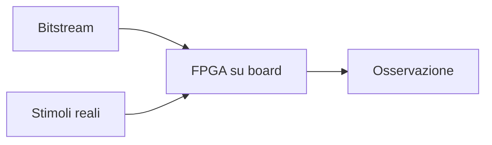

# Verifica e test in un progetto FPGA

La **verifica** è una parte essenziale del flow FPGA.  
Un progetto non può essere considerato valido solo perché:

- la RTL sembra corretta a colpo d'occhio;
- la sintesi termina senza errori;
- il bitstream viene generato;
- la scheda si programma correttamente.

Per avere fiducia nel design, occorre costruire un percorso di controllo che colleghi:

- specifica;
- RTL;
- simulazione;
- implementazione;
- test su hardware reale.

Nel contesto FPGA, la verifica ha una caratteristica molto importante: deve fare da ponte tra il mondo della **simulazione** e quello del **comportamento reale su board**.

Per questo è utile distinguere chiaramente tra:

- verifica **pre-hardware**;
- test e debug **su hardware reale**.

---

## 1. Perché la verifica è così importante

Molti problemi di un progetto FPGA non derivano da errori macroscopici, ma da dettagli come:

- FSM con una transizione errata;
- gestione sbagliata del reset;
- pipeline disallineate;
- handshake incompleti;
- segnali asincroni trattati male;
- ipotesi implicite che in simulazione sembrano innocue ma sulla scheda causano errori reali.

La verifica serve quindi a ridurre il rischio di arrivare alla board con un progetto ancora troppo fragile.

### Obiettivo generale

Costruire una ragionevole fiducia nel fatto che il progetto:

- implementi la specifica;
- reagisca correttamente agli stimoli previsti;
- gestisca correttamente i casi limite rilevanti;
- possa essere portato sulla board con alta probabilità di successo.

---

## 2. Verifica FPGA: due mondi complementari

Nel contesto FPGA, è utile pensare alla verifica come composta da due grandi aree:

- **verifica in simulazione**;
- **test su hardware reale**.

## 2.1 Verifica in simulazione

Serve a controllare la correttezza logica della RTL prima dell'implementazione.

## 2.2 Test su hardware reale

Serve a confermare che il progetto si comporti correttamente anche sul dispositivo e sulla board.

Le due aree non sono alternative: sono complementari.

---

## 3. Perché la sola simulazione non basta

La simulazione è fondamentale, ma da sola non basta.

### Perché

In simulazione spesso non si vedono in modo realistico:

- problemi di clocking;
- comportamento reale dei segnali esterni;
- dettagli della board;
- effetti del CDC mal gestito;
- inizializzazioni non coerenti con l'hardware;
- problemi di timing post-implementazione;
- errori pratici di pin assignment o interfacce.

Per questo la simulazione è necessaria, ma non sufficiente.

---

## 4. Perché il solo test su board non basta

Anche il test diretto sulla scheda, senza una buona fase di simulazione, è inefficiente e rischioso.

### Problemi tipici

- debug più lento;
- minore osservabilità dei segnali;
- cause dei bug meno chiare;
- tempi di iterazione più lunghi;
- rischio di correggere "a tentativi" senza capire il problema.

La board è una fase di validazione importante, ma non dovrebbe sostituire la verifica RTL seria.

---

## 5. Verifica funzionale della RTL

La prima grande fase della verifica FPGA è la **verifica funzionale della RTL**.

## 5.1 Obiettivo

Controllare che la descrizione hardware implementi correttamente:

- il comportamento richiesto;
- le interfacce;
- i protocolli;
- il reset;
- i casi d'uso principali;
- le condizioni limite rilevanti.

## 5.2 Quando va fatta

Il più presto possibile, prima della sintesi e molto prima del caricamento sulla scheda.

Questa fase è la base su cui si costruisce tutto il resto.

---

## 6. Verifica a livello di modulo

Molti progetti FPGA sono composti da più moduli.  
È molto utile verificare i blocchi in modo separato prima di integrarli.

### Esempi di moduli da verificare

- FIFO;
- controller;
- FSM;
- contatori;
- datapath;
- interfacce UART/SPI/I2C;
- blocchi di buffering;
- sottoblocchi di elaborazione.

### Vantaggi

- debug più semplice;
- isolamento dei problemi;
- maggiore riusabilità dei test;
- migliore comprensione del comportamento locale.

---

## 7. Verifica a livello di integrazione

Dopo la verifica dei singoli moduli, bisogna verificare anche l'interazione tra di essi.

## 7.1 Perché è necessaria

Molti bug emergono non all'interno dei blocchi singoli, ma nella loro interazione:

- segnali di validità non allineati;
- protocolli male interpretati;
- reset non coerente tra moduli;
- handshake incompleti;
- ordine temporale delle operazioni errato.

## 7.2 Obiettivo

Verificare che i moduli collaborino correttamente nel sistema integrato.

---

## 8. Testbench

Il **testbench** è l'ambiente di verifica in cui si esercita la RTL.

## 8.1 Cosa deve fare

Un buon testbench dovrebbe:

- generare stimoli significativi;
- osservare le uscite;
- controllare condizioni attese;
- automatizzare il più possibile i controlli;
- rendere ripetibili i test.

## 8.2 Perché è importante

Un testbench ben costruito permette di scalare la verifica e di ridurre il debug manuale.

Il valore della verifica dipende in gran parte dalla qualità del testbench.

---

## 9. Stimoli di test

Una verifica efficace richiede stimoli ben pensati.

### Tipologie utili

- casi nominali;
- casi limite;
- sequenze di reset;
- input invalidi o borderline, se rilevanti;
- test di overflow o saturazione;
- gestione di stall o backpressure;
- scenari di startup;
- sequenze lunghe realistiche.

Il punto importante è che non basta "vedere un output": bisogna esercitare in modo significativo il comportamento del design.

---

## 10. Checker e self-checking

La verifica è molto più efficace quando non si limita all'osservazione manuale delle forme d'onda.

Per questo è utile usare:

- checker;
- confronti automatici;
- modelli di riferimento;
- testbench self-checking.

## 10.1 Vantaggi

- rilevazione più rapida dei bug;
- regressioni più affidabili;
- minore dipendenza dall'analisi manuale;
- migliore scalabilità.

In un progetto FPGA anche non enorme, questa disciplina migliora molto la qualità della verifica.

---

## 11. Regressioni

Le **regressioni** sono insiemi strutturati di test che vengono eseguiti ripetutamente, soprattutto dopo modifiche alla RTL.

## 11.1 Perché servono

Ogni cambiamento nel design può introdurre un bug in aree che prima funzionavano correttamente.

## 11.2 Cosa dovrebbero includere

- test base;
- casi già noti come critici;
- sequenze di reset;
- protocolli principali;
- test di integrazione;
- casi di errore rilevanti.

Le regressioni aiutano a mantenere stabile il progetto durante la sua evoluzione.

---

## 12. Verifica del reset

Su FPGA, la verifica del reset è particolarmente importante.

Bisogna controllare almeno:

- stato iniziale corretto dei registri;
- comportamento dell'FSM dopo reset;
- rilascio corretto del reset;
- assenza di transizioni spurie;
- coerenza delle pipeline;
- comportamento su reset ripetuti.

Molti bug che emergono su scheda nascono proprio da una verifica insufficiente di questa fase.

---

## 13. Verifica delle interfacce

Le interfacce sono tra le aree più sensibili del design FPGA.

Occorre verificare:

- handshake;
- ordini temporali;
- valid/ready o protocolli equivalenti;
- allineamento tra dati e controllo;
- gestione di condizioni anomale;
- comportamento sotto carico.

Questo è particolarmente importante per interfacce verso:

- UART;
- SPI;
- I2C;
- GPIO;
- memorie;
- streaming interni.

---

## 14. Verifica delle pipeline

Molti design FPGA usano pipeline per migliorare il timing.  
Questo rende necessario verificare con attenzione:

- latenza corretta;
- allineamento dei dati;
- allineamento dei segnali di validità;
- comportamento durante stall o flush, se presenti;
- reset degli stadi;
- mantenimento dell'ordine dei dati.

I bug di pipeline possono essere molto sottili e non sempre evidenti a occhio.

---

## 15. Verifica dei clock domain crossing

Se il design usa più clock domain, la verifica deve considerare anche i **CDC**.

A livello introduttivo, è utile almeno verificare:

- che i segnali attraversino i domini attraverso strutture corrette;
- che gli handshaking siano coerenti;
- che i sincronizzatori siano presenti dove servono;
- che eventuali FIFO asincrone siano usate nel modo previsto.

Il CDC è un'area in cui la simulazione può non essere sufficiente da sola, ma resta comunque importante per intercettare errori strutturali.

---

## 16. Coverage

La **coverage** è una misura del grado con cui la verifica ha esercitato il progetto.

Anche in un contesto FPGA introduttivo, è utile distinguere tra:

- **code coverage**
- **functional coverage**

---

## 17. Code coverage

La code coverage aiuta a capire quanto della RTL sia stato attraversato dai test.

Può indicare, in modo concettuale:

- linee non eseguite;
- branch mai attraversati;
- stati non visitati;
- segnali che non cambiano mai.

## 17.1 Utilità

È utile per scoprire porzioni del design mai realmente toccate dalla verifica.

## 17.2 Limite

Non garantisce da sola che i casi funzionalmente importanti siano stati controllati.

---

## 18. Functional coverage

La functional coverage misura quanto la verifica abbia davvero coperto i comportamenti rilevanti del progetto.

### Esempi

- tutti gli stati di una FSM;
- tutte le modalità operative;
- sequenze significative di protocollo;
- casi di errore;
- range di configurazione;
- situazioni di backpressure o overflow.

In molti casi, questa è la forma di coverage più vicina al valore reale della verifica.

---

## 19. Simulazione RTL vs simulazione post-implementazione

A livello concettuale, è utile distinguere tra:

- simulazione RTL;
- eventuale simulazione più vicina all'implementazione.

## 19.1 Simulazione RTL

È la base della verifica funzionale.

## 19.2 Simulazione più avanzata

Può essere utile in alcuni casi per analizzare:

- startup;
- reset;
- effetti di implementazione;
- dettagli particolari della struttura finale.

In un percorso didattico o pratico, il punto fondamentale è capire che la simulazione RTL resta centrale, ma non esaurisce il problema del comportamento sulla board.

---

## 20. Test su board

Dopo simulazione, sintesi e implementazione, si arriva al **test su hardware reale**.

Questa fase può includere:

- osservazione di LED o GPIO;
- invio di dati via UART;
- test di protocolli reali;
- lettura di stati interni via logic analyzer integrati;
- confronto tra comportamento simulato e comportamento reale.

Il test su board è il punto in cui il progetto esce definitivamente dal mondo del modello e incontra il sistema fisico.

---

## 21. Differenza tra verifica e debug

È utile distinguere tra:

- **verifica**
- **debug**

## 21.1 Verifica

È l'attività strutturata con cui si cerca di dimostrare che il progetto è corretto.

## 21.2 Debug

È l'attività con cui si cerca la causa di un problema emerso.

Una buona verifica riduce il bisogno di debug.  
Un progetto portato troppo presto sulla board senza verifica robusta tende invece a trasformarsi in lunghe sessioni di debug poco efficienti.

---

## 22. Board-level reality

Sul test reale emergono spesso fenomeni che in simulazione sono poco evidenti o assenti, ad esempio:

- pulsanti con rimbalzo;
- segnali esterni asincroni;
- clock reali della board;
- interfacce con temporizzazioni non ideali;
- reset fisici;
- ritardi esterni;
- collegamenti errati o pin assignment sbagliato.

Per questo la verifica FPGA deve preparare il progetto anche al mondo fisico della scheda, non solo alla correttezza della logica.

---

## 23. Errori frequenti

Tra gli errori più comuni nella verifica FPGA:

- portare il progetto su board troppo presto;
- affidarsi solo alla simulazione manuale di pochi casi;
- non verificare reset e startup;
- ignorare i casi limite;
- non costruire regressioni;
- trascurare i CDC;
- confondere "si programma la board" con "il progetto è corretto";
- usare il debug hardware come sostituto della verifica.

---

## 24. Buone pratiche concettuali

Una buona strategia di verifica e test su FPGA tende a seguire questi principi:

- verificare presto e in modo strutturato;
- testare i moduli separatamente prima di integrarli;
- usare testbench chiari e possibilmente self-checking;
- fare regressioni dopo cambiamenti significativi;
- verificare con attenzione reset, pipeline e interfacce;
- prepararsi al fatto che la board reale introduca complessità aggiuntive;
- usare il test su hardware come validazione finale, non come punto di partenza.

---

## 25. Collegamento con ASIC

Molti principi della verifica FPGA sono comuni a quelli ASIC:

- verifica RTL;
- testbench;
- coverage;
- regressioni;
- attenzione a reset e protocolli.

La differenza principale è che, in FPGA, il progettista ha accesso relativamente rapido all'hardware reale e può iterare più velocemente.

Studiare bene la verifica FPGA aiuta quindi anche a sviluppare una mentalità rigorosa e utile in ottica ASIC.

---

## 26. Collegamento con SoC

Nel contesto SoC, la verifica su FPGA è molto utile per validare:

- acceleratori;
- interfacce con processori;
- bus;
- periferiche;
- firmware di bring-up;
- sottosistemi integrati.

La FPGA diventa così una piattaforma di verifica e validazione molto concreta per concetti di livello SoC.

---

## 27. Esempio concettuale

Immaginiamo un piccolo acceleratore streaming implementato su FPGA.

Una buona verifica dovrebbe includere almeno:

- test RTL del datapath;
- verifica dell'FSM di controllo;
- controllo del reset;
- casi di ingresso normale e casi limite;
- verifica del protocollo di output;
- regressione dopo ogni modifica significativa;
- test su board con osservazione dei risultati via UART o logic analyzer interno.

Questo esempio mostra bene che la verifica FPGA è un percorso continuo che accompagna il progetto dalla simulazione fino alla scheda reale.

---

## 28. In sintesi

La verifica in un progetto FPGA collega il mondo della simulazione con quello dell'hardware reale.

Le componenti principali sono:

- verifica funzionale della RTL;
- testbench;
- regressioni;
- coverage;
- verifica di reset, pipeline e interfacce;
- attenzione ai CDC;
- test e validazione su board.

Un progetto FPGA robusto non nasce dal solo fatto che "funzioni una volta sulla scheda", ma da una verifica ordinata che costruisce fiducia nel comportamento del design prima e dopo l'implementazione reale.

---

## Prossimo passo

Dopo la verifica, il passo naturale successivo è approfondire il tema del **debug su FPGA**, cioè gli strumenti e i metodi con cui si osservano segnali interni, si tracciano eventi e si risolvono i problemi che emergono sulla board reale.
