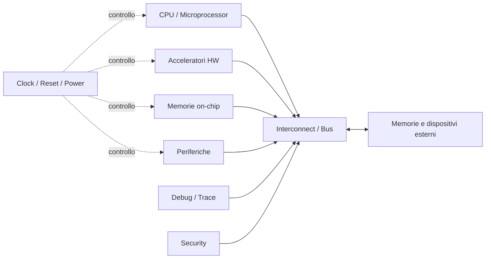
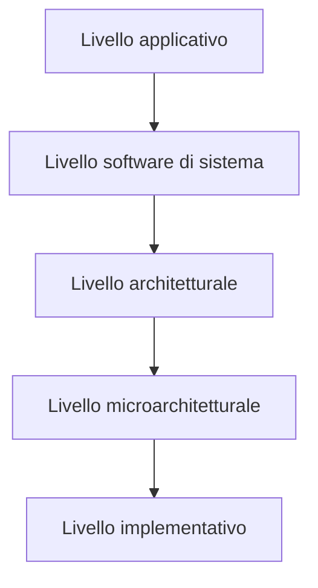
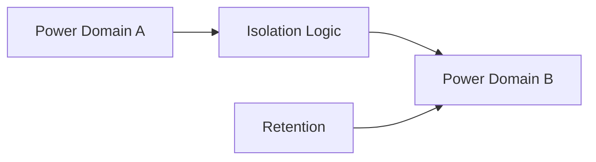
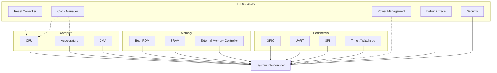

# Architettura di un SoC

L'architettura di un **System on Chip (SoC)** descrive come i vari sottosistemi digitali vengono organizzati e collegati per realizzare una piattaforma completa.  
A differenza di un singolo blocco RTL o di un acceleratore isolato, un SoC integra:

- **unità di calcolo**;
- **memorie**;
- **interconnessioni**;
- **periferiche**;
- **logiche di controllo**;
- **clock, reset e power management**;
- **meccanismi di debug e sicurezza**.

L'obiettivo architetturale non è solo "far funzionare" ogni blocco, ma fare in modo che l'intero sistema soddisfi vincoli di:

- prestazioni;
- consumi;
- area;
- scalabilità;
- verificabilità;
- manutenibilità hardware/software.

---

## 1. Vista d'insieme

Un SoC può essere visto come l'unione di più sottosistemi specializzati che collaborano attraverso una rete di comunicazione interna.

In termini pratici, l'architettura del SoC risponde a domande come:

- quale processore usare;
- quali periferiche integrare;
- come collegare i blocchi;
- dove collocare le memorie;
- come distribuire clock e reset;
- come gestire isolamento, sicurezza e debug;
- quali funzioni implementare in software e quali in hardware.

---

## 2. Blocchi fondamentali

### 2.1 Unità di elaborazione

Il cuore del SoC è spesso costituito da uno o più **core di elaborazione**, ad esempio:

- microcontrollori;
- microprocessori embedded;
- cluster multicore;
- DSP;
- core specializzati per AI o elaborazione numerica.

Le scelte architetturali principali riguardano:

- numero di core;
- frequenza operativa;
- presenza o meno di cache;
- supporto a interrupt, MMU/MPU, debug;
- livello di parallelismo richiesto dall'applicazione.

In un SoC semplice può esserci un solo core general-purpose; in sistemi più evoluti si possono affiancare più processori con ruoli diversi.

### 2.2 Acceleratori hardware

Gli **acceleratori** implementano in hardware funzioni che sarebbero troppo lente o inefficienti in software, ad esempio:

- elaborazione di segnali;
- crittografia;
- codec;
- machine learning;
- controlli real-time.

Dal punto di vista architetturale, gli acceleratori devono essere definiti in termini di:

- interfaccia verso il bus;
- registri di configurazione;
- percorso dati;
- banda verso la memoria;
- gestione delle interruzioni;
- protocolli di sincronizzazione con il software.

### 2.3 Memorie on-chip e off-chip

La memoria è uno dei punti più critici dell'architettura di un SoC. In generale si distinguono:

- **memorie on-chip**, come SRAM, ROM, register file, cache;
- **memorie off-chip**, come DDR o flash esterne.

Le scelte progettuali devono tenere conto di:

- latenza;
- banda;
- area;
- consumi;
- prevedibilità temporale;
- costo di integrazione.

Una decisione architetturale sbagliata sulla gerarchia di memoria può limitare pesantemente le prestazioni complessive del sistema.

### 2.4 Interconnect e bus

I blocchi di un SoC devono comunicare tra loro tramite una struttura di interconnessione. Le soluzioni più comuni includono:

- bus condivisi;
- bus gerarchici;
- crossbar;
- network-on-chip (NoC), nei sistemi più complessi.

L'interconnect deve supportare:

- trasferimenti tra master e slave;
- arbitraggio;
- gestione della latenza;
- scalabilità all'aumentare dei blocchi;
- separazione fra traffico ad alte prestazioni e traffico di controllo.

### 2.5 Periferiche

Le periferiche consentono al SoC di interagire con l'esterno e con il resto del sistema. Esempi tipici:

- GPIO;
- UART;
- SPI;
- I²C;
- timer e watchdog;
- PWM;
- controller di interrupt;
- interfacce verso sensori o attuatori.

Dal punto di vista architetturale, le periferiche sono spesso raggruppate in sottosistemi a bassa banda, separati dalle componenti più critiche per prestazioni.

### 2.6 Infrastruttura di sistema

Oltre ai blocchi funzionali, ogni SoC include logiche di supporto essenziali:

- **clock generation e distribuzione**;
- **reset controller**;
- **power management unit**;
- **debug e trace**;
- **monitor di stato**;
- **meccanismi di sicurezza**.

Questi elementi non implementano la funzione applicativa principale, ma rendono il sistema utilizzabile, configurabile, osservabile e robusto.

---

## 3. Architettura a livelli

Per comprendere meglio un SoC è utile separare la progettazione in livelli.

### 3.1 Livello applicativo

Definisce il problema da risolvere:

- controllo industriale;
- automotive;
- edge AI;
- telecomunicazioni;
- consumer electronics.

Qui si fissano i requisiti funzionali e i vincoli principali.

### 3.2 Livello software di sistema

Descrive il firmware o il software che governa il SoC:

- boot;
- inizializzazione periferiche;
- scheduler;
- driver;
- stack di comunicazione;
- eventuale sistema operativo.

Le scelte software influenzano direttamente l'architettura hardware.

### 3.3 Livello architetturale

È il livello in cui si definiscono:

- i blocchi presenti nel SoC;
- le interconnessioni;
- la memory map;
- la suddivisione in sottosistemi;
- le interfacce principali.

Questa pagina si concentra soprattutto su questo livello.

### 3.4 Livello microarchitetturale

Ogni blocco architetturale viene poi raffinato in una microarchitettura concreta:

- pipeline;
- FSM;
- buffer;
- code;
- cache policy;
- datapath dettagliato.

### 3.5 Livello implementativo

Infine si passa a:

- RTL;
- sintesi;
- place & route;
- verifica fisica;
- integrazione backend.

Questo livello collega naturalmente la progettazione SoC alla sezione dedicata agli **ASIC**.

---

## 4. Sottosistemi tipici di un SoC

Una buona pratica consiste nel raggruppare i blocchi in **sottosistemi** con responsabilità chiare.

### 4.1 Compute subsystem

Comprende:

- CPU;
- cache;
- interrupt controller;
- debug del processore;
- eventuali coprocessori.

È il centro di controllo del sistema.

### 4.2 Memory subsystem

Comprende:

- SRAM interne;
- ROM di boot;
- controller per memorie esterne;
- DMA;
- eventuali cache condivise.

Il suo compito è fornire dati e istruzioni con la latenza e la banda richieste.

### 4.3 Peripheral subsystem

Comprende le interfacce a bassa e media velocità e i blocchi di controllo del mondo esterno.

Spesso è collegato a un bus distinto da quello usato dai blocchi ad alte prestazioni.

### 4.4 System control subsystem

Comprende:

- clock/reset;
- power controller;
- registri di configurazione globale;
- monitor di stato;
- watchdog globali.

### 4.5 Security subsystem

Può includere:

- secure boot;
- gestione chiavi;
- moduli crittografici;
- controllo accessi;
- isolamento fra domini;
- protezione della memoria.

---

## 5. Criteri di progettazione architetturale

La definizione dell'architettura di un SoC è sempre il risultato di compromessi.

### 5.1 Prestazioni

Le prestazioni dipendono da:

- frequenza di clock;
- parallelismo;
- efficienza del software;
- larghezza dei bus;
- gerarchia di memoria;
- latenza delle interconnessioni.

Aumentare le prestazioni non significa solo accelerare la CPU: spesso il collo di bottiglia è nella memoria o nello scambio dati fra blocchi.

### 5.2 Consumi

I consumi possono essere ridotti tramite:

- clock gating;
- power gating;
- riduzione del traffico inutile;
- scelta di memorie più efficienti;
- partizionamento corretto dei domini di alimentazione.

### 5.3 Area

Ogni blocco aggiunto aumenta l'area del chip. Le memorie, in particolare, incidono molto. Anche bus troppo ricchi o logiche ridondanti possono avere un forte impatto.

### 5.4 Modularità e riuso

Un SoC ben progettato favorisce:

- riuso di IP;
- scalabilità verso versioni future;
- integrazione semplificata;
- verifica più ordinata.

### 5.5 Verificabilità

Un'architettura elegante ma difficile da verificare è spesso un rischio di progetto. Occorre quindi prevedere:

- interfacce pulite;
- registri ben documentati;
- gestione chiara degli errori;
- osservabilità interna;
- supporto a debug e test.

---

## 6. Memory map e spazio di indirizzamento

Molti SoC adottano un modello **memory-mapped**, in cui registri, memorie e periferiche sono accessibili tramite indirizzi.

Esempio semplificato:

| Intervallo indirizzi | Blocco |
|---|---|
| `0x0000_0000 - 0x0000_FFFF` | Boot ROM |
| `0x1000_0000 - 0x1001_FFFF` | SRAM interna |
| `0x2000_0000 - 0x2000_0FFF` | GPIO |
| `0x2000_1000 - 0x2000_1FFF` | UART |
| `0x2000_2000 - 0x2000_2FFF` | Timer |
| `0x4000_0000 - 0x4FFF_FFFF` | Memoria esterna |

La progettazione della memory map deve essere:

- coerente;
- estendibile;
- semplice da documentare;
- compatibile con i driver software.

---

## 7. Clock domain, reset domain e power domain

Uno degli aspetti più delicati nell'architettura di un SoC è la presenza di domini diversi.

### 7.1 Clock domain

Blocchi differenti possono funzionare a frequenze diverse. Questo richiede una progettazione attenta delle comunicazioni fra domini distinti.

### 7.2 Reset domain

Non tutti i blocchi devono essere resettati nello stesso modo o nello stesso momento. La strategia di reset influisce sul boot, sulla recovery e sulla robustezza.

### 7.3 Power domain

Nei SoC avanzati alcuni blocchi possono essere spenti selettivamente per ridurre i consumi. Questo richiede:

- isolamento;
- retention dove necessario;
- sequenze di accensione e spegnimento;
- gestione software coerente.

---

## 8. Partizionamento hardware/software

Un SoC efficace nasce da una buona suddivisione delle funzioni fra hardware e software.

In generale conviene implementare in hardware ciò che richiede:

- elevato throughput;
- bassa latenza;
- temporizzazione deterministica;
- forte parallelismo.

Conviene invece lasciare in software ciò che richiede:

- flessibilità;
- configurabilità;
- aggiornabilità;
- logica di controllo complessa ma non critica temporalmente.

Il partizionamento non è mai definitivo: spesso evolve durante il progetto sulla base dei test e dei profili di utilizzo.

---

## 9. Architetture SoC comuni

### 9.1 SoC microcontroller-based

Tipico di sistemi embedded compatti:

- un core principale;
- SRAM e flash;
- periferiche standard;
- bus semplice;
- basso consumo.

### 9.2 SoC application-oriented

Più ricco e potente:

- CPU più performante;
- memorie esterne;
- acceleratori dedicati;
- periferiche numerose;
- maggiore complessità software.

### 9.3 SoC eterogeneo

Integra elementi diversi:

- CPU general-purpose;
- DSP;
- acceleratori specializzati;
- sottosistemi indipendenti;
- domini multipli di clock e alimentazione.

È una scelta comune quando servono prestazioni elevate senza rinunciare alla flessibilità.

---

## 10. Diagramma di riferimento

Il seguente schema riassume una possibile organizzazione didattica di un SoC.

---

## 11. Errori architetturali frequenti

Alcuni errori tipici nella progettazione di un SoC sono:

- sottostimare la banda di memoria necessaria;
- scegliere un'interconnessione non scalabile;
- non definire chiaramente ownership e accessi ai registri;
- trascurare CDC, reset sequencing e power domains;
- progettare acceleratori senza considerare il collo di bottiglia software;
- rendere la memory map disordinata o difficile da estendere;
- non prevedere adeguati meccanismi di debug e osservabilità.

---

## 12. Collegamenti con FPGA e ASIC

La progettazione architetturale di un SoC si colloca tra due prospettive già presenti nel corso:

### Collegamento con FPGA

La FPGA è spesso usata per:

- prototipare un SoC;
- validare blocchi integrati;
- testare firmware di bring-up;
- sperimentare l'interazione fra processore, periferiche e acceleratori.

### Collegamento con ASIC

L'ASIC rappresenta invece la fase in cui l'architettura definita viene trasformata in un circuito integrato fisico, affrontando temi come:

- sintesi;
- floorplanning;
- timing closure;
- DFT;
- consumi;
- signoff.

La qualità dell'architettura iniziale condiziona fortemente la riuscita di tutte queste fasi successive.

---

## 13. In sintesi

L'architettura di un SoC è il punto di incontro fra:

- requisiti applicativi;
- organizzazione dei blocchi hardware;
- struttura delle memorie;
- interconnessioni;
- software di sistema;
- vincoli di implementazione fisica.

Progettare bene un SoC significa definire una piattaforma coerente, scalabile e verificabile, capace di trasformare un insieme di moduli in un sistema integrato funzionante.

---

## Prossimo passo

Dopo l'architettura generale, il passo naturale successivo è approfondire il tema delle **interconnessioni e dei bus**, cioè il modo in cui i blocchi del SoC comunicano tra loro.
