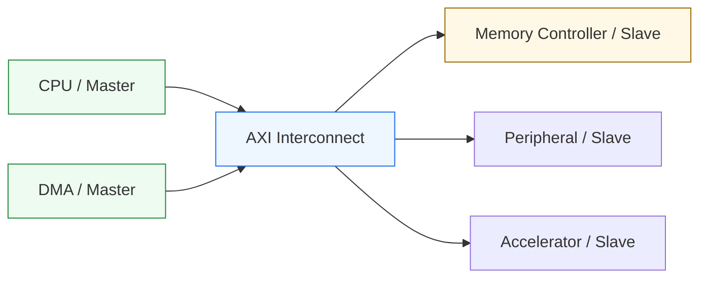
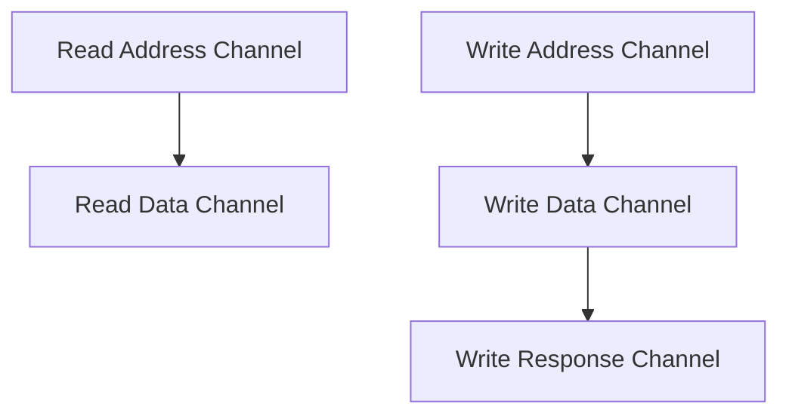

# Interfaccia AXI nei SoC

Dopo aver costruito i concetti fondamentali di integrazione nei sistemi digitali, uno dei temi più importanti quando si entra davvero nel mondo **SoC** è il ruolo delle **interfacce di comunicazione tra blocchi**. In questo contesto, uno standard compare molto spesso: **AXI**, cioè **Advanced eXtensible Interface**.

Questa lezione è molto importante perché, in un SoC reale, i blocchi non vivono isolati. Devono:
- scambiarsi dati;
- accedere a registri di controllo;
- leggere e scrivere memoria;
- coordinarsi tramite bus e interconnessioni;
- convivere con latenze, backpressure e parallelismo del traffico.

Dal punto di vista progettuale, questa pagina serve a chiarire:
- che cos’è AXI;
- perché è così importante nei SoC;
- quali sono i suoi concetti fondamentali;
- che cosa significhino canali, handshake, transazioni e burst;
- come leggere AXI dal punto di vista architetturale, senza perdersi subito nei dettagli implementativi.

Questa pagina mantiene un taglio:
- didattico ma tecnico;
- orientato all’architettura di sistema;
- coerente con una sezione SoC;
- utile come ponte verso RTL, verifica e integrazione reale.

## 1. Perché parlare di AXI in un corso SoC

La prima domanda utile è: perché AXI appartiene naturalmente a una sezione SoC?

### 1.1 Perché AXI è un protocollo di interconnessione
AXI non è semplicemente una interfaccia locale tra due piccoli blocchi. È uno dei protocolli più usati per collegare:
- core di calcolo;
- controller di memoria;
- periferiche;
- acceleratori;
- DMA;
- registri memory-mapped.

### 1.2 Perché il SoC è un problema di integrazione
In un SoC, oltre alla funzione interna dei singoli blocchi, conta moltissimo:
- come si collegano;
- come arbitrare gli accessi;
- come gestire letture e scritture;
- come sostenere throughput elevato;
- come mantenere la modularità.

### 1.3 Perché è importante
AXI è quindi soprattutto un **tema di architettura di sistema**. Ha senso trattarlo in una sezione SoC perché è uno dei linguaggi pratici dell’integrazione tra sottoblocchi.

---

## 2. Che cos’è AXI

AXI significa **Advanced eXtensible Interface** ed è parte della famiglia di protocolli **AMBA**.

### 2.1 Significato essenziale
AXI è un protocollo di comunicazione on-chip progettato per permettere lo scambio di informazioni tra moduli all’interno di un sistema complesso.

### 2.2 Che tipo di traffico gestisce
Può essere usato per:
- accessi a registri memory-mapped;
- letture e scritture in memoria;
- trasferimenti ad alta banda;
- connessione tra master e slave;
- interazione tra core di calcolo e sottosistemi.

### 2.3 Perché è importante
AXI è molto diffuso perché combina:
- struttura modulare;
- handshake robusto;
- separazione dei canali;
- supporto a trasferimenti efficienti;
- buona adattabilità a sistemi complessi.

---

## 3. AXI come protocollo memory-mapped

Uno dei primi concetti chiave da capire è che AXI è spesso usato come protocollo **memory-mapped**.

### 3.1 Che cosa significa
Significa che molti blocchi del sistema vengono visti come se fossero accessibili tramite indirizzi.

### 3.2 Esempio intuitivo
Un processore può:
- leggere un registro di stato di una periferica;
- scrivere un registro di configurazione di un acceleratore;
- accedere a una regione di memoria;
- avviare un trasferimento DMA scrivendo in indirizzi specifici.

### 3.3 Perché è importante
Questo semplifica molto la programmazione e l’integrazione del sistema:
- i blocchi appaiono come regioni indirizzabili;
- il software può interagire con l’hardware tramite read/write;
- il protocollo diventa un ponte tra architettura hardware e modello software di accesso.

---

## 4. Master e slave in AXI

AXI si legge spesso in termini di due ruoli principali:
- **master**
- **slave**

### 4.1 Master
Il master è il blocco che **inizia una transazione**.

Esempi tipici:
- CPU
- DMA
- motori di trasferimento
- alcuni acceleratori con capacità di accesso alla memoria

### 4.2 Slave
Lo slave è il blocco che **risponde alla transazione**.

Esempi tipici:
- controller di memoria
- periferiche memory-mapped
- registri di controllo
- buffer interni accessibili via bus

### 4.3 Perché è importante
Questa distinzione aiuta a capire la direzione della responsabilità:
- il master decide di leggere o scrivere;
- lo slave risponde fornendo dati o accettando una scrittura.

---

## 5. L’idea fondamentale di AXI: canali separati

Uno degli aspetti più caratteristici di AXI è la separazione del traffico in **canali distinti**.

### 5.1 Perché è utile
Invece di avere un unico bus monolitico, AXI separa diverse fasi della comunicazione:
- indirizzo di lettura
- dati di lettura
- indirizzo di scrittura
- dati di scrittura
- risposta di scrittura

### 5.2 Perché è importante
Questa struttura rende il protocollo:
- più flessibile;
- più adatto al parallelismo;
- più robusto nella gestione del traffico;
- più efficiente nei sistemi complessi.

### 5.3 Messaggio progettuale
AXI non è solo “un bus”, ma una architettura di comunicazione a canali con handshake indipendenti.

---

## 6. I cinque canali principali di AXI

AXI full viene tipicamente descritto tramite cinque canali.

### 6.1 Canale di indirizzo di lettura
Porta l’indirizzo della richiesta di lettura.

### 6.2 Canale dati di lettura
Porta i dati letti in risposta.

### 6.3 Canale di indirizzo di scrittura
Porta l’indirizzo della richiesta di scrittura.

### 6.4 Canale dati di scrittura
Porta i dati da scrivere.

### 6.5 Canale di risposta di scrittura
Porta l’esito della scrittura.

### 6.6 Perché è importante
Questa separazione è uno dei motivi principali per cui AXI si presta bene ai sistemi con traffico intenso e concorrente.

---

## 7. Handshake in AXI: valid e ready

Il cuore dinamico di AXI è il meccanismo di handshake basato su:
- `VALID`
- `READY`

### 7.1 Significato
- il sorgente del canale alza `VALID` quando l’informazione sul canale è significativa;
- il destinatario alza `READY` quando è pronto ad accettarla;
- il trasferimento avviene quando entrambi sono attivi nello stesso ciclo.

### 7.2 Perché è importante
Questo modello:
- evita trasferimenti ambigui;
- gestisce naturalmente il backpressure;
- permette a blocchi con ritmi diversi di cooperare;
- rende indipendenti i canali.

### 7.3 Messaggio progettuale
AXI eredita e sfrutta a fondo una filosofia di interfaccia basata su handshake robusto e modulare.

---

## 8. Perché l’handshake è fondamentale nei SoC

Nei SoC reali, i blocchi non sono sempre pronti nello stesso istante.

### 8.1 Esempi
- una periferica lenta può non essere pronta ad accettare nuovi dati;
- un controller di memoria può introdurre latenza;
- un interconnect può dover arbitrare richieste multiple;
- uno slave può rispondere più lentamente del ritmo del master.

### 8.2 Perché è importante
Il meccanismo `VALID/READY` permette di costruire un protocollo:
- elastico;
- tollerante alla latenza;
- ben adattato all’integrazione modulare.

### 8.3 Conseguenza
AXI non richiede che tutto avvenga in modo rigidamente sincronizzato e immediato. Permette cooperazione strutturata tra blocchi con comportamenti diversi.

---

## 9. Letture e scritture in AXI

AXI distingue chiaramente:
- **read transaction**
- **write transaction**

### 9.1 Lettura
In una lettura il master:
- invia un indirizzo sul canale di lettura;
- attende che lo slave risponda con i dati sul canale dati di lettura.

### 9.2 Scrittura
In una scrittura il master:
- invia indirizzo di scrittura;
- invia i dati di scrittura;
- riceve una risposta di completamento.

### 9.3 Perché è importante
Questa distinzione rende più leggibile l’architettura del protocollo e aiuta a capire il traffico di sistema.

---

## 10. Transazione AXI

Una **transazione** AXI è un’operazione completa di lettura o scrittura.

### 10.1 Esempio di transazione di lettura
- il master presenta un indirizzo;
- lo slave lo accetta;
- dopo una certa latenza, lo slave restituisce i dati.

### 10.2 Esempio di transazione di scrittura
- il master presenta indirizzo e dati;
- lo slave li accetta;
- lo slave invia una risposta di esito.

### 10.3 Perché è importante
Il concetto di transazione permette di leggere AXI non come insieme di segnali sparsi, ma come sequenza strutturata di eventi.

---

## 11. Burst in AXI

Uno dei punti forti di AXI è il supporto ai **burst transfer**.

### 11.1 Che cos’è un burst
È una sequenza di trasferimenti collegati tra loro, eseguiti come parte di una stessa operazione logica.

### 11.2 Perché è utile
Invece di fare molte singole operazioni indipendenti, si possono trasferire più parole consecutive in modo più efficiente.

### 11.3 Dove è importante
I burst sono molto utili per:
- accessi a memoria;
- trasferimenti DMA;
- stream di dati;
- interazione con buffer e controller di memoria.

### 11.4 Perché è importante
Questo aumenta notevolmente l’efficienza del sistema rispetto a un protocollo che richiede una transazione completamente separata per ogni parola.

---

## 12. Perché AXI è adatto alla memoria

AXI è molto forte nei contesti in cui il traffico verso memoria è rilevante.

### 12.1 Perché
La memoria non è un semplice registro singolo: richiede spesso:
- throughput elevato;
- trasferimenti consecutivi;
- latenza non trascurabile;
- gestione efficiente delle richieste.

### 12.2 Perché i burst aiutano
I burst permettono di usare meglio il canale e ridurre l’overhead per trasferimenti multipli.

### 12.3 Conseguenza progettuale
Nei SoC moderni, AXI diventa un candidato naturale per collegare:
- core di elaborazione;
- DMA;
- memoria esterna o interna;
- acceleratori con traffico consistente.

---

## 13. Interconnect AXI

In un SoC non c’è spesso un solo master e un solo slave. Serve quindi un elemento intermedio: l’**AXI interconnect**.

### 13.1 Che cos’è
È il blocco che gestisce:
- instradamento delle richieste;
- collegamento tra più master e più slave;
- decodifica degli indirizzi;
- arbitraggio del traffico;
- distribuzione delle risposte.

### 13.2 Perché è importante
L’interconnect è ciò che trasforma AXI da semplice protocollo punto-punto a infrastruttura di sistema.

### 13.3 Messaggio progettuale
Quando si parla di AXI nei SoC, spesso si parla tanto dell’interfaccia quanto della rete di interconnessione che la usa.

---

## 14. Decodifica degli indirizzi

Nei sistemi memory-mapped, l’indirizzo non serve solo a leggere o scrivere un valore. Serve anche a capire **quale blocco deve rispondere**.

### 14.1 Che cosa significa
L’interconnect o la logica di sistema decodifica l’indirizzo per determinare:
- se la richiesta va a memoria;
- se va a una periferica;
- se va a un acceleratore;
- se va a un registro di configurazione.

### 14.2 Perché è importante
La mappa di memoria è il modo con cui il sistema organizza lo spazio di indirizzi dei diversi sottoblocchi.

### 14.3 Conseguenza
AXI si inserisce naturalmente in un modello di progettazione SoC in cui l’indirizzamento struttura il rapporto tra software e hardware.

---

## 15. AXI e periferiche

Non tutti gli slave AXI sono memorie. Molti sono periferiche.

### 15.1 Esempi
- timer
- UART
- GPIO
- controller di interrupt
- registri di configurazione
- blocchi custom

### 15.2 Perché è importante
Questo mostra che AXI non serve solo per “alta banda”, ma anche per integrare il piano di controllo del sistema.

### 15.3 Messaggio progettuale
AXI è un ponte tra due mondi:
- traffico dati relativamente intenso;
- accesso a registri e controllo memory-mapped.

---

## 16. AXI e acceleratori hardware

Nei SoC moderni, AXI compare molto spesso anche attorno agli acceleratori.

### 16.1 Dove
Un acceleratore può avere:
- una interfaccia AXI-lite per configurazione e stato;
- una interfaccia AXI full o stream per i dati;
- accesso a memoria tramite AXI come master.

### 16.2 Perché è importante
Questo rende AXI uno dei protocolli naturali per integrare blocchi custom dentro una architettura SoC più ampia.

### 16.3 Conseguenza
Capire AXI significa anche capire come un blocco hardware personalizzato entri in un ecosistema di sistema standardizzato.

---

## 17. AXI-lite e AXI-stream

Quando si studia AXI, è utile sapere che esistono varianti con obiettivi diversi.

### 17.1 AXI-lite
È una versione più semplice, usata soprattutto per:
- accessi a registri;
- configurazione;
- controllo memory-mapped;
- traffico meno complesso.

### 17.2 AXI-stream
È orientata allo streaming di dati, senza modello classico indirizzo+memoria come nelle transazioni memory-mapped.

### 17.3 Perché è importante
Questo aiuta a collocare meglio AXI full nel panorama:
- AXI full per traffico più ricco e memory-mapped;
- AXI-lite per controllo semplice;
- AXI-stream per flussi continui di dati.

---

## 18. Perché AXI sembra complesso

Molti studenti percepiscono AXI come protocollo “intimidatorio”.

### 18.1 Perché
Perché mette insieme:
- più canali;
- handshake indipendenti;
- letture e scritture separate;
- burst;
- risposte;
- latenza non banale;
- interconnect multi-master e multi-slave.

### 18.2 Perché non bisogna scoraggiarsi
La chiave è non partire dai dettagli di tutti i segnali, ma dai concetti architetturali:
- chi inizia la transazione;
- chi risponde;
- quali canali sono coinvolti;
- come funziona l’handshake;
- dove va il traffico.

### 18.3 Messaggio didattico
AXI diventa molto più leggibile quando lo si studia prima come **modello di comunicazione di sistema**, poi come insieme di segnali RTL.

---

## 19. Errori comuni di comprensione

Ci sono alcuni errori molto frequenti quando si studia AXI per la prima volta.

### 19.1 Pensare che sia solo “un bus”
In realtà è un protocollo articolato con più canali e semantica precisa.

### 19.2 Confondere dato e transazione
AXI non riguarda solo il valore trasferito, ma anche:
- indirizzo;
- accettazione;
- risposta;
- contesto della richiesta.

### 19.3 Ignorare l’handshake
Il protocollo si capisce davvero solo se si capisce `VALID/READY`.

### 19.4 Non distinguere bene master e slave
Questo rende difficile leggere chi ha l’iniziativa e chi risponde.

### 19.5 Cercare di memorizzare tutti i segnali prima del modello
È quasi sempre meglio partire dall’architettura logica del protocollo.

---

## 20. Buone pratiche di studio

Per affrontare AXI in modo ordinato, conviene procedere così.

### 20.1 Parti dalla vista di sistema
Chiediti:
- quali blocchi parlano con quali altri?
- chi è master?
- chi è slave?
- che tipo di traffico serve?

### 20.2 Poi separa letture e scritture
Sono due mondi distinti ma paralleli.

### 20.3 Studia i canali come responsabilità separate
Non come lista confusa di segnali.

### 20.4 Collega sempre AXI al memory map
Questo aiuta a vedere il protocollo come parte dell’architettura SoC.

### 20.5 Solo dopo passa all’RTL
Quando il modello architetturale è chiaro, la lettura dei segnali HDL diventa molto più naturale.

---

## 21. Collegamento con il resto del capitolo SoC

Questa lezione si colloca molto bene nel capitolo SoC perché si collega naturalmente a:
- architettura di sistema;
- interconnessioni tra blocchi;
- memory map;
- integrazione di acceleratori e periferiche;
- rapporti tra CPU, memoria e sottosistemi;
- verifica delle interfacce on-chip.

Se nel tuo corso hai già pagine su:
- bus e interconnessioni;
- memory-mapped I/O;
- DMA;
- acceleratori;
- architettura SoC;
allora questa pagina funziona benissimo come snodo centrale.

---

## 22. In sintesi

AXI è uno dei protocolli più importanti nell’architettura dei SoC moderni.

- È un protocollo di comunicazione on-chip molto usato.
- Si inserisce naturalmente nel modello **memory-mapped**.
- Distingue chiaramente **master** e **slave**.
- Usa **canali separati** per lettura e scrittura.
- Si basa su handshake **VALID/READY**.
- Supporta trasferimenti efficienti come i **burst**.
- Vive spesso dentro una infrastruttura più ampia di **interconnect**.

Capire bene AXI significa fare un passo decisivo verso la comprensione dell’integrazione reale tra blocchi in un SoC.

## Prossimo passo

Il passo successivo naturale, dopo questa lezione, è una pagina più applicativa su uno di questi temi:
- **AXI-lite per registri e periferiche**
- **AXI-stream per flussi dati**
- **integrazione di un acceleratore custom su bus AXI**
- **verifica di interfacce AXI in RTL/UVM**
