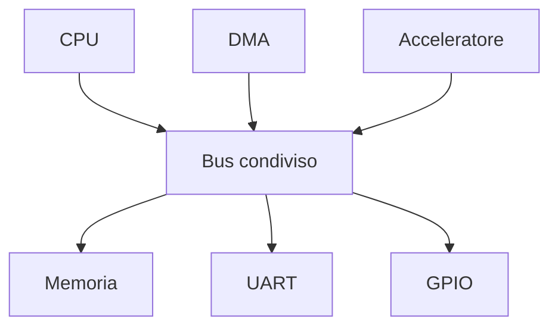
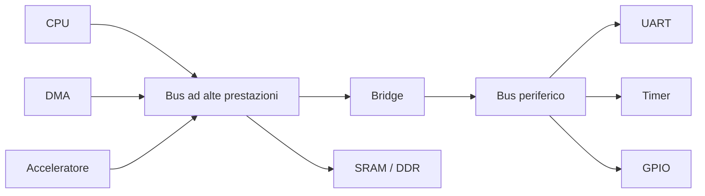
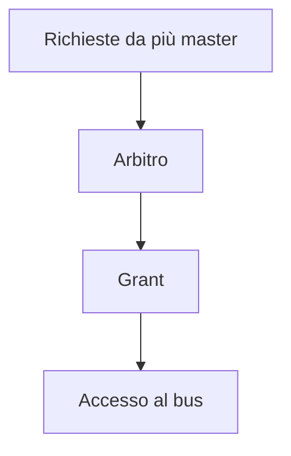
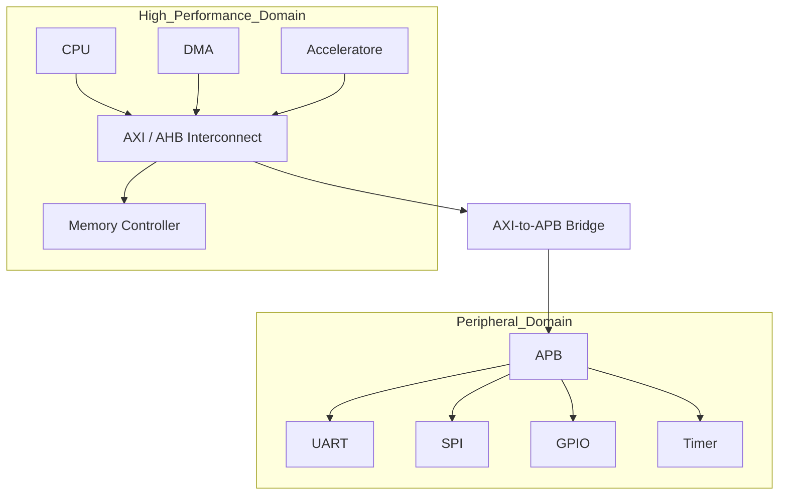

# Interconnessioni e bus in un SoC

In un **System on Chip (SoC)**, i blocchi funzionali non possono essere considerati isolatamente: CPU, memorie, acceleratori e periferiche devono poter **scambiare dati, comandi e segnali di controllo** in modo affidabile ed efficiente.  
L'insieme dei meccanismi che consente questa comunicazione costituisce il **sottosistema di interconnessione**, spesso realizzato tramite uno o più **bus**.

La scelta dell'architettura di interconnessione influenza direttamente:

- prestazioni complessive del sistema;
- latenza dei trasferimenti;
- banda disponibile;
- scalabilità;
- complessità di integrazione;
- consumi e area;
- facilità di verifica.

---

## 1. Perché i bus sono centrali in un SoC

Un SoC integra tipicamente diversi blocchi con esigenze molto diverse:

- una CPU che esegue codice e accede frequentemente alla memoria;
- periferiche lente, come UART o GPIO;
- DMA che trasferiscono blocchi di dati senza coinvolgere direttamente il processore;
- acceleratori che richiedono alta banda;
- controller verso memorie esterne.

Senza una buona architettura di interconnessione, anche blocchi molto efficienti rischiano di restare inutilizzati o rallentati.

Un bus, in senso generale, consente di trasportare:

- **indirizzi**;
- **dati**;
- **segnali di controllo**;
- **segnali di stato o risposta**.

---

## 2. Concetti fondamentali

## 2.1 Master e slave

In molti SoC i bus sono organizzati attorno a due ruoli principali:

- **master**: il blocco che inizia una transazione;
- **slave**: il blocco che risponde alla richiesta.

Esempi:

- una CPU che legge un registro periferico agisce come **master**;
- una UART mappata in memoria agisce come **slave**;
- un DMA può diventare **master** quando trasferisce dati fra memoria e periferiche.

## 2.2 Transazione

Una **transazione** è una singola operazione di comunicazione sul bus, ad esempio:

- lettura di un registro;
- scrittura di un dato;
- burst di trasferimento verso memoria;
- configurazione di un acceleratore.

Una transazione può essere molto semplice, come la scrittura di un byte, oppure articolata, come il trasferimento di un blocco di decine o centinaia di parole.

## 2.3 Memory-mapped communication

Nella maggior parte dei SoC le periferiche e molti blocchi interni sono accessibili tramite **memory map**.  
Questo significa che il software interagisce con i blocchi hardware leggendo e scrivendo indirizzi, come se stesse accedendo alla memoria.

Esempio concettuale:

- scrivere in un registro `CTRL` di una periferica equivale a scrivere all'indirizzo associato a quel registro;
- leggere uno status register equivale a leggere l'indirizzo corrispondente.

Questo modello semplifica molto l'integrazione fra hardware e software.

---

## 3. Struttura di base di un bus

Un bus tradizionale trasporta tre categorie di segnali:

### 3.1 Bus indirizzi

Serve a indicare quale risorsa si vuole raggiungere:

- memoria;
- periferica;
- registro specifico.

### 3.2 Bus dati

Trasporta il contenuto vero e proprio:

- dato letto;
- dato scritto;
- parole di un burst;
- payload di una configurazione.

### 3.3 Segnali di controllo

Gestiscono la natura della transazione e la sincronizzazione:

- read/write;
- valid/ready;
- enable;
- acknowledge;
- errore;
- fine trasferimento.

---

## 4. Topologie di interconnessione

Non tutti i SoC usano la stessa struttura. La topologia dipende da dimensione, complessità e requisiti prestazionali.

## 4.1 Bus condiviso

È la soluzione più semplice: tutti i blocchi condividono lo stesso canale di comunicazione.

### Vantaggi

- semplice da comprendere;
- basso costo di integrazione;
- adatto a sistemi piccoli.

### Svantaggi

- una sola transazione significativa per volta;
- collo di bottiglia con più master;
- scarsa scalabilità.

È una scelta ragionevole per microcontrollori o SoC elementari.

## 4.2 Bus gerarchico

I bus vengono separati per classe di traffico, ad esempio:

- un bus ad alte prestazioni per CPU e memoria;
- un bus periferico più semplice per UART, timer, GPIO.

### Vantaggi

- separazione del traffico veloce da quello lento;
- migliore organizzazione;
- uso efficiente delle risorse.

### Svantaggi

- presenza di bridge e adattatori;
- maggiore complessità rispetto a un bus unico.

Questa è una delle soluzioni più comuni nei SoC embedded.

## 4.3 Crossbar

Un'interconnessione **crossbar** consente più percorsi simultanei fra master e slave, entro certi limiti.

### Vantaggi

- maggiore parallelismo;
- migliore uso della banda;
- minore contesa rispetto al bus condiviso.

### Svantaggi

- area e complessità maggiori;
- arbitraggio più sofisticato;
- verifica più impegnativa.

È adatta a SoC medi o complessi, dove più blocchi devono accedere contemporaneamente a risorse diverse.

## 4.4 Network-on-Chip (NoC)

Nei SoC molto grandi, il bus tradizionale può diventare inefficiente. In questi casi si usano architetture di tipo **NoC**, con nodi, router e canali multipli.

### Vantaggi

- alta scalabilità;
- migliore gestione del traffico in sistemi grandi;
- struttura adatta a molti initiator e target.

### Svantaggi

- progettazione molto più complessa;
- latenza più articolata;
- costo elevato in area e verifica.

Per un corso introduttivo, è sufficiente presentarla come evoluzione dei bus tradizionali.

---

## 5. Traffico e classi di comunicazione

Non tutto il traffico in un SoC ha le stesse caratteristiche. Distinguerlo aiuta a progettare meglio il bus.

## 5.1 Traffico di controllo

Tipico di:

- scrittura registri;
- lettura di status;
- configurazione periferiche.

Caratteristiche:

- basso volume;
- latenza importante, ma banda limitata;
- protocollo semplice.

## 5.2 Traffico dati

Tipico di:

- trasferimenti memoria-memoria;
- DMA;
- stream verso acceleratori;
- accessi a buffer.

Caratteristiche:

- banda elevata;
- burst frequenti;
- sensibilità alla congestione.

## 5.3 Traffico real-time

Tipico di sottosistemi con vincoli temporali stretti:

- audio;
- video;
- controllo industriale;
- sensori ad alta frequenza.

Richiede spesso latenza prevedibile o qualità del servizio.

---

## 6. Arbitraggio

Quando più master vogliono usare contemporaneamente la stessa risorsa, occorre un meccanismo di **arbitraggio**.

## 6.1 Obiettivo dell'arbitraggio

L'arbitro decide:

- chi accede al bus;
- in quale ordine;
- con quali priorità;
- per quanto tempo.

## 6.2 Strategie comuni

### Round-robin

Ogni master viene servito a turno.

**Pro:** equo, semplice.  
**Contro:** non ideale per traffico con priorità diverse.

### Priorità fissa

Alcuni master hanno precedenza su altri.

**Pro:** facile da implementare, utile per richieste critiche.  
**Contro:** rischio di starvation dei master a bassa priorità.

### Priorità dinamica

Le priorità cambiano in base al carico o al tipo di traffico.

**Pro:** più flessibile.  
**Contro:** maggiore complessità di progetto e verifica.

---

## 7. Latenza, throughput e banda

Quando si valuta un bus, tre concetti sono fondamentali.

## 7.1 Latenza

È il tempo che intercorre tra l'inizio della richiesta e l'arrivo del risultato.

Ad esempio:

- la CPU chiede un dato;
- il bus arbitra l'accesso;
- il dato viene restituito.

La latenza dipende da:

- contesa;
- profondità del protocollo;
- bridge intermedi;
- tempi dello slave.

## 7.2 Throughput

Indica quanti dati possono essere trasferiti in un intervallo di tempo.  
È importante soprattutto per DMA, memorie e acceleratori.

## 7.3 Banda

Rappresenta la capacità teorica o pratica del canale di comunicazione.  
Dipende da:

- frequenza di clock;
- ampiezza del bus dati;
- efficienza del protocollo;
- presenza di burst;
- stall e attese.

Un bus con grande banda teorica può avere prestazioni reali deludenti se l'arbitraggio o il protocollo sono inefficienti.

---

## 8. Burst e trasferimenti sequenziali

Molti protocolli supportano operazioni di **burst**, cioè sequenze di trasferimenti consecutive all'interno della stessa transazione.

Questo è utile quando si accede a:

- blocchi di memoria contigui;
- frame buffer;
- array;
- stream di dati.

### Vantaggi dei burst

- riduzione dell'overhead di protocollo;
- migliore sfruttamento del bus;
- throughput superiore.

### Svantaggi o attenzioni

- maggiore occupazione del bus per singolo master;
- rischio di aumentare la latenza percepita da altre richieste;
- necessità di controllare allineamento e dimensione.

---

## 9. Bridge e adattatori

Nei SoC reali è comune collegare bus con caratteristiche diverse tramite **bridge**.

Un bridge può:

- adattare larghezze dati differenti;
- convertire protocolli diversi;
- collegare domini di clock diversi;
- separare un bus veloce da uno periferico.

I bridge sono molto utili, ma introducono:

- latenza aggiuntiva;
- logica extra;
- nuovi punti da verificare.

---

## 10. Protocolli comunemente usati

In molti SoC industriali e didattici compaiono protocolli della famiglia **AMBA**.

## 10.1 APB

L'**Advanced Peripheral Bus (APB)** è pensato per periferiche semplici.

Caratteristiche tipiche:

- protocollo lineare;
- bassa complessità;
- adatto a registri e controllo;
- non pensato per alta banda.

È molto usato per:

- UART;
- timer;
- GPIO;
- blocchi di configurazione.

## 10.2 AHB

L'**Advanced High-performance Bus (AHB)** offre maggiori prestazioni rispetto ad APB.

Caratteristiche:

- supporto a trasferimenti più efficienti;
- adatto a blocchi con requisiti medi;
- comune in sistemi embedded tradizionali.

## 10.3 AXI

L'**Advanced eXtensible Interface (AXI)** è uno dei protocolli più diffusi nei SoC moderni.

Caratteristiche:

- alta banda;
- canali separati per indirizzi e dati;
- supporto a transazioni outstanding;
- protocollo adatto a sistemi complessi;
- ottimo per CPU, DMA, acceleratori e controller memoria.

Periferiche molto semplici, però, spesso non richiedono tutta questa complessità.

---

## 11. Separazione fra bus veloci e bus lenti

Una buona pratica architetturale consiste nel non trattare tutte le risorse allo stesso modo.

### Bus ad alte prestazioni

Tipicamente collegano:

- CPU;
- DMA;
- memorie;
- acceleratori;
- controller memoria esterna.

Richiedono:

- alta banda;
- burst;
- arbitraggio efficiente;
- supporto a più richieste.

### Bus periferici

Tipicamente collegano:

- GPIO;
- UART;
- timer;
- blocchi di configurazione.

Richiedono:

- semplicità;
- basso costo;
- integrazione pulita;
- bassa complessità di verifica.

Questa separazione migliora sia le prestazioni sia la leggibilità del progetto.

---

## 12. Esempio di organizzazione in un SoC

Il seguente esempio mostra una possibile organizzazione didattica.

Questa soluzione è molto comune perché:

- isola il traffico periferico;
- semplifica le periferiche lente;
- mantiene efficiente il percorso verso la memoria;
- rende più facile scalare il sistema.

---

## 13. Aspetti critici di progettazione

Quando si progetta il sottosistema di bus occorre prestare attenzione a vari aspetti.

## 13.1 Scalabilità

Una struttura adatta a 3 blocchi potrebbe non funzionare bene con 15 blocchi.

## 13.2 Bilanciamento fra semplicità e prestazioni

Un bus molto ricco può offrire ottime prestazioni, ma aumentare area, consumi e tempi di verifica.

## 13.3 Colli di bottiglia

Spesso il problema non è nel protocollo in sé, ma in punti specifici:

- accesso condiviso alla memoria;
- bridge troppo lenti;
- periferiche collegate in modo inefficiente;
- arbitraggio sbilanciato.

## 13.4 Verifica

Le interconnessioni vanno verificate non solo per correttezza funzionale, ma anche per:

- assenza di deadlock;
- ordine delle transazioni;
- gestione errori;
- rispetto dei protocolli;
- comportamento sotto carico.

---

## 14. Errori frequenti

Tra gli errori più comuni nella progettazione del bus di un SoC:

- usare un unico bus condiviso per blocchi con esigenze molto diverse;
- sottovalutare la banda verso la memoria;
- non prevedere il ruolo del DMA;
- adottare un protocollo troppo complesso per periferiche semplici;
- ignorare la contesa fra master;
- trascurare la latenza introdotta dai bridge;
- documentare male la memory map o l'accesso ai registri.

---

## 15. Collegamento con la progettazione FPGA

Nel contesto FPGA, i bus sono spesso il primo punto in cui si sperimenta un SoC completo:

- CPU softcore;
- interfacce AXI-lite o simili;
- periferiche memory-mapped;
- bridge verso blocchi custom.

La FPGA è molto utile per validare:

- indirizzamento;
- mappe registri;
- latenze percepite dal software;
- interazione fra acceleratori e processore.

---

## 16. Collegamento con la progettazione ASIC

Nel contesto ASIC, le scelte sul bus influenzano:

- area dell'interconnect;
- congestione fisica;
- distribuzione del clock;
- timing closure;
- consumo dinamico legato al traffico.

Per questo il bus non è solo una scelta logica: ha effetti concreti anche nelle fasi fisiche del progetto.

---

## 17. In sintesi

Il sottosistema di interconnessione di un SoC ha il compito di collegare in modo efficiente blocchi con esigenze molto diverse.  
La scelta tra bus condiviso, struttura gerarchica, crossbar o NoC dipende dai requisiti di:

- banda;
- latenza;
- area;
- semplicità;
- scalabilità.

In molti progetti, una soluzione gerarchica con **bus ad alte prestazioni** e **bus periferico** rappresenta un ottimo compromesso.

---

## Prossimo passo

Dopo aver compreso come i blocchi comunicano, il passo successivo è studiare **memorie e gerarchia della memoria**, cioè dove risiedono i dati e come vengono movimentati all'interno del SoC.
