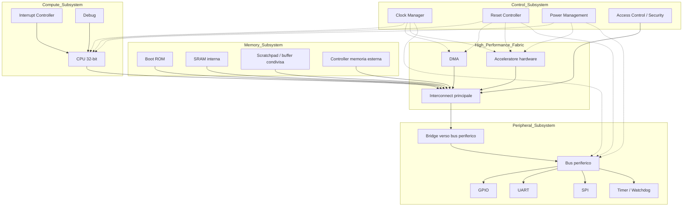
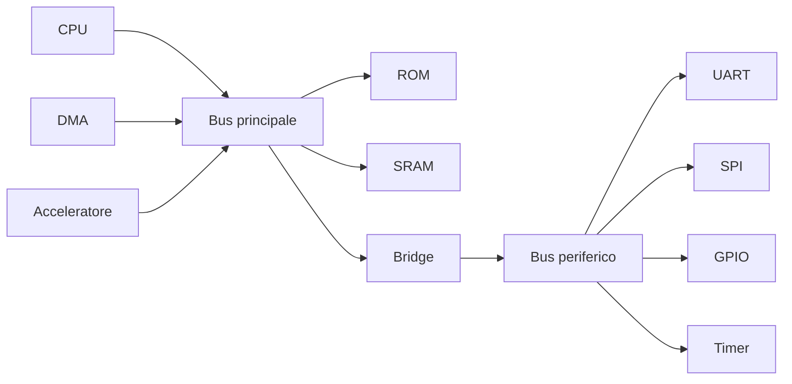
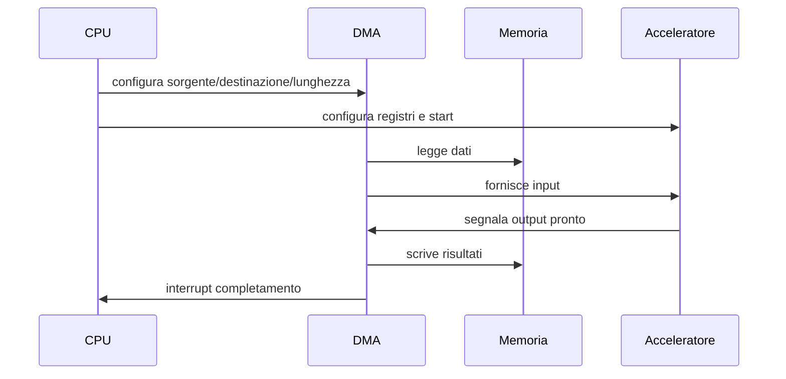
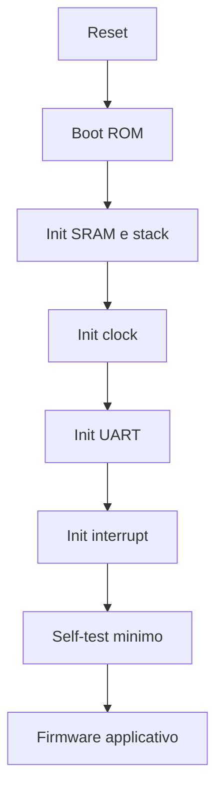

# Caso di studio: un SoC didattico completo

Dopo aver introdotto i principali temi della progettazione di un **System on Chip (SoC)**, è utile raccoglierli in un **caso di studio concreto**.  
L'obiettivo di questa pagina non è descrivere un chip industriale complesso, ma presentare una piattaforma semplice, coerente e didatticamente efficace, capace di mostrare come i diversi sottosistemi di un SoC collaborino tra loro.

Il caso di studio proposto è un **SoC embedded a microcontrollore esteso**, con:

- una CPU general-purpose;
- memoria di boot e memoria dati;
- un bus di sistema;
- un bus periferico;
- periferiche di base;
- un DMA;
- un acceleratore hardware semplice;
- infrastrutture di clock, reset e power;
- meccanismi base di safety e security.

Questo esempio è abbastanza piccolo da essere comprensibile, ma sufficientemente ricco da collegarsi in modo naturale alle sezioni precedenti.

---

## 1. Obiettivi del caso di studio

Il SoC didattico deve consentire di illustrare in modo chiaro:

- l'architettura generale di un SoC;
- la distinzione tra sottosistemi;
- la memory map;
- il ruolo del bus e dei bridge;
- il funzionamento delle periferiche memory-mapped;
- l'uso del DMA;
- l'interazione tra software e acceleratore hardware;
- il boot;
- la gestione di interrupt, reset e clock;
- il legame tra architettura e implementazione.

In altre parole, deve essere abbastanza semplice per l'apprendimento, ma non banale.

---

## 2. Visione d'insieme del SoC

Il SoC di riferimento può essere rappresentato come segue.

Questo schema mostra una struttura SoC tipica e realistica, ma ancora abbastanza contenuta.

---

## 3. Sottosistemi principali

## 3.1 Compute subsystem

Il sottosistema di calcolo contiene:

- una **CPU a 32 bit**;
- un **interrupt controller**;
- una logica base di **debug**.

La CPU è il centro di controllo del sistema:

- esegue il boot;
- inizializza i sottosistemi;
- gestisce periferiche, DMA e acceleratore;
- esegue il firmware applicativo.

## 3.2 Memory subsystem

Il sottosistema memoria contiene:

- **Boot ROM**, con il codice iniziale;
- **SRAM interna**, usata per dati, stack e codice iniziale;
- **scratchpad condivisa**, utile come buffer veloce;
- **controller di memoria esterna**, opzionale per versioni più avanzate.

Questo consente di mostrare una gerarchia di memoria semplice ma non banale.

## 3.3 High-performance fabric

La parte ad alte prestazioni comprende:

- interconnect principale;
- DMA;
- acceleratore hardware;
- accesso a memorie principali.

Serve a mostrare il traffico dati e la differenza fra controllo software e movimentazione hardware.

## 3.4 Peripheral subsystem

Le periferiche sono collegate a un bus periferico attraverso un bridge dal bus principale.

Per il caso di studio includiamo:

- GPIO;
- UART;
- SPI;
- timer/watchdog.

Queste periferiche sono sufficienti per mostrare:

- registri memory-mapped;
- interrupt;
- comunicazione esterna;
- debug di bring-up.

## 3.5 Control subsystem

L'infrastruttura di controllo include:

- clock manager;
- reset controller;
- power management unit;
- un modulo base di controllo accessi.

Questi blocchi rendono il caso di studio coerente con una visione SoC completa.

---

## 4. Scelta della CPU

Per il caso di studio non è necessario fissare un processore commerciale specifico.  
È sufficiente assumere una CPU embedded a 32 bit con:

- accesso memory-mapped;
- supporto a interrupt;
- stack pointer e registri generali;
- modalità privilegiata di base;
- possibilità di eseguire firmware C o assembly semplice.

### Perché questa scelta è didatticamente efficace

- evita di appesantire la trattazione con dettagli ISA troppo specifici;
- consente di concentrarsi sull'integrazione di sistema;
- si presta sia a un'implementazione RTL didattica sia a un softcore in FPGA.

---

## 5. Acceleratore hardware scelto

Per rendere concreto il tema del co-design HW/SW, il SoC integra un acceleratore semplice.  
Una scelta didatticamente molto efficace è un **acceleratore di elaborazione vettoriale elementare**, ad esempio:

- somma vettoriale;
- moltiplicazione accumulata;
- filtro FIR minimale;
- operazione su blocchi di dati.

Per semplicità, supponiamo qui un acceleratore che:

- legge dati da una regione di memoria;
- esegue una trasformazione elementare;
- scrive il risultato in una regione di output;
- segnala il completamento tramite interrupt.

### Perché è una buona scelta

- è semplice da comprendere;
- richiede configurazione software;
- può essere usato con o senza DMA;
- mette in evidenza il rapporto tra CPU, memoria e accelerazione.

---

## 6. Memory map del SoC

Una possibile memory map semplificata è la seguente.

| Intervallo indirizzi | Blocco | Note |
|---|---|---|
| `0x0000_0000 - 0x0000_FFFF` | Boot ROM | codice di avvio |
| `0x1000_0000 - 0x1001_FFFF` | SRAM interna | dati, stack, codice iniziale |
| `0x1100_0000 - 0x1100_FFFF` | Scratchpad condivisa | buffer DMA / acceleratore |
| `0x1200_0000 - 0x1200_0FFF` | DMA | registri di configurazione |
| `0x1200_1000 - 0x1200_1FFF` | Acceleratore HW | registri di controllo/stato |
| `0x2000_0000 - 0x2000_0FFF` | GPIO | registri I/O |
| `0x2000_1000 - 0x2000_1FFF` | UART | debug / comunicazione |
| `0x2000_2000 - 0x2000_2FFF` | SPI | interfaccia seriale |
| `0x2000_3000 - 0x2000_3FFF` | Timer / Watchdog | temporizzazione |
| `0x3000_0000 - 0x3000_0FFF` | Clock / Reset / PMU | registri di controllo infrastrutturale |
| `0x4000_0000 - 0x4FFF_FFFF` | Memoria esterna | opzionale |

Questa memory map è leggibile, estendibile e coerente con un SoC embedded di taglio didattico.

---

## 7. Registri essenziali dell'acceleratore

Per rendere il caso di studio più concreto, si può definire un set minimale di registri per l'acceleratore.

| Offset | Registro | Funzione |
|---|---|---|
| `0x00` | `CTRL` | enable, start, reset |
| `0x04` | `STATUS` | busy, done, error |
| `0x08` | `SRC_ADDR` | indirizzo buffer input |
| `0x0C` | `DST_ADDR` | indirizzo buffer output |
| `0x10` | `LENGTH` | numero elementi |
| `0x14` | `CONFIG` | parametri operativi |
| `0x18` | `IRQ_EN` | enable interrupt |
| `0x1C` | `IRQ_STATUS` | pending / clear |

Questa interfaccia è sufficiente per illustrare:

- configurazione da software;
- uso di memory-mapped I/O;
- sincronizzazione con interrupt;
- stato del blocco.

---

## 8. Architettura dei bus

Il SoC usa una struttura gerarchica molto comune.

## 8.1 Bus principale

Il bus o interconnect principale collega:

- CPU;
- SRAM;
- ROM;
- DMA;
- acceleratore;
- controller memoria;
- bridge verso il bus periferico.

## 8.2 Bus periferico

Il bus periferico collega blocchi a più bassa banda:

- GPIO;
- UART;
- SPI;
- timer/watchdog.

Questa struttura è didatticamente molto utile perché separa bene traffico di controllo e traffico dati.

---

## 9. Strategia di clock, reset e power

Il caso di studio può essere mantenuto semplice ma realistico.

## 9.1 Clock domain

Si assumono due clock domain principali:

- **clock di sistema**, per CPU, DMA, SRAM, acceleratore;
- **clock periferico**, per il bus periferico e i blocchi lenti.

Questo consente di introdurre il tema del CDC senza rendere il sistema troppo complesso.

## 9.2 Reset

Si può prevedere:

- reset globale all'avvio;
- soft reset dell'acceleratore;
- reset del sottosistema periferico.

## 9.3 Power

Per un SoC didattico si può introdurre una forma minima di power management:

- dominio sempre attivo per reset/clock/watchdog;
- dominio attivabile per acceleratore;
- eventuale clock gating su periferiche inattive.

---

## 10. Interrupt del sistema

Una possibile organizzazione degli interrupt è la seguente:

| Sorgente | Tipo di evento |
|---|---|
| Timer | tick periodico o timeout |
| UART | ricezione o trasmissione completata |
| SPI | trasferimento completato |
| DMA | fine trasferimento o errore |
| Acceleratore | done / error |
| Watchdog | warning / reset pending |

Questo insieme è sufficiente per illustrare:

- polling vs interrupt;
- priorità;
- gestione firmware;
- sincronizzazione tra sottosistemi.

---

## 11. Ruolo del DMA nel caso di studio

Il DMA è importante perché evita che la CPU debba copiare manualmente i dati tra memoria e acceleratore.

### Flusso tipico

1. il software prepara i buffer in SRAM o scratchpad;
2. configura il DMA;
3. configura l'acceleratore;
4. avvia il trasferimento o l'elaborazione;
5. riceve un interrupt di completamento;
6. verifica i risultati.

Questo semplice scenario mette in evidenza il rapporto tra hardware e software nel SoC.

---

## 12. Sequenza di boot del SoC

Una sequenza plausibile di boot per il caso di studio è la seguente.

1. **Reset globale** del SoC.
2. La CPU parte dall'indirizzo iniziale in **Boot ROM**.
3. Il firmware di boot:
   - inizializza stack in SRAM;
   - configura clock di sistema;
   - configura il bus periferico;
   - inizializza UART per debug;
   - inizializza interrupt controller;
   - configura timer base.
4. Il firmware esegue un **self-test minimo**:
   - lettura/scrittura SRAM;
   - test accesso registri periferici;
   - test presenza acceleratore e DMA.
5. Se tutto è corretto:
   - il sistema entra nel firmware principale;
   - oppure carica codice da memoria esterna, nelle versioni estese.

Questa sequenza rende il caso di studio molto utile anche per i temi di verifica e bring-up.

---

## 13. Esempio di caso d'uso applicativo

Per rendere ancora più concreto il SoC, si può immaginare una semplice applicazione:

### Scenario

Il SoC riceve un blocco dati via SPI, lo elabora tramite acceleratore e invia un messaggio di stato via UART.

### Sequenza operativa

1. un dispositivo esterno invia dati tramite SPI;
2. i dati vengono scritti in memoria;
3. la CPU configura il DMA e l'acceleratore;
4. l'acceleratore processa il blocco dati;
5. il DMA scrive il risultato;
6. un interrupt segnala il completamento;
7. la CPU legge lo stato e invia un log via UART.

Questo esempio illustra bene:

- periferiche;
- memoria;
- DMA;
- acceleratore;
- interrupt;
- co-design HW/SW.

---

## 14. Safety e security nel caso di studio

Pur mantenendo il sistema semplice, si possono introdurre elementi minimi ma significativi.

## 14.1 Safety

- watchdog per il firmware;
- bit di errore in `STATUS` dell'acceleratore;
- timeout per DMA o periferiche;
- reset controllato dell'acceleratore;
- stato safe semplificato in caso di fault.

## 14.2 Security

- controllo accessi base ai registri di clock/reset;
- boot solo da ROM fidata;
- regione protetta per registri critici;
- possibilità di disabilitare debug in una configurazione di produzione.

Questi elementi non rendono il SoC "sicuro" in senso industriale completo, ma sono sufficienti per introdurre i concetti chiave.

---

## 15. Aspetti di verifica del caso di studio

Il caso di studio si presta molto bene a un piano di verifica progressivo.

## 15.1 Test di base

- reset del sistema;
- lettura/scrittura registri;
- verifica memory map;
- boot minimo.

## 15.2 Test di integrazione

- accessi CPU a SRAM e periferiche;
- interrupt da timer e UART;
- attivazione acceleratore;
- trasferimento DMA.

## 15.3 Test firmware-driven

- boot con messaggio su UART;
- loop di test su GPIO;
- transazione SPI;
- esecuzione completa del flusso DMA + acceleratore.

## 15.4 Test di robustezza

- reset dell'acceleratore durante operazione;
- timeout DMA;
- indirizzo non valido;
- periferica non pronta;
- accesso a registri critici senza permessi, nelle versioni estese.

---

## 16. Possibile implementazione FPGA

Questo caso di studio è particolarmente adatto a una realizzazione o prototipazione su FPGA.

### Vantaggi

- possibilità di usare UART reale per debug;
- test di GPIO e SPI;
- validazione dell'acceleratore;
- sviluppo del firmware su piattaforma concreta;
- verifica di bring-up.

### Elementi facilmente mappabili in FPGA

- CPU softcore o core RTL didattico;
- SRAM su block RAM;
- bus principale e bus periferico;
- DMA semplificato;
- acceleratore custom;
- periferiche base.

Questo rende il caso di studio perfetto come ponte tra la sezione SoC e la sezione FPGA.

---

## 17. Collegamento con la progettazione ASIC

Il caso di studio è utile anche come base concettuale per il collegamento alla sezione ASIC.

### Aspetti rilevanti

- la Boot ROM, la SRAM e gli eventuali buffer diventano macro fisiche;
- l'acceleratore può essere studiato in termini di area e timing;
- i domini di clock e reset vanno implementati fisicamente;
- il power gating dell'acceleratore, se introdotto, implica isolation e retention;
- la memory map e l'interconnect devono tradursi in un floorplan coerente.

In questo modo il caso di studio non resta un esempio astratto, ma diventa il punto d'incontro tra architettura e implementazione.

---

## 18. Versioni evolutive del caso di studio

Uno dei vantaggi di questo SoC didattico è che può essere esteso progressivamente.

## 18.1 Versione base

- CPU
- ROM
- SRAM
- UART
- GPIO
- timer

## 18.2 Versione intermedia

- aggiunta di SPI
- DMA
- acceleratore
- interrupt controller più strutturato

## 18.3 Versione avanzata

- memoria esterna
- power domain dedicato all'acceleratore
- controlli di accesso più completi
- supporto a cache o scratchpad più ricche
- estensione della verifica firmware-driven

Questo approccio è molto utile anche per un percorso didattico modulare.

---

## 19. Perché questo caso di studio è efficace

Questo caso di studio funziona bene perché:

- è abbastanza piccolo da essere compreso;
- mostra chiaramente i sottosistemi di un SoC;
- permette di parlare di memory map e registri;
- consente di introdurre DMA e accelerazione hardware;
- si presta a esempi firmware-driven;
- è prototipabile in FPGA;
- ha implicazioni realistiche anche per l'ASIC.

È quindi un ottimo esempio per chiudere una sezione introduttiva ma strutturata sui SoC.

---

## 20. In sintesi

Il SoC didattico proposto rappresenta una piattaforma semplice ma completa, composta da:

- CPU;
- memoria di boot e memoria dati;
- bus principale e bus periferico;
- periferiche essenziali;
- DMA;
- acceleratore hardware;
- infrastruttura di clock, reset e power;
- elementi base di safety e security.

Attraverso questo caso di studio è possibile rileggere in modo integrato tutti i temi presentati nella sezione:

- architettura;
- interconnect;
- memorie;
- periferiche;
- integrazione IP;
- verifica;
- co-design HW/SW;
- power, clock e reset;
- safety/security;
- physical awareness.

---

## 21. Conclusione della sezione SoC

Con questo caso di studio si chiude la panoramica introduttiva sulla progettazione di SoC.  
Le sezioni precedenti hanno mostrato i concetti fondamentali; questo esempio li ricompone in una piattaforma concreta e ragionata.

Il passo successivo, a seconda degli obiettivi del corso o del progetto, può essere uno dei seguenti:

- approfondire la realizzazione FPGA del SoC;
- sviluppare RTL e testbench di alcuni blocchi;
- studiare l'implementazione ASIC di una versione semplificata;
- espandere il caso di studio con nuove periferiche o acceleratori.
