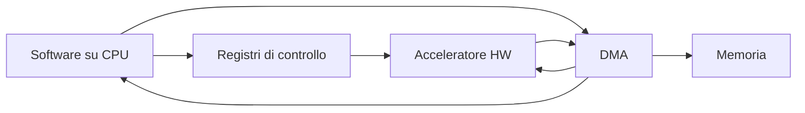
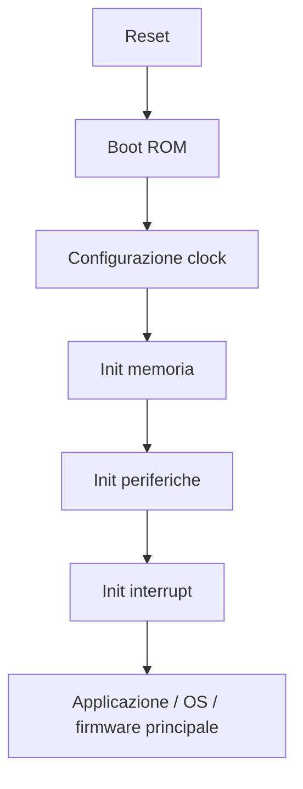
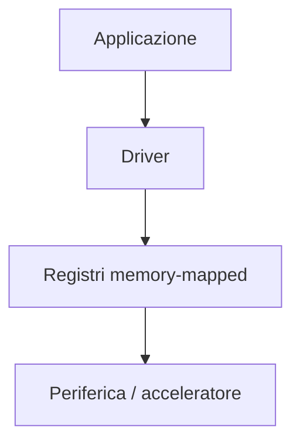
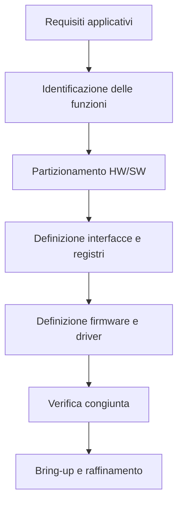

# Co-design hardware/software in un SoC

Nel contesto di un **System on Chip (SoC)**, hardware e software non possono essere progettati come mondi separati.  
Un SoC non è soltanto un insieme di blocchi digitali collegati fra loro, ma una **piattaforma eseguibile**, in cui:

- l'hardware fornisce capacità di calcolo, memoria, comunicazione e controllo;
- il software inizializza, configura, coordina e sfrutta tali risorse;
- le scelte fatte da una parte influenzano direttamente l'altra.

Il **co-design hardware/software** è quindi il processo con cui si definisce, in modo coordinato, quali funzioni implementare in hardware e quali in software, come esporle al firmware e ai driver, e come far sì che il sistema finale sia efficiente, verificabile e manutenibile.

---

## 1. Perché il co-design è centrale nei SoC

In un SoC, molte funzionalità non appartengono esclusivamente né all'hardware né al software.  
Un esempio tipico è un acceleratore hardware:

- l'hardware realizza il datapath ad alte prestazioni;
- il software configura i registri;
- il DMA trasferisce i dati;
- il firmware gestisce la sincronizzazione;
- il driver espone la funzione a livello superiore.

Senza una progettazione congiunta, è facile ottenere sistemi in cui:

- l'hardware è potente ma difficile da usare;
- il software è corretto ma inefficiente;
- i registri sono poco chiari;
- i tempi di inizializzazione sono fragili;
- i colli di bottiglia vengono scoperti troppo tardi.

Il co-design nasce proprio per evitare questo tipo di problemi.

---

## 2. Obiettivi del co-design hardware/software

Il co-design ha diversi obiettivi:

- decidere la migliore ripartizione delle funzioni;
- progettare interfacce hardware semplici e utili al software;
- ridurre il carico del processore dove necessario;
- preservare flessibilità dove possibile;
- facilitare verifica, bring-up e manutenzione;
- ottimizzare prestazioni, consumi, area e tempo di sviluppo.

In altre parole, non si tratta solo di "dividere il lavoro", ma di costruire una piattaforma coerente.

---

## 3. Il problema del partizionamento

Il cuore del co-design è il **partizionamento hardware/software**, cioè la decisione su quale funzione debba essere implementata:

- in logica hardware;
- in firmware;
- in driver;
- in software di sistema;
- oppure in combinazione.

Questa decisione dipende da fattori tecnici, economici e metodologici.

---

## 4. Quando conviene usare l'hardware

In generale, conviene implementare una funzione in hardware quando essa richiede:

- **bassa latenza**;
- **alto throughput**;
- **forte parallelismo**;
- **temporizzazione deterministica**;
- **consumi ridotti a parità di prestazione**;
- **esecuzione ripetitiva e ben definita**.

Esempi tipici:

- elaborazione numerica intensiva;
- filtri digitali;
- codifica/decodifica;
- crittografia;
- gestione real-time di segnali;
- accelerazione di compiti molto ripetitivi.

L'hardware è particolarmente efficace quando la funzione è stabile e chiaramente definita.

---

## 5. Quando conviene usare il software

Il software è invece preferibile quando serve:

- **flessibilità**;
- **facilità di aggiornamento**;
- **controllo decisionale complesso**;
- **gestione di casi variabili o eccezioni**;
- **time-to-market rapido**;
- **evolvibilità nel tempo**.

Esempi tipici:

- logica di configurazione;
- gestione dei protocolli ad alto livello;
- politiche di scheduling;
- algoritmi che cambiano spesso;
- recovery e diagnostica;
- orchestrazione di acceleratori e periferiche.

Il software è quindi ideale quando la funzione non è rigidamente fissa o quando il costo di implementarla in hardware non è giustificato.

---

## 6. Soluzioni ibride

Molto spesso la scelta migliore non è interamente hardware o interamente software, ma una soluzione intermedia.

Esempio classico:

- il **software** prepara i parametri;
- l'**hardware** esegue la parte computazionalmente intensa;
- il **DMA** movimenta i dati;
- il **software** gestisce completamento, errori e scheduling.

Questo schema è tipico dei SoC moderni, in cui il software governa il sistema e l'hardware accelera i compiti critici.

---

## 7. Criteri per il partizionamento HW/SW

Quando si decide dove collocare una funzione, conviene valutare almeno i seguenti aspetti.

## 7.1 Prestazioni

La funzione soddisfa i vincoli temporali se lasciata in software?  
Se no, è candidata all'accelerazione hardware.

## 7.2 Consumi

L'esecuzione software richiede troppi cicli macchina o troppo traffico di memoria?  
In tal caso una soluzione hardware può essere più efficiente.

## 7.3 Area

Implementare una funzione in hardware ha un costo in area.  
Se il beneficio è limitato, il software può essere preferibile.

## 7.4 Flessibilità

La funzione è stabile o soggetta a cambiamenti frequenti?  
Più è variabile, più il software diventa attraente.

## 7.5 Complessità di verifica

Una soluzione hardware può essere più veloce, ma anche più costosa da verificare.  
Una soluzione software può essere più semplice da correggere e aggiornare.

## 7.6 Frequenza d'uso

Funzioni rare o poco critiche spesso non giustificano un'implementazione hardware dedicata.

---

## 8. Il ruolo del firmware

Nel co-design SoC il **firmware** ha un ruolo decisivo.  
È il software di basso livello che:

- esegue il boot;
- inizializza clock e reset;
- configura periferiche e controller;
- alloca e prepara buffer;
- controlla DMA e interrupt;
- dialoga con acceleratori;
- espone servizi ai livelli superiori.

Il firmware rappresenta la prima vera interfaccia fra il mondo hardware e il mondo software.

---

## 9. Boot e sequenza di inizializzazione

Un SoC non è utilizzabile finché il software di avvio non porta il sistema in uno stato operativo.

Una sequenza di boot tipica include:

- uscita dal reset;
- esecuzione del codice di boot;
- inizializzazione minima della memoria;
- configurazione dei clock;
- attivazione delle periferiche essenziali;
- setup dell'interrupt controller;
- eventuale inizializzazione del controller di memoria esterna;
- passaggio al firmware principale o al sistema operativo.

Se questa sequenza non è stata pensata assieme all'hardware, i problemi di bring-up diventano molto probabili.

---

## 10. Registri e interfaccia software

Uno dei punti più concreti del co-design è la progettazione dei **registri memory-mapped**.

Dal punto di vista del software, l'hardware è spesso visto proprio attraverso:

- indirizzi base;
- registri di controllo;
- registri di stato;
- registri dati;
- registri di interrupt;
- registri di configurazione.

Una buona interfaccia a registri deve essere:

- ordinata;
- coerente;
- ben documentata;
- semplice da inizializzare;
- robusta rispetto agli errori d'uso.

## 10.1 Cosa rende un blocco hardware "software-friendly"

Un IP o un acceleratore è software-friendly quando:

- i registri sono pochi ma sufficienti;
- i bit hanno significato chiaro;
- il comportamento di reset è prevedibile;
- gli stati di busy, done ed error sono chiari;
- gli interrupt sono facili da usare;
- la sequenza di avvio è lineare;
- gli errori sono osservabili.

Una cattiva progettazione dei registri può annullare gran parte del vantaggio ottenuto con l'hardware dedicato.

---

## 11. Driver e astrazione software

Tra hardware e applicazione si collocano spesso i **driver**.

Il driver ha il compito di:

- nascondere i dettagli dei registri;
- gestire inizializzazione e configurazione;
- esporre una API coerente;
- trattare interrupt e stato del dispositivo;
- semplificare l'uso del blocco da parte del software superiore.

Nel co-design, hardware e driver dovrebbero essere pensati insieme, non in momenti scollegati.

---

## 12. Interrupt e modello di controllo

Molti blocchi hardware richiedono un modello di interazione con il software basato su:

- polling;
- interrupt;
- DMA;
- combinazioni di questi meccanismi.

### Polling

È semplice, ma inefficiente per eventi asincroni o sporadici.

### Interrupt

È più efficiente, ma richiede:

- registri di stato chiari;
- eventi ben definiti;
- logica di acknowledge o clear;
- una gestione software ordinata.

### DMA

Riduce il lavoro della CPU nei trasferimenti di dati, ma aggiunge complessità nella sincronizzazione.

Una buona scelta del modello di controllo è parte integrante del co-design.

---

## 13. Co-design di acceleratori hardware

Gli acceleratori sono uno degli esempi più significativi di co-design.

Un acceleratore ben progettato non è solo un datapath veloce: deve avere anche un'interfaccia efficace verso il software.

Tipicamente occorre definire:

- come configurarlo;
- come passargli gli input;
- dove scrive gli output;
- come segnala completamento;
- come viene gestito l'errore;
- quale driver o libreria lo espone.

Un acceleratore che richiede troppe operazioni software di supporto può risultare poco vantaggioso nel sistema complessivo.

---

## 14. Co-design della memoria

Anche la memoria è un tema di co-design.

Il software deve sapere:

- dove si trova il codice di boot;
- quali regioni sono cacheabili;
- dove collocare stack, heap e buffer;
- quali aree usare per il DMA;
- quali memorie sono condivise con acceleratori o periferiche.

L'hardware, a sua volta, deve offrire:

- una gerarchia di memoria coerente;
- prestazioni compatibili con i carichi software;
- meccanismi chiari di accesso e sincronizzazione.

La scelta fra cache, scratchpad e buffer condivisi non può essere fatta senza considerare il software reale che dovrà usarli.

---

## 15. Co-design del DMA

Il DMA è un ottimo esempio di funzionalità a metà tra hardware e software.

### L'hardware DMA fornisce:

- trasferimento automatico dei dati;
- supporto a burst;
- movimentazione efficiente verso memoria o periferiche.

### Il software deve:

- configurare sorgente e destinazione;
- impostare lunghezza e modalità;
- avviare il trasferimento;
- attendere completamento o gestire interrupt;
- verificare eventuali errori.

Se il modello DMA è troppo complesso, il software diventa fragile.  
Se è troppo semplice, si rischia di limitare i casi d'uso.

---

## 16. Co-design per sistemi real-time

Nei sistemi real-time, il co-design assume una rilevanza ancora maggiore.  
Occorre garantire non solo prestazioni medie elevate, ma anche:

- latenza prevedibile;
- risposta entro tempi garantiti;
- comportamento robusto in presenza di eventi concorrenti.

In questi casi si tende spesso a:

- spostare in hardware le funzioni più temporizzate;
- usare scratchpad invece di cache, dove serve deterministicità;
- progettare interrupt e priorità con grande attenzione;
- minimizzare sequenze software non deterministiche.

---

## 17. Impatto del co-design sulla verifica

Il co-design influenza direttamente anche la verifica del SoC.

Una verifica efficace deve controllare:

- correttezza dell'interfaccia registri;
- sequenze di inizializzazione firmware;
- comportamento di driver e interrupt;
- uso corretto del DMA;
- interazione tra CPU e acceleratori;
- comportamento in caso di errori o timeout.

Per questo molti test di verifica SoC sono naturalmente **firmware-driven**.

---

## 18. Impatto del co-design sul bring-up

Durante il bring-up emergono rapidamente i problemi di co-design:

- registri poco chiari;
- sequenze di init non documentate;
- interrupt difficili da gestire;
- assunzioni nascoste sul reset;
- parametri di clock incompatibili;
- uso scorretto delle memorie condivise;
- sincronizzazione insufficiente tra software e hardware.

Un buon co-design riduce drasticamente il tempo necessario per rendere il SoC operativo.

---

## 19. Errori frequenti nel co-design HW/SW

Tra gli errori più comuni:

- decidere il partizionamento troppo tardi;
- progettare acceleratori senza considerare il software di controllo;
- creare mappe registri difficili da usare;
- sottovalutare il costo software della gestione di DMA e interrupt;
- non definire chiaramente stati di busy, done ed error;
- non considerare la memory hierarchy dal punto di vista del firmware;
- separare troppo i team hardware e software;
- rimandare i test firmware-driven alle fasi finali.

---

## 20. Esempio di flusso di co-design

Un flusso didattico semplificato può essere il seguente:

Questo schema evidenzia che il co-design non è una fase secondaria, ma un asse portante del progetto SoC.

---

## 21. Collegamento con FPGA

Nel contesto FPGA, il co-design è particolarmente visibile perché consente di:

- prototipare rapidamente acceleratori;
- testare driver e firmware reali;
- sperimentare diverse partizioni hardware/software;
- misurare impatto su throughput e latenza;
- validare il comportamento complessivo del sistema.

La FPGA è quindi una piattaforma ideale per fare iterazioni rapide sul co-design.

---

## 22. Collegamento con ASIC

Nel contesto ASIC, le scelte di co-design diventano ancora più importanti perché sono meno facilmente modificabili dopo il tape-out.

Un partizionamento sbagliato può tradursi in:

- hardware sottoutilizzato;
- software troppo pesante;
- consumi elevati;
- prestazioni insufficienti;
- difficoltà di bring-up;
- necessità di workaround complessi.

Per questo il co-design è uno dei punti in cui architettura di sistema, microarchitettura e strategia software devono convergere con particolare disciplina.

---

## 23. In sintesi

Il co-design hardware/software in un SoC consiste nel progettare congiuntamente:

- il partizionamento delle funzioni;
- l'interfaccia fra registri, driver e firmware;
- l'uso di interrupt, DMA e memoria;
- le sequenze di boot e configurazione;
- l'interazione fra processore, periferiche e acceleratori.

Un buon co-design rende il sistema:

- più efficiente;
- più semplice da usare;
- più facile da verificare;
- più rapido da portare in bring-up;
- più robusto nel tempo.

In un SoC, hardware e software non si "incontrano" solo alla fine del progetto: devono essere pensati insieme fin dall'inizio.

---

## Prossimo passo

Dopo il co-design hardware/software, il passo successivo naturale è approfondire il tema di **clock, reset e power management**, cioè l'infrastruttura di base che consente al SoC di avviarsi, funzionare correttamente e consumare in modo efficiente.
