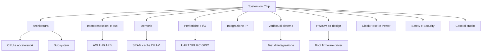

# System on Chip (SoC)

La sezione **System on Chip (SoC)** del progetto *Progettazione microelettronica* introduce la progettazione di sistemi digitali complessi in cui più sottoblocchi funzionali convivono sullo stesso chip: processori, memorie, periferiche, bus di comunicazione, acceleratori hardware e logiche di controllo.

Se la progettazione **FPGA** mette al centro la logica programmabile e la prototipazione, e la progettazione **ASIC** approfondisce i flussi di implementazione custom e fisica, la progettazione **SoC** si colloca a un livello più alto di integrazione: qui il focus è sul **sistema completo**, sulle interazioni tra blocchi e sui compromessi architetturali.

---

## Obiettivi della sezione

Questa sezione ha lo scopo di:

- chiarire che cosa si intende per **SoC** e in cosa differisce da FPGA, ASIC e microcontrollori tradizionali;
- introdurre i principali **blocchi architetturali** di un SoC;
- spiegare il ruolo di **bus**, **memorie**, **periferiche** e **IP** riusabili;
- mostrare come la progettazione SoC richieda un approccio di **co-progettazione hardware/software**;
- evidenziare i temi di **verifica di sistema**, **clock/reset**, **consumi**, **sicurezza** e **consapevolezza fisica**;
- accompagnare il lettore verso un **caso di studio** concreto.

---

## Perché studiare i SoC

Un moderno sistema elettronico raramente è costituito da un solo blocco RTL isolato. Nella pratica industriale, il progetto richiede quasi sempre di integrare:

- uno o più **core di elaborazione**;
- una **gerarchia di memoria**;
- **interfacce di comunicazione**;
- **periferiche** standard;
- eventuali **acceleratori specializzati**;
- componenti dedicati alla **sicurezza**, al **debug** e alla **gestione energetica**.

Studiare i SoC significa quindi imparare a progettare non solo un circuito, ma un **ecosistema hardware integrato**, in cui architettura, prestazioni, area, consumo e software di basso livello devono essere pensati insieme.

---

## Che cos'è un SoC

Un **System on Chip** è un circuito integrato che raccoglie in un unico chip le principali funzioni di un sistema elettronico.

In forma semplificata, un SoC può includere:

- una **CPU** o più CPU;
- memoria on-chip;
- controller per memoria esterna;
- bus o interconnessioni interne;
- periferiche di I/O;
- moduli di interrupt e timer;
- acceleratori hardware dedicati;
- blocchi di debug, test, power management e sicurezza.

L'obiettivo non è solo “mettere insieme” dei moduli, ma costruire una piattaforma coerente, verificabile e scalabile.

---

## SoC, FPGA e ASIC: come si collegano

La progettazione SoC non sostituisce FPGA e ASIC: le **integra**.

- La prospettiva **FPGA** è utile per la prototipazione rapida, la validazione dei sottosistemi e, in molti casi, per l'emulazione del SoC.
- La prospettiva **ASIC** entra in gioco quando il SoC deve essere implementato come circuito integrato ottimizzato in area, prestazioni e consumi.
- La prospettiva **SoC** guarda invece all'architettura del sistema, all'integrazione dei blocchi e al dialogo tra hardware e software.

> In altre parole: FPGA e ASIC descrivono soprattutto **come implementare** il progetto; SoC descrive **come organizzare e integrare** il sistema.

---

## Mappa concettuale della sezione

---

## Percorso di studio suggerito

Per affrontare la sezione in modo progressivo, si suggerisce questo ordine:

1. **Introduzione ai SoC**  
   per inquadrare definizioni, obiettivi e differenze rispetto ad altri paradigmi.

2. **Architettura di un SoC**  
   per comprendere i blocchi fondamentali e la loro organizzazione.

3. **Interconnessioni e bus**  
   per capire come i sottosistemi comunicano tra loro.

4. **Memorie e periferiche**  
   per analizzare i componenti essenziali di una piattaforma embedded.

5. **Integrazione IP e verifica di sistema**  
   per vedere come un progetto SoC prende forma nella pratica.

6. **HW/SW co-design**  
   per studiare il rapporto tra hardware, firmware e software di basso livello.

7. **Temi avanzati**  
   come power management, security, safety e physical awareness.

8. **Caso di studio finale**  
   per consolidare i concetti tramite un esempio completo.

---

## Domande guida

Nel corso della sezione torneranno spesso alcune domande fondamentali:

- Quali blocchi devono essere integrati nel sistema?
- Come devono comunicare tra loro?
- Dove conviene collocare memoria e intelligenza di controllo?
- Quali funzionalità devono essere realizzate in hardware e quali in software?
- Come si verifica il corretto funzionamento del sistema nel suo complesso?
- In che modo area, prestazioni, consumo e affidabilità influenzano le scelte architetturali?

Queste domande rappresentano il nucleo della progettazione SoC.

---

## Collegamenti con le altre sezioni

Questa parte del corso si collega naturalmente alle sezioni già sviluppate.

### Collegamento con FPGA

La sezione FPGA è utile per:

- prototipare blocchi o sottosistemi del SoC;
- verificare rapidamente il comportamento dell'architettura;
- realizzare piattaforme di validazione e debug;
- sperimentare interconnessioni e periferiche in ambiente riconfigurabile.

### Collegamento con ASIC

La sezione ASIC è utile per:

- comprendere come un SoC venga implementato fisicamente;
- approfondire vincoli di timing, area e potenza;
- studiare l'impatto del floorplanning e delle macro di memoria;
- collocare la progettazione SoC nel flusso completo verso il silicio.

---

## Risultati attesi

Al termine della sezione, il lettore dovrebbe essere in grado di:

- descrivere la struttura generale di un SoC;
- leggere e interpretare un **diagramma a blocchi** di sistema;
- riconoscere il ruolo di CPU, bus, memorie, periferiche e IP;
- comprendere i principi base della co-progettazione hardware/software;
- collocare la progettazione SoC nel continuum che va dalla prototipazione FPGA all'implementazione ASIC.

---

## Prossimi passi

Dopo questa introduzione, il passo naturale è affrontare la pagina dedicata all'**architettura di un SoC**, dove verranno presentati i blocchi principali e le relazioni funzionali che li legano.
