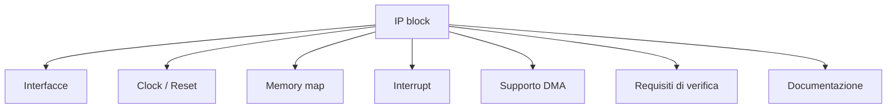
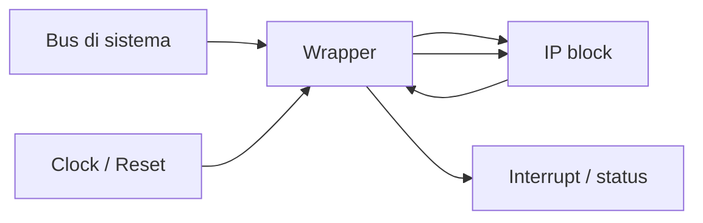
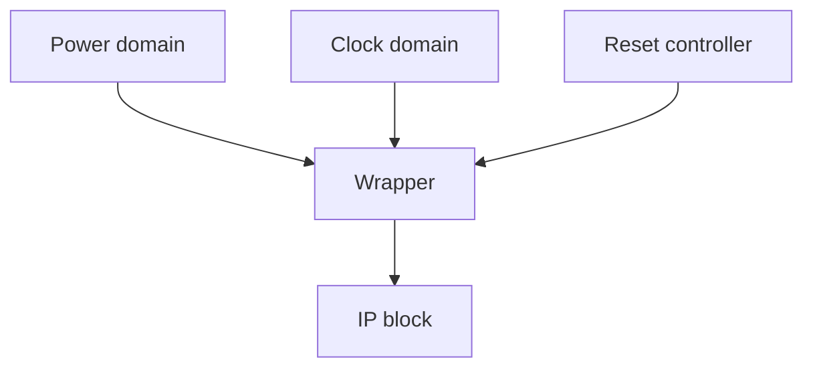
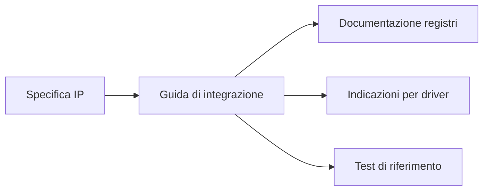
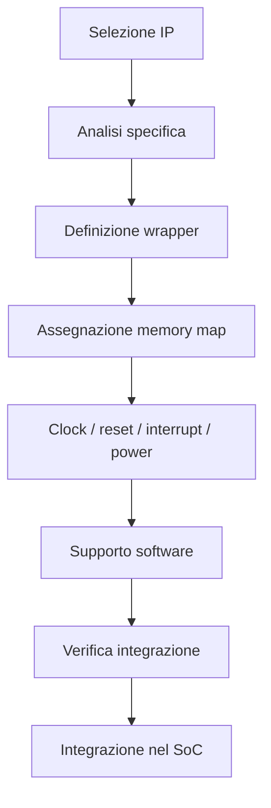

# Integrazione IP in un SoC

La progettazione di un **System on Chip (SoC)** raramente parte da zero.  
Nella pratica, un SoC viene costruito integrando una serie di **IP block** (*Intellectual Property blocks*), cioè moduli riusabili che implementano funzioni già progettate, verificate e spesso riutilizzate in più progetti.

Questi IP possono includere:

- core di processore;
- controller di memoria;
- periferiche standard;
- moduli di sicurezza;
- DMA;
- acceleratori hardware;
- blocchi custom sviluppati internamente;
- IP di terze parti.

L'integrazione degli IP è quindi una delle attività più importanti nella progettazione SoC, perché il valore del sistema non dipende solo dalla qualità dei singoli blocchi, ma soprattutto dalla capacità di farli lavorare insieme in modo corretto, efficiente e verificabile.

---

## 1. Che cosa si intende per IP

Un **IP block** è un blocco funzionale progettato per essere riutilizzato.  
Può essere consegnato in forme diverse:

- RTL sintetizzabile;
- netlist;
- macro fisica;
- modello comportamentale;
- blocco parametrico;
- subsystem già composto da più moduli.

Dal punto di vista del progettista SoC, un IP è un componente con:

- una funzione precisa;
- un'interfaccia definita;
- vincoli di integrazione;
- requisiti di clock, reset e power;
- documentazione tecnica;
- modalità di verifica raccomandate.

---

## 2. Perché usare IP

L'uso degli IP è fondamentale per ridurre:

- tempi di sviluppo;
- rischio progettuale;
- costo di implementazione;
- sforzo di validazione di funzioni standard.

Invece di riprogettare da zero una UART, un controller SPI o un DMA, si preferisce riutilizzare blocchi consolidati.

### Vantaggi principali

- maggiore velocità di sviluppo;
- riuso di componenti già verificati;
- standardizzazione delle funzioni di base;
- possibilità di concentrarsi sui blocchi davvero differenzianti;
- migliore scalabilità dei progetti.

### Possibili criticità

- interfacce non perfettamente allineate;
- documentazione incompleta;
- requisiti nascosti;
- problemi di versione;
- qualità eterogenea fra IP diversi;
- difficoltà di verifica a livello di sistema.

---

## 3. Tipologie di IP

Gli IP possono essere classificati secondo diversi criteri. Una distinzione molto utile è la seguente.

## 3.1 IP soft

Sono forniti tipicamente come RTL sintetizzabile.

### Vantaggi

- maggiore flessibilità;
- possibilità di adattamento;
- facilità di porting tra tecnologie diverse;
- maggiore osservabilità in verifica.

### Svantaggi

- qualità finale dipendente dal flusso di sintesi e implementazione;
- possibile maggiore effort di integrazione;
- performance fisiche non sempre predicibili a priori.

## 3.2 IP hard

Sono forniti come macro fisiche o implementazioni già ottimizzate.

Esempi:

- macro di memoria;
- PLL;
- PHY;
- blocchi analogici o mixed-signal;
- serializer/deserializer.

### Vantaggi

- prestazioni note e spesso ottimizzate;
- comportamento fisico più controllato;
- indispensabili per alcune funzioni.

### Svantaggi

- minore flessibilità;
- forti vincoli di integrazione fisica;
- dipendenza da tecnologia e processo.

## 3.3 IP firm

Sono una via intermedia: non completamente astratti come un soft IP, ma non rigidamente definiti come un hard IP.

---

## 4. Provenienza degli IP

Dal punto di vista organizzativo, gli IP possono provenire da fonti diverse.

## 4.1 IP sviluppati internamente

Sono blocchi creati all'interno dell'organizzazione.

### Vantaggi

- conoscenza diretta del design;
- maggiore controllo su modifiche ed evoluzioni;
- accesso al team che li ha sviluppati.

### Svantaggi

- qualità dipendente dalla maturità interna;
- possibile documentazione non uniforme;
- supporto variabile nel tempo.

## 4.2 IP di terze parti

Provengono da fornitori esterni.

### Vantaggi

- alta specializzazione;
- disponibilità di funzioni complesse già pronte;
- spesso lunga esperienza d'uso.

### Svantaggi

- minore visibilità interna sul funzionamento;
- limitazioni di licenza;
- debugging più difficile;
- dipendenza dal fornitore.

## 4.3 IP open-source

Sono sempre più presenti in alcuni flussi, soprattutto didattici o di ricerca.

### Vantaggi

- accessibilità;
- ispezionabilità;
- forte utilità didattica;
- facilità di sperimentazione.

### Svantaggi

- qualità variabile;
- supporto non garantito;
- copertura di verifica non sempre chiara;
- documentazione talvolta limitata.

---

## 5. Attività principali nell'integrazione IP

Integrare un IP non significa soltanto "collegarlo ai segnali".  
Le attività tipiche comprendono:

- analisi dell'interfaccia;
- adattamento al bus o all'interconnect;
- integrazione nella memory map;
- collegamento di clock e reset;
- gestione dei domini di alimentazione;
- definizione dei registri e del software associato;
- verifica funzionale;
- eventuale wrapping;
- validazione delle assunzioni del blocco nel contesto reale.

---

## 6. Analisi preliminare di un IP

Prima di integrare un blocco è necessario capirne bene le caratteristiche.

Una checklist minima dovrebbe includere:

- funzione del blocco;
- interfacce dati e controllo;
- protocollo bus usato;
- clock domain richiesti;
- reset richiesti;
- interrupt prodotti;
- eventuale supporto DMA;
- dipendenze da altri blocchi;
- vincoli temporali;
- note di integrazione e limitazioni note.

Questa fase è fondamentale per evitare errori che emergerebbero solo in fasi più costose del progetto.

---

## 7. Wrapping e adattamento

Molto spesso un IP non può essere inserito direttamente nel SoC così com'è.  
È necessario introdurre un **wrapper**, cioè un blocco di adattamento che renda l'IP compatibile con il contesto del sistema.

## 7.1 Funzioni tipiche di un wrapper

Un wrapper può servire a:

- adattare un protocollo bus;
- rinominare o riorganizzare segnali;
- uniformare la gestione di reset e clock;
- aggiungere registri di configurazione;
- gestire interrupt;
- isolare dettagli implementativi;
- integrare controlli di sicurezza o monitoraggio.

## 7.2 Perché il wrapper è utile

Il wrapper permette di:

- mantenere pulita l'architettura SoC;
- non modificare direttamente l'IP originale;
- semplificare la sostituzione di una versione futura;
- centralizzare adattamenti e controlli.

Dal punto di vista metodologico, è spesso una buona pratica evitare modifiche invasive all'IP e concentrare l'adattamento nel wrapper.

---

## 8. Adattamento delle interfacce

Gli IP possono differire su molti aspetti di interfaccia:

- protocollo bus;
- ampiezza dei dati;
- tipi di handshake;
- convenzioni di reset;
- semantica dei registri;
- gestione degli errori;
- interrupt level-based o pulse-based.

L'integrazione richiede quindi di verificare la compatibilità su più livelli.

## 8.1 Compatibilità di protocollo

Ad esempio:

- un IP può esporre un'interfaccia semplice a registri;
- il SoC può richiedere un'interfaccia APB o AXI-lite;
- un acceleratore può richiedere stream o handshake specializzati.

## 8.2 Compatibilità di ampiezza dati

Un blocco può lavorare a:

- 8 bit;
- 16 bit;
- 32 bit;
- 64 bit o più.

L'interconnect del SoC potrebbe avere una larghezza differente, richiedendo adattamento o allineamento.

## 8.3 Compatibilità temporale

Un IP può aspettarsi:

- accessi sincroni;
- latenze limitate;
- segnali stabili per più cicli;
- politiche di reset specifiche.

Questi aspetti devono essere verificati con cura.

---

## 9. Integrazione nella memory map

Gli IP memory-mapped devono essere collocati in modo ordinato nello spazio di indirizzamento.

Questo comporta:

- assegnazione di un range di indirizzi;
- allineamento corretto dei registri;
- definizione di accessi consentiti;
- documentazione per il software;
- prevenzione di conflitti con altri blocchi.

Esempio semplificato:

| Base address | Dimensione | IP |
|---|---|---|
| `0x2000_0000` | `4 KB` | GPIO |
| `0x2000_1000` | `4 KB` | UART |
| `0x2000_2000` | `4 KB` | Timer |
| `0x2000_3000` | `4 KB` | IP custom |

La memory map deve rimanere:

- leggibile;
- estendibile;
- coerente con il software di basso livello;
- stabile, per quanto possibile, fra versioni successive.

---

## 10. Clock, reset e power integration

Molti problemi di integrazione nascono non dall'interfaccia funzionale, ma da segnali di infrastruttura.

## 10.1 Clock

Occorre verificare:

- frequenza richiesta;
- dominio di clock di appartenenza;
- presenza di segnali enable;
- necessità di crossing fra domini differenti.

## 10.2 Reset

È importante chiarire:

- reset sincrono o asincrono;
- polarità attiva;
- ordine di rilascio;
- dipendenze da altri blocchi;
- comportamento durante warm reset o soft reset.

## 10.3 Power

Nei SoC più complessi è necessario valutare:

- dominio di alimentazione dell'IP;
- necessità di isolation;
- retention dei registri;
- sequenze di accensione e spegnimento;
- stato del blocco quando il dominio non è attivo.

---

## 11. Interrupt, eventi e status

Un IP può generare:

- interrupt verso la CPU;
- segnali di stato;
- segnalazioni di errore;
- trigger verso DMA o altri blocchi.

Durante l'integrazione bisogna definire:

- dove collegare gli interrupt;
- come mascherarli;
- come renderli visibili al software;
- come pulire gli eventi pendenti;
- come trattare gli errori persistenti.

Una gestione poco chiara di interrupt e status è una delle cause più comuni di bug in bring-up.

---

## 12. Integrazione con il software

Un IP integrato correttamente a livello hardware non è ancora veramente "integrato" finché non esiste una strategia software coerente.

Servono tipicamente:

- definizione dei registri accessibili;
- header o descrizione dei registri;
- driver bare-metal o supporto firmware;
- eventuali test di bring-up;
- gestione degli interrupt;
- documentazione delle sequenze di inizializzazione.

Dal punto di vista didattico, questo è un punto chiave: l'integrazione IP è sempre anche un'attività di **co-design hardware/software**.

---

## 13. Parametrizzazione e configurabilità

Molti IP moderni sono **parametrici**.  
Ad esempio, possono essere configurati per:

- larghezza dati;
- profondità delle FIFO;
- numero di canali;
- presenza o assenza di interrupt;
- supporto DMA;
- ampiezza degli indirizzi;
- modalità operative.

### Vantaggi della parametrizzazione

- riuso più efficace;
- adattamento a progetti diversi;
- ottimizzazione dell'area o delle prestazioni.

### Rischi

- esplosione delle combinazioni da verificare;
- documentazione più difficile;
- configurazioni formalmente ammesse ma poco testate;
- maggiore rischio di mismatch fra hardware e software.

Per questo è importante limitare e controllare le configurazioni realmente supportate nel progetto SoC.

---

## 14. Versioning e configurazione di sistema

In un SoC reale non basta sapere "quale IP" è presente: bisogna sapere **quale versione**, con **quali parametri** e in **quale configurazione**.

Occorre quindi tenere traccia di:

- revisione dell'IP;
- patch applicate;
- parametri scelti;
- wrapper associato;
- note di integrazione;
- eventuali bug noti;
- stato di verifica.

Questo è essenziale per:

- reproducibility del progetto;
- debug;
- regression testing;
- manutenzione nel tempo.

---

## 15. Documentazione di integrazione

Ogni IP dovrebbe essere accompagnato da una documentazione minima di integrazione.

Un documento utile dovrebbe includere:

- scopo del blocco;
- versione;
- interfacce;
- clock e reset;
- memory map;
- registri;
- interrupt;
- dipendenze;
- flussi di inizializzazione;
- limitazioni note;
- test o casi d'uso raccomandati.

Una documentazione scarsa aumenta drasticamente il rischio di errori, anche se l'IP in sé è corretto.

---

## 16. Verifica dell'integrazione

Anche un IP già verificato può fallire quando viene inserito nel SoC.  
Per questo serve una fase specifica di **integrazione e verifica di sistema**.

## 16.1 Obiettivi della verifica di integrazione

Verificare che:

- i collegamenti siano corretti;
- i registri siano accessibili;
- clock e reset funzionino come atteso;
- interrupt e DMA siano coerenti;
- il software riesca a inizializzare il blocco;
- i casi d'uso principali siano operativi.

## 16.2 Casi tipici da testare

- reset e uscita dal reset;
- accessi base ai registri;
- configurazione nominale;
- gestione errori;
- traffico concorrente;
- sequenze di power on/off, se applicabili;
- interazione con driver software.

## 16.3 Perché la verifica di integrazione è diversa dalla verifica dell'IP

La verifica del singolo IP dimostra che il blocco funziona **in un contesto controllato**.  
La verifica di integrazione dimostra che il blocco funziona **nel contesto reale del SoC**, dove esistono:

- contesa sul bus;
- clock domain multipli;
- reset complessi;
- software concorrente;
- dipendenze da altri sottosistemi.

---

## 17. Rischi frequenti nell'integrazione IP

Tra i problemi più comuni:

- mismatch fra protocollo previsto e protocollo reale del bus;
- errata gestione di reset;
- registri mappati male;
- interrupt non puliti correttamente;
- clock domain crossing non gestiti;
- documentazione incompleta;
- differenze tra versione attesa e versione integrata;
- parametri inconsistenti con il software;
- assunzioni implicite dell'IP non rispettate dal SoC.

Molti di questi errori non emergono immediatamente, ma durante bring-up o test di sistema.

---

## 18. Esempio di flusso di integrazione

Un flusso semplificato di integrazione IP può essere il seguente:

Questo schema evidenzia che l'integrazione non è un singolo passo, ma una sequenza metodica di attività.

---

## 19. Collegamento con FPGA

Nel contesto FPGA, l'integrazione IP è una pratica quotidiana:

- IP standard di comunicazione;
- controller memoria;
- softcore processor;
- blocchi custom memory-mapped;
- IP di vendor per clocking o debug.

La FPGA è molto utile per:

- validare i wrapper;
- verificare mappe registri;
- sviluppare i driver;
- fare bring-up rapido;
- osservare problemi di integrazione prima del tape-out ASIC.

---

## 20. Collegamento con ASIC

Nel contesto ASIC, l'integrazione IP ha implicazioni ancora più ampie:

- vincoli fisici degli hard macro;
- floorplanning;
- distribuzione clock e reset;
- power domains;
- verifiche fisiche e timing;
- DFT e testabilità.

Per questo l'integrazione degli IP è una disciplina che collega direttamente architettura, RTL, verifica e physical design.

---

## 21. In sintesi

L'integrazione IP è il processo attraverso cui blocchi riusabili, spesso eterogenei, vengono trasformati in un sottosistema coerente all'interno del SoC.  
Per farlo bene è necessario controllare con attenzione:

- interfacce;
- wrapper;
- memory map;
- clock, reset e power;
- interrupt e DMA;
- software di supporto;
- documentazione;
- verifica di integrazione.

Un SoC robusto non nasce solo da buoni IP, ma da una metodologia di integrazione chiara, disciplinata e ben documentata.

---

## Prossimo passo

Dopo l'integrazione dei blocchi, il passo successivo naturale è affrontare la **verifica di sistema**, cioè il modo in cui si dimostra che l'intero SoC funziona correttamente come insieme e non soltanto a livello di singoli moduli.
