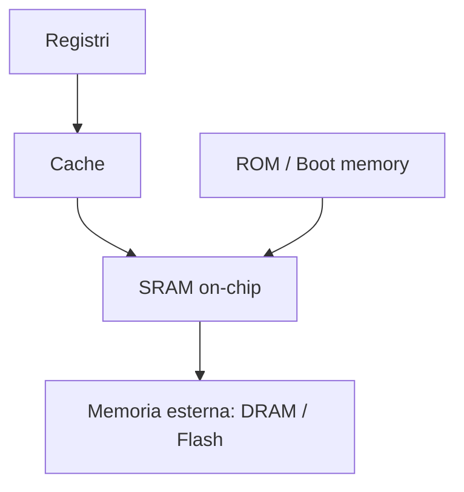
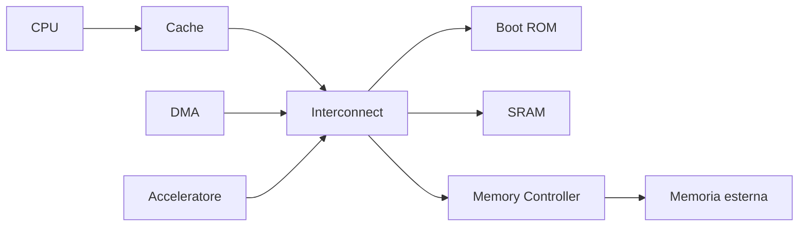
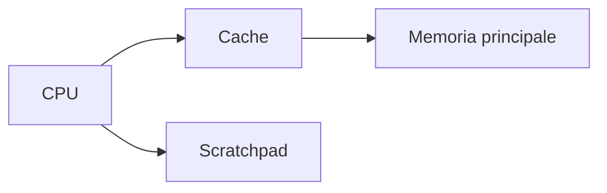
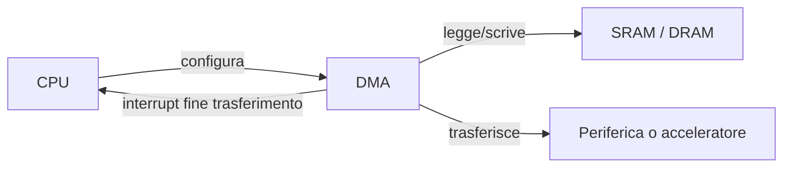
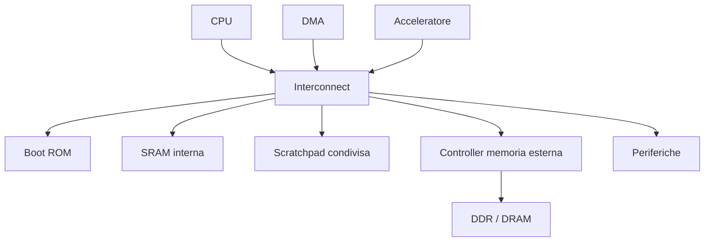

# Memorie e gerarchia della memoria in un SoC

La memoria è uno degli elementi più importanti nella progettazione di un **System on Chip (SoC)**.  
Anche quando il processore, il bus e gli acceleratori sono ben progettati, il sistema può risultare inefficiente se la **gerarchia di memoria** non è coerente con i requisiti applicativi.

In un SoC, la memoria non è un blocco unico, ma un insieme di risorse con caratteristiche differenti in termini di:

- capacità;
- latenza;
- banda;
- area;
- consumi;
- costo;
- prevedibilità temporale.

L'obiettivo della gerarchia di memoria è fornire il dato giusto, al blocco giusto, nel momento giusto, con il miglior compromesso possibile fra prestazioni ed efficienza.

---

## 1. Perché la memoria è centrale

Ogni sottosistema di un SoC dipende dalla memoria:

- la **CPU** legge istruzioni e dati;
- le **periferiche** scambiano dati con buffer e registri;
- i **DMA** trasferiscono blocchi di dati;
- gli **acceleratori** richiedono input e producono output;
- il **firmware di boot** risiede in memorie dedicate;
- il **software** si appoggia a stack, heap e regioni di configurazione.

Molto spesso il collo di bottiglia di un SoC non è la capacità di calcolo, ma la capacità di:

- leggere i dati abbastanza rapidamente;
- scriverli senza congestione;
- conservarli in una struttura efficiente;
- renderli accessibili con una latenza accettabile.

---

## 2. Il concetto di gerarchia di memoria

La gerarchia di memoria nasce dal fatto che non esiste una memoria ideale che sia contemporaneamente:

- molto capiente;
- velocissima;
- poco costosa;
- poco energivora;
- semplice da integrare.

Per questo si usano livelli diversi di memoria, ciascuno ottimizzato per uno scopo.

In generale:

- i livelli più vicini al processore sono più rapidi ma più piccoli;
- i livelli più lontani sono più capienti ma più lenti;
- il software e l'hardware devono cooperare per usare bene questi livelli.

---

## 3. Tipologie principali di memoria in un SoC

## 3.1 Registri

I **registri** sono la forma di memoria più vicina al calcolo.

Caratteristiche:

- capacità molto ridotta;
- latenza minima;
- accesso estremamente rapido;
- costo elevato in area per bit.

Sono usati per:

- operandi della CPU;
- registri di stato;
- configurazione rapida;
- temporanei interni al datapath.

## 3.2 Cache

Le **cache** sono memorie veloci che riducono il tempo medio di accesso ai dati più frequentemente usati.

Caratteristiche:

- capacità limitata rispetto alla memoria principale;
- latenza inferiore rispetto a SRAM più grandi o DRAM esterne;
- gestione automatica da parte dell'hardware, in molti casi;
- possibile complessità per coerenza e prevedibilità.

Sono tipiche di SoC con microprocessori o sistemi più software-intensive.

## 3.3 SRAM on-chip

La **SRAM** interna è una memoria molto comune nei SoC.

Caratteristiche:

- accesso relativamente rapido;
- buona integrazione on-chip;
- capacità intermedia;
- area significativa.

È usata per:

- memoria dati;
- memoria istruzioni;
- buffer;
- scratchpad;
- code e strutture temporanee;
- regioni condivise fra CPU e acceleratori.

## 3.4 ROM o memoria di boot

La memoria di boot contiene tipicamente:

- il codice iniziale di avvio;
- routine minime di inizializzazione;
- eventuali configurazioni di sicurezza;
- vettori di reset.

Caratteristiche:

- contenuto stabile;
- capacità limitata;
- ruolo essenziale nel bring-up del sistema.

## 3.5 Memoria esterna

Nei SoC più ricchi si usano memorie esterne, ad esempio:

- DRAM;
- SDRAM;
- DDR;
- flash seriale o parallela;
- eMMC o storage equivalenti, a livello di sistema.

Caratteristiche:

- grande capacità;
- latenza superiore;
- controller dedicato necessario;
- maggiore complessità di sistema.

---

## 4. Visione architetturale della memoria

Dal punto di vista del SoC, la memoria non è solo una risorsa passiva: è parte integrante dell'architettura.

Le scelte principali riguardano:

- quali memorie integrare on-chip;
- quali memorie lasciare esterne;
- come distribuire i buffer;
- se usare cache o scratchpad;
- come collegare memoria e acceleratori;
- quanto traffico deve sostenere l'interconnect.

---

## 5. Parametri fondamentali

Quando si progetta la memoria di un SoC occorre valutare alcuni parametri chiave.

## 5.1 Capacità

Indica quanto dato può essere memorizzato.

Una capacità maggiore consente:

- dataset più grandi;
- minore dipendenza da trasferimenti frequenti;
- più flessibilità per il software.

Tuttavia, aumenta:

- area;
- costo;
- in molti casi consumi.

## 5.2 Latenza

È il tempo necessario per ottenere il dato richiesto.

La latenza è critica quando:

- la CPU ha dipendenze strette;
- un acceleratore richiede dati a ritmo regolare;
- il sistema ha vincoli real-time.

## 5.3 Banda

È la quantità di dati trasferibili nell'unità di tempo.

La banda diventa essenziale per:

- DMA;
- elaborazione di segnali;
- video;
- AI inference;
- accessi concorrenti di più blocchi.

## 5.4 Area

Le memorie occupano una parte importante del chip. In molti SoC, una quota significativa dell'area è dovuta proprio a:

- SRAM;
- cache;
- buffer;
- macro di memoria dedicate.

## 5.5 Consumi

L'accesso alla memoria può incidere molto sul consumo totale del sistema.  
Non conta solo la dimensione della memoria, ma anche:

- frequenza di accesso;
- ampiezza dei trasferimenti;
- pattern di lettura e scrittura;
- traffico generato dai bus.

## 5.6 Prevedibilità

In sistemi embedded e real-time non conta solo la velocità media, ma anche la **deterministicità**.

Ad esempio:

- una cache può migliorare le prestazioni medie;
- ma può anche rendere meno prevedibile il worst-case timing.

---

## 6. Cache e scratchpad

Una scelta architetturale importante è decidere se usare cache, scratchpad o una combinazione delle due.

## 6.1 Cache

La cache memorizza automaticamente i dati più probabili da riutilizzare.

### Vantaggi

- migliora le prestazioni medie;
- riduce l'impatto della memoria esterna;
- è molto utile per software complesso e carichi generici.

### Svantaggi

- comportamento meno prevedibile;
- complessità maggiore;
- possibili problemi di coerenza;
- verifica più articolata.

## 6.2 Scratchpad memory

La **scratchpad** è una memoria gestita esplicitamente dal software o da logiche dedicate.

### Vantaggi

- elevata prevedibilità;
- controllo esplicito sui dati residenti;
- utile per sistemi real-time o acceleratori.

### Svantaggi

- richiede maggiore gestione software;
- meno trasparente rispetto alla cache;
- rischio di uso inefficiente se non ben progettata.

In molti casi la scelta dipende dal tipo di applicazione:

- software general-purpose → cache molto utile;
- sistemi deterministici o acceleratori → scratchpad spesso preferibile.

---

## 7. Memorie condivise e memorie locali

In un SoC i dati possono essere collocati in memorie:

- **locali** a un sottosistema;
- **condivise** fra più blocchi.

## 7.1 Memoria locale

È vicina a uno specifico blocco, ad esempio:

- buffer interni a un acceleratore;
- memoria locale di un DSP;
- SRAM privata di una CPU.

### Vantaggi

- latenza ridotta;
- traffico sull'interconnect minore;
- migliore isolamento funzionale.

### Svantaggi

- duplicazione dei dati possibile;
- minore flessibilità;
- complessità nella sincronizzazione.

## 7.2 Memoria condivisa

È accessibile da più initiator, ad esempio:

- CPU;
- DMA;
- acceleratori;
- sottosistemi di I/O.

### Vantaggi

- facilita lo scambio dati;
- riduce copie inutili;
- semplifica alcune architetture software.

### Svantaggi

- aumenta la contesa;
- richiede arbitraggio;
- può introdurre problemi di coerenza o sincronizzazione.

---

## 8. Memoria e DMA

Il **Direct Memory Access (DMA)** ha un ruolo centrale nella gestione efficiente dei dati.

Senza DMA:

- la CPU deve leggere e scrivere direttamente i dati;
- aumenta il carico di elaborazione;
- peggiorano prestazioni e consumi.

Con DMA:

- i blocchi di dati vengono trasferiti automaticamente;
- la CPU si occupa solo di configurazione e sincronizzazione;
- l'uso della banda di memoria può essere più efficiente.

La presenza del DMA influisce sulla gerarchia di memoria perché:

- aumenta il numero di master che accedono alla memoria;
- richiede banda sostenuta;
- può introdurre contesa con la CPU.

---

## 9. Controller di memoria esterna

Quando il SoC usa DRAM o altre memorie esterne, serve un **memory controller** dedicato.

Questo blocco si occupa di:

- tradurre le richieste del bus interno;
- gestire il protocollo della memoria esterna;
- ottimizzare scheduling e accessi;
- gestire timing, burst e inizializzazione.

Il controller di memoria è spesso un punto critico del SoC perché condiziona:

- throughput complessivo;
- latenza media;
- efficienza dell'uso della memoria esterna.

---

## 10. Memory map

In molti SoC, memorie e periferiche sono collocate in uno **spazio di indirizzamento unificato**.

Esempio semplificato:

| Intervallo indirizzi | Risorsa |
|---|---|
| `0x0000_0000 - 0x0000_FFFF` | Boot ROM |
| `0x1000_0000 - 0x1001_FFFF` | SRAM interna |
| `0x2000_0000 - 0x2000_0FFF` | GPIO |
| `0x2000_1000 - 0x2000_1FFF` | UART |
| `0x3000_0000 - 0x300F_FFFF` | Scratchpad / buffer condivisi |
| `0x4000_0000 - 0x4FFF_FFFF` | Memoria esterna |

Una buona memory map deve essere:

- ordinata;
- estendibile;
- ben documentata;
- allineata con i driver software;
- coerente con la segmentazione del sistema.

---

## 11. Coerenza e sincronizzazione

Quando più blocchi accedono agli stessi dati, occorre prestare attenzione a:

- ordine degli accessi;
- aggiornamento dei buffer;
- dati vecchi o non ancora scritti;
- invalidazione di copie locali;
- interazione fra cache e DMA.

In sistemi semplici questo può essere gestito con:

- polling;
- interrupt;
- barriere software;
- protocolli di handshake.

In sistemi più avanzati entrano in gioco anche meccanismi di coerenza hardware.

Per una trattazione introduttiva è sufficiente sottolineare che **la condivisione della memoria richiede sempre una strategia di sincronizzazione chiara**.

---

## 12. Memoria e software di sistema

La gerarchia di memoria è fortemente legata al software.

Il firmware e il sistema operativo devono sapere, almeno concettualmente:

- dove risiede il codice di boot;
- dove collocare stack e heap;
- quali regioni sono usate dalle periferiche;
- dove si trovano i buffer DMA;
- quali memorie sono cacheabili e quali no;
- quali regioni devono essere protette o isolate.

Per questo la progettazione della memoria non può essere separata dal **co-design hardware/software**.

---

## 13. Trade-off architetturali tipici

La progettazione della memoria è sempre una questione di compromessi.

## 13.1 Più SRAM on-chip o più dipendenza dalla memoria esterna?

Più SRAM interna significa:

- latenza minore;
- maggiore autonomia;
- prestazioni migliori.

Ma significa anche:

- più area;
- più costo di integrazione.

## 13.2 Cache o scratchpad?

- cache: migliore trasparenza e prestazioni medie;
- scratchpad: maggiore controllo e prevedibilità.

## 13.3 Buffer locali o memoria condivisa?

- buffer locali: più efficienza locale;
- memoria condivisa: maggiore flessibilità di sistema.

## 13.4 Larghezza del bus e organizzazione dei burst

Bus più larghi e burst più lunghi possono migliorare il throughput, ma aumentano:

- area;
- consumo;
- complessità del controller;
- impatto su contesa e fairness.

---

## 14. Errori frequenti nella progettazione della memoria

Tra gli errori più comuni:

- sottostimare il fabbisogno di banda;
- affidarsi troppo alla memoria esterna;
- inserire cache senza considerare la prevedibilità;
- non pianificare i buffer per DMA e acceleratori;
- rendere la memory map poco chiara;
- ignorare la contesa fra CPU, DMA e acceleratori;
- non considerare abbastanza presto i consumi dovuti agli accessi.

---

## 15. Collegamento con FPGA

Nel contesto FPGA, il tema delle memorie emerge in modo molto concreto:

- block RAM;
- distributed RAM;
- buffer per stream;
- memorie esterne collegate alla scheda;
- prototipazione di architetture con processore softcore o hard processor.

La FPGA è utile per verificare:

- dimensionamento dei buffer;
- compatibilità con il software;
- comportamento dei DMA;
- impatto di diverse scelte di memoria sul throughput.

---

## 16. Collegamento con ASIC

Nel contesto ASIC, la memoria incide profondamente su:

- area totale del chip;
- floorplanning;
- consumo dinamico;
- distribuzione del clock;
- congestione del routing;
- tempi di accesso e chiusura temporale.

Per questo la scelta delle memorie deve essere fatta molto presto e con piena consapevolezza delle conseguenze fisiche.

---

## 17. Esempio di gerarchia di memoria in un SoC didattico

Un SoC didattico potrebbe essere organizzato così:

In questo esempio:

- la **ROM** contiene il codice di boot;
- la **SRAM** serve per dati e codice iniziale;
- la **scratchpad** è una regione condivisa per acceleratori o DMA;
- la **memoria esterna** offre capacità elevata;
- l'**interconnect** coordina tutti gli accessi.

---

## 18. In sintesi

La memoria in un SoC non è soltanto un supporto per i dati: è una parte essenziale dell'architettura di sistema.  
Una buona gerarchia di memoria deve bilanciare:

- capacità;
- latenza;
- banda;
- area;
- consumi;
- prevedibilità.

Le scelte fra ROM, SRAM, cache, scratchpad e memoria esterna devono sempre essere fatte considerando insieme:

- requisiti applicativi;
- architettura del SoC;
- software di sistema;
- implementazione fisica.

---

## Prossimo passo

Dopo aver visto dove risiedono i dati e come sono organizzati, il passo successivo naturale è studiare le **periferiche e l'I/O**, cioè il modo in cui il SoC interagisce con il mondo esterno e con i sottosistemi di controllo.
