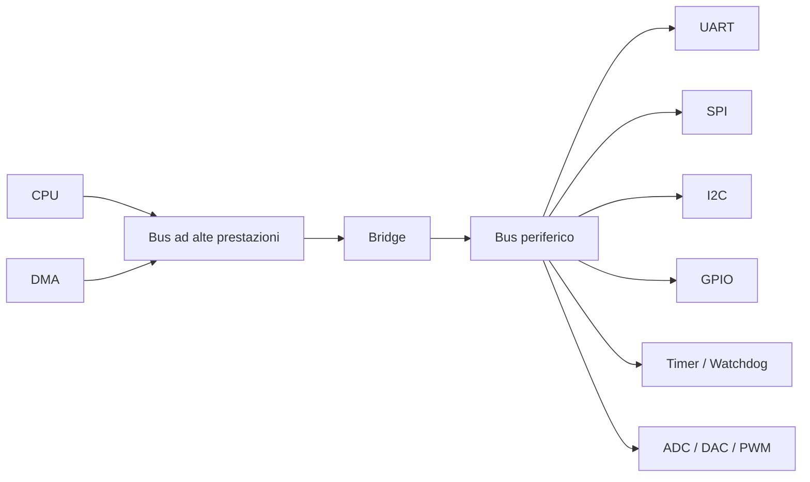
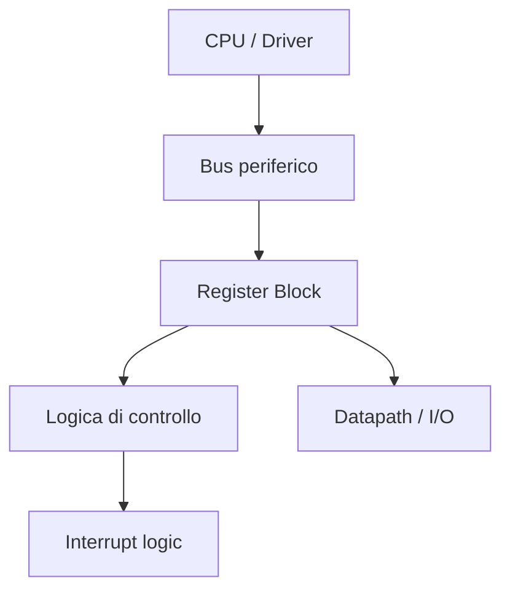
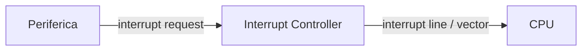
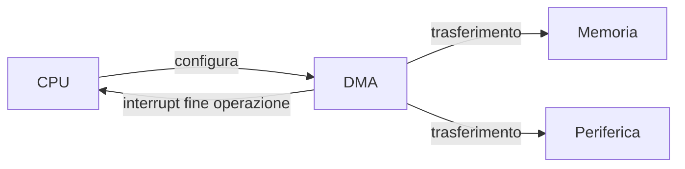
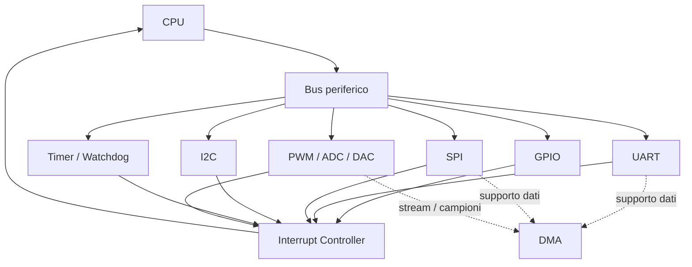

# Periferiche e I/O in un SoC

Le **periferiche** rappresentano il punto di contatto tra il **System on Chip (SoC)** e il mondo esterno, ma anche tra il processore e sottosistemi interni specializzati.  
In un progetto SoC, le periferiche non sono semplici "accessori": costituiscono una parte essenziale dell'architettura, perché permettono di:

- acquisire dati da sensori o dispositivi esterni;
- comandare attuatori;
- comunicare con altri circuiti;
- generare eventi temporali;
- gestire errori, stato e diagnostica;
- trasferire dati fra memoria e interfacce.

Dal punto di vista architetturale, la progettazione delle periferiche coinvolge contemporaneamente:

- organizzazione dei registri;
- scelta del bus di collegamento;
- gestione delle interruzioni;
- sincronizzazione con il software;
- eventuale supporto DMA;
- requisiti di latenza, banda e affidabilità.

---

## 1. Il ruolo delle periferiche in un SoC

Un SoC non è utile solo perché contiene capacità di calcolo, ma perché può **interagire** con l'ambiente e con il sistema in cui è inserito.

Le periferiche svolgono quindi funzioni come:

- **input/output digitale**, ad esempio GPIO;
- **comunicazione seriale**, ad esempio UART, SPI, I²C;
- **temporizzazione**, ad esempio timer e watchdog;
- **movimentazione dati**, ad esempio controller DMA;
- **acquisizione o generazione di segnali**, ad esempio ADC, DAC, PWM;
- **monitoraggio e controllo**, ad esempio registri di stato, fault monitor, sensori interni;
- **accesso a memorie o dispositivi esterni**, ad esempio controller flash o interfacce dedicate.

In molti sistemi embedded, la qualità della progettazione delle periferiche determina direttamente la qualità del prodotto finale.

---

## 2. Collocazione architetturale delle periferiche

Le periferiche sono di norma collegate al SoC tramite il sottosistema di interconnessione, spesso su un bus dedicato alle funzioni di controllo.

Questa struttura è molto comune perché:

- isola il traffico di controllo da quello ad alta banda;
- semplifica l'interfacciamento delle periferiche lente;
- riduce la complessità delle periferiche stesse;
- mantiene ordinata la memory map.

---

## 3. Classificazione delle periferiche

Le periferiche possono essere classificate in modi diversi. Una distinzione utile è quella per funzione.

## 3.1 Periferiche di comunicazione

Servono a scambiare dati con dispositivi esterni o con altri componenti di sistema.

Esempi:

- UART;
- SPI;
- I²C;
- CAN;
- USB, in SoC più complessi;
- Ethernet, nei sistemi di comunicazione.

## 3.2 Periferiche di controllo e temporizzazione

Servono a governare il comportamento temporale del sistema.

Esempi:

- timer;
- contatori;
- watchdog;
- RTC;
- PWM.

## 3.3 Periferiche di input/output generico

Consentono interazioni digitali semplici.

Esempi:

- GPIO;
- linee di interrupt esterne;
- porte di controllo.

## 3.4 Periferiche di acquisizione o attuazione

Interfacciano grandezze fisiche o moduli mixed-signal.

Esempi:

- ADC;
- DAC;
- comparatori;
- controller per sensori;
- interfacce verso attuatori.

## 3.5 Periferiche orientate al trasferimento dati

Movimentano dati o semplificano il traffico nel sistema.

Esempi:

- DMA;
- controller di memoria;
- FIFO di comunicazione;
- buffer controller.

---

## 4. Memory-mapped I/O

La maggior parte delle periferiche in un SoC viene controllata tramite **memory-mapped I/O**.

Questo significa che ogni periferica espone un insieme di **registri** accessibili attraverso indirizzi di memoria dedicati.  
Dal punto di vista del software, leggere o scrivere una periferica equivale a leggere o scrivere una regione della memory map.

Esempio semplificato:

| Indirizzo | Registro | Funzione |
|---|---|---|
| `0x2000_1000` | `CTRL` | abilitazione e configurazione |
| `0x2000_1004` | `STATUS` | stato della periferica |
| `0x2000_1008` | `DATA_TX` | dato da trasmettere |
| `0x2000_100C` | `DATA_RX` | dato ricevuto |

Questo approccio è molto diffuso perché:

- uniforma l'interfaccia hardware/software;
- semplifica il software di basso livello;
- si integra bene con i bus di sistema;
- rende chiara la documentazione dei registri.

---

## 5. Registri delle periferiche

La qualità di una periferica dipende molto da come sono progettati i suoi registri.

## 5.1 Tipologie di registri

Una periferica espone tipicamente registri di:

- **controllo**, per abilitare o configurare;
- **stato**, per riportare condizioni operative o errori;
- **dati**, per leggere o scrivere payload;
- **interrupt**, per notifiche ed eventi;
- **configurazione avanzata**, per clock divider, modalità operative, soglie.

## 5.2 Buone pratiche nella progettazione dei registri

È opportuno che i registri siano:

- ben documentati;
- consistenti nella nomenclatura;
- allineati e ordinati nella memory map;
- progettati con semantica chiara dei bit;
- semplici da usare da parte del firmware.

Ad esempio, conviene evitare:

- campi con significato ambiguo;
- bit con effetti collaterali poco chiari;
- registri troppo densi o poco leggibili;
- comportamenti differenti fra periferiche simili.

## 5.3 Esempio concettuale di blocco registri

---

## 6. Periferiche sincrone e asincrone

Le periferiche non operano tutte nello stesso modo rispetto al clock del SoC.

## 6.1 Periferiche sincrone al clock di sistema

Sono blocchi che operano internamente nello stesso dominio di clock del bus o del processore.

### Vantaggi

- integrazione più semplice;
- timing più diretto;
- meno problemi di sincronizzazione.

### Svantaggi

- minore flessibilità se l'interfaccia esterna ha tempi diversi.

## 6.2 Periferiche con domini di clock differenti

Molte periferiche, specialmente di comunicazione, interagiscono con segnali esterni che non sono allineati al clock interno.

Questo richiede:

- sincronizzatori;
- FIFO asincrone;
- gestione accurata dei crossing fra domini;
- attenzione a metastabilità e latenza.

La presenza di periferiche asincrone rende il sottosistema I/O un punto delicato della progettazione SoC.

---

## 7. Interrupt

Le **interruzioni** permettono alle periferiche di notificare eventi al processore senza ricorrere a polling continuo.

Una periferica può generare un interrupt, ad esempio, quando:

- ha ricevuto un dato;
- ha terminato una trasmissione;
- si è verificato un errore;
- è scaduto un timer;
- si è concluso un trasferimento DMA.

## 7.1 Vantaggi delle interruzioni

- riducono il carico di polling sulla CPU;
- migliorano la reattività del sistema;
- permettono una gestione più efficiente degli eventi.

## 7.2 Aspetti progettuali

Occorre definire con attenzione:

- priorità degli interrupt;
- mascheramento;
- gestione di eventi simultanei;
- registri di pending e clear;
- latenza massima accettabile.

---

## 8. Polling vs interrupt

Le periferiche possono essere gestite in due modi principali.

## 8.1 Polling

La CPU controlla periodicamente lo stato della periferica leggendo un registro.

### Vantaggi

- estrema semplicità;
- buona visibilità del flusso software;
- utile in sistemi molto piccoli o durante bring-up.

### Svantaggi

- inefficiente;
- può sprecare cicli CPU;
- poco scalabile con molte periferiche.

## 8.2 Interrupt-driven I/O

La periferica segnala alla CPU quando è necessario intervenire.

### Vantaggi

- migliore efficienza;
- più adatto a sistemi con eventi sporadici;
- riduce il lavoro inutile del software.

### Svantaggi

- software più articolato;
- necessità di gestire priorità e concorrenza;
- maggiore complessità di verifica.

---

## 9. Periferiche e DMA

Per periferiche che movimentano molti dati, il solo intervento della CPU può essere inefficiente. In questi casi si usa spesso il **DMA**.

Esempi tipici:

- ricezione o trasmissione di stream;
- acquisizione da ADC;
- trasferimenti verso buffer di memoria;
- movimentazione dati da e verso acceleratori.

Il supporto DMA richiede che la periferica sia progettata in modo coerente con:

- buffer interni;
- segnali di handshake;
- eventi di fine trasferimento;
- requisiti di banda;
- sincronizzazione con il software.

---

## 10. Periferiche lente e periferiche veloci

Dal punto di vista architetturale, è utile distinguere fra periferiche con carico leggero e periferiche con carico significativo.

## 10.1 Periferiche lente

Esempi:

- GPIO;
- UART a bassa velocità;
- timer;
- watchdog;
- piccoli controller di configurazione.

Caratteristiche:

- traffico modesto;
- registri semplici;
- protocollo bus leggero sufficiente.

## 10.2 Periferiche veloci o ad alto traffico

Esempi:

- interfacce di streaming;
- acquisizione dati;
- controller di rete;
- sottosistemi video o audio;
- interfacce verso acceleratori.

Caratteristiche:

- banda elevata;
- spesso necessità di DMA;
- buffer più complessi;
- maggiore sensibilità a latenza e congestione.

Questa distinzione è importante per decidere:

- quale bus usare;
- dove collocare la periferica;
- quanto buffering inserire;
- come gestire gli interrupt.

---

## 11. Esempi di periferiche comuni

## 11.1 GPIO

La periferica più semplice per l'I/O digitale.

Funzioni tipiche:

- configurazione input/output;
- lettura del livello logico;
- scrittura di uscite;
- gestione di interrupt su fronte o livello.

È utile per controllo semplice, test e integrazione di segnali discreti.

## 11.2 UART

Usata per comunicazioni seriali asincrone.

Funzioni tipiche:

- trasmissione e ricezione seriale;
- registri dati e stato;
- baud rate generator;
- interrupt su dato ricevuto o trasmissione completata.

Spesso è una delle prime periferiche usate nel bring-up, perché permette debug e logging.

## 11.3 SPI

Interfaccia seriale sincrona adatta a collegare dispositivi esterni come:

- sensori;
- memorie flash;
- convertitori;
- moduli di espansione.

Richiede la gestione di:

- clock seriale;
- chip select;
- formato frame;
- eventuali FIFO;
- sincronizzazione fra trasmissione e ricezione.

## 11.4 I²C

Interfaccia seriale a due fili molto usata per configurazione e dispositivi a bassa velocità.

Richiede particolare attenzione a:

- gestione del protocollo;
- acknowledgments;
- indirizzamento dei dispositivi;
- timing sul bus condiviso.

## 11.5 Timer e watchdog

I timer servono per:

- misurare intervalli;
- generare eventi periodici;
- realizzare timebase di sistema;
- schedulare attività.

Il watchdog serve invece a rilevare condizioni anomale, imponendo un reset o una segnalazione se il software non risponde correttamente.

## 11.6 PWM

Usata per controllare attuatori o generare segnali modulati, ad esempio per:

- motori;
- LED;
- controllo di potenza;
- attuazione industriale.

---

## 12. Aspetti software delle periferiche

Le periferiche esistono solo in parte come blocchi hardware: per essere utili, devono essere supportate dal software.

Il software di basso livello deve tipicamente occuparsi di:

- inizializzazione;
- configurazione dei registri;
- gestione degli eventi;
- lettura e scrittura dati;
- trattamento degli errori;
- sincronizzazione con interrupt o DMA.

Per questo è fondamentale che l'hardware offra:

- registri ordinati e coerenti;
- segnali di stato chiari;
- eventi ben definiti;
- meccanismi di reset e recovery puliti.

---

## 13. Verifica delle periferiche

Le periferiche vanno verificate non solo a livello di singolo blocco, ma anche nel contesto del SoC.

Aspetti da verificare:

- correttezza dei registri;
- accessi read/write;
- comportamento in reset;
- generazione e gestione degli interrupt;
- compatibilità col bus;
- gestione di errori e condizioni limite;
- correttezza sotto traffico reale o quasi reale.

Per periferiche importanti conviene verificare anche:

- interazione con driver software;
- funzionamento con DMA;
- comportamento in presenza di clock domain crossing;
- recovery da fault o timeout.

---

## 14. Errori frequenti nella progettazione delle periferiche

Tra gli errori più comuni:

- registri poco chiari o mal documentati;
- semantica incoerente dei bit;
- interrupt difficili da gestire;
- assenza di buffering dove necessario;
- uso del polling anche per periferiche ad alto traffico;
- mancata considerazione dei clock domain crossing;
- memory map disordinata;
- scarsa integrazione con il software di basso livello.

---

## 15. Collegamento con FPGA

Nel contesto FPGA, le periferiche sono spesso il primo banco di prova della progettazione SoC:

- GPIO per test rapidi;
- UART per debug;
- SPI e I²C per interfacce esterne;
- timer per validazione del software;
- blocchi custom memory-mapped per sperimentazione.

La FPGA consente di:

- validare la memory map;
- testare driver e firmware;
- osservare segnali esterni reali;
- verificare timing e comportamento delle interfacce.

---

## 16. Collegamento con ASIC

Nel contesto ASIC, la progettazione delle periferiche ha impatti concreti su:

- area;
- consumo;
- floorplanning;
- robustezza dei segnali di I/O;
- integrazione con domini di clock e alimentazione;
- testabilità e debug.

Le periferiche verso il mondo esterno richiedono inoltre particolare attenzione per:

- pad ring;
- protezioni;
- compatibilità elettrica;
- gestione di reset e power sequencing.

---

## 17. Esempio di sottosistema periferico

Il seguente schema riassume una possibile organizzazione di un sottosistema periferico in un SoC didattico.

---

## 18. In sintesi

Le periferiche e l'I/O sono una componente fondamentale del SoC perché rendono il sistema osservabile, controllabile e capace di interagire con l'esterno.  
Una buona progettazione del sottosistema periferico richiede di bilanciare:

- semplicità dei registri;
- correttezza del protocollo bus;
- gestione efficiente di interrupt e DMA;
- chiarezza dell'interfaccia software;
- robustezza nei confronti di timing, reset ed errori.

La qualità del progetto SoC dipende in larga misura da quanto bene queste periferiche sono state pensate, integrate e documentate.

---

## Prossimo passo

Dopo aver visto il ruolo delle periferiche, il passo successivo naturale è affrontare l'**integrazione degli IP**, cioè il modo in cui blocchi riusabili o di provenienza diversa vengono inseriti e armonizzati all'interno del SoC.
