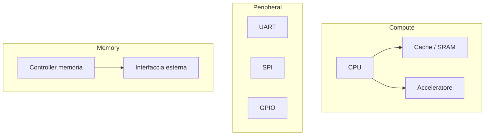
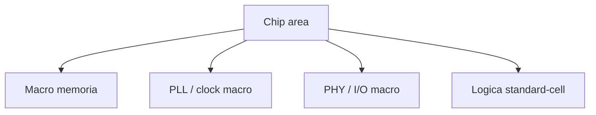
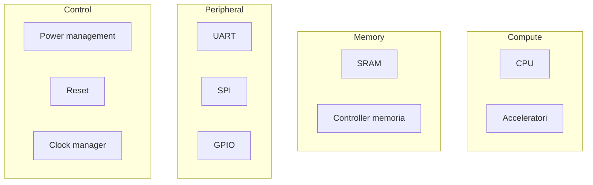
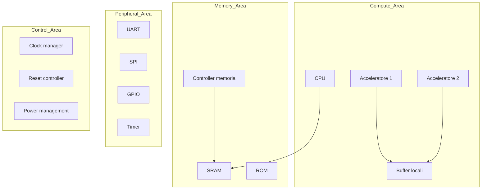

# Physical design awareness in un SoC

La progettazione di un **System on Chip (SoC)** non si esaurisce nella definizione architetturale e nella descrizione RTL dei blocchi.  
Anche se il progettista di sistema lavora spesso a un livello più astratto rispetto al backend fisico, è fondamentale sviluppare una forte **physical design awareness**, cioè la consapevolezza di come le scelte architetturali influenzino:

- area del chip;
- floorplanning;
- distribuzione dei clock;
- power distribution;
- congestione del routing;
- timing closure;
- testabilità e verificabilità fisica;
- consumo e comportamento termico.

Questa consapevolezza è cruciale perché molte decisioni prese a livello SoC hanno effetti profondi e spesso irreversibili nelle fasi successive di implementazione ASIC.

---

## 1. Che cosa significa physical design awareness

Avere physical design awareness non significa sostituirsi al physical designer o al backend engineer.  
Significa piuttosto progettare il SoC con una visione che tenga conto del fatto che il chip dovrà poi essere:

- posizionato fisicamente;
- interconnesso;
- alimentato;
- temporizzato;
- verificato rispetto a vincoli reali.

In pratica, significa evitare architetture che siano corrette dal punto di vista funzionale ma difficili, costose o rischiose da implementare fisicamente.

---

## 2. Perché è importante già a livello SoC

Molti problemi fisici nascono da decisioni apparentemente architetturali, ad esempio:

- numero e posizione dei macroblocchi di memoria;
- topologia dell'interconnect;
- quantità di domini di clock;
- quantità di domini di alimentazione;
- collocazione logica dei sottosistemi;
- eccessiva frammentazione del design;
- traffico intenso tra blocchi lontani.

Se questi aspetti non sono considerati abbastanza presto, si rischia di avere:

- area eccessiva;
- congestione del routing;
- percorsi temporali difficili da chiudere;
- clock tree complesso;
- power grid pesante;
- tempi di implementazione molto lunghi;
- maggiore rischio di fallire la convergenza fisica.

---

## 3. Dall'architettura al floorplan

Il **floorplan** è la disposizione fisica di macroblocchi, sottosistemi, memorie, interconnect e aree funzionali all'interno del chip.

Dal punto di vista SoC, il floorplan non è ancora un layout definitivo, ma una conseguenza diretta del modo in cui il sistema è stato concepito.

## 3.1 Perché il floorplan conta

Una buona organizzazione fisica aiuta a:

- ridurre lunghezza delle interconnessioni;
- migliorare timing;
- contenere consumi;
- semplificare routing e clock distribution;
- rendere più ordinata la gerarchia del chip.

Una cattiva organizzazione può invece creare percorsi lunghi, hot spot, congestione e difficoltà nella chiusura del progetto.

## 3.2 Affinità funzionale e vicinanza fisica

Una regola concettuale importante è che blocchi che scambiano molto traffico dovrebbero, per quanto possibile, essere anche relativamente vicini dal punto di vista fisico.

Esempi:

- CPU vicino a cache o memoria locale;
- acceleratore vicino ai buffer che usa frequentemente;
- controller di memoria vicino alle macro di memoria o ai pad pertinenti;
- periferiche raggruppate per dominio o funzione.

---

## 4. Area e costo fisico dell'architettura

Ogni scelta architetturale ha un costo in area.  
Nel SoC, questo costo non dipende solo dalla logica combinatoria e sequenziale, ma in larga misura da:

- macro di memoria;
- cache;
- buffer;
- interconnect;
- unità di power management;
- clocking infrastructure;
- logiche di debug, test e safety/security.

## 4.1 Le memorie dominano spesso l'area

In molti SoC, una parte molto significativa dell'area complessiva è occupata da:

- SRAM;
- ROM;
- cache;
- buffer dedicati;
- memorie di retention.

Questo significa che la gerarchia di memoria non è solo una scelta prestazionale, ma anche una scelta fisica primaria.

## 4.2 Area frammentata vs area compatta

Un'architettura con molti piccoli blocchi sparsi può essere più difficile da floorplannare rispetto a un'architettura organizzata in sottosistemi compatti e ben separati.

---

## 5. Macroblocchi e hard macros

Nel SoC sono molto comuni i **macroblocchi**, cioè blocchi con forte identità fisica, come:

- memorie;
- PLL;
- IP hard;
- PHY;
- blocchi analogici o mixed-signal;
- acceleratori pre-implementati.

Questi macroblocchi influenzano fortemente il floorplanning perché:

- non sono arbitrariamente deformabili;
- hanno vincoli di orientamento o posizione;
- possono richiedere alimentazioni specifiche;
- hanno pin o interfacce da collocare coerentemente;
- possono diventare sorgenti di congestione.

Il progettista SoC deve quindi sapere che introdurre un hard IP o una memoria non significa soltanto "aggiungere una funzione", ma anche imporre vincoli fisici reali.

---

## 6. Interconnect e distanza fisica

L'interconnect è una delle aree in cui l'impatto fisico delle scelte SoC è più evidente.

## 6.1 Topologia logica e costo fisico

Una topologia di bus o crossbar può essere corretta dal punto di vista funzionale, ma molto costosa dal punto di vista fisico se:

- collega un grande numero di blocchi lontani;
- richiede molti percorsi larghi e ad alta attività;
- attraversa più regioni del chip;
- impone connessioni incrociate numerose.

## 6.2 Traffico intenso e lunghe interconnessioni

Se due blocchi si scambiano grandi quantità di dati ma risultano lontani nel floorplan, si possono avere:

- ritardi elevati;
- consumi dinamici più alti;
- congestione del routing;
- difficoltà nel timing closure.

Per questo la physical awareness suggerisce di far coincidere, per quanto possibile:

- vicinanza logica;
- intensità del traffico;
- vicinanza fisica.

---

## 7. Congestione del routing

La **routing congestion** è uno dei problemi classici nei chip complessi.

## 7.1 Da cosa dipende

La congestione aumenta quando:

- troppi segnali attraversano la stessa regione;
- molti blocchi sono densamente accorpati senza sufficiente pianificazione;
- il numero di connessioni globali è molto alto;
- si concentrano molte interfacce attorno a macro grandi;
- clock, reset, power e segnali dati competono per le stesse risorse fisiche.

## 7.2 Effetti della congestione

La congestione può causare:

- peggioramento del timing;
- aumento dell'area finale;
- maggiore numero di buffer o ripetitori;
- iterazioni aggiuntive di placement e routing;
- rischio di non convergere fisicamente.

Una buona architettura SoC aiuta a prevenire la congestione organizzando il sistema in sottosistemi con interazioni controllate.

---

## 8. Timing closure e conseguenze architetturali

La **timing closure** è il processo con cui si verifica e si ottimizza il chip affinché tutti i percorsi temporali rispettino i vincoli richiesti.

## 8.1 Perché il timing dipende dall'architettura

Il timing non dipende solo dalla qualità dell'implementazione fisica, ma anche da scelte architetturali quali:

- profondità dei datapath;
- presenza o assenza di pipeline;
- distanza tra blocchi fortemente connessi;
- larghezza dei bus;
- numero di livelli di logica;
- uso di clock domain multipli;
- collocazione delle memorie.

## 8.2 Architetture difficili da chiudere

Sono tipicamente problematiche quelle in cui:

- troppi segnali attraversano grandi distanze;
- si richiede alta frequenza a blocchi poco pipeline-izzati;
- si impone una forte centralizzazione dell'interconnect;
- si moltiplicano i crossing e le dipendenze globali.

Per il progettista SoC, questo significa che prestazioni elevate non si ottengono solo aumentando la frequenza nominale, ma strutturando il sistema in modo fisicamente sostenibile.

---

## 9. Clock tree e scelte SoC

I clock hanno un forte impatto fisico perché devono essere distribuiti in modo capillare e controllato.

## 9.1 Effetti di molti clock domain

Avere molti clock domain può essere vantaggioso dal punto di vista funzionale o energetico, ma implica:

- clock tree più complessi;
- maggiore area dedicata all'infrastruttura;
- più crossing da gestire;
- maggiore effort di timing e verifica.

## 9.2 Blocchi ad alta frequenza

I sottosistemi che operano ad alta frequenza richiedono generalmente:

- placement più curato;
- percorsi dati controllati;
- clock distribution più rigorosa;
- budgeting temporale più stretto.

Per questo, un'architettura SoC con molti domini e alte frequenze deve essere giustificata da benefici reali.

---

## 10. Power distribution e architettura

La distribuzione dell'alimentazione dipende fortemente da come il SoC è partizionato.

## 10.1 Power domain e implicazioni fisiche

Ogni power domain aggiunge esigenze di:

- isolamento;
- retention;
- power switches;
- routing di alimentazioni dedicate;
- controllo di sequenziamento.

## 10.2 Hot spots e densità di potenza

Blocchi molto attivi o molto compatti possono generare zone di alta densità di potenza, con effetti su:

- consumo;
- integrità del segnale;
- affidabilità;
- comportamento termico.

Una buona physical awareness porta a evitare concentrazioni eccessive di attività intensa in regioni troppo ristrette.

---

## 11. Physical awareness di memorie e buffer

Le memorie sono spesso il ponte più evidente tra architettura e implementazione fisica.

## 11.1 Posizionamento delle memorie

Il posizionamento delle macro di memoria influenza:

- lunghezza dei percorsi dati;
- accesso della CPU o degli acceleratori;
- distribuzione del traffico;
- possibilità di creare sottosistemi compatti.

## 11.2 Molte memorie piccole o poche memorie grandi?

Questa è una scelta con impatto sia architetturale sia fisico.

### Molte memorie piccole

- maggiore località possibile;
- flessibilità;
- potenziale distribuzione del traffico.

### Poche memorie grandi

- struttura più centralizzata;
- meno macro da gestire;
- possibile semplificazione di certe scelte architetturali.

Tuttavia, entrambe le opzioni hanno costi e benefici fisici diversi in termini di floorplanning, routing e timing.

---

## 12. Partizionamento in sottosistemi

Uno dei modi migliori per migliorare la physical awareness è partizionare il SoC in sottosistemi coerenti.

Esempi:

- compute subsystem;
- memory subsystem;
- peripheral subsystem;
- always-on subsystem;
- security/safety subsystem.

### Benefici del partizionamento

- gerarchia più leggibile;
- floorplanning più naturale;
- routing più controllabile;
- isolamento di domini funzionali;
- migliore manutenibilità del progetto.

Questa visione non serve solo alla documentazione: aiuta a costruire un SoC più implementabile.

---

## 13. Physical awareness e testabilità

Le scelte architetturali influenzano anche la **testabilità** del SoC.

## 13.1 DFT e accessibilità

Un chip deve poter essere testato.  
Scelte come:

- forte frammentazione;
- molte dipendenze tra domini;
- reset complessi;
- clocking molto articolato;
- macro difficili da raggiungere;

possono complicare l'inserimento o la gestione delle strutture di test.

## 13.2 Debug e osservabilità

Anche il debug post-silicon è influenzato dalla physical awareness:

- segnali critici difficili da osservare;
- percorsi sensibili distribuiti in zone molto lontane;
- infrastrutture di tracing costose;
- dipendenza da clock e power states.

La physical awareness spinge quindi a progettare non solo per funzionare, ma anche per essere testabili e debuggabili.

---

## 14. Physical awareness e verificabilità

Una buona architettura fisicamente consapevole semplifica anche la verifica.

Infatti tende a ridurre:

- interazioni inutilmente globali;
- crossing non necessari;
- dipendenze complesse di power e reset;
- percorsi dati troppo lunghi o fragili.

Questo rende più lineare:

- il debug;
- il correlation tra problemi funzionali e fisici;
- la chiusura delle verifiche finali.

---

## 15. Collaborazione tra architettura SoC e backend

La physical design awareness suggerisce che architettura e backend non debbano essere mondi completamente separati.

È utile che il progettista SoC sappia almeno porsi domande come:

- dove finiranno fisicamente le memorie principali?
- quali blocchi devono stare vicini?
- quali interfacce avranno molto traffico?
- quanti clock domain sono davvero necessari?
- i power domain previsti sono sostenibili?
- l'interconnect scelta è coerente con la scala del progetto?

Questa collaborazione anticipata riduce il rischio di scoprire troppo tardi problemi costosi.

---

## 16. Esempi di segnali d'allarme architetturali

Ci sono alcuni segnali che indicano una possibile architettura fisicamente problematica:

- eccessivo numero di macro sparse;
- crossbar molto ampia con tanti initiator e target;
- grande quantità di dati che attraversa tutto il chip;
- troppi clock domain con interazioni dense;
- power domain numerosi senza una chiara strategia;
- sottosistemi fortemente dipendenti ma logicamente lontani;
- memorie centrali contese da molti blocchi.

Questi elementi non sono necessariamente sbagliati, ma richiedono una forte giustificazione e una pianificazione accurata.

---

## 17. Errori frequenti

Tra gli errori più comuni:

- considerare area e floorplanning solo dopo l'RTL;
- introdurre IP e memorie senza pensare alla loro collocazione fisica;
- scegliere interconnect troppo ricche per la scala del progetto;
- ignorare il costo fisico dei clock domain multipli;
- sottovalutare la congestione dovuta a traffico elevato;
- pensare che il backend possa "risolvere tutto" senza conseguenze;
- non coinvolgere abbastanza presto considerazioni di timing closure.

---

## 18. Collegamento con la sezione ASIC

Questa pagina costituisce il ponte naturale tra la progettazione SoC e la progettazione **ASIC**.

Infatti mostra che:

- una buona architettura non è solo funzionalmente elegante;
- le memorie non sono solo risorse logiche, ma macro fisiche;
- i clock domain non sono solo concetti astratti, ma reti reali da distribuire;
- i power domain comportano celle, routing e sequenze concrete;
- il floorplan e il timing dipendono già da come il sistema è stato strutturato.

Per questo la physical awareness è uno dei punti in cui la cultura SoC si salda con quella del backend ASIC.

---

## 19. Collegamento con FPGA

Nel contesto FPGA, la physical awareness è spesso meno estrema rispetto all'ASIC, ma resta comunque utile.

Ad esempio aiuta a capire:

- perché alcune architetture raggiungono facilmente la frequenza richiesta e altre no;
- perché certe memorie o DSP vanno collocati logicamente in modo favorevole;
- perché alcuni bus lunghi degradano il timing;
- perché il partizionamento in sottosistemi aiuta anche in prototipazione.

La FPGA costituisce quindi un ottimo ambiente didattico per sviluppare intuizione fisica prima del flusso ASIC completo.

---

## 20. Esempio di vista fisicamente consapevole di un SoC didattico

Il seguente schema mostra una visione concettuale di come si possa organizzare un SoC in modo favorevole alla futura implementazione fisica.

In questo tipo di organizzazione:

- i blocchi con forte interazione dati sono raggruppati;
- il sottosistema memoria è riconoscibile e coerente;
- le periferiche sono raccolte in una regione dedicata;
- l'infrastruttura di controllo è separata ma centralmente rilevante.

---

## 21. In sintesi

Avere physical design awareness in un SoC significa progettare con la consapevolezza che ogni scelta architetturale avrà conseguenze concrete su:

- area;
- floorplanning;
- routing;
- timing closure;
- clock distribution;
- power distribution;
- testabilità;
- verificabilità fisica.

Non si tratta di trasformare il progettista SoC in un backend engineer, ma di costruire un'architettura che sia non solo corretta e performante, ma anche realisticamente implementabile.

Questa consapevolezza è uno dei legami più forti tra la progettazione di sistema e la progettazione ASIC.

---

## Prossimo passo

Dopo questa pagina, il passo conclusivo naturale è un **caso di studio SoC**, in cui raccogliere i concetti introdotti nelle pagine precedenti e mostrarli in una piattaforma concreta, semplice ma completa.
