# Clock, reset e power management in un SoC

In un **System on Chip (SoC)**, clock, reset e gestione dell'alimentazione non sono aspetti secondari o puramente infrastrutturali: costituiscono il **telaio operativo** dell'intero sistema.  
Anche un'architettura eccellente, con CPU, memorie, bus e acceleratori ben progettati, non può funzionare correttamente se:

- i clock non sono distribuiti in modo coerente;
- i reset non vengono generati e rilasciati nel modo corretto;
- i domini di alimentazione non sono gestiti con sequenze sicure;
- le interazioni tra blocchi attivi e blocchi spenti non sono controllate.

Per questo motivo, la progettazione di **clock, reset e power management** è una parte essenziale della progettazione SoC e influenza direttamente:

- affidabilità del sistema;
- consumi;
- prestazioni;
- robustezza del bring-up;
- verificabilità;
- fattibilità dell'implementazione fisica.

---

## 1. Perché questi temi sono centrali

In un SoC reale, i blocchi non sono tutti uguali.  
Possono differire per:

- frequenza operativa;
- sorgente di clock;
- dominio di reset;
- dominio di alimentazione;
- necessità di essere sempre attivi o attivabili solo a richiesta.

Di conseguenza, il SoC deve gestire:

- più clock domain;
- più reset domain;
- più power domain;
- sequenze di attivazione e disattivazione;
- crossing tra blocchi che non condividono le stesse condizioni operative.

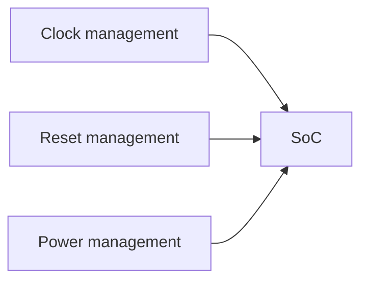

Questi tre sottosistemi sono strettamente collegati: non si può progettare correttamente il reset senza considerare clock e power, e non si può fare power management senza pensare all'effetto sui clock e sulla logica di reset.

---

## 2. Il ruolo del clock

Il **clock** fornisce il riferimento temporale che coordina l'evoluzione degli stati sequenziali del circuito.  
In un sistema semplice potrebbe esistere un solo clock globale; in un SoC reale, invece, è molto comune avere più clock.

## 2.1 Funzioni principali del clock

Il clock serve a:

- sincronizzare registri e pipeline;
- coordinare i trasferimenti nei datapath;
- definire il throughput massimo teorico;
- separare blocchi a diverse prestazioni;
- ridurre consumi, quando opportunamente gestito.

## 2.2 Perché esistono più clock

Non tutti i blocchi hanno le stesse esigenze.

Ad esempio:

- una CPU può richiedere una frequenza elevata;
- una periferica UART può funzionare a frequenze molto più basse;
- un controller di memoria può avere una propria sorgente o dominio;
- un blocco sempre attivo (*always-on*) può richiedere un clock dedicato e stabile.

Le motivazioni principali per usare più clock sono:

- differenziare le prestazioni;
- semplificare il rispetto dei vincoli temporali;
- ottimizzare i consumi;
- adattarsi a interfacce esterne;
- isolare sottosistemi specifici.

---

## 3. Clock generation e clock tree

Il clock non è solo un segnale logico: è una risorsa strutturale che deve essere generata, selezionata, condizionata e distribuita.

## 3.1 Sorgenti di clock

Un SoC può avere una o più sorgenti:

- oscillatori esterni;
- oscillatori interni;
- PLL;
- DLL;
- clock derivati da divisori o moltiplicatori;
- clock di test o debug.

## 3.2 Clock manager

Spesso esiste un blocco dedicato, che può occuparsi di:

- selezione della sorgente;
- divisione di frequenza;
- generazione di clock specifici per sottosistemi;
- abilitazione/disabilitazione di clock;
- supporto al power management.

## 3.3 Distribuzione del clock

Una volta generato, il clock deve essere distribuito ai blocchi del SoC.  
Questa distribuzione è delicata perché il clock deve arrivare:

- con ritardi controllati;
- con skew limitato;
- con duty cycle appropriato;
- senza introdurre rumore o problemi di integrità.

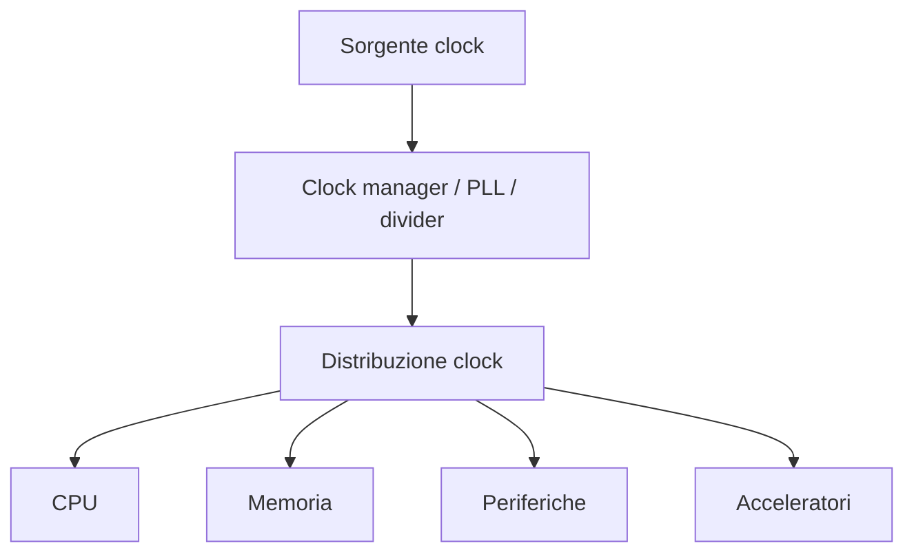

Dal punto di vista architetturale, è importante non pensare al clock come a un dettaglio che verrà risolto automaticamente a fine progetto.

---

## 4. Clock domain

Un **clock domain** è un insieme di elementi sequenziali che condividono lo stesso riferimento di clock o clock logicamente equivalenti.

## 4.1 Perché i clock domain sono importanti

Se due blocchi appartengono allo stesso clock domain, i dati possono spesso essere trasferiti in modo relativamente diretto.  
Se invece appartengono a domini diversi, occorre gestire il passaggio con attenzione.

## 4.2 Esempi di clock domain in un SoC

Un SoC potrebbe includere:

- dominio CPU ad alta frequenza;
- dominio memoria;
- dominio periferico a frequenza ridotta;
- dominio always-on;
- dominio di test o debug.

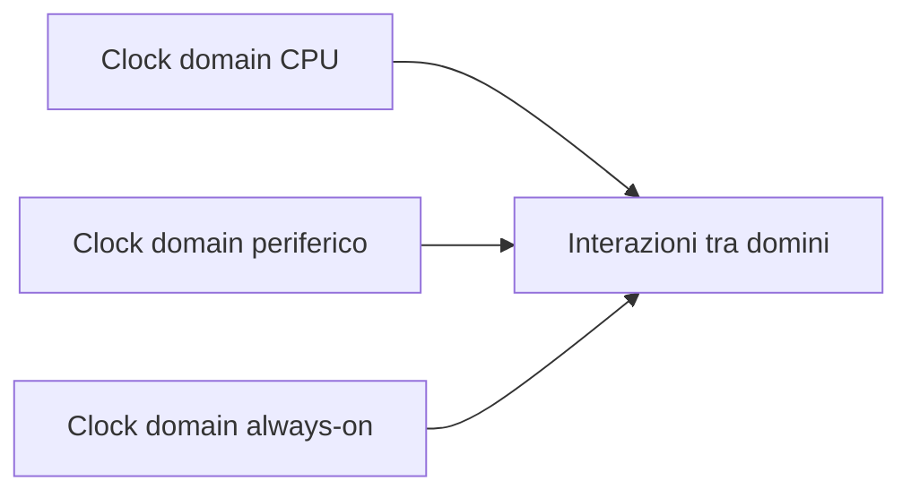

La presenza di più clock domain rende il SoC più flessibile ed efficiente, ma introduce complessità di progetto e verifica.

---

## 5. CDC: Clock Domain Crossing

Il passaggio di segnali tra domini di clock differenti prende il nome di **Clock Domain Crossing (CDC)**.

## 5.1 Perché il CDC è critico

Se un segnale generato in un dominio viene campionato in un altro dominio senza adeguate precauzioni, si possono verificare:

- metastabilità;
- perdita di eventi;
- duplicazione di eventi;
- dati incoerenti;
- comportamenti non deterministici.

## 5.2 Tecniche comuni di gestione CDC

Le tecniche dipendono dal tipo di informazione trasferita.

### Segnali singoli o eventi

Si usano tipicamente:

- sincronizzatori a più flip-flop;
- handshaking;
- pulse stretching, se necessario.

### Bus o dati multi-bit

Spesso si usano:

- FIFO asincrone;
- protocolli di valid/ready con sincronizzazione appropriata;
- codifiche controllate;
- meccanismi di campionamento stabile.

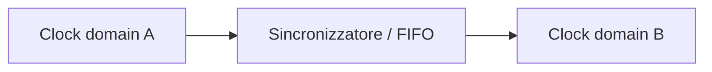

Il CDC non è un tema opzionale: in un SoC con più clock domain è inevitabile e va pianificato fin dall'inizio.

---

## 6. Clock gating

Uno dei modi più comuni per ridurre il consumo dinamico è il **clock gating**, cioè la disabilitazione del clock a blocchi che non devono lavorare in un certo momento.

## 6.1 Perché il clock gating riduce i consumi

Il consumo dinamico dipende in larga parte dalle commutazioni.  
Se un blocco non è utilizzato, impedirgli di ricevere il clock riduce drasticamente le transizioni interne inutili.

## 6.2 Dove si usa il clock gating

Può essere usato su:

- periferiche inattive;
- acceleratori non in uso;
- parti della CPU o del datapath;
- blocchi opzionali;
- sottosistemi temporaneamente sospesi.

## 6.3 Attenzioni progettuali

Il clock gating deve essere progettato con cura, perché può influire su:

- comportamento del reset;
- sequenza di riattivazione;
- osservabilità in debug;
- timing;
- copertura di verifica.

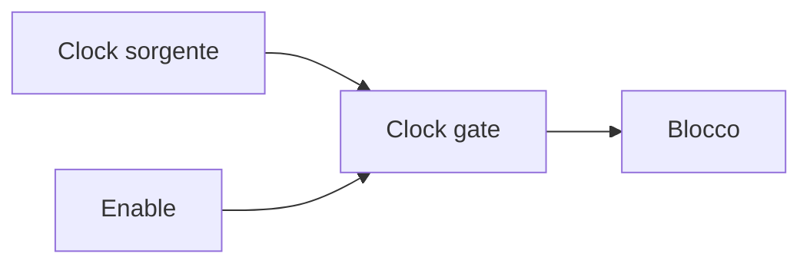

In un SoC ben progettato, il clock gating non viene aggiunto in modo casuale, ma come parte di una strategia energetica coerente.

---

## 7. Il ruolo del reset

Il **reset** ha lo scopo di portare il sistema in uno stato noto e sicuro.  
È indispensabile all'avvio, ma è importante anche per:

- recupero da fault;
- reinizializzazione di sottosistemi;
- uscita da condizioni anomale;
- supporto a debug e bring-up.

## 7.1 Funzioni del reset

Il reset deve garantire che:

- registri e FSM partano da uno stato definito;
- i blocchi non producano attività spurie all'accensione;
- il software trovi il sistema in condizioni coerenti;
- il boot parta dal punto previsto.

## 7.2 Tipi di reset

Si possono distinguere diversi tipi di reset.

### Cold reset

Riporta il sistema o gran parte di esso in condizioni iniziali, come in una vera accensione da zero.

### Warm reset

Reinizializza il sistema senza necessariamente spegnere tutto il chip.

### Soft reset

Applicato a un singolo blocco o sottosistema, spesso controllabile via software.

### Reset di debug o test

Usato per scenari specifici di osservabilità, test o bring-up.

---

## 8. Reset sincrono e reset asincrono

Una distinzione molto importante riguarda il modo in cui il reset interagisce con il clock.

## 8.1 Reset asincrono

Può essere attivato indipendentemente dal clock.

### Vantaggi

- utile per portare rapidamente il sistema in uno stato noto;
- comune in molte strutture di basso livello.

### Svantaggi

- rilascio più delicato;
- possibili problemi se non sincronizzato correttamente.

## 8.2 Reset sincrono

Agisce in relazione al clock.

### Vantaggi

- comportamento più facilmente controllabile nel dominio di clock;
- migliore prevedibilità in molte strutture.

### Svantaggi

- richiede clock attivo;
- talvolta meno adatto a certe situazioni di inizializzazione globale.

In molti SoC si adotta una strategia mista: assert anche asincrono, ma deassert sincronizzato.

---

## 9. Reset domain

Un **reset domain** è un insieme di blocchi che condividono lo stesso comportamento di reset.

In un SoC reale non sempre conviene usare un unico reset globale per tutto, perché:

- alcuni blocchi devono restare attivi;
- alcuni sottosistemi devono essere reimpostabili in modo indipendente;
- i tempi di inizializzazione possono essere diversi;
- i domini di alimentazione possono richiedere reset separati.

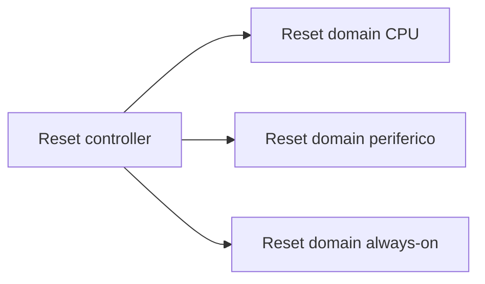

Questa partizione migliora la modularità, ma richiede grande attenzione nelle interazioni tra domini.

---

## 10. RDC: Reset Domain Crossing

Quando segnali passano tra blocchi che non condividono lo stesso reset domain, si parla di **Reset Domain Crossing (RDC)**.

## 10.1 Perché l'RDC è delicato

Anche se due blocchi condividono il clock, il fatto che possano uscire dal reset in tempi diversi può causare:

- segnali non validi;
- attivazioni premature;
- FSM in stati incompatibili;
- glitch logici;
- comportamenti difficili da riprodurre.

## 10.2 Come affrontare l'RDC

Occorre progettare con attenzione:

- mascheramento dei segnali in fase di rilascio reset;
- handshaking di inizializzazione;
- sequenze ordinate di enable;
- dipendenze esplicite tra sottosistemi.

In molti progetti moderni, l'RDC viene trattato con la stessa serietà del CDC.

---

## 11. Reset controller

Per gestire la complessità dei reset si usa spesso un **reset controller**.

Questo blocco può occuparsi di:

- generare i reset interni;
- distribuire reset diversi a sottosistemi differenti;
- sincronizzare il rilascio dei reset;
- interagire con power management e clock manager;
- supportare reset da software, debug o fault handling.

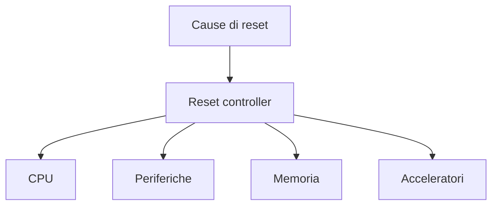

Una gestione centralizzata e documentata dei reset rende il SoC molto più robusto.

---

## 12. Il ruolo del power management

Il **power management** ha l'obiettivo di ridurre il consumo energetico mantenendo il sistema operativo e affidabile.  
Nei SoC moderni questo è spesso essenziale, soprattutto in contesti:

- embedded;
- mobile;
- edge;
- battery-powered;
- automotive o industriali con vincoli termici.

Il power management può includere:

- clock gating;
- power gating;
- domini di alimentazione multipli;
- modalità sleep;
- modalità standby;
- gestione software degli stati di potenza;
- wake-up controllati.

---

## 13. Power domain

Un **power domain** è una regione del SoC che può essere alimentata e gestita in modo relativamente indipendente.

## 13.1 Perché usare più power domain

Le ragioni principali sono:

- spegnere blocchi inutilizzati;
- mantenere sempre attivi solo i moduli essenziali;
- migliorare l'autonomia energetica;
- ridurre dissipazione e temperatura;
- gestire diversi stati di potenza del sistema.

## 13.2 Esempi di power domain

Un SoC può avere:

- dominio always-on;
- dominio CPU;
- dominio acceleratori;
- dominio periferiche;
- dominio memoria o retention.

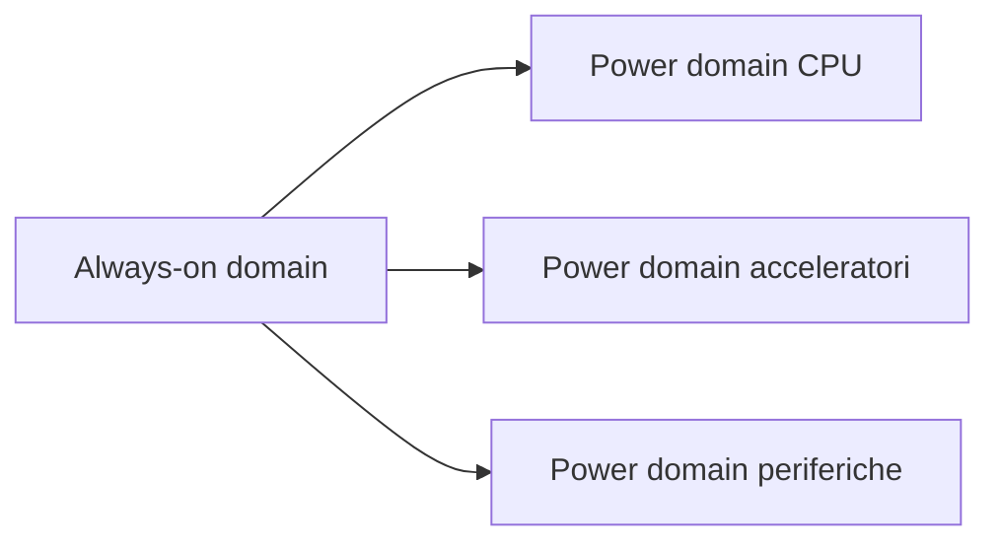

La partizione in power domain è una scelta architetturale molto importante perché influenza sia la logica sia il layout fisico.

---

## 14. Power gating

Il **power gating** consiste nello spegnimento effettivo di una parte del circuito, interrompendone l'alimentazione.

## 14.1 Differenza rispetto al clock gating

- **clock gating**: il blocco resta alimentato ma non riceve il clock;
- **power gating**: il blocco viene parzialmente o totalmente spento.

## 14.2 Vantaggi

- riduzione molto significativa dei consumi statici e dinamici;
- particolarmente utile per blocchi raramente usati.

## 14.3 Svantaggi e complessità

- perdita dello stato interno, salvo retention;
- necessità di sequenze controllate di spegnimento e riaccensione;
- interazione delicata con reset, isolamento e wake-up;
- complessità di verifica molto maggiore.

Il power gating va quindi usato quando il beneficio energetico giustifica il costo architetturale e metodologico.

---

## 15. Isolation e retention

Quando un power domain può essere spento, servono meccanismi per gestire i confini verso il resto del SoC.

## 15.1 Isolation

Serve a evitare che un blocco spento mandi valori indeterminati verso blocchi ancora attivi.

In pratica, la logica di isolamento forza determinati segnali a valori sicuri quando il dominio è off.

## 15.2 Retention

Serve a preservare alcune informazioni essenziali quando il dominio viene spento, ad esempio:

- stato minimo del blocco;
- registri critici;
- contesto di ripresa.

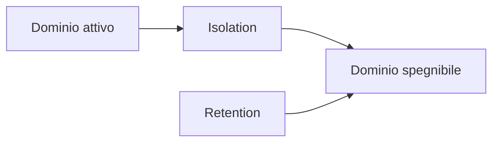

Senza isolation e retention ben progettati, il power management può introdurre comportamenti erratici difficili da diagnosticare.

---

## 16. Sequenziamento di power, reset e clock

Uno degli aspetti più delicati del SoC è l'ordine con cui si attivano e si rilasciano alimentazione, reset e clock.

Una sequenza concettuale tipica è:

1. il dominio viene alimentato;
2. il clock diventa disponibile o stabilizzato;
3. il reset viene mantenuto attivo finché il blocco non è pronto;
4. il reset viene rilasciato in modo controllato;
5. il software o la logica di controllo inizializzano il sottosistema.

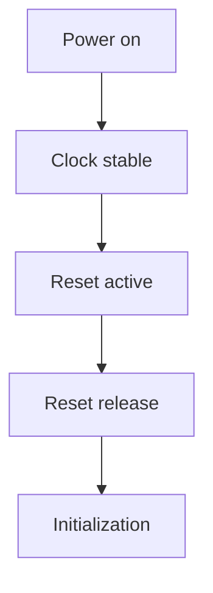

Nel percorso opposto, per lo spegnimento, può essere necessario:

- fermare attività in corso;
- salvare stato;
- abilitare isolamento;
- disabilitare clock;
- togliere alimentazione.

Il sequenziamento è quindi una parte chiave del comportamento di sistema.

---

## 17. Impatto sul software di sistema

Clock, reset e power management non sono solo temi hardware: il firmware e il software di basso livello devono spesso controllarli o almeno conoscerli.

Il software può essere responsabile di:

- inizializzare i clock;
- configurare divisori o sorgenti;
- abilitare/disabilitare periferiche;
- mettere sottosistemi in sleep;
- reagire a wake-up;
- gestire soft reset;
- verificare bit di stato e ready.

Per questo una buona documentazione dei registri di controllo clock/reset/power è essenziale.

---

## 18. Impatto sulla verifica

La verifica di clock, reset e power è spesso una delle aree più difficili nel SoC.

Occorre verificare:

- presenza e correttezza dei clock;
- sequenze di reset;
- CDC e RDC;
- modalità di sleep e wake-up;
- comportamento con domini spenti o riattivati;
- correttezza dell'isolation;
- salvataggio e ripristino di stato;
- recovery da fault o reset parziali.

Questi test non devono limitarsi ai casi nominali, ma includere anche:

- reset durante attività;
- riaccensione di domini;
- arrivo di interrupt durante sleep;
- traffico residuo verso blocchi non pronti.

---

## 19. Impatto sul bring-up

Molti problemi di bring-up derivano proprio da clock, reset e power management.

Esempi tipici:

- clock non abilitato a una periferica;
- reset rilasciato troppo presto;
- sequenza di inizializzazione non rispettata;
- blocco spento ma accessibile dal software;
- wake-up non funzionante;
- dipendenze nascoste tra sottosistemi.

Per questo, nel bring-up, una delle prime domande da porsi è sempre:

- il dominio è alimentato?
- il clock è presente?
- il reset è stato rilasciato correttamente?

---

## 20. Errori frequenti

Tra gli errori più comuni nella progettazione di clock, reset e power management:

- introdurre troppi domini senza reale necessità;
- non pianificare i CDC e RDC fin dall'inizio;
- progettare reset poco chiari o scarsamente documentati;
- applicare clock gating senza considerare debug e verifica;
- usare power gating senza adeguata isolation e retention;
- trascurare il sequenziamento tra power, clock e reset;
- non allineare hardware e software sulle modalità di power state;
- considerare questi aspetti solo alla fine del progetto.

---

## 21. Collegamento con FPGA

Nel contesto FPGA, molti aspetti di clock e reset sono già molto visibili:

- gestione dei clock tramite PLL o MMCM;
- reset globali e locali;
- crossing tra domini;
- enable di periferiche;
- sequenze di inizializzazione.

La FPGA è utile per verificare:

- robustezza del boot;
- corretta abilitazione dei clock;
- comportamento di reset dei blocchi;
- interazione fra firmware e sottosistemi di controllo.

Il power management completo, invece, è spesso più limitato rispetto a un ASIC, ma i concetti restano estremamente utili.

---

## 22. Collegamento con ASIC

Nel contesto ASIC, clock, reset e power management assumono una rilevanza ancora maggiore perché coinvolgono:

- clock tree synthesis;
- skew e latenza del clock;
- domini di alimentazione fisici;
- retention cells;
- isolation cells;
- power intent;
- verifiche fisiche e timing;
- consumo statico e dinamico.

Questa è una delle aree in cui l'architettura SoC si collega più direttamente al physical design.

---

## 23. Esempio di infrastruttura di controllo per un SoC didattico

Il seguente schema riassume una possibile organizzazione semplificata.

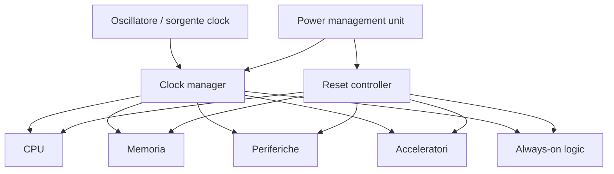

In questo scenario:

- il **clock manager** distribuisce e modula i clock;
- il **reset controller** garantisce sequenze ordinate di inizializzazione;
- la **PMU** coordina stati di potenza, gating e wake-up;
- la logica **always-on** mantiene attive le funzioni essenziali.

---

## 24. In sintesi

Clock, reset e power management costituiscono l'infrastruttura fondamentale di un SoC.  
Una progettazione solida in quest'area deve affrontare in modo coordinato:

- generazione e distribuzione del clock;
- gestione di clock domain e CDC;
- definizione di reset domain e RDC;
- strategie di clock gating;
- power domain e power gating;
- isolation, retention e sequenziamento;
- interazione con firmware, verifica e bring-up.

In un SoC ben progettato, questi aspetti non sono aggiunte finali, ma elementi architetturali pensati fin dall'inizio.

---

## Prossimo passo

Dopo clock, reset e power management, il passo successivo naturale è affrontare il tema di **safety e security**, cioè i meccanismi con cui il SoC viene reso affidabile, protetto e robusto nei confronti di errori, fault e accessi non autorizzati.
