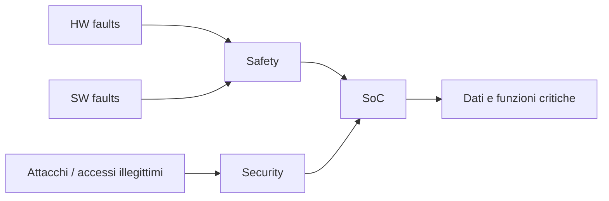
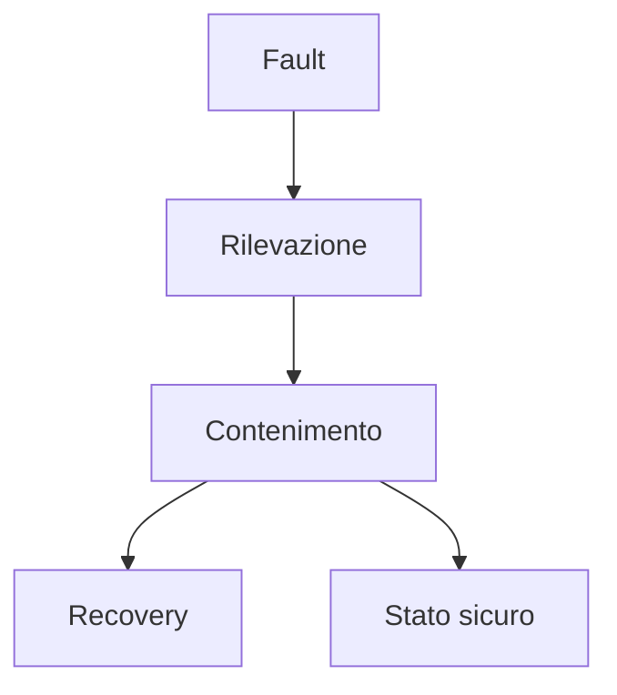
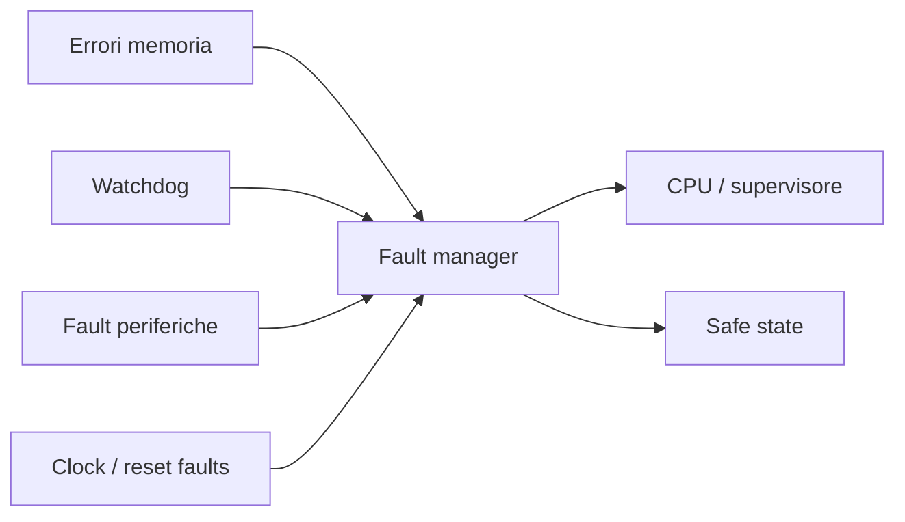
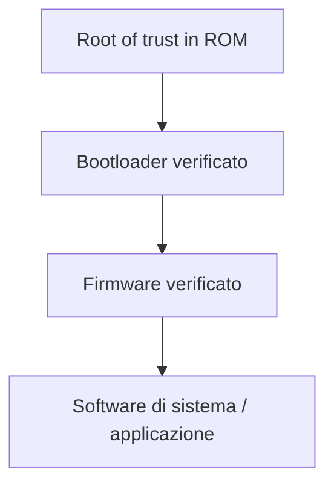
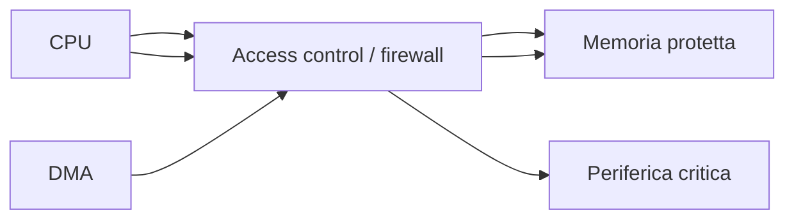
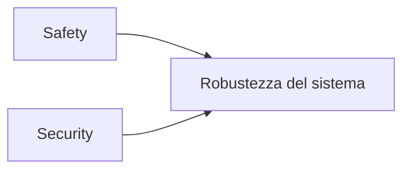
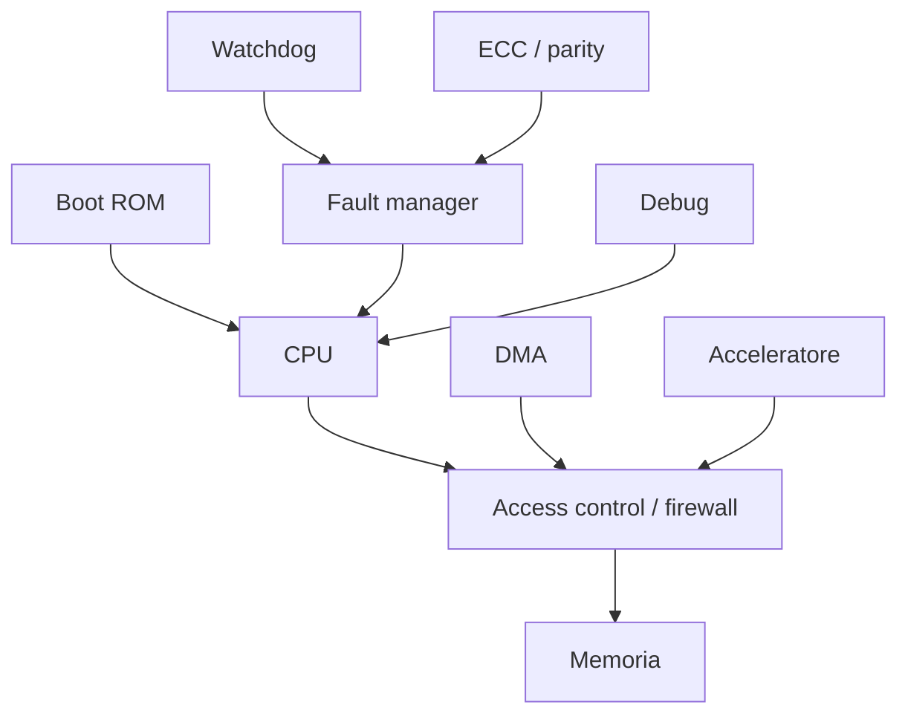

# Safety e security in un SoC

In un **System on Chip (SoC)**, i temi di **safety** e **security** sono sempre più centrali.  
Un sistema integrato non deve solo funzionare correttamente in condizioni nominali, ma deve anche:

- resistere a errori accidentali;
- rilevare e gestire fault;
- evitare comportamenti pericolosi;
- proteggere dati e risorse sensibili;
- impedire accessi non autorizzati;
- garantire integrità del software eseguito.

Sebbene safety e security siano concetti distinti, in un SoC moderno sono fortemente collegati.  
Un fault non gestito può diventare un problema di sicurezza funzionale, mentre una vulnerabilità di security può compromettere affidabilità, disponibilità o controllo del sistema.

---

## 1. Distinzione tra safety e security

È importante separare chiaramente i due concetti.

## 1.1 Safety

La **safety** riguarda la capacità del sistema di evitare condizioni pericolose o non accettabili in presenza di:

- errori interni;
- guasti hardware;
- malfunzionamenti software;
- eventi anomali;
- condizioni operative fuori specifica.

La domanda tipica della safety è:

> Se qualcosa va storto, il sistema riesce a restare in una condizione sicura o a portarsi in essa?

## 1.2 Security

La **security** riguarda la protezione del sistema contro:

- accessi non autorizzati;
- manipolazioni malevole;
- esecuzione di codice non fidato;
- furto di dati;
- escalation di privilegi;
- sabotaggio del funzionamento.

La domanda tipica della security è:

> Chi può fare cosa nel sistema, e come si impedisce che soggetti non autorizzati superino i confini previsti?

---

## 2. Perché questi temi sono rilevanti nei SoC

Un SoC integra in un unico dispositivo:

- capacità di calcolo;
- memoria;
- periferiche;
- interfacce di comunicazione;
- software di boot;
- acceleratori;
- meccanismi di debug e controllo.

Questa integrazione crea grandi vantaggi, ma anche molti punti critici.

### Dal lato safety

Un fault può propagarsi rapidamente tra sottosistemi diversi.

### Dal lato security

La superficie d'attacco aumenta, perché il SoC contiene molte interfacce e più livelli di esecuzione.

Per questo safety e security non possono essere aggiunte finali: devono essere considerate già a livello architetturale.

---

## 3. Safety in un SoC

La safety riguarda soprattutto la capacità di:

- rilevare errori;
- limitarne la propagazione;
- attivare contromisure;
- portare il sistema in uno stato sicuro;
- garantire continuità o recovery, se previsto.

## 3.1 Fonti di rischio per la safety

I problemi possono derivare da:

- guasti permanenti in blocchi hardware;
- fault transitori;
- errori di memoria;
- errori nei segnali di controllo;
- malfunzionamenti del clock o del reset;
- errori software;
- uso scorretto delle periferiche;
- errori di configurazione.

## 3.2 Concetto di stato sicuro

Uno **stato sicuro** è una condizione in cui il sistema, pur non operando necessariamente in modo completo, non produce effetti pericolosi.

A seconda del contesto applicativo, lo stato sicuro può essere:

- fermare un attuatore;
- spegnere un'uscita;
- bloccare l'elaborazione;
- entrare in fail-safe;
- attivare un reset controllato;
- segnalare il fault mantenendo le funzioni essenziali.

---

## 4. Meccanismi di safety

In un SoC si usano vari meccanismi per migliorare la safety.

## 4.1 Rilevazione degli errori

È il primo passo. Occorre capire se qualcosa non va.

Tecniche comuni:

- parità;
- ECC su memorie;
- monitor di stato;
- watchdog;
- timeout;
- controlli di coerenza;
- confronto tra risultati.

## 4.2 Contenimento del fault

Una volta rilevato un problema, occorre impedirne la propagazione.

Esempi:

- isolamento di sottosistemi;
- blocco di scritture pericolose;
- disabilitazione di periferiche;
- disconnessione di output critici.

## 4.3 Recovery o fail-safe

Dopo la rilevazione, il sistema può:

- riprovare l'operazione;
- fare reset di un sottosistema;
- tornare a una configurazione nota;
- entrare in stato safe;
- notificare il fault a un supervisore.

---

## 5. Watchdog e monitoraggio

Uno dei meccanismi di safety più comuni è il **watchdog**.

## 5.1 A cosa serve

Il watchdog verifica che il software o una parte del sistema continui a operare correttamente.  
Se non riceve un aggiornamento periodico entro il tempo previsto, assume che il sistema sia bloccato o malfunzionante.

## 5.2 Possibili reazioni

- interrupt di warning;
- reset di sottosistema;
- reset globale;
- ingresso in stato degradato.

I watchdog sono particolarmente utili perché forniscono una forma semplice ma efficace di supervisione.

---

## 6. Memoria e safety

Le memorie sono un punto critico sia per safety sia per security.

## 6.1 Errori di memoria

Possono verificarsi:

- bit flip;
- corruzione dei dati;
- accessi non validi;
- aliasing o errori di indirizzamento;
- problemi di inizializzazione.

## 6.2 Protezioni comuni

Per migliorare la safety si possono usare:

- parità;
- ECC;
- memorie ridondanti;
- controlli di coerenza;
- regioni protette;
- inizializzazione controllata.

La scelta delle contromisure dipende dalla criticità dell'applicazione e dal costo accettabile in area e complessità.

---

## 7. Ridondanza e confronto

Nei sistemi più critici, la safety può essere migliorata introducendo una qualche forma di ridondanza.

## 7.1 Ridondanza spaziale

Consiste nell'avere più istanze di una funzione o di un controllo.

Esempi:

- doppio calcolo con confronto;
- moduli duplicati;
- voter, in architetture più avanzate.

## 7.2 Ridondanza temporale

La stessa operazione viene eseguita più volte, confrontando i risultati.

## 7.3 Trade-off

La ridondanza migliora la robustezza, ma comporta:

- aumento di area;
- maggiori consumi;
- complessità architetturale e di verifica.

Per questo va riservata ai punti più sensibili del sistema.

---

## 8. Fault management

Un SoC con requisiti di safety deve definire chiaramente come gestire i fault.

Occorre stabilire:

- quali fault sono rilevabili;
- dove vengono segnalati;
- chi decide la reazione;
- quali fault sono recuperabili;
- quali richiedono fallback o reset;
- come viene registrato l'evento.

Spesso esiste un sottosistema di fault management che raccoglie:

- segnali di errore;
- timeout;
- eventi da watchdog;
- errori di memoria;
- fault da periferiche.

---

## 9. Security in un SoC

La security riguarda la protezione del sistema contro attacchi o usi non autorizzati.

In un SoC, questo implica proteggere:

- il processo di boot;
- il codice eseguito;
- i dati riservati;
- i privilegi di accesso;
- le interfacce di debug;
- le periferiche critiche;
- i canali di comunicazione interni ed esterni.

## 9.1 Obiettivi tipici della security

- autenticità del software eseguito;
- integrità dei dati;
- riservatezza delle informazioni sensibili;
- isolamento tra domini con privilegi diversi;
- controllo degli accessi;
- audit e tracciabilità di eventi rilevanti.

---

## 10. Superficie d'attacco in un SoC

Un SoC può essere attaccato attraverso molteplici punti:

- boot da memoria esterna;
- periferiche di comunicazione;
- interfacce di debug;
- DMA mal configurato;
- software vulnerabile;
- registri critici accessibili senza protezioni;
- fault injection o manipolazioni fisiche, nei casi più avanzati.

Anche in un corso introduttivo è utile far capire che la security non riguarda solo "crittografia", ma l'intera architettura del sistema.

---

## 11. Secure boot

Uno dei pilastri della security in un SoC è il **secure boot**.

## 11.1 Idea di base

Il sistema deve eseguire solo software autentico e autorizzato.  
Per questo, all'avvio, il codice iniziale verifica l'integrità e/o l'autenticità del software successivo prima di cedergli il controllo.

## 11.2 Catena di fiducia

Il secure boot si basa su una **root of trust** iniziale, ad esempio in ROM, da cui parte una catena di verifiche.

Se questa catena viene interrotta o aggirata, il sistema rischia di eseguire codice malevolo o corrotto.

---

## 12. Root of trust

La **root of trust** è l'elemento iniziale fidato del sistema.  
Deve essere piccolo, semplice e protetto quanto possibile, perché costituisce la base di tutta la sicurezza successiva.

Può includere:

- codice in ROM;
- chiavi o riferimenti fidati;
- meccanismi minimi di verifica;
- logiche di inizializzazione sicura.

Se la root of trust è compromessa, l'intera architettura di security perde efficacia.

---

## 13. Controllo degli accessi

Nel SoC non tutti i blocchi dovrebbero poter accedere a tutte le risorse.

Occorre quindi definire:

- chi può leggere o scrivere certe regioni di memoria;
- quali periferiche sono accessibili in quale modalità;
- quali master del bus hanno accesso a quali target;
- quali registri sono disponibili solo in contesti privilegiati.

### Esempi di meccanismi

- protezione delle regioni di memoria;
- firewall di bus;
- filtri sugli accessi del DMA;
- separazione tra mondo privilegiato e non privilegiato;
- protezione di registri critici.

Il principio generale è quello del **least privilege**: ogni entità deve avere solo i permessi strettamente necessari.

---

## 14. Isolamento tra domini

Un SoC può ospitare sottosistemi con livelli di fiducia differenti.  
Per questo è importante prevedere isolamento tra:

- software applicativo e firmware privilegiato;
- moduli sicuri e moduli non sicuri;
- periferiche fidate e periferiche esposte;
- processi o contesti distinti.

L'isolamento può avvenire a vari livelli:

- memoria;
- interconnect;
- registri;
- canali di interrupt;
- sottosistemi dedicati.

Questo è uno dei punti in cui security e architettura SoC si incontrano più chiaramente.

---

## 15. Sicurezza delle interfacce di debug

Le interfacce di debug sono molto utili per sviluppo e bring-up, ma possono diventare un grave rischio di security se lasciate aperte o non protette.

Le misure tipiche includono:

- disabilitazione in produzione;
- autenticazione;
- limitazione delle funzionalità disponibili;
- registrazione di accessi o tentativi;
- separazione tra modalità di laboratorio e modalità deployed.

Un'interfaccia di debug non protetta può vanificare molte altre misure di sicurezza.

---

## 16. Crittografia e gestione delle chiavi

In molti SoC, la security include anche meccanismi crittografici, ad esempio per:

- autenticare immagini di boot;
- proteggere comunicazioni;
- cifrare dati sensibili;
- verificare integrità.

Tuttavia, la sola presenza di un acceleratore crittografico non basta: è essenziale anche la gestione delle chiavi.

### Aspetti importanti

- dove risiedono le chiavi;
- chi può accedervi;
- come vengono caricate o generate;
- come vengono protette durante il ciclo di vita del dispositivo.

La sicurezza di un sistema è spesso limitata dall'anello più debole, che può essere proprio la gestione delle chiavi.

---

## 17. DMA e security

Il DMA migliora le prestazioni, ma rappresenta anche un possibile rischio di security.

Se non controllato correttamente, può:

- leggere memoria sensibile;
- scrivere dati in regioni critiche;
- aggirare parte del controllo software;
- interferire con il normale isolamento.

Per questo, in un SoC sicuro, il DMA dovrebbe essere vincolato da politiche di accesso e controlli coerenti con il resto dell'architettura.

---

## 18. Relazione tra safety e security

Anche se diversi, safety e security si influenzano reciprocamente.

### Esempio 1

Un attacco che forza il sistema in uno stato anomalo può compromettere la safety.

### Esempio 2

Un fault non gestito può aprire percorsi di attacco o bypassare protezioni.

### Esempio 3

La protezione di accessi e registri critici può avere sia finalità di security sia di safety.

Per questo, nei SoC moderni, è utile pensare safety e security come due prospettive complementari sulla robustezza del sistema.

---

## 19. Impatto su architettura e co-design

Safety e security influenzano molte scelte architetturali:

- organizzazione della memory map;
- protezione delle regioni sensibili;
- gestione dei fault;
- definizione di stati sicuri;
- scelta di watchdog, ECC e monitor;
- design del boot;
- gestione di debug e update;
- progettazione dei driver e del firmware.

Non si tratta quindi di "aggiungere qualche blocco", ma di progettare l'intero sistema con questi obiettivi in mente.

---

## 20. Impatto sulla verifica

Anche la verifica deve includere safety e security.

### Verifica safety

Si concentra su:

- fault detection;
- comportamento in caso di errore;
- recovery;
- safe state;
- timeout;
- reset e fallback.

### Verifica security

Si concentra su:

- protezione degli accessi;
- secure boot;
- isolamento tra domini;
- comportamento dei registri protetti;
- interfacce di debug;
- reazione a tentativi non consentiti.

In un corso introduttivo non serve entrare in tutte le tecniche avanzate, ma è fondamentale chiarire che safety e security devono essere **verificate**, non solo dichiarate.

---

## 21. Errori frequenti

Tra gli errori più comuni:

- confondere safety e security come se fossero la stessa cosa;
- introdurre watchdog o ECC senza una strategia complessiva;
- non definire chiaramente gli stati sicuri;
- progettare secure boot senza proteggere tutta la catena di fiducia;
- lasciare interfacce di debug troppo permissive;
- non controllare gli accessi del DMA;
- trattare safety e security troppo tardi nel progetto;
- non coinvolgere firmware e software nelle politiche di protezione.

---

## 22. Collegamento con FPGA

Nel contesto FPGA, safety e security possono essere introdotte e sperimentate a livello didattico attraverso:

- watchdog;
- registri protetti;
- memory map con accessi differenziati;
- ECC o parità su memorie, se disponibili;
- sequenze di boot controllate;
- prototipi di secure boot o verifica dell'immagine.

La FPGA consente di validare l'integrazione e il comportamento di base, anche se molte misure avanzate dipendono poi dal contesto ASIC o di prodotto finale.

---

## 23. Collegamento con ASIC

Nel contesto ASIC, safety e security diventano ancora più importanti perché il SoC può trovarsi in ambienti reali, critici e ostili.

Questo porta a considerare anche aspetti più profondi, come:

- protezione fisica;
- gestione del ciclo di vita del dispositivo;
- supporto a functional safety;
- hardening di blocchi sensibili;
- monitoraggio di fault e anomalie;
- test e validazione dedicati.

È qui che l'architettura SoC mostra chiaramente la necessità di essere pensata come sistema affidabile e protetto, non solo come integrazione di funzioni.

---

## 24. Esempio di organizzazione safety/security in un SoC didattico

Il seguente schema riassume una possibile vista semplificata.

In questo scenario:

- la **ROM** ospita la radice iniziale della fiducia;
- il **watchdog** e i controlli **ECC/parity** contribuiscono alla safety;
- il **firewall di accesso** contribuisce alla security;
- il **fault manager** centralizza la gestione degli errori.

---

## 25. In sintesi

Safety e security sono due dimensioni fondamentali della progettazione SoC.

La **safety** riguarda la capacità del sistema di:

- rilevare errori;
- contenere fault;
- recuperare o entrare in uno stato sicuro.

La **security** riguarda invece la capacità del sistema di:

- proteggere il boot;
- controllare gli accessi;
- isolare domini diversi;
- difendere dati e funzionalità critiche.

In entrambi i casi, la chiave è la stessa: progettare il SoC come un sistema robusto, consapevole dei propri rischi e capace di reagire in modo controllato.

---

## Prossimo passo

Dopo safety e security, il passo successivo naturale è affrontare il tema della **physical design awareness nel SoC**, cioè il modo in cui le scelte architetturali influenzano area, floorplanning, congestione, timing e implementazione fisica del chip.
