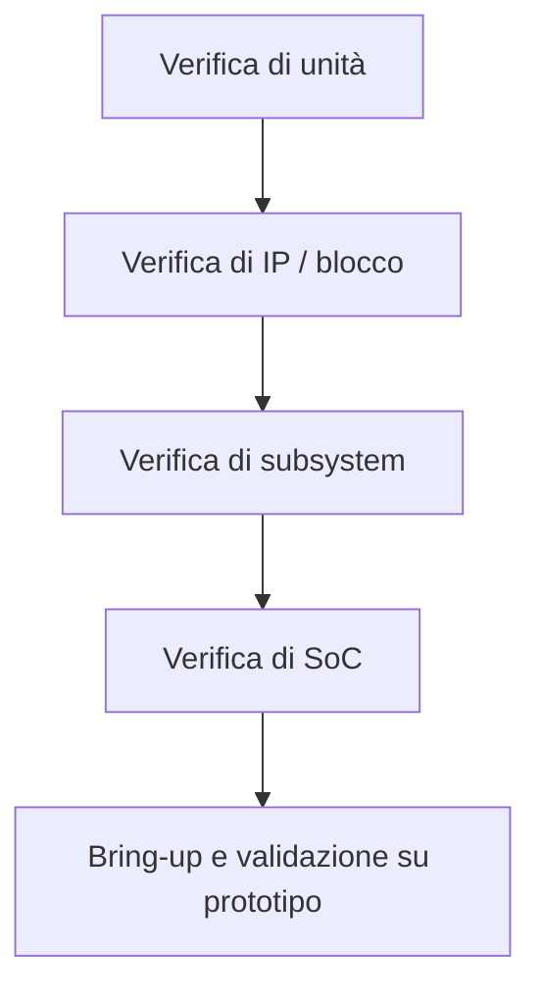
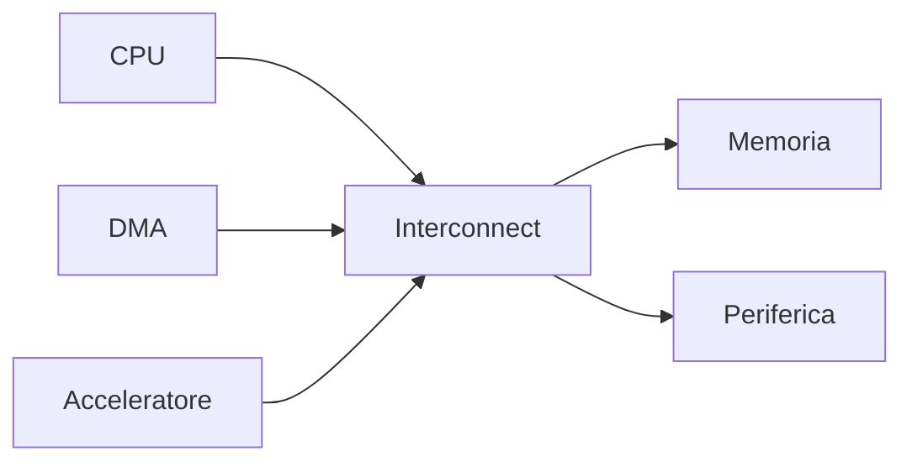
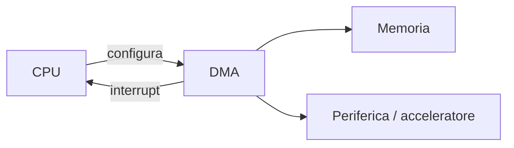
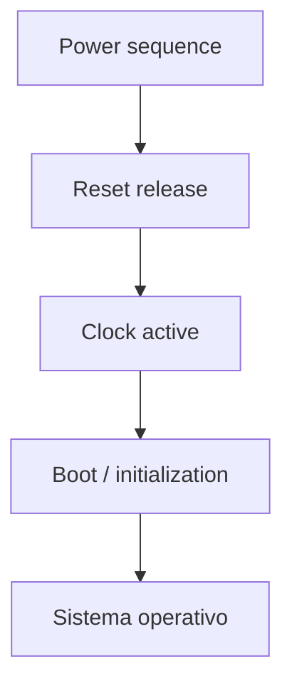

# Verifica di sistema in un SoC

La **verifica** di un **System on Chip (SoC)** ha l'obiettivo di dimostrare che il sistema funziona correttamente non solo a livello di singolo blocco, ma come insieme integrato di:

- processore;
- memorie;
- interconnect;
- periferiche;
- acceleratori;
- clock, reset e power management;
- firmware e software di basso livello.

In un SoC, la verifica è una disciplina centrale perché la maggior parte dei problemi reali non nasce dai moduli isolati, ma dalle loro **interazioni**.  
Un blocco può essere corretto in sé e tuttavia fallire quando viene inserito in un sistema più grande, soggetto a contesa sul bus, reset complessi, traffico concorrente, interrupt, DMA e software reale.

---

## 1. Perché la verifica di SoC è diversa dalla verifica di blocco

La verifica di un singolo IP risponde a domande come:

- il protocollo è rispettato?
- la macchina a stati è corretta?
- i registri si comportano come previsto?
- i casi funzionali del blocco sono coperti?

La verifica di SoC, invece, deve rispondere a domande di livello superiore:

- il processore riesce a fare boot?
- la memory map è coerente?
- periferiche, DMA e interrupt lavorano correttamente insieme?
- i clock domain crossing sono gestiti?
- il software osserva il comportamento atteso?
- il sistema si comporta bene sotto carico, in reset, in fault o in condizioni limite?

Per questo la verifica di sistema non sostituisce la verifica dei blocchi, ma la completa.

---

## 2. Livelli di verifica

In un progetto SoC è utile pensare alla verifica come a una struttura a livelli.

## 2.1 Verifica di unità

Si concentra su componenti piccoli:

- moduli RTL elementari;
- FSM;
- interfacce locali;
- datapath ridotti.

Ha lo scopo di individuare errori il prima possibile.

## 2.2 Verifica di blocco o IP

Verifica il comportamento del singolo IP in modo strutturato:

- registri;
- protocollo bus;
- interrupt;
- gestione degli errori;
- casi nominali e corner case.

## 2.3 Verifica di subsystem

Analizza sottosistemi più grandi, ad esempio:

- CPU + memoria + interconnect;
- bus periferico + periferiche;
- acceleratore + DMA + buffer.

Serve a validare l'interazione fra componenti che collaborano strettamente.

## 2.4 Verifica di SoC

Verifica il sistema completo:

- boot;
- integrazione dei blocchi;
- accessi concorrenti;
- sequenze di reset;
- comportamento firmware-driven;
- robustness del sistema.

## 2.5 Bring-up e validazione

Avviene su FPGA, emulazione o silicio iniziale.  
Serve a confermare che il comportamento osservato nel sistema reale sia coerente con quanto verificato in simulazione.

---

## 3. Obiettivi della verifica di SoC

La verifica di sistema deve dimostrare almeno i seguenti aspetti:

- correttezza funzionale dell'integrazione;
- accessibilità dei blocchi in memory map;
- coerenza di clock, reset e power;
- corretto instradamento di interrupt ed eventi;
- funzionamento dei trasferimenti DMA;
- compatibilità fra hardware e software;
- assenza di errori sistematici nei flussi principali;
- comportamento robusto in scenari reali.

In altri termini, la verifica di SoC cerca di ridurre il rischio che il sistema "si accenda" ma non sia realmente usabile.

---

## 4. Strategia di verifica

Una verifica efficace non nasce da test casuali, ma da una strategia pianificata.

Una strategia tipica include:

- definizione degli obiettivi di verifica;
- identificazione dei sottosistemi critici;
- scelta dei livelli di test;
- definizione dei testbench;
- raccolta di coverage;
- definizione di regression;
- integrazione con firmware e software di test;
- piano di debug.

---

## 5. Elementi tipici di un ambiente di verifica SoC

Un ambiente di verifica di SoC è spesso più ricco di quello di un singolo blocco.

Può includere:

- modello del processore o core reale RTL;
- modello del bus/interconnect;
- modelli di memorie;
- modelli di periferiche esterne;
- monitor di protocollo;
- checker;
- scoreboard;
- sequenze di traffico;
- firmware di test;
- strumenti di raccolta coverage.

## 5.1 Stimoli hardware-driven

Sono test che agiscono principalmente dal lato del testbench:

- accessi diretti ai registri;
- generazione di traffico sul bus;
- iniezione di errori o fault;
- sequenze di reset;
- verifica dei protocolli.

## 5.2 Stimoli software-driven

Sono test in cui il comportamento del SoC è guidato da codice eseguito dal processore:

- boot minimale;
- inizializzazione periferiche;
- test di interrupt;
- test di DMA;
- uso di buffer condivisi;
- esercizio di acceleratori.

Questa seconda categoria è particolarmente importante nei SoC, perché riflette molto meglio l'uso reale del sistema.

---

## 6. Verifica della memory map e dei registri

Uno dei primi obiettivi è verificare che:

- ogni blocco sia raggiungibile all'indirizzo corretto;
- i registri rispondano correttamente;
- i reset value siano corretti;
- gli accessi illegali siano gestiti;
- eventuali registri read-only, write-only o write-one-to-clear si comportino come previsto.

Questa attività può sembrare semplice, ma intercetta moltissimi errori di integrazione:

- base address errato;
- bitfield mappati male;
- collisioni nella memory map;
- errori di larghezza dati;
- differenze fra documentazione e implementazione.

---

## 7. Verifica di bus, interconnect e traffico concorrente

Il sottosistema di interconnessione è uno dei punti più sensibili nella verifica di SoC.

Occorre verificare:

- arbitraggio corretto;
- assenza di deadlock;
- routing corretto delle transazioni;
- gestione delle risposte di errore;
- compatibilità tra initiator e target;
- comportamento sotto traffico concorrente.

I test devono includere non solo accessi semplici, ma anche scenari come:

- CPU e DMA che accedono contemporaneamente alla stessa memoria;
- burst su bus ad alte prestazioni mentre una periferica genera interrupt;
- accessi simultanei a risorse condivise.

---

## 8. Verifica di interrupt ed eventi

Le interruzioni sono un punto classico di errore nei SoC.

Bisogna verificare:

- generazione corretta dell'interrupt;
- propagazione verso l'interrupt controller;
- riconoscimento da parte della CPU;
- priorità e mascheramento;
- clearing corretto degli eventi;
- gestione di eventi simultanei;
- comportamento in caso di interrupt persistente o fault.

Un test di interrupt efficace non si limita a verificare che "l'interrupt arriva", ma che il sistema reagisca correttamente dall'inizio alla fine.

---

## 9. Verifica di DMA e trasferimenti dati

Il DMA è molto utile per le prestazioni, ma introduce complessità.

Occorre verificare:

- configurazione corretta del DMA;
- trasferimento dei dati da e verso memoria;
- sincronizzazione con la periferica o l'acceleratore;
- allineamento e lunghezza dei burst;
- segnalazione di fine trasferimento;
- gestione di errori o timeout;
- contesa con CPU e altri master.

Molti bug SoC compaiono proprio qui, perché i trasferimenti sembrano semplici ma coinvolgono contemporaneamente più sottosistemi.

---

## 10. Verifica di clock, reset e power sequencing

Una verifica SoC seria non può ignorare i segnali di infrastruttura.

## 10.1 Clock domain crossing

Quando blocchi diversi comunicano attraverso clock domain differenti, occorre verificare:

- correttezza delle sincronizzazioni;
- uso corretto di FIFO asincrone o handshake;
- assenza di perdita dati;
- comportamento in condizioni limite.

## 10.2 Reset

Occorre verificare:

- stato dei blocchi dopo reset;
- ordine di rilascio;
- differenza fra cold reset e warm reset;
- comportamento durante reset parziali;
- recovery del sistema.

## 10.3 Power sequencing

Nei SoC con domini multipli di alimentazione, bisogna verificare:

- accensione e spegnimento dei domini;
- isolamento;
- retention;
- ritorno alla piena operatività;
- comportamento del software durante i cambi di stato.

---

## 11. Firmware di test e software di bring-up

La verifica di SoC è molto più efficace quando include firmware reale o quasi reale.

Esempi di test firmware-driven:

- test di boot da ROM;
- inizializzazione dei clock;
- test base di lettura/scrittura registri;
- configurazione periferiche;
- loopback di comunicazione;
- test di DMA;
- gestione di interrupt;
- uso di acceleratori hardware.

Questo approccio aiuta a verificare contemporaneamente:

- hardware;
- interfaccia software;
- memory map;
- sequenze di inizializzazione;
- assunzioni nascoste del sistema.

---

## 12. Coverage

La copertura è fondamentale per valutare se la verifica sia davvero sufficiente.

## 12.1 Code coverage

Misura quanto RTL sia stato esercitato:

- linee;
- branch;
- condizioni;
- toggle, a seconda del flusso usato.

È utile, ma non basta da sola.

## 12.2 Functional coverage

Misura quanto siano stati esercitati gli scenari rilevanti dal punto di vista del progetto:

- combinazioni di configurazioni;
- tipi di transazione;
- sequenze di interrupt;
- errori e recovery;
- casi di contesa;
- modalità operative differenti.

## 12.3 Coverage closure

La chiusura della coverage richiede di capire:

- quali casi importanti mancano;
- quali buchi sono reali;
- quali sono irrilevanti o impossibili;
- quali test aggiungere.

Nel SoC, la coverage va interpretata con attenzione: avere molta code coverage non significa necessariamente aver coperto i flussi di sistema più critici.

---

## 13. Regression testing

Una volta costruito un insieme di test, è necessario eseguirli regolarmente come **regression**.

La regression permette di verificare che modifiche al progetto non introducano regressioni inattese.

Tipicamente include:

- test smoke;
- test di integrazione;
- test di traffico;
- test di reset;
- test firmware;
- test di corner case;
- test di errore o recovery.

Una regression ben organizzata è essenziale perché nei SoC una piccola modifica locale può avere effetti su molti sottosistemi.

---

## 14. Debug nella verifica di SoC

Il debug di SoC è spesso complesso perché coinvolge molti livelli contemporaneamente:

- segnale RTL;
- transazioni di bus;
- registri;
- interrupt;
- software eseguito dalla CPU;
- contenuto di memoria;
- timing di reset e clock.

Per questo è utile predisporre fin dall'inizio:

- log leggibili;
- monitor di protocollo;
- checker;
- dump mirati;
- tracing delle transazioni;
- strumenti per correlare software e attività hardware.

Il debug diventa molto più difficile se la visibilità interna non è stata prevista nel piano di verifica.

---

## 15. Error injection e robustezza

Oltre ai casi nominali, è utile verificare il comportamento del SoC in presenza di eventi anomali, ad esempio:

- timeout;
- risposta di errore da periferica o memoria;
- accessi illegali;
- interrupt inattesi;
- reset durante un trasferimento;
- dati corrotti o non validi;
- periferica non pronta.

Questi test aiutano a valutare la robustezza del sistema e la qualità della gestione degli errori.

---

## 16. Emulazione e prototipazione FPGA

La sola simulazione può non essere sufficiente, soprattutto quando:

- il SoC è grande;
- il software è già consistente;
- servono test lunghi;
- si vogliono esercitare flussi realistici.

In questi casi diventano molto utili:

- **prototipazione FPGA**;
- **emulazione hardware**.

### Prototipazione FPGA

Permette di:

- eseguire firmware reale;
- osservare interfacce esterne;
- accelerare il bring-up del software;
- validare integrazione e casi d'uso concreti.

### Emulazione

È utile per:

- verifiche più veloci della simulazione;
- visibilità su sistemi complessi;
- campagne di test su lunga durata.

Nella pratica, questi strumenti si completano a vicenda.

---

## 17. Bring-up

Il **bring-up** è la fase in cui si cerca di far eseguire al SoC le prime funzioni significative:

- rilascio corretto del reset;
- inizializzazione minima;
- accesso alla memory map;
- output di debug, spesso via UART;
- esecuzione di test semplici;
- verifica della presenza dei sottosistemi principali.

Il bring-up è un momento cruciale, perché spesso rende visibili problemi che in verifica erano rimasti latenti:

- reset errato;
- clock non propagato;
- registri mal mappati;
- interrupt non instradati;
- software che si blocca per assunzioni sbagliate.

---

## 18. Piano di verifica per un SoC didattico

Per un SoC didattico si può pensare a un piano di verifica progressivo:

### Fase 1: test strutturali

- reset dei blocchi;
- accessi ai registri;
- verifica base della memory map;
- presenza dei clock.

### Fase 2: test di integrazione

- CPU che accede a SRAM e periferiche;
- interrupt da timer o UART;
- trasferimenti DMA;
- traffico concorrente semplice.

### Fase 3: test firmware-driven

- boot da ROM;
- inizializzazione periferiche;
- loopback di comunicazione;
- test di acceleratori, se presenti.

### Fase 4: test di robustezza

- errori di accesso;
- reset durante attività;
- periferiche non pronte;
- timeout e recovery.

---

## 19. Errori frequenti nella verifica di SoC

Tra gli errori più comuni:

- concentrarsi solo sulla verifica dei singoli blocchi;
- trascurare il firmware di test;
- non testare clock/reset/power sequencing;
- non verificare abbastanza il traffico concorrente;
- ignorare casi di errore e recovery;
- affidarsi troppo alla code coverage;
- non costruire una regression solida;
- iniziare il debug troppo tardi, senza strumenti adeguati.

---

## 20. Collegamento con FPGA

Nel contesto FPGA, la verifica di SoC continua naturalmente nel prototipo:

- esecuzione di firmware reale;
- test delle periferiche su hardware;
- validazione di DMA e interrupt;
- osservazione dei segnali esterni;
- debugging del bring-up.

La FPGA è quindi una piattaforma ideale per prolungare la verifica oltre la simulazione.

---

## 21. Collegamento con ASIC

Nel contesto ASIC, una verifica insufficiente del SoC è particolarmente rischiosa, perché gli errori scoperti tardi hanno costi molto elevati.

Per questo la verifica di sistema è uno dei pilastri che collegano:

- progettazione RTL;
- integrazione IP;
- physical design;
- DFT;
- bring-up post-silicon.

Una buona verifica riduce drasticamente il rischio di problemi critici dopo il tape-out.

---

## 22. In sintesi

La verifica di sistema in un SoC serve a dimostrare che l'insieme dei blocchi hardware e del software di base lavora correttamente come piattaforma integrata.  
Per essere efficace deve coprire:

- blocchi e sottosistemi;
- memory map e registri;
- bus, DMA e interrupt;
- clock, reset e power;
- firmware di bring-up;
- traffico concorrente;
- errori e recovery;
- prototipazione e validazione su piattaforme più vicine al reale.

Verificare bene un SoC significa non limitarsi a testare componenti isolati, ma costruire fiducia nel comportamento dell'intero sistema.

---

## Prossimo passo

Dopo la verifica, il passo successivo naturale è affrontare il tema del **co-design hardware/software**, cioè il modo in cui architettura, firmware e driver vengono pensati insieme per costruire un SoC realmente utilizzabile.
