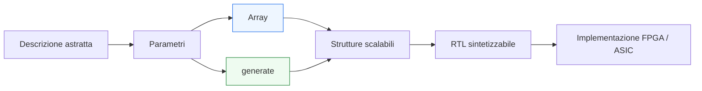
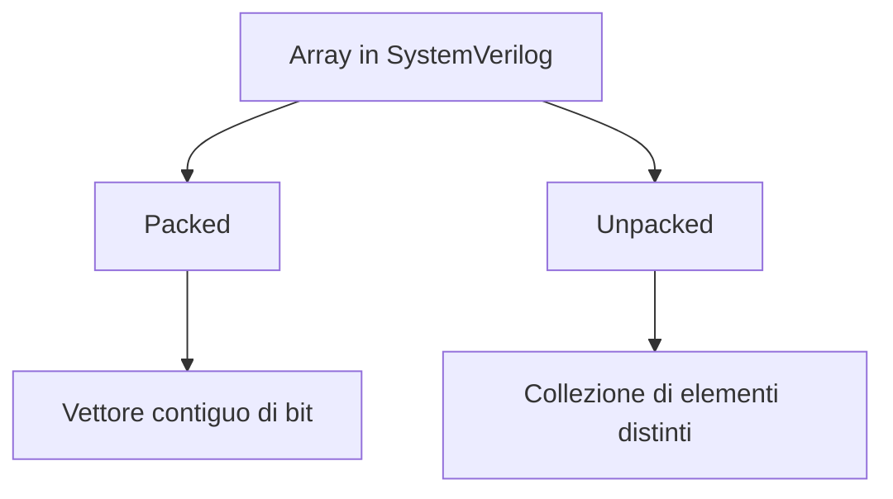
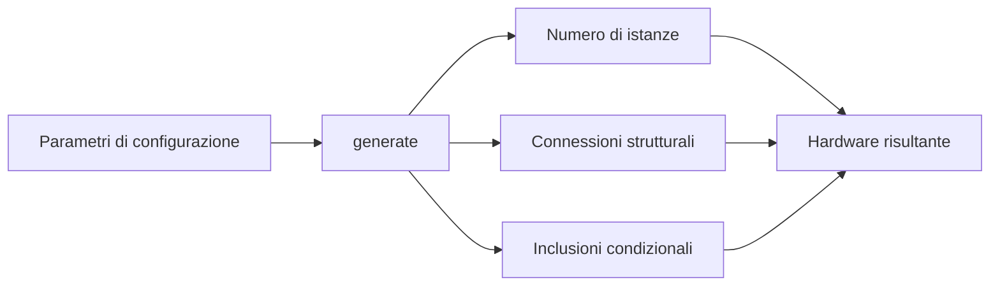

# Array e `generate` in SystemVerilog

Dopo aver introdotto **package**, **typedef** e l’organizzazione dei tipi condivisi, il passo successivo naturale è affrontare gli strumenti che permettono di rendere un progetto RTL più **scalabile**, **configurabile** e **riusabile**. In SystemVerilog, due famiglie di costrutti sono particolarmente importanti per questo scopo:
- gli **array**
- i costrutti **`generate`**

Questi strumenti non servono soltanto a scrivere meno codice. Il loro vero valore è permettere di descrivere in modo ordinato strutture hardware ripetitive o parametrizzabili, mantenendo leggibilità e coerenza tra:
- architettura;
- RTL;
- sintesi;
- timing;
- verifica;
- implementazione su FPGA e ASIC.

In un progetto reale, infatti, è molto comune dover descrivere:
- banchi di registri;
- vettori di canali;
- gruppi di moduli identici;
- pipeline con stadi ripetuti;
- bus e bundle di segnali in più copie;
- strutture configurabili per numero di bit, porte o unità parallele.

Questa pagina introduce il ruolo di array e `generate` con un taglio progettuale, mettendo in evidenza non solo la sintassi del linguaggio, ma soprattutto il loro impatto sul modo in cui si costruiscono architetture RTL robuste e scalabili.

## 1. Perché servono array e `generate`

Quando un progetto è molto semplice, può essere accettabile descrivere manualmente ogni segnale o ogni istanza. Ma appena la struttura cresce, questo approccio diventa rapidamente poco sostenibile.

### 1.1 Problemi della duplicazione manuale
Descrivere a mano strutture ripetitive può portare a:
- codice lungo e rumoroso;
- maggiore probabilità di errori;
- difficoltà di manutenzione;
- scarsa leggibilità;
- minore riusabilità.

### 1.2 Obiettivo della scalabilità
Array e `generate` permettono di descrivere:
- collezioni di elementi simili;
- connessioni organizzate;
- replicazione di hardware;
- configurazioni adattabili tramite parametri.

### 1.3 Collegamento con l’architettura
Questi costrutti sono particolarmente importanti quando l’architettura stessa prevede:
- parallelismo;
- profondità configurabile;
- più canali dello stesso tipo;
- moduli ripetuti;
- interconnessioni regolari.

In questi casi, la RTL deve poter riflettere la ripetizione strutturale senza degenerare in una lunga sequenza di copie manuali.

## 2. Che cosa sono gli array in SystemVerilog

In SystemVerilog, un array è una collezione ordinata di elementi dello stesso tipo. Gli array sono fondamentali per rappresentare gruppi di segnali o strutture dati ripetute.

### 2.1 Cosa possono rappresentare
Gli array possono modellare:
- vettori di bit;
- collezioni di registri;
- array di strutture;
- array di interfacce;
- banchi di stato;
- insiemi di canali;
- memorie astratte o piccoli storage strutturati.

### 2.2 Significato progettuale
Dal punto di vista RTL, un array è spesso il modo naturale per dire:
- “ho N elementi equivalenti”
- “ho una collezione di segnali correlati”
- “ho una struttura ripetuta che voglio trattare in modo uniforme”

### 2.3 Oltre la compattezza sintattica
Usare un array non significa soltanto scrivere meno. Significa esprimere esplicitamente che gli elementi fanno parte di un insieme omogeneo, con una struttura ordinata e riconoscibile.

## 3. Packed e unpacked array

Uno dei temi più importanti in SystemVerilog è la distinzione tra **packed array** e **unpacked array**. Questa distinzione non è solo sintattica: riflette modi diversi di organizzare i dati.

### 3.1 Packed array
Un packed array rappresenta una collezione di bit contigua, trattabile come un vettore unico dal punto di vista logico.

#### Significato concettuale
È adatto quando i bit fanno parte di:
- una parola dati;
- un campo;
- una codifica;
- un bus trattato come entità compatta.

### 3.2 Unpacked array
Un unpacked array rappresenta una collezione di elementi distinti, ciascuno dei quali può a sua volta essere un vettore, una struttura o un altro tipo.

#### Significato concettuale
È adatto quando si vuole rappresentare:
- un insieme di registri;
- una serie di canali;
- un vettore di payload;
- una collezione di oggetti omogenei.

### 3.3 Perché la distinzione conta
Capire bene questa differenza è importante perché:
- cambia il modo in cui si ragiona sul dato;
- influisce sulla leggibilità del codice;
- influisce sul modo in cui i campi vengono raggruppati o indicizzati;
- aiuta a mantenere una modellazione coerente con l’hardware.

## 4. Array come rappresentazione di strutture RTL ripetitive

In un progetto RTL, gli array non sono un costrutto astratto: sono il modo naturale per descrivere strutture fisicamente ripetute.

### 4.1 Banchi di registri
Un array può rappresentare un insieme di registri della stessa larghezza.

### 4.2 Collezioni di segnali
Può rappresentare:
- più ingressi o più uscite dello stesso tipo;
- più segnali di validità;
- più flag di stato;
- più porte di un blocco parametrico.

### 4.3 Canali paralleli
Un sistema con più canali dati paralleli può essere modellato in modo molto più leggibile usando array piuttosto che porte o segnali replicati a mano.

### 4.4 Pipeline e stadi
Anche certi aspetti di una pipeline possono essere rappresentati come collezioni indicizzate di stadi o segnali per stadio.

## 5. Array di tipi definiti dall’utente

Dopo aver introdotto `typedef`, è importante evidenziare che gli array diventano ancora più utili quando gli elementi non sono semplici vettori anonimi, ma tipi semantici ben definiti.

### 5.1 Array di `enum`
Possono rappresentare, per esempio:
- stato di più canali;
- categorie di operazione per più unità;
- stato locale di elementi replicati.

### 5.2 Array di `struct`
Sono molto utili per modellare:
- più payload dello stesso tipo;
- più entry di una coda;
- gruppi di segnali dati + metadati;
- più contesti operativi paralleli.

### 5.3 Beneficio progettuale
Quando array e `typedef struct` vengono usati insieme:
- la leggibilità cresce molto;
- la struttura del progetto rispecchia meglio l’architettura;
- l’integrazione tra moduli diventa più ordinata;
- la verifica beneficia di bundle più coerenti.

## 6. Indicizzazione e significato architetturale

Ogni volta che si usa un array, è importante chiedersi che cosa rappresenti davvero l’indice.

### 6.1 L’indice non è solo un numero
L’indice può rappresentare:
- un canale;
- una porta;
- uno stadio di pipeline;
- una entry di storage;
- una unità di elaborazione;
- un lane di parallelismo.

### 6.2 Perché è importante
Se l’indice ha un significato architetturale chiaro:
- il codice è più leggibile;
- il debug è più semplice;
- la documentazione implicita migliora;
- la review del progetto è più efficace.

### 6.3 Buona disciplina
Un array non dovrebbe essere usato per “nascondere” complessità senza chiarirne la semantica. Al contrario, dovrebbe rendere più evidente la regolarità strutturale del blocco.

## 7. Che cos’è `generate`

`generate` è il meccanismo del linguaggio che permette di costruire strutture hardware in modo parametrico e ripetitivo **a tempo di elaborazione**, cioè prima della sintesi vera e propria.

### 7.1 Significato fondamentale
Con `generate`, il progettista non descrive un comportamento dinamico del circuito, ma una **regola di costruzione della struttura hardware**.

### 7.2 Quando serve
È particolarmente utile quando si vuole:
- replicare istanze di moduli;
- includere o escludere blocchi in base a parametri;
- costruire interconnessioni regolari;
- scalare l’architettura a partire da configurazioni diverse.

### 7.3 Differenza rispetto ai costrutti procedurali
`generate` non appartiene alla logica eseguita in simulazione ciclo per ciclo come un `always_comb` o `always_ff`. Serve invece a definire la forma dell’hardware che verrà creato.

## 8. `for generate` e replicazione strutturale

Uno degli usi più comuni di `generate` è la replicazione tramite `for generate`.

### 8.1 Idea di base
Quando si ha una struttura composta da più copie simili di uno stesso blocco, il `for generate` permette di descriverla in modo regolare.

### 8.2 Esempi concettuali
Può essere usato per costruire:
- più canali paralleli;
- più istanze di una stessa unità;
- catene di moduli;
- ripetizione di blocchi di pipeline;
- strutture bit-slice o lane-based.

### 8.3 Vantaggi
I vantaggi principali sono:
- eliminazione della duplicazione manuale;
- maggiore regolarità del codice;
- migliore adattabilità al numero di copie desiderato;
- maggiore coerenza tra architettura e implementazione.

### 8.4 Attenzione metodologica
La replicazione deve restare leggibile. Se il pattern strutturale non è chiaro, anche un `generate` può diventare difficile da mantenere.

## 9. `if generate` e configurazione strutturale

Oltre alla replicazione, `generate` permette anche di selezionare strutture diverse in funzione di parametri.

### 9.1 Quando è utile
`if generate` è utile quando:
- una certa funzione è opzionale;
- si vuole includere o escludere un blocco;
- la struttura cambia tra configurazioni diverse;
- esistono versioni leggere o estese della stessa architettura.

### 9.2 Vantaggio progettuale
Questo rende possibile una configurazione architetturale controllata senza dover mantenere più versioni separate dello stesso modulo.

### 9.3 Collegamento con il riuso
La combinazione tra parametri e `if generate` rende i moduli più riusabili, perché possono essere adattati a contesti diversi senza riscrivere la struttura di base.

## 10. Parametri, array e `generate`

Il vero potenziale di questi costrutti emerge quando vengono usati insieme.

### 10.1 Parametri
I parametri definiscono:
- larghezze;
- numero di canali;
- numero di stadi;
- profondità di una struttura;
- modalità architetturali.

### 10.2 Array
Gli array rappresentano gli insiemi di elementi corrispondenti a quella configurazione.

### 10.3 Generate
`generate` costruisce materialmente la struttura risultante:
- istanze;
- connessioni;
- versioni condizionali del blocco.

### 10.4 Visione completa
Insieme, questi strumenti permettono di passare da:
- una descrizione fissa e poco flessibile
a:
- una descrizione strutturale adattabile e riusabile.

Questa è una delle chiavi di una RTL matura.

## 11. Impatto su sintesi e hardware risultante

Array e `generate` influiscono direttamente sul modo in cui l’hardware viene costruito.

### 11.1 Generate come descrizione strutturale
Il risultato del `generate` è hardware reale replicato o configurato. Non è un’astrazione che “sparisce”: diventa parte della netlist e quindi del circuito.

### 11.2 Array e inferenza
Gli array possono essere interpretati come:
- gruppi di registri;
- reti di segnali;
- banchi strutturati;
- elementi di memoria, a seconda della modalità d’uso.

### 11.3 Effetto sulla leggibilità della netlist e del debug
Una struttura ben organizzata con array e `generate` aiuta anche a mantenere più comprensibile:
- la gerarchia del progetto;
- la corrispondenza tra RTL e hardware;
- la lettura delle waveform.

### 11.4 Effetto sulla manutenzione
Se il numero di canali o la dimensione della struttura cambiano, una descrizione parametrica riduce il rischio di errori rispetto a una riscrittura manuale.

## 12. Impatto sul timing

L’uso di array e `generate` non migliora automaticamente il timing, ma influisce sul modo in cui il progetto cresce e quindi sul comportamento temporale del blocco.

### 12.1 Replicazione e fanout
Replicare canali o unità può aumentare:
- fanout di segnali comuni;
- complessità di controllo;
- pressione sul routing.

### 12.2 Strutture regolari
Una struttura regolare può però facilitare:
- floorplanning;
- analisi dei percorsi;
- organizzazione del datapath;
- bilanciamento tra canali.

### 12.3 Parametrizzazione consapevole
Rendere una struttura configurabile significa anche dover verificare che diverse configurazioni restino compatibili con gli obiettivi di timing.

### 12.4 Collegamento con pipeline e controllo
Quando array e `generate` vengono usati per costruire pipeline o canali multipli, il timing va valutato anche in termini di:
- allineamento tra stadi;
- distribuzione del controllo;
- latenza per canale;
- percorsi condivisi.

## 13. Impatto sulla verifica

Array e `generate` sono molto utili anche in verifica, ma richiedono disciplina.

### 13.1 Verifica di strutture replicate
Quando un blocco viene replicato più volte, è importante verificare:
- che ogni copia sia connessa correttamente;
- che il comportamento sia uniforme dove previsto;
- che eventuali differenze per indice siano coerenti con l’architettura.

### 13.2 Scalabilità della verifica
Una struttura parametrica richiede una verifica capace di adattarsi a:
- diverse larghezze;
- diversi numeri di istanze;
- diverse configurazioni strutturali.

### 13.3 Osservabilità
Array e strutture generate devono restare osservabili e comprensibili nelle waveform e nei report, altrimenti il debug può diventare più difficile.

### 13.4 Beneficio sistemico
Quando il progetto è ben organizzato, la verifica beneficia molto del fatto che:
- i pattern strutturali sono regolari;
- le istanze seguono una logica chiara;
- i tipi condivisi mantengono coerenza tra le copie.

## 14. Impatto su FPGA e ASIC

Le scelte legate ad array e `generate` hanno effetti pratici diversi a seconda del target.

### 14.1 Su FPGA
Su FPGA, questi costrutti sono particolarmente utili per:
- costruire canali paralleli;
- replicare blocchi che sfruttano LUT, DSP o BRAM;
- adattare la larghezza di datapath o il numero di lane;
- mantenere una struttura gerarchica leggibile in integrazione e debug.

### 14.2 Su ASIC
Su ASIC:
- aiutano a mantenere l’RTL riusabile e scalabile;
- facilitano la descrizione di strutture ripetitive regolari;
- rendono più semplice adattare macro-architettura e parallelismo;
- richiedono però attenzione a fanout, area e conseguenze fisiche della replicazione.

### 14.3 Nessuna astrazione gratuita
Ogni scelta parametrica o replicativa ha conseguenze reali su:
- area;
- timing;
- potenza;
- complessità del backend.

Per questo array e `generate` devono essere usati come strumenti architetturali consapevoli.

## 15. Errori comuni

Alcune difficoltà ricorrenti meritano attenzione.

### 15.1 Usare array senza significato chiaro
Se non è evidente che cosa rappresenti l’indice, il codice diventa più difficile da capire.

### 15.2 Parametrizzare troppo presto o senza controllo
Una parametrizzazione eccessiva può complicare inutilmente sia la RTL sia la verifica.

### 15.3 Replicare hardware senza valutare l’impatto fisico
Una struttura elegantemente parametrica può comunque diventare pesante o difficile da temporizzare.

### 15.4 Usare `generate` per nascondere complessità
Il fatto che una struttura sia generata non deve impedire al progettista di capire chiaramente l’hardware risultante.

### 15.5 Non allineare array, tipi e interfacce
Se array, `typedef`, `struct` e `interface` non sono progettati in modo coerente, il risultato può diventare più confuso invece che più ordinato.

## 16. Buone pratiche di modellazione

Per usare bene array e `generate` in SystemVerilog, alcune pratiche sono particolarmente efficaci.

### 16.1 Dare significato architetturale agli indici
L’indice dovrebbe corrispondere a una nozione reale del progetto: canale, stadio, porta, lane, entry.

### 16.2 Parametrizzare ciò che ha davvero senso scalare
Conviene rendere configurabili gli aspetti che rappresentano vere varianti architetturali.

### 16.3 Usare `typedef` e `struct` per mantenere leggibilità
Array di tipi ben definiti risultano molto più chiari di array di segnali anonimi.

### 16.4 Tenere visibile la struttura risultante
Quando si usa `generate`, bisogna poter ancora leggere mentalmente l’hardware che verrà creato.

### 16.5 Verificare le configurazioni reali
Una struttura parametrica è utile solo se le configurazioni usate nel progetto vengono davvero verificate e valutate rispetto a timing, area e correttezza funzionale.

## 17. Collegamento con il resto della sezione

Questa pagina si collega direttamente ai temi già introdotti:
- **`packages-and-typedefs.md`** ha fornito i tipi condivisi che possono diventare elementi di array;
- **`systemverilog-interfaces.md`** ha mostrato come organizzare collegamenti strutturati tra moduli;
- **`datapath-and-control.md`** e **`pipelining.md`** hanno introdotto strutture che spesso richiedono replicazione o indicizzazione;
- **`fsm.md`** e **`state-encoding.md`** hanno mostrato casi in cui più canali o più controllori potrebbero essere replicati.

Array e `generate` sono quindi lo strumento naturale per trasformare questi concetti in strutture parametrizzabili e riusabili.

## 18. In sintesi

Array e `generate` sono strumenti fondamentali per costruire una RTL scalabile e ordinata. Gli array permettono di rappresentare insiemi di elementi omogenei con significato architetturale chiaro; `generate` permette di costruire strutture hardware ripetitive o configurabili a partire da parametri.

Usati bene, questi costrutti:
- riducono duplicazioni;
- migliorano leggibilità e riuso;
- rendono più chiara la struttura dell’hardware;
- aiutano a mantenere coerenza tra architettura, RTL e verifica;
- supportano la costruzione di datapath e controlli più flessibili su FPGA e ASIC.

Il loro valore più grande non è scrivere meno codice, ma descrivere meglio il fatto che il progetto contiene **regolarità strutturale**.

## Prossimo passo

Il passo più naturale ora è **`parameters-and-configuration.md`**, perché dopo aver introdotto array e `generate` conviene approfondire in modo specifico:
- `parameter`
- `localparam`
- configurazione strutturale
- ampiezze e dimensionamento
- controllo delle varianti architetturali
- equilibrio tra riuso, leggibilità e verificabilità

In alternativa, un altro passo molto naturale è **`latency-and-throughput.md`**, se vuoi tornare sul ramo architetturale e prestazionale collegato a pipeline e parallelismo.
