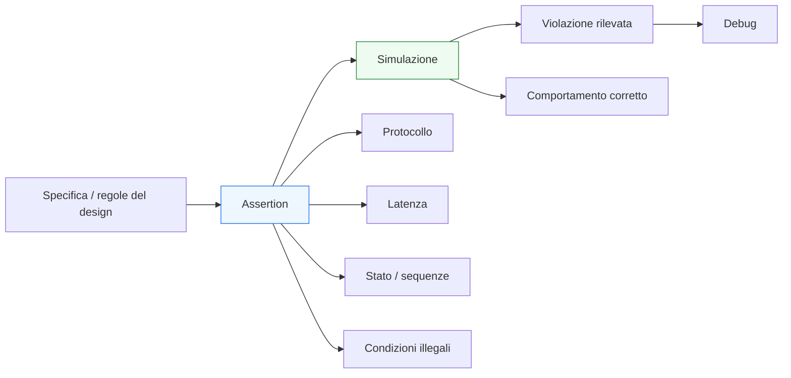
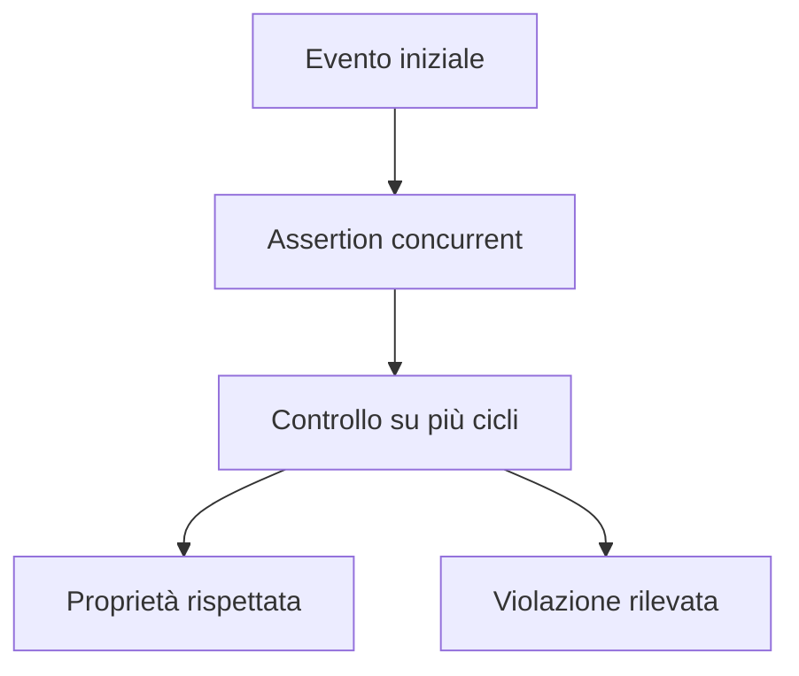

# Fondamenti di assertion in SystemVerilog

Dopo aver introdotto i **fondamenti della verifica** e la **struttura di un testbench**, il passo successivo naturale è affrontare uno degli strumenti più utili per rendere la verifica più esplicita, rigorosa e leggibile: le **assertion**. In SystemVerilog, le assertion permettono di esprimere in modo diretto proprietà che il design deve rispettare, trasformando regole progettuali e vincoli di protocollo in controlli verificabili durante la simulazione.

Dal punto di vista metodologico, le assertion rappresentano un passaggio molto importante: spostano la verifica da un modello basato solo su stimoli e osservazione manuale a un modello in cui il comportamento atteso viene descritto in forma più dichiarativa. In altre parole, aiutano a rispondere alla domanda:

- quali condizioni devono essere sempre vere?
- quali sequenze temporali devono avvenire?
- quali combinazioni di segnali sono illegali?
- quando un protocollo è rispettato o violato?

Questo è particolarmente importante nella progettazione RTL, dove gran parte degli errori non riguarda soltanto il valore dei segnali, ma anche il loro **significato temporale**:
- quando un segnale può cambiare;
- in quale ciclo deve arrivare una risposta;
- quando un trasferimento è valido;
- come evolve una FSM;
- come si comporta una pipeline sotto stall o flush.

Questa pagina introduce le assertion di base in modo coerente con il resto della documentazione:
- con taglio didattico ma tecnico;
- orientato alla verifica funzionale RTL;
- senza entrare ancora in metodologie avanzate o formal verification approfondita;
- mantenendo il collegamento con FSM, handshake, latenza, pipeline, verificabilità e qualità della RTL.

## 1. Perché servono le assertion

Nel testbench tradizionale, una parte importante della verifica consiste nel generare stimoli, osservare il DUT e confrontare il comportamento con quanto atteso. Questo resta fondamentale, ma non sempre è sufficiente a rendere le proprietà del design chiare e controllate in modo sistematico.

### 1.1 Limite del solo checking procedurale
Senza assertion, molte regole del design restano:
- implicite;
- sparse nel testbench;
- affidate alla sola lettura delle waveform;
- difficili da riusare o mantenere;
- meno visibili durante review e debug.

### 1.2 Vantaggio delle assertion
Le assertion permettono di esprimere direttamente condizioni come:
- questo segnale non deve mai assumere una certa combinazione;
- quando accade un evento, una risposta deve arrivare entro certi cicli;
- in una data condizione, il protocollo deve rispettare una certa sequenza;
- un segnale deve restare stabile finché un handshake non si completa.

### 1.3 Valore progettuale
Dal punto di vista metodologico, una buona assertion:
- rende il comportamento atteso più esplicito;
- riduce il rischio di bug non notati;
- accelera il debug;
- documenta meglio il protocollo;
- migliora la qualità complessiva della verifica.

## 2. Che cos’è una assertion

Una assertion è una dichiarazione che esprime una proprietà che deve risultare vera durante l’esecuzione del design o del testbench.

### 2.1 Significato di base
Concettualmente, una assertion dice:
- “questo deve essere vero”
oppure:
- “quando accade A, allora deve accadere anche B”
oppure:
- “questa sequenza di eventi è permessa / richiesta / vietata”.

### 2.2 Ruolo nella simulazione
Durante la simulazione, una assertion viene valutata e può:
- passare silenziosamente se la proprietà è rispettata;
- segnalare una violazione se la proprietà fallisce;
- produrre messaggi utili al debug.

### 2.3 Assertion come regola verificabile
La cosa importante è che una assertion rende una regola progettuale:
- esplicita;
- osservabile;
- automatizzabile;
- riutilizzabile.

## 3. Due grandi famiglie: immediate e concurrent

In SystemVerilog, le assertion si dividono in due famiglie principali.

### 3.1 Assertion immediate
Le assertion immediate vengono valutate nel punto procedurale in cui compaiono. Sono adatte a esprimere controlli locali e istantanei.

### 3.2 Assertion concurrent
Le assertion concurrent sono pensate per descrivere proprietà temporali e sequenze nel tempo. Sono particolarmente importanti nella verifica RTL, perché molti vincoli del design dipendono dal clock e dalla relazione tra eventi su cicli diversi.

### 3.3 Perché la distinzione è importante
- Le assertion immediate sono utili per controlli semplici o locali.
- Le assertion concurrent sono il vero strumento naturale per protocolli, FSM, pipeline, latenza e handshake.

In questa pagina il focus principale sarà sulle idee di base, con particolare attenzione al valore delle assertion concurrent nella verifica RTL.

## 4. Assertion come documentazione del comportamento

Uno degli aspetti più utili delle assertion è che non servono solo a trovare errori: aiutano anche a documentare il comportamento atteso del design.

### 4.1 Regole esplicite
Molte proprietà importanti del blocco possono essere scritte come assertion:
- condizioni di reset;
- protocollo di trasferimento;
- tempi di risposta;
- relazioni tra stato e output;
- vincoli su segnali di controllo.

### 4.2 Beneficio per la review
Durante una review, una assertion ben scritta rende più chiaro:
- che cosa si considera corretto;
- quali sequenze sono attese;
- quali errori si vogliono intercettare;
- quali assunzioni sono alla base della verifica.

### 4.3 Beneficio sul lungo periodo
Anche quando il progetto cresce o passa di mano, le assertion mantengono una parte importante della conoscenza tecnica direttamente associata al comportamento del design.

## 5. Assertion immediate: controlli locali

Le assertion immediate sono utili quando si vuole controllare una condizione in un preciso punto del flusso procedurale.

### 5.1 Quando sono utili
Sono adatte a:
- controlli locali nel testbench;
- verifiche puntuali dopo una certa operazione;
- controllo di condizioni che non richiedono una relazione temporale complessa;
- validazione di assunzioni interne durante il debug.

### 5.2 Valore pratico
Sono spesso un primo livello di checking più esplicito rispetto a semplici `if` con messaggi di errore.

### 5.3 Limite principale
Non sono lo strumento più naturale quando il problema riguarda una sequenza temporale su più cicli. In quei casi, le assertion concurrent risultano molto più espressive.

## 6. Assertion concurrent: controllare il tempo

Le assertion concurrent sono particolarmente adatte alla verifica RTL perché la maggior parte delle proprietà interessanti in un circuito digitale è di natura temporale.

### 6.1 Perché sono centrali
Una proprietà RTL rara volta è solo:
- “il segnale vale X adesso”.

Più spesso è qualcosa come:
- “quando parte una richiesta, la risposta deve arrivare entro N cicli”;
- “finché il ricevente non è pronto, il dato deve restare stabile”;
- “dopo il reset, il blocco deve tornare in idle”;
- “se la FSM entra in uno stato, deve poi uscire secondo certe regole”.

### 6.2 Legame con il clock
Le assertion concurrent ragionano naturalmente in termini di:
- eventi sincronizzati al clock;
- sequenze di cicli;
- intervalli temporali;
- condizioni che devono valere in più istanti successivi.

### 6.3 Collegamento con la struttura RTL
Sono particolarmente utili per:
- FSM;
- handshake;
- pipeline;
- latenza;
- output registrati;
- vincoli di stabilità;
- relazioni tra segnali di stato e controllo.

## 7. Clocking e contesto temporale delle assertion

Per essere significative, le assertion temporali devono essere legate a un contesto temporale chiaro.

### 7.1 Ruolo del clock
Nella verifica RTL, le proprietà interessanti vengono quasi sempre valutate rispetto a un clock:
- fronte attivo;
- evoluzione ciclo per ciclo;
- relazione tra stato corrente e ciclo successivo.

### 7.2 Ruolo del reset
È spesso necessario tener conto del reset, perché durante il reset o subito dopo il suo rilascio certe proprietà possono non essere ancora significative oppure devono seguire regole particolari.

### 7.3 Significato metodologico
Una buona assertion non vive in astratto: deve essere scritta in modo coerente con:
- il dominio di clock corretto;
- la semantica del reset;
- il significato temporale del protocollo verificato.

## 8. Assertion per condizioni illegali

Uno degli usi più immediati delle assertion è intercettare combinazioni che non dovrebbero mai verificarsi.

### 8.1 Perché sono utili
Questo tipo di assertion è prezioso perché permette di rilevare rapidamente:
- stati impossibili;
- segnali mutuamente incompatibili;
- protocolli violati;
- uscite in contraddizione con lo stato del blocco;
- combinazioni di controllo non consentite.

### 8.2 Esempi concettuali
Si possono esprimere regole come:
- due comandi incompatibili non devono mai essere attivi insieme;
- il blocco non deve presentare un output valido quando è in reset;
- una FSM non deve trovarsi in uno stato illegale;
- uno stadio invalido non deve propagare un dato come se fosse valido.

### 8.3 Valore per il debug
Queste assertion aiutano molto perché intercettano problemi nel momento in cui si manifestano, spesso prima che generino effetti più lontani e più difficili da diagnosticare.

## 9. Assertion per handshake e protocolli

Le interfacce sono uno dei campi in cui le assertion risultano più naturali ed efficaci.

### 9.1 Perché il protocollo è un buon candidato
Molti errori di integrazione non dipendono dalla funzione numerica del blocco, ma dal modo in cui i segnali di protocollo vengono usati nel tempo.

### 9.2 Proprietà tipiche
Con le assertion si possono esprimere regole come:
- un trasferimento avviene solo quando `valid` e `ready` sono coerenti;
- il dato deve restare stabile finché il trasferimento non è completato;
- un segnale `done` non deve comparire senza una richiesta precedente;
- `start` e `done` devono rispettare certe relazioni temporali;
- il backpressure non deve causare perdita di dati.

### 9.3 Grande utilità pratica
Le assertion sui protocolli sono spesso tra le più utili in assoluto, perché:
- sono riutilizzabili;
- segnalano errori in modo diretto;
- documentano bene il contratto dell’interfaccia;
- si applicano bene a più moduli del progetto.

## 10. Assertion per FSM

Le FSM offrono un altro contesto ideale per le assertion.

### 10.1 Aspetti verificabili
Le assertion possono controllare:
- stato iniziale dopo reset;
- transizioni consentite;
- impossibilità di certe transizioni;
- relazione tra stato e uscite;
- permanenza in uno stato finché una condizione non cambia.

### 10.2 Perché è utile
Una FSM è una struttura esplicitamente temporale, quindi molte sue proprietà si esprimono molto bene come:
- sequenze;
- vincoli di evoluzione;
- condizioni di stabilità;
- obblighi di risposta.

### 10.3 Legame con `enum` e leggibilità
Se la FSM è modellata in modo ordinato con stati simbolici e logica separata, anche le assertion risultano più leggibili e più facili da mantenere.

## 11. Assertion per pipeline e latenza

Quando un blocco contiene pipeline o ritardi strutturali, le assertion aiutano a rendere esplicita la latenza attesa.

### 11.1 Latenza come proprietà
In una pipeline, non basta controllare che il dato arrivi giusto: bisogna controllare che arrivi **nel momento corretto**.

### 11.2 Proprietà tipiche
Si possono formulare controlli come:
- dopo l’accettazione di un input, l’output deve diventare valido dopo N cicli;
- i segnali di validità devono avanzare coerentemente tra gli stadi;
- se uno stadio è in stall, il contenuto non deve avanzare;
- un flush deve invalidare i dati in volo secondo regole precise.

### 11.3 Valore per la verifica temporale
Le assertion diventano qui uno strumento molto potente per trasformare la latenza attesa da conoscenza implicita a proprietà verificata.

## 12. Assertion e debug

Una buona assertion non serve solo a dire che qualcosa è sbagliato, ma aiuta anche a capire che cosa è andato storto.

### 12.1 Fallimento informativo
Un fallimento ben contestualizzato permette di capire:
- quale proprietà è stata violata;
- in quale ciclo o condizione;
- con quali segnali coinvolti;
- se il problema riguarda protocollo, stato, pipeline o valore.

### 12.2 Assertion come sensori di errore
Le assertion possono essere viste come sensori posizionati nei punti critici del comportamento del design:
- all’ingresso del protocollo;
- sulle transizioni di stato;
- all’uscita della pipeline;
- nei punti in cui il dato e il controllo devono restare allineati.

### 12.3 Effetto sulla velocità di debug
Quando ben progettate, permettono di scoprire il problema più vicino possibile alla sua origine, evitando di dover inseguire solo gli effetti secondari nelle waveform.

## 13. Assertion e qualità della RTL

Le assertion funzionano meglio quando la RTL è stata scritta in modo chiaro.

### 13.1 RTL leggibile, proprietà leggibili
Se il design ha:
- segnali con nomi chiari;
- separazione tra combinatoria e sequenziale;
- FSM ordinate;
- interfacce ben definite;
- pipeline leggibili;

allora anche le assertion risultano:
- più chiare;
- più naturali;
- più stabili nel tempo;
- più facili da correlare al comportamento del DUT.

### 13.2 RTL confusa, assertion fragili
Se invece i segnali sono ambigui e la struttura è poco leggibile:
- le proprietà diventano più difficili da formulare;
- i fallimenti sono meno diagnostici;
- la manutenzione peggiora.

### 13.3 Relazione virtuosa
In questo senso, coding style e assertion si rafforzano a vicenda:
- una buona RTL facilita buone assertion;
- buone assertion aiutano a chiarire la struttura della RTL.

## 14. Assertion e testbench

Le assertion non sostituiscono il testbench, ma lo completano in modo molto efficace.

### 14.1 Stimolo e checking restano necessari
Un testbench deve ancora:
- generare clock e reset;
- applicare stimoli;
- osservare risultati;
- gestire scenari di prova;
- costruire eventuali modelli attesi.

### 14.2 Che cosa aggiungono le assertion
Le assertion aggiungono:
- controllo esplicito di proprietà locali e temporali;
- maggiore vicinanza tra regola progettuale e checking;
- miglior rilevazione di violazioni di protocollo;
- verifica più sistematica di condizioni non immediatamente visibili nel solo confronto finale di output.

### 14.3 Complementarità
Il rapporto corretto è questo:
- il testbench costruisce il contesto della verifica;
- le assertion formalizzano e sorvegliano regole essenziali del comportamento.

## 15. Errori comuni nell’uso delle assertion

Anche le assertion, se usate male, possono perdere gran parte del loro valore.

### 15.1 Scrivere assertion troppo vaghe
Una proprietà generica o ambigua aiuta poco sia la verifica sia il debug.

### 15.2 Scriverne troppo poche
Se le proprietà critiche del protocollo o della latenza non sono espresse, restano affidate a checking implicito o manuale.

### 15.3 Scriverne troppe e poco leggibili
Un eccesso di assertion poco organizzate può generare rumore e rendere più difficile capire quali siano davvero le proprietà importanti.

### 15.4 Non collegarle alla reale architettura
Le assertion devono riflettere:
- il protocollo reale;
- il comportamento temporale effettivo;
- la latenza vera del blocco;
- la semantica del reset e degli stati.

### 15.5 Dimenticare il contesto di reset
Molte proprietà hanno significato solo fuori dal reset oppure richiedono una gestione speciale nelle fasi iniziali.

## 16. Buone pratiche di base

Per introdurre bene le assertion in una verifica RTL SystemVerilog, alcune linee guida sono particolarmente efficaci.

### 16.1 Partire dalle proprietà più importanti
Conviene iniziare con assertion che esprimono:
- invarianti semplici;
- handshake fondamentali;
- latenza attesa;
- stato iniziale e transizioni principali.

### 16.2 Scrivere proprietà leggibili
L’obiettivo non è solo verificare, ma anche rendere chiaro il comportamento atteso.

### 16.3 Collocarle vicino ai punti concettualmente giusti
Le assertion sono più utili quando sono associate ai punti del design o del testbench in cui la proprietà ha senso.

### 16.4 Usarle per i protocolli e per il tempo
Sono particolarmente efficaci quando il problema da verificare riguarda:
- sequenze di eventi;
- stabilità del dato;
- relazioni di latenza;
- coerenza tra stato e output.

### 16.5 Mantenere il rapporto con il debug
Ogni assertion dovrebbe contribuire a rendere più facile la diagnosi di un bug, non solo a produrre un fallimento.

## 17. Collegamento con il resto della sezione

Questa pagina si collega in modo naturale a molti temi già introdotti:
- **`verification-basics.md`** ha definito il ruolo della verifica e del checking;
- **`testbench-structure.md`** ha mostrato come organizzare un banco di prova;
- **`interfaces-and-handshake.md`** ha introdotto i protocolli che spesso diventano proprietà da esprimere con assertion;
- **`fsm.md`** e **`state-encoding.md`** hanno mostrato strutture naturalmente verificabili con proprietà temporali;
- **`pipelining.md`** e **`latency-and-throughput.md`** hanno introdotto vincoli temporali e di flusso che le assertion aiutano a rendere espliciti;
- **`coding-style-rtl.md`** ha evidenziato che una RTL chiara rende anche le proprietà più naturali da formulare.

Le assertion sono quindi il ponte tra la conoscenza progettuale del blocco e la sua verifica automatica nel tempo.

## 18. In sintesi

Le assertion in SystemVerilog sono uno strumento fondamentale per rendere la verifica più esplicita, più rigorosa e più vicina al comportamento reale atteso dal design. Permettono di esprimere:
- condizioni che devono sempre valere;
- sequenze temporali richieste;
- vincoli di protocollo;
- proprietà di latenza;
- relazioni tra stato, controllo e uscite.

Usate bene, migliorano non solo la capacità di trovare bug, ma anche:
- la chiarezza della verifica;
- la qualità del debug;
- la documentazione del comportamento del blocco;
- la robustezza del progetto nel suo insieme.

Per questo motivo, le assertion non vanno viste come un’aggiunta opzionale o avanzata, ma come uno dei modi più naturali per trasformare la conoscenza progettuale in controlli realmente verificabili.

## Prossimo passo

Il passo più naturale ora è **`simulation-workflow.md`**, perché dopo aver introdotto testbench e assertion conviene descrivere il flusso operativo con cui la verifica RTL viene eseguita, osservata e iterata:
- compilazione e simulazione
- esecuzione dei casi di test
- lettura dei risultati
- uso delle waveform
- regressione
- ciclo di debug e correzione

In alternativa, un altro passo molto naturale è **`coverage-basics.md`**, se vuoi aprire il tema di come misurare ciò che la verifica ha effettivamente esercitato.
