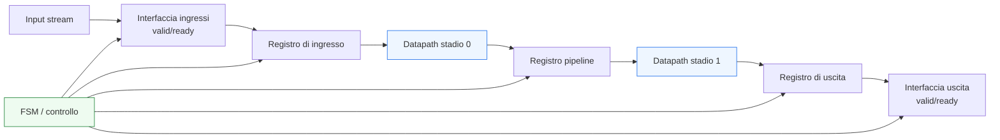
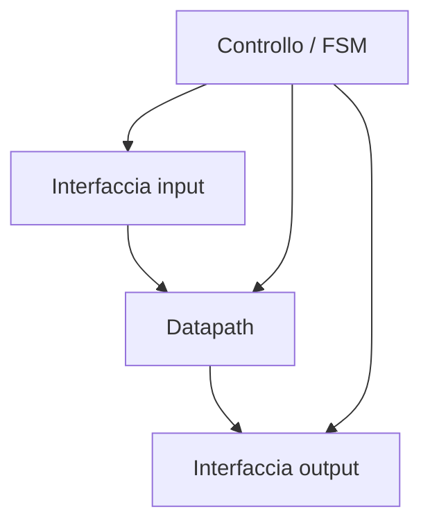

# Caso di studio SystemVerilog: un blocco di elaborazione stream con controllo, pipeline e verifica

Dopo aver costruito in modo progressivo i principali concetti di **SystemVerilog RTL**, il passo naturale conclusivo è mostrare come questi elementi si combinano in un esempio progettuale coerente. Questa pagina non introduce un nuovo costrutto del linguaggio, ma mette insieme ciò che è stato sviluppato nelle pagine precedenti:
- struttura del modulo;
- separazione tra combinatoria e sequenziale;
- FSM;
- datapath e controllo;
- interfacce e handshake;
- pipeline;
- reset;
- parametrizzazione;
- verifica di base;
- attenzione a timing, integrazione e robustezza.

L’obiettivo non è costruire un tutorial tool-specific né presentare codice HDL completo, ma mostrare **come ragiona un progettista RTL** quando deve passare da una specifica funzionale a un blocco implementabile e verificabile.

Il caso di studio scelto è un blocco di elaborazione stream relativamente semplice ma molto istruttivo: un modulo che riceve dati in ingresso tramite handshake, li elabora su più cicli, li fa avanzare in una piccola pipeline e restituisce il risultato in uscita con protocollo coerente. Questo tipo di blocco è abbastanza generale da comparire in:
- acceleratori hardware;
- preprocessori di dati;
- unità di filtraggio o trasformazione;
- sottoblocchi di datapath in FPGA;
- moduli di elaborazione in un SoC o in un backend ASIC.

## 1. Obiettivo del blocco

Il blocco del caso di studio riceve un flusso di dati in ingresso e produce un flusso di risultati in uscita. Dal punto di vista funzionale, il comportamento può essere descritto così:
- accetta un dato quando l’interfaccia di ingresso completa il trasferimento;
- esegue una trasformazione interna in più fasi;
- mantiene il controllo dell’avanzamento attraverso una piccola FSM;
- presenta il risultato in uscita quando il dato è pronto;
- rispetta il backpressure del lato ricevente.

### 1.1 Perché questo esempio è utile
Questo scenario è didatticamente molto ricco perché costringe a trattare insieme:
- protocollo di interfaccia;
- validità dei dati;
- stato della macchina di controllo;
- pipeline locale;
- latenza del risultato;
- relazione tra controllo e datapath;
- comportamento in reset;
- verifica del flusso temporale.

### 1.2 Perché è realistico
Molti blocchi reali nei sistemi digitali non sono solo “funzioni combinatorie” né solo “FSM pure”, ma una combinazione di:
- una parte dati;
- una parte di controllo;
- una forma di buffering o pipeline;
- una semantica di protocollo.

## 2. Specifica funzionale di alto livello

Prima di scrivere RTL, è utile formulare il comportamento a livello architetturale.

### 2.1 Interfaccia di ingresso
Il modulo riceve:
- dato di input;
- segnale `valid` dal produttore;
- segnale `ready` verso il produttore.

Il trasferimento avviene quando ingresso valido e disponibilità del blocco coincidono.

### 2.2 Interfaccia di uscita
Il modulo presenta:
- dato di output;
- `valid` verso il consumatore;
- `ready` dal consumatore.

Anche in uscita, il risultato viene considerato trasferito solo quando entrambe le condizioni del protocollo sono soddisfatte.

### 2.3 Elaborazione interna
L’elaborazione è divisa in due fasi:
- una prima trasformazione applicata subito dopo l’accettazione del dato;
- una seconda trasformazione applicata nello stadio successivo.

Questo introduce una piccola pipeline locale.

### 2.4 Comportamento sotto backpressure
Se il blocco a valle non è pronto:
- il dato di uscita deve restare stabile;
- il blocco non deve perdere il risultato;
- l’avanzamento interno deve essere coerente con lo stato della pipeline.

## 3. Traduzione architetturale in sottoblocchi logici

Una volta chiarita la specifica, si può partizionare il blocco in componenti architetturali.

### 3.1 Datapath
Il datapath contiene:
- registro di ingresso;
- stadio combinatorio 0;
- registro di pipeline;
- stadio combinatorio 1;
- registro o buffer di uscita.

### 3.2 Controllo
Il controllo gestisce:
- accettazione del dato in ingresso;
- avanzamento tra gli stadi;
- validità dei registri intermedi;
- disponibilità all’ingresso;
- presentazione del risultato in uscita;
- eventuale permanenza in attesa quando l’uscita è bloccata.

### 3.3 Interfacce
Le interfacce fanno da confine tra il blocco e il sistema:
- protocollo `valid/ready` in ingresso;
- protocollo `valid/ready` in uscita.

### 3.4 Stato interno
Il blocco ha uno stato minimo ma reale:
- pipeline vuota o occupata;
- stadio di output libero o bloccato;
- eventuale fase operativa della FSM.

## 4. Scelte di modellazione RTL

A questo punto si può decidere come strutturare la descrizione RTL.

### 4.1 Separazione tra combinatoria e sequenziale
Conviene modellare:
- registri e stato in `always_ff`;
- next-state e segnali di controllo in `always_comb`;
- eventuali trasformazioni combinatorie del datapath in blocchi o assegnazioni chiaramente distinguibili.

### 4.2 Visibilità dello stato
I segnali che rappresentano:
- validità degli stadi;
- stato della FSM;
- output in attesa;

dovrebbero essere chiaramente leggibili.

### 4.3 Distinzione tra dato e controllo
I dati possono attraversare il blocco in forma pipelined, mentre il controllo decide:
- quando un nuovo dato entra;
- quando uno stadio avanza;
- quando il blocco deve fermarsi;
- quando il risultato può essere consumato.

### 4.4 Perché questa scelta è importante
Questa struttura:
- migliora la leggibilità;
- semplifica la verifica;
- rende la latenza del blocco più chiara;
- facilita la correlazione con timing e implementazione.

## 5. Ruolo della FSM nel caso di studio

Anche se il blocco non è dominato da una FSM complessa, il controllo interno può essere utilmente rappresentato come una macchina a stati o una struttura equivalente.

### 5.1 Stati concettuali possibili
Per esempio:
- `IDLE`: nessun dato in elaborazione;
- `STAGE0_ACTIVE`: dato acquisito e in prima fase;
- `STAGE1_ACTIVE`: dato in seconda fase o pronto all’uscita;
- `OUTPUT_WAIT`: risultato disponibile ma uscita non ancora accettata.

### 5.2 Perché una FSM aiuta
Una FSM rende esplicito:
- in quale fase operativa si trova il blocco;
- quali segnali di controllo devono essere attivi;
- quando l’ingresso può accettare un nuovo dato;
- quando l’uscita diventa valida.

### 5.3 Alternative
In un blocco semplice, alcune di queste condizioni potrebbero essere codificate direttamente tramite bit di validità e logica combinatoria. Tuttavia, una piccola FSM può rendere più leggibile il comportamento temporale complessivo.

## 6. Handshake e controllo del flusso

Il protocollo di handshake è il primo vincolo forte che modella il comportamento esterno del blocco.

### 6.1 Ingresso
Il blocco può accettare un dato solo se:
- il produttore presenta `valid`;
- il blocco è pronto, cioè `ready` è attivo.

### 6.2 Uscita
Il blocco può liberare il risultato solo se:
- il dato di uscita è valido;
- il consumatore presenta `ready`.

### 6.3 Conseguenze sul controllo
Questo implica che il controllo deve tenere conto di:
- occupazione interna della pipeline;
- disponibilità dello stadio di uscita;
- eventuale backpressure;
- necessità di non perdere né duplicare dati.

### 6.4 Beneficio didattico
Questo caso di studio mostra bene che il protocollo di interfaccia non è “esterno” al blocco, ma ne modella direttamente l’architettura interna.

## 7. Pipeline locale e validità dei dati

Uno degli aspetti più importanti del blocco è che il datapath è diviso in più stadi.

### 7.1 Perché introdurre pipeline
La pipeline locale può servire a:
- ridurre la profondità combinatoria;
- rendere più chiara la sequenza di elaborazione;
- aumentare la frequenza raggiungibile;
- separare fasi funzionali diverse.

### 7.2 Che cosa va propagato
Non basta propagare il dato. Occorre propagare anche:
- bit di validità;
- eventuali segnali di controllo associati;
- contesto minimo necessario per sapere se il contenuto dello stadio è significativo.

### 7.3 Stato della pipeline dopo reset
Dopo reset, la pipeline dovrebbe essere logicamente vuota:
- nessuno stadio valido;
- nessun output valido;
- nessun trasferimento spurio.

### 7.4 Relazione con il backpressure
Se l’uscita è bloccata, il controllo deve decidere:
- se congelare lo stadio finale;
- se fermare anche gli stadi precedenti;
- come impedire la perdita di coerenza tra dati e validità.

## 8. Parametrizzazione del blocco

Per rendere il blocco più realistico e coerente con la documentazione, conviene immaginarlo come modulo parametrico.

### 8.1 Parametri naturali
È ragionevole parametrizzare:
- larghezza del dato;
- eventuale numero di stadi;
- modalità della trasformazione;
- profondità di piccoli buffer;
- larghezza di campi di metadati, se presenti.

### 8.2 Valore progettuale
La parametrizzazione permette di:
- riusare il blocco in più contesti;
- esplorare trade-off tra area e prestazioni;
- confrontare versioni più semplici e più spinte.

### 8.3 Disciplina necessaria
Nel caso di studio è importante ricordare che i parametri devono restare:
- architetturalmente significativi;
- verificabili;
- leggibili;
- coerenti con la struttura di handshake e pipeline.

## 9. Strategia di reset del caso di studio

Il reset del blocco è una parte essenziale della sua definizione.

### 9.1 Obiettivo del reset
Il reset deve garantire che:
- la FSM torni in `IDLE` o stato equivalente;
- i bit di validità della pipeline siano azzerati;
- l’uscita non presenti dati validi;
- il blocco non completi transazioni spurie;
- l’interfaccia di ingresso e di uscita partano da una condizione coerente.

### 9.2 Perché è importante
In un blocco con pipeline e handshake, una strategia di reset ambigua può produrre:
- output falsamente validi;
- stadi interni inconsapevolmente attivi;
- mismatch tra controllo e datapath;
- difficoltà di verifica.

### 9.3 Scelta progettuale
Dal punto di vista concettuale, il reset va applicato soprattutto a:
- stato di controllo;
- validità degli stadi;
- stato del buffer di uscita.

Il contenuto numerico dei registri dati può essere meno importante del fatto che tali dati non siano considerati validi.

## 10. Timing e scelte di microarchitettura

Il blocco del caso di studio è utile anche per ragionare sui compromessi temporali.

### 10.1 Senza pipeline
Una versione più semplice, non pipelined, avrebbe:
- meno registri;
- minore latenza in cicli;
- potenziale percorso combinatorio più lungo;
- throughput potenzialmente inferiore a frequenza elevata.

### 10.2 Con pipeline
La versione pipelined ha:
- maggiore latenza;
- cammini critici più corti;
- migliore potenziale di Fmax;
- throughput più alto una volta riempita la pipeline.

### 10.3 Influenza dell’handshake
Il throughput effettivo dipende anche dalla disponibilità del blocco a valle:
- se l’uscita accetta a ogni ciclo, il blocco può andare a regime;
- se il ricevente applica backpressure, il throughput cala e il controllo deve mantenere la coerenza degli stadi.

### 10.4 Valore del caso di studio
Questo esempio mostra bene che timing, protocollo e architettura non sono temi separati: si influenzano reciprocamente.

## 11. Struttura del testbench per il caso di studio

Dal punto di vista della verifica, il blocco è abbastanza ricco da richiedere un testbench ben organizzato ma ancora gestibile.

### 11.1 Componenti principali
Il testbench dovrebbe includere:
- clock e reset;
- generazione di input stream;
- controllo del `ready` in uscita per simulare backpressure;
- monitor per eventi di input e output;
- checking di dati, latenza e protocollo;
- assertion sulle regole essenziali del canale.

### 11.2 Scenari di prova significativi
Scenari naturali includono:
- singola transazione nominale;
- sequenza continua di input;
- backpressure in uscita;
- reset iniziale;
- reset durante attività;
- occupazione progressiva della pipeline;
- output ritardato dal ricevente.

### 11.3 Perché è un buon banco di prova didattico
Questo testbench costringe a verificare insieme:
- correttezza funzionale;
- correttezza temporale;
- validità dell’handshake;
- robustezza del reset.

## 12. Assertion utili nel caso di studio

Le assertion sono particolarmente adatte a questo blocco perché molte delle sue proprietà sono temporali.

### 12.1 Assertion sul reset
Si possono esprimere proprietà come:
- dopo reset, nessuno stadio è valido;
- la FSM è nello stato iniziale;
- l’uscita non è valida.

### 12.2 Assertion sull’handshake
Per esempio:
- il dato di uscita deve restare stabile finché non viene accettato;
- un input accettato deve corrispondere a un avanzamento coerente dello stato interno;
- non devono esserci trasferimenti spurii in assenza di `valid`.

### 12.3 Assertion sulla latenza
Per una pipeline con latenza definita, si può esprimere che:
- un input accettato genera un output valido dopo il numero atteso di cicli, salvo stall del canale di uscita.

### 12.4 Valore del checking dichiarativo
Questo rende il comportamento atteso più esplicito e più vicino all’architettura del blocco.

## 13. Coverage utile per il caso di studio

Anche la coverage ha un ruolo naturale.

### 13.1 Coverage della FSM
Conviene sapere se:
- tutti gli stati sono stati visitati;
- tutte le transizioni importanti sono avvenute.

### 13.2 Coverage dell’interfaccia
È utile coprire:
- input accettato immediatamente;
- output accettato immediatamente;
- backpressure;
- input continuo;
- periodi di inattività;
- reset durante traffico.

### 13.3 Coverage della pipeline
Si può voler sapere se sono stati esercitati:
- pipeline vuota;
- pipeline in riempimento;
- pipeline piena o quasi piena;
- stallo dello stadio finale;
- rilascio dopo stallo.

### 13.4 Perché è importante
Questo caso di studio mostra bene che non basta verificare il caso nominale. Gran parte del valore progettuale emerge quando si esercitano i casi in cui protocollo, validità e tempo interagiscono.

## 14. Lettura del blocco in chiave FPGA

Se il blocco venisse implementato su FPGA, alcune considerazioni diventerebbero particolarmente rilevanti.

### 14.1 Aspetti positivi
La struttura pipelined favorisce:
- timing closure;
- uso ordinato di registri;
- migliore separazione degli stadi;
- debug relativamente accessibile durante prototipazione.

### 14.2 Aspetti da osservare
Bisogna però considerare:
- fanout dei segnali di controllo;
- corretto comportamento sotto backpressure;
- costo delle pipeline aggiuntive;
- osservabilità dei segnali interni in debug.

### 14.3 Strategia pratica
Per una versione FPGA-oriented, può essere particolarmente utile:
- mantenere chiara la validità degli stadi;
- privilegiare la robustezza del protocollo;
- usare la pipeline per sostenere Fmax.

## 15. Lettura del blocco in chiave ASIC

Lo stesso blocco, inserito in un flusso ASIC, mette in evidenza altri aspetti.

### 15.1 Aspetti di sintesi e backend
La struttura del blocco influisce su:
- complessità della netlist;
- fanout dei controlli;
- distribuzione del reset;
- bilanciamento del datapath;
- facilità di floorplanning e PnR;
- robustezza del timing.

### 15.2 Importanza del protocollo
Un’interfaccia `valid/ready` ben modellata aiuta a mantenere la semantica del blocco chiara anche in integrazione con sistemi più grandi.

### 15.3 Perché è istruttivo
Il caso di studio mostra che una buona RTL non serve solo a “far funzionare” il blocco, ma a renderlo:
- verificabile;
- integrabile;
- sintetizzabile in modo prevedibile;
- sostenibile fino alle fasi fisiche del flusso.

## 16. Errori progettuali che il caso di studio aiuta a capire

Questo esempio rende evidenti anche alcuni errori tipici.

### 16.1 Mescolare tutto in un unico blocco
Controllo, datapath, validità e protocollo diventerebbero difficili da leggere.

### 16.2 Non propagare correttamente i bit di validità
Questo porterebbe a mismatch tra contenuto dei registri e significato funzionale del dato.

### 16.3 Ignorare il backpressure
Il blocco potrebbe perdere dati o corrompere il comportamento dell’uscita.

### 16.4 Reset poco chiaro
Si potrebbero osservare output spurii o stati interni non coerenti all’avvio.

### 16.5 Verifica troppo limitata
Se si testasse solo il caso nominale, si perderebbero proprio i problemi più interessanti:
- stallo;
- reset durante attività;
- output bloccato;
- interazione tra stato e validità.

## 17. Che cosa insegna questo caso di studio

Il valore principale del caso di studio non è nella funzione aritmetica specifica del blocco, ma nella sua struttura.

### 17.1 Insegna che l’RTL è sempre un compromesso
Ogni scelta influenza:
- leggibilità;
- latenza;
- throughput;
- timing;
- verificabilità;
- complessità di integrazione.

### 17.2 Insegna il ruolo della separazione delle responsabilità
Un design più chiaro nasce quando si distinguono:
- ingresso e uscita;
- dato e controllo;
- pipeline e protocollo;
- reset e operatività normale;
- checking e coverage.

### 17.3 Insegna che verifica e architettura crescono insieme
Più il blocco è strutturato in modo ordinato, più risulta naturale:
- scrivere assertion;
- costruire il testbench;
- misurare coverage;
- capire la causa degli errori.

## 18. Collegamento con il resto della sezione

Questa pagina è pensata come punto di sintesi di gran parte della sezione SystemVerilog. In particolare collega direttamente:
- **`rtl-constructs.md`** e **`procedural-blocks.md`**, per la modellazione corretta di combinatoria e sequenziale;
- **`fsm.md`** e **`state-encoding.md`**, per la gestione del controllo;
- **`datapath-and-control.md`**, per la separazione strutturale del blocco;
- **`pipelining.md`** e **`latency-and-throughput.md`**, per la lettura prestazionale della microarchitettura;
- **`interfaces-and-handshake.md`** e **`systemverilog-interfaces.md`**, per il protocollo e la leggibilità delle connessioni;
- **`packages-and-typedefs.md`**, **`arrays-and-generate.md`** e **`parameters-and-configuration.md`**, per la costruzione di una versione scalabile e ordinata;
- **`reset-strategies.md`**, per la definizione dello stato iniziale;
- **`verification-basics.md`**, **`testbench-structure.md`**, **`assertions-basics.md`**, **`simulation-workflow.md`** e **`coverage-basics.md`**, per il lato della verifica.

Questo rende il caso di studio una buona chiusura integrata della sezione, o almeno del suo primo arco principale.

## 19. In sintesi

Questo caso di studio mostra come un blocco RTL apparentemente semplice diventi rapidamente un punto di incontro tra molti temi fondamentali della progettazione digitale. Anche una piccola unità stream-oriented con handshake, pipeline e controllo richiede infatti di coordinare:
- architettura;
- separazione tra dato e controllo;
- FSM;
- validità e latenza;
- reset;
- verificabilità;
- comportamento sotto backpressure;
- sostenibilità verso timing e implementazione.

Il valore reale di SystemVerilog, in questo contesto, non è solo quello di “offrire sintassi”, ma di permettere una modellazione ordinata e rigorosa di questi aspetti. Quando il blocco è scritto con buona struttura e verificato con disciplina, il passaggio da idea architetturale a hardware reale diventa molto più prevedibile e robusto.

## Prossimo passo

Il passo più naturale ora è **`index.md`** della sezione **SystemVerilog**, se vuoi chiudere e consolidare il ramo costruito fin qui in una pagina introduttiva organica e coerente con tutte le altre sezioni della documentazione.

In alternativa, un altro passo molto naturale è **`mkdocs.yml`** o il **nav completo**, se vuoi iniziare a trasformare questo materiale in una documentazione navigabile pronta per MkDocs.
