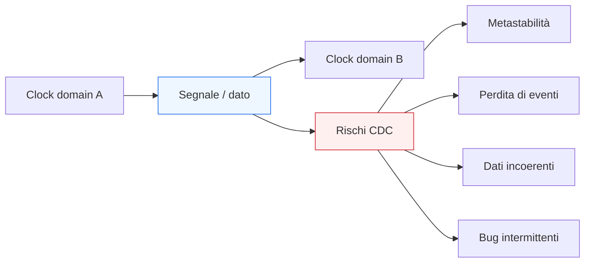
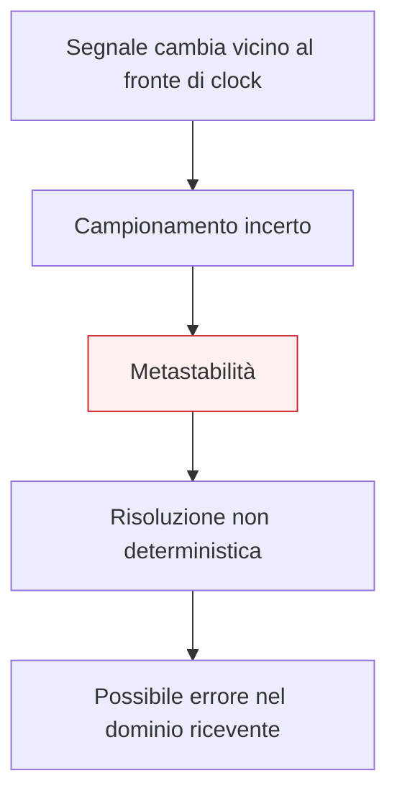
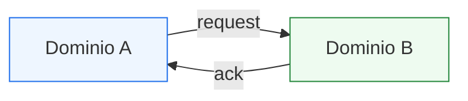

# Clock Domain Crossing (CDC) in SystemVerilog

Dopo aver affrontato temi come **reset**, **interfacce**, **pipeline**, **latenza**, **verifica** e **struttura della RTL**, il passo successivo naturale è introdurre uno degli argomenti più importanti e delicati dell’integrazione digitale: il **Clock Domain Crossing**, spesso abbreviato in **CDC**.

In un progetto reale, non tutti i blocchi lavorano necessariamente con lo stesso clock. Possono esistere:
- sottoblocchi con frequenze diverse;
- blocchi che derivano da clock differenti;
- periferiche che operano con timing autonomi;
- parti del sistema che devono scambiarsi segnali pur non essendo sincronizzate allo stesso dominio temporale.

Quando questo accade, il trasferimento di informazione tra domini di clock diversi non può essere trattato come un semplice collegamento RTL ordinario. Se lo si fa in modo ingenuo, si introducono rischi molto seri, tra cui:
- metastabilità;
- campionamento incoerente;
- perdita di eventi;
- duplicazione di impulsi;
- corruzione di dati;
- comportamento non ripetibile o difficile da debuggare.

Per questo il CDC è un argomento trasversale che collega direttamente:
- architettura;
- RTL;
- timing;
- reset;
- interfacce;
- verifica;
- implementazione FPGA;
- implementazione ASIC.

Questa pagina introduce i concetti fondamentali del CDC con un taglio coerente con il resto della sezione:
- didattico ma tecnico;
- orientato alla progettazione RTL robusta;
- attento ai meccanismi concettuali, più che ai dettagli tool-specifici;
- con forte enfasi sul fatto che il CDC è un problema di **affidabilità temporale del sistema**, non solo di sintassi del codice.

## 1. Perché il CDC è un problema reale

Finché tutto il sistema lavora sullo stesso clock, il modello RTL sincrono è relativamente lineare:
- la logica combinatoria calcola;
- i registri campionano al fronte attivo;
- la relazione temporale tra i segnali è governata da un dominio comune.

Quando invece un segnale attraversa un confine tra due domini di clock diversi, questa semplicità si rompe.

### 1.1 Due clock diversi non condividono la stessa nozione di istante utile
Se un segnale cambia nel dominio A, il dominio B non ha alcuna garanzia naturale di campionarlo in un istante “pulito” rispetto alla sua propria base temporale.

### 1.2 Il problema non è solo la frequenza
Il CDC non riguarda soltanto clock con frequenze diverse. Anche due clock con la stessa frequenza possono costituire domini distinti se:
- non hanno fase controllata;
- non hanno relazione temporale stabile;
- non sono trattati come sincroni dal sistema.

### 1.3 Perché è pericoloso
Un problema CDC può produrre bug che sono:
- intermittenti;
- difficili da riprodurre;
- invisibili in molti test nominali;
- dipendenti da condizioni temporali sottili;
- molto costosi da diagnosticare in prototipazione o, peggio, su silicio.

## 2. Che cos’è un clock domain

Un **clock domain** è l’insieme degli elementi sequenziali che condividono la stessa base di temporizzazione significativa.

### 2.1 Appartenenza a un dominio
Due registri appartengono allo stesso dominio se:
- sono governati dallo stesso clock, oppure
- da clock con relazione temporale nota e trattati come sincroni nella progettazione.

### 2.2 Domini distinti
Due blocchi appartengono a domini distinti quando:
- non esiste una relazione temporale affidabile tra i loro clock;
- il campionamento reciproco non è garantito in modo sincrono;
- un segnale che passa da uno all’altro richiede una strategia dedicata.

### 2.3 Visione progettuale
Il confine tra clock domain è quindi un vero confine architetturale e temporale, non solo un dettaglio del file RTL.

## 3. Metastabilità: il rischio fondamentale

Il concetto più importante da capire nel CDC è la **metastabilità**.

### 3.1 Significato intuitivo
Un elemento sequenziale, come un flip-flop, si aspetta che l’ingresso sia stabile attorno all’istante di campionamento. Se il segnale cambia troppo vicino al fronte di clock, il dispositivo può entrare in una condizione temporanea in cui:
- non produce subito un livello logico pulito;
- impiega un tempo non deterministico per risolversi;
- può influenzare la logica successiva in modo pericoloso.

### 3.2 Perché è un problema serio
La metastabilità non è semplicemente un valore “sbagliato”. È una violazione della premessa di base del modello digitale ideale, e può produrre:
- risultati non ripetibili;
- errori rari ma reali;
- instabilità di segnali di controllo;
- divergenze difficili da analizzare.

### 3.3 Il CDC esiste proprio per gestire questo rischio
La maggior parte delle tecniche CDC non elimina il fatto che due domini siano asincroni. Riduce però in modo controllato la probabilità che la metastabilità si propaghi e diventi un errore sistemico.

## 4. Non tutti i segnali CDC sono uguali

Uno dei principi fondamentali del CDC è che non esiste una sola tecnica valida per ogni tipo di trasferimento.

### 4.1 Segnali di controllo singoli
Per esempio:
- un bit di enable;
- una richiesta;
- un flag;
- un interrupt;
- un evento singolo.

### 4.2 Bus multi-bit o payload dati
Per esempio:
- bus dati;
- indirizzi;
- payload di una transazione;
- stati complessi o bundle di segnali.

### 4.3 Eventi, livelli e handshake
Un segnale può rappresentare:
- un livello stabile;
- un impulso breve;
- una richiesta da riconoscere;
- un canale di trasferimento con dati e controllo.

### 4.4 Perché la distinzione è cruciale
La tecnica CDC va scelta in base al significato del segnale. Trattare un bus multi-bit come se fosse un semplice flag, o un impulso come se fosse un livello stabile, è una fonte comune di errori gravi.

## 5. Sincronizzazione di un singolo bit

Il caso più semplice e classico è il trasferimento di un singolo segnale di controllo da un dominio a un altro.

### 5.1 Strategia tipica
Per un singolo bit che rappresenta un livello relativamente stabile, la tecnica più comune è usare una catena di sincronizzazione nel dominio ricevente.

### 5.2 Idea concettuale
Il primo stadio campiona il segnale asincrono e può diventare metastabile; uno o più stadi successivi riducono la probabilità che questa metastabilità si propaghi all’uso funzionale del segnale.

### 5.3 Quando è adatta
Questa tecnica è adatta soprattutto per:
- segnali di controllo singoli;
- livelli che restano attivi abbastanza a lungo da essere campionati dal dominio ricevente;
- condizioni che non richiedono trasferimento coerente di più bit simultanei.

### 5.4 Limite importante
Questa tecnica non garantisce il trasferimento corretto di:
- impulsi troppo brevi;
- bus multi-bit;
- eventi che devono essere contati senza perdita;
- dati che richiedono coerenza di insieme.

## 6. Impulsi e perdita di eventi

Un altro caso molto importante riguarda i segnali che rappresentano un evento breve.

### 6.1 Perché un impulso è più difficile
Un impulso può essere visibile nel dominio sorgente per un tempo troppo breve rispetto al clock del dominio ricevente. In tal caso:
- il ricevente può non vederlo affatto;
- può campionarlo in modo incoerente;
- può perderlo completamente.

### 6.2 Il problema non è solo la metastabilità
Anche in assenza di metastabilità, un impulso può essere semplicemente troppo stretto rispetto ai bordi del clock ricevente.

### 6.3 Conseguenza progettuale
Quando si trasferiscono eventi, la strategia CDC deve tenere conto del fatto che:
- l’evento deve essere reso osservabile nel dominio di destinazione;
- spesso non basta sincronizzare direttamente il livello del segnale.

## 7. Handshake tra domini

Quando il trasferimento deve essere affidabile e non si può tollerare perdita di eventi, spesso si introduce un **handshake** tra domini.

### 7.1 Idea di base
Un dominio emette una richiesta, l’altro la riceve e genera un riconoscimento. Questo permette di:
- rendere il trasferimento osservabile da entrambe le parti;
- evitare che eventi vengano persi troppo facilmente;
- costruire un protocollo più robusto tra domini asincroni.

### 7.2 Perché è utile
Un handshake è particolarmente adatto quando:
- il trasferimento non è continuo ma transazionale;
- il dato o l’evento è importante;
- si vuole sapere che l’altro dominio ha davvero ricevuto;
- la latenza aggiuntiva è accettabile.

### 7.3 Costo architetturale
Il prezzo è:
- più controllo;
- più latenza;
- maggiore complessità RTL;
- maggiore attenzione in verifica.

## 8. Trasferimento di bus multi-bit

Uno degli errori più comuni è pensare che un bus multi-bit possa essere trasferito in sicurezza semplicemente “sincronizzando i bit”.

### 8.1 Perché non basta sincronizzare ogni bit separatamente
I bit di un bus possono essere campionati in cicli diversi o in condizioni diverse, producendo:
- parole incoerenti;
- mix di vecchio e nuovo valore;
- corruzione del payload.

### 8.2 Il problema della coerenza
Quando un bus rappresenta un dato o uno stato complesso, conta non solo che i singoli bit siano stabili, ma che **l’insieme dei bit sia coerente come parola**.

### 8.3 Conseguenza progettuale
Per trasferire bus multi-bit in modo affidabile tra domini diversi servono strategie strutturate, non semplici sincronizzazioni bit-per-bit.

## 9. FIFO asincrone e buffering tra domini

Quando i dati devono attraversare domini di clock diversi in modo continuo o semi-continuo, una soluzione molto importante è l’uso di **FIFO asincrone** o strutture di buffering equivalenti.

### 9.1 Idea di base
Il dominio sorgente scrive dati secondo il proprio clock, il dominio ricevente li legge secondo il proprio clock. La FIFO fa da disaccoppiamento temporale.

### 9.2 Perché è utile
Questa soluzione:
- assorbe differenze di frequenza;
- evita di trattare ogni trasferimento come caso isolato;
- supporta il flusso di dati tra domini non sincronizzati;
- permette un’interazione più regolare tra produttore e consumatore.

### 9.3 Costi e responsabilità
Una FIFO asincrona richiede:
- logica di controllo più complessa;
- gestione di pieno/vuoto;
- attenzione alla sincronizzazione delle informazioni di stato;
- verifica accurata del comportamento.

## 10. CDC e reset

Il CDC si intreccia strettamente con il tema del reset.

### 10.1 Reset di più domini
Se il sistema contiene più clock domain, anche il comportamento del reset va pensato in modo coerente:
- quali domini vengono rilasciati per primi;
- quando un dominio può iniziare a inviare segnali a un altro;
- quali interfacce devono restare inattive finché entrambi i lati non sono stabili.

### 10.2 Rischio di confondere reset e sincronizzazione
Un reset comune non rende automaticamente sicuro il trasferimento tra domini. Anche dopo reset, il problema CDC resta.

### 10.3 Stato iniziale dei canali CDC
È importante che all’uscita dal reset:
- i canali request/ack siano in uno stato noto;
- le FIFO abbiano uno stato coerente;
- nessun evento spurio venga interpretato come trasferimento valido.

## 11. CDC e verifica

Il CDC è notoriamente difficile da verificare in modo completo con la sola simulazione funzionale ordinaria.

### 11.1 Perché la simulazione semplice non basta
Molti problemi CDC dipendono da allineamenti temporali sottili e rari, che potrebbero non emergere in pochi run nominali.

### 11.2 Cosa si può comunque verificare
La verifica può e deve controllare:
- correttezza del protocollo CDC scelto;
- handshaking tra domini;
- comportamento di FIFO e canali di stato;
- assenza di trasferimenti illegali;
- corretto comportamento all’uscita dal reset;
- latenza e backpressure del canale tra domini.

### 11.3 Assertion e checking
Le assertion sono molto utili per esprimere:
- relazioni request/ack;
- regole di stabilità del protocollo;
- assenza di eventi spurii;
- corretto avanzamento di segnali di validità e occupazione.

### 11.4 Valore della disciplina RTL
Una struttura CDC pulita e ben isolata è molto più verificabile di un crossing implicito nascosto nel codice.

## 12. CDC e timing

Il CDC è strettamente legato al timing, ma in modo diverso dal classico timing sincrono.

### 12.1 Percorsi non trattati come sincroni ordinari
Tra domini asincroni, non si può applicare lo stesso ragionamento lineare di setup/hold che vale all’interno di un unico dominio.

### 12.2 Perché serve una gestione specifica
I tool e il progetto devono riconoscere che questi percorsi:
- non rappresentano normali cammini sincroni;
- richiedono strutture CDC dedicate;
- non vanno trattati come semplice logica combinatoria tra registri sincroni.

### 12.3 Implicazione progettuale
Una buona progettazione CDC richiede che il confine tra domini sia esplicito e architetturalmente riconoscibile.

## 13. CDC e qualità della RTL

Il modo in cui la RTL è scritta influisce moltissimo sulla robustezza del CDC.

### 13.1 Crossing espliciti
È molto importante che i segnali che attraversano domini diversi siano chiaramente riconoscibili.

### 13.2 Evitare crossing impliciti
Un segnale che passa da un dominio all’altro senza una struttura CDC esplicita è una fonte tipica di bug difficili da diagnosticare.

### 13.3 Separazione architetturale
Conviene mantenere chiaro:
- il dominio di appartenenza di ciascun blocco;
- dove si trovano i confini CDC;
- quale meccanismo viene usato per ogni crossing;
- se si tratta di bit singolo, evento, bus o flusso dati.

## 14. CDC in FPGA

Su FPGA, il CDC è un tema molto importante perché:
- è comune avere clock diversi;
- molte periferiche esterne introducono ritmi autonomi;
- la prototipazione su dispositivo può esporre bug CDC che in simulazione erano meno evidenti.

### 14.1 Aspetti pratici
Su FPGA, il CDC va trattato con attenzione rispetto a:
- sincronizzatori di segnali di controllo;
- crossing tra logiche a frequenze diverse;
- FIFO asincrone;
- debug dei confini tra domini.

### 14.2 Debug reale
I bug CDC su FPGA possono manifestarsi in modo:
- sporadico;
- dipendente da frequenza e condizioni operative;
- difficile da riprodurre in modo deterministico.

### 14.3 Necessità di disciplina
Per questo una buona struttura RTL CDC-aware è particolarmente importante già nelle prime fasi.

## 15. CDC in ASIC

Su ASIC, il CDC è ancora più sensibile perché il sistema può contenere:
- più clock domain complessi;
- sottoblocchi con frequenze diverse;
- interfacce con sottosistemi indipendenti;
- logiche di power management e sequenze articolate di reset e abilitazione.

### 15.1 Impatto forte sul flusso
Il CDC influenza direttamente:
- architettura del blocco;
- verificabilità;
- analisi del design;
- affidabilità del sistema in silicio;
- integrazione finale nel SoC.

### 15.2 Perché è critico
Errori CDC intercettati tardi sono tra i più costosi e difficili da correggere, perché spesso:
- non si manifestano in modo immediato;
- dipendono da temporizzazioni rare;
- possono emergere solo in condizioni operative particolari.

### 15.3 Richiesta di rigore
Nel flusso ASIC, il CDC va trattato come tema di primo livello progettuale, non come dettaglio locale di codifica.

## 16. Errori comuni

Alcuni errori ricorrono spesso quando si affrontano i clock domain crossing.

### 16.1 Trattare un crossing come normale segnale RTL
È l’errore più pericoloso: collegare direttamente domini diversi come se fossero sincroni.

### 16.2 Sincronizzare bit multipli indipendentemente
Questo può generare parole incoerenti e corruzione del dato.

### 16.3 Trascurare gli impulsi brevi
Un evento può essere perso anche se un semplice sincronizzatore sembra “sufficiente” in teoria.

### 16.4 Ignorare il ruolo del reset
L’uscita dal reset di due domini può produrre comportamenti non coerenti se non è progettata con attenzione.

### 16.5 Verificare troppo poco i crossing
Molti bug CDC non emergono nei test più semplici.

### 16.6 Nascondere il CDC dentro la logica applicativa
Più il crossing è implicito, più è difficile da analizzare, verificare e mantenere.

## 17. Buone pratiche di modellazione

Per gestire bene il CDC in SystemVerilog RTL, alcune linee guida sono particolarmente importanti.

### 17.1 Rendere espliciti i confini di dominio
Bisogna sapere chiaramente quali blocchi appartengono a quale clock domain.

### 17.2 Scegliere la tecnica CDC in base al tipo di segnale
Un bit di controllo, un evento, un bus e un flusso dati non vanno trattati allo stesso modo.

### 17.3 Isolare le logiche CDC
Conviene che i crossing siano riconoscibili e, quando possibile, concentrati in punti architetturali chiari.

### 17.4 Pensare insieme a reset, protocollo e verifica
Il crossing non è solo un problema di sincronizzatore: riguarda anche stato iniziale, semantica del canale e verificabilità.

### 17.5 Non fidarsi della sola simulazione nominale
La robustezza CDC richiede una disciplina progettuale forte già nella struttura della RTL.

## 18. Collegamento con il resto della sezione

Questa pagina si collega in modo naturale a molti temi già costruiti:
- **`reset-strategies.md`** ha mostrato che il rilascio del reset nei sistemi complessi richiede attenzione ai domini temporali;
- **`interfaces-and-handshake.md`** ha introdotto i protocolli che spesso diventano il mezzo per trasferire informazione tra domini;
- **`pipelining.md`** e **`latency-and-throughput.md`** hanno mostrato il ruolo del tempo e del flusso dei dati, che diventano ancora più delicati quando i clock differiscono;
- **`verification-basics.md`**, **`assertions-basics.md`** e **`coverage-basics.md`** hanno evidenziato quanto sia importante rendere verificabili i comportamenti temporali;
- **`coding-style-rtl.md`** ha sottolineato il valore di una RTL che renda esplicita la struttura reale del sistema.

Il CDC rappresenta quindi una naturale estensione della progettazione RTL quando si passa da un singolo dominio sincrono a sistemi più realistici e integrati.

## 19. In sintesi

Il Clock Domain Crossing è uno dei temi più critici della progettazione digitale perché riguarda il trasferimento di informazione tra blocchi che non condividono la stessa base temporale. In questo contesto, non basta collegare i segnali come in una normale RTL sincrona: occorre introdurre strategie dedicate per evitare metastabilità, perdita di eventi e corruzione dei dati.

Le tecniche corrette dipendono dal tipo di informazione da trasferire:
- segnali singoli;
- impulsi;
- bus multi-bit;
- transazioni con handshake;
- flussi dati tramite buffering o FIFO asincrone.

Per questo motivo, il CDC va trattato come tema architetturale e metodologico di primo livello, con impatto diretto su:
- qualità della RTL;
- robustezza della verifica;
- integrazione tra sottoblocchi;
- affidabilità del sistema finale su FPGA o ASIC.

## Prossimo passo

Il passo più naturale ora è **`verification-vs-validation.md`**, perché dopo aver consolidato sia la progettazione RTL sia il primo arco della verifica può essere utile chiarire una distinzione metodologica molto importante tra:
- verificare che il blocco implementi correttamente il comportamento descritto;
- validare che quel comportamento sia quello giusto rispetto alla specifica di sistema.

In alternativa, un altro passo molto naturale è **`case-study-systemverilog.md`**, se vuoi iniziare a chiudere la sezione con una pagina più integrata che unisca RTL, FSM, interfacce, reset, verifica e timing in un esempio progettuale coerente.
