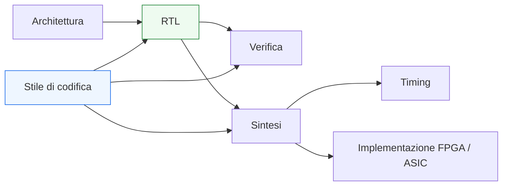
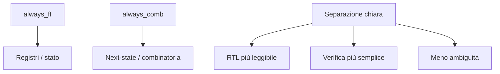

# Stile di codifica RTL in SystemVerilog

Dopo aver costruito i concetti principali di **linguaggio**, **costrutti RTL**, **FSM**, **interfacce**, **pipeline**, **parametrizzazione** e **prestazioni**, il passo successivo naturale è consolidare il modo in cui tutto questo viene scritto nella pratica. In un progetto reale, infatti, non basta che una descrizione RTL sia funzionalmente corretta: deve anche essere **leggibile**, **coerente**, **manutenibile**, **verificabile** e il più possibile prevedibile rispetto a sintesi, timing e implementazione.

Questo è il ruolo dello **stile di codifica RTL**.

Parlare di coding style non significa introdurre un insieme arbitrario di regole estetiche. Significa piuttosto definire convenzioni che aiutano a:
- rendere il codice più facile da capire;
- ridurre ambiguità;
- evitare errori ricorrenti;
- facilitare review, debug e manutenzione;
- mantenere allineati architettura, RTL, verifica e implementazione fisica.

In SystemVerilog, questo tema è particolarmente importante perché il linguaggio è ampio e flessibile: la stessa funzione può spesso essere descritta in modi diversi, ma non tutti sono ugualmente chiari o robusti. Per questo motivo, una documentazione seria su SystemVerilog non dovrebbe limitarsi ai costrutti del linguaggio, ma includere anche una disciplina di scrittura.

Questa pagina raccoglie le principali linee guida di stile con un taglio coerente con il resto della sezione:
- tecnico ma didattico;
- orientato alla RTL sintetizzabile;
- consapevole di timing, verifica, FPGA e ASIC;
- centrato sulla qualità progettuale del codice.

## 1. Perché lo stile di codifica conta davvero

Quando un modulo è piccolo e isolato, si può essere tentati di considerare lo stile come un dettaglio secondario. Ma questa impressione cambia rapidamente quando:
- il progetto cresce;
- più persone lavorano sulla stessa base codice;
- i moduli vengono riutilizzati;
- il debug richiede di leggere waveform e report complessi;
- la verifica deve coprire molte condizioni;
- il backend fisico richiede correlazione chiara con la RTL.

### 1.1 Codice corretto non significa codice buono
Una RTL può:
- simulare correttamente;
- sintetizzare;
- perfino funzionare in laboratorio;

e allo stesso tempo essere:
- difficile da leggere;
- facile da rompere durante una modifica;
- poco chiara nei ruoli dei segnali;
- fragile in verifica;
- poco prevedibile in timing closure.

### 1.2 Lo stile come riduzione del rischio
Uno stile coerente riduce il rischio di:
- interpretazioni ambigue;
- segnali usati in modo incoerente;
- logica mescolata senza separazione di responsabilità;
- errori nelle FSM;
- latch involontari;
- disallineamenti tra dato e controllo;
- cattiva osservabilità del comportamento.

### 1.3 Lo stile come supporto al flusso
Un buon stile migliora il lavoro lungo tutto il flusso:
- progettazione;
- review;
- simulazione;
- debug;
- sintesi;
- timing;
- integrazione;
- manutenzione.

## 2. Principio generale: il codice deve mostrare l’hardware

La regola più importante in RTL è che il codice dovrebbe rendere intuitiva la struttura hardware che intende descrivere.

### 2.1 Pensare in termini di hardware
Una descrizione RTL non è software generico. Dovrebbe permettere di capire con una certa immediatezza:
- quali segnali sono registri;
- quali sono combinatori;
- dove si trova lo stato;
- quali blocchi sono di controllo;
- quali sono di datapath;
- dove si trovano mux, pipeline e condizioni di abilitazione.

### 2.2 Evitare il codice “furbo”
Una RTL troppo compatta, troppo implicita o troppo “ingegnosa” può diventare difficile da correlare all’hardware reale. In questi casi:
- la review diventa più lenta;
- il debug diventa più difficile;
- la verifica può risultare meno robusta;
- la sintesi può produrre risultati meno prevedibili.

### 2.3 Mostrare, non nascondere
Uno stile buono in RTL tende a mostrare:
- la struttura;
- le responsabilità;
- la direzione del flusso dei dati;
- il punto in cui il comportamento dipende dal clock.

## 3. Chiarezza dei nomi

Uno dei pilastri del coding style è il **naming**. I nomi dei segnali, dei moduli e dei tipi devono aiutare a capire il progetto.

### 3.1 Nomi con significato funzionale
I nomi dovrebbero riflettere il ruolo del segnale:
- dato;
- validità;
- stato;
- enable;
- contatore;
- next-state;
- selezione;
- errore;
- handshake.

### 3.2 Nomi che distinguono i ruoli temporali
È particolarmente utile distinguere chiaramente tra:
- stato corrente;
- stato futuro;
- output registrato;
- output combinatorio;
- segnali per stadio di pipeline;
- segnali interni e di interfaccia.

### 3.3 Coerenza lungo il progetto
Nomi coerenti tra moduli diversi aiutano molto:
- l’integrazione;
- il debug nelle waveform;
- la scrittura di checker;
- la leggibilità del sistema nel suo insieme.

### 3.4 Evitare abbreviazioni oscure
Abbreviazioni troppo aggressive o locali al singolo autore riducono leggibilità e manutenzione.

## 4. Separare chiaramente combinatoria e sequenziale

Questa è una delle regole più importanti in assoluto.

### 4.1 Blocco giusto per il comportamento giusto
È buona pratica usare:
- `always_comb` per la logica combinatoria;
- `always_ff` per la logica sequenziale;
- `always_latch` solo quando il latch è davvero voluto.

### 4.2 Perché è così importante
Questa separazione:
- rende la semantica del codice più chiara;
- aiuta a evitare latch involontari;
- migliora la review;
- facilita il debug;
- rende più naturale il passaggio verso sintesi e timing.

### 4.3 Blocchi distinti, responsabilità distinte
Conviene separare:
- registro di stato;
- next-state;
- uscite combinatorie;
- uscite registrate;
- controllo;
- datapath.

Una struttura più modulare è quasi sempre più leggibile di un unico blocco che fa tutto.

## 5. Assegnamenti completi e valori di default

Nella logica combinatoria, uno dei temi più importanti di stile è la completezza delle assegnazioni.

### 5.1 Perché serve
Se un segnale non riceve valore in tutte le condizioni rilevanti, il risultato può essere:
- inferenza di latch;
- comportamento ambiguo;
- mismatch tra intento e hardware.

### 5.2 Valori di default
Una pratica molto utile è assegnare all’inizio del blocco combinatorio:
- valori di default;
- permanenza nello stato corrente;
- condizioni di inattività o neutralità.

### 5.3 Vantaggi
Questa scelta rende il codice:
- più leggibile;
- meno fragile;
- più facile da modificare;
- meno esposto a dimenticanze.

### 5.4 Stile e sicurezza progettuale
I valori di default non sono solo una convenzione estetica: sono una difesa pratica contro errori frequenti nella modellazione RTL.

## 6. Uso coerente di blocking e non-blocking

Anche la scelta del tipo di assegnamento fa parte del coding style.

### 6.1 Convenzione raccomandata
Nella maggior parte delle linee guida robuste:
- si usano assegnamenti **blocking** nei blocchi combinatori;
- si usano assegnamenti **non-blocking** nei blocchi sequenziali.

### 6.2 Perché questa convenzione aiuta
Questa regola:
- riflette bene l’intento hardware;
- rende la simulazione più prevedibile;
- riduce bug sottili;
- migliora la leggibilità del codice.

### 6.3 Coerenza interna
Mescolare senza criterio i due stili nello stesso contesto rende il codice più difficile da interpretare e più esposto a errori.

## 7. Struttura ordinata delle FSM

Le FSM sono uno dei punti in cui lo stile emerge con più chiarezza.

### 7.1 Stati simbolici
È buona pratica usare `enum` e nomi di stato leggibili.

### 7.2 Separare stato, next-state e output
La struttura consigliata è tipicamente:
- registro di stato;
- logica di next-state;
- eventuale logica separata per le uscite.

### 7.3 Transizioni leggibili
Le transizioni dovrebbero essere facili da seguire e correlate alle condizioni funzionali del blocco.

### 7.4 Stato di default e recovery
Una FSM ben scritta dovrebbe rendere chiaro:
- lo stato iniziale;
- il comportamento in assenza di transizioni;
- l’eventuale gestione di stati anomali.

## 8. Organizzare il modulo per sezioni riconoscibili

Uno stile solido aiuta il lettore a orientarsi rapidamente nel modulo.

### 8.1 Sezioni tipiche
Un modulo RTL ben organizzato tende ad avere sezioni riconoscibili, per esempio:
- parametri;
- porte;
- import di package o typedef;
- segnali interni;
- tipi locali;
- logica combinatoria;
- logica sequenziale;
- eventuali istanze subordinate.

### 8.2 Beneficio di leggibilità
Una struttura costante tra moduli diversi riduce il costo cognitivo della lettura.

### 8.3 Coerenza tra file
Quando tutti i moduli seguono uno schema simile, l’intera base codice risulta più leggibile e più professionale.

## 9. Separare dato e controllo

Questa distinzione, già affrontata a livello architetturale, deve essere visibile anche nello stile di scrittura.

### 9.1 Datapath leggibile
Registri, mux, operatori e percorsi dati dovrebbero essere riconoscibili come parte del datapath.

### 9.2 Controllo leggibile
FSM, enable, selezioni, validità, handshake e stati dovrebbero essere riconoscibili come parte del controllo.

### 9.3 Evitare la fusione eccessiva
Se tutto è mescolato nello stesso blocco o nella stessa sezione senza struttura, il comportamento diventa più difficile da capire e mantenere.

### 9.4 Effetti pratici
La separazione tra dato e controllo:
- semplifica la verifica;
- aiuta il debug;
- rende più chiari i percorsi di timing;
- facilita l’evoluzione del modulo.

## 10. Stile delle interfacce e dei segnali di handshake

Le interfacce sono un punto molto importante dal punto di vista della leggibilità.

### 10.1 Chiarezza sui ruoli
Deve essere chiaro:
- chi produce il dato;
- chi lo consuma;
- chi guida `valid`;
- chi guida `ready`;
- quando il trasferimento è considerato avvenuto.

### 10.2 Coerenza dei nomi
Segnali equivalenti in moduli diversi dovrebbero usare convenzioni simili, quando possibile.

### 10.3 Allineamento tra dato e controllo
I segnali di handshake e i dati associati dovrebbero essere trattati come parte dello stesso canale logico, non come entità scollegate.

### 10.4 Visibilità della semantica
Uno stile buono rende leggibile non solo il fatto che esistano certi segnali, ma anche il loro significato temporale.

## 11. Stile nella parametrizzazione

Anche i parametri fanno parte del coding style del progetto.

### 11.1 Parametri con ruolo chiaro
Ogni parametro dovrebbe controllare un aspetto architetturalmente significativo.

### 11.2 Distinguere esterno e interno
È buona pratica usare:
- `parameter` per la configurazione esterna;
- `localparam` per i valori derivati o interni.

### 11.3 Evitare sovraccarico di configurazione
Troppe opzioni rendono il modulo meno leggibile e più difficile da verificare.

### 11.4 Parametrizzazione leggibile
Le relazioni tra parametri, dimensioni e strutture generate dovrebbero essere facili da seguire.

## 12. Stile nell’uso di array, struct e tipi condivisi

Una base RTL matura usa spesso `typedef`, `struct`, package e array. Anche qui serve disciplina.

### 12.1 Tipi con significato
Conviene usare tipi nominati quando aggiungono informazione funzionale e migliorano la leggibilità.

### 12.2 Array con indici significativi
L’indice di un array dovrebbe avere un ruolo architetturale chiaro:
- canale;
- stadio;
- porta;
- entry;
- lane.

### 12.3 Bundle leggibili
Usare `struct` per raggruppare campi correlati è utile quando i bundle rappresentano davvero un oggetto logico.

### 12.4 Coerenza tra moduli
Package, typedef e interfacce dovrebbero essere usati per costruire un lessico comune del progetto, non per introdurre astrazione superflua.

## 13. Commenti: pochi ma utili

Anche il ruolo dei commenti va trattato con equilibrio.

### 13.1 Il codice dovrebbe già spiegarsi bene
Se il codice è scritto con buona struttura e buoni nomi, molti commenti diventano superflui.

### 13.2 Dove i commenti aiutano davvero
I commenti sono utili per chiarire:
- l’intento architetturale;
- il significato di una scelta non ovvia;
- una convenzione importante;
- il motivo di una particolare decisione di timing o protocollo;
- un vincolo che non emerge immediatamente dal codice.

### 13.3 Cosa evitare
Commenti che ripetono in modo meccanico quello che il codice già dice aggiungono rumore e rischiano di diventare obsoleti.

### 13.4 Commenti e manutenzione
Meglio pochi commenti stabili e informativi che molti commenti fragili e ridondanti.

## 14. Stile orientato alla verifica

Una buona RTL dovrebbe essere scritta pensando anche a come verrà verificata.

### 14.1 Segnali osservabili
Stato, next-state, validità, enable, contatori e condizioni di avanzamento dovrebbero essere organizzati in modo da risultare osservabili nelle waveform.

### 14.2 Struttura favorevole a assertion e checker
Un codice con ruoli chiari rende più semplice scrivere:
- assertion di protocollo;
- controlli di stato;
- coverage di transizioni;
- checker sui canali.

### 14.3 Separazione che aiuta il debug
Distinguere chiaramente:
- combinatoria;
- sequenziale;
- controllo;
- datapath;
- interfaccia;

aiuta a localizzare i problemi più rapidamente.

## 15. Stile orientato a timing e implementazione

Anche se il coding style non sostituisce l’analisi di timing, può rendere più leggibile la struttura temporale del blocco.

### 15.1 Rendere visibili i confini temporali
Registri, stadi di pipeline e punti di buffering dovrebbero essere facili da riconoscere.

### 15.2 Evidenziare la logica critica
Se mux, comparatori, selezioni e operatori complessi sono organizzati in modo leggibile, è più facile intuire dove potrebbero trovarsi i percorsi critici.

### 15.3 Fanout e segnali globali
Segnali di controllo molto distribuiti dovrebbero essere riconoscibili e trattati con attenzione.

### 15.4 Collegamento con FPGA e ASIC
- In **FPGA**, una struttura pulita aiuta a correlare meglio RTL, utilizzo delle risorse e timing closure.
- In **ASIC**, aiuta la correlazione con sintesi, DFT, floorplanning, PnR, CTS e signoff.

## 16. Errori comuni di stile

Alcune cattive pratiche ricorrono spesso e meritano di essere riconosciute.

### 16.1 Blocchi troppo grandi e multifunzione
Un unico blocco con troppe responsabilità è difficile da capire e mantenere.

### 16.2 Nomi poco informativi
Segnali e variabili con nomi generici riducono molto la leggibilità.

### 16.3 Logica combinatoria incompleta
Porta facilmente a latch involontari e a comportamenti poco chiari.

### 16.4 Parametrizzazione eccessiva o confusa
Un modulo troppo generico può essere più difficile da usare correttamente.

### 16.5 Astrazione che nasconde l’hardware
L’uso eccessivo o poco disciplinato di bundle, array o generate può rendere meno chiara la struttura reale del circuito.

### 16.6 Mancanza di coerenza tra moduli
Anche singoli moduli scritti bene risultano meno efficaci se il progetto nel suo insieme non segue convenzioni comuni.

## 17. Costruire uno stile coerente di progetto

Lo stile di codifica non dovrebbe essere deciso caso per caso in modo estemporaneo.

### 17.1 Convenzioni comuni
È utile che il progetto definisca convenzioni su:
- naming;
- struttura dei file;
- ordine delle sezioni;
- uso di package e typedef;
- stile delle FSM;
- uso di `always_comb` e `always_ff`;
- convenzioni per handshake, pipeline e validità.

### 17.2 Beneficio del linguaggio comune
Quando tutti i moduli seguono uno stile comune:
- la lettura è più rapida;
- le review sono più efficaci;
- l’onboarding di nuovi membri è più semplice;
- gli errori strutturali diminuiscono.

### 17.3 Stile come parte della qualità tecnica
In una base RTL professionale, lo stile non è un dettaglio cosmetico: è parte della qualità tecnica del progetto.

## 18. Collegamento con il resto della sezione

Questa pagina si collega naturalmente a tutto quanto costruito fin qui:
- **`rtl-constructs.md`** e **`procedural-blocks.md`** hanno definito il corretto uso dei costrutti RTL;
- **`combinational-vs-sequential.md`** ha chiarito la separazione fondamentale tra combinatoria e sequenziale;
- **`fsm.md`**, **`state-encoding.md`** e **`datapath-and-control.md`** hanno mostrato strutture che beneficiano fortemente di uno stile ordinato;
- **`pipelining.md`**, **`interfaces-and-handshake.md`** e **`systemverilog-interfaces.md`** hanno introdotto canali, stadi e protocolli che richiedono naming e struttura coerenti;
- **`packages-and-typedefs.md`**, **`arrays-and-generate.md`** e **`parameters-and-configuration.md`** hanno aggiunto strumenti potenti che, senza disciplina di stile, possono diventare più difficili da gestire.

Lo stile di codifica è quindi il livello che tiene insieme l’intera sezione SystemVerilog dal punto di vista metodologico.

## 19. In sintesi

Lo stile di codifica RTL in SystemVerilog è un elemento fondamentale della qualità progettuale. Non serve solo a rendere il codice più gradevole, ma soprattutto a:
- mostrare meglio l’hardware descritto;
- separare chiaramente responsabilità e domini temporali;
- ridurre errori;
- facilitare verifica, debug e manutenzione;
- migliorare la prevedibilità verso sintesi, timing e implementazione.

Un buon stile si basa su pochi principi forti:
- nomi chiari;
- struttura coerente;
- distinzione netta tra combinatoria e sequenziale;
- FSM ordinate;
- interfacce leggibili;
- parametrizzazione disciplinata;
- visibilità del rapporto tra codice e hardware.

In una progettazione RTL matura, il coding style non è un’aggiunta opzionale: è una parte integrante del modo in cui l’architettura viene tradotta in un sistema leggibile, verificabile e implementabile su FPGA o ASIC.

## Prossimo passo

Il passo più naturale ora è **`verification-basics.md`**, perché dopo aver consolidato struttura e stile della RTL conviene aprire il ramo dedicato alla verifica di base:
- obiettivi della verifica
- simulazione RTL
- testbench
- osservabilità dei segnali
- checking funzionale
- collegamento tra stile RTL e verificabilità

In alternativa, un altro passo molto naturale è **`reset-strategies.md`**, se vuoi approfondire prima un tema metodologico molto importante per robustezza, integrazione e timing.
