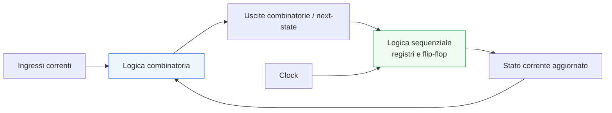
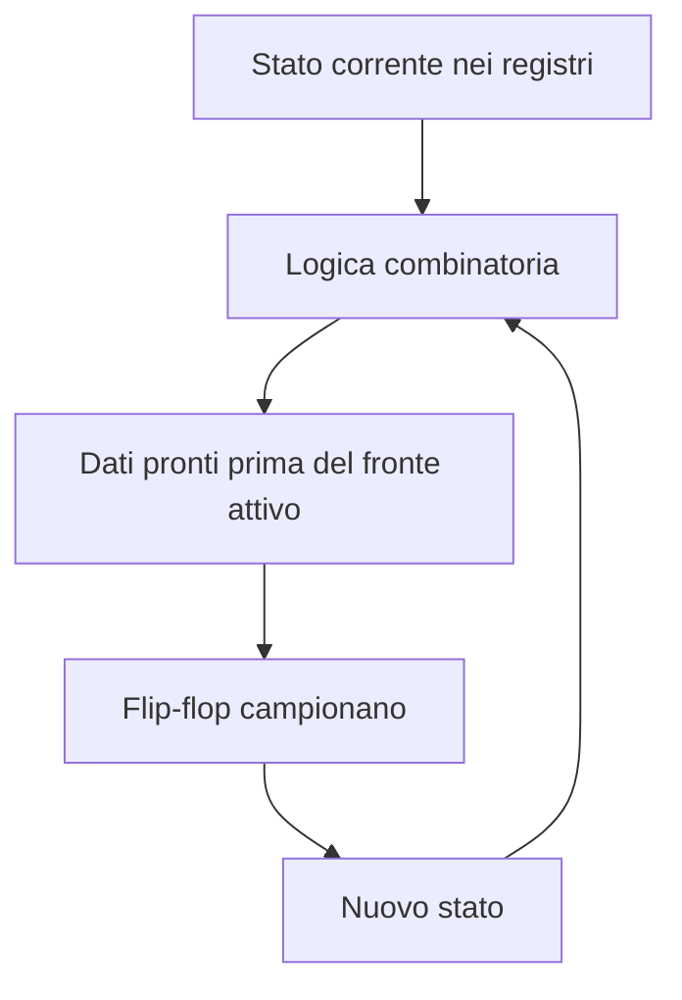
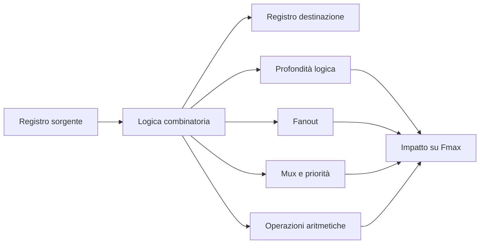

# Logica combinatoria e logica sequenziale

Una delle distinzioni più importanti in tutta la progettazione digitale è quella tra **logica combinatoria** e **logica sequenziale**. In SystemVerilog, questa differenza non è soltanto teorica: guida il modo in cui si scrive l’RTL, determina il tipo di hardware inferito dai tool e influenza in modo diretto sintesi, timing, verifica e implementazione su **FPGA** o **ASIC**.

Capire bene questa separazione è fondamentale perché quasi ogni blocco hardware reale nasce dalla loro combinazione:
- la logica combinatoria elabora i valori correnti;
- la logica sequenziale conserva lo stato nel tempo;
- l’insieme dei due costruisce datapath, pipeline, controlli e macchine a stati.

Questa pagina chiarisce il significato dei due concetti, il loro ruolo nella descrizione RTL e il loro impatto lungo il flusso di progetto.

## 1. Perché questa distinzione è fondamentale

Quando si osserva un circuito digitale a livello architetturale, quasi tutto può essere ricondotto a due domande:
- quali segnali sono il risultato immediato degli ingressi e dello stato corrente;
- quali segnali devono essere memorizzati e aggiornati nel tempo.

La prima domanda riguarda la **combinatoria**. La seconda riguarda la **sequenziale**.

Questa distinzione è importante perché:
- rende leggibile la struttura del circuito;
- aiuta a prevedere l’hardware che verrà sintetizzato;
- semplifica la verifica;
- rende più controllabile il timing;
- permette di progettare pipeline e controllo in modo ordinato.

In pratica, un buon progetto RTL cerca sempre di rendere evidente:
- dove si trova lo stato;
- dove avviene il calcolo combinatorio;
- come i due livelli interagiscono.

## 2. Che cos’è la logica combinatoria

La logica combinatoria è una logica il cui valore di uscita dipende **solo** dai valori correnti degli ingressi. Non contiene memoria esplicita dello stato passato.

### 2.1 Proprietà fondamentali
Un blocco combinatorio:
- non ha stato interno memorizzato in flip-flop;
- reagisce ai cambiamenti degli ingressi;
- produce un’uscita determinata dalla funzione implementata;
- non richiede il clock per definire il proprio valore logico.

### 2.2 Esempi tipici
Rientrano nella logica combinatoria:
- mux;
- decoder;
- comparatori;
- operatori aritmetici;
- logiche di abilitazione;
- calcolo di segnali di controllo;
- calcolo del next-state di una FSM.

### 2.3 Aspetto concettuale
Dal punto di vista funzionale, la logica combinatoria è una trasformazione:
- ingresso → uscita
oppure:
- stato corrente + ingressi → prossimo valore da registrare

Questo significa che la combinatoria è spesso il “motore di calcolo” tra due banchi di registri.

## 3. Che cos’è la logica sequenziale

La logica sequenziale è una logica il cui comportamento dipende non solo dagli ingressi correnti, ma anche da uno **stato memorizzato** nel tempo.

### 3.1 Proprietà fondamentali
Un blocco sequenziale:
- contiene o rappresenta elementi di memoria;
- conserva informazione tra un istante e il successivo;
- aggiorna il proprio stato in base a eventi temporali, di solito il clock;
- consente di costruire registri, contatori, pipeline e macchine a stati.

### 3.2 Elementi tipici
La logica sequenziale comprende:
- flip-flop;
- registri;
- contatori;
- shift register;
- registri di pipeline;
- stato corrente di una FSM.

### 3.3 Aspetto concettuale
Dal punto di vista del modello, la logica sequenziale implementa:
- stato corrente → stato successivo al clock

In altre parole, la logica sequenziale è ciò che permette a un circuito di “ricordare” informazioni e quindi di avere un comportamento esteso nel tempo.

## 4. Il ruolo del clock

La differenza tra combinatoria e sequenziale diventa particolarmente chiara quando si introduce il clock.

### 4.1 Combinatoria e clock
La logica combinatoria, in senso stretto, non ha bisogno del clock per definire il proprio risultato. Le sue uscite cambiano quando cambiano gli ingressi.

### 4.2 Sequenziale e clock
La logica sequenziale, invece, usa il clock come riferimento temporale per stabilire quando aggiornare lo stato. Questo consente di:
- sincronizzare i trasferimenti;
- controllare l’evoluzione temporale del circuito;
- segmentare il datapath;
- costruire pipeline;
- analizzare il timing tra registri.

### 4.3 Visione sistemica
In un sistema sincrono, il clock organizza il comportamento globale:
- la combinatoria calcola;
- la sequenziale cattura;
- il processo si ripete a ogni ciclo.

## 5. Come si riflette in SystemVerilog

In SystemVerilog, la distinzione tra logica combinatoria e sequenziale si traduce direttamente nei blocchi RTL usati per descriverla.

### 5.1 Descrizione della combinatoria
La logica combinatoria viene descritta tipicamente con:
- `assign`
- `always_comb`

Questo esprime che il valore dipende dagli ingressi correnti e non rappresenta uno stato memorizzato.

### 5.2 Descrizione della sequenziale
La logica sequenziale viene descritta tipicamente con:
- `always_ff`

Questo esprime che il segnale rappresenta registri o stato aggiornato su eventi di clock.

### 5.3 Perché conta
La scelta del blocco corretto non è soltanto una questione sintattica. Permette ai tool e ai lettori del codice di capire subito:
- che tipo di hardware si vuole inferire;
- se il segnale è combinatorio o registrato;
- come interpretare il comportamento nella simulazione;
- quali verifiche fare nella review del codice.

## 6. Combinatoria come calcolo tra registri

Nella maggior parte dei datapath reali, la logica combinatoria si trova **tra** elementi sequenziali. Questo è il modello classico dei sistemi sincroni.

### 6.1 Schema concettuale
Il pattern generale è:
- un insieme di registri fornisce lo stato corrente;
- la logica combinatoria elabora dati e controllo;
- il risultato viene catturato da altri registri al clock successivo.

### 6.2 Perché è importante
Questa struttura è alla base di:
- pipeline;
- elaborazione numerica;
- unità di controllo;
- bus e interfacce;
- percorsi dati ad alte prestazioni.

### 6.3 Punto di vista temporale
Il timing viene analizzato proprio lungo questo cammino:
- uscita di un registro;
- attraversamento della combinatoria;
- arrivo all’ingresso del registro successivo.

Per questo motivo, quando si parla di timing closure, si parla quasi sempre della qualità dei percorsi tra elementi sequenziali separati da logica combinatoria.

## 7. Stato, memoria e comportamento nel tempo

Il concetto di **stato** è la chiave per capire la logica sequenziale.

### 7.1 Che cos’è lo stato
Lo stato è l’informazione memorizzata che consente al circuito di comportarsi in modo dipendente dalla storia precedente.

### 7.2 Perché la combinatoria non basta
Con sola logica combinatoria si possono costruire funzioni istantanee, ma non:
- contare eventi;
- ricordare un dato;
- gestire protocolli multi-ciclo;
- costruire FSM;
- attraversare una pipeline con più stadi temporali.

### 7.3 La sequenziale come memoria controllata
La logica sequenziale fornisce una memoria sincronizzata, che permette di:
- definire fasi di elaborazione;
- segmentare il flusso dei dati;
- implementare controllo temporale;
- disaccoppiare calcolo e avanzamento temporale.

## 8. Esempi concettuali di differenza

Anche senza entrare nel dettaglio di codice HDL, alcuni esempi rendono subito chiara la distinzione.

### 8.1 Mux
Un mux è combinatorio: seleziona in modo immediato uno degli ingressi in base a un selettore.

### 8.2 Registro
Un registro è sequenziale: memorizza un valore e lo aggiorna solo al fronte di clock.

### 8.3 Contatore
Un contatore è sequenziale perché il valore successivo dipende dal valore precedente, che viene memorizzato.

### 8.4 Calcolo del next-state
Il next-state di una FSM è in genere combinatorio: viene calcolato a partire da stato corrente e ingressi.

### 8.5 Stato corrente di una FSM
Lo stato corrente è sequenziale: viene memorizzato in registri e aggiornato sul clock.

## 9. Latch, flip-flop e ambiguità di modellazione

Quando si scrive RTL, un errore comune è confondere una logica combinatoria incompleta con una vera logica sequenziale.

### 9.1 Latch involontari
Se in una descrizione combinatoria un segnale non riceve assegnazione in tutte le condizioni, il tool può inferire un latch. In quel caso:
- il segnale conserva memoria;
- il circuito non è più puramente combinatorio;
- il timing diventa più complesso;
- la verifica si complica.

### 9.2 Perché è un problema
Nella maggior parte dei design ordinati:
- si vuole che la combinatoria sia davvero combinatoria;
- si vuole che la memoria sia esplicitamente modellata con registri;
- si vogliono evitare elementi di stato impliciti e poco controllabili.

### 9.3 Regola pratica
La separazione chiara tra:
- `always_comb` per logica combinatoria;
- `always_ff` per logica sequenziale
riduce molto il rischio di inferenze accidentali.

## 10. Percorsi di timing e cammino critico

Il legame tra logica combinatoria e sequenziale è al centro dell’analisi temporale.

### 10.1 Cammino tipico
Un percorso sincrono tipico è:
- uscita di un flip-flop sorgente;
- logica combinatoria intermedia;
- ingresso di un flip-flop destinazione.

### 10.2 Cammino critico
Il cammino critico è il percorso che richiede il tempo maggiore. Nella pratica, è spesso dominato dalla quantità e dalla struttura della logica combinatoria tra due registri.

### 10.3 Implicazioni progettuali
Se la combinatoria è troppo profonda:
- la frequenza massima diminuisce;
- diventa necessario introdurre pipeline;
- la chiusura del timing si complica;
- l’implementazione fisica diventa più critica.

## 11. Pipeline: organizzare la relazione tra combinatoria e sequenziale

La pipeline è uno dei concetti più importanti che nascono dalla combinazione ordinata di logica combinatoria e sequenziale.

### 11.1 Idea di base
Invece di concentrare troppo calcolo combinatorio tra due registri, si inseriscono registri intermedi che suddividono il percorso in più stadi.

### 11.2 Effetto architetturale
Questo comporta:
- minore profondità logica per stadio;
- maggiore frequenza massima;
- aumento della latenza;
- maggiore complessità di controllo e validazione.

### 11.3 Visione RTL
Dal punto di vista RTL:
- la combinatoria definisce il lavoro di ogni stadio;
- la sequenziale delimita i confini temporali tra stadi.

### 11.4 Collegamento a FPGA e ASIC
- In **FPGA**, la pipeline è spesso essenziale per sfruttare bene LUT, DSP e routing.
- In **ASIC**, è uno strumento centrale per timing closure, floorplanning e controllo del cammino critico.

## 12. FSM: combinatoria e sequenziale lavorano insieme

Le macchine a stati finiti sono un caso esemplare di cooperazione tra combinatoria e sequenziale.

### 12.1 Stato memorizzato
Lo stato corrente è sequenziale.

### 12.2 Calcolo delle transizioni
Il next-state è combinatorio.

### 12.3 Uscite
Le uscite possono essere:
- derivate solo dallo stato;
- derivate da stato e ingressi.

### 12.4 Perché è un buon esempio didattico
Le FSM mostrano con grande chiarezza che:
- la sequenziale conserva l’informazione;
- la combinatoria decide l’evoluzione del comportamento;
- il clock scandisce il passaggio da una configurazione alla successiva.

## 13. Effetti sulla verifica

La distinzione tra combinatoria e sequenziale è molto utile anche in verifica.

### 13.1 Osservabilità del comportamento
In simulazione, è importante capire:
- quali segnali devono reagire immediatamente;
- quali invece cambiano solo al clock.

Questa differenza aiuta a leggere waveform e debug.

### 13.2 Assertion e controlli
Molte assertion si basano proprio su questa distinzione:
- controlli combinatori su relazioni istantanee;
- controlli sequenziali su evoluzioni da ciclo a ciclo.

### 13.3 Diagnosi degli errori
Se un segnale cambia in un momento inatteso, la prima domanda spesso è:
- doveva essere combinatorio o registrato?

Capire questa risposta accelera la diagnosi del problema.

## 14. Effetti sulla sintesi e sull’implementazione

La sintesi interpreta la combinatoria e la sequenziale in modo diverso e questo si riflette nell’hardware finale.

### 14.1 Sintesi della combinatoria
La logica combinatoria viene mappata in:
- LUT, carry chain e reti di mux su FPGA;
- celle combinatorie standard su ASIC.

### 14.2 Sintesi della sequenziale
La logica sequenziale viene mappata in:
- flip-flop e registri distribuiti o dedicati su FPGA;
- flip-flop standard cell o strutture equivalenti su ASIC.

### 14.3 Qualità della descrizione RTL
Una descrizione chiara:
- migliora la prevedibilità della netlist;
- riduce inferenze inattese;
- facilita l’ottimizzazione da parte del tool;
- rende più coerente il passaggio a implementazione fisica.

### 14.4 Collegamento con il backend ASIC
In ASIC, la buona separazione tra combinatoria e sequenziale supporta:
- sintesi più controllabile;
- inserzione DFT più ordinata;
- floorplanning più ragionato;
- PnR più prevedibile;
- CTS e signoff più gestibili.

## 15. Errori progettuali ricorrenti

Molti problemi nelle prime fasi di apprendimento derivano proprio da una separazione insufficiente tra i due mondi.

### 15.1 Trattare segnali registrati come se fossero immediati
Questo porta a errori di comprensione del comportamento ciclo per ciclo.

### 15.2 Scrivere combinatoria incompleta
Può introdurre latch involontari e stato implicito.

### 15.3 Concentrarsi solo sulla funzione e non sul tempo
Un circuito digitale non è solo una trasformazione logica: è una trasformazione che avviene secondo vincoli temporali.

### 15.4 Non pensare al percorso tra registri
Questo rende più difficile chiudere il timing e progettare pipeline efficaci.

## 16. Buone pratiche di modellazione

Per mantenere la distinzione chiara in SystemVerilog RTL, alcune pratiche sono particolarmente efficaci.

### 16.1 Rendere esplicito dove si trova lo stato
I segnali che rappresentano memoria devono essere chiaramente riconoscibili come registri.

### 16.2 Usare la combinatoria per il calcolo, non per la memoria
La logica combinatoria deve rimanere completa e priva di stato implicito.

### 16.3 Separare calcolo e aggiornamento temporale
Il next-state si calcola in combinatoria, lo stato si aggiorna in sequenziale.

### 16.4 Progettare pensando al timing
Ogni blocco combinatorio dovrebbe essere letto anche come potenziale cammino critico.

### 16.5 Verificare la corrispondenza tra intento e hardware
La domanda corretta non è solo “funziona in simulazione?”, ma anche:
- che hardware verrà generato;
- quali registri saranno inferiti;
- dove si troverà il percorso più lungo;
- come si comporterà il blocco in integrazione.

## 17. Collegamento con il resto della sezione SystemVerilog

Questa pagina consolida quanto introdotto nelle pagine precedenti:
- **`language-basics.md`** ha introdotto i costrutti di base del linguaggio;
- **`rtl-constructs.md`** ha definito il sottoinsieme RTL sintetizzabile;
- **`procedural-blocks.md`** ha spiegato il ruolo di `always_comb`, `always_ff` e `always_latch`;
- qui la distinzione tra combinatoria e sequenziale viene letta anche dal punto di vista architetturale e temporale.

Questo rende la pagina particolarmente importante perché collega direttamente la sintassi del linguaggio alla struttura reale dell’hardware.

## 18. In sintesi

La logica combinatoria e la logica sequenziale sono i due pilastri della progettazione digitale. La prima calcola, la seconda memorizza. La prima reagisce ai valori correnti, la seconda scandisce il comportamento nel tempo attraverso il clock.

In SystemVerilog, questa distinzione diventa una disciplina di progettazione:
- la combinatoria si descrive in modo completo e senza memoria implicita;
- la sequenziale rende esplicito lo stato e il suo aggiornamento;
- il loro rapporto determina datapath, pipeline, controllo, timing e verificabilità.

Comprendere bene questa separazione significa scrivere RTL più chiara, più robusta e più vicina all’hardware reale, con benefici concreti lungo tutto il flusso, dalla simulazione alla sintesi, fino all’implementazione su FPGA o al backend ASIC.

## Prossimo passo

Il passo più naturale ora è **`fsm.md`**, perché le macchine a stati finiti rappresentano l’applicazione più chiara e didatticamente efficace dell’interazione tra:
- logica combinatoria;
- logica sequenziale;
- stato;
- clock;
- controllo del comportamento nel tempo.

In alternativa, un altro passo molto naturale è **`data-types-rtl.md`**, se vuoi consolidare prima il ruolo dei tipi SystemVerilog nella modellazione RTL ordinata.
