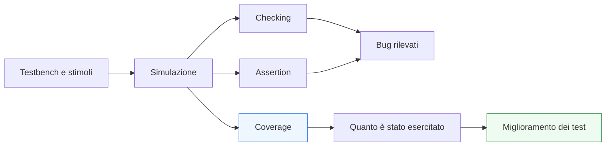
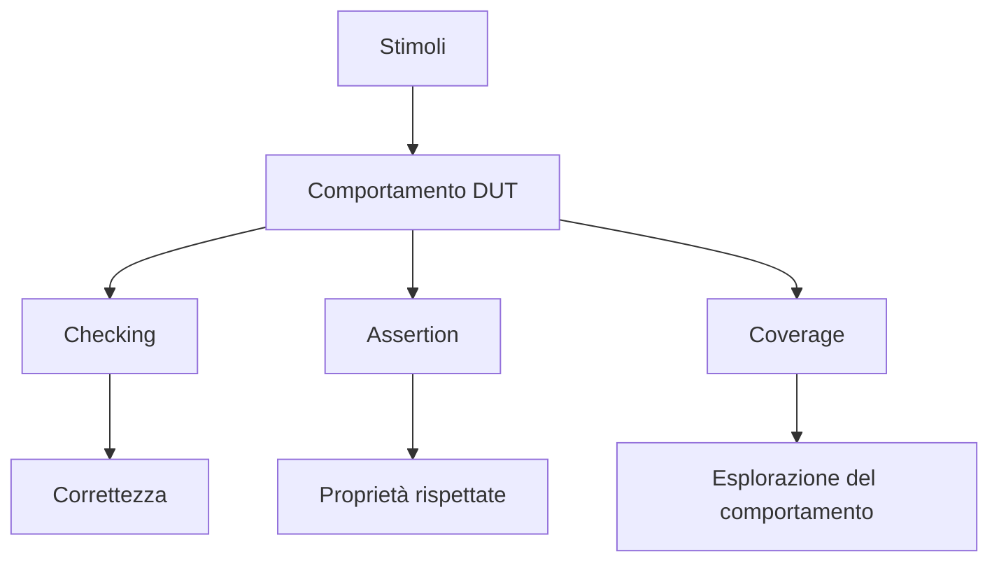

# Fondamenti di coverage in SystemVerilog

Dopo aver introdotto i **fondamenti della verifica**, la **struttura del testbench**, le **assertion** e il **flusso di simulazione**, il passo successivo naturale è affrontare una domanda fondamentale: **come capire quanto della funzionalità del blocco sia stato davvero verificato?**

Eseguire molti test non significa automaticamente verificare bene. Un DUT può sembrare stabile, può superare diversi casi di prova e può non mostrare errori evidenti, ma questo non garantisce che:
- tutte le condizioni importanti siano state esercitate;
- tutti gli stati siano stati visitati;
- tutte le transizioni critiche siano avvenute;
- tutti i protocolli siano stati realmente stressati;
- tutti i casi limite siano stati coperti.

Per questo entra in gioco la **coverage**.

La coverage è l’insieme delle tecniche che aiutano a misurare quanto la verifica abbia realmente osservato ed esercitato del comportamento del design. Dal punto di vista metodologico, la coverage non sostituisce il checking, le waveform o le assertion, ma li completa rispondendo a una domanda diversa:

- non solo “il DUT ha passato questi test?”
- ma anche “quali comportamenti sono stati davvero esercitati?”

Questa pagina introduce la coverage di base con un taglio coerente con il resto della documentazione:
- didattico ma tecnico;
- orientato alla verifica RTL;
- senza entrare troppo presto in framework avanzati;
- collegando la coverage a FSM, interfacce, pipeline, handshake, testbench e qualità complessiva del processo di verifica.

## 1. Perché la coverage è necessaria

Una delle difficoltà principali nella verifica è che il numero di comportamenti possibili di un blocco cresce molto rapidamente con:
- il numero di stati;
- il numero di ingressi;
- la presenza di pipeline;
- la complessità delle interfacce;
- il numero di cicli coinvolti;
- le combinazioni tra controllo e datapath.

### 1.1 Il problema della falsa fiducia
È possibile avere:
- test che passano;
- nessuna assertion fallita;
- nessun messaggio di errore evidente;

e tuttavia non aver ancora verificato parti importanti del comportamento del DUT.

### 1.2 Perché i test passati non bastano
Un test passato dimostra che un certo scenario funziona. Non dimostra automaticamente che:
- altri scenari siano stati esplorati;
- i corner case siano stati raggiunti;
- le condizioni rare siano state coperte;
- le interazioni temporali più delicate siano state esercitate.

### 1.3 Coverage come misura di esplorazione
La coverage serve proprio a misurare il grado di esplorazione della verifica, cioè quanto del comportamento rilevante del blocco sia stato effettivamente attivato durante la simulazione.

## 2. Che cosa significa “coprire” un comportamento

In termini semplici, coprire un comportamento significa che esso è stato osservato almeno una volta durante la verifica.

### 2.1 Esempi intuitivi
Si può voler sapere se:
- uno stato della FSM è stato visitato;
- una certa transizione è avvenuta;
- un handshake è stato completato;
- un dato è passato attraverso la pipeline in una condizione particolare;
- un certo valore di input è stato usato;
- una combinazione rilevante di segnali si è verificata.

### 2.2 Coverage come evidenza, non come garanzia
È importante ricordare che la coverage misura il fatto che qualcosa sia stato esercitato, non che sia stato verificato bene in ogni dettaglio.

Per esempio:
- vedere una transizione di stato non garantisce che tutte le sue implicazioni siano corrette;
- esercitare un protocollo non garantisce che ogni sua proprietà sia stata controllata;
- visitare una combinazione di segnali non implica che il risultato sia stato confrontato correttamente.

### 2.3 Ruolo corretto della coverage
La coverage va quindi letta come risposta alla domanda:
- “abbiamo davvero esercitato questa parte del comportamento?”
e non come sostituto del checking o delle assertion.

## 3. Coverage e verifica: ruoli diversi ma complementari

Per capire bene il ruolo della coverage, conviene distinguerla da altri strumenti della verifica.

### 3.1 Checking
Il checking controlla se il comportamento osservato è corretto.

### 3.2 Assertion
Le assertion esprimono proprietà che devono essere rispettate.

### 3.3 Coverage
La coverage misura quanto del comportamento previsto è stato effettivamente esercitato.

### 3.4 Visione completa
Un flusso di verifica maturo usa tutte e tre le dimensioni:
- testbench e stimoli per generare scenari;
- checking e assertion per rilevare violazioni;
- coverage per capire se gli scenari importanti sono stati davvero raggiunti.

## 4. Due grandi famiglie: coverage strutturale e coverage funzionale

In modo generale, si possono distinguere due grandi famiglie di coverage.

### 4.1 Coverage strutturale
Misura quanto della struttura del codice o del design è stato esercitato durante la simulazione.

### 4.2 Coverage funzionale
Misura quanto delle situazioni e dei comportamenti rilevanti dal punto di vista architetturale è stato esercitato.

### 4.3 Perché la distinzione è importante
La coverage strutturale guarda il design dal punto di vista della sua esecuzione come codice o struttura RTL.  
La coverage funzionale guarda il design dal punto di vista di ciò che il progettista vuole davvero verificare.

Entrambe sono utili, ma servono a rispondere a domande diverse.

## 5. Coverage strutturale

La coverage strutturale si concentra su quali parti della descrizione del design siano state attraversate in simulazione.

### 5.1 Idee tipiche
Può riguardare aspetti come:
- istruzioni eseguite;
- rami attraversati;
- condizioni attivate;
- porzioni di codice effettivamente valutate;
- stati o logiche strutturali toccati durante il run.

### 5.2 Valore pratico
È utile perché aiuta a capire se:
- alcune parti del design non sono mai state raggiunte;
- certi rami della logica non vengono esercitati;
- alcune condizioni restano completamente inesplorate.

### 5.3 Limite da ricordare
Un’alta coverage strutturale non garantisce da sola che i casi più importanti dal punto di vista funzionale siano stati verificati nel modo giusto.

Per esempio:
- si può attraversare un ramo senza verificare davvero il comportamento completo associato;
- si può toccare una parte di codice senza stressarne i casi limite.

## 6. Coverage funzionale

La coverage funzionale è spesso la parte più interessante dal punto di vista progettuale.

### 6.1 Che cosa misura
Misura se il testbench ha esercitato comportamenti che hanno significato architetturale, per esempio:
- stati e transizioni della FSM;
- sequenze di protocollo;
- combinazioni rilevanti tra segnali;
- valori di configurazione;
- eventi rari ma significativi;
- condizioni di stall, flush o backpressure;
- latenze attese in scenari diversi.

### 6.2 Perché è così importante
La coverage funzionale parla il linguaggio del progetto:
- che cosa conta davvero verificare;
- quali sono i casi rilevanti;
- quali interazioni devono accadere;
- quali scenari distinguono una verifica superficiale da una verifica seria.

### 6.3 Legame con la specifica
La coverage funzionale è spesso il punto di incontro tra:
- specifica del blocco;
- architettura;
- testbench;
- obiettivi della verifica.

## 7. Coverage delle FSM

Le FSM sono uno dei casi più naturali in cui applicare la coverage funzionale.

### 7.1 Stati visitati
Una domanda fondamentale è:
- tutti gli stati significativi sono stati visitati?

### 7.2 Transizioni esercitate
Una domanda ancora più importante è:
- tutte le transizioni rilevanti sono state percorse?

### 7.3 Perché le transizioni contano molto
Visitare uno stato non significa automaticamente aver verificato il suo comportamento completo. Spesso il punto critico è proprio nelle condizioni che portano:
- dentro uno stato;
- fuori da uno stato;
- lungo percorsi eccezionali;
- verso recovery o error handling.

### 7.4 Beneficio pratico
La coverage delle FSM aiuta a capire rapidamente se il testbench sta davvero esercitando la macchina a stati oppure solo pochi cammini principali.

## 8. Coverage di interfacce e handshake

Le interfacce e i protocolli sono un altro ambito centrale.

### 8.1 Aspetti significativi da coprire
Può essere importante sapere se sono stati osservati:
- trasferimenti normali;
- cicli con `valid` e `ready` entrambi attivi;
- backpressure;
- attese prolungate;
- completamento di una transazione;
- sequenze di `start` / `done`;
- condizioni in cui il dato resta in attesa.

### 8.2 Perché serve
Un blocco può sembrare corretto nei casi nominali ma non essere stato mai verificato in condizioni di:
- ricevente non pronto;
- sorgente intermittente;
- burst ravvicinati;
- transazioni consecutive;
- stall o flush.

### 8.3 Valore per l’integrazione
La coverage delle interfacce aiuta a capire se il protocollo è stato esercitato in modo realistico e sufficientemente ricco rispetto ai casi di integrazione attesi.

## 9. Coverage di pipeline, latenza e flusso temporale

Anche pipeline e comportamento temporale beneficiano della coverage.

### 9.1 Casi importanti
Può essere utile sapere se il testbench ha davvero esercitato:
- pipeline vuota;
- pipeline piena;
- avanzamento regolare;
- stall;
- flush;
- dati consecutivi;
- latenza nominale;
- condizioni di rallentamento o backpressure.

### 9.2 Coprire il tempo
In questi casi la coverage non riguarda solo valori, ma anche:
- distribuzione degli eventi nel tempo;
- distanza in cicli tra input e output;
- presenza di sequenze specifiche;
- condizioni di sovrapposizione tra più dati in volo.

### 9.3 Beneficio metodologico
Questa coverage aiuta a capire se il testbench ha davvero stressato la dimensione temporale del design, non solo il suo valore istantaneo.

## 10. Coverage di valori e combinazioni

Molti blocchi hanno comportamenti che dipendono da insiemi di valori o combinazioni di segnali.

### 10.1 Valori significativi
Può essere utile coprire:
- valori minimi e massimi;
- soglie;
- configurazioni speciali;
- opcodes;
- combinazioni di flag;
- modalità operative.

### 10.2 Combinazioni rilevanti
In molti casi non basta visitare i valori singolarmente: conta la loro combinazione. Per esempio:
- stato + input;
- opcode + validità;
- configurazione + tipo di transazione;
- larghezza o modalità + protocollo.

### 10.3 Attenzione all’esplosione combinatoria
Non tutte le combinazioni possibili sono ugualmente significative. Una buona coverage funzionale seleziona quelle che hanno vero senso architetturale e di verifica.

## 11. Coverage e casi limite

La coverage è particolarmente utile nel capire se i corner case sono stati davvero raggiunti.

### 11.1 Problema tipico
Molti test esercitano solo il percorso nominale.

### 11.2 Casi che spesso restano scoperti
Rischiano di restare poco esplorati:
- reset in momenti critici;
- transizioni rare della FSM;
- condizioni limite del contatore;
- simultaneità di eventi;
- condizioni di errore o recovery;
- uso estremo di pipeline e handshake.

### 11.3 Valore della coverage
La coverage evidenzia queste assenze e fornisce indicazioni concrete su dove arricchire il testbench.

## 12. Coverage non significa correttezza completa

Uno degli errori più comuni è usare la coverage come se fosse una prova di correttezza globale.

### 12.1 Perché non basta
Anche con coverage alta, si possono ancora avere:
- checker incompleti;
- proprietà temporali non verificate;
- bug sottili che compaiono solo in condizioni non ancora osservate;
- errori di protocollo non intercettati dal solo fatto di aver esercitato una certa sequenza.

### 12.2 Coverage come indicatore, non come certificato
La coverage dice:
- cosa è stato esercitato;
ma non garantisce automaticamente che tutto ciò che è stato esercitato sia stato verificato bene.

### 12.3 Lettura corretta
La coverage va interpretata insieme a:
- qualità del testbench;
- qualità delle assertion;
- correttezza del modello atteso;
- robustezza del checking;
- lettura architetturale del design.

## 13. Quando una coverage “alta” può essere fuorviante

Anche numeri apparentemente buoni possono essere ingannevoli.

### 13.1 Coverage alta ma poco significativa
Si può avere coverage elevata su aspetti strutturali e tuttavia non aver verificato:
- i corner case funzionali;
- i protocolli rari;
- i percorsi di errore;
- le combinazioni temporali critiche.

### 13.2 Coverage ottenuta con test poco mirati
Se gli stimoli sono rumorosi ma non guidati da obiettivi chiari, si può “toccare tanto” senza verificare davvero le proprietà più importanti.

### 13.3 Necessità di interpretazione
La coverage non va letta come numero isolato, ma come informazione da interpretare alla luce della specifica e dell’architettura.

## 14. Coverage come guida al miglioramento del testbench

Uno degli usi migliori della coverage è usarla per decidere come migliorare la verifica.

### 14.1 Individuare le lacune
La coverage aiuta a capire:
- quali stati non sono mai stati visitati;
- quali transizioni non si verificano;
- quali combinazioni non compaiono;
- quali sequenze temporali non vengono mai esercitate.

### 14.2 Guidare nuovi test
Una volta identificate le lacune, si possono progettare:
- nuovi casi di prova;
- nuovi stimoli mirati;
- nuove sequenze temporali;
- nuove condizioni di protocollo;
- nuovi scenari di corner case.

### 14.3 Flusso iterativo
In questo senso, la coverage è parte naturale del ciclo:
- simula;
- misura;
- individua le zone scoperte;
- arricchisci il testbench;
- riesegui.

## 15. Coverage e regressione

La coverage è molto utile anche nel contesto della regressione.

### 15.1 Perché conta in regressione
Quando il DUT evolve, è importante capire non solo se i test passano ancora, ma anche se:
- la porzione di comportamento esercitata è rimasta adeguata;
- nuove funzionalità sono state coperte;
- vecchi scenari sono ancora raggiunti;
- modifiche strutturali hanno introdotto nuove zone scoperte.

### 15.2 Effetto pratico
La regressione con osservazione della coverage aiuta a evitare che la verifica diventi progressivamente sbilanciata verso pochi casi ripetuti.

### 15.3 Maturità del flusso
Un flusso di verifica maturo usa la coverage non come dato statico, ma come misura in evoluzione del livello di fiducia nel design.

## 16. Coverage e qualità della RTL

La qualità della RTL influisce anche sulla qualità della coverage.

### 16.1 RTL strutturata, coverage più leggibile
Se il design è scritto con:
- FSM ben separate;
- segnali con nomi chiari;
- interfacce leggibili;
- pipeline osservabili;
- stili coerenti;

allora anche la definizione e l’interpretazione della coverage risultano più naturali.

### 16.2 RTL confusa, coverage meno utile
Se il design è opaco:
- diventa più difficile decidere che cosa coprire;
- gli eventi significativi sono meno chiari;
- i buchi di coverage sono più difficili da interpretare.

### 16.3 Relazione reciproca
La coverage, a sua volta, aiuta a capire se la struttura del DUT è abbastanza osservabile e verificabile.

## 17. Coverage su FPGA e ASIC

Anche se la coverage nasce soprattutto come misura della verifica funzionale, il suo ruolo è importante sia in flussi FPGA sia in flussi ASIC.

### 17.1 Su FPGA
Nel contesto FPGA, la coverage aiuta a capire se il blocco è stato esercitato in modo sufficientemente ricco prima di passare a:
- sintesi;
- implementazione;
- prototipazione;
- debug su dispositivo.

### 17.2 Su ASIC
Nel contesto ASIC, la coverage è ancora più cruciale perché:
- il costo degli errori tardivi è molto alto;
- la fiducia nella RTL deve essere costruita con maggiore disciplina;
- la verifica deve sostenere il flusso verso sintesi, DFT, backend e tape-out.

### 17.3 Visione comune
In entrambi i casi, la coverage aiuta a trasformare la verifica da insieme di test “plausibili” a processo più misurabile e più consapevole.

## 18. Errori comuni

Alcuni errori ricorrono spesso nell’uso della coverage.

### 18.1 Guardare solo il numero finale
Un numero globale può nascondere aree importanti ancora scoperte.

### 18.2 Confondere coverage e correttezza
Esercitare un comportamento non equivale a verificarlo completamente.

### 18.3 Coprire ciò che è facile, non ciò che conta
Se la coverage non è guidata dalla specifica, si rischia di misurare aspetti secondari e trascurare quelli cruciali.

### 18.4 Non usare la coverage per migliorare i test
La coverage ha poco valore se non influenza il modo in cui il testbench viene raffinato.

### 18.5 Ignorare corner case e casi temporali
I buchi più pericolosi spesso riguardano proprio sequenze rare, stati eccezionali e protocolli sotto stress.

## 19. Buone pratiche di base

Per usare bene la coverage in una verifica RTL SystemVerilog, alcune linee guida sono particolarmente efficaci.

### 19.1 Partire dai comportamenti davvero importanti
È meglio coprire bene gli aspetti architetturalmente rilevanti che inseguire numeri generici poco informativi.

### 19.2 Collegare la coverage alla specifica
La coverage dovrebbe rispondere a domande come:
- tutti gli stati rilevanti sono stati visitati?
- tutti i protocolli importanti sono stati esercitati?
- tutte le modalità operative sono state osservate?
- i corner case chiave sono stati raggiunti?

### 19.3 Leggere la coverage insieme a checking e assertion
Solo l’integrazione di questi strumenti dà un quadro affidabile della verifica.

### 19.4 Usarla per guidare l’evoluzione del testbench
La coverage è utile soprattutto quando suggerisce quali test mancano ancora.

### 19.5 Mantenere una visione qualitativa, non solo numerica
L’obiettivo finale non è “fare un numero alto”, ma costruire fiducia reale nel comportamento del DUT.

## 20. Collegamento con il resto della sezione

Questa pagina completa in modo naturale il primo blocco dedicato alla verifica e si collega direttamente a:
- **`verification-basics.md`**, che ha definito gli obiettivi generali della verifica RTL;
- **`testbench-structure.md`**, che ha mostrato come organizzare il banco di prova;
- **`assertions-basics.md`**, che ha introdotto il checking dichiarativo di proprietà;
- **`simulation-workflow.md`**, che ha descritto il ciclo operativo di simulazione, debug e regressione;
- **`fsm.md`**, **`interfaces-and-handshake.md`**, **`pipelining.md`** e **`latency-and-throughput.md`**, che hanno introdotto esattamente quei comportamenti che la coverage aiuta a misurare in modo più sistematico.

La coverage è quindi il naturale strumento di chiusura del primo percorso di verifica: dopo aver imparato a testare e controllare, si impara a misurare quanto si è davvero esplorato.

## 21. In sintesi

La coverage in SystemVerilog è uno strumento essenziale per capire quanto la verifica abbia davvero esercitato del comportamento di un design. Non sostituisce il checking né le assertion, ma aggiunge una dimensione cruciale: la misura dell’esplorazione del comportamento.

La distinzione tra coverage strutturale e funzionale aiuta a leggere il design da due punti di vista diversi:
- come struttura di codice o di logica attraversata;
- come insieme di comportamenti architetturalmente significativi.

Usata con criterio, la coverage aiuta a:
- individuare zone non ancora testate;
- progettare nuovi casi di verifica;
- rafforzare la regressione;
- aumentare la fiducia nel DUT;
- costruire un flusso di verifica più maturo, sia in ambito FPGA sia in ambito ASIC.

## Prossimo passo

Il passo più naturale ora è **`reset-strategies.md`**, perché rappresenta un tema trasversale molto importante che collega direttamente:
- RTL
- verifica
- FSM
- pipeline
- interfacce
- robustezza di integrazione
- impatto su timing e implementazione

In alternativa, un altro passo molto naturale è **`verification-vs-validation.md`**, se vuoi aggiungere una pagina più metodologica sul rapporto tra correttezza del blocco e correttezza rispetto alla specifica di sistema.
