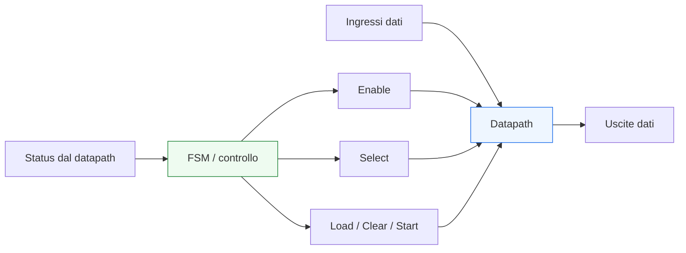
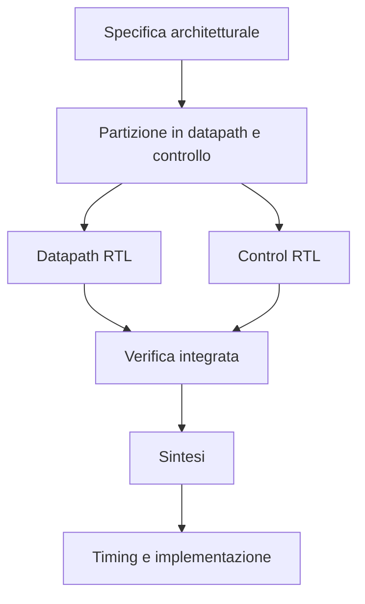
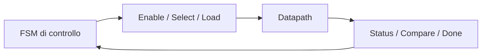

# Datapath e controllo

Dopo aver introdotto le **Finite State Machine** e la **codifica degli stati**, il passo successivo naturale è osservare come il controllo si inserisce in un blocco hardware reale. Nella maggior parte dei progetti digitali non esiste soltanto una FSM “isolata”: esiste invece una struttura più ampia in cui una parte elabora i dati e un’altra decide **quando**, **come** e **in quale sequenza** quell’elaborazione deve avvenire.

Questa distinzione porta a due concetti fondamentali:
- **datapath**, cioè il percorso dei dati;
- **control path**, cioè la logica di controllo.

La separazione tra datapath e controllo è una delle idee più importanti nella progettazione RTL, perché aiuta a costruire blocchi più leggibili, più verificabili e più adatti sia a implementazioni **FPGA** sia a implementazioni **ASIC**. Inoltre, crea un collegamento diretto tra:
- architettura;
- RTL;
- timing;
- verifica;
- implementazione fisica.

## 1. Che cosa si intende per datapath

Il **datapath** è la parte dell’hardware che trasporta, trasforma, memorizza o seleziona i dati. In un blocco RTL, il datapath contiene tipicamente:
- registri;
- mux;
- operatori aritmetici;
- comparatori;
- shifter;
- accumulatori;
- pipeline register;
- interconnessioni tra questi elementi.

### 1.1 Ruolo del datapath
Il datapath realizza il “lavoro utile” del blocco. Per esempio può:
- sommare o sottrarre valori;
- caricare dati da un’interfaccia;
- spostare informazioni tra registri;
- confrontare una soglia;
- accumulare risultati;
- avanzare dati da uno stadio di pipeline al successivo.

### 1.2 Visione RTL
Dal punto di vista RTL, il datapath è fatto di:
- logica combinatoria che calcola;
- logica sequenziale che memorizza;
- percorsi dati tra registri.

### 1.3 Visione architetturale
Dal punto di vista architetturale, il datapath è il “motore” dell’elaborazione. Se il blocco esegue un compito numerico, protocollare o di trasformazione, è quasi sempre il datapath a implementarlo.

## 2. Che cosa si intende per controllo

Il **controllo** è la parte dell’hardware che coordina il comportamento del datapath. Non elabora necessariamente il dato nel senso numerico del termine, ma decide:
- quando caricare un registro;
- quale ingresso selezionare su un mux;
- quando avviare un’operazione;
- quando attendere;
- quando terminare;
- quando generare segnali di handshake;
- come avanzare tra le fasi operative.

### 2.1 Forma tipica del controllo
Molto spesso il controllo è realizzato tramite:
- FSM;
- logiche combinatorie di abilitazione;
- segnali di stato e handshake;
- contatori di supporto;
- controlli sequenziali multi-ciclo.

### 2.2 Ruolo del controllo
Il controllo coordina il datapath nel tempo. In pratica decide la sequenza delle operazioni.

### 2.3 Un esempio concettuale
In un blocco che carica due operandi, li elabora e produce un risultato:
- il **datapath** contiene registri, mux e operatore;
- il **controllo** decide quando caricare gli operandi, quando lanciare l’operazione e quando dichiarare valido il risultato.

## 3. Perché separare datapath e controllo

La separazione tra datapath e controllo è una scelta progettuale molto importante. Non è obbligatoria in tutti i casi, ma è estremamente utile per mantenere il progetto leggibile e scalabile.

### 3.1 Chiarezza
La separazione rende più evidente:
- dove vengono memorizzati i dati;
- dove avviene il calcolo;
- dove si decide la sequenza operativa;
- quali segnali sono di controllo e quali sono di dato.

### 3.2 Modularità
Dividere il blocco in datapath e controllo permette di:
- riusare il datapath;
- modificare la strategia di controllo senza stravolgere la parte dati;
- fare review più ordinate;
- localizzare meglio i problemi.

### 3.3 Benefici sul flusso
Questa separazione aiuta:
- verifica funzionale;
- debug delle waveform;
- analisi dei percorsi di timing;
- sintesi e ottimizzazione;
- implementazione fisica.

## 4. Datapath come insieme di registri e logica combinatoria

Un datapath ordinato può essere letto come una sequenza di elementi di memoria e trasformazioni combinatorie.

### 4.1 Registri
I registri nel datapath servono a:
- memorizzare operandi;
- conservare risultati intermedi;
- delimitare stadi di pipeline;
- sincronizzare trasferimenti;
- spezzare percorsi critici.

### 4.2 Mux
I mux servono a selezionare:
- quale dato entra in un registro;
- quale sorgente alimenta un’operazione;
- quale percorso seguire in una fase operativa.

### 4.3 Logica combinatoria
La logica combinatoria del datapath implementa:
- elaborazioni numeriche;
- confronti;
- decodifiche;
- selezioni;
- calcolo di condizioni da restituire al controllo.

### 4.4 Status verso il controllo
Il datapath spesso restituisce al controllo segnali come:
- fine conteggio;
- confronto raggiunto;
- operazione completata;
- buffer pieno o vuoto;
- condizione di errore;
- validità del dato.

Questi segnali di stato sono il punto di contatto naturale dal datapath verso la logica di controllo.

## 5. Controllo come orchestrazione temporale

Se il datapath è il “motore”, il controllo è la logica che lo fa lavorare nel modo corretto.

### 5.1 Segnali di controllo tipici
Il controllo genera segnali come:
- `load`
- `enable`
- `clear`
- `select`
- `start`
- `done`
- `valid`
- `ready`
- `stall`
- `flush`

### 5.2 Sequenza operativa
Il controllo decide:
- in che ordine eseguire le operazioni;
- quali registri aggiornare in un certo ciclo;
- quali sorgenti selezionare;
- quando attendere una condizione;
- quando completare una transazione.

### 5.3 Natura temporale del controllo
Il controllo è profondamente legato al tempo:
- spesso ha una struttura sequenziale;
- dipende da eventi ciclo per ciclo;
- è strettamente associato a FSM o macchine di scheduling semplici.

## 6. Relazione tra FSM e datapath

Una FSM rappresenta spesso il cuore del controllo di un datapath.

### 6.1 La FSM decide le fasi
Per ogni stato della FSM, il controllo può decidere:
- quali registri abilitare;
- quale mux selezionare;
- se avviare o fermare un’operazione;
- se aspettare una condizione;
- se passare allo stato successivo.

### 6.2 Il datapath fornisce condizioni di avanzamento
Il datapath restituisce informazioni al controllo, per esempio:
- confronto completato;
- risultato pronto;
- contatore arrivato a zero;
- handshake ricevuto;
- buffer disponibile.

### 6.3 Cooperazione
Il comportamento complessivo nasce da questa cooperazione:
- il controllo imposta le azioni;
- il datapath esegue;
- il datapath segnala lo stato;
- il controllo decide il passo successivo.

## 7. Datapath e controllo in operazioni multi-ciclo

Una delle situazioni in cui la separazione emerge con più chiarezza è quella delle operazioni multi-ciclo.

### 7.1 Perché servono più cicli
Molte operazioni non si completano in un solo ciclo:
- accessi a interfacce;
- sequenze di caricamento;
- elaborazioni iterative;
- algoritmi con più fasi;
- handshake con altre unità.

### 7.2 Ruolo del datapath
Il datapath:
- conserva i dati coinvolti;
- aggiorna i registri intermedi;
- produce risultati parziali;
- espone condizioni di avanzamento.

### 7.3 Ruolo del controllo
Il controllo:
- avvia la sequenza;
- decide il passaggio tra le fasi;
- monitora la condizione di completamento;
- presenta il risultato al sistema.

### 7.4 Visione RTL
Questa struttura è particolarmente naturale in RTL perché trasforma una procedura nel tempo in:
- stati del controllo;
- operazioni elementari del datapath;
- scambi di segnali di controllo e stato.

## 8. Enable, load e select: i segnali chiave di integrazione

L’integrazione tra datapath e controllo si realizza spesso tramite pochi segnali chiave, ma metodologicamente molto importanti.

### 8.1 Enable
`enable` determina se un registro o una sezione del datapath deve avanzare in quel ciclo.

### 8.2 Load
`load` indica che un registro deve caricare un nuovo valore.

### 8.3 Clear o reset locale
`clear` forza un registro o un accumulatore a uno stato noto.

### 8.4 Select
`select` controlla i mux e quindi il percorso del dato nel datapath.

### 8.5 Start, done, valid, ready
Questi segnali collegano spesso il blocco con l’esterno e coordinano:
- avvio dell’operazione;
- validità del risultato;
- disponibilità alla ricezione;
- completamento del ciclo operativo.

Questi segnali sono il linguaggio con cui controllo e datapath si parlano.

## 9. Datapath e controllo nel timing

Separare le due parti aiuta anche a ragionare meglio sul timing.

### 9.1 Timing del datapath
I percorsi critici più pesanti sono spesso nel datapath, specialmente quando contiene:
- operatori aritmetici;
- mux complessi;
- comparatori su molti bit;
- catene combinatorie profonde.

### 9.2 Timing del controllo
Anche il controllo può diventare critico, soprattutto quando:
- la FSM ha molte condizioni di transizione;
- i segnali di controllo hanno fanout elevato;
- molte uscite dipendono dallo stato;
- il controllo interagisce con molti sottoblocchi.

### 9.3 Percorsi incrociati
I percorsi più interessanti spesso attraversano il confine:
- datapath → status → controllo
- controllo → select/enable → datapath

Per questo il timing va valutato non solo all’interno delle due parti, ma anche sulle loro interazioni.

### 9.4 Beneficio della partizione
Una buona partizione aiuta a identificare:
- quali percorsi appartengono al calcolo dati;
- quali al controllo;
- dove introdurre pipeline o registrazione;
- dove intervenire per ridurre il fanout.

## 10. Datapath, controllo e pipeline

Quando il blocco cresce in complessità o frequenza target, il rapporto tra datapath e controllo si intreccia con la pipeline.

### 10.1 Pipeline del datapath
Nel datapath, la pipeline serve a:
- spezzare percorsi lunghi;
- aumentare la frequenza;
- distribuire il lavoro su più cicli.

### 10.2 Impatto sul controllo
Quando il datapath è pipelined, il controllo deve diventare più consapevole di:
- latenza dei risultati;
- sincronizzazione tra segnali di validità e dati;
- stall;
- flush;
- dipendenze tra stadi.

### 10.3 Coordinamento
Un controllo troppo semplice può non bastare più: bisogna allora introdurre segnali e strutture che tengano conto del fatto che il dato attraversa più stadi temporali.

### 10.4 Collegamento a FPGA e ASIC
- In **FPGA**, il datapath pipelined aiuta molto la chiusura del timing, ma richiede un controllo coerente con la latenza introdotta.
- In **ASIC**, la pipeline è spesso essenziale per raggiungere gli obiettivi di frequenza e va coordinata con floorplanning, fanout e CTS.

## 11. Effetti sulla verifica

La separazione datapath/controllo è molto vantaggiosa anche dal punto di vista della verifica.

### 11.1 Verifica del datapath
Il datapath può essere verificato rispetto a:
- correttezza delle trasformazioni;
- aggiornamento dei registri;
- selezione corretta dei percorsi dati;
- comportamento su casi limite.

### 11.2 Verifica del controllo
Il controllo può essere verificato rispetto a:
- correttezza della sequenza di stati;
- generazione dei segnali di abilitazione;
- gestione degli handshake;
- risposta alle condizioni di completamento o errore.

### 11.3 Verifica dell’integrazione
L’aspetto più importante è però l’integrazione:
- il controllo genera i segnali giusti nel ciclo giusto?
- il datapath reagisce nel modo atteso?
- i segnali di status fanno avanzare il controllo correttamente?
- latenza e validità dei dati sono coerenti?

### 11.4 Debug
Nelle waveform, una buona partizione rende più semplice capire:
- cosa sta facendo il datapath;
- in quale fase si trova il controllo;
- se un problema nasce da una selezione dati o da una decisione di stato.

## 12. Effetti su sintesi e implementazione

Datapath e controllo hanno profili diversi anche dal punto di vista dell’implementazione fisica.

### 12.1 Sul lato datapath
La sintesi del datapath può coinvolgere:
- operatori ottimizzati;
- risorse dedicate;
- mapping su DSP o carry chain in FPGA;
- ottimizzazione combinatoria e sequenziale in ASIC.

### 12.2 Sul lato controllo
La sintesi del controllo può essere influenzata da:
- state encoding;
- fanout dei segnali di controllo;
- complessità della logica di transizione;
- decodifica degli stati;
- distribuzione dei segnali verso il datapath.

### 12.3 Impatto su FPGA
Su FPGA:
- il datapath può sfruttare risorse dedicate;
- il controllo deve essere scritto in modo pulito per evitare routing complesso;
- il bilanciamento tra controllo e datapath influisce su placement e timing.

### 12.4 Impatto su ASIC
Su ASIC, questa separazione aiuta lungo tutto il backend:
- sintesi più leggibile;
- floorplanning più ragionato;
- migliore controllo del fanout;
- PnR più prevedibile;
- CTS e signoff più gestibili.

Il controllo tende ad avere ampia distribuzione di segnali; il datapath tende a concentrare logica e registri. Questa differenza è importante anche fisicamente.

## 13. Errori comuni

Alcuni errori ricorrenti rendono difficile la gestione di datapath e controllo.

### 13.1 Mescolare tutto in un unico blocco
Quando dati, stato, selezioni e controllo temporale sono tutti nello stesso blocco procedurale, il design diventa difficile da leggere e da verificare.

### 13.2 Controllo troppo implicito
Se i segnali di controllo non sono chiari, diventa difficile capire perché il datapath stia facendo una certa operazione.

### 13.3 Datapath poco strutturato
Un datapath senza registri, mux e segnali ben organizzati rende difficile sia la sintesi sia il timing closure.

### 13.4 Mancanza di segnali di status chiari
Il controllo ha bisogno di feedback dal datapath. Se questi segnali non sono ben pensati, la FSM o la logica di controllo diventano fragili.

### 13.5 Non considerare timing e latenza
La separazione concettuale non basta: bisogna anche capire in quanti cicli il dato si muove e quando il controllo deve reagire.

## 14. Buone pratiche di modellazione

Per costruire un blocco RTL pulito, alcune pratiche sono particolarmente efficaci.

### 14.1 Distinguere chiaramente segnali di dato e segnali di controllo
I due ruoli dovrebbero emergere già dai nomi e dalla struttura del codice.

### 14.2 Rendere il datapath leggibile come flusso di dati
Registri, mux e trasformazioni dovrebbero essere riconoscibili in modo diretto.

### 14.3 Rendere il controllo leggibile come sequenza operativa
FSM, enable, select e handshake dovrebbero descrivere chiaramente la strategia di avanzamento del blocco.

### 14.4 Pensare alla verificabilità
Ogni interazione importante tra controllo e datapath dovrebbe essere osservabile e verificabile.

### 14.5 Pensare al backend
Un buon blocco RTL non si ferma alla simulazione:
- i percorsi dati devono essere compatibili con il timing;
- i segnali di controllo non devono avere fanout ingestibile;
- la struttura deve essere adatta a implementazione FPGA o ASIC.

## 15. Collegamento con il resto della sezione

Questa pagina si collega direttamente ai temi già introdotti:
- **`fsm.md`** ha spiegato come il controllo possa essere realizzato con una macchina a stati;
- **`state-encoding.md`** ha mostrato che anche il controllo ha impatto fisico e temporale;
- **`combinational-vs-sequential.md`** ha chiarito la distinzione tra calcolo e stato;
- **`procedural-blocks.md`** ha fornito la base per modellare in modo corretto i blocchi che implementano datapath e controllo.

Qui questi concetti vengono integrati in una visione più vicina a un blocco hardware reale.

## 16. In sintesi

La distinzione tra datapath e controllo è uno dei principi più utili della progettazione digitale. Il datapath elabora e memorizza i dati; il controllo decide quando e come quell’elaborazione deve avvenire.

Questa separazione:
- rende l’RTL più chiara;
- aiuta a organizzare FSM, registri, mux ed enable;
- migliora verifica e debug;
- semplifica l’analisi del timing;
- rende più robusta l’implementazione sia in FPGA sia in ASIC.

In un progetto maturo, la qualità del blocco non dipende soltanto dalla correttezza del datapath o della FSM presi separatamente, ma dalla qualità della loro interazione. È proprio in questa interazione che l’architettura si trasforma in hardware reale.

## Prossimo passo

Il passo più naturale ora è **`pipelining.md`**, perché la pipeline mostra in modo molto concreto come il datapath venga spezzato in stadi e come il controllo debba adattarsi a:
- latenza;
- validità dei dati;
- enable;
- stall;
- flush;
- timing closure.

In alternativa, un altro passo molto naturale è **`interfaces-and-handshake.md`**, se vuoi approfondire prima il dialogo tra blocchi tramite segnali di controllo come `valid`, `ready`, `start` e `done`.
