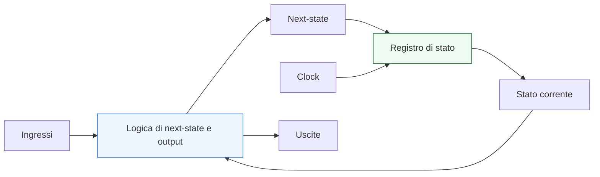
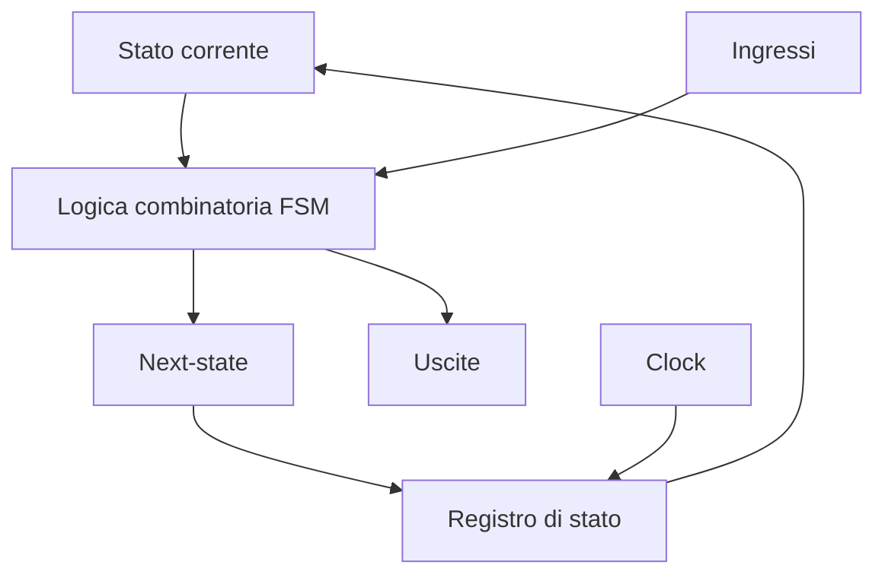
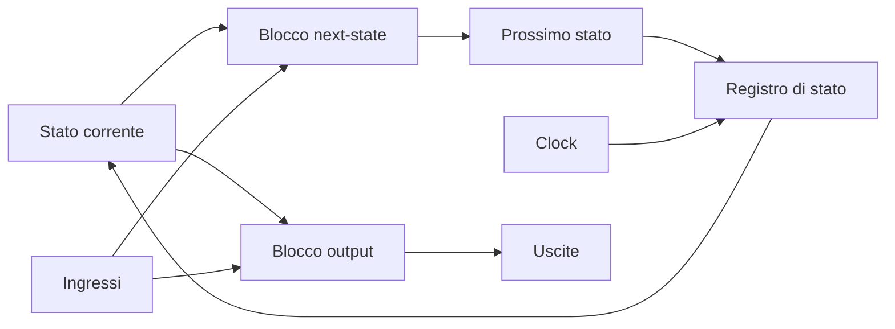

# Macchine a stati finiti (FSM)

Le **Finite State Machine** (FSM) sono uno dei modelli più importanti nella progettazione digitale. In SystemVerilog, rappresentano uno dei casi in cui la relazione tra **architettura**, **RTL**, **timing** e **verifica** diventa più evidente: una FSM traduce un comportamento temporale in una struttura ordinata fatta di stato memorizzato, logica combinatoria e aggiornamento sincrono.

Dal punto di vista progettuale, una FSM serve quando il comportamento di un blocco non dipende soltanto dagli ingressi correnti, ma anche dalla **sequenza degli eventi** e dalla **fase operativa** in cui il blocco si trova. Per questo viene usata in modo esteso in:
- unità di controllo;
- protocolli di comunicazione;
- arbitri;
- sequenziatori;
- controller di inizializzazione;
- gestione di pipeline, handshake e operazioni multi-ciclo.

Questa pagina introduce le FSM in modo coerente con il resto della sezione SystemVerilog: non come semplice schema teorico, ma come strumento centrale della progettazione RTL, con attenzione a leggibilità, sintetizzabilità, timing, verifica e implementazione su FPGA o ASIC.

## 1. Che cos’è una FSM

Una macchina a stati finiti è un modello in cui il comportamento del sistema viene descritto come un insieme finito di **stati** e di **transizioni** tra stati. In ogni istante, il blocco si trova in uno stato corrente; in base agli ingressi e alle regole definite dal progetto, può rimanere nello stesso stato oppure passare a uno stato diverso al clock successivo.

### 1.1 Componenti fondamentali
Una FSM è composta da tre elementi principali:
- **stato corrente**, memorizzato in registri;
- **logica di next-state**, che calcola il prossimo stato;
- **logica di output**, che genera segnali di controllo o di risposta.

### 1.2 Significato architetturale
Dal punto di vista architetturale, gli stati rappresentano “fasi” del comportamento del blocco. Per esempio:
- attesa di un evento;
- ricezione di un comando;
- elaborazione in corso;
- completamento di una transazione;
- gestione di un errore.

### 1.3 Perché sono così importanti
Le FSM sono fondamentali perché permettono di descrivere in modo ordinato:
- comportamento temporale;
- dipendenza dalla storia precedente;
- controllo di sequenze multi-ciclo;
- coordinamento tra datapath e segnali di controllo.

## 2. Perché una FSM è una struttura naturalmente RTL

Una FSM è uno degli esempi più chiari di struttura **Register Transfer Level**. Questo perché separa in modo molto netto:
- ciò che viene memorizzato nel tempo;
- ciò che viene calcolato in combinatoria;
- ciò che cambia solo al clock.

### 2.1 Parte sequenziale
La parte sequenziale della FSM è il **registro di stato**. Questo elemento memorizza lo stato corrente e lo aggiorna sul fronte di clock.

### 2.2 Parte combinatoria
La parte combinatoria calcola:
- il **next-state**;
- eventuali uscite dipendenti da stato e ingressi;
- condizioni di transizione;
- segnali di abilitazione o controllo.

### 2.3 Beneficio progettuale
Questa separazione rende le FSM molto adatte a una scrittura RTL ordinata, perché:
- il comportamento è leggibile;
- la sintesi è prevedibile;
- il timing è più analizzabile;
- la verifica è più semplice da strutturare.

## 3. Quando usare una FSM

Non ogni controllo richiede una FSM esplicita, ma molte situazioni reali la rendono la scelta più naturale.

### 3.1 Sequenze operative
Una FSM è adatta quando il blocco deve attraversare fasi ben definite, per esempio:
- idle;
- preparazione;
- esecuzione;
- completamento;
- gestione errore.

### 3.2 Protocolli
Le FSM sono molto usate per:
- handshake;
- gestione di valid/ready;
- protocolli seriali;
- bus controller;
- arbitri di accesso a risorse condivise.

### 3.3 Operazioni multi-ciclo
Quando un’operazione richiede più cicli di clock, la FSM fornisce una struttura naturale per:
- avviare l’operazione;
- monitorarne l’avanzamento;
- dichiararne il completamento.

### 3.4 Controllo del datapath
In molti progetti, il datapath esegue trasformazioni numeriche o trasferimenti di dato, mentre la FSM decide:
- quando caricare;
- quando avanzare;
- quando abilitare;
- quando resettare o terminare.

## 4. Modello concettuale di una FSM

Per progettare bene una FSM, conviene partire da una visione molto chiara del suo comportamento logico e temporale.

### 4.1 Stato corrente
Lo stato corrente rappresenta la configurazione operativa del blocco in quel ciclo.

### 4.2 Ingressi
Gli ingressi influenzano le transizioni tra stati e, in alcuni casi, anche le uscite.

### 4.3 Next-state
Il next-state è il valore che verrà caricato nel registro di stato al clock successivo.

### 4.4 Uscite
Le uscite possono essere:
- legate solo allo stato corrente;
- legate a stato corrente e ingressi.

### 4.5 Evoluzione ciclo per ciclo
La FSM segue un ciclo concettuale molto ordinato:
1. lo stato corrente è memorizzato nei registri;
2. la logica combinatoria valuta ingressi e stato;
3. viene calcolato il next-state;
4. al clock successivo il next-state diventa stato corrente.

## 5. Struttura RTL tipica di una FSM in SystemVerilog

In SystemVerilog, una FSM ordinata viene normalmente descritta usando una struttura in più blocchi, che separa chiaramente le responsabilità.

### 5.1 Registro di stato
Un blocco `always_ff` memorizza lo stato corrente e lo aggiorna al clock.

### 5.2 Logica di next-state
Un blocco `always_comb` calcola il prossimo stato in funzione dello stato corrente e degli ingressi.

### 5.3 Logica di output
A seconda dello stile scelto, le uscite possono essere:
- calcolate nello stesso blocco combinatorio del next-state;
- separate in un secondo blocco combinatorio;
- registrate in un blocco sequenziale, se richiesto dall’architettura.

### 5.4 Perché questa struttura è consigliata
Questa organizzazione:
- migliora leggibilità;
- aiuta la review del codice;
- evita ambiguità tra stato e combinatoria;
- rende più semplice il debug;
- facilita la correlazione con timing e sintesi.

## 6. Codifica degli stati

Un aspetto importante nella progettazione di una FSM è il modo in cui gli stati vengono rappresentati internamente.

### 6.1 Stati come concetto logico
Dal punto di vista dell’architettura, gli stati sono simboli con significato funzionale, non semplici numeri. Per questo è importante che il codice li esprima in modo leggibile.

### 6.2 Uso di `enum`
SystemVerilog permette di rappresentare gli stati con `enum`, una scelta molto utile perché:
- rende il codice più chiaro;
- migliora la leggibilità delle waveform;
- riduce errori legati a costanti numeriche sparse;
- aiuta a mantenere allineata implementazione e documentazione.

### 6.3 Codifica fisica degli stati
A livello di implementazione, gli stati possono essere codificati in modi diversi, per esempio:
- binario compatto;
- one-hot;
- gray o codifiche specifiche.

Questa scelta può influenzare:
- numero di flip-flop;
- profondità logica delle transizioni;
- timing;
- area;
- facilità di debug.

### 6.4 Collegamento con FPGA e ASIC
- In **FPGA**, la codifica one-hot è spesso vantaggiosa perché sfrutta bene la disponibilità di flip-flop e può semplificare la logica combinatoria.
- In **ASIC**, una codifica più compatta può essere preferibile quando area e potenza sono prioritarie, anche se il timing resta sempre un fattore centrale.

La scelta finale dipende dall’architettura, dal numero di stati e dagli obiettivi del progetto.

## 7. FSM di tipo Moore e Mealy

Dal punto di vista teorico e pratico, esistono due modelli classici per descrivere le uscite di una FSM.

### 7.1 FSM di Moore
In una FSM di Moore, le uscite dipendono **solo dallo stato corrente**.

#### Vantaggi
- uscite più stabili e facili da interpretare;
- minore sensibilità immediata ai glitch sugli ingressi;
- lettura del comportamento spesso più semplice.

#### Svantaggi
- in alcuni casi richiede più stati;
- può introdurre una risposta più “ritardata” rispetto all’ingresso.

### 7.2 FSM di Mealy
In una FSM di Mealy, le uscite dipendono da:
- stato corrente;
- ingressi correnti.

#### Vantaggi
- può ridurre il numero di stati;
- permette una risposta più diretta agli ingressi.

#### Svantaggi
- uscite potenzialmente più sensibili alla combinatoria;
- maggiore attenzione a glitch e timing;
- verifica e debug talvolta meno immediati.

### 7.3 Scelta progettuale
Nella pratica, la scelta tra Moore e Mealy non è puramente teorica. Va valutata in base a:
- requisiti temporali;
- robustezza desiderata sulle uscite;
- semplicità della logica;
- impatto su timing e integrazione.

## 8. Separare stato, next-state e uscite

Una delle buone pratiche più importanti nella scrittura RTL di una FSM è la separazione ordinata dei diversi ruoli.

### 8.1 Stato corrente
Va modellato come variabile sequenziale, aggiornata al clock.

### 8.2 Next-state
Va calcolato in logica combinatoria, con assegnazioni complete e leggibili.

### 8.3 Uscite
Le uscite vanno progettate con attenzione in base al loro ruolo:
- combinatorie se devono reagire subito;
- registrate se devono essere temporizzate meglio o rese più stabili.

### 8.4 Benefici della separazione
Questa struttura aiuta a:
- evitare latch involontari;
- rendere più chiara la semantica;
- fare debug più rapidamente;
- verificare transizioni e copertura in modo più diretto.

## 9. Reset e stato iniziale

Ogni FSM deve partire da una configurazione ben definita. Per questo il reset è un elemento essenziale della progettazione.

### 9.1 Perché è importante
Un reset ben definito garantisce:
- stato iniziale noto;
- comportamento prevedibile all’avvio;
- integrazione più robusta;
- debug semplificato.

### 9.2 Stato di reset
Di solito si sceglie uno stato iniziale che rappresenta una condizione sicura, come:
- idle;
- attesa;
- inizializzazione;
- recovery.

### 9.3 Reset e flusso reale
La gestione del reset ha impatto su:
- simulazione e testbench;
- bring-up su FPGA;
- strategia di inizializzazione su ASIC;
- timing e closure;
- definizione delle condizioni di avvio del sistema.

Per questo il reset non va visto come un dettaglio di codice, ma come una scelta architetturale.

## 10. Completezza della logica di transizione

Una FSM ben descritta deve avere una logica di transizione completa e leggibile.

### 10.1 Assegnazioni di default
Nel blocco combinatorio è buona pratica assegnare un default al next-state, spesso inizializzandolo allo stato corrente. Questo:
- evita inferenze indesiderate;
- chiarisce il comportamento “di permanenza”;
- semplifica la lettura delle condizioni di transizione.

### 10.2 Gestione dei casi
Conviene che ogni stato sia trattato in modo esplicito, così da rendere chiaro:
- cosa succede in quello stato;
- in quali condizioni si cambia;
- verso quale stato si va.

### 10.3 Stato illegale o non atteso
In progetti robusti, è utile pensare anche al comportamento in caso di stato invalido o imprevisto. Questo può aiutare:
- debug;
- recovery;
- robustezza della verifica;
- identificazione di corruzioni dello stato.

## 11. Impatto delle FSM sul timing

Le FSM sono spesso viste come logica di controllo, ma anche il controllo può diventare critico dal punto di vista temporale.

### 11.1 Timing del next-state
La logica che decide il prossimo stato può crescere molto se:
- aumentano gli stati;
- aumentano le condizioni di transizione;
- si combinano molte dipendenze di ingresso.

### 11.2 Uscite della FSM
Se le uscite sono combinatorie, possono contribuire a percorsi critici o essere soggette a glitch. Se sono registrate, il timing può diventare più robusto ma aumenta la latenza.

### 11.3 Fanout e distribuzione del controllo
Uno stato o un insieme di segnali di controllo possono avere fanout elevato verso molte parti del datapath. Questo è rilevante sia in FPGA sia in ASIC:
- in FPGA può influenzare placement e routing;
- in ASIC può influenzare sintesi, buffering, floorplanning e CTS.

### 11.4 FSM e pipeline
In sistemi più complessi, la FSM spesso governa datapath pipelined. In quel caso bisogna verificare bene la coerenza tra:
- avanzamento dello stato;
- validità dei dati;
- enable dei registri;
- gestione di stall e flush.

## 12. Impatto sulla verifica

Le FSM sono tra gli oggetti più naturali da verificare, ma richiedono comunque disciplina.

### 12.1 Verifica delle transizioni
Bisogna verificare che:
- le transizioni previste avvengano correttamente;
- le transizioni non previste non avvengano;
- il blocco rimanga stabile quando deve restare nello stesso stato.

### 12.2 Verifica delle uscite
Le uscite devono essere coerenti con:
- stato corrente;
- ingressi;
- modello Moore o Mealy scelto;
- eventuale registrazione temporale.

### 12.3 Coverage
Le FSM si prestano bene a:
- coverage degli stati visitati;
- coverage delle transizioni;
- coverage delle sequenze operative.

Questo è molto utile sia in contesti accademici sia in flussi industriali di verifica.

### 12.4 Debug
Una buona rappresentazione degli stati, soprattutto con `enum`, rende molto più semplice:
- leggere le waveform;
- individuare stalli;
- riconoscere cicli anomali;
- capire perché una transizione non è avvenuta.

## 13. FSM e datapath

In molti progetti, la FSM non è il blocco principale di elaborazione, ma il **controllore** di un datapath.

### 13.1 Divisione dei ruoli
In questo schema:
- il datapath contiene registri, operatori, mux e percorsi dati;
- la FSM genera segnali di controllo;
- il comportamento complessivo nasce dalla cooperazione tra i due.

### 13.2 Vantaggi
Questa separazione permette di:
- mantenere l’architettura leggibile;
- riusare il datapath;
- semplificare la verifica;
- controllare meglio timing e complessità.

### 13.3 Visione sistemica
Nei progetti più maturi, la qualità di una FSM si misura non solo dalla correttezza delle transizioni, ma anche dalla sua capacità di controllare il datapath in modo ordinato e robusto.

## 14. FSM in FPGA e in ASIC

Pur essendo descritte allo stesso livello RTL, le FSM hanno implicazioni leggermente diverse a seconda del target.

### 14.1 FSM su FPGA
Su FPGA, le FSM vanno progettate tenendo conto di:
- risorse logiche disponibili;
- facilità di mapping della logica di controllo;
- impatto del fanout sul routing;
- opportunità di codifiche favorevoli al timing.

La visibilità dei segnali interni su FPGA può inoltre facilitare il debug della FSM durante bring-up e prototipazione.

### 14.2 FSM su ASIC
Su ASIC, le FSM entrano in un flusso più ampio che coinvolge:
- sintesi;
- DFT;
- floorplanning;
- PnR;
- CTS;
- signoff.

Per questo è importante che la FSM sia:
- pulita dal punto di vista RTL;
- ben verificata;
- coerente con reset e modalità di test;
- prevedibile in termini di fanout e complessità combinatoria.

### 14.3 Collegamento con SoC e controllo di sistema
Nei SoC, molte FSM controllano:
- periferiche;
- inizializzazione;
- power sequence;
- handshake tra domini o sottoblocchi;
- gestione di eccezioni o stati operativi.

Per questo le FSM non sono un argomento isolato del linguaggio, ma un elemento fondamentale di integrazione architetturale.

## 15. Errori comuni nella progettazione di FSM

Alcuni errori si ripetono spesso, soprattutto nelle prime fasi di apprendimento o in design cresciuti in modo poco controllato.

### 15.1 Stati con significato poco chiaro
Se gli stati non rappresentano bene le fasi operative, la FSM diventa difficile da leggere e mantenere.

### 15.2 Logica di transizione incompleta
Può causare latch involontari o comportamenti non previsti.

### 15.3 Uscite poco stabili o troppo dipendenti dagli ingressi
Questo può rendere la FSM più fragile dal punto di vista del timing e del debug.

### 15.4 Troppe responsabilità concentrate nella FSM
Quando la FSM assorbe troppo comportamento del datapath, il design perde modularità.

### 15.5 Mancanza di attenzione al reset
Una FSM senza una strategia chiara di inizializzazione è una fonte comune di problemi in simulazione e integrazione reale.

## 16. Buone pratiche di modellazione

Per scrivere FSM robuste e leggibili in SystemVerilog, alcune pratiche sono particolarmente efficaci.

### 16.1 Dare nomi chiari agli stati
I nomi degli stati dovrebbero descrivere la fase funzionale, non solo un’etichetta arbitraria.

### 16.2 Usare `enum`
Aiuta chiarezza, manutenzione e debug.

### 16.3 Separare chiaramente stato e next-state
Questa è una delle regole più utili in assoluto.

### 16.4 Usare default espliciti
Riduce ambiguità e rende più leggibile la logica di permanenza nello stato.

### 16.5 Tenere sotto controllo la complessità
Una FSM troppo grande può essere segno che il blocco andrebbe:
- scomposto;
- gerarchizzato;
- separato in più controllori;
- ripensato insieme al datapath.

### 16.6 Pensare già a verifica e timing
Una buona FSM non è solo corretta funzionalmente: deve anche essere verificabile, sintetizzabile e compatibile con gli obiettivi temporali del progetto.

## 17. In sintesi

Le FSM sono uno degli strumenti più importanti della progettazione digitale perché trasformano un comportamento temporale in una struttura RTL ordinata e sintetizzabile. In SystemVerilog, rappresentano un punto di incontro molto chiaro tra:
- stato;
- logica combinatoria;
- logica sequenziale;
- clock;
- controllo del comportamento nel tempo.

Una FSM ben progettata:
- rende esplicito il ruolo dello stato;
- separa chiaramente transizioni e uscite;
- facilita verifica e debug;
- si integra meglio con datapath, timing e implementazione fisica;
- si adatta bene sia a flussi FPGA sia a flussi ASIC.

Per questo motivo, padroneggiare le FSM significa fare un passo decisivo verso una scrittura RTL più matura, più leggibile e più vicina alle esigenze di un progetto reale.

## Prossimo passo

Il passo più naturale ora è **`state-encoding.md`**, per approfondire in modo specifico:
- codifica binaria;
- codifica one-hot;
- compromessi tra area, timing e leggibilità;
- differenze pratiche tra implementazione FPGA e ASIC.

In alternativa, un altro passo molto naturale è **`datapath-and-control.md`**, per mostrare come una FSM si integra concretamente con un datapath RTL più ampio.
