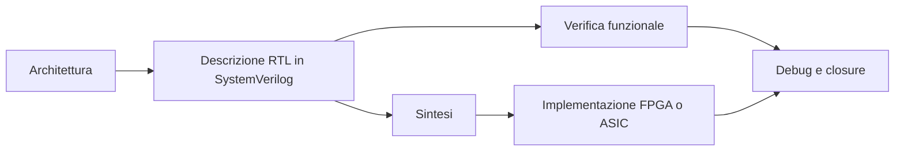
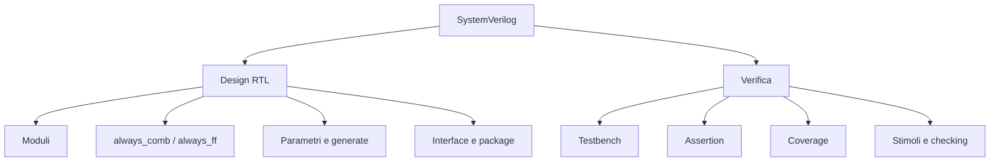

# SystemVerilog

SystemVerilog è oggi uno dei linguaggi di riferimento per la descrizione, la progettazione e la verifica dei sistemi digitali. Nasce come estensione di Verilog, ma nel tempo è diventato molto più di un semplice linguaggio HDL: è uno strumento che collega in modo diretto la modellazione architetturale, la descrizione RTL, la verifica funzionale e, in molti contesti, anche l'integrazione con flussi ASIC, FPGA e SoC.

Nel contesto della microelettronica moderna, SystemVerilog occupa una posizione centrale perché consente di descrivere il comportamento e la struttura di un progetto a diversi livelli di astrazione. Da un lato permette di scrivere moduli sintetizzabili destinati all'implementazione fisica o su dispositivo; dall'altro offre costrutti avanzati per la verifica, la generazione di stimoli, il controllo delle interfacce e l'osservazione del comportamento del design.

Questa sezione introduce SystemVerilog in modo progressivo e coerente con il resto della documentazione. L'obiettivo non è presentare un manuale esaustivo del linguaggio, ma costruire una visione progettuale chiara: capire dove SystemVerilog si colloca nel flusso di sviluppo, quali costrutti sono davvero rilevanti per il design RTL, come si collega alla verifica e quali buone pratiche aiutano a scrivere descrizioni corrette, leggibili e implementabili.

## 1. Perché una sezione dedicata a SystemVerilog

Nelle sezioni dedicate ad ASIC, FPGA e SoC è emerso più volte che il linguaggio RTL non è un semplice dettaglio di codifica. Il modo in cui un progetto viene descritto influenza direttamente:

- la chiarezza dell'architettura
- la qualità della sintesi
- la robustezza della verifica
- la leggibilità del codice nel tempo
- la facilità di integrazione tra blocchi diversi

SystemVerilog è importante proprio perché rende espliciti molti concetti che in Verilog classico erano più deboli o lasciati alla disciplina del progettista. Tipi logici più espressivi, costrutti procedurali meglio definiti, interfacce, package, assertion e strumenti per la verifica permettono di costruire design più ordinati e ambienti di test più solidi.

In un progetto reale, questo significa ridurre ambiguità, migliorare la manutenibilità e aumentare la probabilità che il comportamento simulato coincida con ciò che sarà realmente sintetizzato e implementato.

## 2. Il ruolo di SystemVerilog nel flusso di progetto

SystemVerilog si colloca in un punto di snodo tra intenzione progettuale e realizzazione concreta. Non è soltanto il linguaggio con cui si scrive un modulo, ma anche il mezzo attraverso cui si definiscono interfacce, si strutturano gerarchie e si costruisce il contesto di verifica.

### 2.1 Dall'idea architetturale alla RTL

Ogni progetto digitale parte da requisiti funzionali e vincoli di sistema. Questi requisiti vengono trasformati in una microarchitettura fatta di datapath, controlli, memorie, pipeline, clock domain e protocolli di comunicazione. SystemVerilog è il linguaggio con cui questa microarchitettura viene resa esplicita in forma RTL.

La qualità della descrizione RTL è cruciale: una RTL poco chiara rende più difficile sia la sintesi sia la verifica. Al contrario, una RTL ben organizzata aiuta a mantenere allineati i livelli di astrazione:

- l'architettura definisce cosa deve esistere
- la RTL descrive come tali blocchi vengono realizzati
- il timing verifica se la struttura è compatibile con la frequenza richiesta
- la verifica controlla che il comportamento sia corretto
- l'implementazione mostra il costo reale in area, risorse e prestazioni

### 2.2 Nel contesto FPGA

Nel mondo FPGA, SystemVerilog viene usato soprattutto per la descrizione RTL sintetizzabile e per la verifica. In questo caso il linguaggio si collega direttamente ai temi già affrontati nella documentazione FPGA:

- uso efficiente delle risorse logiche e memoria
- rispetto dei vincoli temporali
- gestione dei clock e dei reset
- integrazione con IP e blocchi di sistema
- debug post-implementazione

Una descrizione SystemVerilog ben scritta aiuta il tool di sintesi e place-and-route a inferire correttamente registri, RAM, logica combinatoria e strutture pipelinate. In altre parole, il linguaggio non è neutro rispetto al risultato finale sul dispositivo.

### 2.3 Nel contesto ASIC

Nel flusso ASIC, SystemVerilog ha un impatto ancora più ampio. La RTL sintetizzabile alimenta una catena che comprende sintesi logica, DFT, floorplanning, place-and-route, clock tree synthesis, analisi statiche e signoff. In questo scenario diventano ancora più importanti:

- disciplina di codifica sintetizzabile
- controllo rigoroso dei reset e delle inizializzazioni
- evitamento di costrutti ambigui o non portabili
- attenzione agli effetti sul timing e sulla testabilità
- corrispondenza chiara tra intenzione microarchitetturale e struttura logica risultante

Per questo motivo, studiare SystemVerilog non significa solo imparare una sintassi, ma imparare a scrivere una RTL che sia coerente con il flusso fisico e verificabile fino al tape-out.

## 3. Cosa comprende davvero SystemVerilog

SystemVerilog include due anime principali, che in pratica convivono nello stesso ecosistema.

### 3.1 Linguaggio per il design RTL

La prima anima è quella di linguaggio hardware per il design sintetizzabile. Qui rientrano gli elementi usati per costruire moduli e gerarchie:

- definizione di moduli e porte
- tipi e segnali
- logica combinatoria e sequenziale
- parametri e generazione strutturale
- package e organizzazione del codice
- interfacce per collegare blocchi complessi

Questa parte interessa direttamente chi sviluppa datapath, controller, pipeline, bridge, periferiche o acceleratori.

### 3.2 Linguaggio per la verifica

La seconda anima è quella orientata alla verifica. SystemVerilog estende enormemente le possibilità di costruire testbench e ambienti di validazione:

- classi e oggetti
- randomizzazione vincolata
- mailbox, semaphore ed eventi
- assertion
- functional coverage
- interfacce di monitoraggio e controllo

In contesti industriali questi elementi sono spesso la base per metodologie più strutturate, come UVM, ma è utile comprenderli prima ancora di arrivare ai framework.

## 4. Obiettivi di questa sezione

Questa parte della documentazione è pensata per accompagnare il lettore da una comprensione generale del linguaggio fino ai suoi aspetti più utili nei flussi reali di sviluppo. L'idea non è separare il linguaggio dalla progettazione, ma mostrare continuamente il legame tra forma del codice e conseguenze sul progetto.

In particolare, la sezione SystemVerilog avrà quattro obiettivi principali.

### 4.1 Capire i costrutti fondamentali del linguaggio

Prima di scrivere una buona RTL bisogna avere chiari i concetti di base: differenza tra reti e variabili logiche, semantica dei blocchi procedurali, parametrizzazione, strutturazione gerarchica, pacchetti e interfacce.

### 4.2 Distinguere chiaramente ciò che è sintetizzabile da ciò che non lo è

Uno degli errori più comuni nei percorsi introduttivi è trattare tutti i costrutti del linguaggio come equivalenti. In realtà, esiste una differenza forte tra:

- descrizione orientata alla sintesi
- descrizione usata solo in simulazione
- costrutti pensati per il testbench o la verifica avanzata

Questa distinzione è essenziale soprattutto quando si lavora tra FPGA e ASIC, dove il confine tra modello e hardware reale deve essere sempre ben controllato.

### 4.3 Migliorare la qualità della RTL

Una buona pagina su SystemVerilog non deve limitarsi a dire quali keyword usare. Deve aiutare a capire come scrivere descrizioni:

- leggibili
- modulari
- verificabili
- prevedibili in sintesi
- robuste rispetto a evoluzioni del progetto

### 4.4 Collegare design e verifica

SystemVerilog è particolarmente utile perché riduce la distanza tra chi descrive il design e chi lo verifica. Anche in progetti piccoli, comprendere assertion, interfacce e struttura dei testbench aiuta a costruire un flusso più completo e meno fragile.

## 5. Temi principali della sezione

Per mantenere coerenza con le altre aree della documentazione, la sezione SystemVerilog sarà organizzata come un percorso progressivo. I temi naturali da trattare sono i seguenti.

### 5.1 Fondamenti del linguaggio

Qui rientrano sintassi di base, tipi, operatori, moduli, porte e organizzazione generale del codice. È il livello minimo per leggere e scrivere descrizioni hardware corrette.

### 5.2 Costrutti per la RTL sintetizzabile

Questa parte chiarisce come descrivere correttamente:

- logica combinatoria
- logica sequenziale
- registri e pipeline
- FSM
- mux, decoder e datapath
- reset e gestione del clock

Il collegamento con timing e sintesi sarà costante, perché ogni costrutto RTL ha implicazioni concrete sul risultato implementato.

### 5.3 Parametrizzazione, package e interfacce

Questi elementi diventano fondamentali quando il progetto cresce. Consentono di evitare duplicazioni, definire tipi condivisi, standardizzare le connessioni tra blocchi e rendere la gerarchia più pulita.

### 5.4 Assertion e verifica di base

Un aspetto distintivo di SystemVerilog è la possibilità di inserire proprietà e controlli direttamente accanto alla descrizione del design o all'interno del testbench. Questo aiuta a intercettare errori di protocollo, violazioni temporali e ipotesi architetturali non rispettate.

### 5.5 Testbench e metodologie di verifica

Anche senza entrare subito nei framework industriali più completi, è importante comprendere come si struttura un ambiente di verifica, come si generano stimoli, come si osserva il comportamento del DUT e come si misura la copertura.

## 6. Collegamenti con SoC, FPGA e ASIC

Una sezione SystemVerilog ha valore soprattutto se non resta isolata.

### 6.1 Collegamento con SoC

Nel contesto SoC, SystemVerilog è il linguaggio con cui si descrivono blocchi che poi vengono integrati in un sistema più ampio. Questo significa che il codice deve essere pensato non solo per funzionare localmente, ma anche per:

- rispettare interfacce e protocolli
- essere riutilizzabile
- convivere con bus, memorie, periferiche e clock domain differenti
- essere verificabile sia a livello di blocco sia a livello di sottosistema

### 6.2 Collegamento con FPGA

Nel contesto FPGA, SystemVerilog è spesso la forma concreta con cui una scelta architetturale viene tradotta in risorse del dispositivo. Una pipeline, una RAM o un'interfaccia streaming non sono solo concetti: diventano LUT, flip-flop, BRAM, DSP e reti di routing. Per questo la qualità della descrizione influenza direttamente frequenza massima, occupazione di area e facilità di debug.

### 6.3 Collegamento con ASIC

Nel contesto ASIC, la disciplina RTL assume un peso ancora maggiore. Una scelta di codifica apparentemente locale può influenzare:

- inferenza della logica in sintesi
- controllabilità e osservabilità per DFT
- struttura del clocking
- robustezza ai corner temporali
- semplicità del floorplanning e della chiusura fisica

Studiare SystemVerilog in ottica ASIC significa quindi ragionare sempre con consapevolezza di sintesi, timing, verifica e implementazione fisica fino al signoff.

## 7. Come leggere questa sezione

Per ottenere il massimo da questa documentazione, conviene leggere le pagine in modo progressivo. Alcuni argomenti possono sembrare puramente sintattici, ma in realtà diventano importanti solo quando si osservano i loro effetti nel flusso reale.

Per esempio:

- la scelta tra diversi blocchi procedurali non è solo stilistica, ma influenza chiarezza e correttezza della RTL
- la definizione dei tipi aiuta a prevenire errori e a documentare l'intenzione progettuale
- le interfacce migliorano la scalabilità dei sistemi complessi
- le assertion rendono verificabili ipotesi che altrimenti resterebbero implicite

L'idea di fondo è trattare SystemVerilog come linguaggio di progetto e non come collezione di keyword.

## 8. In sintesi

SystemVerilog è una tecnologia trasversale alla moderna progettazione digitale. Consente di scrivere RTL sintetizzabile, strutturare design complessi, definire interfacce più pulite e costruire ambienti di verifica molto più espressivi rispetto al Verilog tradizionale.

Nel quadro complessivo della microelettronica, il suo valore sta nella capacità di unire mondi che spesso vengono studiati separatamente: architettura, descrizione RTL, verifica funzionale, timing e implementazione. Per questo una sezione dedicata a SystemVerilog è un'estensione naturale delle parti già sviluppate su SoC, ASIC e FPGA.

L'obiettivo delle prossime pagine sarà trasformare questa visione generale in una comprensione operativa: quali costrutti usare, come usarli correttamente e quali conseguenze hanno sul progetto reale.

## Prossimo passo

Il prossimo file più naturale è `language-basics.md`, dedicato ai fondamenti del linguaggio: moduli, porte, tipi, operatori, blocchi procedurali e organizzazione generale del codice. È la base necessaria per costruire poi le pagine su RTL sintetizzabile, interfacce, assertion e verifica.
