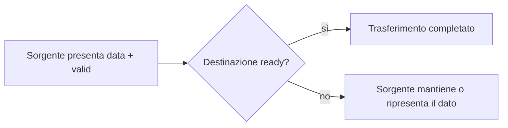

# Interfacce e handshake

Dopo aver introdotto **datapath**, **controllo** e **pipeline**, il passo successivo naturale è capire come i blocchi hardware comunicano tra loro in modo ordinato. In un progetto reale, infatti, un modulo non vive quasi mai isolato: deve ricevere dati, restituire risultati, coordinarsi con altri blocchi, rispettare il timing del sistema e gestire condizioni in cui una parte è pronta mentre un’altra non lo è ancora.

Questa esigenza porta al tema delle **interfacce** e dei **meccanismi di handshake**. In SystemVerilog e nella progettazione RTL in generale, questi concetti sono fondamentali perché definiscono:
- come un dato entra o esce da un modulo;
- quando quel dato è valido;
- quando il blocco ricevente è pronto;
- come si evita la perdita di dati;
- come si gestisce il backpressure;
- come si coordinano blocchi con latenza o throughput differenti.

Dal punto di vista metodologico, interfacce e handshake sono uno dei punti in cui si incontrano in modo diretto:
- architettura;
- RTL;
- timing;
- verifica;
- integrazione di sistema;
- implementazione FPGA e ASIC.

## 1. Che cosa si intende per interfaccia

Un’interfaccia è l’insieme dei segnali attraverso cui un blocco hardware comunica con l’esterno. Questi segnali non trasportano solo dati, ma anche informazioni di controllo e sincronizzazione.

### 1.1 Componenti tipiche di un’interfaccia
Un’interfaccia può includere:
- bus dati;
- segnali di validità;
- segnali di disponibilità;
- comandi di avvio;
- segnali di completamento;
- informazioni di errore;
- tag o metadati associati al trasferimento.

### 1.2 Interfaccia come contratto
Dal punto di vista architetturale, l’interfaccia è un **contratto** tra moduli. Definisce:
- chi produce il dato;
- chi lo consuma;
- quando il trasferimento è considerato avvenuto;
- quali condizioni devono essere rispettate;
- come si gestiscono attese e blocchi.

### 1.3 Perché è importante
Una buona interfaccia:
- rende il blocco più integrabile;
- riduce ambiguità nella progettazione RTL;
- facilita la verifica;
- semplifica la manutenzione e il riuso;
- rende più prevedibile il comportamento temporale del sistema.

## 2. Che cos’è un handshake

Un **handshake** è un meccanismo di coordinamento tra due blocchi che permette di stabilire in modo esplicito **quando un trasferimento o un’operazione sono validi**.

### 2.1 Obiettivo dell’handshake
L’handshake serve a evitare ipotesi implicite del tipo:
- il destinatario è sempre pronto;
- il dato sarà sempre accettato nello stesso ciclo;
- il risultato arriverà sempre con una latenza fissa e immediata.

### 2.2 Quando serve
Serve in particolare quando:
- il produttore e il consumatore non avanzano sempre allo stesso ritmo;
- il blocco ha latenza interna;
- esistono pipeline;
- il sistema può generare backpressure;
- il completamento di un’operazione richiede più cicli.

### 2.3 Effetto progettuale
L’handshake rende il comportamento dell’interfaccia esplicito e quindi più robusto:
- in simulazione;
- in integrazione tra moduli;
- nella verifica;
- nella gestione di casi limite.

## 3. Interfacce dati e interfacce di controllo

Non tutte le interfacce svolgono la stessa funzione. È utile distinguere almeno due grandi categorie.

### 3.1 Interfacce dati
Trasportano uno o più valori che devono essere elaborati, memorizzati o inoltrati.

### 3.2 Interfacce di controllo
Trasportano informazioni sullo stato del trasferimento o sull’avvio/completamento di un’operazione.

### 3.3 Interfacce miste
Nella pratica, la maggior parte delle interfacce reali combina entrambe le dimensioni:
- dato;
- validità del dato;
- disponibilità alla ricezione;
- segnali di inizio e fine;
- eventuali errori o condizioni speciali.

Questa combinazione è uno dei motivi per cui la progettazione delle interfacce richiede attenzione architetturale, non solo sintattica.

## 4. Il modello `valid` / `ready`

Uno dei meccanismi di handshake più diffusi nella progettazione RTL moderna è il modello basato sui segnali **`valid`** e **`ready`**.

### 4.1 Significato di `valid`
`valid` indica che il blocco sorgente sta presentando un dato significativo e che quel dato può essere trasferito se l’altro lato è pronto.

### 4.2 Significato di `ready`
`ready` indica che il blocco ricevente è pronto ad accettare il dato in quel ciclo.

### 4.3 Quando avviene il trasferimento
Il trasferimento è considerato avvenuto quando:
- il dato è presente;
- `valid` è attivo;
- `ready` è attivo;
- il tutto accade nello stesso ciclo utile.

### 4.4 Perché è così utile
Questo modello è molto potente perché:
- disaccoppia produttore e consumatore;
- gestisce in modo naturale il backpressure;
- si integra bene con pipeline e buffering;
- rende esplicito il momento del trasferimento.

## 5. Il modello `start` / `done`

Un altro schema molto comune è quello basato sui segnali **`start`** e **`done`**. È particolarmente usato in blocchi che eseguono un’operazione con durata interna non nulla.

### 5.1 Significato di `start`
`start` indica che il modulo deve iniziare una nuova operazione.

### 5.2 Significato di `done`
`done` indica che l’operazione è stata completata e che l’output è disponibile o stabile.

### 5.3 Dove è utile
Questo modello è adatto soprattutto a:
- acceleratori;
- unità iterative;
- blocchi multi-ciclo;
- controller con comportamento a transazione;
- moduli in cui il dato non scorre in modo continuo ma per richieste discrete.

### 5.4 Differenza rispetto a `valid` / `ready`
`start` / `done` tende a rappresentare una **transazione o operazione**, mentre `valid` / `ready` rappresenta più naturalmente un **canale di trasferimento**.

## 6. Handshake e latenza

L’handshake è strettamente legato al concetto di latenza.

### 6.1 Latenza fissa
Se un blocco ha latenza fissa, l’interfaccia può essere relativamente semplice, ma resta comunque utile esplicitare:
- quando l’ingresso è stato accettato;
- quando il risultato può essere considerato valido.

### 6.2 Latenza variabile
Se la latenza dipende dal dato o dallo stato interno, l’handshake diventa ancora più importante perché impedisce di assumere tempi costanti non garantiti.

### 6.3 Impatto sulla progettazione
Una buona interfaccia deve chiarire:
- se il blocco accetta un nuovo dato ogni ciclo o no;
- quanto spesso può produrre risultati;
- se può essere bloccato;
- se può segnalare completamento in modo asincrono rispetto alla richiesta iniziale.

## 7. Handshake e throughput

Oltre alla latenza, l’handshake influenza anche il throughput.

### 7.1 Moduli che accettano dati continuamente
Un blocco con interfaccia `valid` / `ready` ben progettata può accettare dati a ritmo elevato, anche uno per ciclo, se entrambe le parti lo supportano.

### 7.2 Moduli che lavorano a transazioni
Un blocco con `start` / `done` può avere un throughput più basso se non accetta una nuova operazione prima di aver completato la precedente.

### 7.3 Importanza architetturale
Questa differenza è importante perché il protocollo scelto influenza:
- parallelismo del sistema;
- buffering richiesto;
- prestazioni complessive;
- facilità di pipeline.

## 8. Backpressure

Uno dei concetti più importanti nelle interfacce con handshake è il **backpressure**.

### 8.1 Che cos’è
Il backpressure è la condizione in cui il blocco ricevente non può accettare nuovi dati e quindi deve rallentare o fermare il blocco sorgente.

### 8.2 Perché esiste
Può verificarsi quando:
- un buffer è pieno;
- una pipeline è in stallo;
- una risorsa interna è occupata;
- il modulo successivo non ha ancora consumato il dato precedente.

### 8.3 Come si manifesta
Nel modello `valid` / `ready`, il backpressure si manifesta tipicamente come:
- `valid` alto dal lato sorgente;
- `ready` basso dal lato ricevente.

### 8.4 Effetti progettuali
Gestire bene il backpressure significa:
- non perdere dati;
- non duplicare trasferimenti;
- mantenere coerenza temporale;
- evitare deadlock o stalli non gestiti.

## 9. Interfacce e pipeline

Le pipeline rendono ancora più importante il progetto corretto delle interfacce.

### 9.1 Dati in volo
In una pipeline, dati e controllo si muovono contemporaneamente in più stadi.

### 9.2 Validità del dato
Occorre sapere per ogni stadio:
- se contiene un dato valido;
- se può avanzare;
- se deve fermarsi;
- se il suo contenuto va invalidato.

### 9.3 Propagazione del controllo
L’handshake tra stadi di pipeline può essere locale oppure distribuito, ma in ogni caso deve mantenere allineati:
- dato;
- segnali di validità;
- segnali di disponibilità;
- eventuali condizioni di flush o stall.

### 9.4 Impatto sistemico
Per questo motivo, le interfacce non sono solo “porte del modulo”: sono parte integrante del comportamento temporale della pipeline.

## 10. Interfacce, datapath e controllo

Le interfacce sono il punto in cui **datapath** e **controllo** si incontrano in modo più evidente.

### 10.1 Lato datapath
Il datapath gestisce:
- i bus dati;
- le trasformazioni;
- gli eventuali registri di buffering.

### 10.2 Lato controllo
Il controllo gestisce:
- validità;
- disponibilità;
- inizio operazione;
- completamento;
- stall;
- flush;
- sequenze di attesa.

### 10.3 Integrazione
Una buona interfaccia richiede che queste due dimensioni siano progettate insieme. Non basta definire il bus dati: bisogna anche chiarire il comportamento temporale del trasferimento.

## 11. Significato temporale del trasferimento

Uno dei punti più importanti nella progettazione di handshake è definire con precisione **quando** un trasferimento viene considerato avvenuto.

### 11.1 Trasferimento osservabile
Deve essere chiaro in quale ciclo:
- il dato è stato accettato;
- il dato può cambiare;
- il destinatario può campionarlo;
- il sorgente può considerare conclusa la fase di trasmissione.

### 11.2 Evitare ambiguità
Senza una definizione chiara, si rischiano errori come:
- dati persi;
- dati duplicati;
- campionamento prematuro;
- incoerenza tra simulazione e comportamento atteso.

### 11.3 Necessità metodologica
Per questo motivo, il protocollo dell’interfaccia deve essere pensato come parte integrante della specifica del blocco.

## 12. Effetti sulla verifica

Interfacce e handshake hanno un impatto molto forte sulla verifica.

### 12.1 Verifica del protocollo
Bisogna verificare che:
- il dato non venga considerato trasferito senza condizioni corrette;
- `valid` e `ready` siano usati coerentemente;
- `start` e `done` rispettino la semantica definita;
- il modulo reagisca correttamente a backpressure e stallo.

### 12.2 Verifica dei casi limite
Sono particolarmente importanti i casi come:
- ricevente non pronto per molti cicli;
- sorgente che mantiene il dato;
- blocco che riceve richieste ravvicinate;
- flush o reset durante una transazione.

### 12.3 Assertion e coverage
Le interfacce si prestano molto bene a:
- assertion di protocollo;
- controlli di stabilità del dato;
- coverage di trasferimenti accettati e respinti;
- verifica di assenza di deadlock.

### 12.4 Debug
Un’interfaccia ben progettata rende le waveform molto più leggibili, perché è chiaro:
- quando il dato è valido;
- quando viene accettato;
- quando il modulo è bloccato;
- quando una transazione è conclusa.

## 13. Effetti sul timing

Le interfacce non sono neutre dal punto di vista del timing.

### 13.1 Fanout dei segnali di controllo
Segnali come `ready`, `valid`, `stall` o `done` possono avere fanout elevato e incidere sui percorsi critici.

### 13.2 Dipendenze combinatorie
Se il protocollo introduce dipendenze combinatorie troppo lunghe tra moduli, il timing closure può complicarsi.

### 13.3 Registrazione delle interfacce
In molti casi, registrare opportunamente dati e controllo:
- migliora il timing;
- rende il protocollo più robusto;
- semplifica l’integrazione tra blocchi.

### 13.4 Collegamento con pipeline
In sistemi fortemente pipelined, le interfacce diventano parte del percorso temporale globale e devono essere pensate con la stessa cura del datapath interno.

## 14. Effetti su implementazione FPGA e ASIC

Le scelte di interfaccia si riflettono anche sul target fisico.

### 14.1 Su FPGA
Su FPGA:
- le interfacce influenzano placement e routing;
- il backpressure combinatorio può diventare critico;
- la registrazione dei confini di modulo è spesso utile per il timing;
- i segnali di validità e disponibilità vanno progettati con attenzione per non introdurre percorsi troppo lunghi.

### 14.2 Su ASIC
Su ASIC, le interfacce incidono su:
- sintesi dei segnali di controllo;
- fanout;
- buffering;
- floorplanning di blocchi comunicanti;
- CTS e chiusura del timing tra moduli.

### 14.3 Visione di sistema
Una buona interfaccia non è solo elegante a livello RTL: aiuta anche il progetto fisico a rimanere ordinato e prevedibile.

## 15. Errori comuni

Alcuni errori nelle interfacce e negli handshake sono molto ricorrenti.

### 15.1 Assumere che il ricevente sia sempre pronto
Questo rende il blocco fragile in integrazione.

### 15.2 Non definire chiaramente il momento del trasferimento
Può produrre dati persi o duplicati.

### 15.3 Dato e controllo disallineati
Il dato può arrivare corretto ma con `valid`, `done` o altri segnali non coerenti.

### 15.4 Gestione incompleta del backpressure
Questo può causare stalli o comportamenti non deterministici.

### 15.5 Protocollo non verificato
Un’interfaccia apparentemente semplice può nascondere bug sottili se non viene verificata esplicitamente.

## 16. Buone pratiche di modellazione

Per progettare interfacce robuste in SystemVerilog RTL, alcune pratiche sono particolarmente efficaci.

### 16.1 Definire il protocollo in modo esplicito
Bisogna chiarire:
- chi guida ciascun segnale;
- quando il trasferimento è valido;
- come si comportano i moduli in attesa;
- come si gestisce il backpressure.

### 16.2 Separare dato e controllo, ma mantenerli coerenti
I ruoli devono essere distinti, ma il loro allineamento temporale deve restare sempre chiaro.

### 16.3 Pensare all’integrazione
L’interfaccia va progettata non solo per il modulo isolato, ma per il sistema in cui verrà inserita.

### 16.4 Pensare alla verifica
Ogni protocollo dovrebbe essere abbastanza chiaro da poter essere verificato con assertion e casi limite ben definiti.

### 16.5 Pensare al timing
Interfacce e handshake devono essere compatibili con la frequenza target e con l’implementazione fisica del sistema.

## 17. Collegamento con il resto della sezione

Questa pagina si collega direttamente ai temi precedenti:
- **`datapath-and-control.md`** ha mostrato come il controllo coordini il percorso dati;
- **`pipelining.md`** ha evidenziato l’importanza di `valid`, `stall` e flusso temporale;
- **`fsm.md`** ha introdotto l’uso di controllo e segnali di avanzamento nel tempo;
- qui questi concetti vengono portati sul confine tra moduli, cioè nel punto in cui l’integrazione diventa concreta.

Interfacce e handshake sono quindi una naturale estensione della progettazione RTL dal singolo blocco al sistema composto da più blocchi cooperanti.

## 18. In sintesi

Le interfacce e i meccanismi di handshake sono fondamentali per costruire sistemi hardware modulari, robusti e integrabili. Non si limitano a trasportare dati, ma definiscono anche il significato temporale del trasferimento e il modo in cui i moduli coordinano la loro attività.

Modelli come `valid` / `ready` e `start` / `done` permettono di:
- gestire latenza e throughput;
- evitare perdite di dati;
- supportare pipeline e backpressure;
- migliorare la verificabilità del sistema;
- rendere più robusta l’integrazione tra blocchi.

Per questo, progettare bene un’interfaccia significa fare un passo decisivo verso una RTL più matura, più riusabile e più adatta ai vincoli reali di FPGA, ASIC e sistemi complessi.

## Prossimo passo

Il passo più naturale ora è **`latency-and-throughput.md`**, perché permette di isolare e approfondire in modo sistematico il compromesso tra:
- tempo di risposta;
- frequenza di accettazione dei dati;
- capacità di pipeline;
- buffering;
- prestazioni di sistema.

In alternativa, un altro passo molto naturale è **`systemverilog-interfaces.md`**, se vuoi passare dal concetto architetturale di interfaccia all’uso specifico del costrutto `interface` di SystemVerilog.
