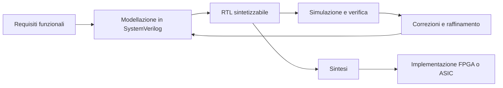
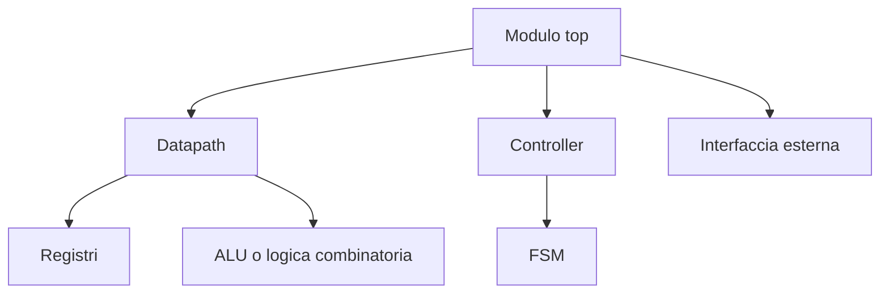
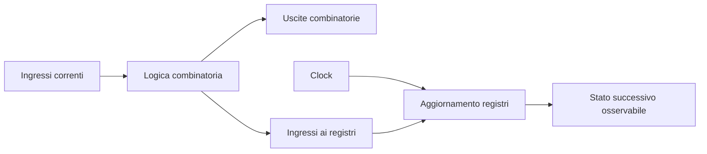
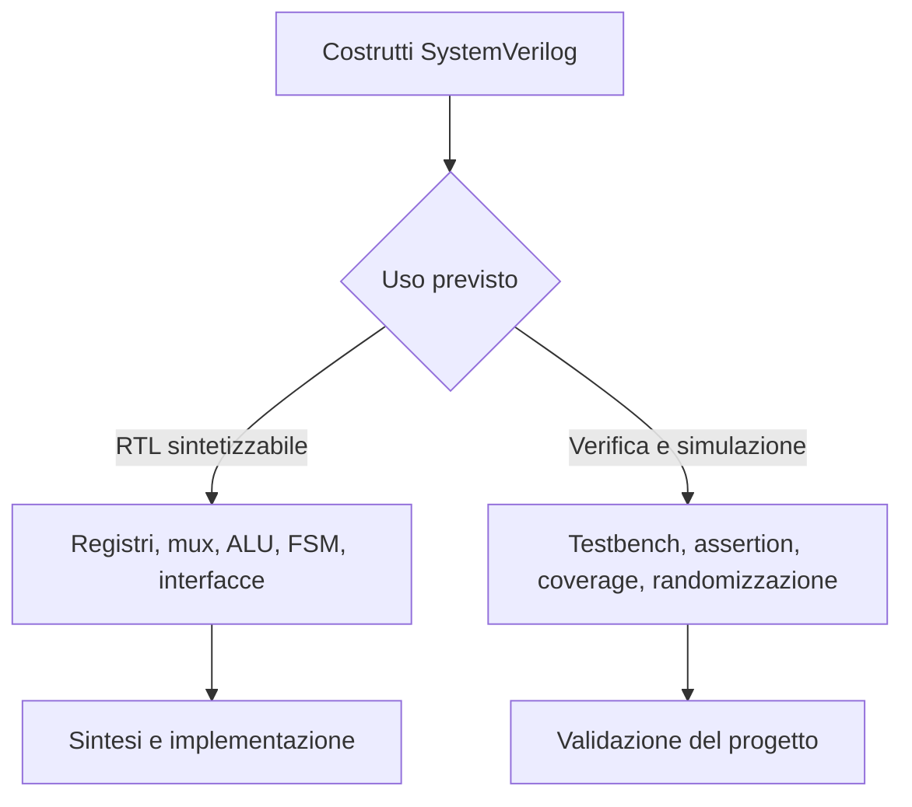

# Fondamenti del linguaggio SystemVerilog

SystemVerilog è un linguaggio ampio, nato come estensione di Verilog, che oggi viene usato in due direzioni principali: da un lato per la **descrizione hardware RTL**, dall’altro per la **verifica** di sistemi digitali complessi. In una documentazione orientata a microelettronica e progettazione digitale, è importante trattarlo prima di tutto come strumento per rappresentare in modo chiaro e rigoroso il comportamento e la struttura di un circuito.

Nel contesto di un progetto reale, SystemVerilog non è semplicemente una sintassi più moderna di Verilog. Le sue primitive di tipizzazione, i costrutti procedurali, la distinzione tra logica combinatoria e sequenziale, e la possibilità di organizzare meglio le interfacce rendono il codice più leggibile, più verificabile e più robusto rispetto agli errori di modellazione. Questo è particolarmente rilevante sia nei flussi **FPGA**, dove il ciclo iterativo è rapido e il debug è frequente, sia nei flussi **ASIC**, dove la qualità della RTL incide direttamente su sintesi, timing, DFT e implementazione fisica.

Questa pagina introduce gli elementi fondamentali del linguaggio dal punto di vista progettuale: non come elenco esaustivo di costrutti, ma come base per scrivere RTL corretta, comprensibile e coerente con il resto del flusso di sviluppo.

## 1. Il ruolo di SystemVerilog nella progettazione digitale

Quando si parla di SystemVerilog in ambito hardware, è utile distinguere subito tre livelli concettuali.

Il primo è il livello **strutturale**, in cui il progetto è descritto come composizione di moduli e connessioni. Qui il linguaggio serve a rappresentare blocchi funzionali, gerarchie e interfacce.

Il secondo è il livello **comportamentale RTL**, in cui si descrive come i registri si aggiornano a ogni fronte di clock e come la logica combinatoria elabora gli ingressi. Questo è il livello centrale per la sintesi.

Il terzo è il livello **di verifica**, in cui SystemVerilog offre costrutti aggiuntivi per testbench, assertion, randomizzazione e copertura. Sebbene questa pagina sia focalizzata soprattutto sulle basi del linguaggio per la progettazione RTL, è importante ricordare che la stessa famiglia linguistica copre entrambe le esigenze.

In pratica, SystemVerilog diventa il punto di contatto tra:
- **architettura**, perché traduce i blocchi concettuali in moduli concreti
- **RTL**, perché formalizza datapath, controllo e interfacce
- **timing**, perché la separazione tra combinatorio e sequenziale influenza direttamente la chiusura temporale
- **verifica**, perché consente simulazione, controlli e proprietà formali
- **implementazione**, perché la qualità della descrizione condiziona sintesi, mapping e PnR

## 2. Moduli, porte e gerarchia

L’unità di base di una descrizione hardware in SystemVerilog è il **modulo**. Un modulo rappresenta un blocco funzionale con un insieme di porte di ingresso e uscita, e può contenere sia logica interna sia istanze di altri moduli.

Dal punto di vista progettuale, il modulo è l’elemento che collega l’idea architetturale alla realizzazione RTL. Una buona decomposizione in moduli migliora la leggibilità del progetto, favorisce il riuso e semplifica la verifica.

### 2.1 Interfaccia del modulo

L’interfaccia definisce ciò che il blocco espone verso l’esterno. In una buona progettazione, le porte devono riflettere chiaramente il ruolo del blocco: dati, segnali di controllo, clock, reset, handshake e stati osservabili.

In SystemVerilog, la dichiarazione delle porte è più espressiva rispetto a Verilog tradizionale, perché permette di specificare direttamente il tipo e la direzione in modo più pulito.

### 2.2 Gerarchia del progetto

I sistemi digitali reali non vengono costruiti come un unico blocco monolitico. La gerarchia permette di suddividere il progetto in sottoblocchi con responsabilità precise. Questa organizzazione ha diversi vantaggi:

- rende l’architettura più comprensibile
- facilita il debug e la simulazione modulare
- favorisce la separazione tra controllo e datapath
- consente di riutilizzare blocchi in progetti diversi
- permette vincoli e analisi più ordinati nei flussi FPGA e ASIC

In un progetto **FPGA**, una gerarchia chiara aiuta a correlare la RTL con le risorse del dispositivo e con il risultato del place and route. In un progetto **ASIC**, la gerarchia è utile anche per sintesi gerarchica, floorplanning, partizionamento e strategie di integrazione.

## 3. Tipi di dati e rappresentazione del segnale

Uno degli aspetti che distingue SystemVerilog da Verilog classico è la presenza di una tipizzazione più moderna e più rigorosa. Questo migliora la qualità del codice e riduce ambiguità che, in hardware, possono tradursi in errori funzionali o in mismatch tra simulazione e sintesi.

### 3.1 Il tipo `logic`

Per la maggior parte della RTL sintetizzabile, il tipo più usato è **`logic`**. Dal punto di vista pratico, `logic` rappresenta un segnale a quattro stati ed è il sostituto naturale della distinzione storica tra `wire` e `reg` in molti casi comuni.

L’uso di `logic` aiuta a scrivere codice più uniforme. Tuttavia, è importante ricordare che la natura fisica del segnale dipende ancora da **come viene pilotato**:
- se è assegnato in modo continuo, si comporta come una connessione combinatoria
- se è assegnato in un blocco sequenziale, rappresenta tipicamente un registro

Il tipo non sostituisce quindi il significato architetturale del segnale, ma rende più chiara la sua dichiarazione.

### 3.2 Vettori e larghezza dei dati

La progettazione digitale lavora quasi sempre con bus multi-bit. Per questo la larghezza dei segnali è un aspetto centrale. Un dato a 8 bit, un indirizzo a 32 bit o una word a 128 bit non sono semplici dettagli sintattici: influiscono su area, timing, throughput e interfacciamento.

In SystemVerilog i vettori possono rappresentare:
- bus dati
- indirizzi
- campi di controllo
- maschere
- codifiche di stato

Una buona pratica consiste nel dichiarare larghezze in modo coerente con l’architettura, evitando costanti “magiche” sparse nel codice. Questo rende il progetto più parametrico e meno fragile alle modifiche.

### 3.3 Array, packed e unpacked

SystemVerilog distingue in modo più preciso tra diversi tipi di aggregati. Dal punto di vista concettuale:
- un **packed array** rappresenta una parola di bit trattata come un vettore compatto
- un **unpacked array** rappresenta una collezione di elementi separati

Questa distinzione diventa importante quando si modellano memorie, matrici di registri, buffer e interfacce complesse. Comprendere la differenza evita errori di indicizzazione e chiarisce come il dato viene interpretato dalla sintesi e dalla simulazione.

### 3.4 `enum`, `struct` e `typedef`

SystemVerilog introduce costrutti molto utili per descrivere strutture complesse in modo più leggibile.

Gli **enumerated type** (`enum`) sono particolarmente adatti per rappresentare stati di una FSM o codifiche simboliche. Invece di usare valori numerici poco leggibili, è possibile associare un nome ai diversi stati logici del controllo.

Le **struct** permettono di raggruppare campi correlati, per esempio quando si vuole descrivere un pacchetto di segnali che viaggiano insieme in una pipeline o in un’interfaccia interna.

Il costrutto **`typedef`** consente di definire alias di tipo, utile per evitare ripetizioni e standardizzare la rappresentazione di bus, stati, indirizzi o record.

Questi strumenti non cambiano solo l’estetica del codice: aiutano a mantenere la corrispondenza tra la rappresentazione RTL e l’intenzione architetturale.

## 4. Assegnamenti e logica combinatoria

La logica combinatoria rappresenta la parte del circuito in cui le uscite dipendono soltanto dagli ingressi attuali. In RTL, questa porzione deve essere descritta con particolare attenzione, perché è direttamente collegata a ritardi logici, profondità critica e chiusura temporale.

### 4.1 Assegnamento continuo

L’assegnamento continuo descrive una relazione combinatoria permanente tra segnali. È una forma naturale per esprimere collegamenti semplici, mux elementari, operazioni aritmetiche immediate o wiring tra blocchi.

Dal punto di vista progettuale, è utile per esprimere logica semplice e direttamente osservabile. Quando la complessità cresce, può essere preferibile passare a un blocco combinatorio esplicito per migliorare leggibilità e controllo.

### 4.2 Blocco `always_comb`

Il costrutto **`always_comb`** è pensato per modellare logica combinatoria in modo esplicito e sicuro. È preferibile al vecchio `always @(*)` perché esprime meglio l’intenzione del progettista e impone regole più rigorose.

Usarlo correttamente significa:
- assegnare sempre un valore alle uscite in ogni cammino logico
- evitare dipendenze implicite o memoria accidentale
- mantenere una separazione chiara dalla logica sequenziale

Se in un blocco combinatorio non vengono coperte tutte le condizioni, il rischio è inferire **latch** indesiderati. Questo è quasi sempre un problema, sia in FPGA sia in ASIC, perché complica timing, verifica e implementazione.

### 4.3 Espressioni e operatori

SystemVerilog mette a disposizione operatori aritmetici, logici, bitwise, relazionali e di riduzione. Il loro impiego deve però essere guidato dal significato hardware.

Un’operazione apparentemente semplice a livello sintattico può tradursi in:
- una rete combinatoria ridotta
- un comparatore largo
- una catena di propagazione del carry
- un albero di riduzione
- una struttura critica per il timing

Per questo motivo, nella scrittura RTL è importante non fermarsi al “cosa” dell’espressione, ma considerare anche il “come” verrà implementata.

## 5. Logica sequenziale e registri

La logica sequenziale è il cuore della RTL sincronizzata. Qui SystemVerilog descrive il comportamento dei registri, cioè degli elementi che memorizzano stato e che separano temporalmente le varie fasi di elaborazione.

### 5.1 Il blocco `always_ff`

Il costrutto **`always_ff`** è usato per descrivere logica sequenziale sincrona. Il suo scopo è rendere esplicito che il blocco rappresenta aggiornamento di registri, tipicamente al fronte di clock e, se necessario, con reset associato.

Questo costrutto migliora la leggibilità e riduce l’ambiguità del codice. In un progetto ben organizzato, la distinzione è netta:
- `always_ff` per i registri
- `always_comb` per la logica combinatoria
- eventuali assegnamenti continui per collegamenti semplici

Questa separazione è importante non solo per chiarezza, ma anche per strumenti di analisi, linting, simulazione e sintesi.

### 5.2 Clock e reset

Clock e reset non sono semplici segnali di servizio. Definiscono il comportamento temporale dell’intero sistema. La loro modellazione in SystemVerilog deve essere coerente con l’architettura e con la destinazione implementativa.

Un reset può essere:
- **sincrono**, se campionato al clock
- **asincrono**, se agisce indipendentemente dal fronte di clock

La scelta ha conseguenze concrete su robustezza, timing, strategia di rilascio del reset e integrazione fisica. In FPGA, alcune famiglie e tool favoriscono specifici stili di reset. In ASIC, la scelta è influenzata anche da librerie standard cell, DFT, distribuzione del reset e signoff.

### 5.3 Non-blocking assignment

Nella logica sequenziale, l’assegnamento non bloccante è il modello concettualmente corretto per rappresentare l’aggiornamento simultaneo dei registri al fronte di clock. Questo aiuta a mantenere la corrispondenza tra simulazione RTL e comportamento dell’hardware reale.

Confondere assegnamenti bloccanti e non bloccanti può introdurre comportamenti non intuitivi, dipendenze artificiali e mismatch tra intenzione architetturale e simulazione.

## 6. Controllo del flusso e strutture procedurali

Oltre ai tipi e agli assegnamenti, SystemVerilog offre costrutti procedurali utili per descrivere decisioni, selezione di casi e iterazioni. Questi elementi devono essere usati con attenzione, perché ogni scelta sintattica si traduce in una struttura hardware specifica.

### 6.1 `if`, `case` e priorità logica

I costrutti condizionali sono fondamentali per descrivere mux, decodifiche e logica di controllo. Tuttavia, la forma con cui vengono scritti influenza la struttura del circuito.

Ad esempio, una catena di `if` può implicare una priorità, mentre un `case` ben definito esprime più chiaramente una selezione mutuamente esclusiva. In una FSM o in un decoder di controllo, questa distinzione è importante sia per leggibilità sia per qualità della sintesi.

SystemVerilog mette anche a disposizione forme come `unique` e `priority`, che permettono di esplicitare meglio l’intenzione del progettista e aiutano gli strumenti a rilevare situazioni anomale.

### 6.2 Cicli e generazione di hardware

I cicli come `for` non devono essere interpretati come in un linguaggio software tradizionale. In RTL sintetizzabile, un ciclo rappresenta tipicamente **replicazione strutturale** o descrizione regolare di logica.

Questo significa che un costrutto iterativo può generare:
- più assegnamenti in parallelo
- più istanze di logica simile
- strutture ripetitive di datapath o registri

La nozione di tempo di esecuzione, tipica del software, va quindi sostituita con una nozione di espansione strutturale in fase di elaborazione e sintesi.

### 6.3 `generate` e parametrizzazione

Il costrutto `generate` è particolarmente utile quando si vogliono creare architetture scalabili, condizionali o ripetitive. È un elemento importante per costruire blocchi riutilizzabili, soprattutto quando la stessa RTL deve adattarsi a larghezze di dato, numero di canali o configurazioni differenti.

La parametrizzazione è molto preziosa sia in FPGA sia in ASIC:
- in **FPGA** consente di adattare il progetto a famiglie diverse o a target con risorse differenti
- in **ASIC** permette di riusare IP e blocchi architetturali in diverse integrazioni o versioni del chip

## 7. Costanti, parametri e riuso

Una base solida di SystemVerilog non può prescindere da una corretta gestione delle costanti e dei parametri. Un progetto rigido, pieno di numeri fissati localmente, è difficile da mantenere e più incline agli errori.

I **parametri** consentono di definire moduli configurabili, mentre le costanti locali permettono di chiarire significati numerici che altrimenti resterebbero opachi.

Dal punto di vista metodologico, questa pratica migliora:
- riuso del codice
- coerenza dimensionale
- leggibilità dell’architettura
- facilità di manutenzione
- adattamento a varianti di implementazione

Per esempio, una stessa struttura parametrica può essere impiegata in una piattaforma di prototipazione FPGA e, con adeguate modifiche e vincoli, in un contesto ASIC più strutturato.

## 8. Dal linguaggio alla RTL sintetizzabile

Non tutto ciò che è esprimibile in SystemVerilog è automaticamente adatto alla sintesi. Questa distinzione è fondamentale. Il linguaggio comprende sia costrutti pensati per l’hardware sintetizzabile sia costrutti orientati alla simulazione o alla verifica.

Dal punto di vista progettuale, scrivere buona RTL significa usare SystemVerilog in modo disciplinato, con attenzione a:
- corrispondenza tra descrizione e hardware risultante
- prevedibilità della sintesi
- chiarezza temporale del comportamento
- assenza di ambiguità tra combinatorio e sequenziale
- facilità di verifica e debug

In un flusso **FPGA**, una RTL ben scritta porta a risultati più stabili in sintesi, placement, routing e debug on-chip. In un flusso **ASIC**, la qualità della RTL ha impatti ancora più ampi: influenza area, potenza, timing, testabilità, integrazione DFT, floorplanning e probabilità di chiusura al signoff.

## 9. Buone pratiche di base

Prima di passare a temi più avanzati, vale la pena fissare alcune pratiche fondamentali.

### 9.1 Separare chiaramente combinatorio e sequenziale

Una buona RTL rende evidente dove si genera il prossimo stato e dove esso viene registrato. Questa separazione riduce gli errori e semplifica sia la revisione del codice sia il debug.

### 9.2 Usare tipi leggibili e semanticamente coerenti

Quando possibile, è meglio preferire `logic`, `enum`, `struct` e `typedef` per riflettere l’intenzione architetturale. Il codice diventa più autoesplicativo e meno dipendente da convenzioni implicite.

### 9.3 Evitare ambiguità sintetiche

Latch involontari, assegnamenti incompleti, mix improprio di stili procedurali o uso poco chiaro dei reset generano problemi che spesso emergono solo più avanti, quando timing, debug o implementazione diventano più costosi da correggere.

### 9.4 Scrivere pensando a verifica e implementazione

La RTL non vive isolata. Un buon codice SystemVerilog deve essere facile da simulare, tracciare, vincolare e implementare. Questo vale sempre, ma è ancora più importante nei progetti grandi, dove il costo di ogni ambiguità cresce rapidamente.

## 10. Collegamento con FPGA, ASIC e SoC

SystemVerilog è uno dei punti di unione più forti tra le principali aree della progettazione digitale.

Nel mondo **FPGA**, è il linguaggio con cui si descrivono datapath, interfacce, pipeline, controlli e moduli parametrizzabili da mappare sulle risorse del dispositivo.

Nel mondo **ASIC**, la stessa RTL rappresenta l’ingresso del flusso di sintesi e deve poi convivere con vincoli di timing, power intent, DFT, floorplanning, CTS, place and route e signoff.

Nel mondo **SoC**, SystemVerilog è il mezzo con cui si integrano sottoblocchi eterogenei, bus, periferiche, interfacce di memoria e logiche di coordinamento tra IP.

Per questo motivo, studiare le basi del linguaggio non serve soltanto a “scrivere codice”, ma a comprendere come l’architettura viene trasformata in una descrizione eseguibile, verificabile e implementabile.

## In sintesi

SystemVerilog fornisce una base moderna e robusta per descrivere sistemi digitali, sia sul piano della progettazione RTL sia su quello della verifica. Le sue caratteristiche principali — moduli ben definiti, tipizzazione più espressiva, separazione chiara tra logica combinatoria e sequenziale, supporto a strutture dati più ricche e possibilità di parametrizzazione — aiutano a costruire descrizioni hardware più leggibili e più affidabili.

Dal punto di vista metodologico, il suo valore emerge soprattutto quando il linguaggio viene usato come ponte tra architettura, RTL, verifica e implementazione. Una buona comprensione dei fondamenti permette di scrivere codice che non sia soltanto corretto in simulazione, ma anche coerente con la sintesi, sostenibile nel debug e adatto a chiudere il flusso su FPGA o ASIC.

## Prossimo passo

Il passo più naturale è approfondire come questi fondamenti si traducono in **costrutti RTL sintetizzabili**, distinguendo con precisione tra ciò che appartiene alla descrizione hardware e ciò che invece è destinato alla simulazione o alla verifica. Per questo, la prossima pagina consigliata è **`rtl-constructs.md`**.
